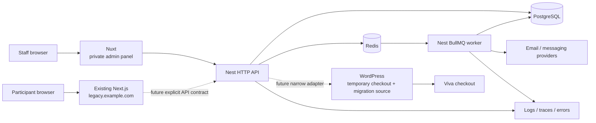

# Architecture

## Core idea

The application is a modular monolith with two executable surfaces: a private
Nuxt administration panel and a NestJS backend. The backend runs as separate
HTTP and BullMQ worker processes but shares modules and domain contracts.
PostgreSQL is the source of truth for the operational domain.

The public website, registration and participant-facing journeys belong to the
existing Next.js application at `legacy.example.com`. That application is outside
this repository. It may integrate with the operations backend only through a
future explicit API contract; shared branding is not shared runtime ownership.

The foundation intentionally carries no WordPress URL, token or webhook secret.
Those runtime inputs belong to the future adapter and are added only when its
validated contract, ownership and rotation path exist. The diagram records the
migration boundary, not a currently deployed integration.

## Repository boundaries

| Location                 | Responsibility                                                                      | Must not own                                                                   |
| ------------------------ | ----------------------------------------------------------------------------------- | ------------------------------------------------------------------------------ |
| `apps/web`               | Staff-only admin routes, shell, interaction, presentation and typed API consumption | Public website, registration UI, business invariants or direct database access |
| `apps/backend`           | HTTP contracts, use cases, authorization, jobs and integrations                     | UI state or provider-specific domain models                                    |
| `packages/database`      | PostgreSQL schema, migrations and database client primitives                        | Request/response DTOs or UI types                                              |
| `packages/design-tokens` | Shared visual tokens                                                                | Business data or backend dependencies                                          |

## Deployment units

- `web`: client-rendered Nuxt administration panel. It is private, non-indexable and deployed independently from `legacy.example.com`.
- `api`: Nest HTTP process. It validates input, enforces authorization and commits business state.
- `worker`: Nest application context consuming BullMQ queues. It must be independently deployable and horizontally scalable.
- `postgres`: durable product data and business audit events.
- `redis`: disposable queue coordination. It is not a business source of truth.

## Domain direction

The target entities come from the approved product contracts, not from WordPress tables:

- Participant and Consent
- Booking and PaymentLedgerEntry
- Event and Venue
- Table and TableAssignment
- Attendance
- Message
- Feedback and SafetyReport
- AuditEvent

These are a migration target, not permission to generate thirteen empty CRUD modules. Add them by vertical slice after field/status contracts are confirmed.

## Non-negotiable invariants

- Paid state is derived from verified, immutable ledger entries. A mutable `paid` boolean is not accounting.
- A booking is independent of an event/table assignment.
- A table has an enforced capacity and lifecycle; member arrays are not serialized into one column.
- Sensitive safety data is separated from ordinary feedback and has stricter access rules.
- State transitions that affect participants, money or outbound communication create an application audit event.
- Queue handlers are idempotent and retries are expected.
- External providers are adapters. Their payloads do not become the domain schema.

## Explicitly deferred

- Microservices and an event bus
- CQRS/event sourcing
- A generic repository framework
- A second CMS
- Automated WhatsApp/Viber sends before the approved human-review workflow exists
