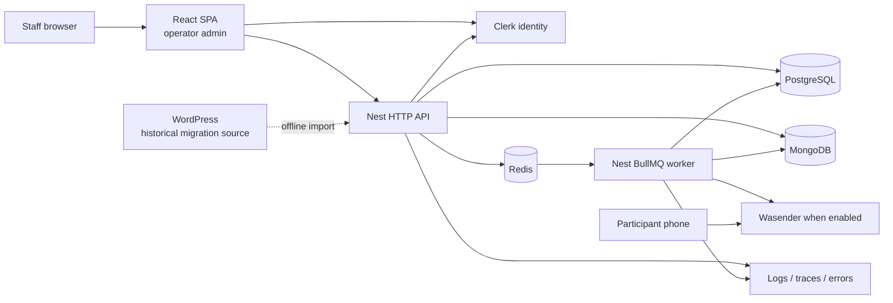

# Architecture

Boundary map only. Runtime detail lives in the handbooks linked below.

## Core idea

**Slopform** is a private operator system: staff configure a research campaign
and questions, AI-guided WhatsApp conversations collect answers, and the admin
surface manages delivery, transcripts, review, outbox state, retries,
idempotency, queues and summaries. It is not a public SaaS or an anonymous
bulk-messaging interface. Public name:
[ADR 0014](decisions/0014-public-slopform-identity.md).

Modular monolith: private React admin (`apps/admin`) + NestJS backend
(`apps/backend`) as separate HTTP and BullMQ worker processes sharing modules
and contracts. PostgreSQL owns relational business, audit, outbox and delivery.
MongoDB owns conversation aggregates and ordered turns. Redis is disposable
queue coordination, not a business source of truth.

The participant channel for this product is WhatsApp (Wasender, gated by an
operator-managed participant opt-in). This
tree was originally the Join The Six operator stack; a separate Next.js public
site and WordPress checkout lived outside the repo
([ADR 0004](decisions/0004-admin-only-boundary.md),
[ADR 0002](decisions/0002-wordpress-boundary.md)). Those remain historical
ownership decisions. WordPress is still an offline migration source (WXR / JSON
import); this repo carries no WordPress URL, token or webhook secret.

## Repository boundaries

| Location                 | Owns                                                         | Must not own                                                                  |
| ------------------------ | ------------------------------------------------------------ | ----------------------------------------------------------------------------- |
| `apps/admin`             | Staff routes, shell, presentation, typed API consumption     | Public marketing site, registration UI, business invariants, direct DB access |
| `apps/backend`           | HTTP contracts, use cases, authorization, jobs, integrations | UI state or provider-specific domain models                                   |
| `packages/database`      | PostgreSQL schema, migrations, DB client primitives          | Request/response DTOs or UI types                                             |
| `packages/design-tokens` | Shared visual tokens                                         | Business data or backend dependencies                                         |

## Deployment units

`web` (Caddy SPA behind native nginx), `api`, `worker`, `migrate`, `postgres`,
`mongo`, `redis`. Topology, env/secret boundaries, deploy/rollback and backup
use example hosts only (`slopform.example.com`, RFC 5737 addresses,
`/opt/slopform`): [deployment.md](deployment.md).

## Domain direction

Target entities (from product contracts, not WordPress tables): Participant,
Consent, Booking, PaymentLedgerEntry, Event, Venue, Table, TableAssignment,
Attendance, Message, Feedback, SafetyReport, AuditEvent. Migration target, not
permission to generate empty CRUD — add by vertical slice after contracts are
confirmed. Cutover path: [migration-strategy.md](migration-strategy.md),
[ADR 0002](decisions/0002-wordpress-boundary.md).

## Non-negotiable invariants

- Paid state from verified immutable ledger entries — not a mutable `paid` flag.
- Booking independent of event/table assignment; table capacity/lifecycle
  enforced (no serialized member arrays).
- Safety data separated from ordinary feedback; stricter access.
- Transitions affecting participants, money or outbound comms write audit events.
- Queue handlers idempotent; retries expected. Providers are adapters — their
  payloads are not the domain schema.
- Mongo conversation state does not replace Postgres audit/outbox/delivery;
  cross-store workflows name recovery direction
  ([ADR 0007](decisions/0007-mongodb-conversation-authority.md)).
- Clerk proves identity; API authorizes the subject against admin policy. A
  browser route guard is not a permission boundary
  ([authentication](backend/mechanisms/authentication.md)).

## Explicitly deferred

- Microservices / event bus, CQRS/event sourcing, generic repository framework,
  a second CMS, Viber.
- Automated WhatsApp has durable conversation, audit, outbox/retry and
  participant-eligibility gates. Legal consent evidence and provider approval
  remain deployment responsibilities; `TRANSPORT_MODE=wasender` merely enables
  the adapter ([wasender](backend/mechanisms/wasender.md),
  [post-event feedback](backend/modules/post-event-feedback.md)).

## Read next

| Concern                          | Doc                                                                                                              |
| -------------------------------- | ---------------------------------------------------------------------------------------------------------------- |
| Nest, pools, jobs, observability | [backend.md](backend.md)                                                                                         |
| Admin UI, theming, components    | [frontend.md](frontend.md), [components](frontend/components/README.md)                                          |
| Containers / VPS                 | [deployment.md](deployment.md)                                                                                   |
| Feedback orchestration           | [ADR 0013](decisions/0013-state-driven-feedback-orchestration.md)                                                |
| Generated HTTP client            | [ADR 0009](decisions/0009-generated-api-client.md), [ADR 0010](decisions/0010-generated-client-not-committed.md) |
| Public identity                  | [ADR 0014](decisions/0014-public-slopform-identity.md)                                                           |
| Handbook index                   | [docs/README.md](README.md)                                                                                      |
