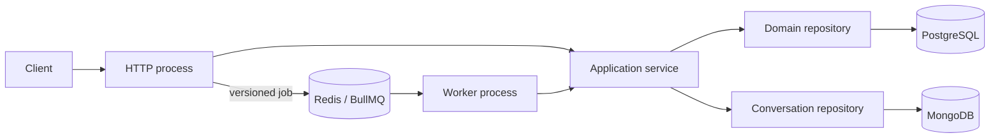

# Backend foundation

Last verified: **2026-07-25**.

The backend is a NestJS modular monolith on Node.js 24 LTS. HTTP and background
jobs are separate processes built from the same domain modules. PostgreSQL is
the system of record for relational business, audit, outbox and delivery data;
MongoDB is authoritative for conversation aggregates; Redis/BullMQ provides
asynchronous delivery.

## Compatibility boundary

Package manifests pin exact versions. Upgrade coupled foundations together and
rerun the focused integration smokes, not just the compiler.

| Area               | Versions                                                                                   | Constraint                                                                            |
| ------------------ | ------------------------------------------------------------------------------------------ | ------------------------------------------------------------------------------------- |
| Runtime and tools  | Node `>=24.11 <25`; TypeScript `6.0.3`; `@types/node` `24.13.3`; Vitest `4.1.10`           | Production remains on Node 24 LTS. TypeScript 7 is not the stable compiler line.      |
| Nest and HTTP      | Nest `11.1.28`; Express `5.2.1`; config `4.0.4`; Swagger `11.4.6`                          | Keep Nest core/platform patches aligned. Express is supplied by the platform package. |
| Persistence        | Drizzle ORM `0.45.2`; Kit `0.31.10`; `pg` `8.22.0`; MongoDB driver `7.5.0`                 | PostgreSQL owns relational guarantees; MongoDB owns conversation aggregates.          |
| Queues             | `@nestjs/bullmq` `11.0.4`; BullMQ `5.80.10`; Bull Board `8.1.2`                            | BullMQ OSS only; all Bull Board packages use one version.                             |
| Contracts and edge | Zod `4.4.3`; `nestjs-zod` `5.4.0`; Helmet `8.3.0`                                          | Zod is the single runtime/API contract source.                                        |
| Authentication     | Clerk Express `2.1.44`                                                                     | Session verification plus a server-owned admin subject allowlist.                     |
| Logging            | Pino `10.3.1`; `pino-http` `11.0.0`; `nestjs-pino` `4.6.1`; `pino-pretty` `13.1.3`         | Pretty output is development-only.                                                    |
| Telemetry          | OTel API `1.9.1`; SDK/exporter `0.220.0`; auto-instrumentations `0.78.0`; Sentry `10.67.0` | Configure OTLP or Sentry, never both. Keep the OTel `0.220` cohort aligned.           |
| Runtime peers      | `dotenv` `17.4.2`; `reflect-metadata` `0.2.2`; RxJS `7.8.2`                                | These remain direct dependencies because the runtime imports or requires them.        |
| AI generation      | AI SDK `7.0.35`; OpenAI provider `4.0.18`; OpenRouter provider `3.0.0`                     | Provider calls run only in the worker; SDK retries are disabled in favor of BullMQ.   |

Registry metadata, installed peer manifests, releases, production advisories and
licenses were checked on **2026-07-22**. The resolved production tree contained
only permissive licenses and no reported production advisory. Recheck on every
upgrade; a dated scan is evidence, not a force field.

The OTel SDK/exporter remain on `0.220.0` because auto-instrumentations `0.78.0`
depends on that cohort; forcing `0.221.x` would load mixed experimental SDK
lines. `@types/node` remains on Node 24 while production does. TypeScript stays
on 6.0.3 until the stable 7.x compiler and its ecosystem support this build.

## Runtime topology



`main-http.ts` owns controllers, the HTTP edge, liveness/readiness, queue
producers and optional Bull Board. `main-worker.ts` creates a standalone Nest
context with processors and no listener. They scale and terminate independently.

`createHttpApplication()` and `createWorkerApplication()` are the executable
composition seams. Entrypoints only start them and own fatal startup cleanup:
capture once, close any created context, emit one redacted fatal event, flush
telemetry and exit non-zero. Each factory publishes its created context to the
entrypoint before post-creation configuration so failures in that phase still
close the context.

Validated configuration is global. Database and named queue providers are not;
consumers import their owning module so dependency edges stay visible. HTTP-only
exception/Sentry plumbing is absent from the worker graph.

## Source map

| Concern                               | Source                                                                                            |
| ------------------------------------- | ------------------------------------------------------------------------------------------------- |
| Process composition                   | `apps/backend/src/{http-app,worker-app}.module.ts`, `bootstrap-*.ts`, `main-*.ts`                 |
| Runtime configuration and HTTP policy | `apps/backend/src/infrastructure/config/`                                                         |
| Pool and transaction lifecycle        | `apps/backend/src/infrastructure/database/`, `packages/database/src/client.ts`                    |
| Conversation-store lifecycle          | `apps/backend/src/infrastructure/mongo/`, `apps/backend/src/modules/conversations/`               |
| Schema and deployment SQL             | `packages/database/src/schema/`, `packages/database/drizzle/`                                     |
| Queues, readiness and dashboard       | `apps/backend/src/infrastructure/queue/`, `infrastructure/readiness.ts`                           |
| Logging and telemetry                 | `apps/backend/src/infrastructure/logging/`, `infrastructure/observability/`, `instrumentation.ts` |
| Business audit                        | `apps/backend/src/infrastructure/audit/`, `packages/database/src/schema/audit-events.ts`          |
| Participant profile/import            | `apps/backend/src/modules/participants/`, `packages/database/src/schema/participants.ts`          |
| Stub events and attendance            | `apps/backend/src/modules/events/`, `packages/database/src/schema/events.ts`                      |
| Email delivery                        | `apps/backend/src/modules/email/`, `packages/database/src/schema/email-deliveries.ts`             |
| Published API contract                | `apps/backend/src/infrastructure/openapi/`, `src/cli/emit-openapi.ts`, `apps/backend/openapi/`    |
| Domain examples                       | `apps/backend/src/modules/reference/`                                                             |

The `reference` module is a disposable executable pattern. Its HTTP adapter is
present only when `REFERENCE_MODULE_ENABLED=true`; its worker stays registered
to drain jobs accepted by an earlier release. Copy the useful boundaries for a
real slice, then remove the reference route, queue, processor and table through
a forward migration. Do not turn it into a generic CRUD shrine.

## Adding a vertical slice

1. Define request, response, parameter and job Zod schemas in
   `<domain>.schemas.ts`; derive HTTP DTOs with `createZodDto`.
2. Keep the controller on transport concerns and pass schema-inferred plain
   values to the application service.
3. Put workflow order, invariants, transport-neutral errors and transaction
   scope in the service.
4. Put explicit persistence queries in a domain repository. Use Drizzle for
   PostgreSQL and the conversation repository for MongoDB; expose neither
   client to controllers. Pass PostgreSQL transactions in, and do not create
   pools or hidden transactions inside repositories.
5. Export the smallest useful surface from one domain module. Split Core/HTTP/
   Worker modules only when one use case genuinely serves both process graphs.
6. Import HTTP adapters only from `HttpAppModule` and processors only from
   `WorkerAppModule`; test the composition boundary.
7. Name every operation with `@ApiOperation({ operationId })` in lower camel
   case, then run `pnpm api:generate` from the repository root and commit the
   regenerated `apps/backend/openapi/openapi.json` and admin client with the
   change. `pnpm api:check` fails the repository check on drift.

Introduce an interface only for a real external/multi-adapter port. TypeScript
does not need an interface/class wedding ceremony for every provider.

## Mechanism contracts

- [Database lifecycle and migrations](backend/mechanisms/database.md) owns pool
  bounds, transaction responsibility, schema/migration rules and test data.
- [MongoDB lifecycle](backend/mechanisms/mongodb.md) owns conversation-store
  connection, readiness, indexes, security, document limits and backup.
- [Queues and workers](backend/mechanisms/queues.md) owns process connections,
  envelopes, retry/retention, idempotency, outbox requirements and operations.
- [Runtime operations](backend/mechanisms/runtime-operations.md) owns the HTTP
  edge, configuration, logging, tracing and startup/shutdown failure behavior.
- [Admin authentication](backend/mechanisms/authentication.md) owns Clerk
  session verification, the private-by-default guard and staff authorization.
- [API contract and generated client](backend/mechanisms/api-contract.md) owns
  the emitted OpenAPI document, operation naming and the generated admin client.
- [Wasender integration](backend/mechanisms/wasender.md) owns the optional
  WhatsApp provider client, signed webhook and normalized transport events.
- [Module inventory](backend/modules/README.md) records durable product module
  boundaries. Cross-cutting behavior does not belong there.

Three invariants span those pages:

- A business mutation and its audit event share one PostgreSQL transaction.
  Runtime telemetry is not a durable business audit log.
- A deterministic BullMQ ID suppresses a queued duplicate only while retained.
  Critical commit-to-enqueue delivery needs an outbox, and side effects still
  need durable idempotency.
- Exactly one tracing SDK instruments a process. Logs, traces, errors, job data
  and audit context must exclude secrets and unnecessary personal data.

## Environment and operation

`apps/backend/.env.example` is the backend variable inventory. Local direct
commands load `.env`; production does not. `DATABASE_URL` and a database-scoped
`MONGODB_URI` are required. The Zod contract supplies defaults for host/port,
origins, pool size, Redis, logging and telemetry sampling, and guards optional
telemetry, Bull Board and reference module settings. Production external Mongo
connections require authentication and verified TLS. The HTTP graph
additionally requires matching Clerk keys and at least one
`CLERK_ADMIN_USER_IDS` entry; the worker can start without them. Production
browser origins require HTTPS.

Wasender is opt-in. Its session key enables a controller-free provider module
only in the worker graph. Its public webhook module is separately gated by
`WASENDER_WEBHOOK_ENABLED` and a validated shared secret in the HTTP graph.

`AppConfigModule` parses the complete environment through the single Zod
contract while Nest creates the HTTP or worker application, before either
process listens or consumes jobs. Instrumentation parses its deliberately
smaller observability subset before an SDK starts. Add variables to these
contracts rather than scattering `process.env` reads through providers.

Start HTTP and worker together with `dev`, or separately with `dev:http` and
`dev:worker`. Production uses `start:http` and `start:worker` as separate
processes. Backend and database `build` commands remove their own `dist/` first
so deleted sources cannot survive as deployable JavaScript; watch compilation
remains incremental.

```bash
pnpm --filter @join-the-six/database db:generate --name=<meaningful_name>
pnpm --filter @join-the-six/database db:check
pnpm --filter @join-the-six/database db:migrate

pnpm --filter @join-the-six/database lint
pnpm --filter @join-the-six/database typecheck
pnpm --filter @join-the-six/database test
pnpm --filter @join-the-six/database build
pnpm --filter @join-the-six/backend lint
pnpm --filter @join-the-six/backend typecheck
pnpm --filter @join-the-six/backend test
pnpm --filter @join-the-six/backend build
```

Use pure unit tests for schemas, invariants and orchestration. Use real,
disposable PostgreSQL/Redis for adapter semantics, with bounded waits and exact
cleanup. MongoDB lifecycle and repository unit tests inject bounded fakes and
never silently require a developer server; run a separately provisioned
integration smoke when changing driver/server semantics. HTTP contract tests
boot `createHttpApplication()` and assert responses plus OpenAPI; worker
composition tests boot and close
`createWorkerApplication()`. Mocking Drizzle chains or BullMQ internals mostly
tests creative writing.

For an HTTP contract test, set the smallest valid environment before importing
the application module, call `createHttpApplication()`, replace only the owning
repository method through `app.get(RepositoryClass)` when isolation is needed,
then `app.init()`. Exercise the real `/api/v1/...` path through the HTTP server
and fetch `/api/openapi.json`; close the application in `afterEach`. Do not
reconstruct a miniature Nest application, repeat the global prefix, or install
validation/interceptors by hand: that test can stay green while production
composition is broken. Use a disposable database instead of a repository stub
when ordering, constraints or transaction semantics are the behavior under test.

## Deliberate exclusions

No microservices, CQRS, event sourcing, generic repositories/base services,
interface-per-class pairs, controller-level Drizzle, duplicate validation
systems, `drizzle-kit push` on shared data, exactly-once queue claims, public
Bull Board, or cross-domain `utils/` drawer.

## Official references

- [Nest modules](https://docs.nestjs.com/modules), [standalone applications](https://docs.nestjs.com/standalone-applications), [configuration](https://docs.nestjs.com/techniques/configuration), [queues](https://docs.nestjs.com/techniques/queues) and [OpenAPI](https://docs.nestjs.com/openapi/introduction)
- [Drizzle PostgreSQL](https://orm.drizzle.team/docs/get-started-postgresql), [transactions](https://orm.drizzle.team/docs/transactions) and [Kit overview](https://orm.drizzle.team/docs/kit-overview)
- [BullMQ idempotent jobs](https://docs.bullmq.io/patterns/idempotent-jobs), [job IDs](https://docs.bullmq.io/guide/jobs/job-ids) and [retries](https://docs.bullmq.io/guide/retrying-failing-jobs)
- [OpenTelemetry Node.js](https://opentelemetry.io/docs/languages/js/getting-started/nodejs/), [package compatibility](https://github.com/open-telemetry/opentelemetry-js#package-version-compatibility) and [Sentry NestJS](https://docs.sentry.io/platforms/javascript/guides/nestjs/)
- [Node release lines](https://nodejs.org/en/about/previous-releases), [TypeScript 7 status](https://devblogs.microsoft.com/typescript/announcing-typescript-7-0/) and [Vitest support](https://vitest.dev/guide/)
