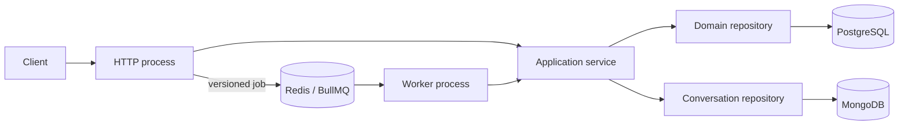

# Backend foundation

Last verified: **2026-08-05**.

NestJS modular monolith on Node.js 24 LTS. HTTP and worker are separate
processes from the same domain modules. PostgreSQL owns relational business,
audit, outbox and delivery data; MongoDB owns conversation aggregates;
Redis/BullMQ owns asynchronous delivery.

Deep contracts live under [mechanisms](backend/mechanisms/README.md) and
[modules](backend/modules/README.md). This page is the agent entry: topology,
ownership, compatibility pins, env and test recipes.

## Compatibility boundary

Package manifests pin exact versions. Upgrade coupled foundations together and
rerun focused integration smokes, not just the compiler.

| Area               | Versions                                                                                   | Constraint                                                               |
| ------------------ | ------------------------------------------------------------------------------------------ | ------------------------------------------------------------------------ |
| Runtime and tools  | Node `>=24.11 <25`; TypeScript `6.0.3`; `@types/node` `24.13.3`; Vitest `4.1.10`           | Production stays on Node 24 LTS; TypeScript 7 is not the stable line.    |
| Nest and HTTP      | Nest `11.1.28`; Express `5.2.1`; config `4.0.4`; Swagger `11.4.6`                          | Keep Nest core/platform patches aligned; Express comes from the platform. |
| Persistence        | Drizzle ORM `0.45.2`; Kit `0.31.10`; `pg` `8.22.0`; MongoDB driver `7.5.0`                 | PostgreSQL for relational guarantees; MongoDB for conversation aggregates. |
| Queues             | `@nestjs/bullmq` `11.0.4`; BullMQ `5.80.10`; Bull Board `8.1.2`                            | BullMQ OSS only; all Bull Board packages share one version.              |
| Contracts and edge | Zod `4.4.3`; `nestjs-zod` `5.4.0`; Helmet `8.3.0`                                          | Zod is the single runtime/API contract source.                           |
| Authentication     | Clerk Express `2.1.44`                                                                     | Session verification plus a server-owned admin allowlist.                |
| Logging            | Pino `10.3.1`; `pino-http` `11.0.0`; `nestjs-pino` `4.6.1`; `pino-pretty` `13.1.3`         | Pretty output is development-only.                                       |
| Telemetry          | OTel API `1.9.1`; SDK/exporter `0.220.0`; auto-instrumentations `0.78.0`; Sentry `10.67.0` | Configure OTLP or Sentry, never both; keep the OTel `0.220` cohort.      |
| Runtime peers      | `dotenv` `17.4.2`; `reflect-metadata` `0.2.2`; RxJS `7.8.2`                                | Direct deps because the runtime imports them.                            |
| AI generation      | AI SDK `7.0.35`; OpenAI provider `4.0.18`; OpenRouter provider `3.0.0`                     | Provider calls only in the worker; SDK retries off — BullMQ owns retry.  |

Registry/license scan dated **2026-07-22** found only permissive licenses and no
production advisory; recheck on every upgrade.

## Runtime topology



`main-http.ts` owns controllers, the HTTP edge, liveness/readiness, queue
producers and optional Bull Board. `main-worker.ts` is a standalone Nest context
with processors and no listener. They scale and terminate independently.

`createHttpApplication()` / `createWorkerApplication()` are the composition
seams; entrypoints only start them and own fatal startup cleanup (capture once,
close context, one redacted fatal event, flush telemetry, exit non-zero). Each
factory publishes its context to the entrypoint before post-creation config so
that phase still closes on failure.

Validated configuration is global. Database and named queue providers are not —
consumers import their owning module. HTTP-only exception/Sentry plumbing stays
out of the worker graph. Details:
[runtime-operations](backend/mechanisms/runtime-operations.md),
[queues](backend/mechanisms/queues.md).

## Source map

| Concern                               | Source                                                                                                 |
| ------------------------------------- | ------------------------------------------------------------------------------------------------------ |
| Process composition                   | `apps/backend/src/{http-app,worker-app}.module.ts`, `bootstrap-*.ts`, `main-*.ts`                      |
| Runtime configuration and HTTP policy | `apps/backend/src/infrastructure/config/`                                                              |
| Pool and transaction lifecycle        | `apps/backend/src/infrastructure/database/`, `packages/database/src/client.ts`                         |
| Conversation-store lifecycle          | `apps/backend/src/infrastructure/mongo/`, `apps/backend/src/modules/conversations/`                    |
| Schema and deployment SQL             | `packages/database/src/schema/`, `packages/database/drizzle/`                                          |
| Queues, readiness and dashboard       | `apps/backend/src/infrastructure/queue/`, `infrastructure/readiness.ts`                                |
| Logging and telemetry                 | `apps/backend/src/infrastructure/logging/`, `infrastructure/observability/`, `instrumentation.ts`      |
| Business audit                        | `apps/backend/src/infrastructure/audit/`, `packages/database/src/schema/audit-events.ts`               |
| Participant profile/import            | `apps/backend/src/modules/participants/`, `packages/database/src/schema/participants.ts`               |
| Stub events and attendance            | `apps/backend/src/modules/events/`, `packages/database/src/schema/events.ts`                           |
| Email delivery                        | `apps/backend/src/modules/email/`, `packages/database/src/schema/email-deliveries.ts`                  |
| Durable assistant threads             | `apps/backend/src/modules/assistant/`, `packages/database/src/schema/assistant.ts`                     |
| Post-event feedback                   | `apps/backend/src/modules/post-event-feedback/`, `packages/database/src/schema/post-event-feedback.ts` |
| Liveness and readiness routes         | `apps/backend/src/modules/health/`                                                                     |
| WhatsApp transport                    | `apps/backend/src/integrations/wasender/`                                                              |
| Provider clients and auth plumbing    | `apps/backend/src/infrastructure/ai/`, `apps/backend/src/infrastructure/auth/`                         |
| Published API contract                | `apps/backend/src/infrastructure/openapi/`, `src/cli/emit-openapi.ts`, `apps/backend/openapi/`         |
| Domain examples                       | `apps/backend/src/modules/reference/`                                                                  |

Product domains live under `src/modules/`; external provider boundaries under
`src/integrations/` (`wasender` today). `reference` is a disposable pattern —
HTTP only when `REFERENCE_MODULE_ENABLED=true`; worker stays registered to drain
earlier jobs. Copy boundaries, then remove via forward migration. Module pages:
[modules inventory](backend/modules/README.md).

## Adding a vertical slice

1. Zod schemas in `<domain>.schemas.ts`; HTTP DTOs via `createZodDto`.
2. Controllers stay on transport; pass schema-inferred values to the service.
3. Service owns workflow order, invariants, transport-neutral errors and
   transaction scope.
4. Domain repository owns persistence (Drizzle / conversation repository). No
   clients in controllers; pass PostgreSQL transactions in; no hidden pools.
5. Export the smallest useful surface from one domain module. Split Core/HTTP/
   Worker only when one use case genuinely serves both graphs.
6. Import HTTP adapters only from `HttpAppModule`, processors only from
   `WorkerAppModule`; test the composition boundary.
7. `@ApiOperation({ operationId })` in lower camel case, then
   `pnpm api:generate` and commit regenerated
   `apps/backend/openapi/openapi.json`. `pnpm api:check` fails on drift.

Introduce an interface only for a real external/multi-adapter port. Contract
rules: [api-contract](backend/mechanisms/api-contract.md).

## Mechanism contracts

| Mechanism                                                          | Owns                                                         |
| ------------------------------------------------------------------ | ------------------------------------------------------------ |
| [Database](backend/mechanisms/database.md)                         | Pool, transactions, schema/migrations, test data             |
| [MongoDB](backend/mechanisms/mongodb.md)                           | Conversation-store connection, indexes, limits, backup       |
| [Queues](backend/mechanisms/queues.md)                             | Connections, envelopes, retry/retention, outbox, ops         |
| [Runtime operations](backend/mechanisms/runtime-operations.md)     | HTTP edge, config, logging, tracing, startup/shutdown        |
| [Authentication](backend/mechanisms/authentication.md)             | Clerk sessions, private-by-default guard, staff auth         |
| [API contract](backend/mechanisms/api-contract.md)                 | OpenAPI emission, operation naming, generated admin client   |
| [Wasender](backend/mechanisms/wasender.md)                         | WhatsApp client, signed webhook, normalized transport events |
| [Module inventory](backend/modules/README.md)                      | Durable product module boundaries                            |

Spanning invariants:

- Business mutation and audit event share one PostgreSQL transaction. Runtime
  telemetry is not a durable business audit log.
- A deterministic BullMQ ID suppresses a queued duplicate only while retained.
  Critical commit-to-enqueue needs an outbox; side effects still need durable
  idempotency.
- Exactly one tracing SDK per process. Logs, traces, errors, job data and audit
  context exclude secrets and unnecessary personal data.

## Environment and operation

Inventory: `apps/backend/.env.example`. Local direct commands load `.env`;
production does not. Required: `DATABASE_URL` and a database-scoped
`MONGODB_URI`. Zod supplies defaults for host/port, origins, pool, Redis,
logging and telemetry sampling. Production external Mongo needs auth and
verified TLS. HTTP additionally needs matching Clerk keys and at least one
`CLERK_ADMIN_USER_IDS`; the worker can start without them. Production browser
origins require HTTPS.

`TRANSPORT_MODE`: `disabled` rejects locally; `simulated` writes the durable
test sink (dev default); `wasender` sends through the paced provider. Shared
config accepts `wasender` without a session key so HTTP never needs the
worker-only secret; worker composition fails without `WASENDER_SESSION_API_KEY`.
Webhook module is gated separately by `WASENDER_WEBHOOK_ENABLED` plus a
validated shared secret in the HTTP graph. Full edge/config behavior:
[runtime-operations](backend/mechanisms/runtime-operations.md),
[wasender](backend/mechanisms/wasender.md).

Production is fail-closed: simulated transport and its HTTP surface are rejected
unless `FEEDBACK_PRODUCTION_REHEARSAL_ENABLED=true` with
`TRANSPORT_MODE=simulated` and `FEEDBACK_SIMULATOR_ENABLED=true`. That path
keeps the simulator behind Clerk admin, forbids the extraction stub / Wasender
credentials / webhook, and makes real billable model calls while sending nothing
to WhatsApp. Feedback loop details:
[post-event-feedback](backend/modules/post-event-feedback.md).

`AppConfigModule` parses the full Zod env contract before listen/consume.
Instrumentation parses a smaller observability subset before any SDK starts. Add
variables to those contracts — do not scatter `process.env` reads.

Start both with `dev`, or `dev:http` / `dev:worker`. Production:
`start:http` / `start:worker`. Backend and database `build` wipe `dist/` first;
watch compilation stays incremental.

```bash
pnpm --filter @join-the-six/database db:generate --name=<meaningful_name>
pnpm --filter @join-the-six/database db:check
pnpm --filter @join-the-six/database db:migrate

pnpm --filter @join-the-six/database lint
pnpm --filter @join-the-six/database typecheck
pnpm --filter @join-the-six/database test
pnpm --filter @join-the-six/database build
pnpm --filter @join-the-six/backend lint
pnpm --filter @join-the-six/backend typecheck
pnpm --filter @join-the-six/backend test
pnpm --filter @join-the-six/backend build
```

### Test recipes

- Unit: schemas, invariants, orchestration.
- Adapter semantics: real disposable PostgreSQL/Redis; bounded waits; exact
  cleanup. Do not mock Drizzle chains or BullMQ internals.
- MongoDB lifecycle/repository units: inject bounded fakes; never silently
  require a developer server. Separately provisioned smoke when changing
  driver/server semantics.
- HTTP contract: set smallest valid env before importing the app module →
  `createHttpApplication()` → optionally replace an owning repository via
  `app.get(RepositoryClass)` → `app.init()` → hit real `/api/v1/...` and
  `/api/openapi.json` → `app.close()` in `afterEach`. Do not rebuild a miniature
  Nest app, repeat the global prefix, or hand-install validation/interceptors.
  `app.close()` is the whole teardown ([queues](backend/mechanisms/queues.md)
  settle connections); never drain queues, poll Redis or ignore unhandled
  rejections for a clean exit. Use a disposable DB when ordering/constraints/
  transactions are under test.
- Worker composition: boot and close `createWorkerApplication()`.

## Deliberate exclusions

No microservices, CQRS, event sourcing, generic repositories/base services,
interface-per-class pairs, controller-level Drizzle, duplicate validation
systems, `drizzle-kit push` on shared data, exactly-once queue claims, public
Bull Board, or cross-domain `utils/` drawer.

## Official references

- [Nest modules](https://docs.nestjs.com/modules), [standalone applications](https://docs.nestjs.com/standalone-applications), [configuration](https://docs.nestjs.com/techniques/configuration), [queues](https://docs.nestjs.com/techniques/queues), [OpenAPI](https://docs.nestjs.com/openapi/introduction)
- [Drizzle PostgreSQL](https://orm.drizzle.team/docs/get-started-postgresql), [transactions](https://orm.drizzle.team/docs/transactions), [Kit overview](https://orm.drizzle.team/docs/kit-overview)
- [BullMQ idempotent jobs](https://docs.bullmq.io/patterns/idempotent-jobs), [job IDs](https://docs.bullmq.io/guide/jobs/job-ids), [retries](https://docs.bullmq.io/guide/retrying-failing-jobs)
- [OpenTelemetry Node.js](https://opentelemetry.io/docs/languages/js/getting-started/nodejs/), [package compatibility](https://github.com/open-telemetry/opentelemetry-js#package-version-compatibility), [Sentry NestJS](https://docs.sentry.io/platforms/javascript/guides/nestjs/)
- [Node release lines](https://nodejs.org/en/about/previous-releases), [TypeScript 7 status](https://devblogs.microsoft.com/typescript/announcing-typescript-7-0/), [Vitest support](https://vitest.dev/guide/)
