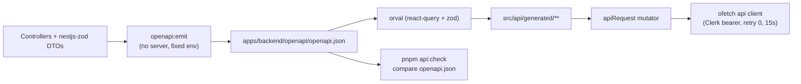

# API contract and generated client

Status: accepted, verified 2026-08-03 with `@nestjs/swagger` 11.4.6,
`nestjs-zod` 5.4.0, orval 8.23.0 and `@tanstack/react-query` 5.101.4.

## Purpose and boundary

One contract crosses the HTTP boundary: the OpenAPI document that
`@nestjs/swagger` builds from controllers and `nestjs-zod` DTOs. This page owns
how that document becomes a committed artifact and how the admin SPA consumes it
as generated, typed functions (local output, not committed).

It owns:

- `apps/backend/src/infrastructure/openapi/openapi-document.ts` — published
  document, fixed emit environment, deterministic serialization;
- `apps/backend/src/cli/emit-openapi.ts` and
  `apps/backend/openapi/openapi.json` — emit command and committed artifact;
- `apps/admin/orval.config.ts`, `apps/admin/openapi.transformer.ts`,
  `apps/admin/src/lib/api-mutator.ts` and `apps/admin/src/api/generated/**` —
  generation contract and output;
- `scripts/verify-generated-api.mjs` — drift check inside `pnpm check`.

It does not own transport policy (`apps/admin/src/lib/api.ts`, see
[Frontend foundation](../../frontend.md)), authorization
([authentication](authentication.md)) or the HTTP edge
([runtime operations](runtime-operations.md)).

## Contract

| Artifact                            | Produced by                                  | Consumed by                                    |
| ----------------------------------- | -------------------------------------------- | ---------------------------------------------- |
| `apps/backend/openapi/openapi.json` | `pnpm openapi:emit`                          | orval, contract review, external integrators   |
| `src/api/generated/<tag>.ts`        | `pnpm api:generate` (gitignored)             | admin routes and components                    |
| `src/api/generated/model/*.ts`      | `pnpm api:generate` (gitignored)             | request/response types                         |
| `src/api/generated/zod/*.zod.ts`    | `pnpm api:generate` (gitignored)             | validation of values that leave the typed path |
| `/api/openapi.json` (runtime)       | `createHttpApplication()` outside production | Swagger UI at `/api/docs`, inspection          |

| Command             | Effect                                                                  |
| ------------------- | ----------------------------------------------------------------------- |
| `pnpm openapi:emit` | Builds the backend through Turbo, rewrites the committed document       |
| `pnpm api:generate` | Emits the document and regenerates the admin client                     |
| `pnpm api:check`    | Regenerates and fails when `openapi.json` changed; part of `pnpm check` |

Every operation declares `@ApiOperation({ operationId })` in lower camel case.
Orval derives the function (`getAuthSession`), hook (`useGetAuthSession`),
query-key helper (`getGetAuthSessionQueryKey`) and Zod schema
(`GetAuthSessionResponse`) from it. Nest's default `AuthController_session`
form is rejected by test.

### Event venue

Event create/update DTOs and list/detail responses publish one nested nullable
`venue`. Participant event history reuses the same view.

| Field             | Contract                                                               |
| ----------------- | ---------------------------------------------------------------------- |
| `provider`        | Required literal `google`                                              |
| `placeId`         | Required, trimmed, non-empty; no arbitrary max length                  |
| `label`           | Required operator-confirmed display label                              |
| `type`, `area`    | Optional trimmed context                                               |
| `priceLevel`      | Optional `free\|inexpensive\|moderate\|expensive\|very_expensive`      |
| `priceRange`      | Optional `{ startMinor, endMinor?, currencyCode }` (exact minor units) |
| `useInFeedback`   | Required boolean intent flag                                           |
| `contextRevision` | Positive server-owned integer; only on a non-null response venue       |

`startMinor` is non-negative; optional `endMinor` cannot precede it;
`currencyCode` is three uppercase letters. Optional fields are omitted, not
`null`. Clients never send `contextRevision`.

Venue patch is whole-object replacement: omit leaves venue and revision
unchanged; `null` clears; an object replaces every field. Each explicit
object/null mutation atomically increments the event-level revision (including
clear). Finished events allow venue mutation but reject title/start changes;
cancelled events reject the patch. Creation without a venue stores revision
`0`; with a venue returns `contextRevision: 1`.

This stores an operator-confirmed reference only — no Google lookup. Audit
payloads must not include `label`, `placeId` or address-like text.
`useInFeedback` is forward-looking intent; feedback and Luna do not consume
venue yet.

### Assistant turn artifacts

Turn responses carry `toolCalls` on every lifecycle state and nullable final
`usage` (provider token breakdown, integer `estimatedCostEurMicros`, nullable
dated `pricingVersion`). `reasoning` is nullable on any state. The handwritten
assistant client mirrors these fields; the committed OpenAPI document remains
the HTTP authority. See [apps/admin/AGENTS.md](../../../apps/admin/AGENTS.md).

## Flow

## Invariants

- Emit applies `OPENAPI_EMIT_ENVIRONMENT` before importing the application
  module, then sorts object keys — local `.env` cannot change the artifact.
- Published composition is the default: Wasender webhook, reference module, Bull
  Board and feedback simulator are off.
- Runtime-served and committed documents both come from
  `createOpenApiDocument()`; a backend test asserts byte identity.
- Generated code is never edited: orval header, ESLint-excluded, gitignored,
  still typechecked after generation.
- `apiRequest` is the only bridge to HTTP and adds no policy; auth, retries and
  timeouts stay in `api.ts`.
- Published paths keep the `/api` mount; `openapi.transformer.ts` strips it
  because `env.apiBase` owns it. Paths outside `/api/` fail generation.

## Failure states

| Situation                                    | Behavior                                                                      |
| -------------------------------------------- | ----------------------------------------------------------------------------- |
| Controller changed, artifact not regenerated | `pnpm api:check` regenerates, lists the diff and fails; `pnpm test` fails too |
| Generated client edited by hand              | Next generation overwrites it                                                 |
| Operation without explicit `operationId`     | OpenAPI document test fails                                                   |
| Backend unbuildable                          | `pnpm api:check` fails without touching the artifact                          |
| Request fails at runtime                     | Hook reports `isError`; the screen owns denial/retry/failure                  |

`pnpm api:check` leaves regenerated files in place: review and commit
`openapi.json`, never hand-edit generated output.

## Extension points

1. Change controller, Zod schemas and DTOs; declare `operationId` for new ops.
2. Run `pnpm api:generate`; commit `openapi.json` with the backend change.
3. Consume the generated hook. Do not hand-write a response schema the document
   already describes.

Feedback operator read models do not derive business state from BullMQ.
`getFeedbackConversation` projects automation from MongoDB work plus an active
PostgreSQL execution lease; `getFeedbackOutboxMessage` projects dispatch from
PostgreSQL claim/send markers. Collection endpoints must not do per-row MongoDB
reads — outbox lists batch respondents via `listRespondentsByIds`.

**Append-only collections page by keyset, not offset.**
`listFeedbackOutboxHistory` takes an opaque `cursor`, returns `nextCursor`, and
scopes `total` to the active filter. An unreadable cursor rewinds to the newest
page (not 400). Observability endpoints publish absence as absence — nullable
claim, provider id or delivery timestamp stay nullable. See
[outbound queue](../../frontend/feedback-outbound-queue.md).

Generated Zod schemas are for values that leave the typed path (form drafts,
browser persistence, echoed payloads). Import from `src/api/generated/zod/`.
The assistant screen is the one documented exception for hand-written client
semantics; do not copy that pattern for ordinary CRUD.

## Operations and tests

- `openapi-document.spec.ts` — real HTTP composition vs committed artifact,
  unique operation ids, `/api/v1` prefix, deterministic serialization.
- `apps/admin/test/generated-api-client.spec.ts` — path transformer, one hook
  per operation, mutator routing, admin gate, single `QueryClientProvider`.
- `pnpm api:check` sits between `docs:check` and `typecheck` in `pnpm check`.
  Admin Turbo tasks depend on `api:generate`.
- Emit opens no port and needs no live dependency. Eager Redis clients may log
  `ECONNREFUSED` when Redis is absent; generation must still succeed.
  `onModuleInit` (database pool) does not run.

## Decisions and references

- [ADR 0009](../../decisions/0009-generated-api-client.md),
  [ADR 0010](../../decisions/0010-generated-client-not-committed.md)
- [Frontend foundation](../../frontend.md), [Backend foundation](../../backend.md)
- [Nest OpenAPI](https://docs.nestjs.com/openapi/introduction),
  [orval](https://orval.dev/reference/configuration/overview),
  [TanStack Query v5](https://tanstack.com/query/latest/docs/framework/react/overview)
