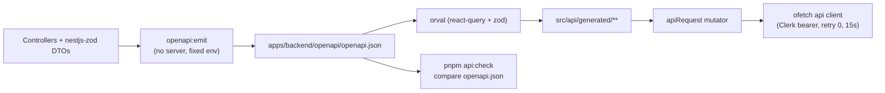

# API contract and generated client

Status: accepted, verified 2026-08-02 with `@nestjs/swagger` 11.4.6,
`nestjs-zod` 5.4.0, orval 8.23.0 and `@tanstack/react-query` 5.101.4.

## Purpose and boundary

One contract crosses the HTTP boundary: the OpenAPI document that
`@nestjs/swagger` builds from the controllers and their `nestjs-zod` DTOs. This
page owns how that document becomes a committed artifact and how the admin SPA
consumes it as generated, named, typed functions that are produced locally and
not committed.

It owns:

- `apps/backend/src/infrastructure/openapi/openapi-document.ts` — the single
  definition of the published document, its fixed emit environment and its
  deterministic serialization;
- `apps/backend/src/cli/emit-openapi.ts` and `apps/backend/openapi/openapi.json`
  — the emit command and the committed artifact;
- `apps/admin/orval.config.ts`, `apps/admin/openapi.transformer.ts`,
  `apps/admin/src/lib/api-mutator.ts` and `apps/admin/src/api/generated/**` —
  the generation contract and its output;
- `scripts/verify-generated-api.mjs` — the drift check inside `pnpm check`.

It does not own transport policy (that is `apps/admin/src/lib/api.ts`, see
[Frontend foundation](../../frontend.md)), authorization (see
[Admin authentication](authentication.md)) or the HTTP edge configuration (see
[Runtime operations](runtime-operations.md)).

## Contract

| Artifact                            | Produced by                                  | Consumed by                                  |
| ----------------------------------- | -------------------------------------------- | -------------------------------------------- |
| `apps/backend/openapi/openapi.json` | `pnpm openapi:emit`                          | orval, contract review, external integrators |
| `src/api/generated/<tag>.ts`        | `pnpm api:generate` (gitignored)             | admin routes and components                  |
| `src/api/generated/model/*.ts`      | `pnpm api:generate` (gitignored)             | response and request types                   |
| `src/api/generated/zod/*.zod.ts`    | `pnpm api:generate` (gitignored)             | hand-rolled validation of a value we persist |
| `/api/openapi.json` (runtime)       | `createHttpApplication()` outside production | Swagger UI at `/api/docs`, manual inspection |

Commands, all from the repository root:

| Command             | Effect                                                                  |
| ------------------- | ----------------------------------------------------------------------- |
| `pnpm openapi:emit` | Builds the backend through Turbo, then rewrites the committed document  |
| `pnpm api:generate` | Emits the document and regenerates the admin client from it             |
| `pnpm api:check`    | Regenerates and fails when `openapi.json` changed; part of `pnpm check` |

Operation names are the public API. Every operation declares
`@ApiOperation({ operationId })` in lower camel case; orval derives the exported
function (`getAuthSession`), the hook (`useGetAuthSession`), the query-key helper
(`getGetAuthSessionQueryKey`) and the Zod schema (`GetAuthSessionResponse`) from
it. Nest's default `AuthController_session` is rejected by a test, because it
leaks a class name into the client and renames itself during refactors.

### Event venue contract

Event create/update DTOs and event list/detail responses publish one nested,
nullable `venue`. Participant `GET /api/v1/participants/:id/events` history
items reuse the same full nullable response view.

| Field             | Request and response contract                                             |
| ----------------- | ------------------------------------------------------------------------- |
| `provider`        | Required literal `google`                                                 |
| `placeId`         | Required, trimmed, non-empty Google place id; no arbitrary maximum length |
| `label`           | Required operator-confirmed display label                                 |
| `type`, `area`    | Optional trimmed context                                                  |
| `priceLevel`      | Optional `free\|inexpensive\|moderate\|expensive\|very_expensive`         |
| `priceRange`      | Optional `{ startMinor, endMinor?, currencyCode }` exact minor-unit range |
| `useInFeedback`   | Required boolean intent flag                                              |
| `contextRevision` | Positive server-owned integer, present only in a non-null response venue  |

`startMinor` is a non-negative integer, optional `endMinor` cannot precede it,
and `currencyCode` is exactly three uppercase letters. Optional venue fields are
omitted rather than serialized as `null`. Clients never send
`contextRevision`.

Venue patch semantics are whole-object replacement: omitting `venue` leaves it
and its revision unchanged, `venue: null` clears it, and a venue object replaces
every field. Each explicit object/null mutation atomically increments the
event-level revision, including clear, re-add, equivalent replacement, price or
`useInFeedback` changes; clearing never resets it. A finished event permits this
venue mutation while rejecting title/start changes. A cancelled event rejects
the patch entirely. Creation without a venue stores revision `0`; creation with
a venue returns `contextRevision: 1`.

This contract stores an operator-confirmed reference. It performs no Google
lookup/geocoding and introduces no Google API dependency. `useInFeedback` is
forward-looking persisted intent; neither post-event feedback nor Luna consumes
the venue yet. Audit payloads must not include `label`, `placeId` or address-like
text.

## Flow

## Invariants

- The emitted artifact is a function of source code alone. `emit-openapi.ts`
  applies `OPENAPI_EMIT_ENVIRONMENT` before importing the application module, so
  a developer's `.env` cannot change the published contract, and every object key
  is sorted before serialization so a new route produces a local diff.
- The published composition is the default one: the Wasender webhook, the
  reference module, Bull Board and the feedback dev simulator are off. Promoting
  one of them to a product surface means publishing it deliberately in that
  environment.
- The document the running process serves and the committed artifact are built by
  the same `createOpenApiDocument()`; a backend test asserts they are identical
  byte for byte.
- Generated code is never edited. It carries an orval header, is excluded from
  ESLint (so no autofix rewrites a file the next run overwrites), is gitignored,
  and is still typechecked by `tsc` after generation.
- `apiRequest` is the only bridge between generated code and HTTP, and it adds no
  policy of its own — authentication, retries and timeouts stay in `api.ts`.
- Published paths keep the `/api` mount point; `openapi.transformer.ts` removes
  it at generation time because the client's `baseURL` (`env.apiBase`) owns it.
  A path outside `/api/` fails generation instead of silently producing a broken
  URL.

## Failure states

| Situation                                    | Behavior                                                                                           |
| -------------------------------------------- | -------------------------------------------------------------------------------------------------- |
| Controller changed, artifact not regenerated | `pnpm api:check` regenerates, lists the changed `openapi.json` and fails; `pnpm test` fails too    |
| Generated client edited by hand              | The next generation overwrites it; the client is not a review surface                              |
| Operation without an explicit `operationId`  | The OpenAPI document test fails before a class-derived hook name can reach the client              |
| Backend unbuildable                          | `pnpm api:check` prints the Turbo output and fails without touching the artifact                   |
| Request fails at runtime                     | The hook reports `isError`; the screen owns the denial/retry/failure state, as `RequireAdmin` does |

`pnpm api:check` leaves the regenerated files in place: a contract failure is an
instruction to review and commit `openapi.json`, never to hand-edit generated
files. The admin client is produced locally and is not committed.

## Extension points

Adding or changing an endpoint:

1. Change the controller, its Zod schemas and DTOs; declare
   `@ApiOperation({ operationId })` for a new operation.
2. Run `pnpm api:generate`; commit `openapi.json` with the backend change. The
   admin client is regenerated locally and is not committed.
3. Consume the new hook in the admin app. Do not write a Zod schema for a
   response that the document already describes.

Queue-derived fields on a read model are allowed only when the endpoint is not
polled as a collection. `getFeedbackConversation` may inspect BullMQ for the
selected conversation's extract job, and `getFeedbackOutboxMessage` for the one
opened outbox row's deliver job; `listFeedbackCampaignConversations` and
`listFeedbackOutboxQueue` and `listFeedbackOutboxHistory` must not — a Redis
lookup per row on a five- or ten-second poll is a load amplifier, and any list
signal has to come from data already loaded for the row. The rule extends past
Redis: a collection endpoint must not do a per-row MongoDB read either, which is
why both outbox lists resolve a whole page of respondents through one batched
`listRespondentsByIds`.

**A collection over an append-only table is paged by keyset, not offset.**
`message_outbox` is written to while an operator reads it, so `OFFSET` repeats
rows already shown and skips ones that were not. `listFeedbackOutboxHistory`
takes an opaque `cursor` carrying its own sort key, returns `nextCursor` rather
than a page count, and scopes `total` to the active filter so the number above a
page cannot describe a different set of rows. A cursor the server did not write
rewinds to the newest page instead of answering 400: it arrives from a URL a
person can edit, and the endpoint only reads.

An observability endpoint publishes absence as absence. Where a queue lookup
cannot distinguish retention removal from a job that never existed, the field
stays `null` or `unknown` and the screen owns the wording; see
[the outbound queue](../../frontend/feedback-outbound-queue.md).

The generated Zod schemas exist for values that leave the typed path — a form
draft, something persisted in the browser, a payload echoed back into a request.
Import them from `src/api/generated/zod/`; do not hand-copy a backend schema.

The assistant (`features/assistant/`) still parses responses and SSE frames with
hand-written schemas because its authenticated stream plus durable polling owns
attempt-fenced client semantics beyond a response shape. Events and participants
screens consume the generated hooks; new code does not copy the assistant
pattern for ordinary CRUD.

## Operations and tests

- `apps/backend/src/infrastructure/openapi/openapi-document.spec.ts` — boots the
  real HTTP composition, compares the document with the committed artifact,
  requires explicit unique operation ids, requires the `/api/v1` prefix and
  asserts deterministic serialization.
- `apps/admin/test/generated-api-client.spec.ts` — the path transformer, one hook
  per published operation, every generated file routed through the mutator, the
  admin gate on the generated hook and the single `QueryClientProvider`.
- `pnpm api:check` runs between `docs:check` and `typecheck` in `pnpm check`, so
  the compiler, linter and tests always read a current client. Admin Turbo tasks
  also depend on `api:generate`.
- Emitting opens no port and contacts no dependency: `NestFactory.create()` only
  instantiates providers, and `onModuleInit` — which opens the database pool —
  never runs.

## Decisions and references

- [ADR 0009](../../decisions/0009-generated-api-client.md) — generated client
  over hand-written response schemas.
- [ADR 0010](../../decisions/0010-generated-client-not-committed.md) — client is
  local output; only `openapi.json` is the committed contract.
- [Frontend foundation](../../frontend.md) — how admin screens consume the hooks.
- [Backend foundation](../../backend.md) — controller, DTO and slice conventions.
- [Nest OpenAPI](https://docs.nestjs.com/openapi/introduction) and
  [operation ids](https://docs.nestjs.com/openapi/operations)
- [orval configuration](https://orval.dev/reference/configuration/overview) and
  [custom mutators](https://orval.dev/guides/custom-axios)
- [TanStack Query v5](https://tanstack.com/query/latest/docs/framework/react/overview)
