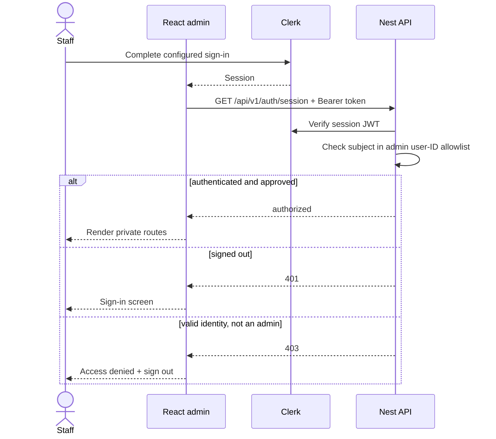

# Admin authentication and authorization

Status: implemented Clerk vertical slice; Google profile policy is deliberately
not enabled. Verified 2026-07-23 with `@clerk/react` 6.12.6 and
`@clerk/express` 2.1.44.

Local development currently uses an explicit authentication bypass while the
operator allowlist is being decided. Set both `VITE_AUTH_DEV_BYPASS=true` and
`AUTH_DEV_BYPASS=true`; the SPA and API then use the stable synthetic principal
`user_localdev`. Both sides reject this configuration outside development, the
API does not mount Clerk middleware, and the browser does not initialize Clerk.
The warning banner is intentional. Threads created this way remain owned by the
synthetic principal and do not become visible to a later Clerk user automatically.

## Purpose and boundary

Clerk owns staff identity, sign-in factors and session issuance. The Nest HTTP
process verifies each session token and separately authorizes its Clerk subject
against `CLERK_ADMIN_USER_IDS`. The browser guard is loading/error UX; it is not
the permission boundary.

The worker never receives the Clerk secret in production. Health endpoints stay
public for operations, development OpenAPI stays reachable under its existing
environment policy, and Bull Board retains its independent Basic authentication
and network boundary. Product controllers are private by default.

## Contract

- `VITE_CLERK_PUBLISHABLE_KEY` is baked into the SPA and is public by design.
  A build without it succeeds for credential-free CI and renders a clear
  configuration screen at runtime.
- `CLERK_PUBLISHABLE_KEY` and `CLERK_SECRET_KEY` configure the HTTP verifier.
  `CLERK_SECRET_KEY` must never enter the SPA image, web container or logs.
- `CLERK_ADMIN_USER_IDS` is a comma-separated list of Clerk `user_*` subjects.
  The HTTP process refuses to start without at least one approved subject unless
  the development-only bypass is active.
- `VITE_AUTH_DEV_BYPASS` and `AUTH_DEV_BYPASS` must be enabled together for a
  usable local stack. Frontend and backend independently refuse the bypass in
  production so a one-sided deployment cannot accidentally open the API.
- `WEB_ORIGIN` also supplies Clerk `authorizedParties`, limiting which token
  origin claims the API accepts.
- The shared API facade obtains the current Clerk session token and overwrites
  its `Authorization` header on every request. Request DTOs never select an
  owner; controllers consume the verified `@CurrentUserId()` principal.
- `@Public()` is an explicit controller/handler opt-out. Only operational
  endpoints with a documented reason should use it.

## Invariants and failure behavior

- A valid Clerk account is not automatically a Join The Six admin. Missing
  sessions return 401; signed-in subjects outside the server allowlist return 403.
- The bypass is an explicit local operator identity, not an authorization header
  accepted from the browser. The API chooses `user_localdev`; callers cannot
  supply or override it.
- The SPA calls `/auth/session` before rendering the admin shell. Clerk load,
  configuration, degraded-service, denial and retryable backend failures have
  distinct states.
- Ownership checks use the verified subject in repository predicates. A
  resource owned by another admin returns 404 rather than confirming that it
  exists.
- Revocation removes the subject from `CLERK_ADMIN_USER_IDS` first, rolls the
  API, and then revokes/bans the Clerk user or sessions. The server allowlist
  makes API revocation effective even if a Clerk browser session still exists.
- Never log session tokens, secret keys or full Clerk user payloads. The Clerk
  subject may be recorded as an audit actor identifier when a durable business
  action requires it.

## Tenant isolation warning

The initial keys may be copied from `notes_ai`. Reusing those keys means reusing
that **Clerk application**, including its users, restrictions, social
connections, domains and authentication policy. The current server allowlist
prevents its unrelated users from reaching Join The Six API data, but it does
not create tenant isolation inside Clerk.

Use a dedicated Clerk application for Join The Six before production. It gives
this admin its own users, Google connection, allowed origins, audit surface,
rotation and revocation lifecycle. Reusing the `notes_ai` application is
acceptable only as an explicit temporary development shortcut with the
server-side user-ID allowlist kept in place.

## Google sign-in handoff: decision still required

Do not enable Google until the owner chooses who may enter. Recommended path:

1. Create the dedicated Join The Six Clerk application.
2. Put it in **Restricted** sign-up mode and invite/create the initial operators
   explicitly. Enable Google on that application only after the approved email
   list and production OAuth ownership are known.
3. Keep `CLERK_ADMIN_USER_IDS` as the final API authorization check. An invited
   Google identity becomes an admin only after its stable Clerk user ID is
   deliberately added.
4. Disable self-service identifier changes if an approved email must remain the
   identity anchor. Record who approved the operator, when, and why.

Choose one admission model before implementation:

| Model                                  | Best fit                                                  | Server-side enforcement                                                                                              |
| -------------------------------------- | --------------------------------------------------------- | -------------------------------------------------------------------------------------------------------------------- |
| Exact email invitations/allowlist      | A few named operators, including personal Google accounts | Invite exact verified emails, then approve their resulting Clerk user IDs. Do not rely on client email text.         |
| Verified company domain                | Every account under a domain the organisation controls    | Restrict sign-up to that domain and still check an approved subject/role. Never domain-allowlist `gmail.com`.        |
| Clerk Organization + roles/permissions | Growing staff, teams or differentiated permissions        | Require the expected organization ID and role/permission in the verified session, with no personal-account fallback. |

Clerk allowlists/restrictions are admission controls, not complete revocation.
For newer Clerk applications they may apply only to sign-up; existing sessions
also need ban/session revocation, and the API must retain its own authorization
decision. Domain matching alone is unsuitable for personal Gmail profiles.

The remaining owner inputs are: dedicated versus temporarily shared Clerk
application, exact approved identities or owned domain, whether Organizations
are warranted, and who owns grants/revocations. No list or Google connection is
invented in code.

Failure cases to test when Google is enabled: uninvited identity, secondary or
changed email, pending invitation, revoked operator with an active browser
session, wrong active Organization, expired/rotated keys, Clerk outage, and a
token issued for an unauthorized origin.

## Operations and tests

- Focused backend tests cover environment parsing, public-route bypass, 401,
  403 and approved-admin behavior. Assistant repository tests cover cross-owner
  404 behavior.
- Frontend tests pin the provider/configuration screen, server authorization
  check and bearer injection; the production build verifies Vite key plumbing.
- Rotate Clerk secrets per environment and consumer. Production injects the
  secret file only into the API container; changing the Vite publishable key
  requires rebuilding the web image.

## Sources and official references

- [Frontend provider, route guard and API facade](../../../apps/admin/src/main.tsx),
  [backend guard/configuration](../../../apps/backend/src/infrastructure/auth/)
  and [HTTP middleware composition](../../../apps/backend/src/bootstrap-http.ts)
- [Clerk React quickstart](https://clerk.com/docs/react/getting-started/quickstart),
  [`getToken()`](https://clerk.com/docs/react/reference/objects/session),
  [Express middleware](https://clerk.com/docs/reference/express/clerk-middleware)
  and [`getAuth()`](https://clerk.com/docs/reference/express/get-auth)
- [Clerk restrictions](https://clerk.com/docs/authentication/allowlist),
  [allowlist/blocklist sign-in behavior change](https://clerk.com/changelog/2025-08-08-allowlist-blocklist-on-sign-in),
  [sign-in options and identifier changes](https://clerk.com/docs/guides/configure/auth-strategies/sign-up-sign-in-options),
  [Organization domain enrollment](https://clerk.com/docs/reference/backend/organization/create-organization-domain)
  and [key rotation](https://clerk.com/docs/guides/secure/rotate-api-keys)
