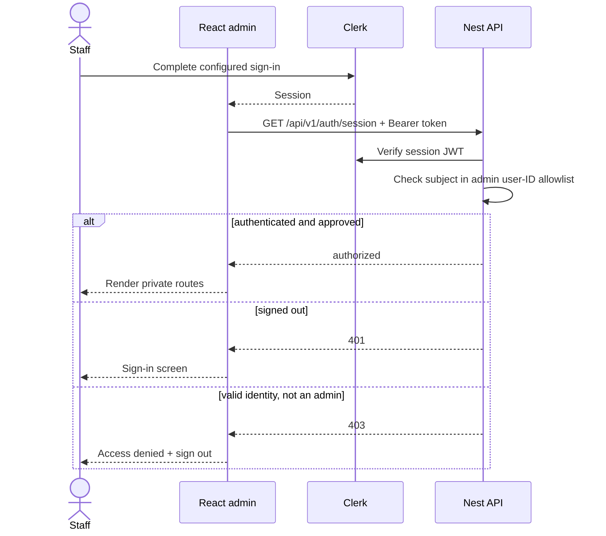

# Admin authentication and authorization

Status: implemented Clerk vertical slice; the production admission contract is
restricted to three shareholder identities. Verified 2026-08-02 with `@clerk/react` 6.12.6 and
`@clerk/express` 2.1.44.

Local development currently uses an explicit authentication bypass while the
operator allowlist is being decided. Set both `VITE_AUTH_DEV_BYPASS=true` and
`AUTH_DEV_BYPASS=true`; the SPA and API then use the stable synthetic principal
`user_localdev`. Both sides reject this configuration outside development, the
API does not mount Clerk middleware, and the browser does not initialize Clerk.
The warning banner is intentional. Threads created this way remain owned by the
synthetic principal and do not become visible to a later Clerk user automatically.

## Purpose and boundary

Clerk owns staff identity, sign-in factors and session issuance. The Nest HTTP
process verifies each session token and separately authorizes its Clerk subject
against `CLERK_ADMIN_USER_IDS`. The browser guard is loading/error UX; it is not
the permission boundary.

The worker never receives the Clerk secret in production. Health endpoints stay
public for operations, development OpenAPI stays reachable under its existing
environment policy, and Bull Board retains its independent Basic authentication
and network boundary. Product controllers are private by default.

## Contract

- `VITE_CLERK_PUBLISHABLE_KEY` is baked into the SPA and is public by design.
  A build without it succeeds for credential-free CI and renders a clear
  configuration screen at runtime.
- `CLERK_PUBLISHABLE_KEY` and `CLERK_SECRET_KEY` configure the HTTP verifier.
  `CLERK_SECRET_KEY` must never enter the SPA image, web container or logs.
- `CLERK_ADMIN_USER_IDS` is a comma-separated list of Clerk `user_*` subjects.
  The HTTP process refuses to start without at least one approved subject unless
  the development-only bypass is active.
- `VITE_AUTH_DEV_BYPASS` and `AUTH_DEV_BYPASS` must be enabled together for a
  usable local stack. Frontend and backend independently refuse the bypass in
  production so a one-sided deployment cannot accidentally open the API.
- `WEB_ORIGIN` also supplies Clerk `authorizedParties`, limiting which token
  origin claims the API accepts.
- The shared API facade obtains the current Clerk session token and overwrites
  its `Authorization` header on every request. Request DTOs never select an
  owner; controllers consume the verified `@CurrentUserId()` principal.
- `@Public()` is an explicit controller/handler opt-out. Only operational
  endpoints with a documented reason should use it.

## Invariants and failure behavior

- A valid Clerk account is not automatically a Join The Six admin. Missing
  sessions return 401; signed-in subjects outside the server allowlist return 403.
- The bypass is an explicit local operator identity, not an authorization header
  accepted from the browser. The API chooses `user_localdev`; callers cannot
  supply or override it.
- The SPA calls `/auth/session` before rendering the admin shell. Clerk load,
  configuration, degraded-service, denial and retryable backend failures have
  distinct states.
- Ownership checks use the verified subject in repository predicates. A
  resource owned by another admin returns 404 rather than confirming that it
  exists.
- Revocation removes the subject from `CLERK_ADMIN_USER_IDS` first, rolls the
  API, and then revokes/bans the Clerk user or sessions. The server allowlist
  makes API revocation effective even if a Clerk browser session still exists.
- Never log session tokens, secret keys or full Clerk user payloads. The Clerk
  subject may be recorded as an audit actor identifier when a durable business
  action requires it.

## Production tenant

Production must use a dedicated Join The Six Clerk application. Reusing the
`notes_ai` keys would also reuse its users, restrictions, social connections,
domains and authentication policy; the backend allowlist would reduce the blast
radius but would not create a separate identity tenant.

The approved admission model is deliberately small:

1. Set the dedicated production instance to **Restricted** sign-up mode.
2. Keep verified email one-time codes available. Google sign-in uses the
   existing `example.com` Google Cloud web OAuth client with a separate active
   secret stored only in Google Cloud and Clerk. Its authorized redirect URI is
   `https://clerk.example.com/v1/oauth_callback`; a Clerk provider marked "setup
   required" must remain disabled.
3. Invite exactly the three shareholder email addresses held in the private
   operator record. Do not commit that personal-data list to this repository.
4. Disable self-service primary email changes.
5. After invitation acceptance, add exactly the resulting stable `user_*`
   subjects to `CLERK_ADMIN_USER_IDS`.

An invitation controls account creation; it does not grant API access. The
server-side user-ID allowlist remains the final authorization decision. Clerk
Organizations add no useful boundary for three equal operators and are not part
of this deployment.

The Clerk Hobby plan does not provide an email allowlist, so shareholder
onboarding remains invitation-based. After an operator completes Clerk account
creation, copy the resulting `user_*` subject into the private production
environment and run `pnpm prod deploy backend`. Do not put OAuth credentials,
shareholder emails or production user IDs in committed files. Restricted mode
must be on before and after onboarding; if an operator temporarily disables it
to resolve an invitation/OAuth edge case, the API allowlist must remain deny-all
for the new subject until restricted mode has been restored.

Revocation happens in this order: remove the subject from
`CLERK_ADMIN_USER_IDS` and roll the API, then ban the Clerk user and revoke its
sessions. This keeps revocation effective even while Clerk session cleanup is
still propagating.

Failure cases to test include an uninvited identity, secondary or changed email,
pending invitation, revoked operator with an active browser session,
expired/rotated keys, Clerk outage, a token issued for an unauthorized origin,
and Google account-selection or redirect failures.

## Operations and tests

- Focused backend tests cover environment parsing, public-route bypass, 401,
  403 and approved-admin behavior. Assistant repository tests cover cross-owner
  404 behavior.
- Frontend tests pin the provider/configuration screen, server authorization
  check and bearer injection; the production build verifies Vite key plumbing.
- Rotate Clerk secrets per environment and consumer. Production injects the
  secret file only into the API container; changing the Vite publishable key
  requires rebuilding the web image.

## Sources and official references

- [Frontend provider, route guard and API facade](../../../apps/admin/src/main.tsx),
  [backend guard/configuration](../../../apps/backend/src/infrastructure/auth/)
  and [HTTP middleware composition](../../../apps/backend/src/bootstrap-http.ts)
- [Clerk React quickstart](https://clerk.com/docs/react/getting-started/quickstart),
  [`getToken()`](https://clerk.com/docs/react/reference/objects/session),
  [Express middleware](https://clerk.com/docs/reference/express/clerk-middleware)
  and [`getAuth()`](https://clerk.com/docs/reference/express/get-auth)
- [Clerk restrictions](https://clerk.com/docs/authentication/allowlist),
  [allowlist/blocklist sign-in behavior change](https://clerk.com/changelog/2025-08-08-allowlist-blocklist-on-sign-in),
  [sign-in options and identifier changes](https://clerk.com/docs/guides/configure/auth-strategies/sign-up-sign-in-options),
  [Organization domain enrollment](https://clerk.com/docs/reference/backend/organization/create-organization-domain)
  and [key rotation](https://clerk.com/docs/guides/secure/rotate-api-keys)
