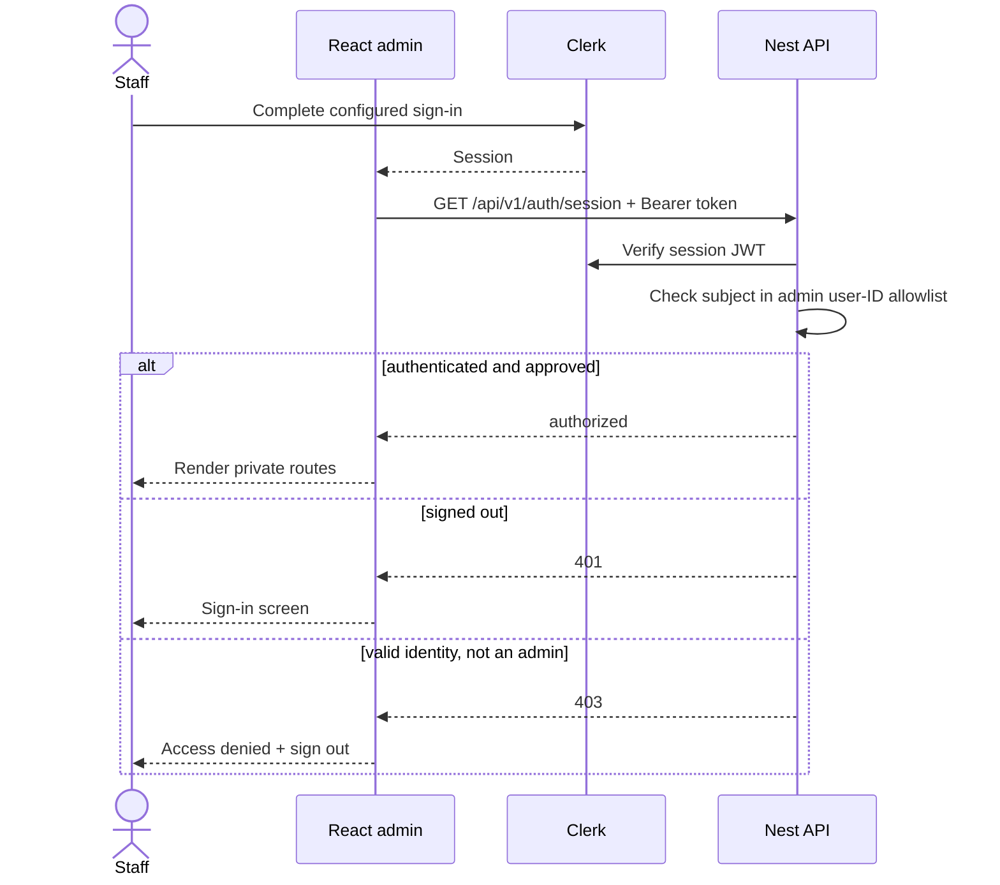

# Admin authentication and authorization

Status: implemented Clerk vertical slice; production admission is an explicit
Clerk `user_*` allowlist (example profile uses three placeholders). Verified
2026-08-02 with `@clerk/react` 6.12.6 and
`@clerk/express` 2.1.44.

Local development uses an explicit auth bypass while the operator allowlist is
being decided. Set both `VITE_AUTH_DEV_BYPASS=true` and `AUTH_DEV_BYPASS=true`;
SPA and API then use the synthetic principal `user_localdev`. Both sides reject
this outside development; the API does not mount Clerk middleware and the
browser does not initialize Clerk. The warning banner is intentional. Threads
created this way stay owned by the synthetic principal and are not automatically
visible to a later Clerk user.

## Purpose and boundary

Clerk owns staff identity, sign-in factors and session issuance. The Nest HTTP
process verifies each session token and authorizes its Clerk subject against
`CLERK_ADMIN_USER_IDS`. The browser guard is loading/error UX, not the
permission boundary.

The worker never receives the Clerk secret in production. Health endpoints stay
public; development OpenAPI stays under its environment policy; Bull Board keeps
independent Basic auth and network boundary. Product controllers are private by
default.

## Contract

- `VITE_CLERK_PUBLISHABLE_KEY` is public by design. A build without it succeeds
  for credential-free CI and shows a configuration screen at runtime.
- `CLERK_PUBLISHABLE_KEY` and `CLERK_SECRET_KEY` configure the HTTP verifier.
  `CLERK_SECRET_KEY` must never enter the SPA image, web container or logs.
- `CLERK_ADMIN_USER_IDS` is a comma-separated list of Clerk `user_*` subjects.
  The HTTP process refuses to start without at least one unless the
  development-only bypass is active.
- `VITE_AUTH_DEV_BYPASS` and `AUTH_DEV_BYPASS` must both be enabled for a usable
  local stack. Each side independently refuses the bypass in production.
- `WEB_ORIGIN` also supplies Clerk `authorizedParties`.
- The shared API facade obtains the Clerk session token and overwrites
  `Authorization` on every request. Request DTOs never select an owner;
  controllers use `@CurrentUserId()`.
- `@Public()` is an explicit opt-out for operational endpoints with a documented
  reason.

## Invariants and failure behavior

- A valid Clerk account is not automatically an admin. Missing session → 401;
  signed-in subject outside the allowlist → 403.
- Bypass identity is chosen by the API (`user_localdev`); callers cannot supply
  or override it via headers.
- The SPA calls `/auth/session` before rendering the admin shell. Clerk load,
  configuration, degraded service, denial and retryable backend failures have
  distinct states.
- Ownership checks use the verified subject. A resource owned by another admin
  returns 404.
- Revoke by removing the subject from `CLERK_ADMIN_USER_IDS` and rolling the
  API first, then ban/revoke the Clerk user or sessions.
- Never log session tokens, secret keys or full Clerk user payloads. The Clerk
  subject may appear as an audit actor when a durable business action requires it.

## Production tenant

Use a dedicated Clerk application for this operator surface. Reusing another
product's keys would reuse its users and auth policy; the backend allowlist
reduces blast radius but is not a separate identity tenant.

Admission model (example private instance, not a public SaaS):

1. Set the production instance to **Restricted** sign-up.
2. Keep verified email OTP available. Google sign-in uses a dedicated
   `example.com` Google Cloud web OAuth client with a separate active secret stored
   only in Google Cloud and Clerk. Redirect URI:
   `https://clerk.example.com/v1/oauth_callback`. A Clerk provider marked "setup
   required" must stay disabled.
3. Invite only the operators who belong on the allowlist. Do not commit emails.
4. Disable self-service primary email changes.
5. After acceptance, add the stable `user_*` subjects to `CLERK_ADMIN_USER_IDS`.

Invitation creates the account; the server allowlist grants API access. Clerk
Organizations are not part of this deployment (equal operators on one list).

Hobby has no email allowlist. Normal path: invite → copy `user_*` into the
private production env → `pnpm prod deploy backend`. Pre-acceptance alternative:
create a passwordless Clerk user via Backend API with the exact operator
email; a later Google login with the same verified address links to it. Keep
restricted mode on. Do not commit OAuth credentials, operator emails or
production user IDs.

Test: uninvited identity, secondary/changed email, pending invitation, revoked
operator with an active browser session, expired/rotated keys, Clerk outage,
token for an unauthorized origin, Google account-selection or redirect failures.

## Operations and tests

- Backend tests: environment parsing, public-route bypass, 401/403/approved-admin.
  Assistant repository tests cover cross-owner 404.
- Frontend tests: provider/configuration screen, server authorization check,
  bearer injection; production build verifies Vite key plumbing.
- Rotate Clerk secrets per environment. Production injects the secret file only
  into the API container; changing the Vite publishable key requires rebuilding
  the web image.

## Sources and official references

- [Frontend provider/guard](../../../apps/admin/src/main.tsx),
  [backend auth](../../../apps/backend/src/infrastructure/auth/),
  [HTTP composition](../../../apps/backend/src/bootstrap-http.ts)
- [Clerk React quickstart](https://clerk.com/docs/react/getting-started/quickstart),
  [`getToken()`](https://clerk.com/docs/react/reference/objects/session),
  [Express middleware](https://clerk.com/docs/reference/express/clerk-middleware),
  [`getAuth()`](https://clerk.com/docs/reference/express/get-auth)
- [Restrictions](https://clerk.com/docs/authentication/allowlist),
  [`createUser()`](https://clerk.com/docs/reference/backend/user/create-user),
  [OAuth account linking](https://clerk.com/docs/guides/configure/auth-strategies/social-connections/account-linking),
  [key rotation](https://clerk.com/docs/guides/secure/rotate-api-keys)
