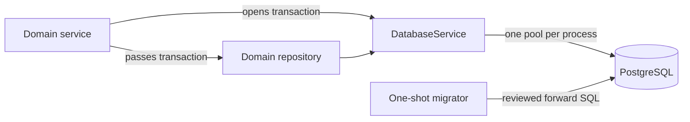

# Database lifecycle and migrations

Status: implemented foundation. Last verified: **2026-07-22** against Drizzle
ORM `0.45.2`, Drizzle Kit `0.31.10`, `pg` `8.22.0` and PostgreSQL `18.4`.

## Boundary

`packages/database` owns schema, migrations and Drizzle client primitives. Each
Nest HTTP/worker process owns one lazy node-postgres pool through
`DatabaseService`. Services choose transaction scope; repositories issue
explicit queries using the supplied transaction or service database handle.
Conversation aggregates are outside this boundary; see
[MongoDB lifecycle](mongodb.md).



Do not create pools in repositories, expose Drizzle to controllers or bury
transaction ownership inside a generic repository.

## Pool and readiness

| Policy                   | Bound                             |
| ------------------------ | --------------------------------- |
| Maximum connections      | `DATABASE_POOL_MAX`, default `10` |
| Connection/pool checkout | 2 seconds                         |
| PostgreSQL statement     | 15 seconds                        |
| Driver response          | 16 seconds                        |
| Idle transaction         | 30 seconds                        |
| Readiness                | 1 second                          |

The driver bound is longer than PostgreSQL's statement timeout so the server can
cancel first. Longer work needs an explicit operational path. Readiness runs
`select 1`; concurrent probes share one in-flight query and the shared
application deadline in `infrastructure/readiness.ts`. A pass proves only that
this process can execute a query now, not that latency or capacity is healthy.

The pool logs idle-client failures as `database.pool.error`. Nest shutdown calls
`pool.end()` and detaches that listener even when closing fails. Deployment
grace must exceed the bounded active work.

## Schema invariants

Application tables live in PostgreSQL `public`; Drizzle's journal lives at
`drizzle.__drizzle_migrations`. TypeScript uses camel case and persisted names
are explicit snake case.

The schema uses database-generated UUID/timestamp defaults, bounded non-blank
text constraints, JSON shape checks and indexes selected for actual composite
lookup shapes. `assistant_threads` and `assistant_turns` retain the Assistant
execution/idempotency projection used for request replay, attempt fencing,
stale-job recovery and queue correlation. Their content fields are a
compatibility/backfill projection; MongoDB is authoritative for user-visible
thread content and ordered history. Composite ownership foreign keys,
owner-scoped request-id uniqueness and one-active-turn partial uniqueness keep
HTTP replay and append concurrency coherent. Status/result/error checks protect
the execution projection, and terminal writes remain conditional on both a
nonterminal status and the current attempt. Add indexes for measured queries,
verify with `EXPLAIN`, and account for write cost.

Participant profiles use normalized unique emails, E.164 phones, constrained
age/neighborhood/conversation values and a normalized interest join table.
`participant_source_records` makes operational imports idempotent through a
unique source key and canonical payload hash without retaining another raw PII
copy. `post_event_feedback_whatsapp_opt_in` defaults to `false`. The detailed
contract is in the [participant module](../modules/participants.md).

Stub events and attendance live in `events` / `event_attendees` with status
checks, a unique `(event_id, participant_id)` pair and
`ON DELETE RESTRICT` toward participants. See the
[events module](../modules/events.md).

Post-event feedback persistence lives in `feedback_campaigns`,
`feedback_answers`, `feedback_answer_withdrawals`, `feedback_notes`,
`provider_message_ingress` and `message_outbox`: one campaign per event, answer
uniqueness with `NULLS NOT DISTINCT` (including null subjects), ingress dedupe on
`(chat_jid, provider_message_id)`, outbox `dedupe_key` uniqueness, delivery
columns folded into the outbox, and participant/campaign FKs
`ON DELETE RESTRICT` with no references to `event_attendees`. A withdrawn answer
is hard-deleted and leaves a tombstone on the same uniqueness key, which is what
stops a later extraction run from writing it back. `feedback_answers.matching_hold`
marks a row no consumer may turn into a seating constraint. See the
[post-event feedback module](../modules/post-event-feedback.md).

Email delivery uses separate intent, outbox and attempt tables. Intent creation,
outbox publication intent and admin audit share one transaction. Leases and
conditional state transitions make relay and worker crashes recoverable;
message content and the raw recipient remain confined to the intent table.
See the [email delivery module](../modules/email-delivery.md).

When a mutation needs business audit, the service writes the domain row and
`audit_events` row through the same transaction. Runtime logs do not replace
durable audit data. Audit context remains deliberately small and excludes
credentials, request bodies, payment data and unnecessary personal data.

## Migration contract

The TypeScript schema is the source of truth; reviewed SQL is the deployment
artifact.

```bash
pnpm --filter @join-the-six/database db:generate --name=<meaningful_name>
pnpm --filter @join-the-six/database db:check
pnpm --filter @join-the-six/database db:migrate
```

`db:generate` and `db:check` need no database. `db:migrate` does. `db:check`
validates migration history, not ungenerated schema drift; rerun generation and
expect no further change before review.

Run one migrator before application rollout. Never edit an applied migration,
run parallel migrators or use `drizzle-kit push` on shared/staging/production
data. Review generated SQL for locks, rewrites, defaults, backfills and
destructive statements. Use expand/backfill/contract across releases when a
change cannot safely finish inside one deployment window. Recovery is normally
a reviewed forward migration.

The two initial assistant migrations are an unshipped, same-release
supersession. The second begins with a fail-closed guard: if the temporary
`assistant_runs` table contains any row it aborts before creating new tables or
dropping the old one. Export and explicitly transform that data before retrying;
legacy model ids must not be silently relabelled. This narrow pre-release case
does not authorize editing migrations after any shared/production rollout.

## Test data, tests and operations

There is no global seed command until a real repeatable dataset exists. Tests
create deterministic fixtures in an isolated database and clean them with
rollback or exact-key deletion. Future local seeds must be repeatable with
stable keys/upserts; destructive reset remains separate and test-only.

- Unit tests cover client defaults, lifecycle, readiness coalescing and timeout.
- Database package tests include `drizzle-kit check`.
- Before release, apply migrations twice to disposable PostgreSQL and verify
  constraints and rollback. This smoke is not yet automated in the repository.
- Monitor pool `totalCount`, `idleCount` and `waitingCount` before changing pool
  size; every API and worker replica has its own pool.

## Sources and official references

- [Database client](../../../packages/database/src/client.ts), [Nest adapter](../../../apps/backend/src/infrastructure/database/database.service.ts), [readiness deadline](../../../apps/backend/src/infrastructure/readiness.ts), [schema](../../../packages/database/src/schema/index.ts) and [migrations](../../../packages/database/drizzle/)
- [Drizzle PostgreSQL](https://orm.drizzle.team/docs/get-started-postgresql), [migrations](https://orm.drizzle.team/docs/migrations), [generate](https://orm.drizzle.team/docs/drizzle-kit-generate), [check](https://orm.drizzle.team/docs/drizzle-kit-check) and [transactions](https://orm.drizzle.team/docs/transactions)
- [node-postgres pooling](https://node-postgres.com/features/pooling), [pool API](https://node-postgres.com/apis/pool), [client configuration](https://node-postgres.com/apis/client) and [transactions](https://node-postgres.com/features/transactions)
