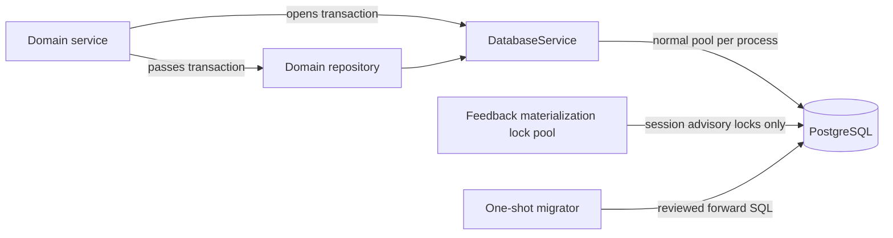

# Database lifecycle and migrations

Status: implemented foundation. Last verified: **2026-08-02** against Drizzle
ORM `0.45.2`, Drizzle Kit `0.31.10`, `pg` `8.22.0` and PostgreSQL `18.4`.

## Boundary

`packages/database` owns schema, migrations and Drizzle client primitives. Each
Nest HTTP/worker process owns one normal lazy node-postgres pool through
`DatabaseService`. The feedback worker has one narrow exception: a separate
five-connection pool holds session advisory locks and never executes repository
queries. Services choose transaction scope; repositories issue explicit queries
on the supplied transaction or service handle. Admin Assistant conversation
aggregates stay outside this boundary; see [MongoDB lifecycle](mongodb.md).
Campaign feedback conversations are PostgreSQL rows; see
[ADR 0015](../../decisions/0015-postgresql-feedback-conversations.md).



Do not create pools in repositories, expose Drizzle to controllers or bury
transaction ownership inside a generic repository.

## Pool and readiness

| Policy                   | Bound                             |
| ------------------------ | --------------------------------- |
| Maximum connections      | `DATABASE_POOL_MAX`, default `10` |
| Connection/pool checkout | 2 seconds                         |
| PostgreSQL statement     | 15 seconds                        |
| Driver response          | 16 seconds                        |
| Idle transaction         | 30 seconds                        |
| Readiness                | 1 second                          |

The driver bound is longer than the statement timeout so the server can cancel
first. Longer work needs an explicit operational path. Readiness runs
`select 1`; concurrent probes share one in-flight query and the shared deadline
in `infrastructure/readiness.ts`. A pass proves only that this process can
execute a query now.

The pool logs idle-client failures as `database.pool.error`. Nest shutdown calls
`pool.end()` and detaches that listener even when closing fails. Deployment
grace must exceed bounded active work.

## Schema invariants

Application tables live in PostgreSQL `public`; Drizzle's journal lives at
`drizzle.__drizzle_migrations`. TypeScript uses camel case; persisted names are
explicit snake case. Prefer database-generated UUID/timestamp defaults, bounded
non-blank text, JSON shape checks and indexes for measured composite lookups.

**Assistant.** `assistant_threads` / `assistant_turns` retain the execution and
idempotency projection (replay, attempt fencing, stale-job recovery, queue
correlation). Content fields are a compatibility/backfill projection; MongoDB
is authoritative for user-visible content and ordered history. Composite
ownership FKs, owner-scoped request-id uniqueness and one-active-turn partial
uniqueness keep HTTP replay coherent. Terminal writes are conditional on
nonterminal status and the current attempt. The first generated turn of an
immutable branch carries paired nullable
`branched_from_thread_id` / `branched_from_turn_id`. The source thread is
`ON DELETE RESTRICT`; the turn id has no PostgreSQL FK (branch-of-branch may
reference a turn inherited inside the source MongoDB aggregate). Inherited turns
are not copied into PostgreSQL.

**Participants, events, email.** Detailed contracts live in
[participants](../modules/participants.md), [events](../modules/events.md) and
[email delivery](../modules/email-delivery.md). Event venue is flat nullable
columns on `events` (no venue table): complete core shape when present, provider
`google` only, `venue_context_revision` defaults to `0`, creation with a venue
stores `1`, and every later explicit venue replacement or clear increments it in
the same SQL update. Venue audits may retain flags and revision, never label,
place id or address-like text.

**Post-event feedback.** Persistence spans `feedback_campaigns`,
`feedback_conversations`, `feedback_campaign_summaries`, `feedback_answers`,
`feedback_answer_withdrawals`, `feedback_notes`, `provider_message_ingress`,
`feedback_conversation_executions`, `feedback_maintenance_checkpoints`,
`message_outbox` and `message_outbox_log`. One campaign conversation is one
`feedback_conversations` row: routing, lifecycle, control and durable work are
scalars; transcript, goals, attention and usage are bounded JSONB. One campaign
per event; answer uniqueness uses `NULLS NOT DISTINCT`; ingress dedupes on
`(chat_jid, provider_message_id)`; outbox `dedupe_key` is unique. New
conversation campaign/respondent FKs are `ON DELETE RESTRICT`. Existing
execution, answer, note and outbox `conversation_id` values stay without a
validated FK until import has parents. No references to `event_attendees`. A
withdrawn answer is hard-deleted and leaves a tombstone on the same uniqueness
key. See [post-event feedback](../modules/post-event-feedback.md).

Fencing invariants agents must not break:

- Campaign `resume_generation` remains the ABA token in immutable outbound
  dispatch context across pause/resume. Resume updates campaign status and open conversation
  work columns in one service-owned transaction. The old due/ack pair and
  campaign-resume repair checkpoint are removed by ADR 0015's migration.
- `feedback_conversation_executions` holds monotonic epoch, claimed work
  revision and nullable lease token/expiry. No second epoch is stored on
  `feedback_conversations`. Heartbeats update the fence only. Admission checks
  conversation `work_revision` under the same short transaction as `tryClaim`.
  Settlement validates the live token in the transaction that reads current
  state and sets the successor schedule; a replaced lease cannot settle even
  if the work revision is unchanged. Both use the shared conversation mutex.
- Durable due work is `work_revision` + `work_next_action_at` on the
  conversation row, including closed rows that still owe a settle pass.
- Maintenance checkpoints still include `conversation_due`, `ingress_pending`,
  `summary_pending` and `summary_auto`. A task row is locked `FOR UPDATE` only
  while one page is allocated; processing happens after commit. These rows
  never mean work completed.
- Direct dispatch extends `message_outbox` with claim token/expiry,
  `send_started_at`, attempt count and bounded last error. Only `claimed`
  returns to the claim query on lease expiry; `attempting` expiry becomes
  `ambiguous`. Unknown provider outcomes never return to `pending`.
- Each outbound intent has immutable, versioned `dispatch_context`. Enqueue
  requires purpose-specific evidence; dispatch validates it independently of
  `message_outbox_log`. Ordinary extraction evidence is the original model
  snapshot, never a refreshed conversation. Dedupe replay preserves the first
  context and status. See [ADR 0016](../../decisions/0016-feedback-dispatch-context.md).
- `provider_message_ingress.ingress_order` is a sequence assigned at insert — the
  cross-process FIFO authority for one conversation. All observations take the
  same transaction-scoped routing advisory lock before sequence allocation.
  Materialization may still hold a dedicated session-scoped advisory lock from
  the worker-only five-connection pool while draining several ingress rows.
- Email intent creation, outbox publication and admin audit share one
  transaction. Message content and raw recipient stay in the intent table.
- Domain mutation and `audit_events` share one transaction when audit is
  required. Runtime logs do not replace durable audit.

**Transactions that have landed.** Launch intro + transcript + audit share one
transaction. Resume updates campaign status, increments `resume_generation`
and revises open-row due work in the same service-owned transaction. After the
model returns, extraction persist and conversation cursor/goals/attention
share one transaction. STOP append, close, opt-out, outbox cancel,
acknowledgement and ingress settlement share one `AppTransaction`. Alerts and
BullMQ publication stay after commit.

## Migration contract

The TypeScript schema is the source of truth; reviewed SQL is the deployment
artifact.

```bash
pnpm --filter @slopform/database db:generate --name=<meaningful_name>
pnpm --filter @slopform/database db:check
pnpm --filter @slopform/database db:migrate
```

`db:generate` and `db:check` need no database; `db:migrate` does. `db:check`
validates migration history, not ungenerated schema drift — regenerate and expect
no further change before review.

Run one migrator before application rollout. Never edit an applied migration,
run parallel migrators or use `drizzle-kit push` on shared/staging/production
data. Review generated SQL for locks, rewrites, defaults, backfills and
destructive statements. Prefer expand/backfill/contract across releases when a
change cannot finish safely in one deploy window. Recovery is normally a
reviewed forward migration.

Earlier feedback orchestration migrations were reader-first: nullable dispatch fields,
execution-fence table, summary epoch/claim fields and expanded status checks
landed before new worker writers. V1 `sending` rows remain valid during the bridge.
The PostgreSQL conversation cutover requires quiesced writers; follow the
[feedback cutover procedure](../../deployment.md#feedback-conversation-storage-cutover).
The subsequent dispatch-context migration also requires stopped writers and
one-time historical backfill; follow its
[cutover procedure](../../deployment.md#feedback-dispatch-context-cutover).
The two initial assistant migrations are an unshipped same-release supersession;
the second aborts if temporary `assistant_runs` contains any row. That narrow
pre-release case does not authorize editing migrations after shared rollout.

## Test data, tests and operations

No global seed command until a repeatable dataset exists. Tests create
deterministic fixtures in an isolated database and clean with rollback or
exact-key deletion.

- Unit tests: client defaults, lifecycle, readiness coalescing, timeout.
- Database package tests include `drizzle-kit check`.
- `FEEDBACK_POSTGRES_TEST_URL=postgresql://… pnpm test:feedback:postgres`
  requires an explicitly disposable database, applies migrations, then checks
  the conversation SQL adapter, concurrent appends, rollback, execution fencing,
  caller-owned outbound claim rollback, dispatch-context upgrades from populated
  legacy rows, immutable dedupe replay, atomic intent/history rollback and
  offline import replay. The suites run
  sequentially so migration setup is safe on an empty database. It never falls
  back to application `DATABASE_URL` and runs
  without Turbo caching. Normal `pnpm check` skips these opt-in database cases.
- Before release, also verify upgrades from the previous schema with populated
  campaign resume/checkpoint rows; old applied migrations remain immutable.
- Monitor pool `totalCount`, `idleCount` and `waitingCount` before changing pool
  size; every API and worker replica has its own pool.

## Sources and official references

- [Database client](../../../packages/database/src/client.ts),
  [Nest adapter](../../../apps/backend/src/infrastructure/database/database.service.ts),
  [readiness](../../../apps/backend/src/infrastructure/readiness.ts),
  [schema](../../../packages/database/src/schema/index.ts),
  [migrations](../../../packages/database/drizzle/)
- [Drizzle PostgreSQL](https://orm.drizzle.team/docs/get-started-postgresql),
  [migrations](https://orm.drizzle.team/docs/migrations),
  [node-postgres pooling](https://node-postgres.com/features/pooling)
