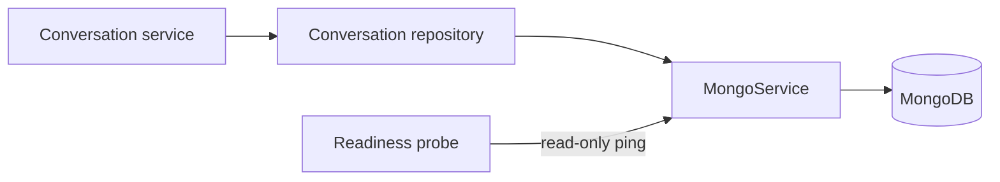

# MongoDB lifecycle and operations

Status: implemented. Last verified: **2026-07-25** against MongoDB Node.js
driver `7.5.0` and MongoDB Community `8.0.28`.

## Boundary

MongoDB stores conversation aggregates: owner identity, purpose/channel,
ordered content, goals, conversation lifecycle, human control and durable
next-action intent. One
collection, `conversation_threads`, holds two versioned document shapes —
schema v1 for the admin Assistant and schema v2 for post-event feedback —
discriminated by `schemaVersion` and `purpose`. PostgreSQL remains
authoritative for relational business data, audit, outbox and
delivery/execution projections. For post-event feedback, MongoDB stores the
monotonic work revision and due time while PostgreSQL grants the execution
lease/epoch; Redis remains a disposable wake-up and rate-limit layer only.

The embedded feedback transcript is deliberately raw: an outbox-backed turn is
an audit of intent and may remain after PostgreSQL marks the row `cancelled`.
Detail/UI reads retain it with the joined delivery projection. Model-context
reads perform one transcript-bounded PostgreSQL status lookup and exclude only
rows proven never visible (`pending`, `held`, `claimed`, `failed`, `cancelled`).
Provider-crossed or uncertain rows remain. A missing historical outbox row is
included for compatibility because absence cannot prove non-delivery. The raw
array and its sequence numbers remain the cursor authority.

`MongoService` owns one native-driver client per Nest process, constructed
eagerly with a lazily established and memoized connection. Each
conversation repository owns its own document version and collection queries;
controllers and provider adapters never receive a Mongo client.

## Connection and readiness

`MONGODB_URI` is required and must select a database; SRV and non-SRV
replica-set seed lists are accepted. The client has a maximum pool size of ten,
five-second connect/server-selection and pool-wait bounds, and a ten-second
socket bound. Driver reconnect behavior handles transient drops; the
application does not run an unbounded retry loop.

Readiness performs only `ping` through the shared one-second application
deadline and driver command timeout. Concurrent probes share one in-flight
ping; a timed-out ping is discarded so a later healthy probe can recover. It
does not create collections or indexes. Nest shutdown closes the client once.

MongoDB is a required dependency for both API and worker because conversation
content and ordered history are authoritative there. An unavailable MongoDB
therefore degrades readiness and conversation operations; generation is not
allowed to continue with a stale PostgreSQL content copy.

Summary lists use a narrow projection for title, timestamps and compact turn
metadata. The feedback campaign list projects counts and last-message metadata
through an aggregation instead of embedding transcripts. Full embedded content
is loaded only for a thread detail/model-history read or an actual PostgreSQL
backfill, avoiding a worst-case 50-document payload of near-limit aggregates.

## Security and provisioning

Development Compose binds MongoDB to loopback. Production publishes no MongoDB
port and attaches it only to the internal `data` network. The official image is
pinned by exact version and multi-platform digest.

A fresh volume creates:

- a root user from the Mongo-only root secret;
- a database-scoped `readWrite` application user from a separate secret;
- `conversation_threads` plus its five reviewed indexes: the schema-v1
  owner/recency and purpose/state indexes, the schema-v2 partial **unique**
  index on `phoneAtLaunch` for open post-event feedback conversations, and the
  schema-v2 campaign/recency and due-work indexes. The due-work index is
  `(work.nextActionAt, _id)` with a partial date filter, so maintenance can scan
  durable intent in keyset pages without rereading one oldest prefix or touching
  every transcript in one pass.

API and worker receive only the application secret. They never receive the root
secret. The repository idempotently verifies the required indexes on its first
conversation operation, not during readiness.

Compose provisioning and the backend secret entrypoint share one conservative
ASCII contract: database names are 1–63 letters/digits/underscore/hyphen,
application users are 1–64 letters/digits/dot/underscore/hyphen, and
application passwords are 16–128 URL-safe characters. This keeps byte limits
and URI construction identical on first initialization and later restarts.

Production external MongoDB connections require credentials and TLS.
Certificate-verification bypass options are rejected. The internal Compose
hostname `mongo` is the only production plaintext exception because traffic
stays on Docker's internal data network.

Changing a Docker secret file does **not** rotate a user already stored in an
initialized MongoDB volume. Change the user's password in MongoDB first, update
the file, then recreate API/worker and verify readiness. Do not delete the
volume to rotate a password.

## Failure, limits and backup

Aggregate creation and synchronization validate the complete document with
Zod, while transition commands validate their typed timestamps, output and
failure payloads before mutation. Every read validates the resulting aggregate.
Turn transitions compare owner, turn id, status and exact attempt; stale
attempts are fenced and an existing terminal result cannot be replaced by a
different result. Provider output is validated before mutation, so oversized
content cannot create an unreadable document.

MongoDB documents have a 16 MiB BSON limit. Schema-v1 aggregates therefore cap
embedded turns at 75. Assistant tool artifacts are additionally capped at 20
calls per turn with 512-character input and 1,536-character result previews,
leaving room for maximum-size UTF-8 input/output and BSON metadata. The
Assistant append route checks early and enforces the same cap
inside its locked PostgreSQL sequence allocation, closing concurrent append
races. Introduce tested rollover/archival before raising it.

Schema-v2 feedback conversations cap the transcript at 150 messages of at most
64,000 characters — the stored cap, not the 4096 we are allowed to _send_ —
with a 4 MiB document backstop measured before each append.
Sequence allocation is fenced by the current array size, so a concurrent append
retries instead of producing a gap. Reaching either bound flags the
conversation for human attention and fails the append loudly; the durable
PostgreSQL ingress row still holds the message, so nothing is silently dropped.

The schema-v2 `work` object is optional on read for reader-first rollout and
fully written on the next schedule: `revision` is monotonic, `nextActionAt` is
the current durable intent, `executionEpoch` is the highest PostgreSQL epoch
the aggregate admitted and optional `campaignResumeGeneration` deduplicates the
cross-store campaign-resume hand-off. Scheduling increments the revision
atomically. A campaign resume increments it only when that aggregate has not
already admitted the exact PostgreSQL generation, and preserves a later rolling
quiet-window timestamp written by a concurrent participant message. Begin
requires the exact due revision and a newer epoch; settlement requires the same
epoch and cannot clear a revision that a newer participant message or operator
transition created meanwhile. A worker crash leaves `nextActionAt` discoverable,
so maintenance can recreate a missing BullMQ wake-up after the PostgreSQL lease
expires.

Extraction-driven terminal state records `lifecycle.terminalOutboxId` in the
same MongoDB update that advances the snapshot cursor and writes
`completed`/`declined`. The dispatcher permits exactly that row as terminal
copy; an anchored or fixed legacy closing key is not authority on its own.
Superseded pre-send rows are cancelled, while a legacy row that may already
have crossed the provider boundary parks the still-open conversation for human
review instead of risking a second goodbye. Handoff, duty-of-care, withdrawal
and hostility exits likewise advance cursor/accounting and set
`awaitingHuman` in one update, so a crash cannot consume testimony while leaving
the bot active or park the bot with a stale cursor.

The named volume provides persistence, not backup. The
[deployment backup/restore runbook](../../deployment.md#coordinated-backup-runbook)
defines writer quiescing, secret-safe paired PostgreSQL/MongoDB dumps, encrypted
off-host retention, disposable restore drills, validation and cross-store
reconciliation. A backup is not accepted merely because a command exited zero;
its matched pair must restore and pass collection/index/owner-read checks.

## Tests and references

Focused tests cover lifecycle/readiness without a live server, aggregate
validation for both schema versions, all index contracts, idempotent
synchronization and append, exact-attempt fencing, conflicting terminal
results, work revision/epoch settlement, transcript capacity and the compact
list projections. A booted HTTP
contract test verifies MongoDB in both the readiness response and generated
OpenAPI, including the safe 503 shape. Compose configuration is validated
separately. No test suite silently depends on a developer MongoDB instance.

- [Mongo service](../../../apps/backend/src/infrastructure/mongo/mongo.service.ts),
  [assistant conversation repository](../../../apps/backend/src/modules/conversations/conversation-thread.repository.ts),
  [feedback conversation repository](../../../apps/backend/src/modules/post-event-feedback/post-event-feedback-conversation.repository.ts)
  and [Compose initialization](../../../docker/mongo-init/10-app-user.js)
- [State-driven feedback orchestration](../../decisions/0013-state-driven-feedback-orchestration.md)
- [MongoDB Node.js driver connections](https://www.mongodb.com/docs/drivers/node/current/connect/connection-options/),
  [connection pools](https://www.mongodb.com/docs/drivers/node/current/connect/connection-options/connection-pools/),
  [document limits](https://www.mongodb.com/docs/manual/reference/limits/)
  and [Docker official image](https://hub.docker.com/_/mongo)
