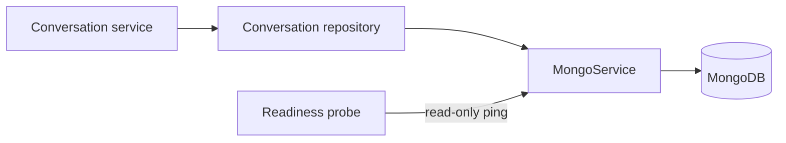

# MongoDB lifecycle and operations

Status: implemented. Last verified: **2026-07-25** against MongoDB Node.js
driver `7.5.0` and MongoDB Community `8.0.28`.

## Boundary

MongoDB stores conversation aggregates: owner identity, purpose/channel,
ordered turns, goal answers, conversation state and human-takeover state.
PostgreSQL remains authoritative for relational business data, audit, outbox
and delivery/execution projections. Redis remains queue coordination only.

`MongoService` owns one lazy native-driver client per Nest process.
Conversation repositories own collection queries; controllers and provider
adapters never receive a Mongo client.

## Connection and readiness

`MONGODB_URI` is required and must select a database; SRV and non-SRV
replica-set seed lists are accepted. The client has a maximum pool size of ten,
five-second connect/server-selection and pool-wait bounds, and a ten-second
socket bound. Driver reconnect behavior handles transient drops; the
application does not run an unbounded retry loop.

Readiness performs only `ping` through the shared one-second application
deadline and driver command timeout. Concurrent probes share one in-flight
ping; a timed-out ping is discarded so a later healthy probe can recover. It
does not create collections or indexes. Nest shutdown closes the client once.

MongoDB is a required dependency for both API and worker because conversation
content and ordered history are authoritative there. An unavailable MongoDB
therefore degrades readiness and conversation operations; generation is not
allowed to continue with a stale PostgreSQL content copy.

Summary lists use a narrow projection for title, timestamps and compact turn
metadata. Full embedded content is loaded only for a thread detail/model-history
read or an actual PostgreSQL backfill, avoiding a worst-case 50-document payload
of near-limit aggregates.

## Security and provisioning

Development Compose binds MongoDB to loopback. Production publishes no MongoDB
port and attaches it only to the internal `data` network. The official image is
pinned by exact version and multi-platform digest.

A fresh volume creates:

- a root user from the Mongo-only root secret;
- a database-scoped `readWrite` application user from a separate secret;
- `conversation_threads` plus its owner/recency and purpose/state indexes.

API and worker receive only the application secret. They never receive the root
secret. The repository idempotently verifies the required indexes on its first
conversation operation, not during readiness.

Compose provisioning and the backend secret entrypoint share one conservative
ASCII contract: database names are 1–63 letters/digits/underscore/hyphen,
application users are 1–64 letters/digits/dot/underscore/hyphen, and
application passwords are 16–128 URL-safe characters. This keeps byte limits
and URI construction identical on first initialization and later restarts.

Production external MongoDB connections require credentials and TLS.
Certificate-verification bypass options are rejected. The internal Compose
hostname `mongo` is the only production plaintext exception because traffic
stays on Docker's internal data network.

Changing a Docker secret file does **not** rotate a user already stored in an
initialized MongoDB volume. Change the user's password in MongoDB first, update
the file, then recreate API/worker and verify readiness. Do not delete the
volume to rotate a password.

## Failure, limits and backup

Aggregate creation and synchronization validate the complete document with
Zod, while transition commands validate their typed timestamps, output and
failure payloads before mutation. Every read validates the resulting aggregate.
Turn transitions compare owner, turn id, status and exact attempt; stale
attempts are fenced and an existing terminal result cannot be replaced by a
different result. Provider output is validated before mutation, so oversized
content cannot create an unreadable document.

MongoDB documents have a 16 MiB BSON limit. Conversation aggregates therefore
cap embedded turns at 75, leaving room for maximum-size UTF-8 input/output and
BSON metadata. The Assistant append route checks early and enforces the same cap
inside its locked PostgreSQL sequence allocation, closing concurrent append
races. Introduce tested rollover/archival before raising it.

The named volume provides persistence, not backup. The
[deployment backup/restore runbook](../../deployment.md#coordinated-backup-runbook)
defines writer quiescing, secret-safe paired PostgreSQL/MongoDB dumps, encrypted
off-host retention, disposable restore drills, validation and cross-store
reconciliation. A backup is not accepted merely because a command exited zero;
its matched pair must restore and pass collection/index/owner-read checks.

## Tests and references

Focused tests cover lifecycle/readiness without a live server, aggregate
validation, index contract, idempotent synchronization, exact-attempt fencing
and conflicting terminal results. A booted HTTP contract test verifies MongoDB
in both the readiness response and generated OpenAPI, including the safe 503
shape. Compose configuration is validated separately. No test suite silently
depends on a developer MongoDB instance.

- [Mongo service](../../../apps/backend/src/infrastructure/mongo/mongo.service.ts),
  [conversation repository](../../../apps/backend/src/modules/conversations/conversation-thread.repository.ts)
  and [Compose initialization](../../../docker/mongo-init/10-app-user.js)
- [MongoDB Node.js driver connections](https://www.mongodb.com/docs/drivers/node/current/connect/connection-options/),
  [connection pools](https://www.mongodb.com/docs/drivers/node/current/connect/connection-options/connection-pools/),
  [document limits](https://www.mongodb.com/docs/manual/reference/limits/)
  and [Docker official image](https://hub.docker.com/_/mongo)
