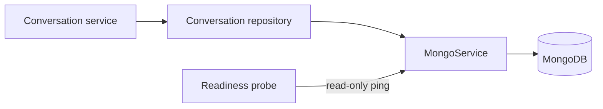

# MongoDB lifecycle and operations

Status: implemented. Last verified: **2026-07-25** against MongoDB Node.js
driver `7.5.0` and MongoDB Community `8.0.28`.

## Boundary

MongoDB stores **admin Assistant** conversation aggregates: owner identity,
purpose/channel, ordered turns, goals, lifecycle and human-takeover state.
Runtime campaign feedback no longer reads or writes this store
([ADR 0015](../../decisions/0015-postgresql-feedback-conversations.md)).
`conversation_threads` remains the Assistant collection (schema v1,
`purpose: admin_assistant`). Leftover schema-v2 `post_event_feedback`
documents may still exist until an explicit offline import; they are not a
runtime fallback. PostgreSQL is authoritative for feedback transcript,
lifecycle, work and accounting, and for relational audit, outbox and
delivery/execution projections. Redis is wake-up and rate-limit only.

The Assistant embedded transcript stays Mongo-authoritative. Feedback
transcripts now live as bounded JSONB on `feedback_conversations`. An
outbox-backed feedback turn may remain after PostgreSQL marks the outbox row
`cancelled`. Detail/UI reads retain it with the joined delivery projection.
Model-context reads exclude only rows proven never visible (`pending`, `held`,
`claimed`, `failed`, `cancelled`). Provider-crossed or uncertain rows remain.
A missing historical outbox row is included — absence cannot prove
non-delivery. Feedback sequence numbers on the PostgreSQL row remain the
cursor authority.

`MongoService` owns one native-driver client per Nest process (eager construct,
lazy memoized connect). Each conversation repository owns its document version
and queries; controllers and provider adapters never receive a Mongo client.

## Connection and readiness

`MONGODB_URI` is required and must select a database; SRV and non-SRV
replica-set seed lists are accepted. Client bounds: `maxPoolSize` 10,
connect/server-selection/pool-wait 5s, socket 10s. The driver handles transient
reconnects; the application does not run an unbounded retry loop.

Readiness performs only `ping` through the shared one-second application
deadline and driver command timeout. Concurrent probes share one in-flight
ping; a timed-out ping is discarded so a later healthy probe can recover. Nest
shutdown closes the client once. MongoDB is required for API and worker —
unavailable MongoDB degrades readiness because the Assistant still requires
it; feedback campaign conversations can be read from PostgreSQL. Assistant
generation must not continue from a stale PostgreSQL content copy.

Summary lists use a narrow projection. Assistant list/detail still load
MongoDB. Feedback campaign lists and due-work scans read PostgreSQL scalars
and do not load transcripts for counts.

## Security and provisioning

Development Compose binds MongoDB to loopback. Production publishes no MongoDB
port and attaches it only to the internal `data` network. The official image is
pinned by exact version and multi-platform digest.

A fresh volume creates a root user (Mongo-only root secret), a database-scoped
`readWrite` application user (separate secret), and `conversation_threads` with
the Assistant indexes only:

- schema-v1 owner/recency and purpose/state indexes.

Obsolete feedback index creation is omitted for new volumes. This file does
not drop indexes on an already-initialized volume. Feedback open-phone,
campaign-recency, due-work, lifecycle and attention indexes now live on
`feedback_conversations`.

API and worker receive only the application secret. The Assistant repository
idempotently verifies required indexes on its first conversation operation,
not during readiness.

Compose provisioning and the backend secret entrypoint share one ASCII contract:
database names 1–63 `[A-Za-z0-9_-]`, application users 1–64
`[A-Za-z0-9._-]`, passwords 16–128 URL-safe. Production external connections
require credentials and TLS; certificate-verification bypass is rejected. The
internal Compose hostname `mongo` is the only production plaintext exception
(Docker internal data network).

Changing a Docker secret file does **not** rotate a user already stored in an
initialized volume. Change the password in MongoDB first, update the file,
recreate API/worker and verify readiness. Do not delete the volume to rotate.

## Failure, limits and backup

Reads validate persisted documents with Zod. Create/sync and transition
commands consume typed application values without parsing them again. Turn transitions compare owner, turn id, status and exact attempt —
stale attempts are fenced; an existing terminal result cannot be replaced by a
different one.

Assistant edit-in-new-conversation stores immutable `branchedFrom` lineage and
copies the visible prefix before the replaced user turn. Inherited turns keep
ids, artifacts and original timestamps. PostgreSQL keeps lineage on the first
new execution turn so a missing MongoDB branch can be reconstructed without
duplicating old provider executions.

**Capacity.** BSON limit is 16 MiB. Schema-v1 caps embedded turns at 75; tool
artifacts additionally cap at 20 calls/turn with 512-character input and
1,536-character result previews. The Assistant append route enforces the same
cap inside locked PostgreSQL sequence allocation. Feedback transcripts cap at
150 messages of at most 64,000 characters (stored cap, not WhatsApp's 4096
send limit) with a 4 MiB `pg_column_size` backstop on the JSONB column.
Hitting either bound flags human attention and fails loudly; the durable
PostgreSQL ingress row still holds the message.

**Feedback work after the move.** `work_revision` and `work_next_action_at`
are conversation-row columns. `executionEpoch` is the fence table only;
`campaignResumeGeneration` is derived from `feedback_campaigns.resume_generation`
and is not stored again on the conversation. A worker crash leaves
`work_next_action_at` discoverable for maintenance wake-up recreation after the
PostgreSQL lease expires.

Offline import of leftover schema-v2 Mongo documents is
`pnpm import:feedback-conversations` (dry-run by default). Runtime code does
not dual-read or dual-write.

The named volume provides persistence, not backup. See the
[deployment backup/restore runbook](../../deployment.md#coordinated-backup-runbook).
A backup is not accepted merely because a command exited zero.

## Tests and references

Focused tests cover lifecycle/readiness without a live server, Assistant
aggregate validation, index contracts, idempotent sync/append, exact-attempt
fencing, conflicting terminal results and compact list projections. Feedback
row constraints and due-work keysets are PostgreSQL tests. Readiness controller tests verify dependency states and safe failure responses;
the central OpenAPI test covers the generated HTTP contract. No test suite silently depends on a developer MongoDB instance.

- [Mongo service](../../../apps/backend/src/infrastructure/mongo/mongo.service.ts),
  [assistant repository](../../../apps/backend/src/modules/conversations/conversation-thread.repository.ts),
  [Compose init](../../../docker/mongo-init/10-app-user.js)
- [ADR 0007](../../decisions/0007-mongodb-conversation-authority.md),
  [ADR 0015](../../decisions/0015-postgresql-feedback-conversations.md)
- [MongoDB Node.js driver](https://www.mongodb.com/docs/drivers/node/current/connect/connection-options/),
  [document limits](https://www.mongodb.com/docs/manual/reference/limits/),
  [Docker image](https://hub.docker.com/_/mongo)
