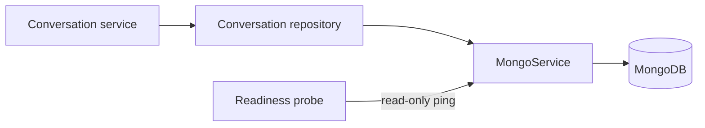

# MongoDB lifecycle and operations

Status: implemented. Last verified: **2026-07-25** against MongoDB Node.js
driver `7.5.0` and MongoDB Community `8.0.28`.

## Boundary

MongoDB stores conversation aggregates: owner identity, purpose/channel, ordered
content, goals, lifecycle, human control and durable next-action intent. One
collection, `conversation_threads`, holds two versioned shapes — schema v1
(admin Assistant) and schema v2 (post-event feedback) — discriminated by
`schemaVersion` and `purpose`. PostgreSQL remains authoritative for relational
business data, audit, outbox and delivery/execution projections. For feedback,
MongoDB stores monotonic work revision and due time; PostgreSQL grants the
execution lease/epoch; Redis is wake-up and rate-limit only.

The embedded feedback transcript is deliberately raw: an outbox-backed turn may
remain after PostgreSQL marks the row `cancelled`. Detail/UI reads retain it with
the joined delivery projection. Model-context reads perform one
transcript-bounded PostgreSQL status lookup and exclude only rows proven never
visible (`pending`, `held`, `claimed`, `failed`, `cancelled`). Provider-crossed
or uncertain rows remain. A missing historical outbox row is included —
absence cannot prove non-delivery. The raw array and its sequence numbers remain
the cursor authority.

`MongoService` owns one native-driver client per Nest process (eager construct,
lazy memoized connect). Each conversation repository owns its document version
and queries; controllers and provider adapters never receive a Mongo client.

## Connection and readiness

`MONGODB_URI` is required and must select a database; SRV and non-SRV
replica-set seed lists are accepted. Client bounds: `maxPoolSize` 10,
connect/server-selection/pool-wait 5s, socket 10s. The driver handles transient
reconnects; the application does not run an unbounded retry loop.

Readiness performs only `ping` through the shared one-second application
deadline and driver command timeout. Concurrent probes share one in-flight
ping; a timed-out ping is discarded so a later healthy probe can recover. Nest
shutdown closes the client once. MongoDB is required for API and worker —
unavailable MongoDB degrades readiness; generation must not continue from a
stale PostgreSQL content copy.

Summary lists use a narrow projection. The feedback campaign list projects
counts and last-message metadata through aggregation. Full embedded content
loads only for thread detail/model-history or an actual PostgreSQL backfill.

## Security and provisioning

Development Compose binds MongoDB to loopback. Production publishes no MongoDB
port and attaches it only to the internal `data` network. The official image is
pinned by exact version and multi-platform digest.

A fresh volume creates a root user (Mongo-only root secret), a database-scoped
`readWrite` application user (separate secret), and `conversation_threads` with
seven reviewed indexes:

- schema-v1 owner/recency and purpose/state indexes;
- schema-v2 partial **unique** index on `phoneAtLaunch` for open feedback
  conversations;
- schema-v2 campaign/recency and due-work indexes
  (`work.nextActionAt`, `_id` with partial date filter);
- schema-v2 lifecycle state and attention-recency indexes for the admin Overview
  facet.

API and worker receive only the application secret. The repository idempotently
verifies required indexes on its first conversation operation, not during
readiness.

Compose provisioning and the backend secret entrypoint share one ASCII contract:
database names 1–63 `[A-Za-z0-9_-]`, application users 1–64
`[A-Za-z0-9._-]`, passwords 16–128 URL-safe. Production external connections
require credentials and TLS; certificate-verification bypass is rejected. The
internal Compose hostname `mongo` is the only production plaintext exception
(Docker internal data network).

Changing a Docker secret file does **not** rotate a user already stored in an
initialized volume. Change the password in MongoDB first, update the file,
recreate API/worker and verify readiness. Do not delete the volume to rotate.

## Failure, limits and backup

Aggregate create/sync validates the complete document with Zod; transition
commands validate typed payloads before mutation; every read validates the
result. Turn transitions compare owner, turn id, status and exact attempt —
stale attempts are fenced; an existing terminal result cannot be replaced by a
different one.

Assistant edit-in-new-conversation stores immutable `branchedFrom` lineage and
copies the visible prefix before the replaced user turn. Inherited turns keep
ids, artifacts and original timestamps. PostgreSQL keeps lineage on the first
new execution turn so a missing MongoDB branch can be reconstructed without
duplicating old provider executions.

**Capacity.** BSON limit is 16 MiB. Schema-v1 caps embedded turns at 75; tool
artifacts additionally cap at 20 calls/turn with 512-character input and
1,536-character result previews. The Assistant append route enforces the same
cap inside locked PostgreSQL sequence allocation. Schema-v2 caps the transcript
at 150 messages of at most 64,000 characters (stored cap, not WhatsApp's 4096
send limit) with a 4 MiB document backstop measured before each append.
Sequence allocation is fenced by current array size. Hitting either bound flags
human attention and fails loudly; the durable PostgreSQL ingress row still holds
the message.

**Schema-v2 `work`.** Optional on read for reader-first rollout; fully written
on the next schedule. `revision` is monotonic; `nextActionAt` is durable intent;
`executionEpoch` is the highest PostgreSQL epoch admitted; optional
`campaignResumeGeneration` deduplicates cross-store resume. Scheduling
increments revision atomically. Begin requires the exact due revision and a
newer epoch; settlement requires the same epoch and cannot clear a revision that
a newer participant message or operator transition created. A worker crash leaves
`nextActionAt` discoverable for maintenance wake-up recreation after the
PostgreSQL lease expires.

Extraction-driven terminal state records `lifecycle.terminalOutboxId` in the
same update that advances the snapshot cursor and writes `completed`/`declined`.
Handoff, duty-of-care, withdrawal and hostility exits likewise advance
cursor/accounting and set `awaitingHuman` in one update.

The named volume provides persistence, not backup. See the
[deployment backup/restore runbook](../../deployment.md#coordinated-backup-runbook).
A backup is not accepted merely because a command exited zero.

## Tests and references

Focused tests cover lifecycle/readiness without a live server, aggregate
validation for both schema versions, index contracts, idempotent sync/append,
exact-attempt fencing, conflicting terminal results, work revision/epoch
settlement, transcript capacity and compact list projections. A booted HTTP
contract test verifies MongoDB in readiness and generated OpenAPI (safe 503
shape). No test suite silently depends on a developer MongoDB instance.

- [Mongo service](../../../apps/backend/src/infrastructure/mongo/mongo.service.ts),
  [assistant repository](../../../apps/backend/src/modules/conversations/conversation-thread.repository.ts),
  [feedback repository](../../../apps/backend/src/modules/post-event-feedback/post-event-feedback-conversation.repository.ts),
  [Compose init](../../../docker/mongo-init/10-app-user.js)
- [ADR 0013](../../decisions/0013-state-driven-feedback-orchestration.md)
- [MongoDB Node.js driver](https://www.mongodb.com/docs/drivers/node/current/connect/connection-options/),
  [document limits](https://www.mongodb.com/docs/manual/reference/limits/),
  [Docker image](https://hub.docker.com/_/mongo)
