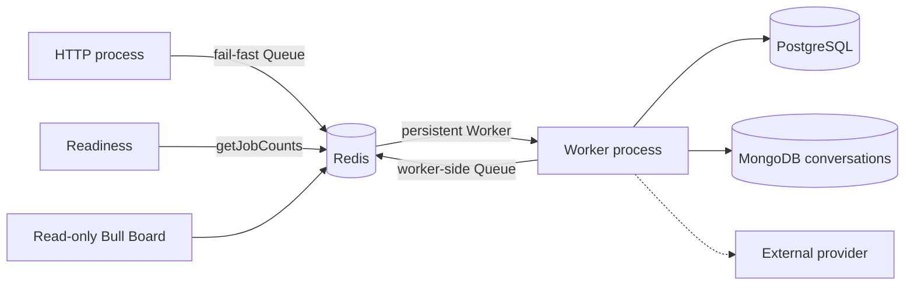
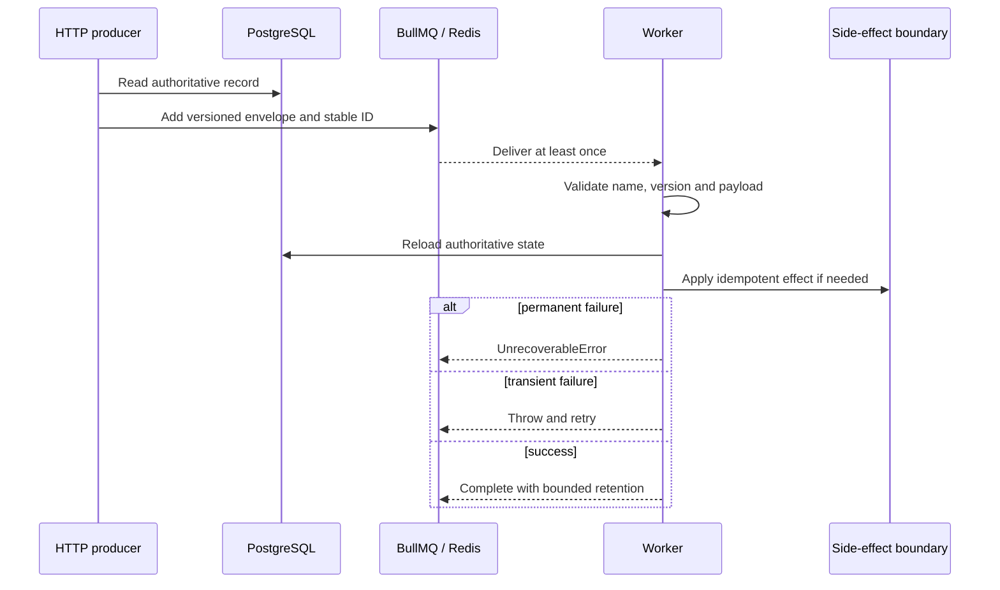

# Queues and workers

Status: implemented. Last verified: **2026-08-03** against
`@nestjs/bullmq 11.0.4`, BullMQ `5.80.10` and Bull Board `8.1.2`.

## Boundary and ownership

BullMQ handles retryable asynchronous delivery. Redis is coordination, not a
business source of truth. HTTP owns producers; a separately deployed Nest
worker owns processors.

`QueueModule` owns producer Queues used by HTTP, readiness and Bull Board. Its
Redis commands use `maxRetriesPerRequest: 1` so requests fail rather than hang
during an established-connection outage. `QueueWorkerModule` owns the worker
boundary. Nest's BullMQ integration still creates one registration Queue per
registered queue for processor discovery. Worker-side feedback producers publish
only successor/recovery wake-ups after durable intent exists: conversation
revisions, campaign-summary attempts and the single maintenance schedule. The
email relay still publishes its delivery jobs. Feedback outbound delivery does
not use BullMQ; its bounded loop claims PostgreSQL rows directly. Each processor
Worker also owns command and blocking connections. Worker connections use
`maxRetriesPerRequest: null` and keep reconnecting.

The assistant also uses a Redis **stream** to relay accumulated live text from
the worker process to an authenticated SSE response in the HTTP process. That is
not a BullMQ job and never becomes a source of truth: it retains only a bounded,
ten-minute replay tail, and the browser keeps polling the durable turn beneath
it. Its attempt fencing and failure behavior are owned by
[assistant streaming](assistant-streaming.md).

Nest closes Queues and Workers. Do not substitute `Queue.disconnect()`; it can
wait on a client still initializing during an outage. Worker close stops new
fetches and waits for active jobs without its own deadline. Deployment grace
must exceed normal job duration; an ungraceful stop relies on stalled recovery
and can execute the job again.

Close is ordered, not merely awaited. BullMQ opens each connection lazily and
keeps `RedisConnection.init()` pending across a Redis `INFO` round trip that
runs _after_ the socket is already ready. Closing a Queue inside that window
hard-disconnects the client, so ioredis flushes the in-flight `INFO` with
`Connection is closed.` and BullMQ re-emits that rejection on a connection whose
listeners `close()` has just removed. Nothing is left to receive it and the
process sees an unhandled rejection per queue.
[`QueueLifecycleService`](../../../apps/backend/src/infrastructure/queue/queue-lifecycle.service.ts)
therefore settles every connection in `beforeApplicationShutdown`, a phase that
completes before any `onApplicationShutdown` hook and so before the Nest BullMQ
integration closes a Queue. Close then always takes the drained `quit()` path.
The wait is bounded by `QUEUE_SETTLE_TIMEOUT_MS` so a Redis outage cannot hold
the process open; a connection that never opened has no command in flight, so
closing it was already safe. Anything that reads a queue during shutdown belongs
in the same phase for the same reason — that is why the assistant recovery
scheduler clears its interval and drains its in-flight pass there.

## Versioned contract

The disposable reference contract is explicit:

- queue `reference`;
- job `reference.inspect-record.v1`;
- payload `{ schemaVersion: 1, recordId: UUID, correlationId: string }`;
- job ID `reference-inspect-v1-<recordId>-<idempotencyKey>`, with a UUID
  idempotency key and no colon.

The production assistant contract follows the same boundary:

- queue `assistant`;
- job `assistant.generate-turn.v2`;
- payload `{ schemaVersion: 2, turnId: UUID, correlationId: string }`;
- job ID `assistant-generate-v2-<turnId>-<attempt>`.

The email contracts are:

- queue `email-delivery`;
- relay job `email.relay-outbox.v1`;
- delivery job `email.deliver.v1`;
- delivery payload `{ schemaVersion: 1, deliveryId: UUID, outboxEventId: UUID,
correlationId: string }`;
- delivery job ID `email-deliver-v1-<outboxEventId>`.

Only PostgreSQL contains the email recipient and message content. The email
outbox relay publishes delivery jobs with
[`OUTBOX_RELAY_JOB_OPTIONS`](../../../apps/backend/src/infrastructure/queue/queue.constants.ts)
(`attempts: 1`, immediate `removeOnComplete` / `removeOnFail`, `stackTraceLimit: 3`),
deliberately overriding the producer defaults for an at-most-once enqueue policy;
PostgreSQL owns recovery and business retry timing. Until a provider is explicitly integrated, the consumer
records a safe `provider_not_configured` blocked attempt and performs no
external side effect.

The steady-state post-event feedback contracts are:

| Queue                   | Job and identifier-only payload                                                                           | Stable job ID                                       | Meaning                                                                                  |
| ----------------------- | --------------------------------------------------------------------------------------------------------- | --------------------------------------------------- | ---------------------------------------------------------------------------------------- |
| `feedback-ingress`      | `feedback.materialize.v1` with `{ schemaVersion: 1, ingressId, correlationId }`                           | `feedback-materialize-v1-<ingressId>`               | Materialize one durable provider ingress row immediately                                 |
| `feedback-conversation` | `feedback.reconcile-conversation.v2` with `{ schemaVersion: 2, conversationId, revision, correlationId }` | `feedback-reconcile-v2-<conversationId>-<revision>` | Wake one exact MongoDB work revision; reload current state and choose at most one action |
| `feedback-summary`      | `feedback.summarize-campaign.v2` with `{ schemaVersion: 2, campaignId, attempt, correlationId }`          | `feedback-summarize-v2-<campaignId>-<attempt>`      | Execute one durable pending campaign-summary attempt                                     |
| `feedback-maintenance`  | `feedback.maintenance.v2` with `{ schemaVersion: 2, correlationId }`                                      | repeat schedule                                     | Repair pending ingress, campaign resumes, due conversation work and summaries            |

The legacy `feedback` queue remains for post-replacement drain only. Its retained
extraction and campaign-summary jobs validate their V1 identity, then publish
the current durable V2 wake-up without entering a model. Retained reminder and
expiry ticks run conversation recovery rather than the old bulk semantics; a
retained ingress tick repairs ingress only and no longer creates V1 extraction
jobs. Relay and delivery consumers are validation-only drain branches: they
parse the envelope and, for delivery, verify the deterministic row id, but never
claim a row or call the provider. The direct PostgreSQL dispatcher is the sole
delivery authority. A row left in legacy `sending` is quarantined as ambiguous
after the recovery horizon because the retained job cannot prove whether an
older worker crossed the provider boundary. New application paths do not
produce V1 jobs.

First V2 activation is a non-rolling worker replacement. The old worker must
finish or stop before the new image starts; the single production Compose
worker provides that barrier. The compatibility consumers and legacy Redis
mutex defend retained work after replacement. They are not permission to run
old and new worker replicas side by side: an old V1 summary consumer cannot
honor the PostgreSQL summary claim.

During this bridge, the V2 conversation processor also holds the legacy
per-conversation Redis mutex around reconciliation and terminal fallback before
using the PostgreSQL commit fence. That is not a second steady-state authority;
it only serializes a model call already started by an older binary that does not
understand the new fence. Remove the V1 consumer and this mutex dependency in
the same release, only after the maximum failed-job retention window has passed
with no V1 arrivals. Removing one without the other either restores duplicate
model entry or preserves dead locking machinery indefinitely.

Conversation wake-ups are disposable. MongoDB stores `{ revision,
nextActionAt, executionEpoch, campaignResumeGeneration? }`; scheduling increments the revision and commits
that intent before `Queue.add`. A missing Redis job therefore delays work only
until maintenance republishes the same revision. The reconciler obtains a
seven-minute PostgreSQL lease, mirrors its monotonic epoch onto the exact due
MongoDB revision, reloads campaign, consent, lifecycle, control, goals and
messages, and selects at most one action. Settlement either clears durable work
or writes the successor schedule under a new revision. A successor that wakes
while the previous revision still owns the PostgreSQL claim moves itself back
to BullMQ's delayed set without consuming an attempt; completing that busy job
would let `removeOnComplete` swallow the only wake-up for the newer revision.
Only an explicit `FeedbackExtractionGenerationError` may enter terminal
extraction fallback or provider parking. Exhausted planning, reminder, expiry or
settlement failures remain failed disposable wake-ups; they write no fallback
evidence or human-control state, and maintenance rediscovers the unchanged
durable work.

Execution guards have three queue meanings, not one generic failure. An
`authoritative_state_changed` guard (new revision, takeover, pause, cancellation
or consent change) completes normally as `superseded`; it consumes no retry and
is not retained as a failed job. `execution_claim_lost` means the PostgreSQL
lease/token no longer belongs to this worker, so it is rethrown for the ordinary
BullMQ retry policy and never enters participant-facing fallback.
`execution_invariant_broken` means the PostgreSQL claim and MongoDB aggregate
have an impossible shape (for example, a missing work record for an admitted
claim); it is unrecoverable and retained for diagnosis, again without fallback.
Its failed wake-up carries an exact versioned marker. While that job is retained,
maintenance preserves the quarantined current revision instead of removing and
recreating it; a newer durable revision has a different job ID, and every other
failed reason remains recoverable through normal replacement.

Campaign resume has a separate cross-store repair fence because PostgreSQL
owns campaign status while MongoDB owns conversation work. The same PostgreSQL
status transaction increments `resume_generation` and persists
`resume_due_at`; it does not declare the resume complete. An immediate repair,
or the existing maintenance job after a crash, bulk admits the exact generation
into every open Mongo conversation, then advances `resume_applied_generation`
and clears the due timestamp. Maintenance first allocates
`(resume_due_at, campaign_id, generation)` keyset pages of 50 under the global
`campaign_resume` checkpoint row and commits the cursor. It then handles each
candidate in a separate transaction that re-locks only that exact generation
before MongoDB admission and PostgreSQL acknowledgement. Allocation therefore
never holds a campaign lock across MongoDB, and one failed generation cannot
retain the global prefix; the 100-item pass limit and finite wrap bound retries.
Mongo filters out an already-admitted generation, so a crash after the bulk
write but before acknowledgement replays without advancing work revisions
twice. Pause and close take the same campaign row lock and cancel an intent they
beat. Wake-up publication happens after acknowledgement and remains disposable:
the ordinary due-work scan can recreate it.

The campaign-summary row is similarly authoritative. Manual and automatic
requests lock the campaign row before deriving the next attempt, so concurrent
first requests collapse to one pending row and one audit event instead of
racing the campaign-unique insert. The same lock stays held while a fresh
request counts open MongoDB conversations and persists its snapshot. Campaign
launch/start holds that row lock across each MongoDB conversation create, giving
the two cross-store mutations one total order: a summary either commits before
the new thread or includes it as open. A summary worker then claims that exact
attempt in PostgreSQL with a monotonic epoch, opaque token and seven-minute
lease. It heartbeats while waiting or generating and renews once more inside
the deployment-wide provider slot immediately before provider entry. Busy
duplicates move themselves to BullMQ's delayed set without consuming an
attempt; ready/failed writes require the same live token. Maintenance repairs
the commit-to-enqueue gap. Pending rows are scanned by
`(requested_at, campaign_id)` in pages of 50 under the `summary_pending`
checkpoint; that cursor commits before BullMQ inspection or publication. A
retained waiting/delayed/active job therefore advances fairness like any other
row, while one enqueue failure is isolated and cannot hide the next summary.
Finite wrap revisits a page skipped by process death. The separate
`summary_auto` cursor allocates bounded campaign pages before MongoDB lifecycle
evaluation and reconstruction of missing/stale automatic intent. The
maintenance job itself is one bounded periodic wake-up whose ingress,
campaign-resume, conversation and summary subtasks fail independently.
Each conversation pass first seeds at most 100 open bot-controlled legacy
documents that have no `work` field, using `work: { $exists: false }` again on
the update so concurrent materialization or resume wins. Seed failure is logged
but does not block recovery of already-native V2 revisions.

**Materialization has its own queue because it must not wait for a model call.**
Writing an inbound message into the transcript is a Mongo append and a short
PostgreSQL transaction; an extraction run holds its slot for as long as the
provider takes. On one queue the fast job inherits the slow job's service time.
A rehearsal of eighteen concurrent conversations on 2026-07-27 measured what
that costs: 52 provider calls consumed 2340 of the 2364 slot-seconds that
existed, so 45 inbound messages reached the transcript after 118 seconds on
average and 296 at worst. Three things downstream assume otherwise — the quiet
window collects what materialization has already written, `stillTyping` and
`superseded_by_newer_testimony` compare against the transcript, and the admin
renders it in timestamp order — so all three silently degraded: the bot answered
questions the participant had already answered, and a message observed at 11:41
appeared below a question asked at 11:42 because it was appended after it.

Materialization remains isolated because it is latency-sensitive ingress, while
the slower follow-up is now a conversation-revision wake-up rather than a
position-specific extraction job. Neither payload carries message text, phone
numbers or provider identifiers. After appending the inbound message, the
materializer moves the durable rolling `nextActionAt` to the newest participant
message plus the quiet window, then publishes that revision. Resume, campaign
resume and provider-incident recovery use the same scheduling boundary instead
of inventing parallel job ladders.

Materialization is deployment-wide per routing identity, not merely ordered by
one process. `feedback-ingress` may run twenty jobs per worker, while a dedicated
PostgreSQL session advisory lock serializes rows sharing a phone (or `chatJid`
fallback). Same-route jobs first wait on one process-local tail. Up to five
different routes then use a dedicated lock pool, so waiters cannot exhaust the
normal pool needed by the protected repository work. The holder
drains durable `pending` rows in database-assigned `ingress_order` before the job
that woke it, so unrelated conversations progress together and two replicas
cannot race one participant's transcript. The lock name contains a SHA-256
digest, not the phone or chat id. It has no expiring lease: PostgreSQL releases
the session lock when the holder finishes or its worker/connection dies.
An isolated lock-connection loss is fail-closed for the job but is not a
cross-store transaction: an already in-flight MongoDB operation may finish
before the worker observes the loss. Mongo optimistic append and ingress/outbox
idempotency remain the final replay guards.

The conversation processor runs ten jobs per worker, but PostgreSQL serializes
execution per conversation across every replica. The lease is a commit fence,
not merely a mutex: answer/note/outbox writes validate its opaque token inside
their transaction, and cursor settlement validates the same execution after the
transaction. A worker that outlives its lease can finish spending CPU but cannot
publish stale business effects. Different conversations remain parallel and
the deployment-wide provider concurrency/start-rate guards still bound their
combined model pressure.

This is an application ordering limit, not a provider-call limit. Every backend
model boundary — assistant generation, feedback extraction, attention
classification and campaign summaries — also enters the same Redis-backed
lease semaphore. `PROVIDER_CALL_CONCURRENCY_LIMIT` is deliberately hardcoded to
`30`: neither OpenAI nor OpenRouter publishes one stable concurrency quota
across all models and accounts, so thirty is a product guard, not a claim about
provider capacity. A second deployment-wide Redis window permits at most
`PROVIDER_CALL_STARTS_PER_MINUTE_LIMIT` (60) starts in any rolling minute.
Releasing a fast call frees its concurrency lease but not its minute-window
entry. This was added after the 2026-08-02 Luna rehearsal consumed the project's
200k TPM allowance while its 500 RPM allowance was nearly untouched. A direct
Terra probe on 2026-08-03 returned 500 RPM / 500k TPM for this project. The first
production Terra rehearsal peaked at 166,983 reported tokens in a rolling
60-second completion window under the old 30-start gate; 60 starts is the next
measured operating point, still bounded by 30 overlapping calls. Worker replicas
therefore share both guards; a dead worker
loses concurrency until its six-minute lease expires but can never create an
extra slot.

The feedback Worker's BullMQ name also carries a versioned, base64url-encoded
control attestation: extraction-stub state, public model id, provider adapter id,
extraction, reply and attention effort, and the effective OpenAI service tier. BullMQ
publishes that name through Redis `CLIENT LIST`, which `Queue.getWorkers()`
returns as `rawname`. Paid simulator preflight compares every registered
feedback worker with the HTTP process's resolved profile. No worker, an unnamed
or legacy worker, malformed metadata, mixed replica profiles, or any API/worker
mismatch is fail-closed before ingress is written. The profile contains no key
or participant data. The decorator needs its name before Nest dependency
injection exists, so this single startup boundary reads the environment already
loaded by `instrumentation.ts`; the same resolvers and strict vocabulary used by
the validated `ConfigService` build the profile.

The quiet window is rolling, not leading-edge. Every participant fragment
materializes immediately and atomically replaces the conversation's durable due
time with `latest participant timestamp + FEEDBACK_EXTRACT_QUIET_WINDOW_MS`.
Old revision jobs become cheap stale no-ops. This is the token-control mechanism
for slow typists: ten fragments over three minutes still buy one model call,
after the latest fragment has been quiet for the window. It does not pretend
that cancelling an already-dispatched provider request refunds the call.

Before any model call, the reconciler and extractor reload authoritative state
and stop for closed lifecycle, human control, campaign pause/close, consent
withdrawal, an already-covered cursor or no unread participant text. After the
deployment-wide provider limiter grants a slot, the final provider-entry check
runs in one short PostgreSQL transaction. In stable order it takes the ingress
phone advisory lock and the shared conversation advisory lock, validates the
execution token, share-locks the campaign, locks the participant consent row,
rejects durable inbound beyond the Mongo snapshot, then performs the final
Mongo revision/lifecycle/control/`awaitingHuman` read. The transaction commits
before the network call; it is the billing boundary, never a lock held over
model latency. A fragment or kill-switch mutation that started before that
boundary blocks and suppresses the call. One that starts after it is later than
provider entry and cannot retroactively refund it.

If a
participant message lands after the model snapshot, the execution may still
persist idempotent answers/notes and advance the snapshot cursor; it suppresses
ordinary outbound copy and leaves the newer revision due. Completion or handoff
copy follows its stricter terminal rules. We do not claim to roll back a paid
model call or atomically discard relational results across two databases.
If a takeover/resume or another non-testimony work generation supersedes the
paid snapshot, the same structured results remain, but producer admission
creates no outbound row and the ordinary cursor CAS requires the exact original
work revision/epoch. The successor therefore remains unread and discoverable;
`mode=bot` becoming true again is not allowed to hide the control ABA.
The optional participant-facing reply rewrite repeats the same provider-entry
guard. If authoritative state changes after extraction/classification were paid
but before that rewrite, the rewrite is skipped, valid answers/notes still
persist, and the old execution owns neither outbound copy nor cursor. Claim loss
and impossible execution state are not treated as supersession: they propagate
with the retry/unrecoverable meanings above.
Materialization also takes the shared conversation mutex before it marks that
ingress terminal and retracts still-pre-send ordinary automation. The exact
post-cursor handoff promise, exact lifecycle terminal row, `system` rows and
staff rows survive; a cancelled audit-intent bot turn remains visible only with
its joined `cancelled` outbox projection and is never presented as sent.

Results are written to PostgreSQL first under the execution token and the
MongoDB cursor advances last. A crash between stores may repeat computation;
answer uniqueness, note signatures and outbox `dedupe_key` absorb duplicate
effects. A newer lease makes the old execution retryable claim loss; a newer
revision under the same admitted execution is successful supersession and
preserves the successor's durable work.

Provider incidents park the conversation and let the current-state planner
schedule a five-minute successor until the six-hour park horizon. Deterministic
terminal failures move to human handling instead of buying the same failed call
forever.

For Assistant work, MongoDB owns the owner-scoped thread, ordered history and
user-visible turn state. PostgreSQL retains the request id, model, attempt and
recovery/execution projection. The worker fences the PostgreSQL projection by
turn ID and exact attempt, then loads model history from MongoDB; job payloads
must never contain chat content or provider credentials. The attempt stays out
of the payload but is encoded in the deterministic job ID. A manual retry
increments it, fencing retained jobs from an older attempt.

Producer and processor both validate the envelope. Redis may contain jobs from
another deployer/version, so unknown names, unsupported versions, malformed
data and missing authoritative records throw `UnrecoverableError`. Transient
dependency errors are rethrown for BullMQ retry.

## Retry, concurrency and retention

| Policy              | Reference value                                               |
| ------------------- | ------------------------------------------------------------- |
| Attempts            | 5 total                                                       |
| Backoff             | Exponential from 1 second, jitter `0.5`                       |
| Stack traces        | 10 retained entries                                           |
| Worker concurrency  | Per processor, not global — see the table below               |
| Stalls              | BullMQ 30-second lock/renewal; one recovery, next stall fails |
| Completed retention | 1,000 jobs or 1 day                                           |
| Failed retention    | 5,000 jobs or 7 days                                          |
| Metrics             | Completed/failed buckets for 2 weeks, 1-minute granularity    |

Concurrency is chosen per processor, and no two agree:

| Processor             | Concurrency | Why                                                               |
| --------------------- | ----------- | ----------------------------------------------------------------- |
| Reference             | 5           | Cheap local work, no provider on the path                         |
| Assistant             | 2           | Provider-bound, two-minute deadline                               |
| Email                 | 2           | Provider-bound, cheap                                             |
| Feedback V1 bridge    | 10          | Drain only; no new steady-state production                        |
| Feedback ingress      | 20          | PostgreSQL-serialized per routing identity                        |
| Feedback conversation | 10          | PostgreSQL-fenced per conversation; parallel across conversations |
| Feedback summary      | 1           | One expensive aggregation locally; PostgreSQL fences replicas     |
| Feedback maintenance  | 1           | Bounded repair scan; its subtasks run independently               |

Choose these values per provider rate limits, work cost and failure modes; none
of them is sacred numerology. CPU-heavy work needs measured sandboxing
or worker threads. A stall/lock-renewal failure means possible duplicate work,
event-loop starvation or process death and is logged as an operational error.

The retention rows are the module default. Conversation V2 removes successful
wake-ups immediately. A deterministic terminal extraction fallback atomically
clears the MongoDB due time without advancing the work revision, so its exact
failed wake-up remains observable under the seven-day/count-bounded retention
policy. Ordinary infrastructure or action failures deliberately leave durable
work due; maintenance may remove their retained terminal copy and reuse the
same deterministic id, because MongoDB work — not queue history — is the proof
that something is still owed. Summary jobs are keyed by the durable attempt. A
retained/stalled duplicate cannot enter the summary provider while another live
token owns that attempt. Maintenance uses one repeat schedule rather than three
clocks that can overlap.

Expected authoritative supersession is a successful completion and therefore
never occupies that failed-job retention budget. Failed retention is for a
terminal extraction fallback, an unrecoverable execution invariant, or an
exhausted retryable claim/infrastructure failure; those categories must not be
collapsed merely because they share one worker.

The assistant worker deliberately uses concurrency `2` and a two-minute
provider deadline. AI SDK retries are disabled so BullMQ owns visible retries.
Permanent provider/configuration failures stop retrying; timeout, rate-limit and
provider 5xx failures retry. Nonterminal row updates and terminal completion are
guarded by turn ID and attempt so a late stalled execution cannot replace a
newer retry or terminal result. A stall can still repeat the provider call and
cost money; no provider-call exactly-once claim is made.

The assistant processor also reconciles a valid turn/attempt from terminal
BullMQ `failed` events, covering failures outside its generation catch. The
worker scans stale nonterminal turns on startup and every five minutes: after a
15-minute threshold it checks the exact BullMQ job and fails the guarded attempt
only when that job is missing or terminal. Live waiting/delayed/active jobs are
left alone. Multiple worker replicas may scan concurrently because the terminal
write is status-and-attempt conditional.

A deterministic job ID suppresses duplicates only while the job remains in
Redis. Retention removal permits the same ID again. External writes therefore
need a durable idempotency key or database uniqueness constraint.

The feedback maintenance job scans MongoDB's due-work index oldest-first in
keyset pages of 100, with at most 500 documents examined by one global
maintenance pass. The `(nextActionAt, conversationId)` cursor means an oldest
prefix whose wake-ups are all still live cannot hide row 101 forever. Before
each page, the worker locks the `conversation_due` row in
`feedback_maintenance_checkpoints`, reads the indexed MongoDB page, advances or
wraps the checkpoint and commits; only then does it publish wake-ups. Replicas
therefore allocate different bounded pages and a process restart continues from
the shared boundary. A crash after allocation may defer that page until the
finite wrap, but cannot consume its MongoDB work revision. The checkpoint is
durable fairness state, never proof that business work completed. Campaign
resume publishes only one first page; maintenance owns the rest.
Recovery republishes the exact current revision when Redis has no live wake-up
and removes a retained terminal copy before reusing that deterministic ID,
except for the exact versioned execution-invariant quarantine marker.
Terminal conversation-specific extraction fallback is deliberately absent from
that scan: setting `awaitingHuman` clears `work.nextActionAt` in the same MongoDB
write, including on a replay that finds the brake already set, and does not
advance the revision. Its failed job therefore remains quarantined for
inspection instead of being converted into a successful no-op.
Closed or human-controlled conversations are intentionally still eligible for
one cheap planner pass, because that pass clears obsolete durable intent;
filtering them out would leave permanent due rows. Redis AOF reduces latency
after restart, but MongoDB `nextActionAt` is the business proof that work is
owed.

During the V1 drain only, the same pass repairs at most 100 cursor-first handoff
crashes before seeding missing V2 work. It sets `awaitingHuman` only for an open
bot conversation with no unread participant turn and unresolved `handoff`,
`unfinished_questionnaire`, `hostile_to_bot` or `undelivered_message` evidence,
or an urgent-follow-up message. `control.source=staff_action` is excluded so an
explicit staff resume wins. Selection and update recheck the same filter, making
concurrent maintenance idempotent; this bridge leaves with the V1 consumer.

## Readiness, observability and dashboard

HTTP readiness runs real `getJobCounts` with the shared one-second deadline;
concurrent probes share the pending command. It proves current Redis command
execution, not worker presence, queue latency or provider health. Production
must monitor worker processes and alert on failed, delayed, stalled and oldest
waiting jobs.

Processor logs cover attempt/terminal failure, stalls, lock-renewal failure and
worker error using queue/job IDs, attempts and validated correlation ID—never
raw job data. BullMQ metrics are retained data, not an alerting strategy.

Bull Board is absent by default. When enabled it requires validated Basic
credentials, disables retry controls, hides Redis details, prevents framing and
sends no-store/referrer/content-sniffing headers. It is read-only inspection,
not alerting or authorization. Production still requires TLS plus private
networking/SSO, and job payloads must exclude secrets and unnecessary personal
data.

Bull Board is not the operator surface for outbound feedback delivery. It speaks
in job ids, and a job id cannot say which participant is waiting; the admin's
[outbound queue](../../frontend/feedback-outbound-queue.md) answers that from
`message_outbox` alone. Detail exposes the durable claim expiry, send-start
marker, attempt count and last error; it does not infer delivery truth from a
BullMQ job. `claimed` is safely retryable after lease expiry, `attempting` has
crossed the provider boundary, and `ambiguous` is deliberately quarantined.

During an incident, fix the dependency/data before retrying; retry only when the
side effect is independently idempotent. Treat stalls as possible duplication.
The bounded failed set is the current quarantine; add a replay/dead-letter flow
only with explicit ownership, authorization, audit and retention.

## Commit-to-enqueue guarantee

The reference producer intentionally has a database-to-queue crash gap. The
email workflow is the first implementation of the required transactional
outbox:

1. Write mutation and outbox row in one PostgreSQL transaction.
2. Relay the committed row using its ID as the stable job key.
3. Mark delivery only after BullMQ acknowledges the add; retry otherwise.
4. Alert on backlog and retain processor-side idempotency.

The email relay leases with `FOR UPDATE SKIP LOCKED`, reclaims expired leases
and republishes unconsumed dispatches after a recovery horizon. The consumer
marks the outbox event consumed in the same transaction as its fenced delivery
claim. This closes the commit/enqueue and acknowledged-job-loss gaps, not
downstream exactly-once effects.

Feedback `message_outbox` uses no commit-to-enqueue bridge. A one-second worker
loop directly claims up to four rows with `FOR UPDATE SKIP LOCKED`, setting an
opaque token and two-minute lease from PostgreSQL's clock. Eligibility admits
only the oldest unresolved row of each conversation, so a lock held by another
replica cannot make `SKIP LOCKED` leapfrog it. Same-conversation claims are also
executed serially in-process; different conversations retain four parallel
lanes. An explicit staff row may pass an older `ambiguous` row after takeover.
The only automated exception is the exact STOP acknowledgement id currently
stored in MongoDB as `lifecycle.terminalOutboxId`; it may also pass
`ambiguous`, but neither exception can pass `pending`, `held`, `claimed`,
`attempting` or legacy `sending`.
This is conversation FIFO, not global phone FIFO: `phoneAtLaunch` lives in
MongoDB, so ordering across two historical conversations for one phone would
require denormalizing that routing identity into PostgreSQL.

A campaign paused during pacing releases the claim back to `pending`; a closed
campaign cancels it and a missing campaign fails it. The exact lifecycle-
anchored STOP acknowledgement is the sole automated pause/close exception:
STOP revokes consent independently of campaign state, so its acknowledgement
remains owed. Campaign close and STOP share the campaign row lock, and close
preserves only that exact id. Lifecycle, human control, current participant
consent and `awaitingHuman` guard every automated send.
The final guard passes that exact id into the token-fenced `attempting` CAS;
the repository still requires `launched` unless the row being marked is the
same authorized id. A STOP-shaped dedupe key has no authority at either fence.
The sole `awaitingHuman` bot exception is the latest bot outbox commitment after
the extraction cursor; a participant fragment arriving behind that promise does
not erase it, while a safety-only run creates no exception. Completion/decline
copy and STOP acknowledgement additionally require the exact
`lifecycle.terminalOutboxId` committed by MongoDB; a dedupe-shaped row alone
has no authority. Completion/decline keys include the durable Mongo work
revision as well as the testimony sequence: takeover followed by resume can
therefore close the same unread testimony with a fresh row, while a retry of the
same revision still collapses onto one identity.

The deployment-wide Redis limiter is awaited while the row is still only
`claimed`. A token-fenced heartbeat renews the lease during the wait and one
final renewal follows the granted slot, so lease sizing is independent of
replica count. Transport adapters expose only `sendText` and do not apply a
second process-local pacer. Immediately before transport, the dispatcher first takes the
same phone advisory lock used by webhook acknowledgement, then the shared
conversation advisory lock, share-locks the campaign lifecycle, reloads Mongo
state and locks participant consent. For an ordinary extraction reply it loads
the immutable outbox-log snapshot and rejects a changed control generation
(`mode`, `source`, `changedAt`), execution epoch or campaign-resume generation,
either a newer participant sequence in MongoDB, or any durable PostgreSQL
inbound absent from that snapshot, including a row still pending
materialization. A normal reconciliation may persist at work revision N and
settle its future reminder at N+1, so revision alone is deliberately not the
ABA authority. It then commits the
`attempting`/`send_started_at` marker. The campaign share lock permits sends
from different conversations in parallel but conflicts with pause/close
updates. STOP, staff/external takeover, staff close, silent expiry, extraction
terminal/awaiting transitions, transcript-capacity handoff and provider
observations use the same conversation mutex, giving every provider-disabling
transition and the marker one order. An accepted result becomes `sent`, an
explicit rejection becomes `failed`, and every exception or unknown result
after the marker becomes `ambiguous`. Ambiguity and expired attempts park open
bot automation on `awaitingHuman` and raise `undelivered_message` before their
transaction commits; provider evidence may later resolve the PostgreSQL row but
does not silently clear that conservative human-review state.

`TRANSPORT_MODE=simulated` can drive those exact terminal branches with a
deterministic fault profile. The decision is derived from a non-secret seed and
the durable outbox id, so replicas running the same profile are independent of
claim order. Profile rollout itself requires a stop-the-world worker replacement;
attestation is a rehearsal preflight, not a dispatch fence. `reject` and
`rate-limit` exercise the current terminal `failed` policy (there is no
automatic 429 resend); `unknown-before-accept` produces ambiguity without a
sink row; `unknown-after-accept` writes the simulated sink first and then
returns uncertainty. A seeded `mixed` mode samples all four. Bounded simulated
latency occurs after `attempting`, which makes worker-stop/lease-expiry tests
honest without adding a dispatcher crash switch.

The V1 `sending` state is a rolling-deploy bridge. A stale legacy row cannot
prove whether its delivery job entered the provider, so cutover marks it
`ambiguous` with an explicit legacy reason and without fabricating a send-start
timestamp or attempt count. Provider observations may still reconcile it later.
Conversation/campaign cancellation includes `pending`, `held` and token-fenced
`claimed` rows with no send marker; it never rewrites `attempting`, `sending` or
`ambiguous`, where provider entry may already have happened. Ambiguity parking
also retracts later automated rows, except for an exact anchored STOP
acknowledgement that won the shared conversation lock first.

The feedback webhook edge inverts the same idea for inbound traffic. The
committed `provider_message_ingress` row is the durable acknowledgement, and the
enqueue follows it: a failed enqueue is answered with 503 rather than a 200 that
hides a stalled message, and the row stays `pending` for a provider redelivery.
Inside the worker the order is always MongoDB first, then the PostgreSQL fence
that marks the row terminal — every step before the fence is idempotent, so a
crash replays into a no-op instead of a lost or duplicated effect. Rows left
`pending` by a lost enqueue are recovered by the V2 maintenance pass, which
selects `pending` rows older than
`FEEDBACK_INGRESS_PENDING_RECOVERY_MINUTES` (default five) in `(created_at, id)`
keyset pages of 50. Page allocation locks the shared `ingress_pending`
checkpoint row across the indexed PostgreSQL read, advances or wraps that
checkpoint and commits before any queue publication. Fifty poison rows or a
worker crash after allocation can therefore postpone their page only until the
finite wrap; they cannot permanently hide row 51. The cursor is global scan
fairness, not message ordering: the materialization coordinator still owns FIFO
per phone/chat and drains that route by database-assigned `ingress_order`.

Recovery re-adds `feedback.materialize.v1` to `feedback-ingress` under the
existing `feedback-materialize-v1-<ingressId>` job id. The webhook and recovery
use one enqueue boundary: it first rechecks that PostgreSQL still says
`pending`, leaves a waiting/delayed/active job alone, and removes a retained
completed or failed job before reusing the ID. If terminal removal loses a race
without observing a live replacement, the operation fails and the durable
pending row is retried by maintenance; it never reports a fictional repair.
Fresh pending rows stay untouched until the recovery horizon so the webhook's
own enqueue is not raced. Provider redelivery remains a second recovery path;
both collapse on the same idempotent consumer.

## Extension and tests

For a real queue, define one strict versioned identifier-only envelope near the
domain; import producer and worker modules only into their process graphs;
choose delivery policy from real constraints; then test schemas, job building,
processor failure classification and module composition. Add a real Redis test
with a unique prefix, bounded waits and exact cleanup. Add the outbox and durable
side-effect idempotency before claiming critical delivery.

Focused tests cover URL/options mapping, process composition, connection settling
and its bound at shutdown, dashboard
security, deterministic IDs, payload/version rejection, permanent failures,
transient propagation, idempotent HTTP request replay and terminal assistant
turn attempt fencing. Feedback ingress adds replay coverage: duplicate webhook
delivery, double and concurrent materialization, out-of-order arrival and a
replayed STOP that must not acknowledge twice. Reconciliation tests cover
rolling due-time replacement, revision/epoch/token fencing, state changes during
execution, retry classification and durable wake-up recovery. Direct outbox
tests cover `SKIP LOCKED` claims, token compare-and-set writes, the pre-send
marker, unknown-outcome quarantine, provider reconciliation, deployment-wide
pacing and cancel-on-STOP behaviour. Maintenance tests isolate each recovery
subtask and retain the stable materialize job ID.

## Sources and official references

- [Queue modules](../../../apps/backend/src/infrastructure/queue/queue.module.ts), [queue constants](../../../apps/backend/src/infrastructure/queue/queue.constants.ts), [Redis options](../../../apps/backend/src/infrastructure/queue/redis-connection.ts), [readiness](../../../apps/backend/src/infrastructure/queue/queue-health.service.ts), [shutdown ordering](../../../apps/backend/src/infrastructure/queue/queue-lifecycle.service.ts), [assistant job contract](../../../apps/backend/src/modules/assistant/assistant.schemas.ts), [assistant processor](../../../apps/backend/src/modules/assistant/assistant.processor.ts), [reference job contract](../../../apps/backend/src/modules/reference/reference.schemas.ts) and [reference processor](../../../apps/backend/src/modules/reference/reference.processor.ts)
- [Feedback job contract](../../../apps/backend/src/modules/post-event-feedback/jobs.schemas.ts), [ingress edge](../../../apps/backend/src/modules/post-event-feedback/ingress/ingress.service.ts), [materializer](../../../apps/backend/src/modules/post-event-feedback/ingress/materialize.service.ts), [conversation reconciler](../../../apps/backend/src/modules/post-event-feedback/reconciliation/reconcile.service.ts), [durable wake-ups](../../../apps/backend/src/modules/post-event-feedback/reconciliation/wakeup.service.ts), [direct outbox dispatcher](../../../apps/backend/src/modules/post-event-feedback/outbox/dispatcher.service.ts), [dispatcher loop](../../../apps/backend/src/modules/post-event-feedback/outbox/dispatcher-loop.service.ts), [campaign service](../../../apps/backend/src/modules/post-event-feedback/campaign/campaign.service.ts) and [maintenance](../../../apps/backend/src/modules/post-event-feedback/sweeps/maintenance.service.ts)
- [Nest BullMQ](https://docs.nestjs.com/techniques/queues), [BullMQ connections](https://docs.bullmq.io/guide/connections), [fail-fast producers](https://docs.bullmq.io/patterns/failing-fast-when-redis-is-down) and [worker shutdown](https://docs.bullmq.io/guide/workers/graceful-shutdown)
- [Job IDs](https://docs.bullmq.io/guide/jobs/job-ids), [retries](https://docs.bullmq.io/guide/retrying-failing-jobs), [permanent failures](https://docs.bullmq.io/patterns/stop-retrying-jobs), [retention](https://docs.bullmq.io/guide/queues/auto-removal-of-jobs) and [metrics](https://docs.bullmq.io/guide/metrics)
- [Bull Board](https://github.com/felixmosh/bull-board)
- [OpenRouter limits](https://openrouter.ai/docs/api_reference/limits), [errors and `Retry-After`](https://openrouter.ai/docs/api/reference/errors-and-debugging) and [provider routing](https://openrouter.ai/docs/guides/routing/provider-selection), verified 2026-07-26
