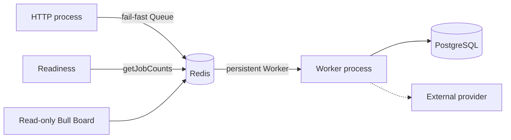
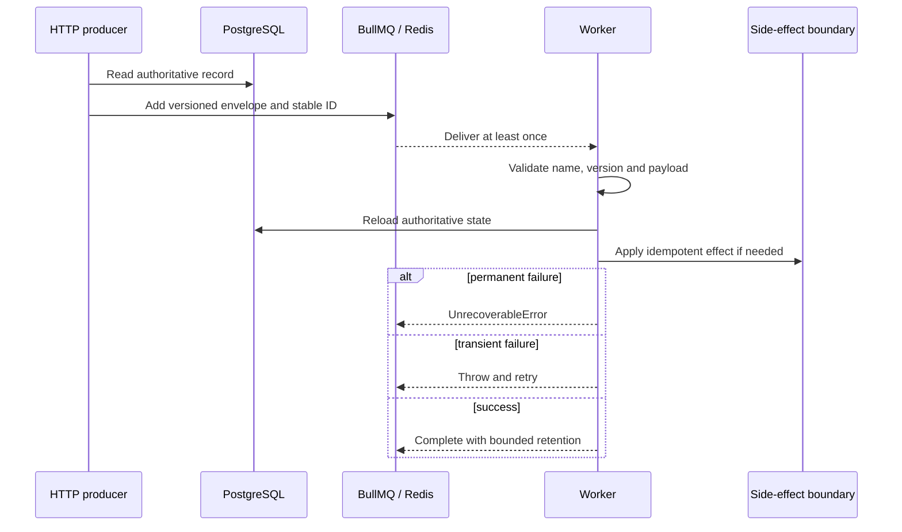

# Queues and workers

Status: implemented foundation. Last verified: **2026-07-22** against
`@nestjs/bullmq 11.0.4`, BullMQ `5.80.10` and Bull Board `8.1.2`.

## Boundary and ownership

BullMQ handles retryable asynchronous delivery. Redis is coordination, not a
business source of truth. HTTP owns producers; a separately deployed Nest
worker owns processors.

`QueueModule` owns producer Queues used by HTTP, readiness and Bull Board. Its
Redis commands use `maxRetriesPerRequest: 1` so requests fail rather than hang
during an established-connection outage. `QueueWorkerModule` owns the worker
boundary. Nest's BullMQ integration still creates one registration Queue for
processor discovery; application producers cannot inject it. Each worker
replica therefore has three Redis connections: registration Queue plus Worker
command and blocking connections. Worker connections use
`maxRetriesPerRequest: null` and keep reconnecting.

Nest closes Queues and Workers. Do not substitute `Queue.disconnect()`; it can
wait on a client still initializing during an outage. Worker close stops new
fetches and waits for active jobs without its own deadline. Deployment grace
must exceed normal job duration; an ungraceful stop relies on stalled recovery
and can execute the job again.

## Versioned contract

The disposable reference contract is explicit:

- queue `reference`;
- job `reference.inspect-record.v1`;
- payload `{ schemaVersion: 1, recordId: UUID, correlationId: string }`;
- job ID `reference-inspect-v1-<recordId>-<idempotencyKey>`, with a UUID
  idempotency key and no colon.

Producer and processor both validate the envelope. Redis may contain jobs from
another deployer/version, so unknown names, unsupported versions, malformed
data and missing authoritative records throw `UnrecoverableError`. Transient
dependency errors are rethrown for BullMQ retry.

## Retry, concurrency and retention

| Policy              | Reference value                                               |
| ------------------- | ------------------------------------------------------------- |
| Attempts            | 5 total                                                       |
| Backoff             | Exponential from 1 second, jitter `0.5`                       |
| Stack traces        | 10 retained entries                                           |
| Worker concurrency  | 5 per process                                                 |
| Stalls              | BullMQ 30-second lock/renewal; one recovery, next stall fails |
| Completed retention | 1,000 jobs or 1 day                                           |
| Failed retention    | 5,000 jobs or 7 days                                          |
| Metrics             | Completed/failed buckets for 2 weeks, 1-minute granularity    |

Choose these values per provider rate limits, work cost and failure modes; five
is an example, not sacred numerology. CPU-heavy work needs measured sandboxing
or worker threads. A stall/lock-renewal failure means possible duplicate work,
event-loop starvation or process death and is logged as an operational error.

A deterministic job ID suppresses duplicates only while the job remains in
Redis. Retention removal permits the same ID again. External writes therefore
need a durable idempotency key or database uniqueness constraint.

## Readiness, observability and dashboard

HTTP readiness runs real `getJobCounts` with the shared one-second deadline;
concurrent probes share the pending command. It proves current Redis command
execution, not worker presence, queue latency or provider health. Production
must monitor worker processes and alert on failed, delayed, stalled and oldest
waiting jobs.

Processor logs cover attempt/terminal failure, stalls, lock-renewal failure and
worker error using queue/job IDs, attempts and validated correlation ID—never
raw job data. BullMQ metrics are retained data, not an alerting strategy.

Bull Board is absent by default. When enabled it requires validated Basic
credentials, disables retry controls, hides Redis details, prevents framing and
sends no-store/referrer/content-sniffing headers. It is read-only inspection,
not alerting or authorization. Production still requires TLS plus private
networking/SSO, and job payloads must exclude secrets and unnecessary personal
data.

During an incident, fix the dependency/data before retrying; retry only when the
side effect is independently idempotent. Treat stalls as possible duplication.
The bounded failed set is the current quarantine; add a replay/dead-letter flow
only with explicit ownership, authorization, audit and retention.

## Commit-to-enqueue guarantee

The reference producer intentionally has a database-to-queue crash gap. A
critical workflow requires a transactional outbox:

1. Write mutation and outbox row in one PostgreSQL transaction.
2. Relay the committed row using its ID as the stable job key.
3. Mark delivery only after BullMQ acknowledges the add; retry otherwise.
4. Alert on backlog and retain processor-side idempotency.

The outbox closes the commit/enqueue gap, not downstream exactly-once effects.
Its schema, relay lease/retry and cleanup belong to the first workflow that
needs them.

## Extension and tests

For a real queue, define one strict versioned identifier-only envelope near the
domain; import producer and worker modules only into their process graphs;
choose delivery policy from real constraints; then test schemas, job building,
processor failure classification and module composition. Add a real Redis test
with a unique prefix, bounded waits and exact cleanup. Add the outbox and durable
side-effect idempotency before claiming critical delivery.

Focused tests cover URL/options mapping, process composition, dashboard
security, deterministic IDs, payload/version rejection, permanent failures and
transient propagation.

## Sources and official references

- [Queue modules](../../../apps/backend/src/infrastructure/queue/queue.module.ts), [Redis options](../../../apps/backend/src/infrastructure/queue/redis-connection.ts), [readiness](../../../apps/backend/src/infrastructure/queue/queue-health.service.ts), [job contract](../../../apps/backend/src/modules/reference/reference.schemas.ts) and [processor](../../../apps/backend/src/modules/reference/reference.processor.ts)
- [Nest BullMQ](https://docs.nestjs.com/techniques/queues), [BullMQ connections](https://docs.bullmq.io/guide/connections), [fail-fast producers](https://docs.bullmq.io/patterns/failing-fast-when-redis-is-down) and [worker shutdown](https://docs.bullmq.io/guide/workers/graceful-shutdown)
- [Job IDs](https://docs.bullmq.io/guide/jobs/job-ids), [retries](https://docs.bullmq.io/guide/retrying-failing-jobs), [permanent failures](https://docs.bullmq.io/patterns/stop-retrying-jobs), [retention](https://docs.bullmq.io/guide/queues/auto-removal-of-jobs) and [metrics](https://docs.bullmq.io/guide/metrics)
- [Bull Board](https://github.com/felixmosh/bull-board)
