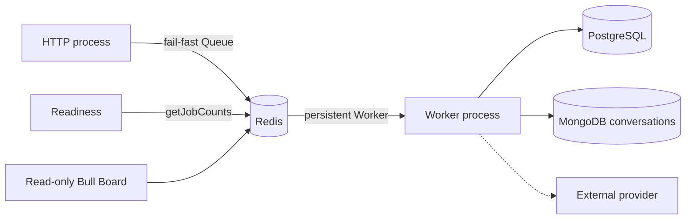
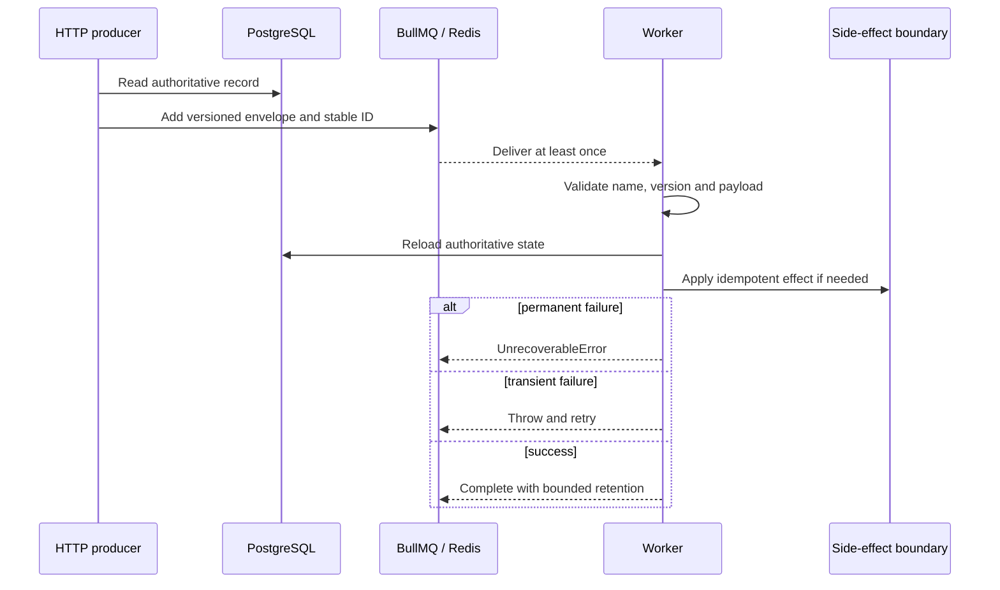

# Queues and workers

Status: implemented foundation. Last verified: **2026-07-25** against
`@nestjs/bullmq 11.0.4`, BullMQ `5.80.10` and Bull Board `8.1.2`.

## Boundary and ownership

BullMQ handles retryable asynchronous delivery. Redis is coordination, not a
business source of truth. HTTP owns producers; a separately deployed Nest
worker owns processors.

`QueueModule` owns producer Queues used by HTTP, readiness and Bull Board. Its
Redis commands use `maxRetriesPerRequest: 1` so requests fail rather than hang
during an established-connection outage. `QueueWorkerModule` owns the worker
boundary. Nest's BullMQ integration still creates one registration Queue per
registered queue for processor discovery. Two worker modules deliberately use
that worker-side registration Queue as a producer: the email outbox relay
publishes delivery jobs after leasing committed PostgreSQL outbox rows, and the
feedback materializer publishes `feedback.extract.v1` after appending an inbound
message. HTTP never publishes either. No other worker module uses it as a
producer. Each processor Worker also owns command and blocking connections. Worker connections use `maxRetriesPerRequest: null` and
keep reconnecting.

Nest closes Queues and Workers. Do not substitute `Queue.disconnect()`; it can
wait on a client still initializing during an outage. Worker close stops new
fetches and waits for active jobs without its own deadline. Deployment grace
must exceed normal job duration; an ungraceful stop relies on stalled recovery
and can execute the job again.

## Versioned contract

The disposable reference contract is explicit:

- queue `reference`;
- job `reference.inspect-record.v1`;
- payload `{ schemaVersion: 1, recordId: UUID, correlationId: string }`;
- job ID `reference-inspect-v1-<recordId>-<idempotencyKey>`, with a UUID
  idempotency key and no colon.

The production assistant contract follows the same boundary:

- queue `assistant`;
- job `assistant.generate-turn.v2`;
- payload `{ schemaVersion: 2, turnId: UUID, correlationId: string }`;
- job ID `assistant-generate-v2-<turnId>-<attempt>`.

The email contracts are:

- queue `email-delivery`;
- relay job `email.relay-outbox.v1`;
- delivery job `email.deliver.v1`;
- delivery payload `{ schemaVersion: 1, deliveryId: UUID, outboxEventId: UUID,
correlationId: string }`;
- delivery job ID `email-deliver-v1-<outboxEventId>`.

Only PostgreSQL contains the recipient and message content. The relay uses
one-shot BullMQ jobs with immediate removal; PostgreSQL owns recovery and
business retry timing. Until a provider is explicitly integrated, the consumer
records a safe `provider_not_configured` blocked attempt and performs no
external side effect.

The post-event feedback contracts are:

- queue `feedback`;
- materialize job `feedback.materialize.v1`;
- materialize payload `{ schemaVersion: 1, ingressId: UUID, correlationId: string }`;
- materialize job ID `feedback-materialize-v1-<ingressId>`;
- extraction job `feedback.extract.v1`;
- extraction payload `{ schemaVersion: 1, conversationId: UUID, correlationId: string }`;
- extraction job ID `feedback-extract-v1-<conversationId>-<latestSeq>`.

The webhook edge is the producer of `feedback.materialize.v1`; the worker is the
producer of `feedback.extract.v1`, using its own worker-side registration Queue
exactly as the email relay does. Neither payload carries message text, phone
numbers or provider identifiers: the processor reloads the ingress row, the
conversation and the campaign itself.

`latestSeq` is the transcript position the run must cover, so a burst of inbound
messages collapses onto one model run per position instead of one per message.
The extraction processor itself is a later work package; until it lands the
consumer only records the job, and the job name and payload must not change when
it is implemented. The feedback worker deliberately runs at concurrency `1`,
which keeps one participant's burst in arrival order inside the transcript
without a per-conversation lock; raising it requires explicit per-conversation
serialization.

For Assistant work, MongoDB owns the owner-scoped thread, ordered history and
user-visible turn state. PostgreSQL retains the request id, model, attempt and
recovery/execution projection. The worker fences the PostgreSQL projection by
turn ID and exact attempt, then loads model history from MongoDB; job payloads
must never contain chat content or provider credentials. The attempt stays out
of the payload but is encoded in the deterministic job ID. A manual retry
increments it, fencing retained jobs from an older attempt.

Producer and processor both validate the envelope. Redis may contain jobs from
another deployer/version, so unknown names, unsupported versions, malformed
data and missing authoritative records throw `UnrecoverableError`. Transient
dependency errors are rethrown for BullMQ retry.

## Retry, concurrency and retention

| Policy              | Reference value                                               |
| ------------------- | ------------------------------------------------------------- |
| Attempts            | 5 total                                                       |
| Backoff             | Exponential from 1 second, jitter `0.5`                       |
| Stack traces        | 10 retained entries                                           |
| Worker concurrency  | 5 per process                                                 |
| Stalls              | BullMQ 30-second lock/renewal; one recovery, next stall fails |
| Completed retention | 1,000 jobs or 1 day                                           |
| Failed retention    | 5,000 jobs or 7 days                                          |
| Metrics             | Completed/failed buckets for 2 weeks, 1-minute granularity    |

Choose these values per provider rate limits, work cost and failure modes; five
is an example, not sacred numerology. CPU-heavy work needs measured sandboxing
or worker threads. A stall/lock-renewal failure means possible duplicate work,
event-loop starvation or process death and is logged as an operational error.

The assistant worker deliberately uses concurrency `2` and a two-minute
provider deadline. AI SDK retries are disabled so BullMQ owns visible retries.
Permanent provider/configuration failures stop retrying; timeout, rate-limit and
provider 5xx failures retry. Nonterminal row updates and terminal completion are
guarded by turn ID and attempt so a late stalled execution cannot replace a
newer retry or terminal result. A stall can still repeat the provider call and
cost money; no provider-call exactly-once claim is made.

The assistant processor also reconciles a valid turn/attempt from terminal
BullMQ `failed` events, covering failures outside its generation catch. The
worker scans stale nonterminal turns on startup and every five minutes: after a
15-minute threshold it checks the exact BullMQ job and fails the guarded attempt
only when that job is missing or terminal. Live waiting/delayed/active jobs are
left alone. Multiple worker replicas may scan concurrently because the terminal
write is status-and-attempt conditional.

A deterministic job ID suppresses duplicates only while the job remains in
Redis. Retention removal permits the same ID again. External writes therefore
need a durable idempotency key or database uniqueness constraint.

## Readiness, observability and dashboard

HTTP readiness runs real `getJobCounts` with the shared one-second deadline;
concurrent probes share the pending command. It proves current Redis command
execution, not worker presence, queue latency or provider health. Production
must monitor worker processes and alert on failed, delayed, stalled and oldest
waiting jobs.

Processor logs cover attempt/terminal failure, stalls, lock-renewal failure and
worker error using queue/job IDs, attempts and validated correlation ID—never
raw job data. BullMQ metrics are retained data, not an alerting strategy.

Bull Board is absent by default. When enabled it requires validated Basic
credentials, disables retry controls, hides Redis details, prevents framing and
sends no-store/referrer/content-sniffing headers. It is read-only inspection,
not alerting or authorization. Production still requires TLS plus private
networking/SSO, and job payloads must exclude secrets and unnecessary personal
data.

During an incident, fix the dependency/data before retrying; retry only when the
side effect is independently idempotent. Treat stalls as possible duplication.
The bounded failed set is the current quarantine; add a replay/dead-letter flow
only with explicit ownership, authorization, audit and retention.

## Commit-to-enqueue guarantee

The reference producer intentionally has a database-to-queue crash gap. The
email workflow is the first implementation of the required transactional
outbox:

1. Write mutation and outbox row in one PostgreSQL transaction.
2. Relay the committed row using its ID as the stable job key.
3. Mark delivery only after BullMQ acknowledges the add; retry otherwise.
4. Alert on backlog and retain processor-side idempotency.

The email relay leases with `FOR UPDATE SKIP LOCKED`, reclaims expired leases
and republishes unconsumed dispatches after a recovery horizon. The consumer
marks the outbox event consumed in the same transaction as its fenced delivery
claim. This closes the commit/enqueue and acknowledged-job-loss gaps, not
downstream exactly-once effects.

The feedback webhook edge inverts the same idea for inbound traffic. The
committed `provider_message_ingress` row is the durable acknowledgement, and the
enqueue follows it: a failed enqueue is answered with 503 rather than a 200 that
hides a stalled message, and the row stays `pending` for a provider redelivery.
Inside the worker the order is always MongoDB first, then the PostgreSQL fence
that marks the row terminal — every step before the fence is idempotent, so a
crash replays into a no-op instead of a lost or duplicated effect. Rows left
`pending` by a lost enqueue are the known gap; a recovery sweep for them is not
implemented yet.

## Extension and tests

For a real queue, define one strict versioned identifier-only envelope near the
domain; import producer and worker modules only into their process graphs;
choose delivery policy from real constraints; then test schemas, job building,
processor failure classification and module composition. Add a real Redis test
with a unique prefix, bounded waits and exact cleanup. Add the outbox and durable
side-effect idempotency before claiming critical delivery.

Focused tests cover URL/options mapping, process composition, dashboard
security, deterministic IDs, payload/version rejection, permanent failures,
transient propagation, idempotent HTTP request replay and terminal assistant
turn attempt fencing. The feedback queue adds replay coverage: duplicate webhook
delivery, double and concurrent materialization, out-of-order arrival and a
replayed STOP that must not acknowledge twice.

## Sources and official references

- [Queue modules](../../../apps/backend/src/infrastructure/queue/queue.module.ts), [Redis options](../../../apps/backend/src/infrastructure/queue/redis-connection.ts), [readiness](../../../apps/backend/src/infrastructure/queue/queue-health.service.ts), [assistant job contract](../../../apps/backend/src/modules/assistant/assistant.schemas.ts), [assistant processor](../../../apps/backend/src/modules/assistant/assistant.processor.ts), [reference job contract](../../../apps/backend/src/modules/reference/reference.schemas.ts) and [reference processor](../../../apps/backend/src/modules/reference/reference.processor.ts)
- [Feedback job contract](../../../apps/backend/src/modules/post-event-feedback/post-event-feedback.schemas.ts), [feedback processor](../../../apps/backend/src/modules/post-event-feedback/post-event-feedback.processor.ts), [ingress edge](../../../apps/backend/src/modules/post-event-feedback/post-event-feedback-ingress.service.ts) and [materializer](../../../apps/backend/src/modules/post-event-feedback/post-event-feedback-materializer.service.ts)
- [Nest BullMQ](https://docs.nestjs.com/techniques/queues), [BullMQ connections](https://docs.bullmq.io/guide/connections), [fail-fast producers](https://docs.bullmq.io/patterns/failing-fast-when-redis-is-down) and [worker shutdown](https://docs.bullmq.io/guide/workers/graceful-shutdown)
- [Job IDs](https://docs.bullmq.io/guide/jobs/job-ids), [retries](https://docs.bullmq.io/guide/retrying-failing-jobs), [permanent failures](https://docs.bullmq.io/patterns/stop-retrying-jobs), [retention](https://docs.bullmq.io/guide/queues/auto-removal-of-jobs) and [metrics](https://docs.bullmq.io/guide/metrics)
- [Bull Board](https://github.com/felixmosh/bull-board)
