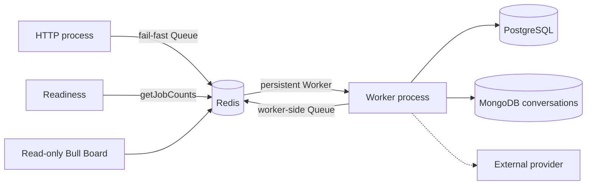
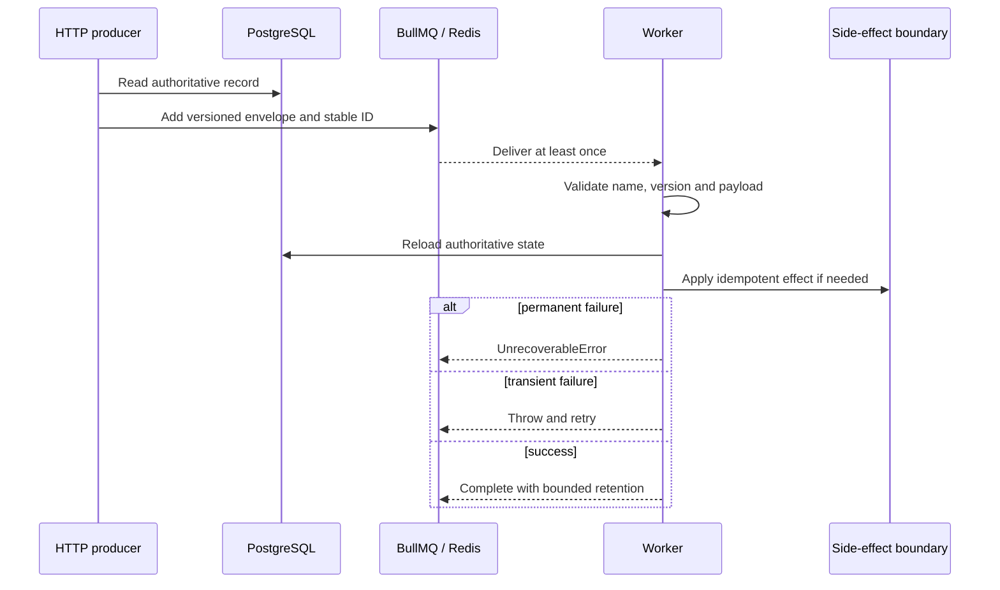

# Queues and workers

Status: implemented. Last verified: **2026-08-05** against `@nestjs/bullmq
11.0.4`, BullMQ `5.80.10` and Bull Board `8.1.2`.

## Boundary

BullMQ is retryable async delivery. Redis coordinates; it is not a business
source of truth. HTTP owns producers; a separately deployed Nest worker owns
processors. Feedback **outbound** delivery does not use BullMQ — the worker
claims PostgreSQL `message_outbox` rows directly. The assistant live-text relay
is a Redis **stream**, not a BullMQ job ([assistant streaming](assistant-streaming.md)).

| Process | Module | Redis `maxRetriesPerRequest` | Owns |
| ------- | ------ | ---------------------------- | ---- |
| HTTP | `QueueModule` | `1` (fail-fast) | Producer Queues, readiness `getJobCounts`, optional Bull Board |
| Worker | `QueueWorkerModule` | `null` (reconnect) | Processors; Nest still registers one Queue per name for discovery |

Worker-side feedback producers publish only successor/recovery wake-ups after
durable intent exists (conversation revisions, campaign-summary attempts, the
maintenance schedule). The email relay still publishes delivery jobs.

**Shutdown.** Nest closes Queues/Workers. Do not call `Queue.disconnect()` —
it can hang on a still-initializing client.
[`QueueLifecycleService`](../../../apps/backend/src/infrastructure/queue/queue-lifecycle.service.ts)
settles every connection in `beforeApplicationShutdown` (before Nest BullMQ
`onApplicationShutdown`) so close takes the drained `quit()` path. Bound by
`QUEUE_SETTLE_TIMEOUT_MS` (5s). Worker close stops fetches and waits for active
jobs with no own deadline — deployment grace must exceed normal job duration;
ungraceful stop relies on stalled recovery and may re-execute. Anything that
reads a queue during shutdown (e.g. assistant recovery interval) belongs in the
same settle phase.

## Versioned contracts

Prefix: `jts`. Payloads are identifier-only — never chat text, phones, or
provider credentials. Producer and processor both validate; unknown name /
unsupported version / malformed data / missing authoritative record →
`UnrecoverableError`. Transient dependency errors rethrow for BullMQ retry.

| Queue | Job | Payload | Stable job ID |
| ----- | --- | ------- | ------------- |
| `reference` | `reference.inspect-record.v1` | `{ schemaVersion: 1, recordId, correlationId }` | `reference-inspect-v1-<recordId>-<idempotencyKey>` (UUID key, no colon) |
| `assistant` | `assistant.generate-turn.v2` | `{ schemaVersion: 2, turnId, correlationId }` | `assistant-generate-v2-<turnId>-<attempt>` |
| `email-delivery` | `email.relay-outbox.v1` | `{ schemaVersion: 1, correlationId }` | repeat schedule |
| `email-delivery` | `email.deliver.v1` | `{ schemaVersion: 1, deliveryId, outboxEventId, correlationId }` | `email-deliver-v1-<outboxEventId>` |
| `feedback-ingress` | `feedback.materialize.v1` | `{ schemaVersion: 1, ingressId, correlationId }` | `feedback-materialize-v1-<ingressId>` |
| `feedback-conversation` | `feedback.reconcile-conversation.v2` | `{ schemaVersion: 2, conversationId, revision, correlationId }` | `feedback-reconcile-v2-<conversationId>-<revision>` |
| `feedback-summary` | `feedback.summarize-campaign.v2` | `{ schemaVersion: 2, campaignId, attempt, correlationId }` | `feedback-summarize-v2-<campaignId>-<attempt>` |
| `feedback-maintenance` | `feedback.maintenance.v2` | `{ schemaVersion: 2, correlationId }` | repeat schedule |
| `feedback` (legacy) | V1 drain only — see below | V1 envelopes | V1 IDs; no new production |

Email content lives only in PostgreSQL. Relay uses
[`OUTBOX_RELAY_JOB_OPTIONS`](../../../apps/backend/src/infrastructure/queue/queue.constants.ts)
(`attempts: 1`, immediate `removeOnComplete` / `removeOnFail`, `stackTraceLimit:
3`) — at-most-once enqueue; PG owns recovery. Until a provider is wired, the
consumer records `provider_not_configured` and performs no external side effect.

### Legacy `feedback` queue (drain)

Retained extraction / campaign-summary V1 jobs validate identity then publish
current durable V2 wake-ups (no model entry). Reminder/expiry ticks run
conversation recovery; ingress tick repairs ingress only. Relay/delivery
consumers are validation-only — never claim a row or call the provider. A row
left in legacy `sending` is quarantined `ambiguous` after the recovery horizon.
New paths do not produce V1 jobs.

First V2 activation is non-rolling worker replacement (Compose single worker is
the barrier). Compatibility consumers + legacy Redis mutex defend retained work;
they do not authorize side-by-side old/new replicas. During the bridge, the V2
conversation processor holds the legacy per-conversation Redis mutex around
reconciliation/terminal fallback before the PostgreSQL commit fence — remove the
V1 consumer and this mutex in the **same** release after the max failed-job
retention window with no V1 arrivals.

## Feedback V2 invariants

Deep loop semantics live in
[post-event-feedback](../modules/post-event-feedback.md). Queue-facing rules:

| Topic | Rule |
| ----- | ---- |
| Wake-ups | Disposable. Mongo stores `{ revision, nextActionAt, executionEpoch, campaignResumeGeneration? }`; schedule increments revision and commits before `Queue.add`. Missing Redis job delays until maintenance republishes the same revision. |
| Reconcile | Seven-minute PG lease; mirrors monotonic epoch onto exact due Mongo revision; reloads state; at most one action. Settlement clears work or writes successor under a new revision. |
| Busy successor | Wake while previous revision owns PG claim → move to delayed set **without** consuming an attempt (`removeOnComplete` must not swallow the only N+1 wake-up). Same pattern for busy summary duplicates. |
| Terminal extraction | Only `FeedbackExtractionGenerationError` may enter terminal fallback / provider parking. Exhausted planning/reminder/expiry/settlement failures stay failed disposable wake-ups — no fallback evidence; maintenance rediscovers durable work. |
| Guards | `authoritative_state_changed` → complete as `superseded` (no retry, not failed retention). `execution_claim_lost` → rethrow for BullMQ retry, no participant fallback. `execution_invariant_broken` → unrecoverable; retained with versioned marker; maintenance preserves quarantined revision. |
| Materialization queue | Isolated so ingress latency does not inherit model service time. After append, rolls `nextActionAt` to newest participant message + `FEEDBACK_EXTRACT_QUIET_WINDOW_MS` (45s), then publishes revision. Payload carries no message text. |
| Ingress ordering | Deployment-wide per routing identity: process-local tail, then PG session advisory lock (SHA-256 digest of phone/`chatJid`); drain `pending` by `ingress_order`. Up to five routes share a dedicated lock pool. Lock has no lease — released on finish/death. |
| Conversation concurrency | BullMQ concurrency 10; PG serializes per conversation across replicas. Lease is a commit fence (token on answer/note/outbox and cursor settlement). |
| Quiet window | Rolling debounce, not leading-edge. Old revision jobs become cheap stale no-ops. Does not cancel in-flight provider calls. |
| Provider entry | After limiter grants a slot: short PG txn takes ingress phone + conversation advisory locks, validates execution token, share-locks campaign, locks consent, rejects durable inbound beyond Mongo snapshot, final Mongo revision/lifecycle/control read; commits **before** network call (billing boundary). |
| Cross-store write | PG results under execution token first; Mongo cursor last. Crash may repeat computation; answer uniqueness, note signatures, outbox `dedupe_key` absorb duplicates. |
| Provider park | Five-minute successor until six-hour park horizon; then stop retry schedule (conversation stays parked). Deterministic terminal failures → human handling. |
| Campaign resume | PG owns status + `resume_generation` / `resume_due_at`; Mongo admits generation then PG acks. Maintenance keyset pages of 50 under `campaign_resume` checkpoint; allocation commits before Mongo; wake-up after ack is disposable. |
| Summary | Campaign row lock derives next attempt; claim exact attempt with epoch/token/seven-minute lease. Maintenance pages `(requested_at, campaign_id)` under `summary_pending`; `summary_auto` is a separate cursor. |
| Maintenance | One bounded periodic job; ingress / resume / conversation / summary subtasks fail independently. Due-work: Mongo keyset pages of 100, ≤500 docs/pass, checkpoint `conversation_due` commits before publish. Seeds ≤100 legacy docs missing `work`. |
| Provider limiter | Shared Redis semaphore: `PROVIDER_CALL_CONCURRENCY_LIMIT=30`, `PROVIDER_CALL_STARTS_PER_MINUTE_LIMIT=60`. Dead worker loses concurrency until ~six-minute lease expiry. |
| Worker attestation | Feedback Worker BullMQ name carries base64url control profile (stub/model/adapter/efforts/tier). Paid simulator preflight fail-closes on missing/mismatched workers. Built from env at decorator time (same resolvers as `ConfigService`). |

Webhook ingress: commit `provider_message_ingress` then enqueue; failed enqueue →
503 (row stays `pending`). Worker: MongoDB first, then PG terminal fence.
Maintenance recovers `pending` older than
`FEEDBACK_INGRESS_PENDING_RECOVERY_MINUTES` (default 5) in pages of 50 under
`ingress_pending`; re-adds `feedback.materialize.v1` under the same job id
(leave live jobs; remove retained completed/failed before reuse).

## Assistant invariants

Mongo owns thread/history/UI turn state; PG retains request id, model, attempt,
recovery projection. Worker fences by turn ID + exact attempt (attempt in job
ID, not payload). Manual retry increments attempt. Concurrency `2`, provider
deadline 120s; AI SDK retries disabled so BullMQ owns retries. Permanent
provider/config failures stop; timeout / rate-limit / 5xx retry. Terminal writes
are status-and-attempt conditional. Recovery scans stale nonterminal turns on
startup and every 5 minutes; after 15 minutes fails the attempt only if the
exact BullMQ job is missing or terminal.

## Retry, concurrency, retention

| Policy | Default |
| ------ | ------- |
| Attempts | 5 |
| Backoff | Exponential from 1s, jitter `0.5` |
| Stack traces | 10 |
| Stalls | 30s lock/renewal; one recovery, next stall fails |
| Completed retention | 1,000 jobs or 1 day |
| Failed retention | 5,000 jobs or 7 days |
| Metrics | Completed/failed buckets, 2 weeks, 1-minute granularity |

| Processor | Concurrency | Notes |
| --------- | ----------- | ----- |
| Reference | 5 | Cheap local |
| Assistant | 2 | Provider-bound, 120s deadline |
| Email | 2 | Provider-bound |
| Feedback V1 bridge | 10 | Drain only |
| Feedback ingress | 20 | PG-serialized per routing identity |
| Feedback conversation | 10 | PG-fenced per conversation |
| Feedback summary | 3 | Terra-bound; PG lease per campaign |
| Feedback maintenance | 1 | Bounded repair; subtasks independent |

Conversation V2 removes successful wake-ups immediately
(`removeOnComplete: true`). Terminal extraction fallback clears Mongo due time
without advancing revision so the failed wake-up stays under failed retention.
Ordinary failures leave durable work due; maintenance may remove retained
terminal copy and reuse the deterministic id (except execution-invariant
quarantine). Expected supersession completes successfully and does not occupy
failed retention.

Deterministic job IDs suppress duplicates only while the job remains in Redis;
retention removal permits reuse. External writes need a durable idempotency key
or DB uniqueness.

## Commit-to-enqueue and outbox

| Path | Pattern |
| ---- | ------- |
| Reference | Intentional DB→queue crash gap (disposable demo). |
| Email | Transactional outbox: mutate + outbox row in one txn → relay with stable job key → mark consumed after BullMQ ack. Relay: `FOR UPDATE SKIP LOCKED`, reclaim expired leases, republish after recovery horizon. Closes commit/enqueue and ack-loss gaps, not downstream exactly-once. |
| Feedback outbound | **No** BullMQ. One-second worker loop claims ≤4 rows (`FOR UPDATE SKIP LOCKED`), opaque token, two-minute lease. Oldest unresolved row per conversation; four parallel lanes across conversations. STOP ack (`lifecycle.terminalOutboxId`) and explicit staff may pass `ambiguous`; nothing passes `pending`/`held`/`claimed`/`attempting`/legacy `sending`. |

Outbound states: Redis limiter awaited while `claimed`; token-fenced heartbeat;
phone + conversation advisory locks + campaign share-lock + consent before
`attempting`/`send_started_at`. Accepted → `sent`; explicit reject → `failed`;
exception/unknown after marker → `ambiguous` (parks open bot on `awaitingHuman`,
`undelivered_message`). Cancellation rewrites `pending`/`held`/`claimed` without
send marker; never rewrites `attempting`/`sending`/`ambiguous`. Operator surface
is the admin [outbound queue](../../frontend/feedback-outbound-queue.md), not
Bull Board. `TRANSPORT_MODE=simulated` seeds deterministic faults from
non-secret seed + outbox id; profile rollout needs stop-the-world worker
replacement.

## Readiness, observability, dashboard

HTTP readiness: real `getJobCounts` with shared one-second deadline — proves
Redis command execution, not worker presence or provider health. Monitor worker
processes; alert on failed/delayed/stalled/oldest waiting.

Logs: attempt/terminal failure, stalls, lock-renewal, worker error — queue/job
IDs, attempts, correlation ID; never raw job data.

Bull Board off by default. When enabled: validated Basic auth, retry controls
disabled, Redis details hidden, no framing, no-store headers. Read-only
inspection only. Production still needs TLS + private networking/SSO. Incident
rule: fix dependency/data before retry; retry only when the side effect is
independently idempotent; treat stalls as possible duplication.

## Extension and tests

Define one strict versioned identifier-only envelope near the domain; import
producer/worker modules only into their process graphs; choose delivery policy
from real constraints; test schemas, job building, failure classification and
module composition. Real Redis tests need a unique prefix, bounded waits and
exact cleanup. Add outbox + durable side-effect idempotency before claiming
critical delivery.

Focused coverage: URL/options mapping, process composition, connection settle at
shutdown, dashboard security, deterministic IDs, payload/version rejection,
permanent vs transient failures, assistant attempt fencing, ingress replay,
revision/epoch/token fencing, direct outbox `SKIP LOCKED`/CAS/pre-send marker,
maintenance subtasks and stable materialize job ID.

## Sources

- [Queue modules](../../../apps/backend/src/infrastructure/queue/queue.module.ts),
  [constants](../../../apps/backend/src/infrastructure/queue/queue.constants.ts),
  [Redis options](../../../apps/backend/src/infrastructure/queue/redis-connection.ts),
  [readiness](../../../apps/backend/src/infrastructure/queue/queue-health.service.ts),
  [shutdown](../../../apps/backend/src/infrastructure/queue/queue-lifecycle.service.ts)
- [Assistant schemas/processor](../../../apps/backend/src/modules/assistant/),
  [reference](../../../apps/backend/src/modules/reference/),
  [email](../../../apps/backend/src/modules/email/),
  [feedback jobs](../../../apps/backend/src/modules/post-event-feedback/jobs.schemas.ts),
  [ingress](../../../apps/backend/src/modules/post-event-feedback/ingress/),
  [reconcile/wakeups](../../../apps/backend/src/modules/post-event-feedback/reconciliation/),
  [outbox dispatcher](../../../apps/backend/src/modules/post-event-feedback/outbox/),
  [maintenance](../../../apps/backend/src/modules/post-event-feedback/sweeps/)
- [Nest BullMQ](https://docs.nestjs.com/techniques/queues),
  [connections](https://docs.bullmq.io/guide/connections),
  [fail-fast](https://docs.bullmq.io/patterns/failing-fast-when-redis-is-down),
  [graceful shutdown](https://docs.bullmq.io/guide/workers/graceful-shutdown),
  [job IDs](https://docs.bullmq.io/guide/jobs/job-ids),
  [retries](https://docs.bullmq.io/guide/retrying-failing-jobs),
  [UnrecoverableError](https://docs.bullmq.io/patterns/stop-retrying-jobs),
  [retention](https://docs.bullmq.io/guide/queues/auto-removal-of-jobs),
  [metrics](https://docs.bullmq.io/guide/metrics),
  [Bull Board](https://github.com/felixmosh/bull-board)
