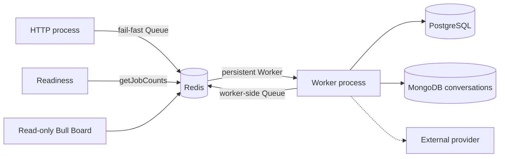
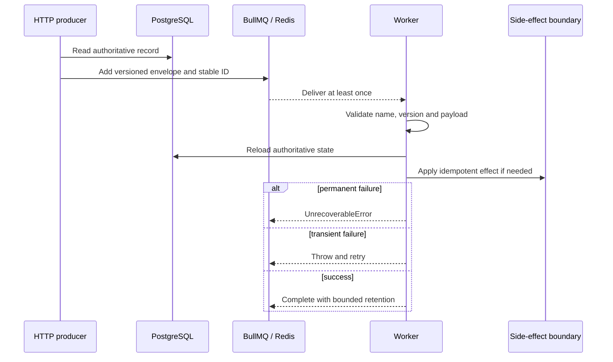

# Queues and workers

Status: implemented foundation. Last verified: **2026-07-26** against
`@nestjs/bullmq 11.0.4`, BullMQ `5.80.10` and Bull Board `8.1.2`.

## Boundary and ownership

BullMQ handles retryable asynchronous delivery. Redis is coordination, not a
business source of truth. HTTP owns producers; a separately deployed Nest
worker owns processors.

`QueueModule` owns producer Queues used by HTTP, readiness and Bull Board. Its
Redis commands use `maxRetriesPerRequest: 1` so requests fail rather than hang
during an established-connection outage. `QueueWorkerModule` owns the worker
boundary. Nest's BullMQ integration still creates one registration Queue per
registered queue for processor discovery. Two worker modules deliberately use
that worker-side registration Queue as a producer: the email outbox relay
publishes delivery jobs after leasing committed PostgreSQL outbox rows, and the
feedback materializer publishes `feedback.extract.v1` after appending an inbound
message. No other worker module uses it as a producer.

HTTP publishes `feedback.extract.v1` in exactly one place — resuming a
conversation from human control — under the same deterministic job id and quiet
window the materializer uses, so a resume that races an inbound message collapses
onto one run. It never publishes `feedback.deliver.v1`: sending stays behind the
committed outbox row. Each processor Worker also owns command and blocking connections. Worker connections use `maxRetriesPerRequest: null` and
keep reconnecting.

The assistant also uses a Redis **stream** to relay accumulated live text from
the worker process to an authenticated SSE response in the HTTP process. That is
not a BullMQ job and never becomes a source of truth: it retains only a bounded,
ten-minute replay tail, and the browser keeps polling the durable turn beneath
it. Its attempt fencing and failure behavior are owned by
[assistant streaming](assistant-streaming.md).

Nest closes Queues and Workers. Do not substitute `Queue.disconnect()`; it can
wait on a client still initializing during an outage. Worker close stops new
fetches and waits for active jobs without its own deadline. Deployment grace
must exceed normal job duration; an ungraceful stop relies on stalled recovery
and can execute the job again.

Close is ordered, not merely awaited. BullMQ opens each connection lazily and
keeps `RedisConnection.init()` pending across a Redis `INFO` round trip that
runs _after_ the socket is already ready. Closing a Queue inside that window
hard-disconnects the client, so ioredis flushes the in-flight `INFO` with
`Connection is closed.` and BullMQ re-emits that rejection on a connection whose
listeners `close()` has just removed. Nothing is left to receive it and the
process sees an unhandled rejection per queue.
[`QueueLifecycleService`](../../../apps/backend/src/infrastructure/queue/queue-lifecycle.service.ts)
therefore settles every connection in `beforeApplicationShutdown`, a phase that
completes before any `onApplicationShutdown` hook and so before the Nest BullMQ
integration closes a Queue. Close then always takes the drained `quit()` path.
The wait is bounded by `QUEUE_SETTLE_TIMEOUT_MS` so a Redis outage cannot hold
the process open; a connection that never opened has no command in flight, so
closing it was already safe. Anything that reads a queue during shutdown belongs
in the same phase for the same reason — that is why the assistant recovery
scheduler clears its interval and drains its in-flight pass there.

## Versioned contract

The disposable reference contract is explicit:

- queue `reference`;
- job `reference.inspect-record.v1`;
- payload `{ schemaVersion: 1, recordId: UUID, correlationId: string }`;
- job ID `reference-inspect-v1-<recordId>-<idempotencyKey>`, with a UUID
  idempotency key and no colon.

The production assistant contract follows the same boundary:

- queue `assistant`;
- job `assistant.generate-turn.v2`;
- payload `{ schemaVersion: 2, turnId: UUID, correlationId: string }`;
- job ID `assistant-generate-v2-<turnId>-<attempt>`.

The email contracts are:

- queue `email-delivery`;
- relay job `email.relay-outbox.v1`;
- delivery job `email.deliver.v1`;
- delivery payload `{ schemaVersion: 1, deliveryId: UUID, outboxEventId: UUID,
correlationId: string }`;
- delivery job ID `email-deliver-v1-<outboxEventId>`.

Only PostgreSQL contains the recipient and message content. The email and
feedback outbox relays publish delivery jobs with
[`OUTBOX_RELAY_JOB_OPTIONS`](../../../apps/backend/src/infrastructure/queue/queue.constants.ts)
(`attempts: 1`, immediate `removeOnComplete` / `removeOnFail`, `stackTraceLimit: 3`),
deliberately overriding the producer defaults for an at-most-once enqueue policy;
PostgreSQL owns recovery and business retry timing. Until a provider is explicitly integrated, the consumer
records a safe `provider_not_configured` blocked attempt and performs no
external side effect.

The post-event feedback contracts are:

- queue `feedback`, for extraction, delivery, relay and sweeps;
- queue `feedback-ingress`, for materialization alone;
- materialize job `feedback.materialize.v1`, on `feedback-ingress`;
- materialize payload `{ schemaVersion: 1, ingressId: UUID, correlationId: string }`;
- materialize job ID `feedback-materialize-v1-<ingressId>`;
- extraction job `feedback.extract.v1`;
- extraction payload `{ schemaVersion: 1, conversationId: UUID, correlationId: string }`;
- extraction job ID `feedback-extract-v1-<conversationId>-<latestSeq>`, and
  `feedback-extract-v1-<conversationId>-<latestSeq>-parked-<parkedRun>` for the
  retry a parked run queues for itself — a separate id because the parking job
  is the one currently executing;
- relay job `feedback.relay-outbox.v1`;
- delivery job `feedback.deliver.v1`;
- delivery payload `{ schemaVersion: 1, outboxId: UUID, correlationId: string }`;
- delivery job ID `feedback-deliver-v1-<outboxId>`;
- reminder sweep job `feedback.sweep-reminders.v1`;
- expiry sweep job `feedback.sweep-expiry.v1`;
- ingress recovery sweep job `feedback.sweep-ingress.v1`;
- summarize job `feedback.summarize-campaign.v1`;
- summarize payload `{ schemaVersion: 1, campaignId: UUID, correlationId: string }`;
- summarize job ID `feedback-summarize-v1-<campaignId>-<attempt>`;
- sweep payload `{ schemaVersion: 1, correlationId: string }`.

The webhook edge is the producer of `feedback.materialize.v1`, onto
`feedback-ingress`; the worker is the producer of `feedback.extract.v1` and
`feedback.deliver.v1` onto `feedback`, using its own worker-side registration
Queue exactly as the email relay does. HTTP enqueues
`feedback.summarize-campaign.v1` on manual request; the worker enqueues the same
job when the last conversation closes.

**Materialization has its own queue because it must not wait for a model call.**
Writing an inbound message into the transcript is a Mongo append and a short
PostgreSQL transaction; an extraction run holds its slot for as long as the
provider takes. On one queue the fast job inherits the slow job's service time.
A rehearsal of eighteen concurrent conversations on 2026-07-27 measured what
that costs: 52 provider calls consumed 2340 of the 2364 slot-seconds that
existed, so 45 inbound messages reached the transcript after 118 seconds on
average and 296 at worst. Three things downstream assume otherwise — the quiet
window collects what materialization has already written, `stillTyping` and
`superseded_by_newer_testimony` compare against the transcript, and the admin
renders it in timestamp order — so all three silently degraded: the bot answered
questions the participant had already answered, and a message observed at 11:41
appeared below a question asked at 11:42 because it was appended after it.

Separating the queues is the whole remedy; nothing about the jobs changed. The
`feedback` processor still accepts `feedback.materialize.v1` so a deploy can
drain what it caught in flight, and that branch is removable once no such job
has appeared on that queue for a retention period. Neither payload
carries message text, phone numbers or provider identifiers: the processor
reloads the ingress row, the conversation, the outbox row and the campaign
itself. Reminder, expiry and ingress-recovery sweeps are also worker-owned
schedulers: each job is identifier-only, bounded, and reloads durable state
before acting.

Materialization is deployment-wide per routing identity, not merely ordered by
one process. `feedback-ingress` may run twenty jobs per worker, while a dedicated
PostgreSQL session advisory lock serializes rows sharing a phone (or `chatJid`
fallback). Same-route jobs first wait on one process-local tail. Up to five
different routes then use a dedicated lock pool, so waiters cannot exhaust the
normal pool needed by the protected repository work. The holder
drains durable `pending` rows in database-assigned `ingress_order` before the job
that woke it, so unrelated conversations progress together and two replicas
cannot race one participant's transcript. The lock name contains a SHA-256
digest, not the phone or chat id. It has no expiring lease: PostgreSQL releases
the session lock when the holder finishes or its worker/connection dies.
An isolated lock-connection loss is fail-closed for the job but is not a
cross-store transaction: an already in-flight MongoDB operation may finish
before the worker observes the loss. Mongo optimistic append and ingress/outbox
idempotency remain the final replay guards.

`latestSeq` is the transcript position the extraction run must cover, so a burst
of inbound messages collapses onto one model run per position instead of one per
message. `FEEDBACK_WORKER_CONCURRENCY` is the hardcoded, per-process truth and
currently equals `10`: one worker may serve ten feedback jobs concurrently. An
extraction job opens the questionnaire and attention calls together, then may
open one low-effort reply rewrite only when model-written text would actually be
forwarded. A Redis lease serializes the whole
extraction/fallback path per conversation across worker replicas, so two due
cursor jobs cannot buy duplicate calls and race two replies to one participant.
The lease lasts fifteen minutes: a dead holder delays only that conversation and
cannot create a second holder. Outbox delivery retains its own shared-session
pacer; worker replicas still multiply job concurrency, not provider capacity.

This is an application ordering limit, not a provider-call limit. Every backend
model boundary — assistant generation, feedback extraction, attention
classification and campaign summaries — also enters the same Redis-backed
lease semaphore. `PROVIDER_CALL_CONCURRENCY_LIMIT` is deliberately hardcoded to
`30`: neither OpenAI nor OpenRouter publishes one stable concurrency quota
across all models and accounts, so thirty is a product guard, not a claim about
provider capacity. A second deployment-wide Redis window permits at most
`PROVIDER_CALL_STARTS_PER_MINUTE_LIMIT` (60) starts in any rolling minute.
Releasing a fast call frees its concurrency lease but not its minute-window
entry. This was added after the 2026-08-02 Luna rehearsal consumed the project's
200k TPM allowance while its 500 RPM allowance was nearly untouched. A direct
Terra probe on 2026-08-03 returned 500 RPM / 500k TPM for this project. The first
production Terra rehearsal peaked at 166,983 reported tokens in a rolling
60-second completion window under the old 30-start gate; 60 starts is the next
measured operating point, still bounded by 30 overlapping calls. Worker replicas
therefore share both guards; a dead worker
loses concurrency until its six-minute lease expires but can never create an
extra slot.

The feedback Worker's BullMQ name also carries a versioned, base64url-encoded
control attestation: extraction-stub state, public model id, provider adapter id,
extraction, reply and attention effort, and the effective OpenAI service tier. BullMQ
publishes that name through Redis `CLIENT LIST`, which `Queue.getWorkers()`
returns as `rawname`. Paid simulator preflight compares every registered
feedback worker with the HTTP process's resolved profile. No worker, an unnamed
or legacy worker, malformed metadata, mixed replica profiles, or any API/worker
mismatch is fail-closed before ingress is written. The profile contains no key
or participant data. The decorator needs its name before Nest dependency
injection exists, so this single startup boundary reads the environment already
loaded by `instrumentation.ts`; the same resolvers and strict vocabulary used by
the validated `ConfigService` build the profile.

That collapse only reaches jobs still waiting, so `feedback.extract.v1` is also
enqueued with a `FEEDBACK_EXTRACT_QUIET_WINDOW_MS` delay. WhatsApp is typed, not
dictated: one thought routinely arrives as several fragments, and a run that
opens on the first of them bills a model call, replies to half a sentence and
leaves the rest to be understood without its own beginning. The window is
leading-edge — the first message starts the clock and everything typed inside it
lands in one run — and it is applied at the enqueue only. The webhook, the
ingress row and materialization stay immediate, because those durable writes are
what fill the transcript while the window runs — which is why materialization
holds a queue of its own, where nothing can make it wait. A delayed run costs nothing in
correctness: it reads the transcript live, a superseded position exits through
`skipped_cursor`, and a STOP applied meanwhile closes the conversation so the
run exits on `skipped_closed` without calling the provider at all.

A message that lands after the run has taken its snapshot is the remainder the
window cannot reach. Before inserting an outbox row the run re-reads the
conversation. Inside the PostgreSQL write transaction it also takes the same
per-phone advisory lock as the durable inbound insert and checks for inbound
rows beyond the MongoDB snapshot. The lock namespace is the stable
`feedback-ingress-phone:<E.164>` string so rolling workers share one fence. This
catches both a pending row that materialization has not reached and a row that
materialized after the run loaded MongoDB; an ordinary stale reply is omitted
from the outbox — one reply per burst rather than one per fragment. Only the
outbound is dropped: answers, notes and the cursor are written exactly as they
would have been, so the rule that every run closes the window it opened is
untouched and the next materialized position can revise the result. Completion
and handoff copy are never dropped; the first closes the conversation, after
which no later run can speak, and the second promises a human.

The extraction consumer reloads the conversation and stops before any model call
when it is closed, under human control, already covered by the extraction cursor
or carrying no new participant message. Results are written to PostgreSQL first
and the MongoDB cursor advances last, so a crash in between replays the run: the
answer unique constraint, the note content signature and the outbox `dedupe_key`
absorb the repeat. That costs a repeated provider call, never a duplicated
answer or a second outbound message. A missing provider key or a rejected
request is `UnrecoverableError`; timeouts, rate limits and provider 5xx stay
retryable. Extraction only ever inserts an outbox row — the relay and delivery
jobs above are what send it.

A provider _incident_ is the third case, and it is neither a retry nor an
`UnrecoverableError`. The run parks: it queues its own successor under the
parked job id after `FEEDBACK_EXTRACTION_PARK_RETRY_MS` (five minutes) and keeps
doing so until `FEEDBACK_EXTRACTION_PARK_MAX_MS` (six hours), at which point it
stops. Parking exists because BullMQ's five attempts are spent in under a
minute, which is the wrong shape for an outage measured in hours — and because a
parked conversation stays visible in the campaign's parked count instead of
failing quietly.

For Assistant work, MongoDB owns the owner-scoped thread, ordered history and
user-visible turn state. PostgreSQL retains the request id, model, attempt and
recovery/execution projection. The worker fences the PostgreSQL projection by
turn ID and exact attempt, then loads model history from MongoDB; job payloads
must never contain chat content or provider credentials. The attempt stays out
of the payload but is encoded in the deterministic job ID. A manual retry
increments it, fencing retained jobs from an older attempt.

Producer and processor both validate the envelope. Redis may contain jobs from
another deployer/version, so unknown names, unsupported versions, malformed
data and missing authoritative records throw `UnrecoverableError`. Transient
dependency errors are rethrown for BullMQ retry.

## Retry, concurrency and retention

| Policy              | Reference value                                               |
| ------------------- | ------------------------------------------------------------- |
| Attempts            | 5 total                                                       |
| Backoff             | Exponential from 1 second, jitter `0.5`                       |
| Stack traces        | 10 retained entries                                           |
| Worker concurrency  | Per processor, not global — see the table below               |
| Stalls              | BullMQ 30-second lock/renewal; one recovery, next stall fails |
| Completed retention | 1,000 jobs or 1 day                                           |
| Failed retention    | 5,000 jobs or 7 days                                          |
| Metrics             | Completed/failed buckets for 2 weeks, 1-minute granularity    |

Concurrency is chosen per processor, and no two agree:

| Processor        | Concurrency | Why                                        |
| ---------------- | ----------- | ------------------------------------------ |
| Reference        | 5           | Cheap local work, no provider on the path  |
| Assistant        | 2           | Provider-bound, two-minute deadline        |
| Email            | 2           | Provider-bound, cheap                      |
| Feedback         | 10          | Redis-serialized per conversation          |
| Feedback ingress | 20          | PostgreSQL-serialized per routing identity |

Choose these values per provider rate limits, work cost and failure modes; none
of them is sacred numerology. CPU-heavy work needs measured sandboxing
or worker threads. A stall/lock-renewal failure means possible duplicate work,
event-loop starvation or process death and is logged as an operational error.

The retention rows are the module default. Two enqueue sites — campaign
summarize and the resume-from-human-control extract — pass count-only retention
with no age bound, so their jobs are trimmed by volume alone.

The assistant worker deliberately uses concurrency `2` and a two-minute
provider deadline. AI SDK retries are disabled so BullMQ owns visible retries.
Permanent provider/configuration failures stop retrying; timeout, rate-limit and
provider 5xx failures retry. Nonterminal row updates and terminal completion are
guarded by turn ID and attempt so a late stalled execution cannot replace a
newer retry or terminal result. A stall can still repeat the provider call and
cost money; no provider-call exactly-once claim is made.

The assistant processor also reconciles a valid turn/attempt from terminal
BullMQ `failed` events, covering failures outside its generation catch. The
worker scans stale nonterminal turns on startup and every five minutes: after a
15-minute threshold it checks the exact BullMQ job and fails the guarded attempt
only when that job is missing or terminal. Live waiting/delayed/active jobs are
left alone. Multiple worker replicas may scan concurrently because the terminal
write is status-and-attempt conditional.

A deterministic job ID suppresses duplicates only while the job remains in
Redis. Retention removal permits the same ID again. External writes therefore
need a durable idempotency key or database uniqueness constraint.

The feedback worker also reconciles extraction intent from MongoDB on startup
and through `feedback.sweep-ingress.v1` every five minutes. An open bot
conversation with participant messages beyond `extraction.cursorSeq` must have
a waiting, delayed or active positional/parked job. If none exists, recovery
removes a retained terminal job at the stable latest-sequence identity and
re-enqueues it after the remaining quiet window. Closed, human-controlled,
awaiting-human and deliberately parked-beyond-six-hours conversations are left
alone and excluded before the bounded oldest-first scan, so exhausted parks
cannot starve newer lost work. A missing parked retry is recreated as the same
single-attempt five-minute rung, not as an ordinary five-attempt job. Redis AOF
reduces loss; MongoDB's unread cursor is the business proof that work is still
owed.

## Readiness, observability and dashboard

HTTP readiness runs real `getJobCounts` with the shared one-second deadline;
concurrent probes share the pending command. It proves current Redis command
execution, not worker presence, queue latency or provider health. Production
must monitor worker processes and alert on failed, delayed, stalled and oldest
waiting jobs.

Processor logs cover attempt/terminal failure, stalls, lock-renewal failure and
worker error using queue/job IDs, attempts and validated correlation ID—never
raw job data. BullMQ metrics are retained data, not an alerting strategy.

Bull Board is absent by default. When enabled it requires validated Basic
credentials, disables retry controls, hides Redis details, prevents framing and
sends no-store/referrer/content-sniffing headers. It is read-only inspection,
not alerting or authorization. Production still requires TLS plus private
networking/SSO, and job payloads must exclude secrets and unnecessary personal
data.

Bull Board is not the operator surface for outbound feedback delivery. It speaks
in job ids, and a job id cannot say which participant is waiting; the admin's
[outbound queue](../../frontend/feedback-outbound-queue.md) answers that from
`message_outbox` instead, spending one `getJob` on the row an operator opened and
none on the polled list. It also documents what these retention settings cost
observability: with `OUTBOX_RELAY_JOB_OPTIONS` a deliver job leaves no trace once
it terminates, so the only durable evidence of an attempt is the provider id the
consumer wrote, and **no attempt history exists** in either store.

During an incident, fix the dependency/data before retrying; retry only when the
side effect is independently idempotent. Treat stalls as possible duplication.
The bounded failed set is the current quarantine; add a replay/dead-letter flow
only with explicit ownership, authorization, audit and retention.

## Commit-to-enqueue guarantee

The reference producer intentionally has a database-to-queue crash gap. The
email workflow is the first implementation of the required transactional
outbox:

1. Write mutation and outbox row in one PostgreSQL transaction.
2. Relay the committed row using its ID as the stable job key.
3. Mark delivery only after BullMQ acknowledges the add; retry otherwise.
4. Alert on backlog and retain processor-side idempotency.

The email relay leases with `FOR UPDATE SKIP LOCKED`, reclaims expired leases
and republishes unconsumed dispatches after a recovery horizon. The consumer
marks the outbox event consumed in the same transaction as its fenced delivery
claim. This closes the commit/enqueue and acknowledged-job-loss gaps, not
downstream exactly-once effects.

The feedback `message_outbox` relay follows the same lease pattern on the
`feedback` queue: `pending` rows (never `held`) are claimed into `sending`,
enqueued under `feedback-deliver-v1-<outboxId>`, and stale `sending` rows past a
five-minute recovery horizon are reclaimed so a lost BullMQ job can be
republished. The deliver consumer reconciles via stored provider IDs before it
ever calls send again, so an unknown-outcome send is never blindly retried.
Campaign intro and reminder jobs leased in the same batch receive a staggered
BullMQ delay; Wasender session pacing (minimum interval + jitter) still applies
at send time because WordPress shares the session.

The feedback webhook edge inverts the same idea for inbound traffic. The
committed `provider_message_ingress` row is the durable acknowledgement, and the
enqueue follows it: a failed enqueue is answered with 503 rather than a 200 that
hides a stalled message, and the row stays `pending` for a provider redelivery.
Inside the worker the order is always MongoDB first, then the PostgreSQL fence
that marks the row terminal — every step before the fence is idempotent, so a
crash replays into a no-op instead of a lost or duplicated effect. Rows left
`pending` by a lost enqueue are recovered by the WP7 ingress sweep
(`feedback.sweep-ingress.v1`): it selects `pending` rows older than
`FEEDBACK_INGRESS_PENDING_RECOVERY_MINUTES` (default five) in a bounded batch
and re-adds `feedback.materialize.v1` to `feedback-ingress` under the existing
`feedback-materialize-v1-<ingressId>` job id. Fresh pending rows stay untouched
so the webhook's own enqueue is not raced. Provider redelivery remains a second
recovery path; both collapse on the same idempotent consumer.

## Extension and tests

For a real queue, define one strict versioned identifier-only envelope near the
domain; import producer and worker modules only into their process graphs;
choose delivery policy from real constraints; then test schemas, job building,
processor failure classification and module composition. Add a real Redis test
with a unique prefix, bounded waits and exact cleanup. Add the outbox and durable
side-effect idempotency before claiming critical delivery.

Focused tests cover URL/options mapping, process composition, connection settling
and its bound at shutdown, dashboard
security, deterministic IDs, payload/version rejection, permanent failures,
transient propagation, idempotent HTTP request replay and terminal assistant
turn attempt fencing. The feedback queue adds replay coverage: duplicate webhook
delivery, double and concurrent materialization, out-of-order arrival and a
replayed STOP that must not acknowledge twice. The outbox relay adds lease /
idempotent job-id coverage, campaign stagger delays, unknown-outcome no-retry,
session pacing bounds and cancel-on-STOP behaviour. WP7 adds launch
idempotency, kill-switch lease skipping, reminder/expiry skip sets and ingress
recovery re-enqueue under the stable materialize job id.

## Sources and official references

- [Queue modules](../../../apps/backend/src/infrastructure/queue/queue.module.ts), [queue constants](../../../apps/backend/src/infrastructure/queue/queue.constants.ts), [Redis options](../../../apps/backend/src/infrastructure/queue/redis-connection.ts), [readiness](../../../apps/backend/src/infrastructure/queue/queue-health.service.ts), [shutdown ordering](../../../apps/backend/src/infrastructure/queue/queue-lifecycle.service.ts), [assistant job contract](../../../apps/backend/src/modules/assistant/assistant.schemas.ts), [assistant processor](../../../apps/backend/src/modules/assistant/assistant.processor.ts), [reference job contract](../../../apps/backend/src/modules/reference/reference.schemas.ts) and [reference processor](../../../apps/backend/src/modules/reference/reference.processor.ts)
- [Feedback job contract](../../../apps/backend/src/modules/post-event-feedback/jobs.schemas.ts), [feedback processor](../../../apps/backend/src/modules/post-event-feedback/processor.ts), [ingress edge](../../../apps/backend/src/modules/post-event-feedback/ingress/ingress.service.ts), [materializer](../../../apps/backend/src/modules/post-event-feedback/ingress/materialize.service.ts), [message outbox relay](../../../apps/backend/src/modules/post-event-feedback/outbox/relay.service.ts), [delivery consumer](../../../apps/backend/src/modules/post-event-feedback/outbox/deliver.service.ts), [campaign service](../../../apps/backend/src/modules/post-event-feedback/campaign/campaign.service.ts) and [sweep service](../../../apps/backend/src/modules/post-event-feedback/sweeps/sweep.service.ts)
- [Nest BullMQ](https://docs.nestjs.com/techniques/queues), [BullMQ connections](https://docs.bullmq.io/guide/connections), [fail-fast producers](https://docs.bullmq.io/patterns/failing-fast-when-redis-is-down) and [worker shutdown](https://docs.bullmq.io/guide/workers/graceful-shutdown)
- [Job IDs](https://docs.bullmq.io/guide/jobs/job-ids), [retries](https://docs.bullmq.io/guide/retrying-failing-jobs), [permanent failures](https://docs.bullmq.io/patterns/stop-retrying-jobs), [retention](https://docs.bullmq.io/guide/queues/auto-removal-of-jobs) and [metrics](https://docs.bullmq.io/guide/metrics)
- [Bull Board](https://github.com/felixmosh/bull-board)
- [OpenRouter limits](https://openrouter.ai/docs/api_reference/limits), [errors and `Retry-After`](https://openrouter.ai/docs/api/reference/errors-and-debugging) and [provider routing](https://openrouter.ai/docs/guides/routing/provider-selection), verified 2026-07-26
