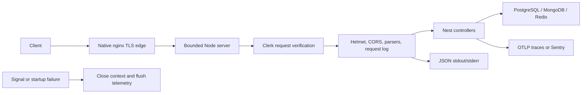

# Runtime operations and HTTP boundary

Status: implemented foundation. Last verified: **2026-07-22** against NestJS
`11.1.28`, Express `5.2.1`, Helmet `8.3.0`, Pino `10.3.1`, `pino-http`
`11.0.0`, `nestjs-pino` `4.6.1`, OpenTelemetry SDK `0.220.0` and Sentry Nest
`10.67.0`.

## Boundary

This mechanism owns validated configuration, the public HTTP edge, operational
logging/tracing and startup/shutdown failure behavior. Domain authorization,
business audit retention, queue delivery and edge TLS/rate limiting remain at
their owning boundaries.

## HTTP policy

| Policy       | Contract                                                                                                                                                                                  |
| ------------ | ----------------------------------------------------------------------------------------------------------------------------------------------------------------------------------------- |
| Namespace    | `/api/v1`; introduce route versioning only when majors coexist.                                                                                                                           |
| Bodies       | JSON and URL-encoded: 100 KiB; URL-encoded: at most 100 parameters.                                                                                                                       |
| Node parsing | Headers: 10 seconds; full request receipt: 30 seconds; at most 100 headers.                                                                                                               |
| CORS         | Credentialed, exact validated `WEB_ORIGIN` list, 10-minute preflight cache; HTTPS-only origins in production.                                                                             |
| Headers      | Production Helmet defaults including CSP/HSTS; local/test disable those two for Swagger. `x-powered-by` is off.                                                                           |
| Proxy        | `trust proxy=false`; forwarded metadata never drives authorization.                                                                                                                       |
| API docs     | `/api/docs` and `/api/openapi.{json,yaml}` outside production; absent in production. Same document committed as `apps/backend/openapi/openapi.json`; see [API contract](api-contract.md). |

`HTTP_API_PREFIX` drives both routing and liveness suppression. The 30-second
request timeout bounds receipt, not handler execution — PostgreSQL, MongoDB,
Redis and provider operations need their own bounds.

Bull Board is optional at `/api/v1/admin/queues`; see [Queues](queues.md). Nest
controllers are private by default through the Clerk guard. Health controllers
opt out explicitly; development OpenAPI is mounted outside the controller graph.
See [authentication](authentication.md).

## Configuration

`ConfigModule` validates the application environment once. Production does not
load `.env`. The instrumentation preload validates only telemetry settings before
any SDK starts — its dependency-light schema does not import database or
provider clients.

- OTLP accepts an HTTP(S) base URL without embedded credentials, query or
  fragment. Sentry accepts its HTTP(S) DSN. They are mutually exclusive.
- Enabled Bull Board requires an unambiguous username and a password of at least
  16 characters. It still must not be public.
- The HTTP graph requires matching Clerk publishable/secret keys and a non-empty
  admin user-ID allowlist (unless auth bypass). `WEB_ORIGIN` also becomes Clerk
  `authorizedParties`. Production mounts the secret only into the API process.
- `OPENROUTER_API_KEY` and `OPENAI_API_KEY` are optional bounded credentials.
  OpenRouter currently serves Gemini and Qwen; OpenAI direct serves Luna and
  Terra. Calls occur exclusively in the worker. Production supplies keys through
  Docker secret files.
- `FEEDBACK_EXTRACTION_MODEL` optionally overrides the extraction model; it must
  name a permitted registered adapter (Terra is summary-only). Unknown or Terra
  as extraction fails at worker start. The key for the selected model is
  required. HTTP validates provider availability but never substitutes a model.
  `FEEDBACK_EXTRACTION_REASONING_EFFORT` is omitted when empty;
  `FEEDBACK_REPLY_REASONING_EFFORT` defaults to `low`;
  `FEEDBACK_ATTENTION_REASONING_EFFORT` defaults to explicit `none`;
  `FEEDBACK_EXTRACTION_SERVICE_TIER` reaches direct OpenAI adapters only.
  `FEEDBACK_SUMMARY_MODEL` / `FEEDBACK_SUMMARY_REASONING_EFFORT` configure the
  campaign-summary call (default Terra at `high`, `maxOutputTokens` 65,536).
- `MONGODB_URI` is required and must select a database. Production requires
  credentials and verified TLS except for internal Compose hostname `mongo`.
  MongoDB is part of readiness.
- Feedback transport, simulator, production rehearsal, Wasender webhook and
  simulated-transport fault variables: see [Wasender](wasender.md). Summary:
  `TRANSPORT_MODE` selects the outbound adapter; Wasender session key is
  worker-only; simulator routes require simulated transport; production
  rehearsal is fail-closed unless explicitly gated; `FEEDBACK_EXTRACTION_STUB`
  replaces extraction with the burst script and is refused in production; the
  feedback worker registers a versioned non-secret fingerprint of the complete
  profile in its BullMQ worker name so simulator/burst preflight can reject
  mismatched workers before paid ingress.
- Add new variables to the Zod contract, tests, applicable example/deployment
  configuration and this page. Services do not read scattered `process.env`.

### Topic analysis runtime

Topic analysis adds `FEEDBACK_TOPIC_ANALYSIS_ENABLED` (false by default, new
starts only), `FEEDBACK_TOPIC_CLUSTERING_PYTHON` and
`FEEDBACK_TOPIC_CLUSTERING_SCRIPT`. Relative paths resolve from repository root;
production uses absolute paths under `/opt/topic-clustering`. Worker embeddings
use the existing `OPENROUTER_API_KEY`. Both HTTP and worker validate path strings;
only the worker owns provider/process clients. The worker aborts an active
embedding request and kills/reaps its Python child during module destruction,
before queue/pool shutdown. Logs carry `topic_analysis` stages and sanitized
codes, never provider bodies or Python stderr. Details and hard ceilings:
[campaign topic analysis](../modules/campaign-topic-analysis.md).

## Logging and correlation

Pino writes JSON in production or non-TTY output; `pino-pretty` is local TTY
only. Request completion is `info` for success, `warn` for 4xx and `error` for
5xx/captured errors.

Incoming `x-request-id` is accepted only when it is 1–128 log-safe ASCII
characters; otherwise the server generates and returns a UUID. It is untrusted
correlation, never identity, authorization or idempotency. Logs strip query and
fragment values, redact common credential paths and evaluate the active
trace/span per record.

Liveness auto-logging and incoming tracing are suppressed. Readiness remains
visible. Redaction cannot rescue a credential already embedded in an exception
message — thrown errors, audit context and job data must be safe before
telemetry sees them.

Feedback uses per-operation stage observations (`event: feedback.operation`).
Records carry `operation`, `stage`, `status` (`started`, `completed` or
`failed`), `runId`, `elapsedMs` and `correlationId`, plus relevant internal
conversation, campaign, ingress or outbox ids. Terminal records identify the
outcome or bounded error name/code. Concurrent operations have separate run
ids and stage state. Correlation is still observational, never authorization.

| Operation                | Stages to inspect                                                                                                                                           |
| ------------------------ | ----------------------------------------------------------------------------------------------------------------------------------------------------------- |
| `ingress`                | `validate`, `persist_ingress`, `enqueue_materialize`; edited redelivery has separate persist/enqueue stages                                                 |
| `materialize`            | `ingress_load`, `conversation_match`, the selected inbound/outbound branch, `persist` or `persist_stop`, then `wakeup` or `summary`                         |
| `reconcile`              | `admit_claim`, `plan`, `execute_action`, `settle_work`, `enqueue_successor`; cleanup failures have their own observations                                   |
| `extract`                | `admit`, `plan_turn`, `commit_turn`, optional `capacity_brake`, `notify_operator`, `notify_summary`, `record_outcome`                                       |
| `extract_plan`           | `prepare_context`, `generate_and_validate`, `resolve_reply`; `extract_propose`, `extract_classify` and `extract_rewrite` observe each model call separately |
| `extract_commit`         | `begin_transaction`, `persist_results_and_intent`, `verify_claim`, `apply_state_and_transcript`, `commit_transaction`                                       |
| `extract_capacity_brake` | `begin_transaction`, `reload`, `fence`, `brake`, `commit_transaction` after the failed extraction transaction rolls back                                    |
| `dispatch`               | `initial_guard`, `transcript`, `send_slot`, `prepare_send`, `transport`, `finalize_result`; recovery failures use `dispatch_batch` / `quarantine`           |

A stage record means that stage started. The terminal record reports the last
stage reached and the operation's outcome or failure; it does not prove earlier
database writes committed. Commit completes only after the transaction promise
resolves. Parallel model calls and transport have separate run ids, so a
recovered child failure remains visible when its parent continues. For example,
a transport exception is recorded at `dispatch_transport` / `transport`, while
the parent can finish at `finalize_result` with outcome `ambiguous`.

The local feedback logger emits synchronously and absorbs sink failures. A log
call cannot replace a business exception or change commit, enqueue, retry or
send decisions. No transcript, prompt, phone number, provider response body,
error message or stack is added to stage records. Successful idle sender polls
do not emit operation records.

These process logs are separate from the transactional audit repository and
`message_outbox_log` history. Send evidence lives on the outbound intent as
`dispatch_context`; runtime dispatch never reads a diagnostic log for
permission ([ADR 0016](../../decisions/0016-feedback-dispatch-context.md)).

## Tracing and privacy

Configure one path per process:

- OpenTelemetry exports traces to `<OTEL_EXPORTER_OTLP_ENDPOINT>/v1/traces`
  with a five-second deadline. Metrics/log export is off. Credential-like HTTP
  query parameters are redacted; filesystem and Pino auto-instrumentation are
  off.
- Sentry uses the Nest SDK with a two-second close deadline. Request bodies,
  cookies, query values, response headers, user information, database values,
  GraphQL/GenAI data and stack locals are disabled. Only content type, user
  agent and request ID headers are eligible.

Telemetry shutdown is idempotent and coalesced. All configured cleanup branches
run; failures are aggregated afterward.

The compiled app is ESM, but currently instrumented Nest, Express, BullMQ/
ioredis, Pino and `pg` targets are CommonJS or wrappers. A 2026-07-22 smoke
produced Nest, Express, HTTP and ioredis spans with
`node --import ./dist/instrumentation.js`. The experimental ESM loader added no
spans and a warning, so it remains absent.

## Failure and shutdown

Unknown HTTP failures return a safe 500 while Pino records the error. Parse
limits return 413. Readiness failure returns the documented dependency-state
503 body.

Both factories use `abortOnError: false`. On startup failure the entrypoint
captures the original exception once, closes any created context, reports one
redacted fatal process event, flushes telemetry and exits non-zero. The factory
publishes the context to the entrypoint immediately after Nest creates it, before
logger/middleware/listener configuration, so those later failures can be cleaned
up. If telemetry preload validation fails before Nest exists, it emits
`telemetry.preload.failed` and exits immediately.

On `SIGTERM`/`SIGINT`, Nest hooks close pools/queues and call telemetry
shutdown. Queue connections settle in `beforeApplicationShutdown` so a signal
during connection open cannot leave a Redis command outliving its client
([queues](queues.md)). Signal handling does not make interrupted side effects
atomic.

Production worker `stop_grace_period` is **8 minutes**. PostgreSQL conversation
execution-fence and campaign-summary leases are **7 minutes**; the Redis
cross-replica conversation execution limiter is **15 minutes**. Grace therefore
covers a live fence/summary lease on a graceful deploy, but not the Redis
limiter — ungraceful stop still relies on lease/token expiry and recovery. The
direct outbox loop stops taking batches and drains the active pass during
shutdown.

## Tests and release smokes

Focused tests cover environment validation, Clerk 401/403/admin behavior, HTTP
limits/Helmet modes, request ID and redaction, startup ordering and telemetry
shutdown. A preload dependency test fails if telemetry validation imports the
MongoDB driver before the OpenTelemetry SDK starts. Release smokes verify
production docs 404, local docs render, 413 body limits, CORS allow/deny,
suppressed liveness, traced readiness, telemetry delivery, startup exit 1 and
SIGTERM cleanup for both processes.

## Sources and official references

- [HTTP factory](../../../apps/backend/src/bootstrap-http.ts),
  [HTTP policy](../../../apps/backend/src/infrastructure/config/http-policy.ts),
  [environment](../../../apps/backend/src/infrastructure/config/environment.ts),
  [Mongo lifecycle](mongodb.md),
  [logging](../../../apps/backend/src/infrastructure/logging/logging.module.ts),
  [preload](../../../apps/backend/src/instrumentation.ts),
  [startup cleanup](../../../apps/backend/src/infrastructure/observability/startup-failure.ts)
- [Nest configuration](https://docs.nestjs.com/techniques/configuration),
  [CORS](https://docs.nestjs.com/security/cors),
  [Helmet](https://docs.nestjs.com/security/helmet)
- [Pino redaction](https://getpino.io/#/docs/redaction),
  [OpenTelemetry exporters](https://opentelemetry.io/docs/languages/js/exporters/),
  [Sentry data collection](https://docs.sentry.io/platforms/javascript/guides/nestjs/data-management/data-collected/)
