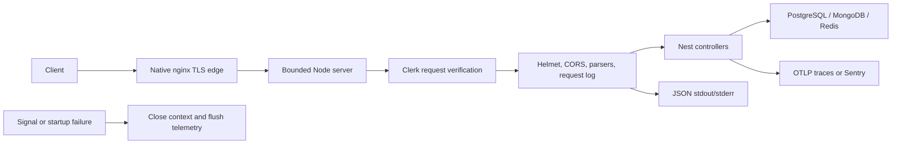

# Runtime operations and HTTP boundary

Status: implemented foundation. Last verified: **2026-07-22** against NestJS
`11.1.28`, Express `5.2.1`, Helmet `8.3.0`, Pino `10.3.1`, `pino-http`
`11.0.0`, `nestjs-pino` `4.6.1`, OpenTelemetry SDK `0.220.0` and Sentry Nest
`10.67.0`.

## Boundary

This mechanism owns validated configuration, the public HTTP edge, operational
logging/tracing and startup/shutdown failure behavior. Domain authorization,
business audit retention, queue delivery and edge TLS/rate limiting remain at
their owning boundaries.

## HTTP policy

| Policy       | Contract                                                                                                                                                                                         |
| ------------ | ------------------------------------------------------------------------------------------------------------------------------------------------------------------------------------------------ |
| Namespace    | `/api/v1`; introduce route versioning only when majors coexist.                                                                                                                                  |
| Bodies       | JSON and URL-encoded: 100 KiB; URL-encoded: at most 100 parameters.                                                                                                                              |
| Node parsing | Headers: 10 seconds; full request receipt: 30 seconds; at most 100 headers.                                                                                                                      |
| CORS         | Credentialed, exact validated `WEB_ORIGIN` list, 10-minute preflight cache; HTTPS-only origins in production.                                                                                    |
| Headers      | Production Helmet defaults including CSP/HSTS; local/test disable those two for Swagger. `x-powered-by` is off.                                                                                  |
| Proxy        | `trust proxy=false`; forwarded metadata never drives authorization.                                                                                                                              |
| API docs     | `/api/docs` and `/api/openapi.{json,yaml}` outside production; absent in production. The same document is committed as `apps/backend/openapi/openapi.json`; see [API contract](api-contract.md). |

The shared `HTTP_API_PREFIX` drives both routing and liveness suppression so
those policies cannot drift. The 30-second request timeout bounds receipt, not
handler execution. PostgreSQL, MongoDB, Redis and provider operations need their own
bounds; route deadlines require cancellation and documented recovery.

Bull Board is an optional separate surface at `/api/v1/admin/queues`; see
[Queues and workers](queues.md).

Nest controllers are private by default through the Clerk guard. Health
controllers opt out explicitly; development OpenAPI is mounted outside the
controller graph, and Bull Board keeps its independent protection. See
[Admin authentication](authentication.md).

## Configuration

`ConfigModule` validates the application environment once. Production does not
load `.env`. The instrumentation preload separately validates only telemetry
settings before an SDK starts. Its dedicated dependency-light schema does not
import database or provider clients, so OpenTelemetry installs instrumentation
hooks before the application loads those libraries.

- OTLP accepts an HTTP(S) base URL without embedded credentials, query or
  fragment. Sentry accepts its HTTP(S) DSN. They are mutually exclusive.
- Enabled Bull Board requires an unambiguous username and a password of at least
  16 characters. It still must not be public.
- The HTTP graph requires matching Clerk publishable/secret keys and a non-empty
  admin user-ID allowlist. `WEB_ORIGIN` also becomes Clerk's
  `authorizedParties`. Production mounts the secret only into the API process.
- `OPENROUTER_API_KEY` and `OPENAI_API_KEY` are optional bounded credentials.
- `FEEDBACK_EXTRACTION_MODEL` optionally overrides the post-event feedback
  extraction model. It must name a permitted registered adapter; Terra is
  summary-only, and either it or an unknown id fails at worker start rather than
  silently using the default.
  The key for the exact selected model is required: OpenRouter currently serves
  Gemini and Qwen, while OpenAI direct serves Luna and Terra. The HTTP process
  validates provider availability but never substitutes a model. Calls occur
  exclusively in the worker. Production supplies both keys through Docker
  secret files rather than Compose environment metadata.
  `FEEDBACK_EXTRACTION_REASONING_EFFORT` controls the extraction call and is
  omitted when empty; `FEEDBACK_REPLY_REASONING_EFFORT` controls the conditional
  participant-facing rewrite and defaults to `low`;
  `FEEDBACK_ATTENTION_REASONING_EFFORT` controls the
  separately billed classifier and defaults to explicit `none`.
  `FEEDBACK_EXTRACTION_SERVICE_TIER` reaches direct OpenAI adapters only,
  including the Luna paid-rehearsal route.
  `FEEDBACK_SUMMARY_MODEL` and `FEEDBACK_SUMMARY_REASONING_EFFORT` configure the
  separate campaign-summary call, which defaults to direct-OpenAI Terra at
  `high`. Turbo and both Compose launch paths forward these values instead of
  silently replacing them with in-module/provider defaults.
- `MONGODB_URI` is required and must select a database. Production requires
  credentials and verified TLS except for the internal Compose hostname
  `mongo`; the entrypoint builds that URI from a database-scoped application
  secret mounted only into API and worker. MongoDB is part of readiness because
  conversation content cannot fall back to PostgreSQL.
- `WASENDER_SESSION_API_KEY` is an optional worker-only session bearer key.
  `TRANSPORT_MODE` selects the feedback outbound adapter: `disabled` rejects
  every delivery locally with `transport_disabled`, `simulated` is the
  development default, and `wasender` requires the session key when the worker
  graph is composed. The shared schema deliberately does not require that key,
  so an API configured for Wasender can start without receiving a worker secret.
  `FEEDBACK_SIMULATOR_ENABLED=true` mounts the manual composer and headless
  simulator only with `TRANSPORT_MODE=simulated`.
  Production remains fail-closed unless the explicit
  `FEEDBACK_PRODUCTION_REHEARSAL_ENABLED=true` exception is also set. That gate
  requires the simulator, forbids the extraction stub, Wasender session key and
  webhook, and leaves every simulator controller behind the ordinary Clerk
  admin guard. Extraction, classification and the conditional reply rewrite use
  the configured real model and incur their normal provider cost; outbound messages end in
  `feedback_sim_outbound`, never the Wasender network.
  Real-model runs still use the worker-wide `FEEDBACK_EXTRACTION_MODEL` and
  reasoning settings, and require `--confirm-paid-run`. The documented Luna
  rehearsal profile uses `medium` for extraction, classifier and reply writer;
  it is an
  explicit paid treatment, not a change to the Gemini production default.
  The feedback worker registers a versioned, non-secret fingerprint of that
  complete profile in its BullMQ worker name. Simulator and burst preflight
  reject absent, legacy, malformed, mixed or API-mismatched workers before any
  paid ingress is seeded. The same attestation includes `TRANSPORT_MODE` and
  the complete simulated-transport treatment. Fault rehearsal is configured
  process-wide with `FEEDBACK_SIMULATED_TRANSPORT_FAULT_MODE`, its integer
  `..._FAULT_PERCENT`, a non-secret log-safe `..._SEED`, and
  `..._MAX_DELAY_MS` (0–30,000). A mode other than `none` requires a non-zero
  percentage; faults or latency require simulated transport. Decisions are a
  stable hash of seed and outbox id rather than process-local randomness, so
  replicas with the same profile agree on the same durable row. Changing the
  profile requires stopping every feedback worker, isolating or draining
  unrelated simulated outbox work, and then starting all replicas identically;
  worker attestation is preflight evidence, not a dispatch fence during a
  rolling restart. The profile applies to every simulated send in that
  API/worker deployment, and both headless runners require
  `--confirm-transport-faults` before any run write when a fault or latency
  treatment is active. The flag does not fence already-due outbox rows.
  `FEEDBACK_EXTRACTION_STUB=true` replaces the worker extraction model with the
  deterministic burst script for multi-campaign rehearsal. It requires the
  simulator gate and is refused in production — a scripted model outside the
  simulator would silently lie about what the system is running.
  `WASENDER_WEBHOOK_ENABLED=true` separately requires a 32-character minimum
  `WASENDER_WEBHOOK_SECRET` and mounts the public provider callback only in the
  HTTP graph. See [Wasender integration](wasender.md); leave the webhook off
  until staging acceptance and the consent gate pass.
- Add new variables to the Zod contract, tests, applicable example/deployment
  configuration and this page when behavior changes. Services do not read
  scattered `process.env` values.

## Logging and correlation

Pino writes JSON in production or non-TTY output; `pino-pretty` is local TTY
only. Request completion is `info` for success, `warn` for 4xx and `error` for
5xx/captured errors.

Incoming `x-request-id` is accepted only when it is 1–128 log-safe ASCII
characters; otherwise the server generates and returns a UUID. It is untrusted
correlation, never identity, authorization or idempotency. Logs strip query and
fragment values, redact common credential paths and evaluate the active
trace/span per record.

Liveness auto-logging and incoming tracing are suppressed. Readiness remains
visible because dependency degradation matters. Redaction cannot rescue a
credential already embedded in an exception message; thrown errors, audit
context and job data must be safe before telemetry sees them.

## Tracing and privacy

Configure one path per process:

- OpenTelemetry exports traces to `<OTEL_EXPORTER_OTLP_ENDPOINT>/v1/traces` with
  a five-second deadline. Metrics/log export is off. Credential-like HTTP query
  parameters are redacted; filesystem and Pino auto-instrumentation are off.
- Sentry uses the Nest SDK with a two-second close deadline. Request bodies,
  cookies, query values, response headers, user information, database values,
  GraphQL/GenAI data and stack locals are disabled. Only content type, user
  agent and request ID headers are eligible.

Telemetry shutdown is idempotent and coalesced because lifecycle and startup
cleanup can both request it. All configured cleanup branches run; failures are
aggregated afterward.

The compiled app is ESM, but the currently instrumented Nest, Express, BullMQ/
ioredis, Pino and `pg` targets are CommonJS or wrappers. A 2026-07-22 smoke
produced Nest, Express, HTTP and ioredis spans with the existing
`node --import ./dist/instrumentation.js` preload. The experimental ESM loader
added no spans and did add a warning, so it remains absent. Re-evaluate when a
natively ESM instrumented dependency enters the graph.

## Failure and shutdown

Unknown HTTP failures return a safe 500 while Pino records the error. Parse
limits return 413. Readiness failure returns the documented dependency-state
503 body.

Both factories use `abortOnError: false`. On startup failure the entrypoint
captures the original exception once, closes any created context, reports one
redacted fatal process event, flushes telemetry and exits non-zero. The factory
publishes the context to the entrypoint immediately after Nest creates it, before
logger, middleware or listener configuration, so those later failures can be
cleaned up. Application-close failure is aggregated with the original error;
capture and telemetry-flush failures are reported separately without
recapturing the original. If the telemetry preload's own validation fails before
Nest exists, it emits
`telemetry.preload.failed` through the same redacted fatal serializer and exits
immediately; there is no application context or SDK to close.

On `SIGTERM`/`SIGINT`, Nest hooks close pools/queues and call telemetry shutdown.
Queue connections settle in the earlier `beforeApplicationShutdown` phase so a
signal that arrives while a connection is still opening cannot leave a Redis
command outliving its client ([queues](queues.md)).
Deployment grace must still exceed bounded database work and normal active-job
duration; signal handling does not make interrupted side effects atomic. The
production worker grace is eight minutes, deliberately longer than the
post-event feedback conversation's seven-minute execution lease. Its direct
outbox loop stops taking batches and drains the active pass during shutdown;
lease/token recovery still decides the result after an ungraceful stop.

## Tests and release smokes

Focused tests cover environment validation, Clerk 401/403/admin behavior, HTTP
limits/Helmet modes, request ID and redaction, startup ordering and telemetry
shutdown. A preload dependency test fails if telemetry validation imports the
MongoDB driver before the OpenTelemetry SDK starts. Release smokes verify
production docs 404, local docs render, 413 body limits, CORS allow/deny,
suppressed liveness, traced readiness, telemetry delivery, startup exit 1 and
SIGTERM cleanup for both processes.

## Sources and official references

- [HTTP factory](../../../apps/backend/src/bootstrap-http.ts), [HTTP policy](../../../apps/backend/src/infrastructure/config/http-policy.ts), [environment](../../../apps/backend/src/infrastructure/config/environment.ts), [Mongo lifecycle](mongodb.md), [logging](../../../apps/backend/src/infrastructure/logging/logging.module.ts), [preload](../../../apps/backend/src/instrumentation.ts) and [startup cleanup](../../../apps/backend/src/infrastructure/observability/startup-failure.ts)
- [Nest configuration](https://docs.nestjs.com/techniques/configuration), [CORS](https://docs.nestjs.com/security/cors), [Helmet](https://docs.nestjs.com/security/helmet) and [OpenAPI](https://docs.nestjs.com/openapi/introduction)
- [Express proxy settings](https://expressjs.com/en/guide/behind-proxies.html), [Node 24 HTTP](https://nodejs.org/docs/latest-v24.x/api/http.html), [Pino redaction](https://getpino.io/#/docs/redaction) and [nestjs-pino](https://github.com/iamolegga/nestjs-pino)
- [OpenTelemetry exporters](https://opentelemetry.io/docs/languages/js/exporters/), [instrumentation](https://opentelemetry.io/docs/languages/js/libraries/), [Sentry data collection](https://docs.sentry.io/platforms/javascript/guides/nestjs/data-management/data-collected/) and [Sentry draining](https://docs.sentry.io/platforms/javascript/guides/nestjs/configuration/draining/)
