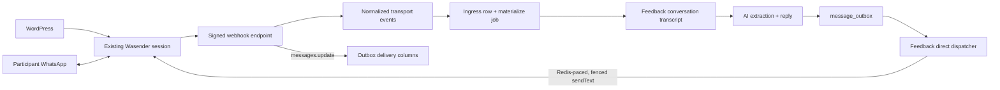

# Wasender transport and webhook boundary

Status: transport adapter, opt-in HTTP edge, durable ingress consumer and
direct fenced outbound dispatcher implemented. Last verified: **2026-08-03**
against the official Wasender API documentation. Uses Node 24 `fetch`, not the
pre-1.0 Wasender Node SDK.

## Purpose and boundary

Wasender is the transport adapter for the existing WhatsApp session. WordPress
keeps using that same session; this backend is another client, not its
replacement. This boundary owns authenticated provider calls, bounded response
validation, webhook authentication and normalization of provider payloads.

It does not own conversations, participant matching, AI feedback state, retries,
consent, a staff inbox or an admin UI. The webhook controller lives in the
post-event feedback ingress edge and hands normalized observations to the
ingress service and delivery-status events to the outbox delivery-status
service. The `integrations/wasender` adapter writes nothing: durable rows, queue
jobs and domain decisions belong to that module. The Wasender dashboard is not a
shared-inbox product and is not a backfill source for WhatsApp Business/Web or
WordPress history.

Outbound sending goes through the injectable `FeedbackTransport` port switched
by `TRANSPORT_MODE` (`disabled`, `simulated` or `wasender`); AI output never
calls Wasender directly. `FeedbackTransport` exposes only `sendText`. The
direct dispatcher obtains the deployment-wide Redis slot and commits its
provider-entry marker before calling that method. After acceptance the Wasender
adapter may best-effort call `WasenderClient.getMessageInfo` to capture the
WhatsApp id when already available.

Campaign, directed-result and human-control boundaries:
[post-event feedback](../modules/post-event-feedback.md),
[ADR 0008](../../decisions/0008-post-event-feedback-conversations.md).

## Contract

`WasenderClient` is exported from a controller-free client module for worker
composition:

| Operation           | Input                                 | Normalized output                                        |
| ------------------- | ------------------------------------- | -------------------------------------------------------- |
| `sendText`          | E.164 recipient and 1–4096 text chars | Provider log ID, recipient and provider acceptance state |
| `getMessageInfo`    | Positive provider log ID              | WhatsApp message ID, key, timestamp and status `0..5`    |
| `markMessageAsRead` | Exact key received from a webhook     | Completion or classified provider error                  |

No automatic provider retries. `TRANSPORT_MODE=wasender` adds the provider
module to the worker graph and requires `WASENDER_SESSION_API_KEY` there; the
HTTP graph never receives that credential. `disabled` returns
`not-accepted / transport_disabled`; the dispatcher marks the outbox failed and
raises undelivered-message attention — disabled traffic is never stockpiled.
`simulated` (default) uses durable sink `feedback_sim_outbound` plus optional
inject/read HTTP when `FEEDBACK_SIMULATOR_ENABLED` is true (off by default;
excluded from published OpenAPI). Production rehearsal may enable that
Clerk-protected surface with real model calls while forbidding Wasender client
and webhook.

Simulated transport can apply a process-wide deterministic fault treatment
(`reject`, `rate-limit`, unknown before/after accept, or seeded mix) plus
bounded latency. A sink row means simulated acceptance only — not `delivered` or
`read`. Different simultaneous treatments need separate deployments; there is no
admin global fault toggle. See configuration below.

When `WASENDER_WEBHOOK_ENABLED=true`, Wasender calls
`POST /api/v1/webhooks/wasender`. The route is public w.r.t. Clerk but requires
exact `X-Webhook-Signature`. Accepted events:

- `messages.upsert` and `messages-personal.received` → `message.observed`
  (direction, message ID, JID, chat kind, optional E.164, optional text);
- `messages.update` → `message.status-changed`
  (`error | pending | sent | delivered | read | played`).

Provider `sessionId` is never copied into normalized events (Wasender's status
example labels it as the session API key). Top-level envelopes are strict;
nested WhatsApp objects tolerate unknown fields while validating consumed ones.

| Event                                   | Handling                                                                                    |
| --------------------------------------- | ------------------------------------------------------------------------------------------- |
| `message.observed`, personal chat       | Durable ingress write + materialize enqueue; `recordedCount`                                |
| `message.observed`, group or newsletter | Never stored; `skippedCount`                                                                |
| `message.status-changed`                | Updates delivery columns on correlated `message_outbox`; `deferredCount`                    |

Text is trimmed and bounded to `FEEDBACK_OBSERVED_TEXT_HARD_LIMIT` (64,000) —
far above WhatsApp's 4096 send limit. Unqueueable messages answer 503 so the
provider may redeliver; the committed row stays `pending`. Delivery status never
moves backwards.

## Flow

The HTTP path authenticates, validates and durably records plus enqueues before
acknowledging. Status updates patch outbox delivery columns directly. Extraction
and sending stay separated by `message_outbox`.

## Invariants

- WordPress and backend share one session, API-key rotation and provider
  rate/concurrency limits. Outbound feedback starts wait on one deployment-wide
  Redis limiter; worker replicas do not multiply session throughput.
- Provider IDs and status transitions are untrusted. Ingress deduplicates by
  `(chat_jid, provider_message_id)`.
- Phone normalization yields an E.164 candidate, not verified identity.
  Resolution is a MongoDB lookup against a partial unique index — at most one
  open conversation; unmatched numbers are never guessed.
- Subscribe to `messages.upsert` and `messages.update`. Enabling
  `messages-personal.received` as well creates duplicate inbound observations;
  do so only with durable deduplication.
- Application logs exclude bodies, provider response bodies, credentials and
  `sessionId`. Keep Wasender `log_messages=false` unless retention is
  explicitly approved. Unmatched personal inbound text is **kept** as
  `ignored_unmatched` (`feedback.materialize.unmatched_inbound_retained`) — a
  second-number participant is a match failure, not data to erase.
- Wasender is transport, not system of record. MongoDB owns durable conversation
  state; PostgreSQL owns business audit, outbox and delivery state.

## Failure and recovery

`WasenderClientError` exposes safe operation, failure kind, HTTP status,
optional retry delay and delivery outcome:

- non-5xx HTTP rejection → `not-accepted`;
- timeout, network failure, malformed success or 5xx → `unknown` (provider may
  have accepted);
- reads → `not-applicable` delivery outcome.

Do not blindly retry an `unknown` send. Immediately before transport the
dispatcher token-fences an `attempting` row with `send_started_at`. Unknown
results become terminal `ambiguous`, keep any `provider_log_id` and leave the
claim query. An observed outbound without a known provider message id may match
the oldest unlinked same-body row of that conversation (marks sent rather than
double-sending). A 429 can use `Retry-After`; the adapter also accepts
`X-RateLimit-Reset` as either delta or Unix timestamp.

The simulator mirrors these classifications. `reject` / `rate-limit` become
terminal `failed` under current dispatcher policy; the adapter's `Retry-After`
hint is not persisted or scheduled. `unknown-before-accept` writes no sink row;
`unknown-after-accept` writes the sink then returns `unknown`; both become
`ambiguous`. Bounded latency is applied after the durable `attempting` marker.

Webhook payload docs disagree on whether `data.messages` is object or array —
the parser accepts both, but rejects unsupported event names or invalid consumed
fields.

`WASENDER_WEBHOOK_ENABLED` defaults false. Enabling it is deliberate: staging
acceptance pack and consent/legal gate first.

## Configuration and operations

| Variable                                     | Process | Contract                                                                                                                                          |
| -------------------------------------------- | ------- | ------------------------------------------------------------------------------------------------------------------------------------------------- |
| `TRANSPORT_MODE`                             | both    | `disabled`, `simulated` (dev default), or `wasender`; only Wasender mode composes the provider client and requires its session key                |
| `FEEDBACK_SIMULATOR_ENABLED`                 | API     | Defaults false; mounts Clerk-protected inject/thread and rehearsal routes only with simulated transport                                           |
| `FEEDBACK_PRODUCTION_REHEARSAL_ENABLED`      | both    | Defaults false; production-only exception requiring simulated transport + simulator, real model, and no Wasender credential or webhook            |
| `FEEDBACK_SIMULATED_TRANSPORT_FAULT_MODE`    | both    | `none`, `reject`, `rate-limit`, `unknown-before-accept`, `unknown-after-accept`, or `mixed`; non-`none` requires a positive percentage            |
| `FEEDBACK_SIMULATED_TRANSPORT_FAULT_PERCENT` | both    | Integer `0..100`; stable selection per `(seed, outbox id)`                                                                                        |
| `FEEDBACK_SIMULATED_TRANSPORT_SEED`          | both    | Non-secret log-safe seed; included in worker attestation so replicas and API must agree                                                           |
| `FEEDBACK_SIMULATED_TRANSPORT_MAX_DELAY_MS`  | both    | Stable per-row delay `0..30_000` ms; requires simulated transport when non-zero                                                                   |
| `WASENDER_SESSION_API_KEY`                   | worker  | Required by worker composition only when `TRANSPORT_MODE=wasender`                                                                                |
| `WASENDER_WEBHOOK_ENABLED`                   | API     | Defaults false; mounts the public route only when true; forbidden by production rehearsal                                                         |
| `WASENDER_WEBHOOK_SECRET`                    | API     | Required with the route; 32–512 chars, exact shared secret                                                                                        |

Normal Wasender production mounts separate secret files into worker and API.
Production rehearsal mounts no Wasender secret. The webhook URL must be the
public HTTPS URL. Current API/help prescribe direct secret equality (constant-
time compare); an older blog calls the same header an HMAC — an actual HMAC
header correctly fails with 401 and needs a reviewed contract change.

## Tests

Focused tests cover request shape and bearer auth, response/status
normalization, no-retry ambiguous failures, redacted errors, E.164 validation,
both webhook message shapes, status codes, shared-secret verification,
HTTP 200/400/401, OpenAPI and disabled-by-default 404. Controller tests cover
dispatch: one ingress call per observed personal message, no durable write for
group traffic, status events on outbox delivery columns, signature rejected
before the durable boundary, 503 when unqueueable. Transport/dispatcher tests
cover deployment-wide pacing, token loss, pre-send marker and unknown-outcome
quarantine.

## Sources and official references

- [Client](../../../apps/backend/src/integrations/wasender/wasender.client.ts),
  [JID](../../../apps/backend/src/integrations/wasender/wasender.jid.ts),
  [webhook adapter](../../../apps/backend/src/integrations/wasender/wasender.webhook.ts),
  [client module](../../../apps/backend/src/integrations/wasender/wasender-client.module.ts)
- [Webhook controller](../../../apps/backend/src/modules/post-event-feedback/ingress/wasender.controller.ts),
  [transport port](../../../apps/backend/src/modules/post-event-feedback/outbox/transport.ts),
  [Wasender adapter](../../../apps/backend/src/modules/post-event-feedback/outbox/wasender-transport.service.ts),
  [simulated sink](../../../apps/backend/src/modules/post-event-feedback/outbox/simulated-transport.service.ts),
  [dispatcher](../../../apps/backend/src/modules/post-event-feedback/outbox/dispatcher.service.ts),
  [ingress](../../../apps/backend/src/modules/post-event-feedback/ingress/ingress.service.ts),
  [post-event feedback module](../modules/post-event-feedback.md)
- Wasender [auth](https://wasenderapi.com/api-docs/authentication/how-to-authenticate-api-requests-using-bearer-tokens),
  [send text](https://api.wasenderapi.com/api-docs/messages/send-text-message),
  [message info](https://wasenderapi.com/api-docs/messages/get-message-info),
  [mark read](https://wasenderapi.com/api-docs/messages/mark-message-as-read),
  [webhook setup](https://wasenderapi.com/api-docs/webhooks/webhook-setup),
  [upsert](https://wasenderapi.com/api-docs/webhooks/webhook-message-upsert),
  [personal](https://www.wasenderapi.com/api-docs/webhooks/webhook-personal-message-received),
  [status](https://wasenderapi.com/api-docs/webhooks/webhook-message-update),
  [rate limits](https://wasenderapi.com/api-docs/rate-limits/understanding-rate-limits),
  [webhook help](https://www.wasenderapi.com/help/messaging/using-webhooks)
