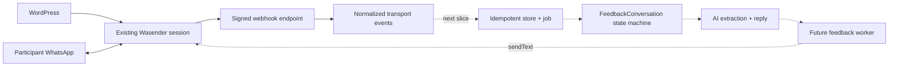

# Wasender transport and webhook boundary

Status: transport adapter and opt-in HTTP edge implemented; durable conversation
consumer deferred. Last verified: **2026-07-23** against the official Wasender
API documentation. The implementation uses Node 24 `fetch`, not the pre-1.0
Wasender Node SDK.

## Purpose and boundary

Wasender is the transport adapter for the existing WhatsApp session. WordPress
keeps using that same session; the new backend is another client, not its
replacement. This boundary owns authenticated provider calls, bounded response
validation, webhook authentication and normalization of provider payloads.

It does not yet own conversations, participant matching, AI feedback state,
message persistence, retries, consent, a staff inbox or an admin UI. The
Wasender dashboard is not treated as a shared-inbox product. Its message-log API
contains messages sent through the Wasender API only, and content/recipient
logging depends on a session setting; it is not a backfill source for WhatsApp
Business/Web or WordPress history.

The selected follow-up flow is conversational feedback inside WhatsApp. The
next product slice must introduce a durable `FeedbackConversation` state
machine, not add logic to this provider adapter.

## Contract

`WasenderClient` is exported from a controller-free transport module for worker
composition. It exposes:

| Operation           | Input                                 | Normalized output                                        |
| ------------------- | ------------------------------------- | -------------------------------------------------------- |
| `sendText`          | E.164 recipient and 1–4096 text chars | Provider log ID, recipient and provider acceptance state |
| `getMessageInfo`    | Positive provider log ID              | WhatsApp message ID, key, timestamp and status `0..5`    |
| `markMessageAsRead` | Exact key received from a webhook     | Completion or classified provider error                  |

There are no automatic provider retries. `WASENDER_SESSION_API_KEY`
conditionally adds the transport module to the worker graph; the HTTP graph
never receives that credential.

When `WASENDER_WEBHOOK_ENABLED=true`, Wasender can call
`POST /api/v1/webhooks/wasender`. The route is public with respect to Clerk but
requires the exact `X-Webhook-Signature` shared secret. It accepts only:

- `messages.upsert` and `messages-personal.received`, normalized to
  `message.observed` with direction, message ID, JID, chat kind, optional E.164
  counterparty and optional text;
- `messages.update`, normalized to `message.status-changed` with
  `error | pending | sent | delivered | read | played`.

Provider `sessionId` is never copied into normalized events because Wasender's
status example labels it as the session API key. Top-level event envelopes are
strict. The nested WhatsApp message/key objects tolerate unknown provider fields
while validating every field consumed by our code.

## Flow

The future HTTP path must authenticate, validate and durably record/enqueue an
event before acknowledging it. The worker then loads conversation state,
extracts structured feedback, chooses the next prompt and enqueues an outbound
send. AI output never calls Wasender directly.

## Invariants

- The WordPress and backend clients share one session, API-key rotation and
  provider rate/concurrency limits. Neither side may assume it is the sole
  sender.
- Provider IDs and event status transitions are untrusted inputs. The future
  store must deduplicate by provider event/message identity and tolerate
  duplicate or out-of-order delivery.
- Phone normalization yields an E.164 candidate, not verified identity.
  Participant linking must handle zero, one and multiple matches explicitly.
- Subscribe to `messages.upsert` for incoming and outgoing observation and
  `messages.update` for delivery state. Enabling
  `messages-personal.received` as well creates duplicate inbound observations;
  do so only when durable deduplication exists.
- Free-text feedback can contain sensitive data. Application logs exclude
  bodies, provider response bodies, credentials and `sessionId`. Keep Wasender
  `log_messages=false` unless retention and provider exposure are explicitly
  approved. The future `FeedbackConversation` ADR must define raw-content
  access, minimization and deletion.
- Wasender is transport, not the system of record. MongoDB must own durable
  conversation/feedback state; PostgreSQL must own business audit, outbox and
  delivery state.

## Failure and recovery

`WasenderClientError` exposes only a safe operation, failure kind, HTTP status,
optional retry delay and delivery outcome:

- a send rejected by a non-5xx HTTP response is `not-accepted`;
- a send timeout, network failure, malformed success response or 5xx response
  is `unknown` because the provider may have accepted it;
- reads carry `not-applicable` delivery outcome.

Callers must not blindly retry an `unknown` send. The future outbox/worker must
reconcile by stored provider IDs/status and apply a deliberate idempotency
policy. A 429 can use `Retry-After`; Wasender's documentation is inconsistent
about whether `X-RateLimit-Reset` is a delta or Unix timestamp, so the adapter
accepts either form defensively.

Webhook payload documentation also disagrees on whether `data.messages` is an
object or array. The parser accepts both, but rejects unsupported event names or
invalid consumed fields. Keep `WASENDER_WEBHOOK_ENABLED=false` until the durable
consumer exists: this slice verifies and normalizes events but does not persist
them.

## Configuration and operations

| Variable                   | Process | Contract                                                          |
| -------------------------- | ------- | ----------------------------------------------------------------- |
| `WASENDER_SESSION_API_KEY` | worker  | Optional session-scoped bearer key; presence enables transport    |
| `WASENDER_WEBHOOK_ENABLED` | API     | Defaults false; mounts the public route only when explicitly true |
| `WASENDER_WEBHOOK_SECRET`  | API     | Required with the route; 32–512 chars, exact shared secret        |

Production mounts separate secret files into the worker and API. The webhook
URL configured in Wasender must be the public HTTPS URL. Validate the signature
contract against a staging delivery before activation: the current API and help
pages prescribe direct secret equality, while an older Wasender blog calls the
same header an HMAC even though its example still performs equality. The adapter
implements the current API/help contract with a constant-time comparison; an
actual HMAC header would correctly fail with 401 and requires a reviewed contract
change.

The provider recommends controlled concurrency and publishes per-session rate
limits. Future jobs must serialize or tightly bound sends for this shared
session rather than launch one promise per participant.

## Tests

Focused tests cover request shape and bearer authentication, response/status
normalization, no-retry ambiguous failures, redacted errors, E.164 validation,
both webhook message shapes, all status codes, shared-secret verification,
HTTP 200/400/401 behavior, OpenAPI and the disabled-by-default 404 contract.

## Sources and official references

- [Client and schemas](../../../apps/backend/src/integrations/wasender/wasender.client.ts),
  [webhook adapter](../../../apps/backend/src/integrations/wasender/wasender.webhook.ts),
  [HTTP controller](../../../apps/backend/src/integrations/wasender/wasender.controller.ts)
  and [transport module](../../../apps/backend/src/integrations/wasender/wasender-transport.module.ts)
- Wasender [session bearer authentication](https://wasenderapi.com/api-docs/authentication/how-to-authenticate-api-requests-using-bearer-tokens),
  [send text](https://api.wasenderapi.com/api-docs/messages/send-text-message),
  [message info](https://wasenderapi.com/api-docs/messages/get-message-info)
  and [mark read](https://wasenderapi.com/api-docs/messages/mark-message-as-read)
- Wasender [webhook setup](https://wasenderapi.com/api-docs/webhooks/webhook-setup),
  [upsert](https://wasenderapi.com/api-docs/webhooks/webhook-message-upsert),
  [personal message](https://www.wasenderapi.com/api-docs/webhooks/webhook-personal-message-received)
  and [status update](https://wasenderapi.com/api-docs/webhooks/webhook-message-update)
- Wasender [errors](https://wasenderapi.com/api-docs/responses-errors/error-responses),
  [rate limits](https://wasenderapi.com/api-docs/rate-limits/understanding-rate-limits),
  [message logs](https://wasenderapi.com/api-docs/sessions/get-message-logs),
  [webhook help](https://www.wasenderapi.com/help/messaging/using-webhooks) and
  [conflicting HMAC blog wording](https://wasenderapi.com/blog/whatsapp-chatbot-using-nodejs-and-wasenderapi-build-efficient-customer-service-wasenderapi)
