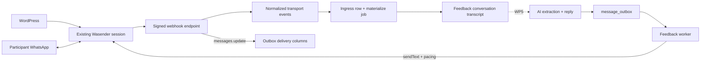

# Wasender transport and webhook boundary

Status: transport adapter, opt-in HTTP edge, durable ingress consumer and
paced outbound feedback transport implemented. Last verified: **2026-07-25**
against the official Wasender API documentation. The implementation uses Node 24
`fetch`, not the pre-1.0 Wasender Node SDK.

## Purpose and boundary

Wasender is the transport adapter for the existing WhatsApp session. WordPress
keeps using that same session; the new backend is another client, not its
replacement. This boundary owns authenticated provider calls, bounded response
validation, webhook authentication and normalization of provider payloads.

It does not own conversations, participant matching, AI feedback state, retries,
consent, a staff inbox or an admin UI. The webhook controller hands each
normalized observation to the post-event feedback ingress service and each
delivery-status event to the outbox delivery-status service, but the adapter
itself still writes nothing: durable rows, queue jobs and every domain decision
belong to that module. The Wasender dashboard is not treated as a shared-inbox
product. Its message-log API contains messages sent through the Wasender API
only, and content/recipient logging depends on a session setting; it is not a
backfill source for WhatsApp Business/Web or WordPress history.

The selected follow-up flow is conversational feedback inside WhatsApp. The
accepted campaign, directed-result and human-control boundary is documented in
the [post-event feedback module](../modules/post-event-feedback.md) and
[ADR 0008](../../decisions/0008-post-event-feedback-conversations.md). Outbound
sending goes through the injectable `FeedbackTransport` port switched by
`TRANSPORT_MODE` (`wasender` or `simulated`); AI output never calls Wasender
directly.

## Contract

`WasenderClient` is exported from a controller-free transport module for worker
composition. It exposes:

| Operation           | Input                                 | Normalized output                                        |
| ------------------- | ------------------------------------- | -------------------------------------------------------- |
| `sendText`          | E.164 recipient and 1–4096 text chars | Provider log ID, recipient and provider acceptance state |
| `getMessageInfo`    | Positive provider log ID              | WhatsApp message ID, key, timestamp and status `0..5`    |
| `markMessageAsRead` | Exact key received from a webhook     | Completion or classified provider error                  |

There are no automatic provider retries. `WASENDER_SESSION_API_KEY`
conditionally adds the transport module to the worker graph; the HTTP graph
never receives that credential. `TRANSPORT_MODE=wasender` also requires that
key and selects the paced Wasender `FeedbackTransport` adapter.
`TRANSPORT_MODE=simulated` (default) uses a durable PostgreSQL outbound sink
(`feedback_sim_outbound`) plus optional dev inject/read HTTP when
`FEEDBACK_SIMULATOR_ENABLED` is true (off by default; excluded from the
published OpenAPI composition).

When `WASENDER_WEBHOOK_ENABLED=true`, Wasender can call
`POST /api/v1/webhooks/wasender`. The route is public with respect to Clerk but
requires the exact `X-Webhook-Signature` shared secret. It accepts only:

- `messages.upsert` and `messages-personal.received`, normalized to
  `message.observed` with direction, message ID, JID, chat kind, optional E.164
  counterparty and optional text;
- `messages.update`, normalized to `message.status-changed` with
  `error | pending | sent | delivered | read | played`.

Provider `sessionId` is never copied into normalized events because Wasender's
status example labels it as the session API key. Top-level event envelopes are
strict. The nested WhatsApp message/key objects tolerate unknown provider fields
while validating every field consumed by our code.

After verification the controller dispatches each normalized event and answers
with the counts it acted on:

| Event                                   | Handling                                                                                    |
| --------------------------------------- | ------------------------------------------------------------------------------------------- |
| `message.observed`, personal chat       | One durable ingress write and one materialize enqueue; counted as `recordedCount`           |
| `message.observed`, group or newsletter | Never stored; counted as `skippedCount`                                                     |
| `message.status-changed`                | Updates delivery columns on the correlated `message_outbox` row; counted as `deferredCount` |

Feedback conversations are one-to-one chats, so group, newsletter and
unrecognized chat kinds are dropped at the edge rather than written and later
discarded. Text is trimmed and bounded to WhatsApp's 4096-character body limit
before it reaches the durable row. A message the endpoint could not queue is
answered with 503 so the provider may redeliver; the committed row stays
`pending`. Delivery status never moves backwards.

## Flow

The HTTP path authenticates, validates and durably records plus enqueues an
observed event before acknowledging it. Status updates patch outbox delivery
columns directly. The worker resolves the conversation, applies STOP, appends
the transcript, correlates delivery and relays the outbox through the transport
port. Extraction remains a separate work package.

## Invariants

- The WordPress and backend clients share one session, API-key rotation and
  provider rate/concurrency limits. Neither side may assume it is the sole
  sender. Outbound feedback sends wait on a shared-session pacer (minimum
  interval + jitter) and campaign intro/reminder jobs are staggered in the
  relay batch.
- Provider IDs and event status transitions are untrusted inputs. The ingress
  table deduplicates by `(chat_jid, provider_message_id)` and the consumer
  tolerates duplicate and out-of-order delivery.
- Phone normalization yields an E.164 candidate, not verified identity.
  Resolution is a MongoDB lookup against a partial unique index, so a number
  matches at most one open conversation and an unmatched number is never
  guessed at.
- Subscribe to `messages.upsert` for incoming and outgoing observation and
  `messages.update` for delivery state. Enabling
  `messages-personal.received` as well creates duplicate inbound observations;
  do so only when durable deduplication exists.
- Free-text feedback can contain sensitive data. Application logs exclude
  bodies, provider response bodies, credentials and `sessionId`. Keep Wasender
  `log_messages=false` unless retention and provider exposure are explicitly
  approved. Traffic that matches no open conversation keeps provider metadata
  only: the body is dropped when the row becomes `ignored_unmatched`, and group
  or newsletter chats are never written at all.
- Wasender is transport, not the system of record. MongoDB must own durable
  conversation/feedback state; PostgreSQL must own business audit, outbox and
  delivery state.

## Failure and recovery

`WasenderClientError` exposes only a safe operation, failure kind, HTTP status,
optional retry delay and delivery outcome:

- a send rejected by a non-5xx HTTP response is `not-accepted`;
- a send timeout, network failure, malformed success response or 5xx response
  is `unknown` because the provider may have accepted it;
- reads carry `not-applicable` delivery outcome.

Callers must not blindly retry an `unknown` send. The outbox reconciles instead:
the deliver consumer parks the row with `delivery_status=pending`, keeps any
`provider_log_id`, and on reclaim calls `getMessageInfo` before considering
another send. An observed outbound that carries no known provider message id is
also matched to the oldest unlinked row of that conversation with the same body,
which marks it sent rather than sending it twice. A 429 can use `Retry-After`;
Wasender's documentation is inconsistent about whether `X-RateLimit-Reset` is a
delta or Unix timestamp, so the adapter accepts either form defensively.

Webhook payload documentation also disagrees on whether `data.messages` is an
object or array. The parser accepts both, but rejects unsupported event names or
invalid consumed fields.

`WASENDER_WEBHOOK_ENABLED` stays `false` by default. The durable consumer and
outbox relay now exist, so enabling it is a deliberate operational decision:
the staging acceptance pack (linked-client outbound observation, provider retry
behavior, session disconnect, ambiguous sends) and the consent/legal gate still
come first.

## Configuration and operations

| Variable                     | Process | Contract                                                                                                           |
| ---------------------------- | ------- | ------------------------------------------------------------------------------------------------------------------ |
| `TRANSPORT_MODE`             | worker  | `simulated` (default, disallowed in production) or `wasender`; wasender requires the session API key               |
| `FEEDBACK_SIMULATOR_ENABLED` | API     | Defaults false; mounts dev inject/thread routes only with `TRANSPORT_MODE=simulated` and non-production `NODE_ENV` |
| `WASENDER_SESSION_API_KEY`   | worker  | Optional session-scoped bearer key; presence enables the Wasender client module                                    |
| `WASENDER_WEBHOOK_ENABLED`   | API     | Defaults false; mounts the public route only when explicitly true                                                  |
| `WASENDER_WEBHOOK_SECRET`    | API     | Required with the route; 32–512 chars, exact shared secret                                                         |

Production mounts separate secret files into the worker and API. The webhook
URL configured in Wasender must be the public HTTPS URL. Validate the signature
contract against a staging delivery before activation: the current API and help
pages prescribe direct secret equality, while an older Wasender blog calls the
same header an HMAC even though its example still performs equality. The adapter
implements the current API/help contract with a constant-time comparison; an
actual HMAC header would correctly fail with 401 and requires a reviewed contract
change.

The provider recommends controlled concurrency and publishes per-session rate
limits. Feedback sends serialize through the shared-session pacer rather than
launching one promise per participant.

## Tests

Focused tests cover request shape and bearer authentication, response/status
normalization, no-retry ambiguous failures, redacted errors, E.164 validation,
both webhook message shapes, all status codes, shared-secret verification,
HTTP 200/400/401 behavior, OpenAPI and the disabled-by-default 404 contract.
Controller tests add the dispatch contract: one ingress call per observed
personal message, no durable write for group traffic, status events applied to
outbox delivery columns, a signature rejected before the durable boundary, and
503 when the message could not be queued. Transport tests cover pacing bounds
and unknown-outcome no-retry.

## Sources and official references

- [Client and schemas](../../../apps/backend/src/integrations/wasender/wasender.client.ts),
  [webhook adapter](../../../apps/backend/src/integrations/wasender/wasender.webhook.ts),
  [HTTP controller](../../../apps/backend/src/integrations/wasender/wasender.controller.ts)
  and [transport module](../../../apps/backend/src/integrations/wasender/wasender-transport.module.ts)
- [Feedback transport port](../../../apps/backend/src/modules/post-event-feedback/feedback-transport.ts),
  [Wasender adapter](../../../apps/backend/src/modules/post-event-feedback/wasender-feedback-transport.service.ts),
  [simulated sink](../../../apps/backend/src/modules/post-event-feedback/simulated-feedback-transport.service.ts),
  [ingress service](../../../apps/backend/src/modules/post-event-feedback/post-event-feedback-ingress.service.ts)
  and the [post-event feedback module](../modules/post-event-feedback.md) that
  owns everything past the normalized event
- Wasender [session bearer authentication](https://wasenderapi.com/api-docs/authentication/how-to-authenticate-api-requests-using-bearer-tokens),
  [send text](https://api.wasenderapi.com/api-docs/messages/send-text-message),
  [message info](https://wasenderapi.com/api-docs/messages/get-message-info)
  and [mark read](https://wasenderapi.com/api-docs/messages/mark-message-as-read)
- Wasender [webhook setup](https://wasenderapi.com/api-docs/webhooks/webhook-setup),
  [upsert](https://wasenderapi.com/api-docs/webhooks/webhook-message-upsert),
  [personal message](https://www.wasenderapi.com/api-docs/webhooks/webhook-personal-message-received)
  and [status update](https://wasenderapi.com/api-docs/webhooks/webhook-message-update)
- Wasender [errors](https://wasenderapi.com/api-docs/responses-errors/error-responses),
  [rate limits](https://wasenderapi.com/api-docs/rate-limits/understanding-rate-limits),
  [message logs](https://wasenderapi.com/api-docs/sessions/get-message-logs),
  [webhook help](https://www.wasenderapi.com/help/messaging/using-webhooks) and
  [conflicting HMAC blog wording](https://wasenderapi.com/blog/whatsapp-chatbot-using-nodejs-and-wasenderapi-build-efficient-customer-service-wasenderapi)
