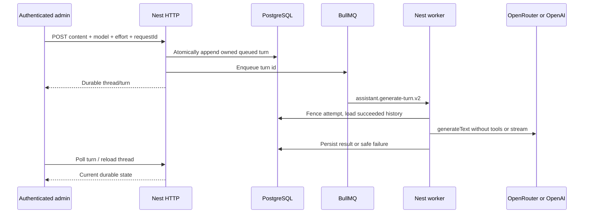

# Durable assistant threads

Status: implemented text-only asynchronous generation. Last verified:
**2026-07-23** against AI SDK `7.0.35`, `@ai-sdk/openai` `4.0.18` and
`@openrouter/ai-sdk-provider` `3.0.0`.

## Purpose and boundary

The assistant persists owner-scoped conversation threads and individual turns
in PostgreSQL, then delegates each model generation to the BullMQ worker. The
HTTP process never calls a model provider. The worker reloads the complete
authoritative context from PostgreSQL; Redis carries identifiers only.

This version is deliberately non-streaming and tool-free. A browser reload or
lost HTTP response can resume from the durable thread. Retrieval tools and
product mutations are a later contract, not untracked side effects hidden in
assistant prose.

## Models and provider adapters

The public/persisted model id maps to exactly one provider id:

| Public model id           | Provider   | Provider model id         |
| ------------------------- | ---------- | ------------------------- |
| `openai/gpt-5.6-luna`     | OpenAI     | `gpt-5.6-luna`            |
| `openai/gpt-5.6-terra`    | OpenAI     | `gpt-5.6-terra`           |
| `google/gemini-3.6-flash` | OpenRouter | `google/gemini-3.6-flash` |
| `qwen/qwen3.7-max`        | OpenRouter | `qwen/qwen3.7-max`        |

The mapping lives in `assistant-models.ts` and has an exact contract test. The
default is `google/gemini-3.6-flash`. Missing provider configuration returns
`503`; the backend never substitutes a different model. Provider clients are
created once per worker service, as in the source `notes_ai` adapter, while the
JoinTheSix registry keeps the provider boundary explicit.

Every turn also persists reasoning effort: `low`, `medium` or `high`, defaulting
to `low`. The worker maps it exactly to
`{ openai: { reasoningEffort } }` for Luna/Terra or
`{ openrouter: { reasoning: { effort } } }` for Gemini and Qwen3.7 Max. The
Qwen entry is the current text-only flagship copied from the `notes_ai`
selector, with `low`, `medium` and `high` as its exact offered efforts. Retry
and resume reuse the persisted model and effort; neither is inferred again.

## HTTP contract

Every route requires Clerk authentication. Ownership always comes from the
verified subject and is never accepted in a body.

- `POST /api/v1/assistant/threads` with
  `{ "requestId": "UUID", "model": "optional model", "effort": "low", "content": "..." }`
  creates a thread plus its first turn and returns the full thread. `effort` is
  optional and defaults to `low`.
- `GET /api/v1/assistant/threads` returns the 50 most recently updated owned
  thread summaries.
- `GET /api/v1/assistant/threads/:id` returns one owned thread with ordered
  turns.
- `POST /api/v1/assistant/threads/:id/turns` accepts the same body and returns
  the new turn.
- `GET /api/v1/assistant/threads/:threadId/turns/:turnId` is the polling route.
- `POST /api/v1/assistant/threads/:threadId/turns/:turnId/retry` requeues only
  the latest failed turn, preserving its user content and id.

`requestId` is a client-generated UUID. It is unique per verified owner. A
replayed create/append request with the same owner, UUID, operation, model,
effort and content returns the existing durable record without adding another
queue job. Replay is resolved before current provider availability is checked,
so a previously accepted request remains resumable after a key is removed.
Reusing the UUID for different input or operation returns `409`. The
advisory-lock scope and database uniqueness scope are both
`(owner, requestId)`.

A turn exposes `id`, `requestId`, `sequence`, `status`, `model`, `effort`,
`user`, nullable `assistant`, nullable safe `error`, `attempt` and lifecycle
timestamps. Statuses are `queued`, `running`, `succeeded` and `failed`; failure
codes remain `provider_unavailable`, `provider_rejected` and
`generation_failed`. Unknown and other-owner ids both return `404`.

## Flow and persistence

`assistant_threads` stores owner, title and lifecycle timestamps.
`assistant_turns` stores the owner-bound idempotency key, sequence, selected
model, reasoning effort, generation attempt, user content, assistant
result/error and lifecycle. The composite foreign key prevents a turn owner
from disagreeing with its thread. A partial unique index permits only one
queued/running turn per thread; the thread advisory lock serializes append and
retry before that database backstop is reached. Database checks require a
non-null/nonblank successful answer and allowlist persisted failure codes.

The worker feeds the model only successful prior user/assistant pairs plus the
current user content. Failed/incomplete prior work is not round-tripped into the
provider message schema. This keeps an interrupted turn from poisoning every
future turn, matching the important history-reduction invariant in `notes_ai`.

## Retry, recovery and failure states

- The BullMQ payload is exactly schema version, turn id and correlation id.
  Content, ownership, model and credentials stay out of Redis.
- The job id includes the durable turn attempt. The worker parses it and
  compares it to PostgreSQL before generation, so a retained old retry cannot
  write into a newer attempt.
- BullMQ transient retries reuse the same attempt. Retrying a terminal failed
  turn increments the persisted attempt and uses a new deterministic job id.
- Terminal writes require the matching attempt and a nonterminal status. A
  late/stalled execution cannot overwrite a newer retry or terminal result.
- A stall can still repeat a provider call and cost money; there is no false
  exactly-once claim.
- Provider rejection/configuration errors stop retrying. Timeouts, rate limits
  and provider 5xx failures use BullMQ retry; the last failure becomes safe
  persisted state.
- Queue insertion failure marks that exact attempt failed and returns `503`.
  A request replay returns that same failed turn, which the operator can retry
  explicitly without duplicating the user turn.
- The worker's terminal BullMQ `failed` event reconciles the same guarded turn
  even when failure happened outside the processor's generation `try/catch`.
  An already-terminal row is not overwritten.
- On worker startup and every five minutes, recovery examines at most 100
  queued/running turns whose last update is older than 15 minutes. Fifteen
  minutes is deliberately beyond five complete two-minute provider attempts.
  A turn is preserved while its exact attempt job is still waiting, delayed,
  prioritized, active or waiting on children. A missing/failed/completed job
  marks the attempt failed through the same status-and-attempt guard. Redis/DB
  inspection failure fails the scan safely and logs no prompt/provider data.

The database-to-queue crash gap remains. If assistant delivery becomes a
critical workflow, add the transactional outbox defined in the queue mechanism.

## Future tools and operator confirmation

Do not place tool state in `assistant_turns.assistant_content`. Add separate,
ordered records keyed to the turn:

1. read-only tool calls/results with validated input, bounded output and a
   stable execution id;
2. action proposals containing a typed mutation payload, `pending` status,
   proposer/approver identities and expiry;
3. a confirmation endpoint that revalidates authorization and current database
   state, then applies the mutation and business audit event in one transaction;
4. deterministic text summaries for completed tool/action outcomes when
   rebuilding model history.

The worker may propose a mutation but must never execute a product write merely
because model text or a tool call requested it. Operator confirmation is a
separate authenticated command boundary.

## Configuration, observability and tests

`OPENROUTER_API_KEY` enables Gemini 3.6 Flash and Qwen3.7 Max.
`OPENAI_API_KEY` enables Luna and Terra. Calls have a two-minute total bound and
AI SDK retries disabled so BullMQ owns visible retries. Worker concurrency is
two per process.

Logs contain queue/job/turn correlation identifiers and safe error categories,
never prompts, answers, keys or provider bodies. Focused tests cover schemas,
exact adapter mappings, idempotent request replay, owner scoping, durable
history reconstruction, attempt fencing, retry classification, HTTP/OpenAPI and
process composition, provider effort options, terminal-event reconciliation,
stale recovery and database constraints. Clean migration verification runs
twice. The superseding migration was also verified to abort before creating or
dropping anything when legacy `assistant_runs` contains a row.

The original assistant-run and durable-thread migrations are intentionally
unshipped and are released together. The durable migration drops the temporary
`assistant_runs` table only when it is empty. If any environment used that
initial table, migration fails closed before creating the new tables; export
and explicitly transform those runs first. Other legacy Qwen and GPT-5.4 ids
are not relabelled as current models because that would falsify history.

`20260723025013_allow_qwen_3_7_max_assistant_turns.sql` is the append-only
upgrade for databases that already applied the durable-thread migration. It
only drops and recreates `assistant_turns_model_check` with the four current
IDs; it does not replay the effort column or any unrelated constraints.

No automatic row-retention job exists. Define the product retention policy
before storing sensitive or long-lived personal information.

## Sources and official references

- [Module source](../../../apps/backend/src/modules/assistant/),
  [database schema](../../../packages/database/src/schema/assistant.ts) and
  [queue mechanism](../mechanisms/queues.md)
- [AI SDK `generateText`](https://ai-sdk.dev/docs/reference/ai-sdk-core/generate-text),
  [model messages](https://ai-sdk.dev/docs/reference/ai-sdk-core/model-message),
  [OpenAI provider](https://ai-sdk.dev/providers/ai-sdk-providers/openai) and
  [OpenRouter provider](https://github.com/OpenRouterTeam/ai-sdk-provider)
- [GPT-5.6 Luna](https://developers.openai.com/api/docs/models/gpt-5.6-luna),
  [GPT-5.6 Terra](https://developers.openai.com/api/docs/models/gpt-5.6-terra)
  [Gemini 3.6 Flash on OpenRouter](https://openrouter.ai/google/gemini-3.6-flash)
  and [Qwen3.7 Max on OpenRouter](https://openrouter.ai/qwen/qwen3.7-max)
