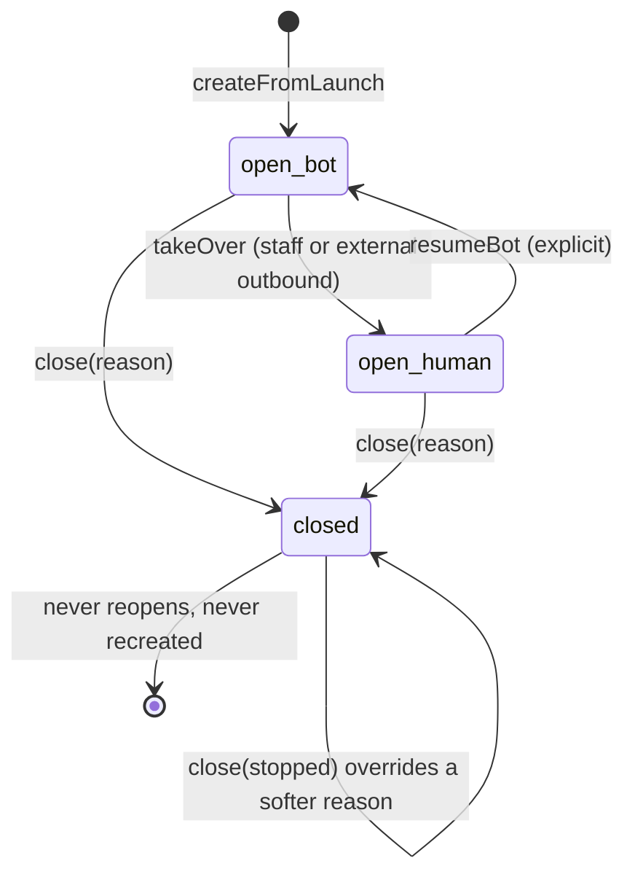

# Conversation threads

Status: two versioned aggregates are implemented in one MongoDB collection —
schema v1 for the admin Assistant, schema v2 for post-event feedback. The
feedback runtime pipeline (webhooks, queues, extraction) is intentionally not
part of this module; its first consumer is the post-event feedback
materializer.

## Purpose and authority

`modules/conversations` owns the MongoDB aggregates used by the admin Assistant
and by post-event feedback conversations. MongoDB is authoritative for
owner-scoped thread metadata, ordered content and user-visible conversation
state. PostgreSQL continues to own business/audit/outbox/delivery guarantees;
provider payloads do not become this model.

The current Assistant keeps a PostgreSQL execution projection for request
idempotency, attempt fencing, stale-job recovery and queue correlation. Its
content columns are a compatibility/backfill projection, not the read source
for the API or model history.

## Schema versions coexist

Both documents live in `conversation_threads` and are discriminated by
`schemaVersion` **and** `purpose`. Neither reader touches the other's
documents: every v1 query pins `schemaVersion` implicitly through its
`admin_assistant` purpose filter, and every v2 query filters
`schemaVersion: 2, purpose: "post_event_feedback"`. No v1 document is
reinterpreted, migrated or rewritten by this module.

| Version | Purpose               | Repository                       | Shape                                                  |
| ------- | --------------------- | -------------------------------- | ------------------------------------------------------ |
| 1       | `admin_assistant`     | `ConversationThreadRepository`   | Generic thread: turns, goals, `state`, `humanTakeover` |
| 2       | `post_event_feedback` | `FeedbackConversationRepository` | Feedback conversation: messages, lifecycle × control   |

Schema v1 still validates a `post_event_feedback` purpose because that branch
was written before v2 existed. Nothing writes it: post-event feedback
conversations are created only as schema-v2 documents. Removing that legacy
branch requires the usual versioned change, not a silent edit.

## Schema v1 — assistant aggregate

Every v1 document has a UUID string `_id`, schema version, purpose, channel,
owner, title, lifecycle state, at most ten ordered goals, human-takeover state,
ordered turns and timestamps.

Goals have a stable key, contiguous ordinal, prompt, status and nullable
answer. Only an answered goal may contain an answer. Human takeover records
inactive/requested/active/resolved state and ordered timestamps. An active
takeover requires the thread's `human_takeover` state.

Turns have unique UUIDs and contiguous sequence numbers. A turn stores input,
optional output or safe error, model metadata when applicable, exact attempt
and lifecycle timestamps. A terminal result is exclusive: succeeded has output,
failed has error, and nonterminal turns have neither.

The aggregate embeds at most 75 turns to stay below MongoDB's hard BSON limit
under worst-case content sizes. A later retention/rollover design must preserve
owner scoping and global order before increasing that limit.

## Assistant synchronization and recovery

New Assistant work commits its PostgreSQL execution projection, then
materializes the Mongo conversation before queue insertion. A replay that finds
the PostgreSQL row but a missing Mongo turn materializes it and performs the
same deterministic enqueue, closing the transient cross-store gap.

After materialization:

- API thread/turn/list reads and worker model history come from MongoDB;
- request replay, list inventory, worker start and stale recovery use
  PostgreSQL snapshots to backfill a missing thread/turn; a detail read also
  materializes a missing aggregate before returning it, and backfill never
  replaces existing Mongo result/content;
- terminal generation writes MongoDB first, then advances the PostgreSQL
  projection;
- worker start and terminal-result conflict recovery repair a lagging
  PostgreSQL terminal projection from MongoDB;
- stale recovery materializes a missing Mongo turn before failing it and
  isolates per-turn persistence failures so one row cannot starve the batch;
- retry eligibility is validated in PostgreSQL before Mongo state changes, so
  rejecting a non-latest retry cannot corrupt the conversation; an interrupted
  retry reconciles a queued PostgreSQL attempt with the preceding failed Mongo
  attempt before enqueue or terminal recovery.

There is no fictional cross-database transaction. Deterministic queue ids and
replay repair narrow gaps, while the existing database-to-queue crash gap
remains documented in the Assistant/queue contracts. A critical participant
delivery workflow must use the PostgreSQL outbox rather than pretending a Mongo
write also delivered a message.

## Schema v2 — post-event feedback conversation

One document per (campaign, respondent). It is the transcript and the
conversation state; it is not a delivery record and not the answer store.

```text
_id                      uuidv5(campaignId, respondentParticipantId)
schemaVersion            2
purpose / channel        post_event_feedback / whatsapp
campaignId               campaign UUID
respondentParticipantId  participant UUID
phoneAtLaunch            E.164 number captured at launch
lifecycle                { state: open|closed,
                           reason: completed|stopped|expired|cancelled|null,
                           closedAt }
control                  { mode: bot|human,
                           source: launch|staff_action|external_outbound,
                           changedAt }
goals                    [ { key, ordinal, prompt,
                             status: pending|asked|answered|skipped } ]
messages                 [ { id, seq, actor: bot|participant|staff|system,
                             text, providerMessageId, ingressId, outboxId, at } ]
extraction               { cursorSeq, lastRunAt, model }
needsAttention           boolean
remindedAt               timestamp or null
createdAt / updatedAt    timestamps
```

Goal keys and their order come from the versioned WP0 question set
(`event_score`, `liked`, `meet_again`, `avoid`); the module does not redefine
them. Prompts come from the copy snapshot the campaign took at launch, so a
later copy edit never rewrites a live questionnaire.

The document stores **no candidate list**. Candidates are selected live at
extraction time from current attendance, so an attendance correction reaches
every later turn instead of a frozen copy.

Answers, notes, ingress rows, outbox rows and audit events stay in PostgreSQL.
The conversation carries only their identifiers as message provenance.

### Identity and idempotency

`_id = uuidv5(campaignId, respondentParticipantId)` (RFC 4122 version 5, SHA-1,
campaign as namespace). Launch replay therefore collides on the primary key
instead of creating a second conversation, so at most one conversation per
(campaign, participant) can ever exist. `createFromLaunch` returns
`{ created: false }` with the stored document when it already exists — a
conversation closed by STOP is returned as-is, never recreated.

### Lifecycle and control



Lifecycle and control are orthogonal. Queue, delivery and extraction statuses
are not conversation states.

- The first closure wins, with one exception: `close(stopped)` also overrides
  an existing softer reason, because opt-out is absolute (D14).
- No method reopens a closed conversation, so a STOP is structurally final.
- `resumeBot` is rejected on a closed conversation.
- `takeOver` works in any lifecycle state: an unobserved external outbound must
  silence the bot even on a conversation that just closed.
- `control.source` records why control changed. `launch` is the initial bot
  source and is invalid for human control.

### Messages and provenance

`seq` is contiguous from 1 and is allocated under an optimistic
`messages: { $size: n }` fence, so a concurrent append retries instead of
creating a gap or a duplicate sequence. Appends are idempotent by `ingressId`,
`outboxId` or the caller's stable message `id`; a replay with the same
provenance but different content is rejected rather than silently accepted.

| Actor         | Required provenance                                      |
| ------------- | -------------------------------------------------------- |
| `participant` | `ingressId` (durable PostgreSQL ingress row), no outbox  |
| `bot`         | `outboxId`                                               |
| `staff`       | `outboxId`, or `ingressId` for an observed external send |
| `system`      | neither; the caller supplies a stable `id`               |

Appends are allowed on a closed conversation because the transcript records
what actually happened (a STOP acknowledgement or a closing message is observed
after the closure). Whether a message may be _sent_ is a campaign/outbox
decision, not a transcript decision.

### Extraction cursor, attention and capacity

`extraction.cursorSeq` advances monotonically and can never pass the
transcript; a replayed or late run that would not move it is an idempotent
no-op. That is the idempotency boundary that stops the same source messages
from producing duplicate PostgreSQL answers while the full transcript stays
available as model context.

The transcript is capped at 150 messages with a 4 MiB BSON backstop (message
text is bounded at 4096 characters, WhatsApp's text-body limit). Reaching
either bound sets `needsAttention` and raises
`FeedbackConversationCapacityError`; nothing is silently dropped, and the
durable PostgreSQL ingress row still holds the message for an operator.

### Repository contract

| Method                   | Contract                                                                       |
| ------------------------ | ------------------------------------------------------------------------------ |
| `createFromLaunch`       | Deterministic `_id`; idempotent; reports `created`; phone conflict is explicit |
| `findById`               | Full document for a detail read                                                |
| `findOpenByPhone`        | Inbound resolution (D9), backed by the partial unique index                    |
| `listForCampaign`        | Compact campaign-grouped summaries; no transcripts in list reads               |
| `appendMessage`          | Contiguous `seq`, idempotent by provenance, cap/byte guard                     |
| `takeOver` / `resumeBot` | Explicit control transitions with a recorded source                            |
| `close`                  | Terminal reason; STOP overrides softer reasons; nothing reopens                |
| `advanceCursor`          | Monotonic extraction cursor bounded by the transcript                          |
| `setNeedsAttention`      | Sets or clears the operator attention flag                                     |

Every method validates the resulting document with Zod, and every transition
reports whether it actually changed state so callers can write exactly one
audit event.

### Indexes

| Index                                         | Purpose                                                                                            |
| --------------------------------------------- | -------------------------------------------------------------------------------------------------- |
| `feedback_conversation_open_phone_unique_idx` | Partial **unique** `phoneAtLaunch` where purpose is post-event feedback and lifecycle is open (D9) |
| `feedback_conversation_campaign_updated_idx`  | `campaignId` + recency for the grouped admin list                                                  |

The partial filter is what makes phone→conversation resolution unambiguous: a
second open conversation for the same number is rejected by the database, not
by a hopeful application check. The repository verifies both indexes on first
use, and [Compose provisioning](../../../docker/mongo-init/10-app-user.js)
creates them on a fresh volume.

### Not owned here

Extraction, reply sending, reminders, expiry sweeps, goal advancement and
campaign launch orchestration belong to later work packages. Webhook ingestion
and the `feedback` queue now live in the
[post-event feedback module](post-event-feedback.md#wp4-ingress-and-materialization-implemented):
its materializer is the only caller that resolves a phone, appends inbound
messages, closes a conversation on STOP or takes control on an unknown outbound.
The transport adapter calls that application service; it never writes provider
payloads into MongoDB.

Two consumer expectations follow from this repository's contract rather than
from the consumer's own code. A correlated outbound is not appended here — the
outbox owns that message's transcript entry through `outboxId` provenance, so
appending the same message again by `ingressId` would create a duplicate. And
because appends allocate `seq` on arrival, the transcript records durable
arrival order, not provider timestamps; the feedback worker runs at concurrency
`1` so one participant's burst keeps its order.

## Tests and sources

Schema-v1 tests cover purpose/channel/owner rules, ten-goal bounds, ordered
goals/turns, takeover consistency, BSON-safe capacity, owner-scoped
synchronization, attempt-fenced transitions, conflicting terminal results,
oversized output and Assistant cross-store fault paths. Capacity is rechecked
inside PostgreSQL's locked sequence allocation, not trusted to the earlier Mongo
read.

Schema-v2 tests cover the deterministic identifier (including the RFC 4122 DNS
vector), question-set-derived goals, lifecycle/control/provenance validation,
transcript cap and worst-case BSON size, idempotent launch and append, phone
conflict, capacity flagging, control and closure transition rules, monotonic
cursor advance, the index contract and the compact list projection. No test
requires a live MongoDB.

- Schema v1:
  [schemas](../../../apps/backend/src/modules/conversations/conversation-thread.schemas.ts),
  [repository](../../../apps/backend/src/modules/conversations/conversation-thread.repository.ts)
- Schema v2:
  [schemas](../../../apps/backend/src/modules/conversations/feedback-conversation.schemas.ts),
  [repository](../../../apps/backend/src/modules/conversations/feedback-conversation.repository.ts)
- [MongoDB lifecycle](../mechanisms/mongodb.md),
  [Assistant module](assistant.md) and
  [post-event feedback contract](post-event-feedback.md)
- [ADR 0007](../../decisions/0007-mongodb-conversation-authority.md),
  [ADR 0008](../../decisions/0008-post-event-feedback-conversations.md) and
  [implementation plan §6](../../../POST_EVENT_FEEDBACK_PLAN_2026-07-25.md)
