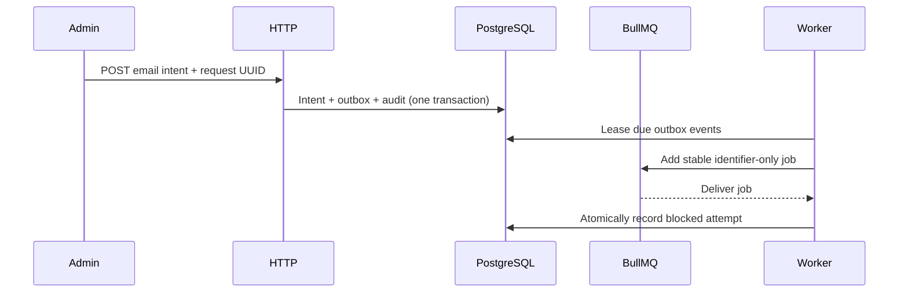

# Email delivery

Status: provider-agnostic durable foundation implemented. No email transport,
credentials or sending is configured. Source:
`apps/backend/src/modules/email/`.

## Boundary

Accepts an authenticated admin email intent and persists the intent, an outbox
event and a business audit event in one PostgreSQL transaction. It does **not**
send email. The worker relays identifier-only jobs and records a
`provider_not_configured` blocked attempt — truth instead of manufactured
delivery success.

Private API: `POST /api/v1/email-deliveries`, `GET /api/v1/email-deliveries`,
`GET /api/v1/email-deliveries/:id`. Creator-scoped. Responses: masked recipient,
operational status, safe error code, attempt timestamps — never subject, body,
full address, lease tokens or queue payloads.

## Persistence and idempotency

- `email_deliveries` — immutable message snapshot and authoritative state.
- `email_outbox_events` — closes commit-to-enqueue gap; recoverable until
  atomically consumed with the delivery claim.
- `email_delivery_attempts` — bounded operational outcomes only (no provider
  response, exception message or payload).

Client supplies UUID `requestId`. `(created_by, request_id)` unique. Exact
replay returns the existing delivery; different normalized recipient/subject/body
→ conflict (SHA-256 fingerprint for comparison only).

Outbox batch claim: PostgreSQL row lock + `SKIP LOCKED`. Delivery claim: plain
`FOR UPDATE` on both known rows (wait, don't skip). Both fenced by UUID lease
with expiry recovery. BullMQ job IDs derive only from outbox event ID.
Acknowledgement loss can re-enqueue; DB state prevents a terminal delivery from
taking another attempt. At-least-once coordination, not exactly-once provider
delivery.

## State machine

Schema supports `queued`, `processing`, `retry_scheduled`, `blocked`, `sent`,
`failed` (attempt counts, next-attempt time, fenced leases). Today every valid
queued intent becomes `blocked` / `provider_not_configured` in one transaction
with its attempt audit.

No retry/send endpoint. A provider needs a reviewed adapter, config contract,
transient/permanent failure classification, rate limits, timeouts, retention and
recovery tests before the processor may transition to `sent` or schedule retries.

## Data handling

PostgreSQL stores normalized recipient, subject and text body for a later
authorized transport. Treat those columns as sensitive; define retention before
production. Runtime logs, audit context, BullMQ data and admin responses contain
no raw recipient or content. Queue dashboard is read-only and not the business
audit interface.
