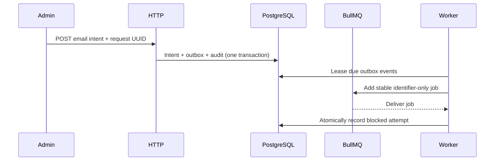

# Email delivery

Status: provider-agnostic durable foundation implemented. No email transport,
credentials or sending is configured.

## Boundary

The module accepts an authenticated admin email intent and persists the intent,
an outbox event and a business audit event in one PostgreSQL transaction. It
does not send email. The worker relays identifier-only jobs and records a
`provider_not_configured` blocked attempt so that the system reports the truth
instead of manufacturing delivery success.

The private API exposes `POST /api/v1/email-deliveries`,
`GET /api/v1/email-deliveries` and `GET /api/v1/email-deliveries/:id`.
Records are creator-scoped. Responses contain a masked recipient, operational
status, safe error code and attempt timestamps. They never return subject,
body, full recipient address, lease tokens or queue payloads.

## Persistence and idempotency

`email_deliveries` is the immutable message snapshot and authoritative state.
`email_outbox_events` closes the commit-to-enqueue gap. Relayed events remain
recoverable until a consumer atomically marks the outbox event consumed with
the delivery claim. `email_delivery_attempts` contains bounded operational
outcomes only; it stores no provider response, exception message or payload.

The client supplies a UUID `requestId`. `(created_by, request_id)` is unique.
An exact replay returns the existing delivery. Reusing the key with a different
normalized recipient, subject or body returns a conflict, using a SHA-256
fingerprint only for comparison.

The outbox batch claim uses a PostgreSQL row lock with `SKIP LOCKED`, so
concurrent relays step past each other's rows instead of queueing. The delivery
claim takes a plain `FOR UPDATE` on both rows and therefore blocks rather than
skips — it is claiming one known row, where waiting is correct and skipping
would drop the job. Both are fenced by a UUID lease with expiry recovery. BullMQ job IDs derive only from the outbox
event ID. Acknowledgement loss can enqueue again; database state prevents a
terminal delivery from acquiring another attempt. This is at-least-once
coordination, not exactly-once provider delivery.

## Current state machine

The schema supports `queued`, `processing`, `retry_scheduled`, `blocked`,
`sent` and `failed`, including attempt counts, next-attempt time and fenced
leases. In this release every valid queued intent becomes `blocked` with
`provider_not_configured` in one transaction with its attempt audit.

There is intentionally no retry/send endpoint. Adding a provider requires a
separate reviewed adapter, configuration contract, transient/permanent failure
classification, rate limits, timeouts, retention policy and recovery tests.
Only then may the processor transition to `sent` or schedule retries.

## Data handling

PostgreSQL necessarily stores the normalized recipient, subject and text body
so a later authorized transport can deliver the intent. Treat those columns as
sensitive: restrict database access, backups and exports; define retention
before production use. Runtime logs, audit context, BullMQ data and admin
responses contain no raw recipient or content. The queue dashboard is
read-only and is not the business audit interface.
