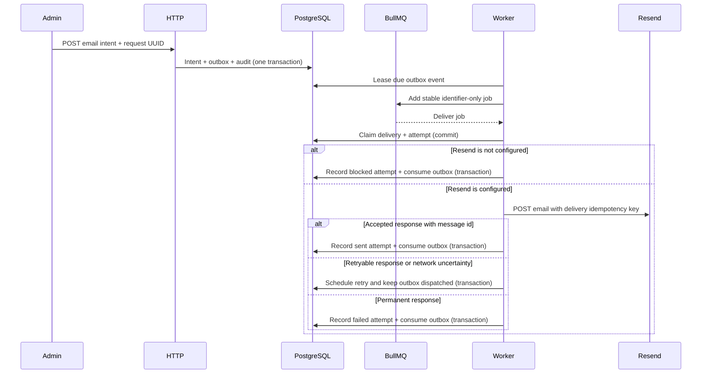

# Email delivery

Status: durable email intent, outbox and optional Resend delivery are
implemented. With no `RESEND_API_KEY`, the worker records a blocked delivery
and makes no external request. Source:
`apps/backend/src/modules/email/` and
`apps/backend/src/integrations/resend/`.

## Boundary

An authenticated admin request stores the message snapshot, one outbox event
and its audit event in a PostgreSQL transaction. The relay publishes an
identifier-only BullMQ job. The delivery worker claims the delivery and its
attempt in a transaction, commits that claim, then calls Resend outside a
transaction. It settles `sent`, `retry_scheduled` or `failed` in a second
transaction. A terminal settlement consumes the outbox event; a retry leaves
it dispatched and due for the existing relay scheduler.

Private API: `POST /api/v1/email-deliveries`, `GET /api/v1/email-deliveries`,
`GET /api/v1/email-deliveries/:id`. Creator-scoped responses contain a masked
recipient, operational status, safe error code and attempt timestamps. They
never contain the subject, body, full address, lease tokens or queue payloads.

## Resend configuration

The worker enables the adapter when `RESEND_API_KEY` is non-empty and requires
`RESEND_FROM_EMAIL`. The sender must be an address or domain verified in
Resend. The API key comes from the worker-only Docker secret in production;
`RESEND_FROM_EMAIL` is a non-secret sender setting. Local Compose passes both
values to the combined API/worker development process. Leave the key empty to
retain the blocked path.

The adapter uses built-in `fetch` against Resend's fixed
`https://api.resend.com/emails` endpoint, sends text-only content, and applies
a fixed 10-second timeout. Provider response bodies and exception messages are
not copied into application errors, audit records or logs.

## Persistence and idempotency

- `email_deliveries` stores the immutable normalized message snapshot and
  authoritative lifecycle state.
- `email_outbox_events` closes the commit-to-enqueue gap and stays dispatched
  until the delivery reaches a terminal state.
- `email_delivery_attempts` stores bounded operational outcomes only; it never
  stores provider responses, exception messages or message content.

The client supplies UUID `requestId`. `(created_by, request_id)` is unique.
Exact replay returns the existing delivery; a different normalized
recipient/subject/body conflicts using a SHA-256 fingerprint for comparison.

The worker sends `email_deliveries.id` as Resend's `Idempotency-Key`, and never
rotates it. Resend retains that key for 24 hours, so automatic sends stop after
23 hours from the first attempt and after five provider attempts. This bounds
recovery after an accepted request whose response was lost; an attempt that
exceeds either bound becomes failed without another provider call.

Outbox batch claim uses PostgreSQL row locks with `SKIP LOCKED`. Delivery claim
uses `FOR UPDATE` on both known rows and a UUID lease. An expired lease records
the previous attempt as `unknown` before recovery claims the next attempt.
BullMQ job IDs derive only from the outbox event ID. At-least-once coordination
is intentional; the durable provider key handles duplicate requests within
Resend's retention window.

## State machine and failures

The lifecycle supports `queued`, `processing`, `retry_scheduled`, `blocked`,
`sent` and `failed`. Attempts additionally record `unknown` when a worker lease
expires while a provider call may have been in flight.

| Condition                                                  | Delivery outcome                                                                        |
| ---------------------------------------------------------- | --------------------------------------------------------------------------------------- |
| No Resend key                                              | `blocked` / `provider_not_configured`; no network request                               |
| 2xx response with a non-empty `id`                         | `sent`                                                                                  |
| Network error, timeout, malformed success, 408, 429 or 5xx | Retry with the same key, up to five attempts and the 23-hour window                     |
| 409 `concurrent_idempotent_requests`                       | Retry with the same key                                                                 |
| 409 `invalid_idempotent_request` or another 4xx            | `failed`; never rotate the key                                                          |
| Unexpected non-Resend exception                            | Propagates to the worker; the dispatched outbox and lease recovery remain authoritative |

Resend `Retry-After` is honored between one second and 15 minutes; an absent
hint uses a 60-second delay. Existing BullMQ and outbox scheduling provide the
retry path. There is no provider framework or new scheduler.

PostgreSQL updates, attempt settlement and audit writes happen together. A
terminal outcome consumes the outbox event only after the delivery update
passes its lease fence. Tests mock `fetch`; they do not send real email.

## Data handling and follow-up

PostgreSQL stores the normalized recipient, subject and text body for the
authorized transport. Treat those columns as sensitive and define retention
before production. Runtime logs, audit context, BullMQ data and admin
responses contain no raw recipient or content. The remaining production work
is tracked in the [Resend follow-up task](../../tasks/resend-email.md).

## Official references

- [Resend send email API](https://resend.com/docs/api-reference/emails/send-email)
- [Resend idempotency keys](https://resend.com/docs/dashboard/emails/idempotency-keys)
- [Resend API errors](https://resend.com/docs/api-reference/errors)
- [Resend rate limits](https://resend.com/docs/api-reference/rate-limit)
