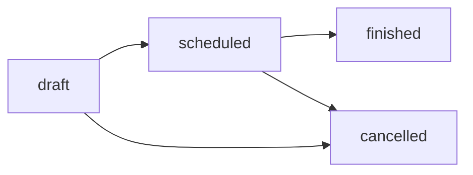
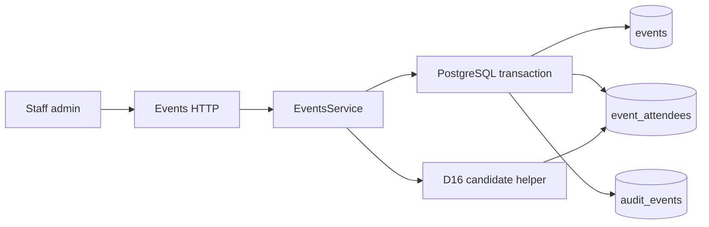

# Stub events and attendance

Status: schema, staff HTTP API and minimal admin screens implemented for the
post-event feedback vertical slice (WP1). Last verified: **2026-07-25** against
Drizzle ORM `0.45.2`, Nest `11.1.28` and Zod `4.4.3`.

## Purpose and boundary

This module owns staff-entered stub events and their attendance rows. It is the
upstream gate for post-event feedback campaigns: finish an event, correct who
was present, then later work packages launch conversations.

It does not own bookings, payments, venues, WhatsApp transport, campaigns or
feedback answers. Attendance corrections never delete finished-event rows; the
admin UI exposes no attendee delete operation for finished events (D1).

## Persisted contract

| Table             | Columns / rules                                                                                 |
| ----------------- | ----------------------------------------------------------------------------------------------- |
| `events`          | `title`, `starts_at`, `status` `draft\|scheduled\|finished\|cancelled`, timestamps              |
| `event_attendees` | `event_id`, `participant_id`, optional `table_no` (1–999), `present` (default true), timestamps |
| Uniqueness        | `UNIQUE(event_id, participant_id)`                                                              |
| FKs               | attendees → events `ON DELETE CASCADE`; attendees → participants `ON DELETE RESTRICT` (D18)     |

`post_event_feedback_whatsapp_opt_in` lives on `participants` (D4), not here.

## Public HTTP contract

Staff-only under the existing Clerk admin guard (`/api/v1/events`):

| Method  | Path                                                       | Effect                                                  |
| ------- | ---------------------------------------------------------- | ------------------------------------------------------- |
| `POST`  | `/events`                                                  | Create draft event + audit                              |
| `GET`   | `/events`                                                  | List summaries with attendee/present counts             |
| `GET`   | `/events/:id`                                              | Detail with attendees and nullable `feedbackCampaignId` |
| `PATCH` | `/events/:id`                                              | Edit title/starts while draft or scheduled              |
| `POST`  | `/events/:id/status`                                       | Transition status (see graph)                           |
| `POST`  | `/events/:id/attendees`                                    | Insert attendee (late add)                              |
| `PUT`   | `/events/:id/attendees/:attendeeId`                        | Update `present` / `table_no` (corrections)             |
| `GET`   | `/events/:id/feedback-candidates?respondentParticipantId=` | Shared D16 candidate list                               |

`feedbackCampaignId` is a read-model convenience for deep-linking the feedback
inbox. This module still does not own campaign lifecycle; launching remains a
feedback-module write (`launchFeedbackCampaign`).

Every mutation writes an `audit_events` row in the same transaction.

## Status transitions



`finished` and `cancelled` are terminal. Title/start edits are blocked once
finished or cancelled. Attendance inserts are blocked on cancelled events;
finished events still allow present/table corrections via `UPDATE` only.

## Feedback candidates (D16)

`EventsService.listFeedbackCandidatesForRespondent(eventId, respondentParticipantId)`
is the single source of the eligibility rule. It loads present attendees and
applies `selectFeedbackCandidates` from
[`feedback-candidates.ts`](../../../apps/backend/src/modules/events/feedback-candidates.ts):

- include attendees with `present = true`;
- exclude the respondent;
- return `participantId` + `displayName` (`preferred_name`, else email).

Extraction prompt building and subject validation both call this helper at run
time; nothing re-filters attendance on its own. Each run records the candidate
ids it received in `extraction_meta` (D12), so live selection stays auditable.

## Flow



## Invariants

- Corrections for «did not come» are `present=false`, never deletes.
- Late adds are inserts; duplicate `(event_id, participant_id)` is rejected.
- Participant deletion is restricted by FK; casual delete is not supported.
- No `feedback_*` tables are created in this module.

## Failure states

| Condition                          | Behaviour                            |
| ---------------------------------- | ------------------------------------ |
| Unknown event/attendee/participant | `404` transport-neutral domain error |
| Illegal status transition          | `400`                                |
| Duplicate attendee                 | `409`                                |
| Edit finished/cancelled details    | `400`                                |

## Extension points

Campaign launch (WP7) gates on `status=finished`, present attendees, opt-in and
phone. Do not store candidate snapshots on conversations; keep using the live
helper. See
[post-event feedback WP7](post-event-feedback.md#wp7-campaign-service-and-schedulers-implemented).

## Operations and tests

```bash
pnpm --filter @join-the-six/database db:generate --name=<name>
pnpm --filter @join-the-six/database test
pnpm --filter @join-the-six/backend test
```

Focused coverage: schema constraints and migration review, D16 helper rule,
status transition graph, opt-in audit (participants module).

## Decisions and references

- [ADR 0008](../../decisions/0008-post-event-feedback-conversations.md)
- [Post-event feedback module](post-event-feedback.md)
- [Plan WP1](../../../POST_EVENT_FEEDBACK_PLAN_2026-07-25.md)
- Source: `apps/backend/src/modules/events/`,
  `packages/database/src/schema/events.ts`,
  migration `packages/database/drizzle/20260725180038_stub_events_and_feedback_opt_in.sql`
