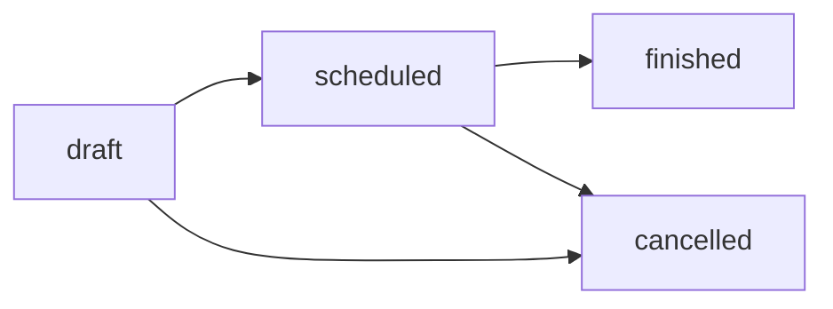
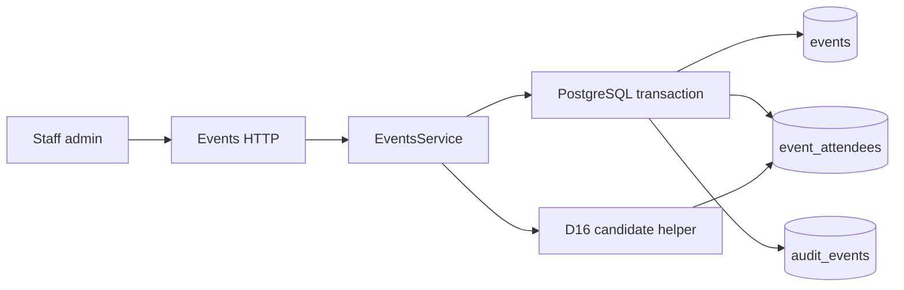

# Events, venue context and attendance

Status: schema, staff HTTP API and minimal admin screens implemented, including
operator-confirmed venue context. Last verified: **2026-08-02** against
Drizzle ORM `0.45.2`, Nest `11.1.28` and Zod `4.4.3`.

## Purpose and boundary

Owns staff-entered events, one operator-confirmed venue snapshot per event and
attendance rows. Upstream gate for post-event feedback: finish an event, correct
who was present, then launch conversations elsewhere.

Does **not** own bookings, payments, venue discovery/catalogue, Google APIs,
WhatsApp transport, campaigns or feedback answers. Venue is a stored reference
the operator selected and confirmed — the backend does not resolve, geocode or
refresh it. Attendance corrections never delete finished-event rows; the admin
UI exposes no attendee delete for any status, and the controller declares no
`@Delete` (D1).

`table_no` is persisted and returned; the event screen shows it read-only.
Seating assignment belongs to «Tables & matching»; `PUT` still accepts
`table_no` so that owner has an endpoint waiting.

`post_event_feedback_whatsapp_opt_in` lives on `participants` (D4), not here.

## Persisted contract

| Table             | Columns / rules                                                                                 |
| ----------------- | ----------------------------------------------------------------------------------------------- |
| `events`          | Title/start/status, flat nullable venue columns, non-null `venue_context_revision`, timestamps  |
| `event_attendees` | `event_id`, `participant_id`, optional `table_no` (1–999), `present` (default true), timestamps |
| Uniqueness        | `UNIQUE(event_id, participant_id)`                                                              |
| FKs               | attendees → events `ON DELETE CASCADE`; attendees → participants `ON DELETE RESTRICT` (D18)     |

No venue table or FK. Snapshot columns on `events`: `venue_provider`,
`venue_place_id`, `venue_label`, optional `venue_type` / `venue_area` /
`venue_price_level`, optional exact-price
`venue_price_start_minor` / `venue_price_end_minor` / `venue_price_currency_code`,
and `venue_use_in_feedback`.

Provider is only `google`. `placeId` trimmed non-empty (no app length cap);
`label` is operator-confirmed display text. `priceLevel` ∈ `free` |
`inexpensive` | `moderate` | `expensive` | `very_expensive`. Exact `priceRange`
is independent: non-negative `startMinor`, optional `endMinor` ≥ start, ISO
`currencyCode` (three uppercase letters).

`venue_context_revision` is event-level, non-null, not part of the nullable
venue columns. Create without venue → `0`; with venue → `1`. Every explicit
venue replace or clear increments it atomically (clear does not reset). Later
re-add, price change or `useInFeedback` toggle gets a strictly newer revision.

## Public HTTP contract

Staff-only under Clerk admin guard (`/api/v1/events`):

| Method  | Path                                                       | Effect                                                       |
| ------- | ---------------------------------------------------------- | ------------------------------------------------------------ |
| `POST`  | `/events`                                                  | Create draft event with optional nullable venue + audit      |
| `GET`   | `/events`                                                  | List summaries, counts and nullable venue                    |
| `GET`   | `/events/:id`                                              | Detail with attendees, nullable venue and campaign reference |
| `PATCH` | `/events/:id`                                              | Edit title/start where allowed; replace, keep or clear venue |
| `POST`  | `/events/:id/status`                                       | Transition status (see graph)                                |
| `POST`  | `/events/:id/attendees`                                    | Insert attendee (late add)                                   |
| `PUT`   | `/events/:id/attendees/:attendeeId`                        | Update `present` / `table_no`                                |
| `GET`   | `/events/:id/feedback-candidates?respondentParticipantId=` | Shared D16 candidate list                                    |

`venue` is nested and nullable on create/update and list/detail. Request:
`provider`, `placeId`, `label`, optional `type` / `area` / `priceLevel` /
`priceRange`, `useInFeedback`. Responses add server-owned positive
`contextRevision` when a venue exists (clients cannot set it). Optional nested
fields are omitted, not `null`.

Venue updates are whole-object replacement: omit `venue` → unchanged; `null` →
clear; object → replace every field. Every explicit object/null mutation bumps
revision atomically. No expected-revision / `If-Match`; concurrent saves are
**last-write-wins**. `contextRevision` is provenance and an extraction fence,
not an optimistic-edit token.

`feedbackCampaignId` is a read-model deep-link convenience. This module does not
own campaign lifecycle — launch is `launchFeedbackCampaign` in the feedback
module. When `useInFeedback` is enabled, each extraction run may receive a
provider-free snapshot of `label` and optional type/area/price; otherwise the
run is venue-blind. Google identifiers never cross that boundary. See
[venue context and revision fence](post-event-feedback.md#venue-context-and-revision-fence).

Every mutation writes `audit_events` in the same transaction. Venue audit may
record flags and revision, never `label`, `placeId` or address-like text.

## Status transitions



`finished` and `cancelled` are terminal. Finished blocks title/start edits but
still allows venue replace/clear and attendance inserts/corrections. Cancelled
blocks the detail patch and attendance mutations entirely.

## Feedback candidates (D16)

`EventsService.listFeedbackCandidatesForRespondent` is the sole eligibility
source. It loads present attendees and applies
[`feedback-candidates.ts`](../../../apps/backend/src/modules/events/feedback-candidates.ts):

- include `present = true`; exclude the respondent;
- return `participantId` + `displayName` (`preferred_name`, else email).

Extraction prompt building and subject validation call this helper at run time;
nothing re-filters attendance alone. Each run records candidate ids in
`extraction_meta` (D12).

## Flow



## Invariants

- «Did not come» → `present=false`, never deletes.
- Late adds are inserts; duplicate `(event_id, participant_id)` → reject.
- Participant delete restricted by FK; casual delete unsupported.
- At most one venue snapshot per event; no venue table.
- Venue revision: atomic SQL increment; never reset on clear.
- No `feedback_*` tables in this module.

## Failure states

| Condition                             | Behaviour                            |
| ------------------------------------- | ------------------------------------ |
| Unknown event/attendee/participant    | `404` transport-neutral domain error |
| Illegal status transition             | `400`                                |
| Duplicate attendee                    | `409`                                |
| Edit title/start on a finished event  | `400`                                |
| Patch any event detail when cancelled | `400`                                |

## Extension points

Campaign launch gates on `status=finished`, present attendees, opt-in and phone
— see
[campaign service](post-event-feedback.md#campaign-service-and-current-state-scheduling-implemented).
Do not store candidate snapshots on conversations; keep the live D16 helper.
Venue context is read live per extraction run and fenced by `contextRevision`.

## Operations and tests

```bash
pnpm --filter @slopform/database db:generate --name=<name>
pnpm --filter @slopform/database test
pnpm --filter @slopform/backend test
```

Focused coverage: schema/migration, venue mapping and revision, D16 helper,
status graph, opt-in audit (participants module).

## Decisions and references

- [ADR 0008](../../decisions/0008-post-event-feedback-conversations.md)
- [Post-event feedback module](post-event-feedback.md)
- Source: `apps/backend/src/modules/events/`,
  `packages/database/src/schema/events.ts`
- Migrations:
  `packages/database/drizzle/20260725180038_stub_events_and_feedback_opt_in.sql`,
  `packages/database/drizzle/20260802140631_event_venue_context.sql`
