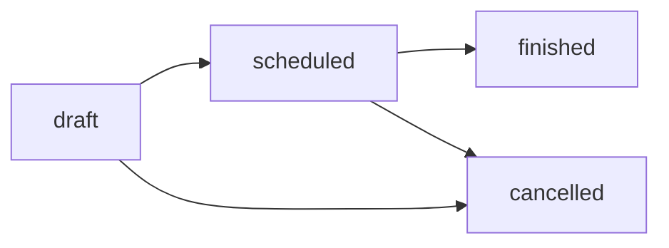
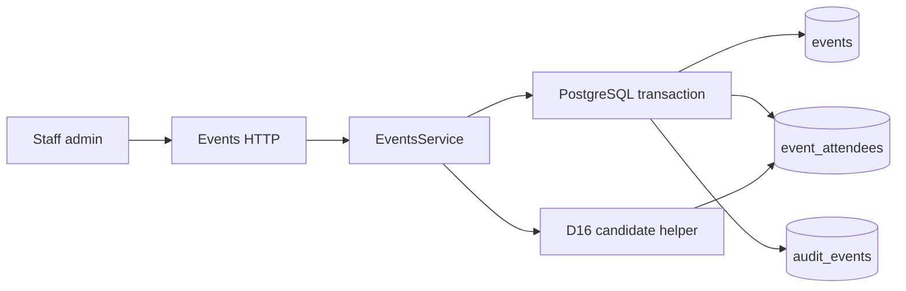

# Events, venue context and attendance

Status: schema, staff HTTP API and minimal admin screens implemented, including
operator-confirmed venue context. Last verified: **2026-08-02** against
Drizzle ORM `0.45.2`, Nest `11.1.28` and Zod `4.4.3`.

## Purpose and boundary

This module owns staff-entered events, one operator-confirmed venue context per
event and attendance rows. It is the upstream gate for post-event feedback
campaigns: finish an event, correct who was present, then later work packages
launch conversations.

It does not own bookings, payments, venue discovery/catalogue, Google APIs,
WhatsApp transport, campaigns or feedback answers. A venue is a stored reference
selected and confirmed by an operator; the backend does not resolve, geocode or
refresh it. Attendance corrections never delete finished-event rows; the admin
UI exposes no attendee delete operation for finished events (D1).

`table_no` is persisted and returned here, but the admin **reads** it only — the
event screen shows it as a chip and offers no control to change it. Seating is
the «Tables & matching» area's to assign; the `PUT` below still accepts
`table_no` so that owner has an endpoint waiting for it.

## Persisted contract

| Table             | Columns / rules                                                                                 |
| ----------------- | ----------------------------------------------------------------------------------------------- |
| `events`          | Title/start/status, flat nullable venue columns, non-null `venue_context_revision`, timestamps  |
| `event_attendees` | `event_id`, `participant_id`, optional `table_no` (1–999), `present` (default true), timestamps |
| Uniqueness        | `UNIQUE(event_id, participant_id)`                                                              |
| FKs               | attendees → events `ON DELETE CASCADE`; attendees → participants `ON DELETE RESTRICT` (D18)     |

There is no venue table and no venue foreign key. The single venue snapshot is
stored directly on `events` as `venue_provider`, `venue_place_id`,
`venue_label`, optional `venue_type`, optional `venue_area`, optional
`venue_price_level`, the optional exact-price columns
`venue_price_start_minor` / `venue_price_end_minor` /
`venue_price_currency_code`, and `venue_use_in_feedback`.

The only provider is `google`. `placeId` is trimmed and non-empty, with no
arbitrary application length cap; `label` is the operator-confirmed display
text. `priceLevel`, when present, is one of `free`, `inexpensive`, `moderate`,
`expensive` or `very_expensive`. An exact `priceRange` is independent of that
level: `startMinor` is a non-negative integer, `endMinor` is optional and cannot
precede it, and `currencyCode` is three uppercase letters.

`venue_context_revision` is event-level state, not part of the nullable venue
columns. It is non-null; creation without a venue stores `0`, while creation
with a venue stores `1`. It then increases atomically on every explicit venue
replacement or clear. Clearing a venue does not reset it, so a later re-add,
price change or `useInFeedback` toggle has a strictly newer revision.

`post_event_feedback_whatsapp_opt_in` lives on `participants` (D4), not here.

## Public HTTP contract

Staff-only under the existing Clerk admin guard (`/api/v1/events`):

| Method  | Path                                                       | Effect                                                       |
| ------- | ---------------------------------------------------------- | ------------------------------------------------------------ |
| `POST`  | `/events`                                                  | Create draft event with optional nullable venue + audit      |
| `GET`   | `/events`                                                  | List summaries, counts and nullable venue                    |
| `GET`   | `/events/:id`                                              | Detail with attendees, nullable venue and campaign reference |
| `PATCH` | `/events/:id`                                              | Edit title/start where allowed; replace, keep or clear venue |
| `POST`  | `/events/:id/status`                                       | Transition status (see graph)                                |
| `POST`  | `/events/:id/attendees`                                    | Insert attendee (late add)                                   |
| `PUT`   | `/events/:id/attendees/:attendeeId`                        | Update `present` / `table_no` (corrections)                  |
| `GET`   | `/events/:id/feedback-candidates?respondentParticipantId=` | Shared D16 candidate list                                    |

`venue` is nested and nullable on create/update requests and on list/detail
responses. Request fields are `provider`, `placeId`, `label`, optional `type`,
optional `area`, optional `priceLevel`, optional exact `priceRange`, and
`useInFeedback`. Responses add the server-owned positive `contextRevision` when
a venue exists. Clients cannot set that revision. Optional nested fields are
omitted, not emitted as `null`.

Venue updates use whole-object replacement. Omitting `venue` from `PATCH` leaves
the existing snapshot and revision unchanged; `venue: null` clears the snapshot;
an object replaces every venue field. Every explicit object/null mutation bumps
the persisted revision atomically, including an otherwise identical replacement.

The endpoint has no expected-revision or `If-Match` precondition. The event-row
lock serializes writes, but concurrent whole-object saves are explicitly
**last-write-wins**: the later update replaces the entire venue with its payload,
including the omission of optional fields. `contextRevision` is therefore not an
optimistic-edit token; it is server-owned provenance and an extraction fence.

`feedbackCampaignId` is a read-model convenience for deep-linking the feedback
inbox. This module still does not own campaign lifecycle; launching remains a
feedback-module write (`launchFeedbackCampaign`). `useInFeedback` controls the
feedback extraction boundary: when enabled, each run may receive a provider-free
snapshot of `label` and optional `type`, `area` and price context; when disabled,
absent or cleared, the run is venue-blind. Google identifiers and live metadata
never cross that boundary.

Every mutation writes an `audit_events` row in the same transaction. Venue audit
context may record state flags and the revision, but never `label`, `placeId` or
address-like text.

## Status transitions



`finished` and `cancelled` are terminal status values. For event detail patches,
a finished event blocks title/start edits but still allows venue replacement or
clear. A cancelled event blocks the patch entirely. Attendance inserts and
present/table updates are blocked only on cancelled events; a finished event
still allows both late attendee inserts and attendance corrections.

## Feedback candidates (D16)

`EventsService.listFeedbackCandidatesForRespondent(eventId, respondentParticipantId)`
is the single source of the eligibility rule. It loads present attendees and
applies `selectFeedbackCandidates` from
[`feedback-candidates.ts`](../../../apps/backend/src/modules/events/feedback-candidates.ts):

- include attendees with `present = true`;
- exclude the respondent;
- return `participantId` + `displayName` (`preferred_name`, else email).

Extraction prompt building and subject validation both call this helper at run
time; nothing re-filters attendance on its own. Each run records the candidate
ids it received in `extraction_meta` (D12), so live selection stays auditable.

## Flow



## Invariants

- Corrections for «did not come» are `present=false`, never deletes.
- Late adds are inserts; duplicate `(event_id, participant_id)` is rejected.
- Participant deletion is restricted by FK; casual delete is not supported.
- One event has at most one venue snapshot; no venue table is created.
- Venue revision changes are atomic SQL increments and never reset on clear.
- No `feedback_*` tables are created in this module.

## Failure states

| Condition                             | Behaviour                            |
| ------------------------------------- | ------------------------------------ |
| Unknown event/attendee/participant    | `404` transport-neutral domain error |
| Illegal status transition             | `400`                                |
| Duplicate attendee                    | `409`                                |
| Edit title/start on a finished event  | `400`                                |
| Patch any event detail when cancelled | `400`                                |

## Extension points

Campaign launch (WP7) gates on `status=finished`, present attendees, opt-in and
phone. Do not store candidate snapshots on conversations; keep using the live
helper. See
[post-event feedback WP7](post-event-feedback.md#wp7-campaign-service-and-schedulers-implemented).
Feedback extraction also reads venue context live for each run and fences every
venue-dependent persist by `contextRevision`; see
[venue context and revision fence](post-event-feedback.md#venue-context-and-revision-fence).

## Operations and tests

```bash
pnpm --filter @join-the-six/database db:generate --name=<name>
pnpm --filter @join-the-six/database test
pnpm --filter @join-the-six/backend test
```

Focused coverage: schema constraints and migration review, venue mapping and
revision semantics, D16 helper rule, status transition graph, opt-in audit
(participants module).

## Decisions and references

- [ADR 0008](../../decisions/0008-post-event-feedback-conversations.md)
- [Post-event feedback module](post-event-feedback.md)
- [Plan WP1](../../history/post-event-feedback-plan-2026-07-25.md)
- Source: `apps/backend/src/modules/events/`,
  `packages/database/src/schema/events.ts`
- Migrations:
  `packages/database/drizzle/20260725180038_stub_events_and_feedback_opt_in.sql`,
  `packages/database/drizzle/20260802140631_event_venue_context.sql`
