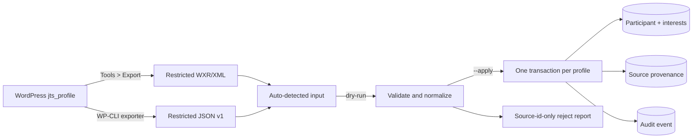

# Participant profiles and WordPress import

Status: schema and offline importer implemented. A WXR export from the supplied
WordPress admin was applied to local PostgreSQL on **2026-07-23**: 32 profiles
were imported, 9 trashed profiles were skipped and 4 active profiles remain in
reconciliation. This is not a production database cutover. Last verified
against Drizzle ORM `0.45.2`, Drizzle Kit `0.31.10`, `pg` `8.22.0` and Zod
`4.4.3`.

## Purpose and boundary

The participant profile stores the answers needed for contact and initial table
matching. The v1 operational importer moves existing `jts_profile` answers from
WordPress into that model with validation, provenance, idempotency and audit.

This module does not expose an HTTP signup endpoint yet. It does not import
payments, bookings, table assignments or raw WordPress post meta. It also does
not create consent evidence: the audited legacy profile data has no defensible
consent timestamp or notice version, so manufacturing one would turn a missing
fact into a very official-looking lie.

## Persisted contract

`participants` stores one normalized profile. `participant_interests` stores
the selected set. `participant_source_records` links a source record to the
participant and keeps source identifiers, source update time and a SHA-256 hash
of the canonical profile. It deliberately does not duplicate the raw PII
payload. Email remains required for identity/deduplication; the other answers
are nullable so incomplete legacy profiles can be migrated without inventing
facts. The future signup boundary must still require the complete contract.

| Legacy question | Canonical field          | Rule                                                    |
| --------------- | ------------------------ | ------------------------------------------------------- |
| `name`          | `preferred_name`         | Trim/collapse whitespace; 1–120 characters when present |
| `age`           | `age_band`               | `18_24`, `25_34`, `35_44`, `45_54`, `55_plus`           |
| `telephone`     | `phone_e164`             | Normalize a present Greek/local or international number |
| `city`          | `preferred_neighborhood` | One of the ten deployed Athens neighborhood options     |
| `interests`     | `participant_interests`  | Unique canonical codes; 0–5 for legacy, 1–5 for signup  |
| `personality`   | `conversation_style`     | Integer 1–5, listener to speaker                        |
| `email`         | `email_normalized`       | Trim, lowercase, validate; unique deduplication key     |

The exact Greek labels and canonical codes live in the
[mapper](../../../apps/backend/src/modules/participants/wordpress-profile.mapper.ts)
and database checks live in the
[schema](../../../packages/database/src/schema/participants.ts). The importer
accepts only export schema version `1`; changing a question meaning or option
requires a new explicit mapping/version, not fuzzy matching. Import v1 covers
the seven questions in the supplied signup screenshots. The WXR also contains
newer `availability`, `diet`, `goal`, `languages`, `topics`, `values` and `vibe`
metadata on 15 profiles; those answers remain in the restricted source export
until their target contract is approved.

## Import flow



The preferred path for the currently available access is WordPress admin
**Tools > Export > Profiles**. The CLI auto-detects the resulting WXR/XML file.
When WP-CLI access is available, the maintained JSON exporter remains supported:

```bash
umask 077
wp eval-file /path/to/export-jts-profiles.php > /restricted/jts-profiles.json
```

The maintained export script is
[`scripts/wordpress/export-jts-profiles.php`](../../../scripts/wordpress/export-jts-profiles.php).
`get_post_meta()` decodes WordPress-serialized values before JSON is emitted.
The checked-in
[`example-jts-profiles.json`](../../../scripts/wordpress/example-jts-profiles.json)
contains fake data and documents the envelope.

Keep real exports in a restricted, ignored location such as
`secrets/wordpress/`; never add them to Git. Validate before opening a database
connection:

```bash
pnpm import:wordpress-profiles --file=/restricted/jts-profiles.xml
```

Apply only after reviewing the report and migrating the target database:

```bash
pnpm db:migrate
pnpm import:wordpress-profiles --file=/restricted/jts-profiles.xml --apply
```

Dry-run is the default. The input is capped at 20 MiB. The command returns JSON
counts and source record IDs only; it does not print names, emails, phones or
answers. Exit code `2` means at least one row was rejected or conflicted. Delete
the export according to the approved retention process after reconciliation.

## Invariants and reconciliation

- `(source_system, source_record_id)` is unique. Replaying the same canonical
  hash is a no-op only when the target row still matches. Unexpected target
  changes become `target_drift` instead of a false successful replay.
- A changed payload for the same source record updates the linked participant,
  interests and provenance in one transaction.
- Normalized email is unique. A second source record with the same email links
  only when every canonical answer is identical; otherwise it is a manual
  `duplicate_email_conflict`.
- Trashed WordPress profiles are counted and skipped. Blank optional legacy
  answers are stored as `null`/an empty interest set and reported as incomplete.
  Non-blank unknown or invalid values are rejected rather than coerced.
- WordPress's public question metadata reports a zero scale bound, while the
  deployed UI offers `1`–`5`. The importer enforces the UI contract and reports
  zero as invalid for reconciliation.
- Import audit context contains source identifiers and action only. Runtime
  logs, audit rows and provenance rows contain no answer payload.

The importer processes valid records independently so one bad legacy row does
not roll back unrelated rows. Any reject, conflict or count mismatch blocks
migration sign-off; partial success is not permission to forget the remainder.

## Extension points

The future signup API should reuse the canonical participant schema and domain
rules but write through an authenticated/consent-aware application service. It
must not accept WordPress source identifiers or call this operational CLI.
Consent requires a separate versioned record containing the accepted notice and
timestamp. Participant identity/authorization must come from the authentication
boundary, not from possession of an email address.

Add option values by updating the database check, canonical Zod schema, legacy
mapping tests and reviewed migration together. Do not store new questionnaire
answers as an untyped JSON drawer unless the product explicitly chooses that
trade-off in an ADR.

## Tests and current migration status

The participant suites cover every age/neighborhood mapping, normalization,
incomplete legacy preservation, invalid scale and interest rejection, WXR
parsing, source-hash idempotency, updates, identical duplicate linking and
conflicting duplicate rejection. On 2026-07-25 the complete backend run passed
without failures; both database and backend builds and `drizzle-kit check` also
passed.

The restricted WXR contained 45 `jts_profile` posts: 36 active and 9 trashed.
The local import accepted 32 active profiles (22 complete and 10 incomplete),
creating 137 interest rows, 32 provenance rows and 32 audit rows. Four active
profiles remain rejected because source IDs `77`, `83`, `96` and `105` contain
non-empty values that cannot be normalized as phone numbers. A replay reported
all 32 accepted profiles as `unchanged`, confirming idempotency. These numbers
describe the local migration database only; deploying the schema and import to
the canonical environment remains a separate operation.

Credentials live only in the ignored local root `.env` with user-only file
permissions. Real exports live only under ignored `secrets/wordpress/` with
restricted permissions. No WordPress Application Password was created because
the existing authenticated admin session was sufficient.

## Decisions and references

- [WordPress migration strategy](../../migration-strategy.md) and
  [WordPress boundary ADR](../../decisions/0002-wordpress-boundary.md)
- [Importer CLI](../../../apps/backend/src/cli/import-wordpress-profiles.ts),
  [service](../../../apps/backend/src/modules/participants/wordpress-profile-import.service.ts),
  [WXR parser](../../../apps/backend/src/modules/participants/wordpress-wxr.parser.ts),
  [base migration](../../../packages/database/drizzle/20260723015851_add_participant_profiles.sql)
  and [legacy-nullability migration](../../../packages/database/drizzle/20260723021648_allow_incomplete_participant_profiles.sql)
- [Zod schemas](../../../apps/backend/src/modules/participants/wordpress-profile-import.schemas.ts)
  and [Drizzle transactions](https://orm.drizzle.team/docs/transactions)
