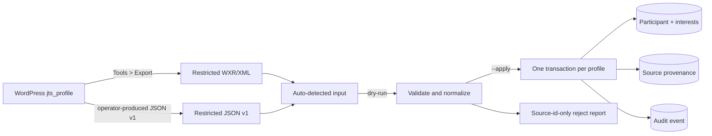

# Participant profiles and WordPress import

Status: schema, offline importer and staff event-history read model implemented.
Local WXR import verified **2026-07-23** (not a production cutover). Last
verified **2026-08-02** against Drizzle ORM `0.45.2`, Drizzle Kit `0.31.10`,
`pg` `8.22.0` and Zod `4.4.3`.

## Purpose and boundary

Participant profile stores contact answers and initial table-matching fields.
The v1 operational importer moves `jts_profile` answers from WordPress with
validation, provenance, idempotency and audit.

No HTTP signup yet. Does not import payments, bookings, table assignments or
raw WordPress post meta. Does not invent consent evidence: legacy profile data
has no defensible consent timestamp or notice version.

## Persisted contract

`participants` — one normalized profile. `participant_interests` — selected set.
`participant_source_records` — source link, identifiers, source update time,
SHA-256 of the canonical profile (no duplicated raw PII). Email required for
identity/dedup; other answers nullable so incomplete legacy rows migrate without
invented facts. Future signup must still require the complete contract.

`post_event_feedback_whatsapp_opt_in` (boolean, default `false`) is a WhatsApp
feedback eligibility gate (D4), not a consent ledger. Staff toggles that change
the value write `participant.feedback_whatsapp_opt_in_changed`; a no-op toggle
writes nothing. STOP handling flips it off with its own audit. Legal wording and
Meta/BSP classification remain a named gate before real humans.

| Legacy question | Canonical field          | Rule                                                    |
| --------------- | ------------------------ | ------------------------------------------------------- |
| `name`          | `preferred_name`         | Trim/collapse whitespace; 1–120 characters when present |
| `age`           | `age_band`               | `18_24`, `25_34`, `35_44`, `45_54`, `55_plus`           |
| `telephone`     | `phone_e164`             | Normalize present Greek/local or international number   |
| `city`          | `preferred_neighborhood` | One of ten deployed Athens neighborhood options         |
| `interests`     | `participant_interests`  | Unique canonical codes; 0–5 legacy, 1–5 signup          |
| `personality`   | `conversation_style`     | Integer 1–5, listener to speaker                        |
| `email`         | `email_normalized`       | Trim, lowercase, validate; unique dedup key             |

Greek labels and codes:
[mapper](../../../apps/backend/src/modules/participants/wordpress-profile.mapper.ts);
DB checks:
[schema](../../../packages/database/src/schema/participants.ts). Importer accepts
export schema version `1` only — meaning/option changes need a new mapping
version. Import v1 covers the seven deployed signup questions. WXR also carries
newer `availability`, `diet`, `goal`, `languages`, `topics`, `values`, `vibe` on
some profiles; those stay in the restricted export until a target contract is
approved.

## Staff HTTP surface

Staff-only under Clerk admin guard:

| Method  | Path                                                | Effect                                   |
| ------- | --------------------------------------------------- | ---------------------------------------- |
| `GET`   | `/api/v1/participants`                              | List profiles (capped)                   |
| `GET`   | `/api/v1/participants/:id`                          | Single profile                           |
| `GET`   | `/api/v1/participants/:id/events`                   | Event history (newest first)             |
| `PATCH` | `/api/v1/participants/:id/feedback-whatsapp-opt-in` | Toggle opt-in + audit when value changes |

`listParticipantEvents` joins `event_attendees` → `events`. Items:
`eventId`, `title`, `startsAt`, event `status`, `present`, `tableNo`, and the
same full nullable `venue` view as event list/detail (including
`contextRevision`). Unknown participant → `404`; known with no attendance →
empty `items`. Venue columns are owned by `events` — see
[event venue contract](events.md#persisted-contract). Import remains CLI, not
HTTP signup. Admin UI: `/admin/participants/:id`.

## Import flow



Preferred path with current access: WordPress **Tools > Export > Profiles**
(CLI auto-detects WXR). This public tree does not include a live-site WP-CLI
dump recipe. Import still accepts WXR or a versioned JSON v1 envelope matching
the fake example
[`example-jts-profiles.json`](../../../scripts/wordpress/example-jts-profiles.json).

Keep real exports under ignored `secrets/wordpress/`; never commit them.

```bash
pnpm import:wordpress-profiles --file=/restricted/jts-profiles.xml
pnpm db:migrate
pnpm import:wordpress-profiles --file=/restricted/jts-profiles.xml --apply
```

Dry-run is default. Input capped at 20 MiB. Report is JSON counts and source
record IDs only (no names/emails/phones/answers). Exit `2` = at least one
reject/conflict. Delete the export per approved retention after reconciliation.

## Invariants and reconciliation

- `(source_system, source_record_id)` unique. Same canonical hash is a no-op only
  when the target still matches; unexpected target changes → `target_drift`.
- Changed payload for the same source record updates participant, interests and
  provenance in one transaction.
- Normalized email unique. Second source with same email links only when every
  canonical answer is identical; else `duplicate_email_conflict`.
- Trashed WordPress profiles counted and skipped. Blank optional legacy →
  `null`/empty interests (incomplete). Non-blank unknown/invalid → reject, never
  coerce.
- WordPress metadata reports a zero scale bound; deployed UI is `1`–`5`.
  Importer enforces the UI contract (zero = invalid).
- Audit/logs/provenance: source identifiers and action only — no answer payload.

Valid records process independently so one bad row does not roll back others.
Any reject, conflict or count mismatch blocks migration sign-off.

## Extension points

Future signup reuses the canonical schema and domain rules through an
authenticated/consent-aware service — not WordPress source identifiers or this
CLI. Consent needs a separate versioned notice+timestamp record. Identity comes
from the authentication boundary, not possession of an email.

Add option values by updating DB check, canonical Zod, legacy mapping tests and
reviewed migration together. Untyped JSON drawers need an ADR.

## Tests and local migration status

Suites cover age/neighborhood mapping, normalization, incomplete legacy,
invalid scale/interest rejection, WXR parsing, source-hash idempotency, updates,
identical-duplicate linking, conflicting-duplicate rejection, opt-in audit and
event-history projection (including venue view).

**Local 2026-07-23 WXR (not production cutover):** 45 `jts_profile` posts
(36 active, 9 trashed) → 32 accepted (22 complete, 10 incomplete), 137 interest /
32 provenance / 32 audit rows; 4 active rejected on invalid phones (`77`, `83`,
`96`, `105`); replay reported all 32 `unchanged`. Credentials and real exports
stay in ignored local paths with restricted permissions.

## Decisions and references

- [WordPress migration strategy](../../migration-strategy.md),
  [WordPress boundary ADR](../../decisions/0002-wordpress-boundary.md)
- [Importer CLI](../../../apps/backend/src/cli/import-wordpress-profiles.ts),
  [service](../../../apps/backend/src/modules/participants/wordpress-profile-import.service.ts),
  [WXR parser](../../../apps/backend/src/modules/participants/wordpress-wxr.parser.ts),
  [base migration](../../../packages/database/drizzle/20260723015851_add_participant_profiles.sql),
  [legacy-nullability](../../../packages/database/drizzle/20260723021648_allow_incomplete_participant_profiles.sql)
- [Zod schemas](../../../apps/backend/src/modules/participants/wordpress-profile-import.schemas.ts)
