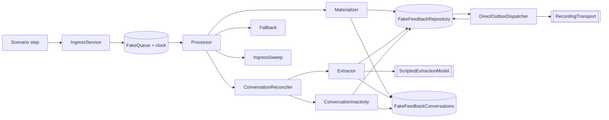

# Post-event feedback — executable scenarios

Custom scenarios and doubles live in [the harness workspace](../../../harness/README.md).
The production module remains under `apps/backend/src/modules/post-event-feedback/`.

> **Harness and specs are the operational contract.**
>
> - `post-event-feedback-loop.harness.ts` — factory, queue, runner (read header first)
> - `post-event-feedback-loop-scenario.ts` — vocabulary
> - `post-event-feedback-loop-model.harness.ts` — scripted model
> - `post-event-feedback-doubles.harness.ts` — fakes
>
> Rules:
>
> - Outcome snapshot has **no** `goals`, `modelCalls`, or `droppedIngress`. Use
>   `retainedParticipantText` / `lostParticipantText`.
> - `received` is `{ kind, text }[]` + counts by kind; never assert model wording;
>   application-owned copy may use `text`.
> - `transcript` is ordered `{ who, text, kind }` (not `"actor: text"`, not `seq`).
> - Known defect: set `defect`, `knownCurrent`, and `expect` (not bare `it.fails`).
> - Every scripted model/attention turn and expected provider failure is consumed
>   exactly.
> - Assert with `toMatchObject` only; two to four facts per scenario.

### Spec files

| File                               | Owns                                                 |
| ---------------------------------- | ---------------------------------------------------- |
| `post-event-feedback-loop.spec.ts` | Ordinary completion + silence                        |
| `…-loop-typing.spec.ts`            | Bursts, corrections, score shape                     |
| `…-loop-subjects.spec.ts`          | Identity, privacy, language, erasure                 |
| `…-loop-safety.spec.ts`            | Hostility, disclosure, handoff, control              |
| `…-loop-lifecycle.spec.ts`         | STOP, expiry, webhooks, campaign                     |
| `…-loop-races.spec.ts`             | In-flight model barriers                             |
| `…-loop-edges.spec.ts`             | Representative seams                                 |
| `…-loop-v2.spec.ts`                | Question-set V2 (only `questionSetVersion` consumer) |

Real-model rubrics:
`post-event-feedback-real-model-corpus.ts`. Transport-only cases stay fake-backed.
Loop harness schedules via conversation-revision wake-up + direct PostgreSQL
dispatcher. `FakeFeedbackConversations` stores typed aggregates in memory and
calls the production state transitions. Its simulated execution fence is
explicit; it does not prove PostgreSQL locking, JSONB sizing or rollback.
The opt-in PostgreSQL suite covers those adapter guarantees. Focused
reconciliation/planner/fence/dispatcher specs cover orchestration wiring.

### What “end-to-end” means

Real services in real order; faked: persistence, queue, clock, model,
transport, config/alerts. Drive through the **processor** (retry /
`UnrecoverableError` / fallback). Flow:

Doubles must enforce the invariants scenarios depend on (contiguous `seq`,
ingress/outbox uniqueness, answer identity, phone open-unique index, capacity).
Authoring detail: harness header — do not re-derive the step DSL here.

## Living executable index

Every `id` from the eight loop specs. Titles are the suite’s own contract
sentences. **Do not rename an id without updating the matching `id:` in the
spec.**

### `post-event-feedback-loop.spec.ts` (3)

| Id                               | Expect (suite title)                                                        |
| -------------------------------- | --------------------------------------------------------------------------- |
| `burst_typist`                   | Collapses a typed burst into one reading and one reply, in transcript order |
| `replies_to_the_closing_message` | Keeps post-closing text and marks it for an operator                        |
| `never_replies`                  | Nudges a never-answered participant once after a day                        |

### `post-event-feedback-loop-typing.spec.ts` (18)

| Id                               | Expect (suite title)                                         |
| -------------------------------- | ------------------------------------------------------------ |
| `slow_typist`                    | Answers a slow thought once, not once per sentence           |
| `mid_run_arrival`                | Records the corrected score, not the first read              |
| `dense_table_roll_call`          | Dense multi-person answer without drop/swap                  |
| `split_thought`                  | Keeps an answer citing both halves across a window           |
| `fifteen_fragment_rant`          | Long angry burst; venue not attributed to a person           |
| `answers_everything_at_once`     | Completes and closes when one message answers every question |
| `answers_the_wrong_question`     | Records an answer to a question not currently asked          |
| `changes_the_score`              | Holds the revised score                                      |
| `moves_someone_between_lists`    | Moves a person out of the old list                           |
| `contradicts_within_one_message` | Uses the final score inside one message                      |
| `sarcasm_and_explicit_negation`  | Does not treat sarcastic praise as `liked` when negated      |
| `non_numeric_score_word`         | Records a score written as a word                            |
| `out_of_range_score_refused`     | Stores nothing outside the scale; does not falsely confirm   |
| `zero_score_keeps_the_note`      | Refuses below-scale score; keeps words as a note             |
| `refuses_a_question`             | Completes when the last question is declined                 |
| `declines_every_question`        | Refusal → `declined`, one reply, no operator                 |
| `answers_only_yes`               | Three content-free replies write nothing                     |
| `names_themselves`               | Self-joke is a plain note, not a review item                 |

### `post-event-feedback-loop-subjects.spec.ts` (23)

| Id                                           | Expect (suite title)                                |
| -------------------------------------------- | --------------------------------------------------- |
| `praises_someone_who_was_not_there`          | Flagged subjectless note; no directed answer        |
| `praises_the_waiter`                         | Service feedback is a venue note, not an attendee   |
| `praise_resolves_when_attendance_is_right`   | Same praise becomes directed once in candidates     |
| `two_kostas`                                 | Refuses to pick between two same first names        |
| `stops_reasking_the_same_words`              | Re-ask once in different words, then stop + human   |
| `nickname_only`                              | Nickname preserved in flagged note                  |
| `misattribution_risk`                        | Never attributes sexual remark under ambiguous name |
| `voice_note_only`                            | One “cannot listen yet” reply                       |
| `photo_then_caption`                         | Reads the message after a caption-less photo        |
| `emoji_message`                              | Emoji-only body is ordinary text; asks again        |
| `insults_the_bot`                            | Swearing at the bot does not call an operator       |
| `flirts_with_the_bot`                        | Neither escalates nor records as attendee feedback  |
| `asks_for_a_human`                           | Promises a human once                               |
| `asks_for_a_human_while_paused`              | Defers handoff until campaign resumes               |
| `asks_for_a_human_then_keeps_talking`        | Stops questioning after the promise                 |
| `asks_who_reads_this`                        | Privacy Q without handoff; later answer records     |
| `prompt_injection_requests_private_feedback` | Ignores reveal-others instruction; returns to Qs    |
| `asks_to_delete_their_data`                  | Erasure → human; stop questioning                   |
| `greeklish`                                  | Greeklish directed answers resolve                  |
| `greeklish_oy_spelling`                      | «loyla» → Λούλα, not Ρούλα                          |
| `greek_inflected_first_name`                 | «taki» → Τάκης                                      |
| `greeklish_optout`                           | Greeklish opt-out is an opt-out                     |
| `replies_in_english`                         | English answers through ordinary path               |

### `post-event-feedback-loop-safety.spec.ts` (20)

| Id                                          | Expect (suite title)                                         |
| ------------------------------------------- | ------------------------------------------------------------ |
| `crude_but_harmless`                        | Crude compliment; flag nothing                               |
| `abuses_the_bot_throughout`                 | Three calm replies, one exit line, then no provider          |
| `cooperates_after_a_takeover`               | Normal answer after hand-back; no second exit line           |
| `declines_every_question_read_as_hostile`   | Sends nothing; leaves open for a person                      |
| `hostility_stop_never_reaches_a_disclosure` | Never sends hostility line during incident disclosure        |
| `discloses_misconduct_midflow`              | Keeps answer + disclosure; calls operator                    |
| `announces_before_disclosing`               | Assurance only with the incident, not the teaser             |
| `discloses_as_the_very_last_thing`          | No closing copy / close on the disclosure breath             |
| `self_harm`                                 | Score + urgent alert; stop Qs pending policy                 |
| `provider_refuses_the_disclosure`           | Flagged note + alert; no reply                               |
| `discloses_about_a_non_candidate`           | Flags; attributes to nobody                                  |
| `disclosure_in_the_truncated_tail`          | Keeps tail or tells operator it cut                          |
| `staff_takes_over_midflow`                  | Bot silent after takeover                                    |
| `stranded_testimony_after_resume`           | Processes human-control testimony on resume                  |
| `staff_sends_from_admin_then_resumes`       | Admin send once; resume bot                                  |
| `staff_replies_from_their_own_phone`        | Uncorrelated outbound → takeover                             |
| `own_outbound_observed_is_not_a_takeover`   | Echoed bot outbound correlates                               |
| `number_changed_owner`                      | Stops questioning stranger; withdraws opt-in                 |
| `replies_from_a_different_number`           | **Defect:** keep/alert unmatched text (no inbox surface yet) |
| `couple_sharing_one_whatsapp`               | Spouse as reported speech, not owner answers                 |

### `post-event-feedback-loop-lifecycle.spec.ts` (23)

| Id                                         | Expect (suite title)                                                        |
| ------------------------------------------ | --------------------------------------------------------------------------- |
| `stop_uppercase_greek`                     | Bare ΣΤΟΠ closes, withdraws consent, acks                                   |
| `stop_with_an_exclamation_mark`            | «ΣΤΟΠ!» is a stop                                                           |
| `plain_language_optout`                    | Plain-language opt-out; never nudge after                                   |
| `stop_after_the_thanks`                    | Upgrades completed → stopped                                                |
| `goes_silent_mid_questionnaire`            | Two nudges across two days of silence                                       |
| `nudges_twice_then_closes`                 | ≤ two reminders; close after three days silence                             |
| `nudge_restates_the_open_question`         | Nudge restates the open goal                                                |
| `flagged_conversation_is_never_nudged`     | No nudge while awaiting human                                               |
| `silence_clock_resets_on_a_reply`          | No nudge within a day of last participant message                           |
| `reminder_follows_the_last_reply`          | Nudge clocks from last reply, not launch                                    |
| `replies_at_hour_71`                       | Stays open if engaged an hour ago                                           |
| `replies_four_days_later`                  | Keeps post-expiry text; operator; no reply                                  |
| `stopped_conversation_keeps_only_metadata` | After stop: metadata yes, words no                                          |
| `opted_out_but_never_stopped`              | Closes stale opted-out open conversation                                    |
| `duplicate_webhook_delivery`               | One message / answer / reply                                                |
| `out_of_order_webhooks`                    | Transcript in send order                                                    |
| `edited_message_redelivered`               | Keep edit + flag; do not drop                                               |
| `transcript_hits_the_cap`                  | **Defect:** attention yes; final text not yet human-visible in conversation |
| `campaign_paused_midflow`                  | Park unread testimony; no model call                                        |
| `campaign_closes_during_the_model_call`    | Keep answer; no reply/reminder after close                                  |
| `reply_delivery_rejected`                  | Answer kept; failed delivery reported; no pretend receipt                   |
| `sends_the_same_message_five_times`        | One score; one answer                                                       |
| `answers_about_the_wrong_dinner`           | No directed answers to other-dinner people                                  |

### `post-event-feedback-loop-races.spec.ts` (5)

| Id                                        | Expect (suite title)            |
| ----------------------------------------- | ------------------------------- |
| `takeover_during_the_model_call`          | No send after staff takeover    |
| `stop_during_the_model_call`              | STOP cancels in-flight reply    |
| `staff_close_during_the_model_call`       | No send after staff close       |
| `campaign_pause_during_the_model_call`    | No send after campaign pause    |
| `consent_withdrawn_during_the_model_call` | No send after consent withdrawn |

### `post-event-feedback-loop-edges.spec.ts` (8)

| Id                                             | Expect (suite title)                               |
| ---------------------------------------------- | -------------------------------------------------- |
| `objects_to_a_question_not_to_messages`        | «σταμάτα να ρωτάς…» is chat, not STOP              |
| `quotes_the_intro_stop_line`                   | Quoting intro’s ΣΤΟΠ is not a stop                 |
| `twelve_plus_fragment_citation_burst`          | Keeps answer citing dozen-plus fragments           |
| `discloses_then_chats_ordinarily`              | Later ordinary score after disclosure; stay open   |
| `stop_inside_a_burst_with_testimony`           | STOP in burst; retain pre-STOP words; no model     |
| `optout_trailing_an_answer`                    | Trailing plain-language opt-out in same message    |
| `stop_while_staff_holds_control`               | ΣΤΟΠ + consent withdraw under human control        |
| `silent_fallback_across_consecutive_dead_runs` | Silent after permanent dead run; stop buying calls |

### `post-event-feedback-loop-v2.spec.ts` (15)

| Id                                          | Expect (suite title)                               |
| ------------------------------------------- | -------------------------------------------------- |
| `v2_table_fit`                              | Records table fit → participation ease             |
| `v2_participation_ease`                     | → conversation balance                             |
| `v2_conversation_balance`                   | → meet again                                       |
| `v2_slow_fragmented_scores`                 | Slow V2 thought once; no lost dimension            |
| `v2_table_fit_changes_during_model_call`    | Corrected table-fit from newer testimony           |
| `v2_takeover_during_model_call`             | No V2 bot speech after takeover                    |
| `v2_close_during_model_call`                | No V2 bot speech after close                       |
| `v2_admin_send_then_resume`                 | Admin message + process waiting V2 answer          |
| `v2_answers_everything_at_once`             | All six V2 goals; close                            |
| `v2_declines_whole_questionnaire`           | Decline all six; close; no reminder                |
| `v2_stop_during_model_call`                 | V2 STOP ack; cancel in-flight reply                |
| `v2_safety_handoff_preserves_questionnaire` | V2 ladder intact through safety handoff + resume   |
| `v2_fallback_does_not_repeat_current_goal`  | Silent after dead extraction (no goal repeat)      |
| `v2_reminder_restates_table_fit`            | Reminder restates table fit after score            |
| `v2_reply_at_hour_71`                       | Late V2 response stays open; advances to table fit |

## Real-model corpus (33)

Paid simulator cases in `post-event-feedback-real-model-corpus.ts` (not CI). Ids:

`burst_typist`, `slow_typist`, `answers_everything_at_once`,
`dense_table_roll_call`, `changes_the_score`, `contradicts_within_one_message`,
`out_of_range_score_refused`, `sarcasm_and_explicit_negation`,
`zero_score_keeps_the_note`, `refuses_a_question`, `declines_every_question`,
`fifteen_fragment_rant`, `praises_the_waiter`, `insults_the_bot`,
`annoyed_but_not_hostile`, `flirts_with_the_bot`, `asks_for_a_human`,
`asks_who_reads_this`, `asks_what_happens_to_the_feedback`,
`prompt_injection_requests_private_feedback`, `asks_to_delete_their_data`,
`greeklish`, `replies_in_english`, `crude_but_harmless`,
`racist_about_an_attendee`, `faint_praise_is_not_meet_again`,
`announces_before_disclosing`, `discloses_misconduct_midflow`,
`discloses_as_the_very_last_thing`, `self_harm`,
`discloses_about_a_non_candidate`, `number_changed_owner`,
`couple_sharing_one_whatsapp`.

Additional corpus cases: `annoyed_but_not_hostile`,
`faint_praise_is_not_meet_again`, plus several ids that also appear in the loop
suite under the same name.

## Decisions and references

- [ADR 0008](../../decisions/0008-post-event-feedback-conversations.md)
- [ADR 0015](../../decisions/0015-postgresql-feedback-conversations.md)
- [`post-event-feedback.md`](post-event-feedback.md) — module contract
- [`conversations.md`](conversations.md) — Assistant Mongo vs feedback PostgreSQL
- Source: `harness/feedback/` (loop harness, doubles and scenario specs).
  Paid simulator corpus/personas remain under `apps/backend/src/modules/post-event-feedback/`.
