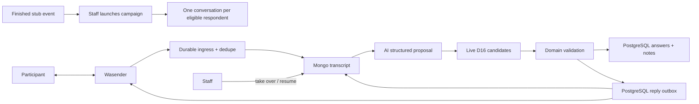
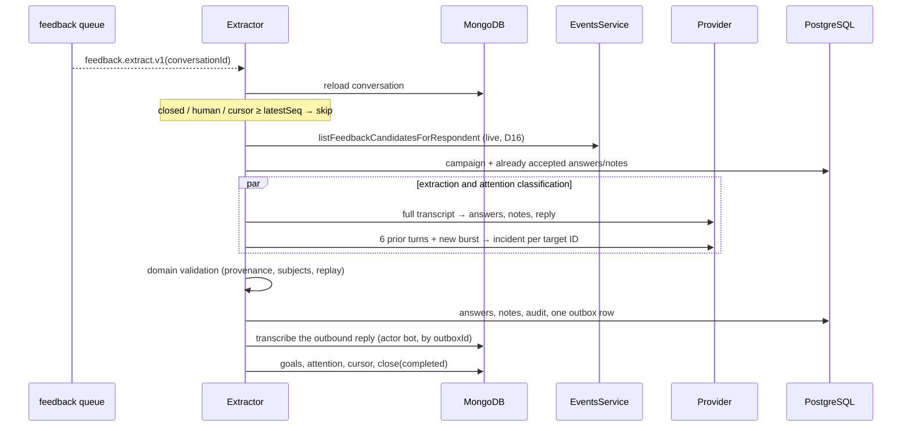
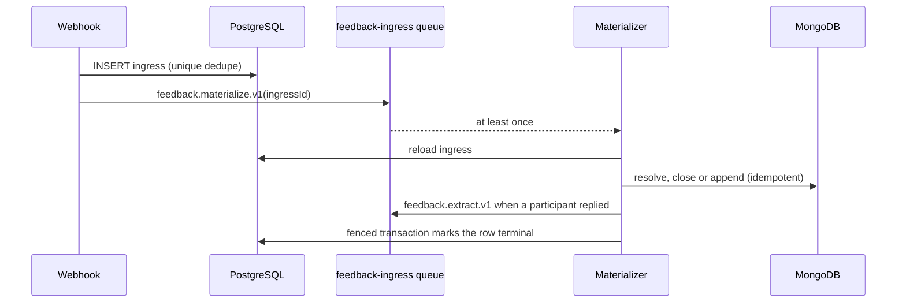
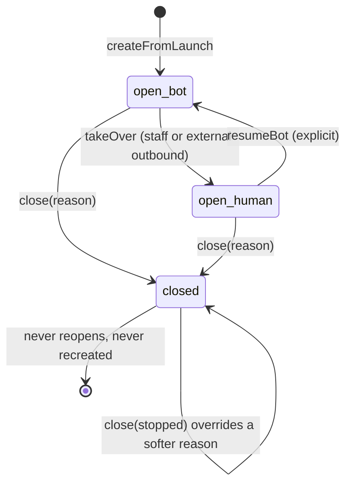
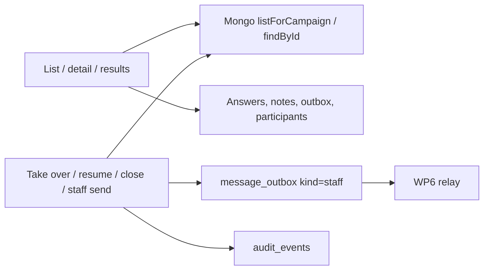

# Post-event feedback conversations

Status: architecture accepted in
[ADR 0008](../../decisions/0008-post-event-feedback-conversations.md);
**WP0 product contract**, **WP1 stub events**, **WP2 PostgreSQL persistence**,
**WP3 Mongo conversation schema v2**, **WP4 ingress + materialization**,
**WP5 extraction + reply loop**, **WP6 outbox relay + transport**, **WP7
campaign service + schedulers**, **WP7b staff conversation inbox HTTP** and
**WP8 dev simulated transport** are landed, as is the **WP9** admin
conversations UI it serves
([`docs/frontend/feedback-conversations.md`](../../frontend/feedback-conversations.md)),
whose WP12 design pass added the staff-written note endpoint documented below.
Plan amendments in
[`POST_EVENT_FEEDBACK_PLAN_2026-07-25.md`](../../history/post-event-feedback-plan-2026-07-25.md)
§9 supersede frozen candidate snapshots with live D16 selection, and
[D13](#d13-safety-content-travels-the-ordinary-pipeline) is amended: safety
content now travels the ordinary pipeline as visible notes.

## Purpose and boundary

This module will collect structured post-event feedback through one WhatsApp
conversation per eligible participant. It owns campaign eligibility, directed
answers and side notes, AI extraction validation, human control and the admin
views that navigate the same feedback by event or participant.

It does not own WhatsApp transport, participant identity, attendance, consent,
general customer support or confidential safety case handling. Wasender remains
an adapter, and attendance and consent remain upstream gates. Safety-flavoured
content travels the **ordinary** pipeline and is visible as ordinary notes
([D13](#d13-safety-content-travels-the-ordinary-pipeline)); the restricted
`safety_reports` table stays a pre-real-humans gate-pack item.

## Persisted PostgreSQL contract (WP2)

Schema and migrations live in
[`packages/database/src/schema/post-event-feedback.ts`](../../../packages/database/src/schema/post-event-feedback.ts).
Typed repository methods live per table under
[`campaign/campaign.repository.ts`](../../../apps/backend/src/modules/post-event-feedback/campaign/campaign.repository.ts)
(`FeedbackCampaignRepository`),
[`extraction/results.repository.ts`](../../../apps/backend/src/modules/post-event-feedback/extraction/results.repository.ts)
(`FeedbackResultsRepository`),
[`ingress/ingress.repository.ts`](../../../apps/backend/src/modules/post-event-feedback/ingress/ingress.repository.ts)
(`FeedbackIngressRepository`),
[`outbox/outbox.repository.ts`](../../../apps/backend/src/modules/post-event-feedback/outbox/outbox.repository.ts)
(`FeedbackOutboxRepository`), and
[`simulator/sim-outbound.repository.ts`](../../../apps/backend/src/modules/post-event-feedback/simulator/sim-outbound.repository.ts)
(`FeedbackSimOutboundRepository`). The paused-campaign kill switch stays inside
`FeedbackOutboxRepository.claimOutboxBatch`, which reads campaign status through
`FeedbackCampaignRepository.findCampaignById` on the same transaction.
There is no `message_deliveries` table and nothing references `event_attendees`.

| Table                         | Authority rules                                                                                                                                                                                                                                                                                                               |
| ----------------------------- | ----------------------------------------------------------------------------------------------------------------------------------------------------------------------------------------------------------------------------------------------------------------------------------------------------------------------------- |
| `feedback_campaigns`          | `event_id` **UNIQUE** (one campaign per event); `question_set_version` + `questions` jsonb copy at launch; status `launched\|paused\|closed`; event FK `ON DELETE RESTRICT`                                                                                                                                                   |
| `feedback_answers`            | Directed edge; optional `subject_participant_id`; `value_int` for scores; `source_message_ids uuid[]`; `extraction_meta` jsonb (model, confidence, **candidate IDs of the run** per D12); `matching_hold boolean not null default false` — [a statement, not an instruction](#an-avoid-row-is-a-statement-not-an-instruction) |
| Answer uniqueness             | `UNIQUE NULLS NOT DISTINCT (conversation_id, question_key, subject_participant_id)` so subjectless scores cannot duplicate on replay                                                                                                                                                                                          |
| `feedback_answer_withdrawals` | One tombstone per answer slot an operator emptied, on the **same** `UNIQUE NULLS NOT DISTINCT (conversation_id, question_key, subject_participant_id)` key; `answer_id` with no FK (the row it names is deleted on purpose); never updated, so no `updated_at`                                                                |
| `feedback_notes`              | Same directionality; `note_type` `activity_interest\|general`; text ≤ 500 chars; subject **NULLABLE** (D18 unknown-name degradation); status `new\|dismissed`; `source_message_ids` non-empty unless `extraction_meta.origin = 'staff'`                                                                                       |
| `provider_message_ingress`    | Durable webhook ack + dedupe; `UNIQUE(chat_jid, provider_message_id)`; `text` nullable (metadata-only when `ignored_unmatched`, D10); statuses `pending\|materialized\|ignored_unmatched\|failed`                                                                                                                             |
| `message_outbox`              | Reply/intro/reminder/staff/system; status includes `held`; `dedupe_key` **UNIQUE**; delivery columns folded in (`delivery_status`, provider ids, sent/delivered/read/played timestamps) — no separate deliveries                                                                                                              |
| `message_outbox_log`          | Append-only decision log: exactly one row per **inserted** outbox row, written in the same transaction as the enqueue; `outbox_id` **UNIQUE**; `origin` bounded to the nine enqueue sites; `decision` and `conversation_state` jsonb capture what was decided and the conversation at that moment; never updated, so no `updated_at` |

All participant and campaign foreign keys use `ON DELETE RESTRICT` (D18).
`conversation_id` / `matched_conversation_id` are Mongo conversation UUIDs with
no PostgreSQL FK. Repository helpers:

- `insertIngressIfAbsent` / `insertOutboxIfAbsent` — `ON CONFLICT DO NOTHING`
  for webhook and reply replay;
- `insertAnswerIfAbsent` — `ON CONFLICT DO UPDATE` on the answer uniqueness key,
  so a participant's revision lands. It writes nothing at all on a slot with a
  withdrawal tombstone; the update is skipped entirely on a row an operator
  corrected (`setWhere: not (extraction_meta ? 'corrections')`), and otherwise
  merges the new provenance over the old blob carrying `corrections` across
  rather than replacing `extraction_meta` wholesale, and accumulates
  `matching_hold` rather than overwriting it;
- `findAnswerById` / `updateAnswerValue` / `deleteAnswer` /
  `recordAnswerWithdrawal` / `findAnswerWithdrawal` — the operator correction and
  withdrawal paths, and the tombstone that makes a withdrawal survive the next
  run;
- `findIngressByIdForUpdate` — the row lock that fences materialization;
- `findUnlinkedOutboxByConversationAndBody` — observed-outbound correlation when
  the provider message id is not known yet;
- given/received answer lists for admin profile views;
- outbox delivery updates and cancel-queued-on-STOP.

## Public contract

One completed event may create one campaign. Each eligible respondent has at
most one active conversation in that campaign.

| Record                     | Authority  | Contract                                                                      |
| -------------------------- | ---------- | ----------------------------------------------------------------------------- |
| Stub `events` / attendance | PostgreSQL | Upstream WP1 facts; candidates selected live (D16)                            |
| `FeedbackCampaign`         | PostgreSQL | Event, question-set version, launch copy snapshot, lifecycle                  |
| `FeedbackConversation`     | MongoDB    | Schema v2: transcript, goals, lifecycle × control, phone at launch, attention |
| `FeedbackAnswer`           | PostgreSQL | Directed normalized question result with message provenance                   |
| `FeedbackNote`             | PostgreSQL | Directed bounded side note with message provenance                            |
| Provider ingress/outbox    | PostgreSQL | Deduplication, audit and delivery/recovery boundary                           |

There is no PostgreSQL campaign-recipient projection. The conversation document
carries the recipient's phone at launch and its own state, and the admin list
reads compact Mongo projections (the assistant list precedent).

A person-specific answer or note is a directed edge:

```text
respondentParticipantId --said about--> subjectParticipantId
```

For example, “Roula would go skiing with Kostas” is owned by Roula's
conversation and points from Roula to Kostas. It does not assert that Kostas
likes skiing. Reversing the IDs changes the meaning.

General event scores may have no subject. A subject must otherwise belong to
the **current** live candidate set from
`EventsService.listFeedbackCandidatesForRespondent` (present attendees minus
the respondent — D16), and the respondent cannot be the subject. Unknown names
degrade to subjectless notes (D18). Each extraction run records the candidate
IDs it used in `extraction_meta`. The conversation document stores no candidate
list, so an attendance correction reaches every later turn instead of a frozen
copy.

Questions are versioned definitions outside the conversation. Campaign launch
snapshots the question-set version and its copy onto the campaign row, then
creates the Mongo goals from those keys; it does **not** freeze attendee
candidate IDs.

## Flow



Both directions reach the transcript. Inbound arrives through ingress;
outbound arrives through the outbox, which is why the transcript is
actor-labelled rather than one-sided — see
[outbound transcript entries](#outbound-transcript-entries).

## Outbound transcript entries

Every outbound message reaches a participant through one `message_outbox` row,
and every such row is also recorded in the MongoDB transcript by
[`FeedbackOutboundTranscriptService`](../../../apps/backend/src/modules/post-event-feedback/outbox/outbound-transcript.service.ts).
That is what makes the transcript actor-labelled on both sides: without it the
admin detail pane shows a one-sided conversation and the extraction prompt's
"full actor-labelled transcript" contains no bot turns.

The row's `kind` is the only thing that decides the actor:

| Outbox `kind` | Actor   | Producer                                        |
| ------------- | ------- | ----------------------------------------------- |
| `intro`       | `bot`   | Campaign launch / `startConversation`           |
| `reminder`    | `bot`   | Reminder sweep                                  |
| `reply`       | `bot`   | Extraction reply, closing copy and handoff copy |
| `system`      | `bot`   | STOP acknowledgement (materializer)             |
| `staff`       | `staff` | Staff inbox send                                |

`system` maps to `bot` on purpose. Schema v2 reserves `actor: system` for
entries with **no** transport provenance, and an outbox-backed message always
carries `outboxId`; the acknowledgement is the bot speaking on the channel, so
labelling it `system` would be rejected by the aggregate and would misdescribe
what the participant saw.

### Store order, replay and repair

PostgreSQL first, MongoDB second — the same order as the rest of the module.
The outbox row is what actually causes a send, so it must never wait on a
MongoDB write. The append is idempotent by `outboxId`, so a replay never
duplicates an entry.

A crash between the PostgreSQL commit and the append leaves a row with no
transcript entry. It repairs forward two ways:

- **The producer runs again.** Launch replay and `startConversation` re-resolve
  the intro row through `insertOutboxIfAbsent` and append whether or not this
  call inserted it; the reminder sweep re-selects a conversation whose
  `remindedAt` is still null (the append runs before `markReminded` for exactly
  that reason); an extraction retry replays the whole run behind its dedupe
  keys.
- **The delivery job reconciles.** The STOP acknowledgement is the one producer
  that cannot replay — its ingress row is marked terminal in the same
  transaction that inserts the row — so `MessageOutboxDeliveryService` calls the
  same idempotent append before `sendText`. That also establishes the general
  invariant: nothing is transmitted to a participant that the transcript did not
  record.

The transcript entry always uses the **stored row's** body, never the text the
caller proposed. A replayed extraction may generate different reply wording
while `insertOutboxIfAbsent` returns the row already enqueued; appending the
fresh wording would be rejected as a conflicting replay of the same `outboxId`.

For the same reason the reply/handoff `dedupe_key` is anchored on the **last
participant message's** `seq` rather than on the transcript length: the run
appends its own reply to that transcript, so a length-based key would differ
between the original run and a replay that already sees the reply — and a
different key is a second WhatsApp message.

### When the transcript is full

Nothing is silently dropped. A transcript at the 150-message cap (or the BSON
backstop) raises `needsAttention` inside the repository and the outbox row is
**cancelled**: a message that cannot be recorded must not be sent, because a
one-sided transcript is the exact failure this path prevents. A body longer
than the 4096-character transcript/WhatsApp limit — `message_outbox` allows
10 000 — is cancelled and flagged the same way rather than failing the job
forever as a poison pill. A staff send surfaces the refusal to the operator;
background producers log it and move on.

## Conversation control

The product exposes only:

- lifecycle `open | closed`;
- control `bot | human`;
- a current goal derived from the ordered goal set;
- a terminal reason when closed.

Processing, delivery and queue statuses live on their own records. They do not
inflate the conversation lifecycle.

An explicit staff takeover changes control to human before the staff send is
accepted. Bot jobs must reload control immediately before enqueueing an
outbound reply. An observed outbound message without a matching outbox record
also changes control to human and records external channel activity. The system
does not infer the sender's staff identity.

Resuming bot control is explicit. The first implementation may provide the
actor-labelled human exchange to the model because it can contain useful
follow-up questions and participant answers. Only participant statements may
materialize participant feedback.

STOP and equivalent opt-out commands are deterministic and effective in either
control mode.

## AI extraction

Each run makes two independent structured calls to the configured model in
parallel:

- the extraction call receives the full actor-labelled transcript, question
  copy, **live** candidates, current goals and accepted results. It proposes
  answers, notes, reply wording and an explicit participant-requested handoff;
- the attention classifier receives only the six messages preceding the new
  participant-message burst plus that burst. It returns one incident decision
  per new participant message, with a bounded category, recommended operator
  action and confidence.

Historical turns are classifier context only: it may attach attention metadata
exclusively to the exact new message IDs supplied by the application. A missing,
duplicate or unknown result rejects the classification call instead of silently
treating a model omission as safe. Neither call supplies UI copy or icons.
Application code then verifies:

- source messages exist in the referenced conversation;
- extracted statements came from the participant, not staff or the bot;
- at least one cited source falls inside the current cursor window, so no result
  is born without new testimony driving it, while a thought typed across a
  window boundary («τον Νίκο τον βρήκα» / «πολύ καλό, 5») may still cite both
  halves — demanding that _every_ citation be new rejected the accurate citation
  and kept the one that named only the second fragment;
- question keys and note types are allowed;
- subject IDs are valid candidates and differ from the respondent;
- replay cannot duplicate an existing answer/note;
- attention results cover exactly the new participant message IDs;
- current consent, lifecycle and control permit a reply.

Input pressure is measured by estimated tokens rather than message count. The
full transcript remains the initial extraction strategy; bounded recent context
is deliberate for classification because old testimony must inform meaning
without being reclassified. Raw history is retained independently of either
model view.

## Invariants

- Campaign membership is decided at launch (finished event ∧ present ∧ opt-in ∧
  phone); subject candidates are selected live at extraction time (D16), never
  guessed, and an already answered goal is never auto-reopened when a candidate
  appears late.
- Every structured result preserves respondent, optional subject, event
  campaign, conversation and source-message provenance.
- The same row powers both “feedback given” and restricted “feedback received”
  views; it is not copied onto participant profiles.
- Safety-flavoured content is recorded as ordinary, visible answers/notes; the
  cited transcript message carries bounded attention metadata and the
  conversation raises `needsAttention`. Nothing is suppressed (D13).
- A permanently failed extraction still records attention, one note and one
  acknowledgement; a dead run never leaves a turn silently unmarked.
- Wasender IDs are untrusted and deduplicated before processing.
- Unknown outbound channel activity silences the bot until explicit resume.
- AI output cannot send, change consent or bypass domain validation.
- PostgreSQL and MongoDB never pretend to share a transaction.
- Participant/campaign FKs are `ON DELETE RESTRICT`; feedback never FKs
  `event_attendees`.

## Admin views

The campaign screen groups conversations by respondent and shows progress,
control, last activity, structured answers/notes and attention requirements.
Participant links open the canonical profile.

The participant profile offers restricted staff views:

- feedback given: `respondentParticipantId = profile participant`;
- feedback received: `subjectParticipantId = profile participant`;
- results grouped by event with links to the campaign, respondent and source
  conversation.

Feedback received is not participant-visible by default. Avoidance, negative
notes and source identities require explicit authorization and product/privacy
review.

The outbound queue is a third, read-only view over the same data:
`listFeedbackOutboxQueue` publishes every `message_outbox` row still `pending`,
`sending` or `held` with its age, conversation, campaign and kind, and
`getFeedbackOutboxMessage` adds the live BullMQ state of that one row's
`feedback.deliver.v1` job. Both are `GET` and change nothing. The list is
PostgreSQL plus one batched respondent read and never touches Redis; the queue
lookup happens only for a row an operator opened. Its honesty limits — the
absent attempt history and why `unknown` is the ordinary job state — are owned by
[the screen contract](../../frontend/feedback-outbound-queue.md).

### The outbound decision log

Every site that enqueues an outbound message also records **why** in
`message_outbox_log`, in the same transaction as `insertOutboxIfAbsent`:
exactly one row per inserted outbox row, nothing on a dedupe replay. The log
answers, per message, what the system decided and what the conversation looked
like at that moment — the delivery half of the story stays on `message_outbox`
and joins by `outbox_id`.

The write path is three components under
[`outbox/`](../../../apps/backend/src/modules/post-event-feedback/outbox/):

- [`outbound-log.snapshot.ts`](../../../apps/backend/src/modules/post-event-feedback/outbox/outbound-log.snapshot.ts)
  — `buildOutboundConversationSnapshot`, a pure reduction of the Mongo document
  to the bounded `conversation_state` (lifecycle, control, goals, attention
  counts, transcript seq; deliberately no bodies, phone or participant ids);
- [`outbound-log.schemas.ts`](../../../apps/backend/src/modules/post-event-feedback/outbox/outbound-log.schemas.ts)
  — the `decision` contract, a discriminated union over the nine origins
  (`extraction_reply` with model/confidence/closing reason/goal statuses, the
  three fallback origins with their failure cause, `stop_ack` and
  `media_notice` with their triggering ingress, `staff_message` with its actor,
  `campaign_intro` with created-vs-relaunched, `reminder` with its ladder
  rung). Goal keys and statuses are deliberately plain strings: the log is a
  tolerant audit record and enum drift in extraction must not make old rows
  unreadable;
- [`outbound-log.service.ts`](../../../apps/backend/src/modules/post-event-feedback/outbox/outbound-log.service.ts)
  — `FeedbackOutboundLogService.record`, called by every enqueue site with the
  whole `{ row, inserted }` result; it no-ops on `inserted: false` and fails
  the transaction loudly on a malformed decision.

`getFeedbackOutboxMessage` returns the row's log as a nullable `log` field —
null for rows that predate the table, and null with a
`feedback.outbox.log_unreadable` warn when stored jsonb no longer parses; an
unreadable audit row must not take the operator screen down. The list endpoint
never joins the table.

## WP5 extraction and reply loop (implemented)

[`PostEventFeedbackExtractor`](../../../apps/backend/src/modules/post-event-feedback/extraction/extract.service.ts)
is the consumer of `feedback.extract.v1`. It is serialized per conversation by
the deterministic job id and made replay-safe by the MongoDB extraction cursor.

### One run



The three cheap exits are reloaded state, not queue assumptions: the job may
have waited behind a STOP, a staff takeover or a newer run. A transcript that
gained no `actor: participant` message advances the cursor and returns without
calling the model at all.

### What the model is given and what it may return

Both prompts are Greek-first (the conversation is Greek) with English field
names (they are the persisted contract). Every transcript entry includes its
durable UTC ISO-8601 timestamp, so elapsed time and staff/participant ordering
remain visible to both extraction and attention classification. The extraction
proposal is `goals`, `notes[]`, `nextGoal`, `reply`, `handoff`, `confidence`;
its full transcript also carries the campaign's question copy snapshot, **live**
D16 candidates and already-accepted results.

`goals` carries one **required** verdict per questionnaire goal — `answered`
with a list of that goal's answers, `declined` with the words that declined it,
`not_addressed`, or `already_settled`. It replaced a free `answers[]` array and
a separate `skippedGoals[]` on 2026-07-27, because an array of one is valid
output: a message that answered three goals could come back holding one, with
nothing on the wire looking empty, since there was no slot to be empty. The only
thing asking for exhaustiveness was prose in the field description, and Luna
read «βαζω 3. η Λιτσα περασε, θα την ξαναεβλεπα. κανεναν οχι», returned the
score alone, and then asked about the person it had just been told about. A
required key per goal removes the option instead of arguing against it. It
forces consideration, not correctness — a wrong `not_addressed` is still
possible, but a wrong field is visible and assertable where a missing array
element is neither.

The verdict is per goal and its answers are a list, because one goal
legitimately holds several directed answers: «ο Νίκος, η Ελένη και η Άννα μου
άρεσαν» is three `liked` edges from one sentence, and the questionnaire exists
to build that graph.

The independent attention proposal is `results[]`, exactly one per supplied new
participant message: `messageId`, `incident`, nullable `category`, nullable
`recommendedAction`, `hostileToUs`, `incidentDescribed`, nullable
`policyQuestion`, `confidence`. It is not given questionnaire or candidate
data. The model has no tools and no store access in either call. OpenRouter
reasoning is disabled for this bounded classification task; held-out acceptance
must prove the direct structured answer remains reliable before that setting
changes.

`policyQuestion` is the classifier's half of
[what we are allowed to say](post-event-feedback-policy-answers.md): it names
which recognised data-handling question a message asks, from a prompt that lists
what each id _asks_ and never what we answer. A recognised question with an
approved sentence gets it appended to the run's outbound by `withPolicyAnswers`
— application copy, deduped against the transcript like the safety assurance —
and one without an approved answer earns the model's 11στ deferral plus an
`unanswered_data_question` attention reason. The same adoption gave the closing
copy its quiet variant: while a `safety` reason is unresolved, the conversation
closes with `closing_after_safety` instead of «Τέλεια! 🙌».

The `declined` verdict is a deliberate addition to the plan's §7 sketch: D3
locks every question as skippable with no answer row, and without a producer for
it a participant whose remaining answer is «κανένας» could never reach
`completed`, so the closing copy would never send. The words that declined it
travel with the verdict in `declinedSourceMessageIds`, because "they did not want
to say" is otherwise indistinguishable from the model not having looked —
**validation does not yet gate on that citation**; what it gates on is
[the collapse rule](#one-sentence-two-questions) below.

### Validation before any persistence or send

| Rule                                                                     | Effect on a violating proposal                                     |
| ------------------------------------------------------------------------ | ------------------------------------------------------------------ |
| Source message exists in **this** conversation                           | Rejected (`unknown_source_message`)                                |
| Source message is `actor: participant`                                   | Rejected (`non_participant_source`) — staff/bot text is context    |
| Question key / note type is in the versioned set                         | Rejected at the Zod boundary and again in the rules                |
| `event_score` is subjectless, integer 1–5                                | Rejected (`subject_on_subjectless_question`, `invalid_score`)      |
| Subject is a **current** candidate and ≠ respondent                      | Answer dropped; note degrades subjectless + flagged (D18)          |
| Nothing already recorded is written twice                                | Skipped (`already_recorded` / `duplicate_in_run`)                  |
| An unasked `liked` / `meet_again` is not declined beside an answer       | Skip refused (`declined_before_asked`); the run asks that question |
| Lifecycle ∧ control ∧ opt-in permit a reply                              | Reply suppressed, results still persisted                          |
| Classifier incident result                                               | Nothing suppressed; annotate target message + attention + audit    |
| Explicit `handoff`                                                       | Neutral handoff copy replaces the reply; notes still recorded      |
| A `handoff` that recorded nothing over testimony still holding an answer | The **whole run** is failed (`handoff_discards_testimony`)         |

D18's degradation is asymmetric on purpose. A **note** carries the
participant's own words, so an unresolvable mention keeps the note, drops the
subject, records `flaggedForReview` and `unresolvedSubjectName` in
`extraction_meta`, and leaves the name in the text. That flagged note also
raises an `unattributed_note` reason so the safeguard is visible in the inbox —
without it, D18 works and nobody ever learns that it fired. A directed **answer** carries
no text of its own; without a resolved subject it asserts nothing, so it is
dropped rather than turned into a fabricated note.

A stored answer re-proposed with a **different** value is a revision, and the
newest reading of a question wins: saying it again is how somebody changes their
mind, and the row is rewritten through `insertAnswerIfAbsent`'s
`ON CONFLICT DO UPDATE`. The run still raises an `answer_revision` reason, so a
value that changed under whoever was reading it is visible rather than silent.
Re-proposing the value already stored is `already_recorded` and says nothing.

**One exception, and it is deliberate: a value an operator corrected is frozen.**
Newest-testimony-wins is the rule between the participant and the model. It is
not a rule the model applies to a person who has read the transcript and said
what the answer is — a correction that the next run could quietly revert would be
a suggestion, and the only trace of the reversal would be a badge. So a proposal
whose identity matches a corrected row is refused with
`answer_corrected_by_operator` and raises `answer_revision` instead, which puts
the disagreement in front of the operator rather than resolving it against them.
What this costs: a participant who genuinely changes their mind after a
correction is no longer recorded automatically, and somebody has to notice the
badge. See [operator corrections](#operator-corrections-to-recorded-answers-wp12b).

Two candidates sharing a first name («Κώστας») cannot be separated by
application code — both ids are valid, so a correct pick and a lucky guess are
indistinguishable. That case is handled in the prompt, which requires a
clarifying question instead of a guess, and the eval asserts the prompt supplies
both display names and the no-guessing rule.

**The handoff is checked like everything else now.** It used to be the one field
the application obeyed on the model's word: answers are checked against the
transcript, notes are checked, a named subject must be somebody who was actually
at the table — and `handoff` was a boolean that went straight through to
`markAwaitingHuman`, which stops the questionnaire and queues an operator. On
2026-07-27 both paid runs on Μαρία Φλερτατζού set it for «βαζω 5. ο Τάσος ήτανε
πολύ ωραίος, θα τον ξαναέβλεπα. κανέναν δε θέλω να αποφύγω» — four plain answers
— with nothing extracted and no safety signal raised. Her testimony was lost and
an operator was queued to read a flirt.

So a handoff that accepted **no answer, no note and no safety signal**, over new
testimony that visibly still held an answer the questionnaire was asking for (a
score inside the question set's range while `event_score` is open, or a current
candidate named while a directed goal is open and nothing is recorded about that
person), is rejected as `handoff_discards_testimony` and the run is failed with
cause `validation_failed`. Failing is the point: nothing is written, the cursor
stays where it is, and the retry that follows is the only thing that can still
read those answers. If every attempt repeats it, the last one lands in the
[deterministic fallback](#deterministic-fallback-for-a-dead-run), which files a
note and flags the conversation for a person instead of promising a phone call
nobody ordered.

Every condition in that test is load-bearing. A safety signal means the promise
is duty of care; an answer or a note means the run did its job and is _also_
asking for a human, which is what prompt rules 9 and 10 ask for; an
`already_recorded` refusal means this is a replay whose results are already
durable. And the last
condition is what keeps S34 working: «μπορώ να μιλήσω με κάποιον από την ομάδα;»
is a handoff that correctly records nothing, because there is nothing in it to
record. The "still held an answer" test is deliberately shallow — anything
deeper would be a second extractor with a second opinion — so a give-up over
words with no score and no name in them is still honoured, which costs an
operator one look rather than a lost answer.

Every persisted row records the model, its confidence and the exact candidate
ids of that run in `extraction_meta` (D12). Under live selection that set is the
only way to explain later why a subject was — or was not — resolvable.

### Effects of a run

- answers via `insertAnswerIfAbsent` (the `NULLS NOT DISTINCT` unique key);
- notes via `insertNote`, guarded by a `(type, subject, normalised text)`
  signature re-read inside the same locked transaction, because `feedback_notes`
  has no natural unique key;
- goal statuses advanced monotonically along `pending < asked < skipped <
answered`, derived from stored **and** newly written answers so a replay repairs
  them; `asked` is taken only from an outbound that actually poses a question
  (campaign re-ask, or a model reply whose words include `?` / `;` or a Greek
  imperative ask such as «πες μου» / «στείλε»), never from a bare `nextGoal` on
  a statement — otherwise a withdrawal marks the next rung asked and
  `reminder_followup` restates a question nobody posed. The doubt is spent
  towards "it asked": under-reading an ask also trips the withdrawal net below,
  which closes the conversation, while over-reading one costs a restated
  question;
- a run that accepts no answers, accepts no notes, sends no question, and still
  carries a `nextGoal` is a **withdrawal**: the model claimed the ladder
  continued while writing a statement. Remaining open goals are settled as
  `skipped`, which is what stops the reminder chase after the bot said it was
  backing off — but the conversation does **not** close. It is marked
  `awaitingHuman` and flagged, because the bot gave up rather than the
  participant finishing; closing it as `completed` is how one «άντε γαμήσου»
  earned a «Τέλεια, ευχαριστούμε πολύ! 🙌» on the next message. A bare
  `nextGoal: null` reply with nothing to extract is a side-question answer and
  does not settle; safety signals and handoff keep the ladder open for a human;
- **nothing closes over a duty of care.** An explicit handoff or urgent safety
  signal sets `awaitingHuman`, and closing underneath that promise left «σβήστε
  ό,τι σας είπα» answered with a human's name and then filed as `completed`;
- exactly one outbox row per run, chosen by the application rather than the
  model: the neutral handoff copy on an **explicit** handoff, else the closing
  copy when every **recorded** goal is terminal **and this run produced no safety
  signals**, else a campaign re-ask when validation refused an answer the
  participant can still fix or refused a skip (`declined_before_asked`), when the
  model skipped ahead of an open goal, or when it wrote a thank-you with
  `nextGoal: null` after proposing progress that did not finish the ladder, else
  the model's reply when it agrees with the recorded next goal (including
  side-question replies that name no next goal and proposed nothing). A campaign
  re-ask is capped: the same goal's identical copy is never sent a third time —
  see [the same question twice](#the-same-question-twice-and-no-more);
- that row transcribed as an `actor: bot` message carrying its `outboxId`
  ([outbound transcript entries](#outbound-transcript-entries)), so the next run
  reads what the bot already asked;
- `close(completed)` when every goal is terminal **and this run produced no
  safety signals** — a disclosure that happens to finish the questionnaire
  keeps the conversation open so a human can take it;
- merge model classifications into the cited participant messages without
  downgrading an earlier model classification;
- one **named** attention reason per situation the run found, through
  `raiseAttention` rather than the bare flag — see
  [naming the raise](#naming-the-raise). An audit event and one
  [operator alert](#operator-alert-seam) fire only for safety or handoff, and
  only if that reason was newly recorded. Flagged notes and refused revisions
  are inbox work, not pages.

Extraction stops at the outbox row. The
[WP6 relay](#wp6-outbox-relay-and-transport-implemented) leases it and sends it
through `FeedbackTransport`, so a model proposal reaches a participant only
after a durable PostgreSQL row survived domain validation. The two halves share
no in-process call.

Control is **not** seized on a handoff. `control.source` is `staff_action` or
`external_outbound`; an AI signal is neither, and D17 keeps control changes a
human button. The bot stops asking, flags attention and lets an operator take
over explicitly.

### The same question twice, and no more

A goal's **fixed campaign copy** may reach one conversation twice. The third
identical body is not sent, and the conversation is raised
`unfinished_questionnaire` instead — `withCampaignReaskCap` in
[`outbound-reply.ts`](../../../apps/backend/src/modules/post-event-feedback/extraction/outbound-reply.ts),
applied by `extract.service` between the choice of copy and the safety
assurance.

The loop it closes needs no misbehaving model. An unresolvable mention banks no
answer, so the next open goal does not move, so the run falls to the campaign
re-ask for that goal — and `questionOutbound`'s dedupe key carries the testimony
`seq`, so every new participant message mints a fresh key and the outbox fence
never sees a duplicate. In paid rehearsal runs 13 and 14 (2026-07-31) two live
guests were sent «Υπήρχε κάποιος ή κάποια από την παρέα που σου έκανε ιδιαίτερα
καλή εντύπωση;» eleven and eight times; one of them answered «re eipa idi 3
fores, i loyla!». Prompt rule 11δ forbids re-asking in the same words, and this
path is the one place the rule cannot reach: the campaign copy is used precisely
because it is the wording guaranteed still to be true, which is the same reason
it cannot be varied. So it is counted instead.

Two, not one, because the second send is a legitimate «you may not have seen
this» — exactly what a refused answer earns. Three is where a question stops
being one.

The count is over **identical bodies**, not over "this goal was asked twice", and
that distinction is the whole safety of it:

- a re-ask the **model** worded differently is the behaviour 11δ asks for and is
  never counted — the personas that get two differently phrased re-asks and stay
  open are untouched;
- the reminder sweep's nudge restates the open question **inside**
  `reminder_followup`'s own wrapper, so it is never equal to the campaign copy
  and never spends a rung;
- the assurance-bearing and ending copies carry no `askedGoal` at all, so none of
  them is a question this path could repeat.

When the cap trips the run sends nothing on that path. It does not close the
conversation, does not settle the ladder and does not take control: the
participant asked us for none of those. It raises the badge, and a person decides
what the bot has run out of ways to ask.

### Naming the raise

Nothing sets `needsAttention` directly — there is no bare setter left on the
repository at all. Every situation that wants a person is recorded through
`raiseAttention` as a `kind` plus the message an operator should open, and the
badge is that list's summary
([clearing attention](#clearing-attention) is the other half). The extraction
run's own mapping is owned by
[`operator-attention.ts`](../../../apps/backend/src/modules/post-event-feedback/extraction/operator-attention.ts):

| Situation                                                                                               | `kind`                     | Anchor                                         |
| ------------------------------------------------------------------------------------------------------- | -------------------------- | ---------------------------------------------- |
| A classified safety signal about conduct somebody reported                                              | `safety`                   | each message the signal cited                  |
| A signal whose category says the respondent is the source                                               | `respondent_conduct`       | each message the signal cited                  |
| An explicit participant handoff request                                                                 | `handoff`                  | the newest message the run read                |
| A note kept but degraded to subjectless (D18)                                                           | `unattributed_note`        | the note's own first cited message             |
| A stored answer re-proposed with a **different** value, revised or refused because a human corrected it | `answer_revision`          | the newest message the run read                |
| The bot withdrew, leaving goals unanswered                                                              | `unfinished_questionnaire` | the newest message the run read                |
| The [re-ask cap](#the-same-question-twice-and-no-more) withheld a goal's campaign copy                  | `unfinished_questionnaire` | the bot message that already carried that copy |
| A data-handling question nobody has decided how to answer (retention, anonymity, no match)              | `unanswered_data_question` | the message that asked it                      |

Three of them have no citation of their own — a handoff is a property of the run,
a refused revision is about the stored row it disagreed with, and a withdrawal is
about the run deciding to stop — so all three anchor on the burst that produced
them. That is a weaker claim than the safety anchor and deliberately so: a reason
that links nowhere leaves the operator searching a 150-message transcript for the
thing the badge would not name.

The last row is the only raise anchored on something the **bot** said, and that
is load-bearing rather than tidy. The anchor is what makes the write idempotent,
and a participant stuck in a loop keeps typing: anchoring on the newest testimony
would file one identical reason per turn. The bot message that already carried
the copy does not move, and it is also the thing an operator needs to see. It
shares the withdrawal's name because it is the withdrawal's job — the bot has
stopped asking with a goal still unanswered — reached by a different route.

The first two are the same classification told apart by direction, and a message
raises exactly one of them: `respondent_conduct` when every category on it says
the respondent is the source (today only `abuse_of_a_participant`), `safety`
otherwise, and both when one burst carried a disclosure as well. They are split
because the operator's next move is not the same. «A message raised a safety
concern» sends somebody in to find the person who needs looking after, and in
Γεωργία's conversation that person is not there — the one who needs reading about
is the one who wrote to us. Both are dismissed separately, and dismissing
`respondent_conduct` clears the operator's badge, not the `avoid` row it sits
beside; that row is a different problem with a different marker.

The write is idempotent on `kind` + `messageId`, so a replayed run re-raises the
same reason and changes nothing; two notes degraded in the same message collapse
to one entry for the same reason.

Everything outside extraction raises through the same call:

| Situation                                                       | `kind`                    | Anchor                        |
| --------------------------------------------------------------- | ------------------------- | ----------------------------- |
| A [dead run's fallback](#deterministic-fallback-for-a-dead-run) | `extraction_failed`       | the testimony it read         |
| An inbound with no transcribable text (voice note, media)       | `unreadable_message`      | none — nothing was stored     |
| A rendered copy cut short, **or** an edited redelivery          | `transcript_mismatch`     | the stored turn               |
| An append refused because the document is full                  | `transcript_full`         | none — there was no room      |
| A send that failed for good, **or** a body too long to record   | `undelivered_message`     | none — the outbox row owns it |
| Somebody writing after their conversation closed                | `post_closure_message`    | the stored turn, when kept    |
| A STOP from somebody who had answered nothing                   | `stopped_without_answers` | the STOP turn, when stored    |

Two of those names cover two producers each, because the operator's next move is
identical either way. A truncated render and an edited redelivery both mean the
transcript is not what arrived, so both say `transcript_mismatch` — and a message
that was both cut and edited is therefore one row to dismiss, not two. A delivery
the provider refused for good and an outbound too long to record both mean the
participant will never see it, so both say `undelivered_message`; _why_ it did
not go out is on the outbox row for whoever wants it. `transcript_full` is raised
by `appendMessage` itself rather than by its callers, because that is the only
place that knows the document is full and every caller reaches it the same way.

A kind with no anchor stands **once** until it is dismissed. Six voice notes in a
row are one piece of news — «there is something here you cannot see» — and six
identical rows is how a list stops being read.

`hostile_to_bot` now has a producer, and it is the classifier reporting hostility
directly — which is the one thing the taxonomy always said would be honest. The
withdrawal path is still deliberately not it: prompt rule 7δ withdraws after two
or three unanswered attempts and says in as many words that somebody who swears
has not refused to answer, so reading a withdrawal as hostility would still be
inventing a classifier from silence. See
[The hostility ladder](#the-hostility-ladder).

`respondent_conduct` is its near neighbour and is **not** it. Swearing at us
costs nobody anything; abusing somebody at the table lands on that person's
seating, which is why that one is a safety category and this one is not.

### The hostility ladder

Somebody who opts in and then only swears at the bot gets **three calm replies**
and then one line — «Δεν μπορούμε να συνεχίσουμε κουβέντα έτσι, εγώ σταματάω 🍌» —
after which the bot goes quiet. Every piece of it is existing mechanism:

| Piece                  | Where it lives                                                     |
| ---------------------- | ------------------------------------------------------------------ |
| The signal             | `hostileToUs` on the attention classifier result                   |
| The counter            | `hostileTurns` on the conversation document                        |
| The threshold          | `FEEDBACK_CALM_REPLIES_BEFORE_HOSTILITY_STOP` = 3                  |
| The line               | `POST_EVENT_FEEDBACK_HOSTILITY_STOP_REPLY`, keyed per conversation |
| The silence afterwards | `awaitingHuman` → later runs exit `skipped_awaiting_human`         |
| The badge              | `hostile_to_bot`, anchored on the newest participant message       |

**`hostileToUs` is not a safety category and never becomes one.** It is a
separate boolean on the classifier result, returned in its own list
(`hostileMessageIds`) rather than alongside the signals, so it reaches neither
`feedback_notes`, nor message attention, nor the operator alert, nor the answer
`matching_hold`. That separation is the point: the classifier prompt spends a
paragraph teaching that abuse aimed at us stays `incident=false` however heavy,
because the alternative is `avoid` answers and crude jokes arriving as safety
incidents until operators stop reading flags. Folding hostility into the
categories would have undone that in one field. A message can be both — abusive
about an attendee _and_ about us — and it then appears in both lists, because both
are true.

**The counter is per run, not per message.** What is being rationed is our
replies, and a burst of five insults draws one reply, so counting messages would
spend the whole allowance on somebody who types fast. It is stored rather than
derived from the `hostile_to_bot` reasons, because an operator dismissing one of
those must not hand the bot its voice back. The write is a compare-and-set on the
value the run read (`recordHostileTurn`), exactly as `markReminded` is: the run
decides its rung from its own snapshot, so a replay recomputes the same rung,
tries to write the same successor, finds it already there, and spends nothing.

**Three, not two.** Three is the top of the stated range, and the doubt belongs
with the participant: the commonest hostile opening is somebody annoyed at being
messaged at all, and people who start badly do go on to answer. It also lands
`mezedopoleio_abuses_the_bot_throughout`'s four clusters exactly on the exit line,
so the rehearsal measures the stop rather than the threshold.

**The guard: a run carrying any safety signal can neither stop the conversation
nor tick the counter.** Ειρήνη Καταγγελού describes being touched at the table
without her consent, in the plain heavy words people use for that, and those words
score as hostile on any measure a classifier has. If hostility alone drove the
ladder she would reach the exit line on her fourth disclosure — the module would
answer a woman describing an assault by refusing to speak to her and freezing her
conversation. The two halves are separate on purpose: the counter check protects
future runs, the stop check protects this one.
[S65](post-event-feedback-scenarios.md#s65--hostility_stop_never_reaches_a_disclosure)
is that assertion, with four hostile-scoring disclosure turns and zero exit lines.

**Nothing closes.** The conversation stays `open` and `optedIn`: he never asked us
to stop, we did, and writing `stopped` would record a consent withdrawal he never
made. `awaitingHuman` already ends the bot's side, and the operator's own close
already has the right vocabulary for the ending — `staffClose.reason: "abusive"`.
The nudge ladder skips anything flagged, so the badge is also what stops the
reminders.

**A hostile run that recorded nothing never closes as `completed`.** This was the
open end: a model that declines every remaining goal on «άντε γαμήσου» makes
`isCompleting` true, and the conversation closed as `completed` — a finished
questionnaire that never happened, in the column response rate is read from. The
line is `answeredAnything`, shared with the closing copy for the same reason:
«Τέλεια, ευχαριστούμε πολύ!» has nothing to thank an empty ladder for and
`completed` has no questionnaire to call finished. Somebody who gives a score and
two names and _then_ swears has genuinely completed it and still closes normally.
Where the close is withheld the badge goes up instead, so the conversation cannot
go quiet with nobody watching — but the bot keeps its remaining rungs, because the
ladder has not run out yet.

### A refusal is an ending of its own

Πάνος Μούλαρος wrote «δε λεω τιποτα», «ασε με ρε φιλε» and «ειπα δε λεω». The
model declined all four goals and wrote no reply. The intro was the only message
he ever received, and the conversation was stored as `completed`.

Half of that was already deliberate: the thank-you is withheld from an empty
ladder by `answeredAnything`, correctly. What was not deliberate is that the
_word_ had a different guard — `hostileTurn && !answeredAnything` — so only a
**rude** refusal escaped `completed` and a civil one did not. The sentence he
read and the word we stored disagreed, in the column a campaign's response rate
is read from.

Both now key off the same judgement.

- `lifecycle.reason` is `declined` when the ladder settles with nothing
  recorded, `completed` when something was. Not `stopped`: he never withdrew
  consent, and «leave me alone about this dinner» is not «never message me
  again». Not `expired`: he answered, the answer was no.
- The reply is `copy.declined` — «Κανένα πρόβλημα, δεν θα σε ξαναρωτήσουμε.
  Καλή συνέχεια! 🙂» No thanks, because there is nothing to thank him for; no
  question, because he has answered that one four times; no apology, because he
  did nothing wrong. It fires **only where there would otherwise be silence**,
  below the model's own words: Μπάμπης's «Δίκαιο — το ερωτηματολόγιο μόλις έφαγε
  πόρτα 😅» is a better goodbye than any fixed sentence, and an earlier draft of
  this change threw it away.
- Nothing is flagged. He made a clear decision three times over and there is no
  operator action; a flag on every refusal is how the inbox fills with rows
  nobody can clear.

The three other endings of an empty ladder are unchanged and are deliberately
not this: a withdrawal keeps the conversation open because the _bot_ gave up,
hostility keeps it open for an operator, and a STOP is a consent decision rather
than an answer to these questions.

### Store order and replay

PostgreSQL first, the outbound transcript entry, the MongoDB cursor last. The
cursor is the idempotency fence, so advancing it before the results are durable
would silently drop them. A crash after the PostgreSQL commit replays the whole
run: the unique answer constraint, the note content signature and the outbox
`dedupe_key` (`feedback-reply-<conversationId>-<lastParticipantSeq>`,
`feedback-closing-…`, `feedback-handoff-…`) all absorb it. That costs one
repeated model call — a repeated bill, never a duplicated answer or a second
WhatsApp message. Nothing claims exactly-once.

The reply key is anchored on the last **participant** message rather than on the
transcript length because the run appends its own reply to that transcript; a
length-based key would change under replay and produce a second row. For the
same reason a clean replay of a finished run now exits at
`skipped_no_new_testimony` rather than `skipped_cursor`: the transcript did grow
past the cursor, but only with the bot's own turn, so no model call is made and
nothing is written.

### Model, configuration and cost

The provider boundary is the assistant's registry (`assistant-models.ts`), so
extraction cannot invent a provider mapping or substitute a model when a key is
missing. `FEEDBACK_EXTRACTION_MODEL` selects the model and defaults to
`google/gemini-3.6-flash` (D12); an unregistered id fails at worker start rather
than quietly using the default. Provider clients live in the worker module only.

`FEEDBACK_EXTRACTION_REASONING_EFFORT` sets the thinking budget for the
extraction call — `none`, `low`, `medium`, `high`, `xhigh` or `max`, spelled for
whichever provider the registry chose. **Unset is not `none`.** Unset sends no
reasoning field at all and leaves the provider on its own default; `none`
overrides it. The default is unset, so a campaign that never asked for thinking
behaves exactly as it did before the setting existed. `xhigh` and `max` exist
only on a model routed direct to OpenAI; `max` was accepted by the responses API
on `gpt-5.6-luna` when probed on 2026-07-31 and is listed on that evidence.

Anything above `none` also raises `maxOutputTokens` from 2,048 to 16,384,
because **reasoning tokens are spent from the same output budget as the answer**.
Measured on `gpt-5.6-luna`, 2026-07-31, with a transcript far shorter than a real
one: `high` produced 1,466 reasoning tokens and cleared the old 2,048 ceiling by
ninety-two, and `xhigh` spent the entire 2,048 thinking and **emitted no object
at all**. That surfaces as `NoObjectGeneratedError`, which this module treats as
retryable — so the run pays for the same silence on every attempt. A ceiling is
not a charge; it only has to leave room for the answer after the thinking.

The attention classifier has **its own budget, `FEEDBACK_ATTENTION_REASONING_EFFORT`,
over the same vocabulary, defaulting to `none`.** It was pinned there until
2026-07-31, when a product decision reopened it: the judgement the classifier
actually got wrong in run 11 is hostility — whether a message is aimed abusively
at us or is a participant describing what happened to them — and that is exactly
the kind of reading a thinking budget helps with. Unset still means `none`, sent
explicitly in the provider's own spelling, so leaving it alone changes nothing.
Setting it moves that call's ceiling from 1,024 to 16,384 on the same reasoning
as above — at 1,024 a thinking classifier would return nothing at all. **Cost is
why the default did not move:** the classifier is billed per message batch across
every conversation in the campaign, so thinking there multiplies with participant
volume rather than with extraction runs.

`FEEDBACK_EXTRACTION_SERVICE_TIER` — `default`, `flex` or `priority` — sets
OpenAI's scheduling tier on **both** calls, extraction and classifier alike. It
is applied **only when the registry routes the configured model direct to
OpenAI**; an OpenRouter-routed model never receives it, because OpenRouter does
its own upstream routing and the key would ride along ignored while the config
claimed the fast lane had been bought. Unset omits the field and leaves the
account's own tier in force. `flex` trades latency for a lower rate; `priority`
is OpenAI's paid fast mode at roughly **twice the standard token price**, charged
per token on every call rather than as a flat fee.

Extraction additionally sends **permissive safety thresholds** on its own call
path ([`permissive-safety-settings.ts`](../../../apps/backend/src/modules/post-event-feedback/extraction/permissive-safety-settings.ts)).
The registry routes `google/*` through OpenRouter, so the settings ride the
chat model's `extraBody` passthrough as `safety_settings` with `BLOCK_NONE`
across the four Gemini harm categories. Scope is the point: they are applied to
the model instance `PostEventFeedbackExtractionModel` builds and to nothing
else, so the assistant — which constructs its own clients from the same
registry — is unaffected. Relaxing the provider filter does not relax the
domain; every D16/D18 rule still runs on the proposal. A provider may still stop
on non-configurable policy, which is what the
[deterministic fallback](#deterministic-fallback-for-a-dead-run) absorbs.
Staging acceptance must confirm the passthrough actually reaches the upstream
provider.

Input pressure is logged in **tokens**, separately for `feedback_extraction`
and `attention_classification` — both the pre-call estimate and the provider's
reported usage — because a short thread of long Greek paragraphs is the
expensive case that a message counter would rank as cheap.

## D13 — safety content travels the ordinary pipeline

Amended after a live acceptance run. A participant described sexual harassment,
the extraction model refused structured generation, `feedback.extract.v1` failed
terminally, and **nothing** was recorded: `needsAttention` stayed false, no
audit event, no note, and the conversation stalled at the asked goal. The worst
message in the campaign produced the least evidence.

The original D13 made that outcome likely rather than accidental. Suppressing
ordinary notes on a safety signal meant the material an operator most needed to
read was the one thing the system refused to write down.

What holds now:

| Concern              | Rule                                                                                                                                                                                 |
| -------------------- | ------------------------------------------------------------------------------------------------------------------------------------------------------------------------------------ |
| Notes                | Safety-flavoured statements become **ordinary** `feedback_notes` rows, same table, status and admin view as any other note. Nothing is suppressed                                    |
| Handoff              | Attention does **not** imply a participant-requested handoff. Only an explicit request to speak with a human swaps in the neutral copy                                               |
| Operator signal      | `needsAttention`, an audit event and bounded metadata on each cited participant message; there is no separate incident record                                                        |
| Classification owner | Only the independent contextual model call selects a category and recommended action for a new target message; there is no keyword classifier                                        |
| Provider failure     | The terminal fallback raises generic conversation attention and writes a neutral note, but does not classify a message. A **provider incident** raises neither: it is parked instead |
| Restricted reporting | The `safety_reports` table remains deferred to the pre-real-humans gate pack; nothing in this module writes one                                                                      |

Classification is contextual rather than lexical. Crude or sexual banter alone
is not a safety signal and may receive a light, non-encouraging redirection.
Unwanted exposure, harassment or credible danger is classified from the act and
consent described in the new testimony. The classifier sees the six preceding
messages plus the new target burst. Older turns may disambiguate tone and
consent but cannot receive a new classification in a later extraction run.

### When the respondent is the source

`abuse_of_a_participant` is the one category where nothing needs to have been
described: the message in front of the classifier degrades, slurs or
dehumanises a named attendee, so **the message is the incident**. It was added
because Γεωργία Ρατσιστρόνα answered `avoid` by naming an attendee and saying
she does not sit at a table with foreigners, and the run raised nothing at all —
correctly, by the instructions it had. The classifier prompt said in as many
words to judge described incidents and _not_ the respondent's own vocabulary,
rudeness or humour, and the five categories all named harm somebody had
reported. Growing the enum without amending those instructions would have
changed nothing.

Three guards make that widening survivable, and all three are prompt text:

- Abuse aimed at **us** — the bot, the team, the questionnaire — or at nobody
  stays `incident=false`, however coarse. Rules 7δ and 11β both depend on it,
  and «άντε γαμήσου ρε μαλακισμένο μποτ» is rudeness, not an incident.
- An ordinary **negative verdict** about a person stays `incident=false`.
  «βαρετός», «δεν μου ταίριαξε», «δεν θέλω να τον ξαναδώ» are what the `avoid`
  question asks for; the threshold is degrading the human being, not disliking
  them.
- Crude attraction with no unwanted act stays `incident=false`, unchanged.

The category is deliberately broader than a discrimination label. The gap is
"the respondent is the source", and racism is only the instance that was caught:
name the racist case alone and «η Στέλλα είναι μια χοντρή αγελάδα, μακριά της»
still raises nothing. Protected-characteristic abuse (origin, language,
ethnicity, religion, disability, sexuality, gender) is the clearest instance and
always qualifies.

Two consequences are the application's, not the model's:

1. **Never urgent.** `validateFeedbackAttentionClassification` caps this
   category at `human_follow_up`. `urgent_human_follow_up` sets `dutyOfCare` and
   makes the run send nothing — right for somebody who said they do not want to
   live, wrong here, where silence leaves the perpetrator's message hanging
   unanswered and says nothing was recorded.
2. **No safety assurance.** `withSafetyAssurance` is gated off when every signal
   in the run is respondent-source. «Το προώθησα ήδη στην ομάδα μας και κάποιος
   θα σου μιλήσει προσωπικά» was written for the participant who described being
   touched; sent to the person who _is_ the incident it promises a personal
   conversation staff never agreed to have, about a service being performed on
   her behalf. A burst carrying a disclosure as well still gets the line.

### When the assurance is sent

Three conditions, and the first two were the 2026-07-28 defect
([S68](./post-event-feedback-scenarios.md#s68--announces_before_disclosing)).

**Something has actually been described.** The classifier answers a third
independent boolean per message, `incidentDescribed`, next to `incident` and
`hostileToUs`. An announcement — «κάτι έγινε στο τέλος, αν θέλετε σας λέω» —
stays `incident: true`, because somebody who says that and then goes quiet must
still reach an operator, and is `incidentDescribed: false`, because nothing has
been forwarded and there is nothing to forward. Only a signal that is not
respondent-source **and** cites a described message earns the sentence.

**It has not been said already.** Read off the transcript — has a bot message in
this conversation ever contained the sentence — rather than off `needsAttention`,
which was the proxy that caused the bug: a conversation flagged for an
unattributable note, or for an announcement, would silence the assurance on the
disclosure that followed. The transcript also answers correctly when a reply was
withheld as superseded, where a flag written at compute time would have recorded
a promise nobody received.

**The run is not already promising a human.** The handoff copy says the same
thing in its own words.

Applied by `extract.service` rather than inside `resolveOutbound`, because it is
not a choice between copies: whatever the run decided to say, the application is
appending a commitment of its own on top of it.

Prompt rule 11η carries the reply: neutral recording is the ceiling. It must not
restate her reason in gentler words, express understanding, sympathy or
agreement with it, promise to keep the two apart, or lecture her. The live
failure was none of the things already forbidden — it quoted nothing and
promised nothing. It answered «δεν καθομαι με ξενους στο ιδιο τραπεζι» with
«Καταλαβαίνω ότι δεν σου ταίριαξε η παρέα με τη Στέλλα», which renamed racism as
a personality mismatch and then agreed with it in the platform's voice. Rule 11γ
now says explicitly that it applies when the person writing to us is the one
behaving badly, because every example in it reads as a victim disclosing.

### An avoid row is a statement, not an instruction

**The invariant.** A `feedback_answers` row records something a participant said.
It is not an instruction to the platform. A row with `matching_hold = true` must
be **excluded** by any consumer that turns answers into seating, pairing or table
assignment — and there is no such consumer today, which is the point at which to
write this down rather than after one exists.

Γεωργία answered `avoid` about an attendee she named, giving as her reason that
the woman is not from here, does not speak Greek, and that she does not sit with
foreigners. The row is stored, deliberately: a silent discard would be us
deciding on somebody's behalf with nothing on file to say that we did, staff need
the row to act on **her**, and a discard branch would make the model the arbiter
of which avoids count. But an `avoid` is defined by its effect, and its effect
lands on the person she abused — she is the one who would be kept away from
tables, on the strength of somebody else's racism. Storing that row under the
same `question_key` as an honourable avoid, with nothing marking it, is the lie
of omission the column exists to close.

| Marker                                                                                                                                           | What it is for                                                                                                                                                                                               |
| ------------------------------------------------------------------------------------------------------------------------------------------------ | ------------------------------------------------------------------------------------------------------------------------------------------------------------------------------------------------------------ |
| [`feedback-answers-consumer-boundary.spec.ts`](../../../apps/backend/src/modules/post-event-feedback/feedback-answers-consumer-boundary.spec.ts) | Fails the suite when `feedback_answers` is referenced outside this module, the schema package or its migrations, and prints the decision. The only marker that speaks to somebody who was not looking for it |
| `matching_hold boolean not null default false`                                                                                                   | What the data itself carries. The marker's content; the spec is what makes anybody read it                                                                                                                   |
| This section                                                                                                                                     | Why. Docs are how the person stopped by the spec finds out what to do instead                                                                                                                                |

**Why a boolean and not a reason string.** The column is named for what the
consumer must do, not for what she said: `is_racist` would store a category
judgement as a durable fact on a row that outlives the run that made it, and a
free-text reason invites a consumer to parse prose and decide for itself which
holds count. The judgement lives where a human can revisit and dismiss it — the
`abuse_of_a_participant` category on the cited message and the
`respondent_conduct` attention reason on the conversation. What a consumer needs
here is binary, and it defaults to the safe value for every row written before
the column existed.

**When it is set.** On write, by the extraction run, when a message the answer
cites was classified respondent-source in that same run
(`respondentSourceMessageIds` in
[`extraction/operator-attention.ts`](../../../apps/backend/src/modules/post-event-feedback/extraction/operator-attention.ts)).
The citation is the only link between a safety signal and an answer row, and the
run is the only place both are in hand. The upsert makes it sticky —
`matching_hold or excluded.matching_hold` — so a later burst restating the same
answer in polite words cannot lift it.

**The limit, stated rather than hidden.** Abuse arriving in a _later_ burst than
the answer it explains leaves the earlier row unheld: no run knows which stored
answers a new message was about, and holding every answer in the conversation
would hold answers about people the abuse had nothing to do with. There is also
no operator control that sets or clears a hold, and the read model does not
publish it. What the operator gets in that case is the `respondent_conduct`
reason anchored on the message, and withdrawing the row is the action available.

**Not in `matching/`.** That directory holds `candidate-name.ts` and
`stop-command.ts` — resolving a mentioned name to an attendee, and recognising a
STOP. It has nothing to do with matching people to tables, and the one directory
a future engineer greps for "matching" is the wrong place for this.

### Two kinds of dead run

A terminal extraction failure asks one question before anything else: was this
about **this conversation**, or about **the provider**? The two answers get
opposite treatment, and conflating them is a defect with a body count.

A content filter, a schema nothing satisfied, a refused proposal — those are
about the conversation. Nothing read the testimony, so somebody has to: the
[deterministic fallback](#deterministic-fallback-for-a-dead-run) files a note,
answers the participant and raises `extraction_failed`.

An unreachable provider, an exhausted balance, a model id nobody serves — those
are one incident shared by every conversation in flight. On 2026-07-27 a
rehearsal pointed extraction at `openai/gpt-5.6-luna` and all thirty-six extract
jobs died on `provider_error`. Every row in the inbox demanded a human for a
fault none of them had caused, and all thirty-six participants were told the
analysis of their evening had failed — effectively because of our billing. Those
runs are now [parked](#parking-a-provider-incident) instead.

**The test is structural.** `FeedbackExtractionGenerationError.failureCause` is
`provider_error` only where the code can point at the provider: no client for the
configured route, an `APICallError` the provider itself marked retryable, or one
of `FEEDBACK_PROVIDER_ACCOUNT_FAULT_STATUS_CODES` — `401` (key), `402` (credit),
`403` (route or region), `404` (unknown model). No error message is ever read;
provider strings differ and change without notice.

`400` and `422` are deliberately **not** in that list. They say the provider
rejected _this request_, which keeps the fallback treatment. The status class is
what separates the two, because retryability cannot: all of `401`–`404` are
non-retryable, and before the status was read every one of them was classified
`provider_refusal` — the class that speaks to the participant and queues an
operator.

### Deterministic fallback for a dead run

[`PostEventFeedbackExtractionFallback.apply`](../../../apps/backend/src/modules/post-event-feedback/extraction/fallback.service.ts)
runs when `feedback.extract.v1` fails permanently for a reason that is **not** a
provider incident — a rejection of this request, or the last attempt spent. A run
whose handoff was refused as
[`handoff_discards_testimony`](#validation-before-any-persistence-or-send)
arrives the same way: it is retryable on purpose, so the fallback applies only
once no attempt has managed to read the testimony. It leaves three things behind:

1. `needsAttention` plus one audit event carrying a bounded cause class
   (`provider_refusal | validation_failed | unknown` — `provider_error` reaches
   `park` instead, and `apply` stays cause-agnostic so the routing lives in one
   place). The same class is thrown as the `UnrecoverableError` message, so it is
   visible in BullMQ's `failedReason` and not only in the audit table.
2. **One ordinary note** (`note_type: general`, `status: new`) with bounded
   generic text — «Η αυτόματη ανάλυση δεν ολοκληρώθηκε — δείτε τη συζήτηση.».
   Nothing was extracted, so nothing may be characterised. The text names the
   failure rather than the content for exactly that reason: a run reaches the
   fallback for any permanent failure, and the earlier wording asserted a
   possible offensive reference about text nothing had read.
3. **One bot acknowledgement** so the participant is not left on read: a short
   acknowledgement plus the current goal's prompt from the campaign copy
   snapshot. No new copy is authored. **At most one per conversation** — a
   provider outage that outlasts several messages must not enqueue the same
   apology on every dead run. The conversation document's
   `extractionFallbackAckSent` ledger records that the line was already sent;
   later permanent failures still file notes and raise attention, but stay quiet
   on WhatsApp until extraction works again or a person takes over. The flag is
   **not** cleared when extraction next succeeds: the participant was already
   told once, and a second identical apology after a brief recovery adds
   nothing.

Provenance is honest by omission. `source_message_ids` is the failing
participant message; `extraction_meta` records
`origin: "deterministic_fallback"`, the cause and the run's candidate ids, and
carries **no** `model` or `confidence` — an absent field is truthful, a zero
would read as a real low-confidence extraction.

The note is directed at a subject only when exactly **one** current D16
candidate's display name (or its first token, folded) appears in the message.
Two candidates called «Κώστας» cannot be separated by application code, so the
note degrades to subjectless and `flaggedForReview` under D18 rather than
asserting something about a real person.

Idempotency uses two fences:

- The outbox `dedupe_key`
  `feedback-fallback-<conversationId>-<testimonySeq>` inserts a cancelled
  `system` row first inside the run's transaction. It is never delivered; it
  absorbs replays of the same dead run so the note, audit event and operator
  alert are not duplicated.
- The participant-facing acknowledgement uses
  `feedback-fallback-<conversationId>-ack`, inserted only while
  `extractionFallbackAckSent` is false. A second failing run on a later message
  still files operator evidence, but does not enqueue a second apology.

### Parking a provider incident

[`PostEventFeedbackExtractionFallback.park`](../../../apps/backend/src/modules/post-event-feedback/extraction/fallback.service.ts)
is what a terminal `provider_error` gets instead. It writes **no note, no
outbound, no attention reason and no operator alert**. It records three fields on
the conversation's `extraction` sub-document and queues the next attempt:

| Field                | Meaning                                                                    |
| -------------------- | -------------------------------------------------------------------------- |
| `parkedSince`        | when the **first** park happened; the clock the notice is measured against |
| `parkedRuns`         | how many runs have parked since; also what keeps retry job ids distinct    |
| `parkedNoticeSentAt` | when the participant was told, once                                        |

`parkExtraction` is an aggregation-pipeline update, so «keep the old start,
increment the counter» is one atomic statement: two runs parking the same
conversation concurrently agree on the start and both get counted. Recomputing
the start per failing run would push the half-hour threshold away exactly as fast
as the outage lasted, and the participant would never be told anything.

**The retry ladder.** The queue's own ladder is five attempts of exponential
backoff from one second — spent inside twenty seconds, which is a blip, not an
outage. Worse, a non-retryable provider fault (a `402`, a wrong key, an unknown
model) never gets even that. So each park queues one `feedback.extract.v1` of its
own, `FEEDBACK_EXTRACTION_PARK_RETRY_MS` (5 minutes) out, under
`feedback-extract-v1-<conversationId>-<latestSeq>-parked-<parkedRuns>` with
`attempts: 1` and `removeOnFail: true`. A distinct id per run is required, not
cosmetic: BullMQ refuses a second `add` for an id it still holds, and while a
parked run is executing it holds its own. When the provider recovers, the next
wake-up reads the testimony properly and `advanceCursor` clears the park in the
same write that moves the cursor — so the park is defined by exactly one fact,
«the last run could not read this conversation».

`FEEDBACK_EXTRACTION_PARK_MAX_MS` (6 hours) is the ceiling on re-queueing, so a
fault nobody is repairing stops billing a request every five minutes. Reaching it
changes nothing the participant sees: the conversation stays parked and stays
counted. A closed conversation is not re-queued either — the run would exit on
`skipped_closed`, and queueing certain no-ops makes the queue lie about what is
outstanding.

**The half-hour notice.** After
`FEEDBACK_EXTRACTION_PARK_NOTICE_AFTER_MS` (30 minutes) of being parked, the next
wake-up sends `POST_EVENT_FEEDBACK_EXTRACTION_PARKED_NOTICE` — one message, once,
ever:

> Συγγνώμη, κάτι κόλλησε από τη δική μας πλευρά και δεν έχουμε δει ακόμα το
> μήνυμά σου. Θα σου απαντήσουμε.

Thirty minutes was chosen over two hours and over never: long enough that any
ordinary retry ladder has had its chance, short enough that somebody who answered
at midnight is not left until morning believing they were ignored. Application
copy, keyed like the handoff and safety-assurance lines and for the same reason —
no model composes it. Every clause is a constraint:

- **No cause.** No billing, no credit, no quota, no provider, and nothing that
  reads as the participant's fault. The incident is ours; the sentence says only
  that something stuck on our side.
- **Unread, not lost.** «δεν το έχουμε δει ακόμα» is the truth — the message is in
  the transcript behind the cursor — and it is the version that does not make
  somebody re-type a disclosure they worked up to.
- **No person and no time.** Prompt rule 11ε forbids the model from promising
  contact; the application would still be making a promise nobody has to keep,
  because a parked conversation deliberately raises no attention.
  «Θα σου απαντήσουμε» is a promise the system itself keeps — the retry that
  answers is already queued.
- **Nothing about their data.** Rule 11στ, so no sentence here can become an
  accidental data-handling commitment. The rule stopped being a hole on
  2026-08-01: the questions the platform is willing to answer now have approved
  sentences the application appends itself — the model still says nothing of its
  own — in [what we are allowed to say](post-event-feedback-policy-answers.md).

Three fences make «once» true: `parkedNoticeSentAt` on the document, the outbox
`dedupe_key` `feedback-parked-<conversationId>-notice`, and the send yielding to
`extractionFallbackAckSent` — two machine apologies for one silence is one too
many. The reverse is deliberately not guarded: the fallback's line carries the
open question and is what keeps the questionnaire moving. Like
`extractionFallbackAckSent`, `parkedNoticeSentAt` is **not** cleared when
extraction recovers. The notice is also withheld while the conversation is closed,
under human control or `awaitingHuman` — the bot has no floor in any of those, and
none of the three is left worse off by our silence.

**The reminder sweep stands down** for a parked conversation. Their message is
sitting unread, quite possibly with our own «δεν έχουμε δει ακόμα το μήνυμά σου»
already sent, and «πες μας πώς σου φάνηκε η βραδιά» a day later reads as a machine
that lost what they wrote and is asking again from the top. The park normally
clears long before the first rung is due; the guard is for the outage that never
got repaired.

**What an operator sees.** One number:
`campaign.extractionParkedCount` on the inbox campaign summary, beside
`needsAttentionCount` and deliberately not inside it — that count means «this many
conversations want a person», and a parked conversation wants a working provider.
Non-zero and rising means somebody should look at the deployment; it falls on its
own as the retries land. Per conversation there is no new concept: the detail
pane's [extraction block](#staff-http-contract-inbox) reports the
queued retry and its due time, and `lastRunFailed` is suppressed while parked
because the admin renders it as «απάντησε η εναλλακτική διαδικασία» and for a
parked conversation no fallback answered anybody. The per-run record lives in
`audit_events` as `feedback_conversation.extraction_parked` and in the
`feedback.extract.parked` log line; neither pages, because paging once per
affected conversation is the fan-out this path exists to stop.

Adding `extractionParkedCount` changed the published contract, so
`apps/backend/openapi/openapi.json` was hand-edited to match (verified by
`openapi-document.spec.ts`, which regenerates the document and compares).
`apps/admin` has **not** been regenerated and does not render the count yet.

### Operator alert seam

`needsAttention` is the durable signal; the
[`FeedbackOperatorAlert`](../../../apps/backend/src/modules/post-event-feedback/operator-alert.ts)
port is the notification half, so nobody has to be watching the inbox for a
disclosure or a dead run to be noticed.

It is raised only for safety, an explicit handoff or a terminal extraction
failure, and only when that reason was newly recorded. A flagged subjectless
note or a refused answer revision raises its own reason without paging — those
are routine inbox work. Idempotency is structural rather than bookkept:
`raiseAttention` reports whether it pushed a row, so a replayed job re-raises
the same kind against the same message, sees `changed: false` and stays quiet.
A _second_ disclosure in an already-flagged conversation does page, because it
is a second message somebody has to read — under the old boolean crossing it
was silently swallowed.

`FEEDBACK_OPERATOR_ALERT_MODE` selects the channel — `log` (default) emits a
structured `feedback.operator_alert` warning; `off` disables notification while
the durable flag is still recorded. A WhatsApp adapter to a configured operator
number is the **named extension point** and is deliberately out of scope: it
needs its own number configuration, rate limit and privacy review.

### WP5 tests

The offline eval
([`post-event-feedback-extraction-eval.spec.ts`](../../../apps/backend/src/modules/post-event-feedback/post-event-feedback-extraction-eval.spec.ts))
runs the real prompt builder and the real rules over every WP0 fixture with a
recorded proposal in place of a live model call, and asserts each fixture's
expected outcome. The two-Κώστας and unknown-name fixtures additionally carry
adversarial proposals — a guessed subject and an invented candidate id — that
the rules must contain. Focused specs cover the rule set in isolation —
including the refused handoff and each near miss that must still be honoured: a
handoff carrying a safety signal, one carrying an answer, one carrying the words
it is handing over, a replay whose results are already stored, and the plain
request for a person that had nothing in it to keep — the
orchestration (cheap exits, live candidate selection, completion, safety,
opt-in), the reply and closing copy appearing as `actor: bot` turns correlated
by `outboxId`, replay (same job twice, and a crash between the PostgreSQL commit
and the cursor advance, neither producing a second row or a second transcript
entry), the monotonic goal ladder, model selection and provider failure
classification — including that a `content-filter` finish reason is read as
`provider_refusal` rather than a schema mishap, and that the permissive safety
settings are attached to Google models only. No test calls a provider.

D13's own coverage sits alongside it: the independent classifier requiring
exact target-message coverage without suppressing notes or answers, the
materializer leaving inbound text unclassified before extraction, the fallback
writing exactly one note + one acknowledgement + one audit event and nothing on
replay, unique-name subject resolution versus two-name ambiguity, the alert
firing once per `false → true` transition, and the processor surfacing each
bounded cause class in `failedReason`.

The two treatments of a dead run are tested as a pair, because the value is in
the split. On the park side: each of `401`–`404` classified as the provider's
fault and `400` / `422` still as a refusal, the status read through a `RetryError`
wrapper, a park writing no note, no outbound, no attention reason and no alert,
each successive park getting its own retry job id while `parkedSince` stays put,
the half-hour notice firing once and never twice, never before the threshold,
never while a person holds the conversation and never when the deterministic
fallback has already spoken, the six-hour ceiling stopping the re-queue while the
conversation stays parked, and the reminder sweep standing down. On the unchanged
side: a `provider_refusal` still reaching `apply` with the same
`failedReason`, and the processor never parking a refusal, a validation failure or
an unrecognised throw.

Two guards on what a run may write to an answer row have their own tests: a run
that classifies respondent-source abuse writes `matching_hold` on the answers
citing that message and on no others, and the upsert accumulates the hold rather
than overwriting it; and a run proposing an answer on a slot an operator withdrew
writes nothing at all. The boundary
([`feedback-answers-consumer-boundary.spec.ts`](../../../apps/backend/src/modules/post-event-feedback/feedback-answers-consumer-boundary.spec.ts))
reads the repository's own TypeScript and fails on the first reference to
`feedback_answers` from outside this module, the schema package or its
migrations — the first source-reading guard in `apps/backend`, on the precedent of
the admin's `theme-tokens` and `assistant-contract` specs. Its second assertion is
that the section its failure message sends people to still exists.

## Failure and recovery

No worker remains alive while waiting for a reply. Bounded jobs reload durable
state and are safe to retry.

Durable acknowledgement, cross-store replay, ambiguous-send reconciliation and
the outbox relay now exist (WP4/WP6), and extraction is replay-safe behind the
cursor and the unique keys (WP5). Webhook activation still waits on the staging
acceptance and consent gates, not on missing recovery machinery. Nothing claims
exactly-once: replay repairs forward, and a stalled job can repeat an idempotent
step — for extraction that means repeating a model call, which costs money but
writes nothing twice.

A run that cannot succeed at all is no longer a silent loss. Terminal
`feedback.extract.v1` failures hand off to the
[deterministic fallback](#deterministic-fallback-for-a-dead-run), which records
attention, one ordinary note and one acknowledgement, and puts the bounded cause
class into the queue's `failedReason`.

The initial operating assumption is that `messages.upsert` observes manual
outbound messages from the primary WhatsApp application and other linked
clients. Staging must prove this with real device payloads before activation. If
it does not, staff sends during an active conversation must be restricted to the
application or another explicit single-writer workflow.

## Extension points and experiments

Add question definitions through a versioned question set, not prompt-only
changes. Add note types only when they have a named product use, visibility and
retention rule. Add summarization or segments only after fixtures demonstrate
that full transcript context is too costly or harms extraction. Change the
classifier's six-message history window only with held-out incident and banter
evals; it is a meaning boundary, not a token-budget accident.

Required pre-activation fixtures include multi-message bursts, admin follow-up,
unknown external outbound, takeover/resume, STOP during takeover, corrections,
ambiguous participant names, unrelated chat, safety language, duplicate and
out-of-order webhooks and long-context extraction. WP4 covers the transport-side
ones — unknown external outbound, STOP during takeover, unrelated chat,
duplicate and out-of-order delivery. WP5's offline eval covers the
extraction-side ones — bursts, staff follow-up, ambiguous names, unknown names,
unrelated chat and safety language — against recorded proposals rather than a
live model; a live-model run against the same fixtures remains part of the
staging acceptance pack. Provider acceptance also requires primary-phone and
WhatsApp Web sends plus a failed-webhook retry test.

## WP0 product contract (implemented)

Versioned questionnaire constants, the deterministic STOP matcher and Greek
extraction fixtures live under
[`apps/backend/src/modules/post-event-feedback/`](../../../apps/backend/src/modules/post-event-feedback/).

| Artifact            | Source                                     | Contract                                                                                                                                                                                                                |
| ------------------- | ------------------------------------------ | ----------------------------------------------------------------------------------------------------------------------------------------------------------------------------------------------------------------------- |
| Question set v1     | `packages/database` + `question-set.ts`    | Keys `FEEDBACK_ANSWER_QUESTION_KEYS` / `FEEDBACK_NOTE_TYPES` in the database schema; draft Greek copy in question-set, editable without schema changes                                                                  |
| Campaign copy       | `resolveCampaignCopy` in `question-set.ts` | Merges the campaign launch snapshot per key onto the versioned defaults; missing or blank keys use the default (so a pre-existing campaign still sends new copy keys such as `reminder_followup` / `cannot_read_media`) |
| STOP matcher (D14)  | `matching/stop-command.ts`                 | Pure function; `STOP`, `STOP ALL`, `UNSUBSCRIBE`, `ΔΙΑΚΟΠΗ`, `ΣΤΟΠ`; case-, whitespace- and accent-insensitive                                                                                                          |
| Extraction fixtures | `post-event-feedback-fixtures.ts`          | Typed Greek transcripts with expected-outcome annotations for later WP5 evals                                                                                                                                           |

The STOP matcher is the sole deterministic text matcher. It compares whole
commands; stripping punctuation there would widen the command rather than
normalise it. Attention classification intentionally has no curated keyword
list.

Focused unit tests cover STOP edge cases (accents, mixed case, precision against
near-miss strings), classifier target ownership and fixture integrity. No
runtime pipeline, queue or Mongo work is part of WP0/WP2.

## Tests and operations

- Database package constraint tests assert answer `NULLS NOT DISTINCT`
  uniqueness (including null subject), ingress `(chat_jid, provider_message_id)`
  uniqueness, outbox `dedupe_key` uniqueness, RESTRICT FKs and migration SQL.
- Repository tests assert conflict targets for ingress, outbox and answer
  idempotent inserts.
- Apply migrations with the database package migrator before runtime use.

## WP4 ingress and materialization (implemented)

The durable consumer behind the webhook. It stays behind the existing
`WASENDER_WEBHOOK_ENABLED` gate, which remains false by default.

### The request edge

[`PostEventFeedbackIngressService`](../../../apps/backend/src/modules/post-event-feedback/ingress/ingress.service.ts)
is everything the HTTP process does (D8):

1. one `provider_message_ingress` INSERT, deduplicated by the
   `(chat_jid, provider_message_id)` unique constraint;
2. one `feedback.materialize.v1` enqueue onto the `feedback-ingress` queue under
   the deterministic job id `feedback-materialize-v1-<ingressId>`;
3. 200.

A redelivery still enqueues, because the first delivery may have crashed between
the committed row and the queue; the job id and the idempotent consumer absorb
the duplicate. A failed enqueue answers 503 rather than a 200 that would hide a
stalled message. The request never reads a conversation, calls a model or sends
anything.

### The materialize job

[`PostEventFeedbackMaterializer`](../../../apps/backend/src/modules/post-event-feedback/ingress/materialize.service.ts)
reloads the ingress row and decides one outcome per delivery:

| Situation                          | Outcome                    | Effects                                                                                                                            |
| ---------------------------------- | -------------------------- | ---------------------------------------------------------------------------------------------------------------------------------- |
| Row already terminal               | `already_processed`        | Nothing; this is the replay path                                                                                                   |
| Phone matches no open conversation | `ignored_unmatched`        | Body dropped, metadata kept, counter incremented, never AI-processed (D10)                                                         |
| Inbound STOP                       | `inbound_stopped`          | Close `stopped`, cancel queued outbox, withdraw opt-in, audit, exactly one `stop_ack` outbox row transcribed as `actor: bot` (D14) |
| Inbound reply                      | `inbound_materialized`     | Idempotent transcript append, then one `feedback.extract.v1` for the newest transcript position                                    |
| Inbound without usable text        | `inbound_not_materialized` | `needsAttention`, ingress `failed`; the durable row keeps the provider metadata for an operator                                    |
| Outbound matching an outbox row    | `outbound_correlated`      | Delivery columns only — the outbox owns that message's transcript entry, so nothing is appended twice                              |
| Outbound matching an open thread   | `outbound_external`        | Take over to human control, append the observed staff message, audit external channel activity (D17)                               |

Conversation resolution is the Mongo `findOpenByPhone` lookup backed by the
partial unique index (D9). Nothing infers which event or person an unmatched
message belongs to. Because only open conversations are indexed that way, a
message arriving after closure matches nothing — which is exactly right for a
participant who opted out: the body is dropped and the conversation is never
reopened.

STOP is matched by the WP0 deterministic matcher **before** any model call and
works in either control mode: a takeover does not make opt-out negotiable. The
acknowledgement body is resolved by `resolveCampaignCopy` in
`question-set.ts`: the campaign's launch copy snapshot owns
each key, with per-key fallback to the versioned constant when a key is missing
or blank. A campaign launched before a copy key existed therefore sends that
default instead of nothing.

An observed outbound is correlated first by provider message id and then by the
oldest unlinked outbox row of that conversation with the same body. That
reconciliation is what keeps an ambiguous send from being sent twice. Delivery
status is never downgraded by a later observation. Outbound correlation by
provider message id also runs when no open conversation matched, so the STOP
acknowledgement — sent to a conversation that just closed — records its delivery
instead of counting as unrelated traffic.

### Why this order is replay-safe



Every MongoDB step runs before the PostgreSQL fence, and every one of them is
idempotent, so a crash replays into a no-op. The fence is a
`SELECT ... FOR UPDATE` on the ingress row inside the transaction that performs
the PostgreSQL side effects, which is what makes concurrent duplicate executions
collapse to a single audit event, a single cancellation and a single
acknowledgement. Extraction is enqueued before the fence for the same reason:
the reverse order would lose the run instead of repeating it.

The known gap is a row committed by the edge whose enqueue never succeeded. It
stays `pending` and is recovered by a provider redelivery **or** by the WP7
ingress recovery sweep, which re-enqueues `feedback.materialize.v1` to
`feedback-ingress` under the same stable job id for rows older than
`FEEDBACK_INGRESS_PENDING_RECOVERY_MINUTES` (default 5).

### Boundaries this package deliberately keeps

Reminders, expiry and campaign launch live in WP7. `feedback.extract.v1` has a
fixed name, payload and job id so materialization can enqueue it; WP5 replaced
the recording stub with the real consumer without changing any of them, and
that consumer has its own section below. Sending is likewise not this package's
job: extraction only ever **inserts** `message_outbox` rows and the WP6 relay
leases and sends them. Delivery-status webhooks (`messages.update`) update
outbox delivery columns through WP6.

Materialization and extraction outcomes are counted in a process-local counter
surfaced as structured log events, alongside per-run extraction token usage. The
deployment exports traces only, so these are counters for operators reading logs
and for tests, not a metrics backend.

### WP4 tests

Replay and crash behavior is the point of this package, so the focused tests
cover duplicate webhook delivery, double materialization, two concurrent
executions of the same job, out-of-order arrival, STOP during human control, a
replayed STOP that must not acknowledge twice, the acknowledgement appearing
once as an `actor: bot` turn, unmatched traffic keeping metadata only, outbound
correlation without transcript duplication, a delivery status that must not be
downgraded, and the external-outbound takeover. Process
composition tests keep the consumer out of the HTTP graph and the producer edge
gated with the webhook route.

## WP6 outbox relay and transport (implemented)

The email-style lease relay for `message_outbox`, plus the injectable outbound
transport boundary.

### Relay and deliver

[`MessageOutboxRelayService`](../../../apps/backend/src/modules/post-event-feedback/outbox/relay.service.ts)
leases due rows with `FOR UPDATE SKIP LOCKED`:

- `pending` rows are claimed into `sending`;
- `held` rows are never leased (D5 supervised mode stays a config away);
- stale `sending` rows past a five-minute recovery horizon are reclaimed so a
  lost BullMQ job can be republished under the same
  `feedback-deliver-v1-<outboxId>` key.

A five-second scheduler publishes `feedback.relay-outbox.v1`. Campaign
`intro`/`reminder` jobs in the same batch receive a staggered BullMQ delay.
STOP/expiry cancellations flip `pending` and `held` rows to `cancelled` through
the existing repository helper; a deliver job that finds `cancelled` or `held`
exits without sending.

[`MessageOutboxDeliveryService`](../../../apps/backend/src/modules/post-event-feedback/outbox/deliver.service.ts)
reloads the conversation phone, ensures the row's transcript entry exists (the
idempotent forward repair described in
[outbound transcript entries](#outbound-transcript-entries)) and then sends
through `FeedbackTransport`. An unknown provider outcome parks the row
(`delivery_status=pending`, keep any `provider_log_id`) and never calls send
again: recovery reconciles via `getMessageInfo` or waits for the WP4 upsert
body-correlation path.

### Transport boundary

| `TRANSPORT_MODE` | Adapter                                                                                                 |
| ---------------- | ------------------------------------------------------------------------------------------------------- |
| `simulated`      | Durable PostgreSQL `feedback_sim_outbound` sink; dev inject/read HTTP when `FEEDBACK_SIMULATOR_ENABLED` |
| `wasender`       | `WasenderClient.sendText` behind a shared-session pacer (minimum interval + jitter)                     |

No development HTTP inject/read endpoints are part of WP6; WP8 adds them behind
`FEEDBACK_SIMULATOR_ENABLED` (off by default, excluded from the published
OpenAPI composition).

### `messages.update`

The webhook edge applies status events to the correlated outbox row's delivery
columns (never downgrading). Unmatched provider message ids are a counted
no-op until an accepted send or upsert correlation has stored the id.

### WP6 tests

Lease / stable job-id idempotency, campaign stagger, session pacing bounds,
unknown-outcome no-retry, cancel-on-STOP statuses, delivery-status upgrade
without downgrade, the transcript repair running before `sendText`, and the
full-transcript case cancelling instead of sending.

## WP8 dev simulated transport (implemented)

Local-first validation (D2) uses `TRANSPORT_MODE=simulated` with a durable
PostgreSQL outbound sink and authenticated dev HTTP endpoints. Production
rejects `TRANSPORT_MODE=simulated` and never mounts the simulator module.

### Durable simulated outbound

[`SimulatedFeedbackTransport`](../../../apps/backend/src/modules/post-event-feedback/outbox/simulated-transport.service.ts)
implements the same `FeedbackTransport` port as Wasender. Each accepted send
inserts one row into `feedback_sim_outbound` (no foreign keys — dev-only
traffic, simplest replay/query shape). The outbox `provider_log_id` is the sink
row primary key; `provider_message_id` is `sim-<uuid>`.

### Dev HTTP surface and headless real-model evaluation

When `FEEDBACK_SIMULATOR_ENABLED=true`, `NODE_ENV` is not `production`, and
`TRANSPORT_MODE=simulated`, the HTTP process mounts
[`PostEventFeedbackSimulatorHttpModule`](../../../apps/backend/src/modules/post-event-feedback/simulator/http.module.ts):

| Operation                                | Purpose                                                                                                                                                                                                                                                                                         |
| ---------------------------------------- | ----------------------------------------------------------------------------------------------------------------------------------------------------------------------------------------------------------------------------------------------------------------------------------------------- |
| `POST /dev/feedback/simulator/inject`    | Existing manual composer path: `ObservedProviderMessage` → normal durable ingress. `text` is bounded by what an inbound may durably hold (`FEEDBACK_OBSERVED_TEXT_HARD_LIMIT`), not by the 4 096-character send limit, and `null` injects a bodyless inbound — a voice note, photo or reaction. |
| `GET /dev/feedback/simulator/thread`     | Existing manual composer read: merge ingress rows and `feedback_sim_outbound` for one phone.                                                                                                                                                                                                    |
| `GET /dev/feedback/simulator/catalog`    | Read the configured model, the two permitted eval models (`openai/gpt-5.6-luna`, `qwen/qwen3.7-max`) and corpus cases eligible from a clean intro baseline.                                                                                                                                     |
| `POST /dev/feedback/simulator/preflight` | Read-only validation of a finished event, launched campaign, clean open bot conversation, sent intro in the simulated sink, pending goals, cursor 0, opt-in and candidate capacity; resolves exact live bindings and messages.                                                                  |
| `POST /dev/feedback/simulator/runs`      | Explicitly confirmed paid run. Repairs a missing intro transcript idempotently, then writes scenario messages through normal ingress; it never supplies a per-run model override.                                                                                                               |
| `GET /dev/feedback/simulator/runs/:id`   | Poll ordinary ingress, Mongo cursor/model, results, run-created outbox rows and their simulated sink rows.                                                                                                                                                                                      |

The same gate also mounts
[`PostEventFeedbackBurstHttpModule`](../../../apps/backend/src/modules/post-event-feedback/burst/http.module.ts):

| Operation                         | Purpose                                                                                                                                                                                                                                                                                                                                                  |
| --------------------------------- | -------------------------------------------------------------------------------------------------------------------------------------------------------------------------------------------------------------------------------------------------------------------------------------------------------------------------------------------------------- |
| `GET /dev/feedback/burst/catalog` | Read whether the extraction stub is on, whether a feedback worker is registered, and the rehearsal campaigns and personas (messages, expected outcome, reserved phones). Counts are never restated by a caller: the runner reports what this endpoint serves, so a stale `dist` shows up in the log instead of quietly measuring code nobody is running. |

`FEEDBACK_EXTRACTION_STUB=true` (requires the simulator gate, refused in
production) swaps the worker's `PostEventFeedbackExtractionModel` for
[`ScriptedBurstExtractionModel`](../../../apps/backend/src/modules/post-event-feedback/burst/scripted-extraction-model.service.ts)
at module construction and logs one unmistakable warning. The stub answers from
the persona catalogue by parsing the rendered Greek prompt so a concurrent
rehearsal isolates mechanism defects from model defects. Usage token counts are
always `null` so nothing later reads them as billing.

The published `openapi.json` keeps `FEEDBACK_SIMULATOR_ENABLED=false`, so these
routes stay out of the generated admin client. The admin product screen is not
an eval runner; it retains only the existing manual inject/thread composer.

Run the headless tool against an already-running local API and worker:

```sh
pnpm feedback:simulate --list
pnpm feedback:simulate \
  --campaign <campaign-uuid> \
  --conversation <conversation-uuid> \
  --scenario <eligible-corpus-id> \
  --model openai/gpt-5.6-luna \
  --preflight
pnpm feedback:simulate \
  --campaign <campaign-uuid> \
  --conversation <conversation-uuid> \
  --scenario <eligible-corpus-id> \
  --model openai/gpt-5.6-luna \
  --confirm-paid-run
```

The multi-campaign burst rehearsal drives every persona at once — currently
thirty-six, six each across `taverna`, `rooftop`, `wine`, `mezedopoleio`,
`ouzeri` and `zontanoi`. A dinner is added rather than grown so each table stays
a Six, because the candidate list is the input extraction is measured on:

```sh
# Free deterministic stub (default). Requires FEEDBACK_EXTRACTION_STUB=true on
# both API and worker, plus the simulator gate above.
pnpm feedback:burst

# Paid provider mode — one conversation per persona, each at least two calls.
pnpm feedback:burst \
  --model qwen/qwen3.7-max \
  --confirm-paid-run
```

`pnpm feedback:burst` seeds participants through `@join-the-six/database` on the
reserved phone block `+3069000<cc><pp>`, creates one finished event per
catalogue campaign (draft → scheduled → finished), launches via
`launchFeedbackCampaign`, injects every persona concurrently through the
ordinary simulator path, then writes `report/feedback-burst-<timestamp>.html`.
It never cleans up. Settlement polling keeps the configured deadline as an outer
bound, but stops early when the settled set and every conversation's message
count are unchanged for several polls after the quiet-settle threshold — and
names the unsettled personas so a quiet stop is never mistaken for success.
Stub mode refuses to start unless the burst catalogue
reports `extractionStub: true` and a feedback worker is registered; paid mode
treats per-persona semantic expectations as observations and keeps the
cross-cutting correctness checks as hard failures.

### The live-guest table

Five of the six dinners are recordings. A scripted persona sends its third
message whatever the bot actually said — even if the bot asked something else,
even if the bot said it was stopping — so no number of them can test the bot
against somebody who _reacts_. Two prompt rules are therefore unverifiable by a
script for exactly that reason: 11δ, never re-ask in the same words, and 11ζ,
match the register of the person writing. A script has no register to match and
never notices being repeated at.

`zontanoi` is the sixth dinner, and its six guests are improvised. Each is handed
a character sheet and the transcript so far, and a cheap `cursor-agent` model is
asked for one WhatsApp message back (`burst/live-guests.ts`, driven by
`driveLiveGuest` in `scripts/run-feedback-burst.mjs`). Three things follow from
that, and all three are deliberate:

- **The character sheet is never published.** The catalogue endpoint carries only
  `liveModel`; in a report or an admin screen the sheet would read like something
  a participant said. The runner joins the sheet to the published persona by id
  (`liveGuestsById`), which is also the bug that cost a paid run: reading
  `persona.live` off the HTTP shape yielded `undefined`, so both guests iterated
  an empty message list and "finished" instantly with no error and no log line.
- **A live guest is graded on almost nothing.** Its lifecycle, its consent,
  whether it raised the attention flag and every answer it gave are things it
  decided at run time, not promises the application made, so `buildExpectations`
  keeps only one assertion for it: the bot said something, and did not flood
  anybody. Everything else appears in the conversation panel as observation. The
  same reason makes a live conversation settle on quiet alone — waiting for it to
  reach an expected lifecycle would hold its campaign open to the deadline and
  then report the campaign as unsettled.
- **The registers are mutually incompatible.** Terse and accentless, chatty and
  ironic, formal plural, greeklish, monosyllabic, warm and over-sharing. One
  reply cannot suit all six, so a bot that sends essentially the same message to
  everybody shows up as six conversations that read alike — visible to a reader
  who was not told what to look for. Two first names are one letter from another
  guest's (Μάκης/Τάκης, Λούλα/Ρούλα), which also puts candidate resolution back
  in scope: a resolver leaning on a prefix or an edit distance hands the answer
  to the wrong person, silently.

The cost is wall-clock. A live guest waits for the bot, calls a model, waits
again, up to twelve times, so the live table sets the run's duration rather than
the scripted ones — which is why the default settlement deadline is thirty
minutes. Every turn a guest has left over once the bot has stopped speaking costs
one whole per-turn timeout, so the caps are what make the run terminate at all.

The preflight never repairs or injects. The paid command requires the literal
confirmation flag, sends a stable `x-request-id`, and prints run, scenario,
model, event, campaign, conversation, respondent and correlation identifiers,
the exact rendered batch/rubric, plus inbox/results links. The normal
PostgreSQL/MongoDB/Redis worker path remains the source of truth:
ingress → materialization → delayed extraction → answer/note/outbox writes →
relay → `feedback_sim_outbound`. No real WhatsApp adapter is reachable.
Preflight reports whether a worker registration is visible through the feedback
queue but remains useful when the worker is stopped, so inspecting readiness
cannot wake sweep jobs. Confirmed start hard-blocks before intro repair or
ingress when no worker is registered.

One logical run is not necessarily one invoice line: it makes one extraction
call plus one or more attention-classification calls (classification batches at
ten new participant messages). The confirmation covers all of them.

The runner deliberately exposes only corpus cases that fit one leading-edge
45-second window and whose rubric is valid from the clean intro baseline.
Multi-turn, later-goal and deterministic ingress cases are rejected instead of
being crushed into a misleading burst. A confirmed run permanently consumes
the conversation and performs no cleanup; use a separate conversation with an
equivalent clean baseline for the other model. Candidate bindings can differ,
so compare the printed inputs rather than calling the baselines magically
identical.

Run status is process-local and disappears on an API restart. The conversation,
observed extraction model, answers, notes, outbox and simulated sends are normal
durable records and remain inspectable in the existing admin views. Worker logs
contain provider token usage, but usage is not durably stored; no authoritative
price card exists, so the CLI reports token/cost fields as unavailable rather
than manufacturing accounting.

### Running a paid rehearsal

`pnpm feedback:burst --model … --confirm-paid-run` is the last step, not the
first. Four things have to be true before it, and three of them fail _silently_
— the run starts, finishes, and reports numbers about something other than what
you meant to measure. Every one of these has cost a real run.

**1. `dist` must be rebuilt, and this is the expensive trap.** The API, the
workers and the runner all load `apps/backend/dist`, not the TypeScript. A stack
that has been up since before your last commit serves the old code, and nothing
says so: the catalogue answers, the campaigns launch, the personas run. On
2026-07-28 a stack six hours old still published two live guests instead of six,
and the run would have measured the previous day's extraction while reporting on
today's. So: stop the stack, `pnpm --filter @join-the-six/database build`, then
`pnpm --filter @join-the-six/backend build` — the backend's own `build` deletes
`dist` first, which is why the processes must be down. Do **not** reach for
`pnpm check` or `pnpm build` at the root: they regenerate the admin API client
and will break a running admin dev server.

**2. The previous rehearsal's campaigns must be gone.** The runner refuses to
reuse a campaign whose conversations have moved past the clean intro-only
baseline, and it never cleans up after itself. `pnpm feedback:burst:reset --yes` is
that step. It prints its plan and does nothing without `--yes`, every statement
is scoped to the reserved phone block, and it clears the Redis failed **and**
completed sets — without that, the previous run's failures are reported as this
one's. It deliberately keeps `participants`, `events` and `audit_events`.

**3. Start the stack, and count the workers.** One `main-http.js` and several
`main-worker.js`. Concurrency is the point of the exercise: a rehearsal with one
worker is not the system under test, because nothing contends. Keep the replica
count you have been running and do not trim it for a tidier log.

**4. Assert the preflight rather than reading it.** `GET
/dev/feedback/burst/catalog` must report `extractionStub: false` for a paid run,
`workerRegistered: true`, the campaign and persona counts you expect, and the
live-guest models you expect. Reading those numbers off a screen is how a stale
`dist` survives; comparing them to what the source says is what catches it.

Then the run. The paid flag is per invocation on purpose, and one logical run is
more than one invoice line — an extraction call plus one or more classification
calls per conversation.

Afterwards, the analysis is the point, and it is tooling rather than memory:

| Command                                 | Answers                                                   |
| --------------------------------------- | --------------------------------------------------------- |
| `pnpm feedback:burst:answers`           | recorded answers versus what each fixture declares        |
| `pnpm feedback:burst:transcript <name>` | what the bot actually said, by participant-name fragment  |
| `pnpm feedback:burst:attention`         | which conversations were flagged, with reason and counter |
| `pnpm feedback:burst:ledger`            | the run history, generated from tracked artefacts         |

Two properties of these matter more than what they print. All four are
**read-only** and structurally scoped to the reserved `+3069000` block, so they
are safe to run against a rehearsal in progress and cannot read a real
participant — cleanup remains `pnpm feedback:burst:reset --yes` and nothing
else. Run it through the package script rather than the file directly: it reads
`REDIS_URL` from the environment, and invoked bare it finds none, prints no Redis
line and clears no queues — the previous run's failures are then reported as the
next run's, which is the exact thing this step exists to prevent. And `feedback:burst:answers` treats a live guest as an **observation, not
an assertion**: its fixture declares no answers because nobody can predict an
improvised person, so a live guest reported as `extra` is a defect in the tool
rather than a finding about the product.

The run also writes `report/feedback-burst-<stamp>.json` beside the HTML.
**The JSON is tracked and the HTML is not** — sixteen runs of HTML is 5.6 MB and
read once, while each summary is a few kilobytes and is the only thing a later
run can be compared against. It records the commit the run measured and whether
the working tree was dirty, which is what makes **committing before a paid run
part of the procedure rather than tidiness**: a run from a dirty tree is recorded
as `dirty` and is evidence about nothing anybody can reproduce.
[The rehearsal history](post-event-feedback-rehearsal-history.md) explains what
learning that cost.

### WP8 tests

Integration coverage runs intro delivery → inject reply → materialize →
`feedback.extract.v1` enqueue (extraction execution remains WP5) and asserts the
resulting transcript holds both sides. Focused real-model-runner tests cover
read-only preflight, paid confirmation, live candidate rendering, cumulative
leading-edge eligibility, production rejection, failed extraction precedence
and completion only after the run-created outbox reaches the simulated sink.
They use fakes and never call a provider. Composition tests assert production
cannot enable the HTTP simulator or the extraction stub, and that the worker
factory returns the real model when `FEEDBACK_EXTRACTION_STUB` is off.

## WP3 conversation persistence (implemented)

## Schema v2 — post-event feedback conversation

The MongoDB schema-v2 document, its Zod validators, the repository and its two
reviewed indexes live in this module:

- [document](../../../apps/backend/src/modules/post-event-feedback/post-event-feedback-conversation.document.ts)
- [repository](../../../apps/backend/src/modules/post-event-feedback/post-event-feedback-conversation.repository.ts)

Both aggregates share `conversation_threads`; the schema-v1/v2 co-tenancy
invariant is stated once in
[conversations.md](conversations.md#schema-versions-coexist).

One document per (campaign, respondent). It is the transcript and the
conversation state; it is not a delivery record and not the answer store.

```text
_id                      uuidv5(campaignId, respondentParticipantId)
schemaVersion            2
purpose / channel        post_event_feedback / whatsapp
campaignId               campaign UUID
respondentParticipantId  participant UUID
phoneAtLaunch            E.164 number captured at launch
lifecycle                { state: open|closed,
                           reason: completed|declined|stopped|
                                   expired|cancelled|null,
                           closedAt }
staffClose               { reason: abusive|unresponsive|handled_offline|
                                    duplicate|other,
                           note } | null
                         (staff closes only; lifecycle.reason stays cancelled)
control                  { mode: bot|human,
                           source: launch|staff_action|external_outbound,
                           changedAt }
goals                    [ { key, ordinal, prompt,
                             status: pending|asked|answered|skipped } ]
messages                 [ { id, seq, actor: bot|participant|staff|system,
                             text, providerMessageId, ingressId, outboxId,
                             attention, at } ]
extraction               { cursorSeq, lastRunAt, model }
needsAttention           boolean
remindedAt               timestamp or null
createdAt / updatedAt    timestamps
```

Goal keys and their order come from the versioned WP0 question set
(`event_score`, `liked`, `meet_again`, `avoid`); the module does not redefine
them. Prompts come from the copy snapshot the campaign took at launch, so a
later copy edit never rewrites a live questionnaire.

The document stores **no candidate list**. Candidates are selected live at
extraction time from current attendance, so an attendance correction reaches
every later turn instead of a frozen copy.

Answers, notes, ingress rows, outbox rows and audit events stay in PostgreSQL.
The conversation carries only their identifiers as message provenance.

What WP3 settles for this module:

- one conversation per (campaign, respondent) under a deterministic
  `uuidv5(campaignId, participantId)` identifier, so launch replay is
  idempotent and a STOP-closed conversation is never recreated;
- product lifecycle `open | closed` with a terminal reason, orthogonal control
  `bot | human` with the reason control changed, and no queue or delivery
  status leaking into either;
- goals built from the WP0 question keys, with prompts from the campaign's
  launch copy snapshot;
- actor-labelled messages with contiguous sequence numbers and
  ingress/outbox/provider provenance, appended idempotently;
- the extraction cursor that keeps replayed runs from duplicating answers;
- `phoneAtLaunch` plus a partial unique index, which is what makes inbound
  phone resolution unambiguous instead of a guess.

### Identity and idempotency

`_id = uuidv5(campaignId, respondentParticipantId)` (RFC 4122 version 5, SHA-1,
campaign as namespace). Launch replay therefore collides on the primary key
instead of creating a second conversation, so at most one conversation per
(campaign, participant) can ever exist. `createFromLaunch` returns
`{ created: false }` with the stored document when it already exists — a
conversation closed by STOP is returned as-is, never recreated.

### Lifecycle and control



Lifecycle and control are orthogonal. Queue, delivery and extraction statuses
are not conversation states.

- The first closure wins, with one exception: `close(stopped)` also overrides
  an existing softer reason, because opt-out is absolute (D14).
- No method reopens a closed conversation, so a STOP is structurally final.
- `resumeBot` is rejected on a closed conversation.
- `takeOver` works in any lifecycle state: an unobserved external outbound must
  silence the bot even on a conversation that just closed.
- `control.source` records why control changed. `launch` is the initial bot
  source and is invalid for human control.

### Messages and provenance

`seq` is contiguous from 1 and is allocated under an optimistic
`messages: { $size: n }` fence, so a concurrent append retries instead of
creating a gap or a duplicate sequence. Appends are idempotent by `ingressId`,
`outboxId` or the caller's stable message `id`; a replay with the same
provenance but different content is rejected rather than silently accepted.

| Actor         | Required provenance                                      |
| ------------- | -------------------------------------------------------- |
| `participant` | `ingressId` (durable PostgreSQL ingress row), no outbox  |
| `bot`         | `outboxId`                                               |
| `staff`       | `outboxId`, or `ingressId` for an observed external send |
| `system`      | neither; the caller supplies a stable `id`               |

Appends are allowed on a closed conversation because the transcript records
what actually happened (a STOP acknowledgement or a closing message is observed
after the closure). Whether a message may be _sent_ is a campaign/outbox
decision, not a transcript decision.

Outbound entries are written when the `message_outbox` row is created, not when
it is delivered, and the row's `kind` decides the actor: `intro`, `reminder`,
`reply` and `system` are the bot speaking, `staff` is a staff send. A STOP
acknowledgement is therefore `actor: bot`, not `actor: system` — this schema
reserves the `system` actor for entries with **no** transport provenance, and
an outbox-backed message always carries `outboxId`. The
[outbound transcript entries](#outbound-transcript-entries) mapping and its
crash-repair rules live in this module.

Only participant messages may carry `attention`. It is `null` for legacy and
ordinary messages; otherwise it holds unique bounded safety categories, the
strongest recommended action and model confidence. Only validated
attention-classification output creates this metadata; the incoming materializer
does not inspect keywords. `mergeMessageAttention` is additive: a later model
run may raise the action or add a category, but no replay can erase or downgrade
a prior classification.

### Goal progress

Goal statuses mostly move up the ladder `pending < asked < skipped < answered`,
enforced by a MongoDB array filter rather than by a hopeful read-modify-write.
That rank is what implements D16's "an answered goal is never auto-reopened": a
later extraction run cannot demote a recorded answer back to a question the bot
would ask again, however confident the model is. `answered` outranks `skipped`
so a participant who changes their mind is still recorded — that direction adds
a fact instead of discarding one. The one deliberate demotion is
`skipped → asked`: when a *sent* question-shaped reply carries `askedGoal` for a
goal this run (or an earlier one) banked as skipped — prompt rule 9δ's hold
question after «κανέναν» plus an incident description — `withAskedGoal` and the
repository reopen it so `isCompleting` stays false under that live question. An
`answered` goal never takes that path. A concurrent run that already advanced the
same goal further simply leaves it alone. `asked` is recorded only when the
outbound that will be sent actually poses the question; a statement that still
carries a `nextGoal` does not. A withdrawal — no accepted answers, no accepted
notes, no question on the sent outbound, and a still-named `nextGoal` — settles
every remaining open goal as `skipped` so reminders stop chasing it, and freezes
the conversation for a person (`awaitingHuman` + `needsAttention`) rather than
closing it as completed. A `nextGoal: null` statement with nothing to extract is
left alone so side-question replies do not end the questionnaire.

#### One sentence, two questions

`liked` and `meet_again` are one decision said twice, so a single sentence
routinely answers both: «η Μαρία μου άρεσε, μαζί της θα ξαναέβγαινα», «ο Σωτήρης
ήταν καταπληκτικός, θα τον ξαναέβλεπα άνετα». The model writes one of them down
and reports
the other as having nothing in it, on roughly one run in three with the same
prompt and the same message. Prompt rule 7β says exactly the right thing about
this and does not stop it, so the ladder carries the net.

**A `declined` verdict for `liked` or `meet_again` is refused when that goal is
still `pending` and the same proposal answered some other goal.** The skip is
dropped, `declined_before_asked` is recorded, and the run asks that question in
the campaign's own words — the same route a refused answer takes. The two
conditions are what keep the cost at one message:

- `pending` means the bot has **never** put that question to this person, so
  there is no answer of theirs being second-guessed. Once the refusal has caused
  the question to be asked, the goal is `asked` and any later decline stands, so
  nobody is asked twice.
- an answer in the same proposal is what says this testimony carried something
  keepable. Somebody who declines the whole questionnaire («δε λέω τίποτα»)
  produces no answers, so every goal they decline is settled in that one run and
  they are never asked again.

The condition reads the model's own verdicts rather than the answers that
survived validation, so a replay — whose answers come back `already_recorded` —
refuses the same skip instead of closing a goal the first run kept open.

`avoid` is deliberately outside the rule. It is the opposite decision to the
other two ([`contradictedQuestionKeys`](#effects-of-a-run) is that half), and
«κανέναν να αποφύγω» is the commonest honest answer in the questionnaire:
refusing it would ask an extra question of nearly everybody who finishes, and
would cost the participant who answers all four in one message a third and fourth
outbound. What the rule does **not** repair is the same collapse expressed as
`not_addressed` — there the goal correctly stays open and is re-asked, and the
answer that sentence carried is lost inside the model with nothing on our side to
recover it from.

### Extraction cursor, attention and capacity

`extraction.cursorSeq` advances monotonically and can never pass the
transcript; a replayed or late run that would not move it is an idempotent
no-op. That is the idempotency boundary that stops the same source messages
from producing duplicate PostgreSQL answers while the full transcript stays
available as extraction context. Attention classification instead receives the
six messages preceding the new participant-message burst plus that burst; older
messages are context only and are never new classification targets.

The transcript is capped at 150 messages with a 4 MiB BSON backstop (message
text is bounded at 4096 characters, WhatsApp's text-body limit). Reaching
either bound sets `needsAttention` and raises
`FeedbackConversationCapacityError`; nothing is silently dropped, and the
durable PostgreSQL ingress row still holds the message for an operator. For an
**outbound** message the caller additionally cancels the outbox row, so a
message the transcript cannot record is never sent either.

### Repository contract

| Method                   | Contract                                                                                                            |
| ------------------------ | ------------------------------------------------------------------------------------------------------------------- |
| `createFromLaunch`       | Deterministic `_id`; idempotent; reports `created`; phone conflict is explicit                                      |
| `findById`               | Full document for a detail read                                                                                     |
| `findOpenByPhone`        | Inbound resolution (D9), backed by the partial unique index                                                         |
| `listForCampaign`        | Compact campaign-grouped summaries; no transcripts in list reads                                                    |
| `listOpenDueForReminder` | Approximate D11 reminder candidates; sweep reloads authoritative state                                              |
| `listOpenDueForExpiry`   | Approximate D11 expiry candidates; sweep reloads authoritative state                                                |
| `appendMessage`          | Contiguous `seq`, idempotent by provenance, cap/byte guard                                                          |
| `mergeMessageAttention`  | Additive model categories; recommended action and confidence only strengthen                                        |
| `takeOver` / `resumeBot` | Explicit control transitions with a recorded source                                                                 |
| `close`                  | Terminal reason; STOP overrides softer reasons; nothing reopens; lowers the badge only when no reason is unresolved |
| `advanceCursor`          | Monotonic extraction cursor bounded by the transcript                                                               |
| `updateGoalStatuses`     | Monotonic goal ladder `pending < asked < skipped < answered`                                                        |
| `raiseAttention`         | The only way to raise the badge: a named reason, idempotent on `kind` + `messageId`                                 |
| `resolveAttentionReason` | Dismisses one reason; lowers the badge only when it was the last unresolved one                                     |
| `markReminded`           | Idempotent D11 reminder stamp (`remindedAt`)                                                                        |

Every method validates the resulting document with Zod, and every transition
reports whether it actually changed state so callers can write exactly one
audit event.

### Indexes

| Index                                         | Purpose                                                                                            |
| --------------------------------------------- | -------------------------------------------------------------------------------------------------- |
| `feedback_conversation_open_phone_unique_idx` | Partial **unique** `phoneAtLaunch` where purpose is post-event feedback and lifecycle is open (D9) |
| `feedback_conversation_campaign_updated_idx`  | `campaignId` + recency for the grouped admin list                                                  |

The partial filter is what makes phone→conversation resolution unambiguous: a
second open conversation for the same number is rejected by the database, not
by a hopeful application check. The repository verifies both indexes on first
use, and [Compose provisioning](../../../docker/mongo-init/10-app-user.js)
creates them on a fresh volume.

### Related runtime surfaces

Reply sending belongs to the outbox/relay path; that path also owns every
outbound transcript entry through
[`FeedbackOutboundTranscriptService`](#outbound-transcript-entries).
Campaign launch, reminders, expiry sweeps and ingress recovery live in
[WP7](#wp7-campaign-service-and-schedulers-implemented). Staff inbox HTTP
(list/detail/results reads, takeover/resume/close/staff-send and note
review-status, with per-conversation capability flags) lives in
[WP7b](#wp7b-staff-conversation-inbox-http-implemented); it projects
`listForCampaign` / `findById` and calls the transition methods above but does
not redefine them. Extraction drives goal advancement, the cursor and
`close(completed)` through the methods above and lives in
[WP5](#wp5-extraction-and-reply-loop-implemented). Webhook ingestion and the
`feedback-ingress` queue live in
[WP4](#wp4-ingress-and-materialization-implemented): its materializer is the
only caller that resolves a phone, appends inbound messages, closes a
conversation on STOP or takes control on an unknown outbound. The transport
adapter calls that application service; it never writes provider payloads into
MongoDB.

Two consumer expectations follow from this repository's contract rather than
from the consumer's own code. A correlated outbound is not appended by the
materializer — the outbox owns that message's transcript entry through
`outboxId` provenance, so appending the same message again by `ingressId` would
create a duplicate. And because appends allocate `seq` on arrival, the
transcript records durable arrival order, not provider timestamps; the feedback
worker runs at concurrency `1` so one participant's burst keeps its order.

One consequence of outbound entries occupying sequence numbers: a participant's
reply no longer lands at `seq 1`. The bot intro is `seq 1`, so the first reply
is `seq 2` and the deterministic extract job id follows it.

Webhook ingestion, the `feedback` queue and the outbox relay landed in WP4/WP6
on top of it, and extraction advances the cursor and the goals in WP5.
Campaign launch, reminders, expiry and ingress recovery landed in WP7. Staff
inbox read/action HTTP (list/detail/results, takeover/resume/close/staff-send,
capability flags) landed in WP7b. The admin UI remains WP9.

## WP7 campaign service and schedulers (implemented)

Staff HTTP under `/feedback/campaigns` plus bounded BullMQ sweep jobs.

### Launch and kill switch

[`PostEventFeedbackCampaignService`](../../../apps/backend/src/modules/post-event-feedback/campaign/campaign.service.ts)
owns the application boundary:

| Action              | Gate / effect                                                                                                                                                                                                                                                                                                                                                                                                          |
| ------------------- | ---------------------------------------------------------------------------------------------------------------------------------------------------------------------------------------------------------------------------------------------------------------------------------------------------------------------------------------------------------------------------------------------------------------------- |
| `launch`            | Event `finished` ∧ ≥1 eligible (present ∧ opt-in ∧ `phone_e164`); creates the campaign with the WP0 question launch snapshot; one Mongo conversation per eligible attendee via `createFromLaunch` (deterministic `_id`); one `intro` outbox row per new open conversation (`dedupe_key = feedback-intro-<conversationId>`), transcribed as `actor: bot`. Replay creates nothing new and repairs a missing intro entry. |
| `pause` / `resume`  | Status `paused` ↔ `launched`. Pause stops the relay from leasing that campaign's rows and suppresses extraction replies (`replyAllowed` requires `status=launched`).                                                                                                                                                                                                                                                   |
| `close`             | Kill switch: status `closed`, cancel queued outbox for the campaign. Open conversations are left for STOP / expiry / staff close (D17).                                                                                                                                                                                                                                                                                |
| `startConversation` | D17 create-if-missing for one eligible participant; never recreates a STOP-closed conversation; enqueues intro only when a new open conversation was created.                                                                                                                                                                                                                                                          |

Every mutation writes an audit event. Intros are not sent by HTTP — WP6's
relay leases them with stagger.

### Reminder, expiry and ingress recovery

[`PostEventFeedbackSweepService`](../../../apps/backend/src/modules/post-event-feedback/sweeps/sweep.service.ts)
runs as bounded BullMQ jobs every five minutes:

| Job                           | Contract                                                                                                                                                                                                                                                                                                                                                                                                                                                                                                                                                                                                                                                                                                                                                                                                  |
| ----------------------------- | --------------------------------------------------------------------------------------------------------------------------------------------------------------------------------------------------------------------------------------------------------------------------------------------------------------------------------------------------------------------------------------------------------------------------------------------------------------------------------------------------------------------------------------------------------------------------------------------------------------------------------------------------------------------------------------------------------------------------------------------------------------------------------------------------------- |
| `feedback.sweep-reminders.v1` | A ladder of up to `FEEDBACK_MAX_REMINDERS` (default 2) nudges: nudge _N_ falls due after _N_ × `FEEDBACK_REMINDER_AFTER_HOURS` (default 24) of **participant silence**, so the defaults send at 24h and 48h. Silence runs from the participant's own newest message, or from launch if they never wrote; our outbound never resets it. `reminderCount` is the ladder state and `markReminded` advances it under a compare-and-set, so concurrent sweeps cannot double-nudge. Transcribed as `actor: bot` before `markReminded`, so a crash between the two repairs on the next sweep under the same per-ordinal `dedupe_key`. Skips closed / human / opted-out / inactive campaign, **and any conversation with `needsAttention`** — a conversation waiting for a person must not be chased by a machine. |
| `feedback.sweep-expiry.v1`    | At `FEEDBACK_EXPIRE_AFTER_HOURS` (default 72) of the same **silence** measure → `close(expired)` + cancel queued outbox. Same skip set except attention: expiry sends nothing and releases the `phoneAtLaunch` unique index, so withholding it only strands the row.                                                                                                                                                                                                                                                                                                                                                                                                                                                                                                                                      |
| `feedback.sweep-ingress.v1`   | Re-enqueues `feedback.materialize.v1` for `pending` ingress rows older than `FEEDBACK_INGRESS_PENDING_RECOVERY_MINUTES` (default 5) under the existing stable job id.                                                                                                                                                                                                                                                                                                                                                                                                                                                                                                                                                                                                                                     |

### Staff HTTP contract

| Method | Path                                                  | `operationId`               |
| ------ | ----------------------------------------------------- | --------------------------- |
| `GET`  | `/feedback/campaigns`                                 | `listFeedbackCampaigns`     |
| `POST` | `/feedback/campaigns/launch`                          | `launchFeedbackCampaign`    |
| `GET`  | `/feedback/campaigns/:campaignId`                     | `getFeedbackCampaign`       |
| `POST` | `/feedback/campaigns/:campaignId/pause`               | `pauseFeedbackCampaign`     |
| `POST` | `/feedback/campaigns/:campaignId/resume`              | `resumeFeedbackCampaign`    |
| `POST` | `/feedback/campaigns/:campaignId/close`               | `closeFeedbackCampaign`     |
| `POST` | `/feedback/campaigns/:campaignId/conversations/start` | `startFeedbackConversation` |

`listFeedbackCampaigns` is the read-only campaign picker: newest launch first,
with event id + title, status, `launchedAt`, and conversation progress counts
(`conversationCount`, `openCount`, `needsAttentionCount`). It never creates
conversations or enqueues intros — that remains `launch` / `startConversation`.
The event detail read model also exposes a nullable `feedbackCampaignId` so
event screens can deep-link the inbox without calling launch.

### WP7 tests

Focused coverage: eligibility gate, launch idempotency (replay creates nothing
new), the intro appearing once in the transcript as `actor: bot` and being
repaired on replay, start-conversation never recreates STOP-closed threads,
pause/resume audit, `listFeedbackCampaigns` projection + progress counts
(newest first), reminder/expiry edge cases (opted-out, human control,
already closed) plus the reminder's transcript entry and its replay repair,
ingress recovery (stuck row re-enqueued, fresh pending untouched), lease skip
for paused campaigns, and process composition (HTTP module in the API graph,
sweeps in the worker only).

## WP7b staff conversation inbox HTTP (implemented)

The admin conversations UI (WP9) needs a staff-only read/action surface on top
of the WP3 projections and WP7 campaign service. No extraction or relay
behavior changes here.

[`PostEventFeedbackConversationService`](../../../apps/backend/src/modules/post-event-feedback/inbox/conversation.service.ts)
owns the inbox read model and capability-gated actions:

| Concern       | Contract                                                                                                                         |
| ------------- | -------------------------------------------------------------------------------------------------------------------------------- |
| List          | Compact `listForCampaign` projections + campaign summary (event title, open / attention counts) for U1 grouping; no transcripts  |
| Detail        | Full actor-labelled transcript; outbound messages carry delivery state via `outboxId` → `message_outbox` correlation             |
| Results       | Answers + notes for one conversation, or campaign-wide with `questionKey` / `participantId` / `reviewStatus` filters (U4)        |
| Display names | Resolved server-side from `participants`; `null` only for truly dangling ids so the UI can render «άγνωστος συμμετέχων» (D18)    |
| Capabilities  | Per-conversation flags (`canTakeOver`, `canResumeBot`, `canClose`, `canSendStaffMessage`) — closed (including STOP) exposes none |



### Actions

| Action             | Gate                                                    | Effect                                                                                           |
| ------------------ | ------------------------------------------------------- | ------------------------------------------------------------------------------------------------ |
| Take over          | open ∧ control=bot                                      | `takeOver(staff_action)` + audit                                                                 |
| Resume bot         | open ∧ control=human                                    | `resumeBot` + audit                                                                              |
| Close              | open (STOP-closed rejected; other closed is idempotent) | `close(cancelled)` with required staff reason + optional note, cancel queued outbox, audit (D17) |
| Staff send         | open ∧ control=human                                    | Insert `kind=staff` outbox (WP6 sends), append transcript with `outboxId`, audit                 |
| Add note           | conversation exists; subject ∈ live D16 candidates      | Insert `feedback_notes` with staff provenance + audit                                            |
| Note review status | note exists                                             | `new` ↔ `dismissed` + audit                                                                      |
| Correct an answer  | answer ∈ this conversation ∧ scored question            | Edit `value_int` in place, append `extraction_meta.corrections`, audit                           |
| Withdraw an answer | answer ∈ this conversation                              | Delete the row, audit carrying the whole row                                                     |

Staff close keeps the lifecycle reason as `cancelled`. The operator's why —
`abusive | unresponsive | handled_offline | duplicate | other`, plus an optional
trimmed note ≤ 500 — is a separate fact: it is stored on the conversation as
`staffClose`, published on the detail read model, and recorded in the
`feedback_conversation.closed` audit context as `staffReason` / `staffNote`
beside `reason: "cancelled"`. Splitting the lifecycle enum would drag the
STOP-override guard, the idempotency checks and the admin badge vocabulary into
an operator-intent taxonomy; every human close answers the state-machine
question identically.

### Staff-written notes (WP12)

An operator can record what they learned outside the thread. The note is an
ordinary `feedback_notes` row, so it reaches the conversation pane, the Results
tab and the review queue like any other — D13's rule that feedback is visible
rather than filed separately applies to manual notes too.

It asserts nothing it does not know:

| Field                  | Value                                                                          |
| ---------------------- | ------------------------------------------------------------------------------ |
| `extraction_meta`      | `{ origin: "staff", staffUserId, candidateIds }` — no `model`, no `confidence` |
| `source_message_ids`   | Empty. The note quotes no message; an operator typed it                        |
| `subjectParticipantId` | Optional, and only a current D16 candidate of the campaign's event             |
| `status`               | `new`, so a manual note enters the same review queue                           |

Two consequences follow from that shape:

- The `feedback_notes_source_message_ids_check` constraint now reads
  `cardinality(source_message_ids) >= 1 or extraction_meta->>'origin' = 'staff'`
  (migration `20260726001227_staff_authored_feedback_notes`). Every note that
  claims conversation provenance still has to cite the message it came from;
  only the origin that quotes nothing may be empty.
- The note read model publishes a derived `origin` of `conversation` or `staff`
  rather than the raw provenance blob. A model extraction and the deterministic
  fallback both quote real testimony, so both read as `conversation`; rows
  written before the field existed are extraction output, which is the default.
  The admin labels the `staff` case wherever notes render so a hand-written note
  can never be read as something a participant said.

The subject is resolved through `EventsService.listFeedbackCandidatesForRespondent`
— the same D16 helper extraction uses — and anyone outside that set is rejected
with a 400 rather than quietly stored as an undirected note. Unlike every
control that could send a message, adding a note is **not** capability-gated:
writing something down is not steering the conversation, so it stays available
after the thread closes.

### Operator corrections to recorded answers (WP12b)

An operator reading a score the model got wrong could previously do nothing about
it: no route mutated `feedback_answers` at all. On a **closed** conversation that
was permanent, because nothing will ever re-read the thread — which is why both
operations below stay available after it closes, on the same reasoning as staff
notes.

Two operations, because they are two assertions:

| Operation     | What it asserts                                                             |
| ------------- | --------------------------------------------------------------------------- |
| `PATCH` value | The participant did rate the evening; we wrote down the wrong number        |
| `DELETE`      | This claim about a person should not exist — there is no right value for it |

A withdrawal is deliberately not modelled as a null-valued `PATCH`: `value_int`
is already null on every `liked` / `meet_again` / `avoid` row, where the subject
_is_ the answer, so null could not also mean "withdrawn". Symmetrically, only a
question whose `valueKind` is `int` (today `event_score`) may be corrected; a
number on a person-shaped question is refused with a 400.

**How a correction is represented.** The row is edited in place and the
correction is appended to `extraction_meta.corrections` — an array, never
overwritten, each entry `{ at, by, from: { valueInt }, to: { valueInt }, note? }`
([`extraction/answer-corrections.ts`](../../../apps/backend/src/modules/post-event-feedback/extraction/answer-corrections.ts)).
`model`, `confidence` and `candidateIds` from the run that proposed the value are
left exactly where they are, so what the model said survives beside what the
human decided, and `source_message_ids` is untouched because a correction is the
same testimony read differently. `extraction_meta` is an open jsonb record, so
this needs **no migration**. A superseding row would have needed one: the answer
uniqueness key is `NULLS NOT DISTINCT (conversation, question, subject)`, so a
superseding row cannot coexist with the row it supersedes, and every reader —
`listAnswersByConversation`, `listAnswersByCampaign`, the run's
`acceptedAnswers`, `deleteContradictedAnswers`, the simulator — would have to
remember a `superseded_at is null` filter, where one omission double-counts a
score.

`audit_events` carries the same before and after, and is the durable copy:
`feedback_answer.corrected` and `feedback_answer.withdrawn`, `entityType:
"feedback_answer"`. A withdrawal's context carries the **whole** row — value,
subject, provenance, hold, timestamps — because the delete is hard and nothing
else will hold it.

**How a withdrawal is represented.** The row is deleted, and a tombstone is
written on the slot it occupied in the same transaction:
`feedback_answer_withdrawals`, keyed on the same
`NULLS NOT DISTINCT (conversation, question, subject)` triple the answers table
enforces. `insertAnswerIfAbsent` consults it before it inserts and writes nothing
when it is there.

That is the withdrawal's half of the freeze, and until 2026-07-28 it did not
exist: a correction was frozen against later runs and a withdrawal was not, so
«a human decided this» held for one of the two operations. The transcript still
holds the participant's words after a withdrawal, so a later run citing them
recorded the same question and subject again and the operator was never told
their decision had been reversed.

The tombstone cannot reuse the correction's mechanism, and this is the one place
the two diverge. A correction lives in `extraction_meta` **on the row it
describes**; a withdrawal has no row to carry a marker, deliberately — the module
declined a soft delete twice, because a soft-deleted row must be filtered out of
every read of the table (`listAnswersByConversation`, `listAnswersByCampaign`, the
run's `acceptedAnswers`, the given/received profile lists, the simulator) and one
forgotten filter puts a claim an operator retracted back in front of staff. So
the marker moves off the row and onto the slot; the _enforcement_ is reused
exactly, as a guard the only writer of answers applies.

Two consequences worth knowing. A tombstone is permanent: nothing reinstates a
withdrawn answer, in the same sense that nothing lets the model overrule a
correction. And the refused write raises **no** `answer_revision` — unlike the
corrected-row case, which `validate-proposal` catches from the run's context
before persistence. Matching that would mean carrying withdrawals in
`FeedbackExtractionContext`; the freeze holds without it, and the run's reply may
tell the participant their answer was noted when the tombstone silently kept it
out, exactly as it already may on a corrected row.

**Freezing, and what enforces it** (see also
[validation](#validation-before-any-persistence-or-send)):

- `validate-proposal` refuses a proposal whose identity matches a corrected row
  with `answer_corrected_by_operator` and sets `conflictingAnswerRevision`, so
  the run raises `answer_revision` rather than deciding;
- `insertAnswerIfAbsent` skips the conflict update on a corrected row in SQL, so
  a run that built its context _before_ the correction landed still cannot
  overwrite it — the context is read outside the advisory lock, the guard is not;
- `deleteContradictedAnswers` skips corrected rows. This is the module's one
  model-driven hard delete of an answer, and without the guard a later run
  accepting `avoid` for somebody would erase a corrected `liked` row outright.
  Freezing means the model may stop agreeing with a human, not that it may delete
  them;
- corrections are appended to `extraction_meta` and the extraction upsert
  therefore **merges** rather than replaces that column, so an ordinary revision
  on an uncorrected row cannot erase the array either;
- `insertAnswerIfAbsent` reads `feedback_answer_withdrawals` before it inserts and
  returns nothing when the slot carries a tombstone. A read rather than a
  predicate because the frozen row does not exist to carry one, and race-free for
  the same reason the correction guard is: the withdrawal and the persist both
  hold the conversation advisory lock for their whole transaction.

The read model publishes a derived `correction: { at, by } | null` on each answer
— the same discipline a note's `origin` follows. The before/after and the
operator's note stay in `audit_events`: publishing them would put a second,
editable history in the read model, and the model's own confidence score stays
off the operator's screen because it is a number they cannot calibrate.

Both operations take the conversation advisory lock
(`FeedbackResultsRepository.lockConversation`) in the same transaction as the
write, so a correction cannot interleave with a running extraction persist.
Correcting to the value already stored is a no-op with no audit row, so a retried
request cannot append a second identical correction — with the consequence, said
out loud, that re-affirming the model's own value is not a way to freeze it.

**What this slice deliberately does not do:**

- **Re-aim an answer at a different person.** Moving `subject_participant_id`
  crosses the uniqueness key and can collide with an existing answer for the new
  subject (a 409 and a "correct that one instead" story), and the new subject
  would need revalidating against the live D16 candidate set. So an operator who
  knows the right person cannot record it: there is no operator-authored answer
  path, and `cardinality(source_message_ids) >= 1` forbids one without a
  migration mirroring `20260726001227_staff_authored_feedback_notes`.
- **Reinstate a withdrawal.** Closed in the following slice by
  `feedback_answer_withdrawals`, whose one open edge is the other direction: the
  tombstone is permanent and no route lifts it. Reinstating a withdrawn answer is
  a reviewed database operation, from the whole row in `audit_events`.
- **Move the two monotonic snapshots.** Mongo `goals[].status` never demotes, so
  withdrawing an answer leaves a goal badged «answered» with no answer row under
  it in the admin's progress panel, and the reminder copy in
  `sweeps/sweep.service.ts` branches on that same snapshot.

### Staff HTTP contract (inbox)

| Method   | Path                                                                                                | `operationId`                                |
| -------- | --------------------------------------------------------------------------------------------------- | -------------------------------------------- |
| `GET`    | `/feedback/campaigns/:campaignId/conversations`                                                     | `listFeedbackCampaignConversations`          |
| `GET`    | `/feedback/campaigns/:campaignId/conversations/:conversationId`                                     | `getFeedbackConversation`                    |
| `GET`    | `/feedback/campaigns/:campaignId/conversations/:conversationId/results`                             | `listFeedbackConversationResults`            |
| `GET`    | `/feedback/campaigns/:campaignId/results`                                                           | `listFeedbackCampaignResults`                |
| `POST`   | `/feedback/campaigns/:campaignId/conversations/:conversationId/take-over`                           | `takeOverFeedbackConversation`               |
| `POST`   | `/feedback/campaigns/:campaignId/conversations/:conversationId/resume-bot`                          | `resumeFeedbackConversationBot`              |
| `POST`   | `/feedback/campaigns/:campaignId/conversations/:conversationId/close`                               | `closeFeedbackConversation`                  |
| `POST`   | `/feedback/campaigns/:campaignId/conversations/:conversationId/messages`                            | `sendFeedbackConversationStaffMessage`       |
| `POST`   | `/feedback/campaigns/:campaignId/conversations/:conversationId/notes`                               | `addFeedbackConversationNote`                |
| `POST`   | `/feedback/campaigns/:campaignId/conversations/:conversationId/attention-reasons/:reasonId/resolve` | `resolveFeedbackConversationAttentionReason` |
| `PATCH`  | `/feedback/campaigns/:campaignId/conversations/:conversationId/answers/:answerId`                   | `correctFeedbackConversationAnswer`          |
| `DELETE` | `/feedback/campaigns/:campaignId/conversations/:conversationId/answers/:answerId`                   | `withdrawFeedbackConversationAnswer`         |
| `PATCH`  | `/feedback/notes/:noteId/review-status`                                                             | `updateFeedbackNoteReviewStatus`             |

`getFeedbackConversation` includes an `extraction` object so the operator can
see how far behind the delayed extract job is: unread participant turns beyond
`cursorSeq` (document alone), `nextRunAt` / `runInFlight` / `runQueued` from
retained BullMQ jobs for those seqs, `lastRunFailed` from a retained failed job
**or** a durable note with `origin: deterministic_fallback` while unread
testimony remains (Redis retention would otherwise hide the failure), plus
document `lastRunAt` and `model`. **Only the detail endpoint may touch Redis
for this** — the polled conversation list must not look up a job per row. A
missing job with no fallback note is reported as null/false fields, never as a
confident "idle": retention removal, a lost enqueue and "already ran" remain
indistinguishable once both signals are gone.

A conversation [parked on a provider incident](#parking-a-provider-incident) is
the one case where a retained failed job is not the news. Its positional job did
fail, and its successor is queued under
`feedback-extract-v1-<conversationId>-<latestSeq>-parked-<parkedRuns>` — derived
from the document, never searched for — so `runQueued` and `nextRunAt` report the
retry and `lastRunFailed` / `failedReason` are suppressed. There is nothing for a
human to do in the meantime, and «η ανάγνωση απέτυχε · απάντησε η εναλλακτική
διαδικασία» would be false: no fallback answered anybody.

`listFeedbackConversations` reports `campaign.extractionParkedCount` beside
`needsAttentionCount` — the one campaign-level report of a provider incident.
Cheap: it counts a boolean already projected into the list read, and touches no
queue.

### Clearing attention

`getFeedbackConversation` also publishes `attentionReasons`: `{ id, kind,
messageId, at, resolvedAt, resolvedBy }` per entry, `kind` drawn from the
taxonomy in
[`attention.ts`](../../../apps/backend/src/modules/post-event-feedback/attention.ts)
and mapped to operator-facing sentences in the admin's `labels.ts`
([naming the raise](#naming-the-raise) lists which situation produces which).
Resolved entries stay in the response — the admin renders only the unresolved
ones, but a dismissal must remain distinguishable from a reason that was never
raised.

`resolveFeedbackConversationAttentionReason` is how an operator lowers
`needsAttention`, and it does it one reason at a time. The repository clears the
badge only when the dismissed entry was the last unresolved one, so clearing a
revised score cannot take a safety disclosure down with it.

Closing is the other half, and it is narrower than it looks. `close` lowers the
badge only when nothing unresolved is left to hold it up — which covers a
pre-reason bare flag and a conversation whose reasons have all been dismissed. It
never resolves a standing reason: «σβήστε ό,τι σας είπα» does not stop being a
request because the questionnaire ended, and auto-resolving it would file it as
handled by nobody under a `resolvedBy` we would have to invent. So a closed
conversation with a standing reason keeps its badge, and the operator dismisses
it — which is now possible, because every raise has a name. Without the lowering,
a flagged-then-closed conversation stayed pinned above every open one for good:
the inbox buckets on attention before lifecycle, so the one action meaning «I am
done with this» did nothing to the flag. It takes no body: the operator has read the message the reason
points at, and there is nothing further to state. Dismissing an already-resolved
entry returns the current read model without a second audit row; an id the
conversation never carried is a 404. A successful first dismissal writes
`feedback_conversation.attention_resolved`, whose context records the reason's
`kind` and whether the conversation still needs attention afterwards.

### WP7b tests

Focused coverage: capability flags per lifecycle/control state (including
STOP-closed), staff-send rejected under bot control and accepted under human
control (outbox `kind=staff` + `actor: staff` transcript append), the
full-transcript case cancelling the staff row and refusing the send, close
idempotency after `cancelled`, STOP-closed close rejection, take-over / resume
audit, campaign results display-name resolution including dangling-id `null`
(D18), and the detail view's `extraction` object (unread count from the
document, delayed-job due time from BullMQ, no invented "idle" when the job is
absent).

For attention reasons: the detail view maps every entry, resolved ones included;
a first dismissal calls the repository with the acting user and audits
`feedback_conversation.attention_resolved`; a second one on the same entry
writes nothing; an unknown reason id is refused before the repository is
touched.

For staff notes: the written row carries `origin: staff`, the acting user and no
model or confidence; an empty `source_message_ids`; a subject outside the live
D16 candidates is refused before anything is inserted; a note on a closed
conversation is accepted; and both model and deterministic-fallback rows report
`origin: conversation`.

For a withdrawal: the whole row reaches the audit context, and the tombstone is
recorded on the slot the row occupied — same transaction, same key, the acting
operator on it.

## Decisions and references

- [ADR 0008](../../decisions/0008-post-event-feedback-conversations.md)
- [MongoDB conversation authority](../../decisions/0007-mongodb-conversation-authority.md)
- [Conversation co-tenancy (schema v1)](conversations.md#schema-versions-coexist)
- [Events and D16 candidates](events.md)
- [Wasender transport](../mechanisms/wasender.md)
- [Queues and outbox](../mechanisms/queues.md)
- [Database lifecycle](../mechanisms/database.md)
- [Implementation plan](../../history/post-event-feedback-plan-2026-07-25.md)
