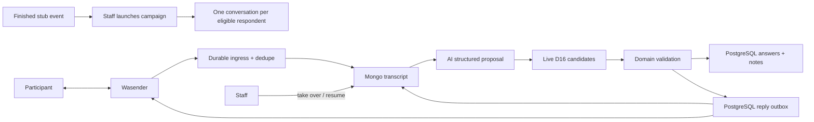
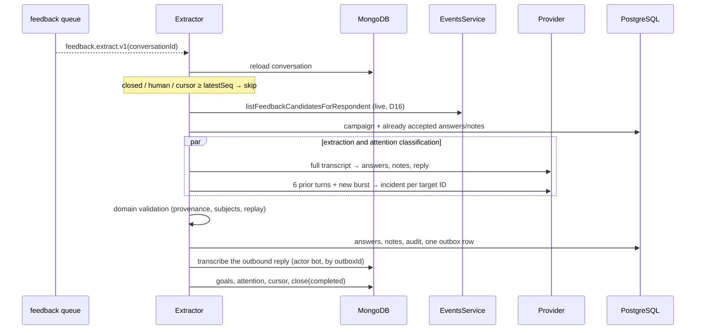
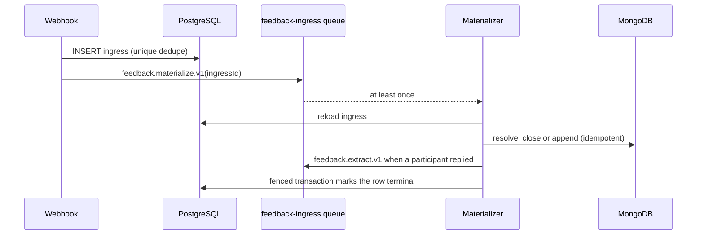
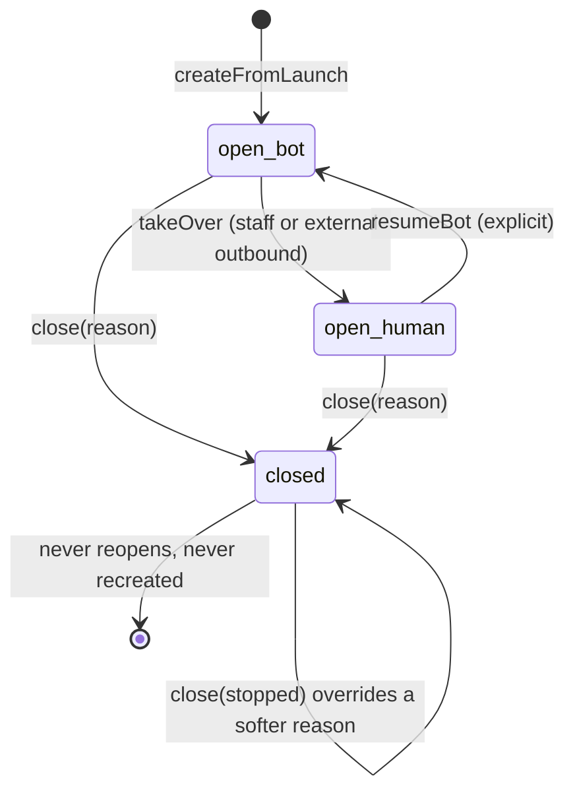
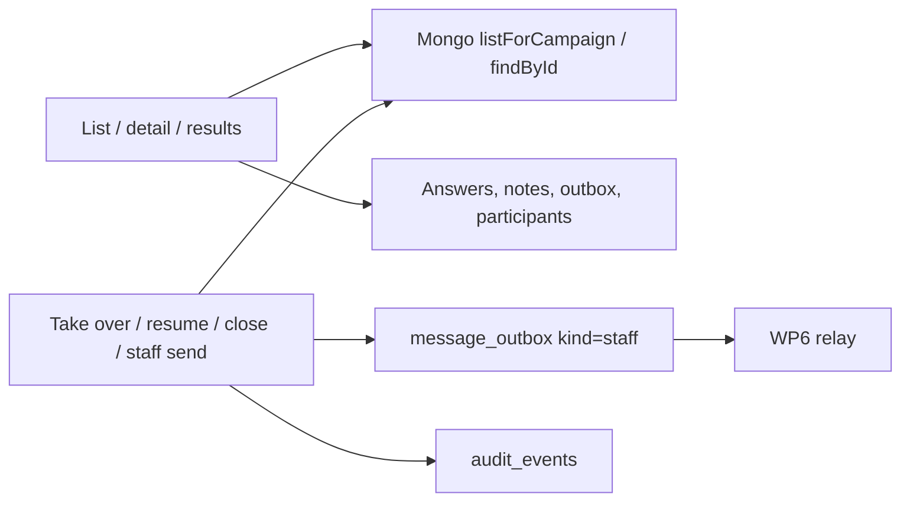

# Post-event feedback conversations

Status: architecture accepted in
[ADR 0008](../../decisions/0008-post-event-feedback-conversations.md);
**WP0 product contract**, **WP1 stub events**, **WP2 PostgreSQL persistence**,
**WP3 Mongo conversation schema v2**, **WP4 ingress + materialization**,
**WP5 extraction + reply loop**, **WP6 outbox relay + transport**, **WP7
campaign service + schedulers**, **WP7b staff conversation inbox HTTP** and
**WP8 dev simulated transport** are landed, as is the **WP9** admin
conversations UI it serves
([`docs/frontend/feedback-conversations.md`](../../frontend/feedback-conversations.md)),
whose WP12 design pass added the staff-written note endpoint documented below.
Plan amendments in
[`POST_EVENT_FEEDBACK_PLAN_2026-07-25.md`](../../history/post-event-feedback-plan-2026-07-25.md)
§9 supersede frozen candidate snapshots with live D16 selection, and
[D13](#d13-safety-content-travels-the-ordinary-pipeline) is amended: safety
content now travels the ordinary pipeline as visible notes.

## Purpose and boundary

This module will collect structured post-event feedback through one WhatsApp
conversation per eligible participant. It owns campaign eligibility, directed
answers and side notes, AI extraction validation, human control and the admin
views that navigate the same feedback by event or participant.

It does not own WhatsApp transport, participant identity, attendance, consent,
general customer support or confidential safety case handling. Wasender remains
an adapter, and attendance and consent remain upstream gates. Safety-flavoured
content travels the **ordinary** pipeline and is visible as ordinary notes
([D13](#d13-safety-content-travels-the-ordinary-pipeline)); the restricted
`safety_reports` table stays a pre-real-humans gate-pack item.

## Persisted PostgreSQL contract (WP2)

Schema and migrations live in
[`packages/database/src/schema/post-event-feedback.ts`](../../../packages/database/src/schema/post-event-feedback.ts).
Typed repository methods live per table under
[`campaign/campaign.repository.ts`](../../../apps/backend/src/modules/post-event-feedback/campaign/campaign.repository.ts)
(`FeedbackCampaignRepository`),
[`extraction/results.repository.ts`](../../../apps/backend/src/modules/post-event-feedback/extraction/results.repository.ts)
(`FeedbackResultsRepository`),
[`ingress/ingress.repository.ts`](../../../apps/backend/src/modules/post-event-feedback/ingress/ingress.repository.ts)
(`FeedbackIngressRepository`),
[`outbox/outbox.repository.ts`](../../../apps/backend/src/modules/post-event-feedback/outbox/outbox.repository.ts)
(`FeedbackOutboxRepository`), and
[`simulator/sim-outbound.repository.ts`](../../../apps/backend/src/modules/post-event-feedback/simulator/sim-outbound.repository.ts)
(`FeedbackSimOutboundRepository`). The paused-campaign kill switch stays inside
`FeedbackOutboxRepository.claimOutboxBatch`, which reads campaign status through
`FeedbackCampaignRepository.findCampaignById` on the same transaction.
There is no `message_deliveries` table and nothing references `event_attendees`.

| Table                      | Authority rules                                                                                                                                                                                                                         |
| -------------------------- | --------------------------------------------------------------------------------------------------------------------------------------------------------------------------------------------------------------------------------------- |
| `feedback_campaigns`       | `event_id` **UNIQUE** (one campaign per event); `question_set_version` + `questions` jsonb copy at launch; status `launched\|paused\|closed`; event FK `ON DELETE RESTRICT`                                                             |
| `feedback_answers`         | Directed edge; optional `subject_participant_id`; `value_int` for scores; `source_message_ids uuid[]`; `extraction_meta` jsonb (model, confidence, **candidate IDs of the run** per D12)                                                |
| Answer uniqueness          | `UNIQUE NULLS NOT DISTINCT (conversation_id, question_key, subject_participant_id)` so subjectless scores cannot duplicate on replay                                                                                                    |
| `feedback_notes`           | Same directionality; `note_type` `activity_interest\|general`; text ≤ 500 chars; subject **NULLABLE** (D18 unknown-name degradation); status `new\|dismissed`; `source_message_ids` non-empty unless `extraction_meta.origin = 'staff'` |
| `provider_message_ingress` | Durable webhook ack + dedupe; `UNIQUE(chat_jid, provider_message_id)`; `text` nullable (metadata-only when `ignored_unmatched`, D10); statuses `pending\|materialized\|ignored_unmatched\|failed`                                       |
| `message_outbox`           | Reply/intro/reminder/staff/system; status includes `held`; `dedupe_key` **UNIQUE**; delivery columns folded in (`delivery_status`, provider ids, sent/delivered/read/played timestamps) — no separate deliveries                        |

All participant and campaign foreign keys use `ON DELETE RESTRICT` (D18).
`conversation_id` / `matched_conversation_id` are Mongo conversation UUIDs with
no PostgreSQL FK. Repository helpers:

- `insertIngressIfAbsent` / `insertOutboxIfAbsent` / `insertAnswerIfAbsent` —
  `ON CONFLICT DO NOTHING` for webhook, reply and extraction replay;
- `findIngressByIdForUpdate` — the row lock that fences materialization;
- `findUnlinkedOutboxByConversationAndBody` — observed-outbound correlation when
  the provider message id is not known yet;
- given/received answer lists for admin profile views;
- outbox delivery updates and cancel-queued-on-STOP.

## Public contract

One completed event may create one campaign. Each eligible respondent has at
most one active conversation in that campaign.

| Record                     | Authority  | Contract                                                                      |
| -------------------------- | ---------- | ----------------------------------------------------------------------------- |
| Stub `events` / attendance | PostgreSQL | Upstream WP1 facts; candidates selected live (D16)                            |
| `FeedbackCampaign`         | PostgreSQL | Event, question-set version, launch copy snapshot, lifecycle                  |
| `FeedbackConversation`     | MongoDB    | Schema v2: transcript, goals, lifecycle × control, phone at launch, attention |
| `FeedbackAnswer`           | PostgreSQL | Directed normalized question result with message provenance                   |
| `FeedbackNote`             | PostgreSQL | Directed bounded side note with message provenance                            |
| Provider ingress/outbox    | PostgreSQL | Deduplication, audit and delivery/recovery boundary                           |

There is no PostgreSQL campaign-recipient projection. The conversation document
carries the recipient's phone at launch and its own state, and the admin list
reads compact Mongo projections (the assistant list precedent).

A person-specific answer or note is a directed edge:

```text
respondentParticipantId --said about--> subjectParticipantId
```

For example, “Roula would go skiing with Kostas” is owned by Roula's
conversation and points from Roula to Kostas. It does not assert that Kostas
likes skiing. Reversing the IDs changes the meaning.

General event scores may have no subject. A subject must otherwise belong to
the **current** live candidate set from
`EventsService.listFeedbackCandidatesForRespondent` (present attendees minus
the respondent — D16), and the respondent cannot be the subject. Unknown names
degrade to subjectless notes (D18). Each extraction run records the candidate
IDs it used in `extraction_meta`. The conversation document stores no candidate
list, so an attendance correction reaches every later turn instead of a frozen
copy.

Questions are versioned definitions outside the conversation. Campaign launch
snapshots the question-set version and its copy onto the campaign row, then
creates the Mongo goals from those keys; it does **not** freeze attendee
candidate IDs.

## Flow



Both directions reach the transcript. Inbound arrives through ingress;
outbound arrives through the outbox, which is why the transcript is
actor-labelled rather than one-sided — see
[outbound transcript entries](#outbound-transcript-entries).

## Outbound transcript entries

Every outbound message reaches a participant through one `message_outbox` row,
and every such row is also recorded in the MongoDB transcript by
[`FeedbackOutboundTranscriptService`](../../../apps/backend/src/modules/post-event-feedback/outbox/outbound-transcript.service.ts).
That is what makes the transcript actor-labelled on both sides: without it the
admin detail pane shows a one-sided conversation and the extraction prompt's
"full actor-labelled transcript" contains no bot turns.

The row's `kind` is the only thing that decides the actor:

| Outbox `kind` | Actor   | Producer                                        |
| ------------- | ------- | ----------------------------------------------- |
| `intro`       | `bot`   | Campaign launch / `startConversation`           |
| `reminder`    | `bot`   | Reminder sweep                                  |
| `reply`       | `bot`   | Extraction reply, closing copy and handoff copy |
| `system`      | `bot`   | STOP acknowledgement (materializer)             |
| `staff`       | `staff` | Staff inbox send                                |

`system` maps to `bot` on purpose. Schema v2 reserves `actor: system` for
entries with **no** transport provenance, and an outbox-backed message always
carries `outboxId`; the acknowledgement is the bot speaking on the channel, so
labelling it `system` would be rejected by the aggregate and would misdescribe
what the participant saw.

### Store order, replay and repair

PostgreSQL first, MongoDB second — the same order as the rest of the module.
The outbox row is what actually causes a send, so it must never wait on a
MongoDB write. The append is idempotent by `outboxId`, so a replay never
duplicates an entry.

A crash between the PostgreSQL commit and the append leaves a row with no
transcript entry. It repairs forward two ways:

- **The producer runs again.** Launch replay and `startConversation` re-resolve
  the intro row through `insertOutboxIfAbsent` and append whether or not this
  call inserted it; the reminder sweep re-selects a conversation whose
  `remindedAt` is still null (the append runs before `markReminded` for exactly
  that reason); an extraction retry replays the whole run behind its dedupe
  keys.
- **The delivery job reconciles.** The STOP acknowledgement is the one producer
  that cannot replay — its ingress row is marked terminal in the same
  transaction that inserts the row — so `MessageOutboxDeliveryService` calls the
  same idempotent append before `sendText`. That also establishes the general
  invariant: nothing is transmitted to a participant that the transcript did not
  record.

The transcript entry always uses the **stored row's** body, never the text the
caller proposed. A replayed extraction may generate different reply wording
while `insertOutboxIfAbsent` returns the row already enqueued; appending the
fresh wording would be rejected as a conflicting replay of the same `outboxId`.

For the same reason the reply/handoff `dedupe_key` is anchored on the **last
participant message's** `seq` rather than on the transcript length: the run
appends its own reply to that transcript, so a length-based key would differ
between the original run and a replay that already sees the reply — and a
different key is a second WhatsApp message.

### When the transcript is full

Nothing is silently dropped. A transcript at the 150-message cap (or the BSON
backstop) raises `needsAttention` inside the repository and the outbox row is
**cancelled**: a message that cannot be recorded must not be sent, because a
one-sided transcript is the exact failure this path prevents. A body longer
than the 4096-character transcript/WhatsApp limit — `message_outbox` allows
10 000 — is cancelled and flagged the same way rather than failing the job
forever as a poison pill. A staff send surfaces the refusal to the operator;
background producers log it and move on.

## Conversation control

The product exposes only:

- lifecycle `open | closed`;
- control `bot | human`;
- a current goal derived from the ordered goal set;
- a terminal reason when closed.

Processing, delivery and queue statuses live on their own records. They do not
inflate the conversation lifecycle.

An explicit staff takeover changes control to human before the staff send is
accepted. Bot jobs must reload control immediately before enqueueing an
outbound reply. An observed outbound message without a matching outbox record
also changes control to human and records external channel activity. The system
does not infer the sender's staff identity.

Resuming bot control is explicit. The first implementation may provide the
actor-labelled human exchange to the model because it can contain useful
follow-up questions and participant answers. Only participant statements may
materialize participant feedback.

STOP and equivalent opt-out commands are deterministic and effective in either
control mode.

## AI extraction

Each run makes two independent structured calls to the configured model in
parallel:

- the extraction call receives the full actor-labelled transcript, question
  copy, **live** candidates, current goals and accepted results. It proposes
  answers, notes, reply wording and an explicit participant-requested handoff;
- the attention classifier receives only the six messages preceding the new
  participant-message burst plus that burst. It returns one incident decision
  per new participant message, with a bounded category, recommended operator
  action and confidence.

Historical turns are classifier context only: it may attach attention metadata
exclusively to the exact new message IDs supplied by the application. A missing,
duplicate or unknown result rejects the classification call instead of silently
treating a model omission as safe. Neither call supplies UI copy or icons.
Application code then verifies:

- source messages exist in the referenced conversation;
- extracted statements came from the participant, not staff or the bot;
- at least one cited source falls inside the current cursor window, so no result
  is born without new testimony driving it, while a thought typed across a
  window boundary («τον Νίκο τον βρήκα» / «πολύ καλό, 5») may still cite both
  halves — demanding that _every_ citation be new rejected the accurate citation
  and kept the one that named only the second fragment;
- question keys and note types are allowed;
- subject IDs are valid candidates and differ from the respondent;
- replay cannot duplicate an existing answer/note;
- attention results cover exactly the new participant message IDs;
- current consent, lifecycle and control permit a reply.

Input pressure is measured by estimated tokens rather than message count. The
full transcript remains the initial extraction strategy; bounded recent context
is deliberate for classification because old testimony must inform meaning
without being reclassified. Raw history is retained independently of either
model view.

## Invariants

- Campaign membership is decided at launch (finished event ∧ present ∧ opt-in ∧
  phone); subject candidates are selected live at extraction time (D16), never
  guessed, and an already answered goal is never auto-reopened when a candidate
  appears late.
- Every structured result preserves respondent, optional subject, event
  campaign, conversation and source-message provenance.
- The same row powers both “feedback given” and restricted “feedback received”
  views; it is not copied onto participant profiles.
- Safety-flavoured content is recorded as ordinary, visible answers/notes; the
  cited transcript message carries bounded attention metadata and the
  conversation raises `needsAttention`. Nothing is suppressed (D13).
- A permanently failed extraction still records attention, one note and one
  acknowledgement; a dead run never leaves a turn silently unmarked.
- Wasender IDs are untrusted and deduplicated before processing.
- Unknown outbound channel activity silences the bot until explicit resume.
- AI output cannot send, change consent or bypass domain validation.
- PostgreSQL and MongoDB never pretend to share a transaction.
- Participant/campaign FKs are `ON DELETE RESTRICT`; feedback never FKs
  `event_attendees`.

## Admin views

The campaign screen groups conversations by respondent and shows progress,
control, last activity, structured answers/notes and attention requirements.
Participant links open the canonical profile.

The participant profile offers restricted staff views:

- feedback given: `respondentParticipantId = profile participant`;
- feedback received: `subjectParticipantId = profile participant`;
- results grouped by event with links to the campaign, respondent and source
  conversation.

Feedback received is not participant-visible by default. Avoidance, negative
notes and source identities require explicit authorization and product/privacy
review.

The outbound queue is a third, read-only view over the same data:
`listFeedbackOutboxQueue` publishes every `message_outbox` row still `pending`,
`sending` or `held` with its age, conversation, campaign and kind, and
`getFeedbackOutboxMessage` adds the live BullMQ state of that one row's
`feedback.deliver.v1` job. Both are `GET` and change nothing. The list is
PostgreSQL plus one batched respondent read and never touches Redis; the queue
lookup happens only for a row an operator opened. Its honesty limits — the
absent attempt history and why `unknown` is the ordinary job state — are owned by
[the screen contract](../../frontend/feedback-outbound-queue.md).

## WP5 extraction and reply loop (implemented)

[`PostEventFeedbackExtractor`](../../../apps/backend/src/modules/post-event-feedback/extraction/extract.service.ts)
is the consumer of `feedback.extract.v1`. It is serialized per conversation by
the deterministic job id and made replay-safe by the MongoDB extraction cursor.

### One run



The three cheap exits are reloaded state, not queue assumptions: the job may
have waited behind a STOP, a staff takeover or a newer run. A transcript that
gained no `actor: participant` message advances the cursor and returns without
calling the model at all.

### What the model is given and what it may return

Both prompts are Greek-first (the conversation is Greek) with English field
names (they are the persisted contract). Every transcript entry includes its
durable UTC ISO-8601 timestamp, so elapsed time and staff/participant ordering
remain visible to both extraction and attention classification. The extraction
proposal is `goals`, `notes[]`, `nextGoal`, `reply`, `handoff`, `confidence`;
its full transcript also carries the campaign's question copy snapshot, **live**
D16 candidates and already-accepted results.

`goals` carries one **required** verdict per questionnaire goal — `answered`
with a list of that goal's answers, `declined` with the words that declined it,
`not_addressed`, or `already_settled`. It replaced a free `answers[]` array and
a separate `skippedGoals[]` on 2026-07-27, because an array of one is valid
output: a message that answered three goals could come back holding one, with
nothing on the wire looking empty, since there was no slot to be empty. The only
thing asking for exhaustiveness was prose in the field description, and Luna
read «βαζω 3. η Λιτσα περασε, θα την ξαναεβλεπα. κανεναν οχι», returned the
score alone, and then asked about the person it had just been told about. A
required key per goal removes the option instead of arguing against it. It
forces consideration, not correctness — a wrong `not_addressed` is still
possible, but a wrong field is visible and assertable where a missing array
element is neither.

The verdict is per goal and its answers are a list, because one goal
legitimately holds several directed answers: «ο Νίκος, η Ελένη και η Άννα μου
άρεσαν» is three `liked` edges from one sentence, and the questionnaire exists
to build that graph.

The independent attention proposal is `results[]`, exactly one per supplied new
participant message: `messageId`, `incident`, nullable `category`, nullable
`recommendedAction`, `confidence`. It is not given questionnaire or candidate
data. The model has no tools and no store access in either call. OpenRouter
reasoning is disabled for this bounded classification task; held-out acceptance
must prove the direct structured answer remains reliable before that setting
changes.

The `declined` verdict is a deliberate addition to the plan's §7 sketch: D3
locks every question as skippable with no answer row, and without a producer for
it a participant whose remaining answer is «κανένας» could never reach
`completed`, so the closing copy would never send. It carries provenance for the
same reason an answer does — without it, "they did not want to say" is
indistinguishable from the model not having looked.

### Validation before any persistence or send

| Rule                                                | Effect on a violating proposal                                  |
| --------------------------------------------------- | --------------------------------------------------------------- |
| Source message exists in **this** conversation      | Rejected (`unknown_source_message`)                             |
| Source message is `actor: participant`              | Rejected (`non_participant_source`) — staff/bot text is context |
| Question key / note type is in the versioned set    | Rejected at the Zod boundary and again in the rules             |
| `event_score` is subjectless, integer 1–5           | Rejected (`subject_on_subjectless_question`, `invalid_score`)   |
| Subject is a **current** candidate and ≠ respondent | Answer dropped; note degrades subjectless + flagged (D18)       |
| Nothing already recorded is written twice           | Skipped (`already_recorded` / `duplicate_in_run`)               |
| Lifecycle ∧ control ∧ opt-in permit a reply         | Reply suppressed, results still persisted                       |
| Classifier incident result                          | Nothing suppressed; annotate target message + attention + audit |
| Explicit `handoff`                                  | Neutral handoff copy replaces the reply; notes still recorded   |

D18's degradation is asymmetric on purpose. A **note** carries the
participant's own words, so an unresolvable mention keeps the note, drops the
subject, records `flaggedForReview` and `unresolvedSubjectName` in
`extraction_meta`, and leaves the name in the text. That flagged note also
raises an `unattributed_note` reason so the safeguard is visible in the inbox —
without it, D18 works and nobody ever learns that it fired. A directed **answer** carries
no text of its own; without a resolved subject it asserts nothing, so it is
dropped rather than turned into a fabricated note.

Answer immutability still drops a corrected value as `already_recorded`. When
the proposed value differs from the stored one, the run raises an
`answer_revision` reason so an operator can reconcile; it does not rewrite the
row.

Two candidates sharing a first name («Κώστας») cannot be separated by
application code — both ids are valid, so a correct pick and a lucky guess are
indistinguishable. That case is handled in the prompt, which requires a
clarifying question instead of a guess, and the eval asserts the prompt supplies
both display names and the no-guessing rule.

Every persisted row records the model, its confidence and the exact candidate
ids of that run in `extraction_meta` (D12). Under live selection that set is the
only way to explain later why a subject was — or was not — resolvable.

### Effects of a run

- answers via `insertAnswerIfAbsent` (the `NULLS NOT DISTINCT` unique key);
- notes via `insertNote`, guarded by a `(type, subject, normalised text)`
  signature re-read inside the same locked transaction, because `feedback_notes`
  has no natural unique key;
- goal statuses advanced monotonically along `pending < asked < skipped <
answered`, derived from stored **and** newly written answers so a replay repairs
  them; `asked` is taken only from an outbound that actually poses a question
  (campaign re-ask, or a model reply whose words include `?` / `;` or a Greek
  imperative ask such as «πες μου» / «στείλε»), never from a bare `nextGoal` on
  a statement — otherwise a withdrawal marks the next rung asked and
  `reminder_followup` restates a question nobody posed. The doubt is spent
  towards "it asked": under-reading an ask also trips the withdrawal net below,
  which closes the conversation, while over-reading one costs a restated
  question;
- a run that accepts no answers, accepts no notes, sends no question, and still
  carries a `nextGoal` is a **withdrawal**: the model claimed the ladder
  continued while writing a statement. Remaining open goals are settled as
  `skipped`, which is what stops the reminder chase after the bot said it was
  backing off — but the conversation does **not** close. It is marked
  `awaitingHuman` and flagged, because the bot gave up rather than the
  participant finishing; closing it as `completed` is how one «άντε γαμήσου»
  earned a «Τέλεια, ευχαριστούμε πολύ! 🙌» on the next message. A bare
  `nextGoal: null` reply with nothing to extract is a side-question answer and
  does not settle; safety signals and handoff keep the ladder open for a human;
- **nothing closes over a duty of care.** An explicit handoff or urgent safety
  signal sets `awaitingHuman`, and closing underneath that promise left «σβήστε
  ό,τι σας είπα» answered with a human's name and then filed as `completed`;
- exactly one outbox row per run, chosen by the application rather than the
  model: the neutral handoff copy on an **explicit** handoff, else the closing
  copy when every **recorded** goal is terminal **and this run produced no safety
  signals**, else a campaign re-ask when validation refused an answer the
  participant can still fix, when the model skipped ahead of an open goal, or
  when it wrote a thank-you with `nextGoal: null` after proposing progress that
  did not finish the ladder, else the model's reply when it agrees with the
  recorded next goal (including side-question replies that name no next goal
  and proposed nothing);
- that row transcribed as an `actor: bot` message carrying its `outboxId`
  ([outbound transcript entries](#outbound-transcript-entries)), so the next run
  reads what the bot already asked;
- `close(completed)` when every goal is terminal **and this run produced no
  safety signals** — a disclosure that happens to finish the questionnaire
  keeps the conversation open so a human can take it;
- merge model classifications into the cited participant messages without
  downgrading an earlier model classification;
- one **named** attention reason per situation the run found, through
  `raiseAttention` rather than the bare flag — see
  [naming the raise](#naming-the-raise). An audit event and one
  [operator alert](#operator-alert-seam) fire only for safety or handoff, and
  only if that reason was newly recorded. Flagged notes and refused revisions
  are inbox work, not pages.

Extraction stops at the outbox row. The
[WP6 relay](#wp6-outbox-relay-and-transport-implemented) leases it and sends it
through `FeedbackTransport`, so a model proposal reaches a participant only
after a durable PostgreSQL row survived domain validation. The two halves share
no in-process call.

Control is **not** seized on a handoff. `control.source` is `staff_action` or
`external_outbound`; an AI signal is neither, and D17 keeps control changes a
human button. The bot stops asking, flags attention and lets an operator take
over explicitly.

### Naming the raise

A run does not set `needsAttention` directly. Every situation it finds is
recorded through `raiseAttention` as a `kind` plus the message an operator
should open, and the badge is that list's summary
([clearing attention](#clearing-attention) is the other half). The mapping is
owned by
[`operator-attention.ts`](../../../apps/backend/src/modules/post-event-feedback/extraction/operator-attention.ts):

| Situation                                                           | `kind`              | Anchor                             |
| ------------------------------------------------------------------- | ------------------- | ---------------------------------- |
| A classified safety signal                                          | `safety`            | each message the signal cited      |
| An explicit participant handoff request                             | `handoff`           | the newest message the run read    |
| A note kept but degraded to subjectless (D18)                       | `unattributed_note` | the note's own first cited message |
| An `already_recorded` answer re-proposed with a **different** value | `answer_revision`   | the newest message the run read    |

Two of them have no citation of their own — a handoff is a property of the run
and a refused revision is about the stored row it disagreed with — so both
anchor on the burst that produced them. That is a weaker claim than the safety
anchor and deliberately so: a reason that links nowhere leaves the operator
searching a 150-message transcript for the thing the badge would not name.

The write is idempotent on `kind` + `messageId`, so a replayed run re-raises the
same reason and changes nothing; two notes degraded in the same message collapse
to one entry for the same reason.

Two raises are still **unnamed**, and both are known gaps rather than design.
A withdrawal — the bot running out of things it was willing to say — has no
kind, because the taxonomy names what a participant did and inventing a
hostility verdict for a bot that gave up would be a classifier nobody asked for
(`hostile_to_bot` therefore has no producer). Neither has anything outside
extraction: the
[deterministic fallback](#deterministic-fallback-for-a-dead-run), the
materializer's unusable/truncated/edited inbound and unanswered STOP paths, a
permanently failed delivery and a body that could not be transcribed all still
call `setNeedsAttention`. Those conversations reach the inbox flagged with
nothing to read and nothing to dismiss, which is the original defect surviving
in the places the reason vocabulary does not yet cover.

### Store order and replay

PostgreSQL first, the outbound transcript entry, the MongoDB cursor last. The
cursor is the idempotency fence, so advancing it before the results are durable
would silently drop them. A crash after the PostgreSQL commit replays the whole
run: the unique answer constraint, the note content signature and the outbox
`dedupe_key` (`feedback-reply-<conversationId>-<lastParticipantSeq>`,
`feedback-closing-…`, `feedback-handoff-…`) all absorb it. That costs one
repeated model call — a repeated bill, never a duplicated answer or a second
WhatsApp message. Nothing claims exactly-once.

The reply key is anchored on the last **participant** message rather than on the
transcript length because the run appends its own reply to that transcript; a
length-based key would change under replay and produce a second row. For the
same reason a clean replay of a finished run now exits at
`skipped_no_new_testimony` rather than `skipped_cursor`: the transcript did grow
past the cursor, but only with the bot's own turn, so no model call is made and
nothing is written.

### Model, configuration and cost

The provider boundary is the assistant's registry (`assistant-models.ts`), so
extraction cannot invent a provider mapping or substitute a model when a key is
missing. `FEEDBACK_EXTRACTION_MODEL` selects the model and defaults to
`google/gemini-3.6-flash` (D12); an unregistered id fails at worker start rather
than quietly using the default. Provider clients live in the worker module only.

Extraction additionally sends **permissive safety thresholds** on its own call
path ([`permissive-safety-settings.ts`](../../../apps/backend/src/modules/post-event-feedback/extraction/permissive-safety-settings.ts)).
The registry routes `google/*` through OpenRouter, so the settings ride the
chat model's `extraBody` passthrough as `safety_settings` with `BLOCK_NONE`
across the four Gemini harm categories. Scope is the point: they are applied to
the model instance `PostEventFeedbackExtractionModel` builds and to nothing
else, so the assistant — which constructs its own clients from the same
registry — is unaffected. Relaxing the provider filter does not relax the
domain; every D16/D18 rule still runs on the proposal. A provider may still stop
on non-configurable policy, which is what the
[deterministic fallback](#deterministic-fallback-for-a-dead-run) absorbs.
Staging acceptance must confirm the passthrough actually reaches the upstream
provider.

Input pressure is logged in **tokens**, separately for `feedback_extraction`
and `attention_classification` — both the pre-call estimate and the provider's
reported usage — because a short thread of long Greek paragraphs is the
expensive case that a message counter would rank as cheap.

## D13 — safety content travels the ordinary pipeline

Amended after a live acceptance run. A participant described sexual harassment,
the extraction model refused structured generation, `feedback.extract.v1` failed
terminally, and **nothing** was recorded: `needsAttention` stayed false, no
audit event, no note, and the conversation stalled at the asked goal. The worst
message in the campaign produced the least evidence.

The original D13 made that outcome likely rather than accidental. Suppressing
ordinary notes on a safety signal meant the material an operator most needed to
read was the one thing the system refused to write down.

What holds now:

| Concern              | Rule                                                                                                                                              |
| -------------------- | ------------------------------------------------------------------------------------------------------------------------------------------------- |
| Notes                | Safety-flavoured statements become **ordinary** `feedback_notes` rows, same table, status and admin view as any other note. Nothing is suppressed |
| Handoff              | Attention does **not** imply a participant-requested handoff. Only an explicit request to speak with a human swaps in the neutral copy            |
| Operator signal      | `needsAttention`, an audit event and bounded metadata on each cited participant message; there is no separate incident record                     |
| Classification owner | Only the independent contextual model call selects a category and recommended action for a new target message; there is no keyword classifier     |
| Provider failure     | The terminal fallback raises generic conversation attention and writes a neutral note, but does not classify a message                            |
| Restricted reporting | The `safety_reports` table remains deferred to the pre-real-humans gate pack; nothing in this module writes one                                   |

Classification is contextual rather than lexical. Crude or sexual banter alone
is not a safety signal and may receive a light, non-encouraging redirection.
Unwanted exposure, harassment or credible danger is classified from the act and
consent described in the new testimony. The classifier sees the six preceding
messages plus the new target burst. Older turns may disambiguate tone and
consent but cannot receive a new classification in a later extraction run.

### Deterministic fallback for a dead run

[`PostEventFeedbackExtractionFallback`](../../../apps/backend/src/modules/post-event-feedback/extraction/fallback.service.ts)
runs when `feedback.extract.v1` fails permanently — a non-retryable provider
rejection, or the last attempt spent. It leaves three things behind:

1. `needsAttention` plus one audit event carrying a bounded cause class
   (`provider_refusal | provider_error | validation_failed | unknown`). The same
   class is thrown as the `UnrecoverableError` message, so it is visible in
   BullMQ's `failedReason` and not only in the audit table.
2. **One ordinary note** (`note_type: general`, `status: new`) with bounded
   generic text — «Η αυτόματη ανάλυση δεν ολοκληρώθηκε — δείτε τη συζήτηση.».
   Nothing was extracted, so nothing may be characterised. The text names the
   failure rather than the content for exactly that reason: a run reaches the
   fallback for any permanent failure, and the earlier wording asserted a
   possible offensive reference about text nothing had read.
3. **One bot acknowledgement** so the participant is not left on read: a short
   acknowledgement plus the current goal's prompt from the campaign copy
   snapshot. No new copy is authored.

Provenance is honest by omission. `source_message_ids` is the failing
participant message; `extraction_meta` records
`origin: "deterministic_fallback"`, the cause and the run's candidate ids, and
carries **no** `model` or `confidence` — an absent field is truthful, a zero
would read as a real low-confidence extraction.

The note is directed at a subject only when exactly **one** current D16
candidate's display name (or its first token, folded) appears in the message.
Two candidates called «Κώστας» cannot be separated by application code, so the
note degrades to subjectless and `flaggedForReview` under D18 rather than
asserting something about a real person.

Idempotency uses one fence for the whole effect: the outbox `dedupe_key`
`feedback-fallback-<conversationId>-<lastParticipantSeq>` is inserted first
inside the run's transaction, and a replay that finds it already present writes
no note, no audit event and raises no alert.

### Operator alert seam

`needsAttention` is the durable signal; the
[`FeedbackOperatorAlert`](../../../apps/backend/src/modules/post-event-feedback/operator-alert.ts)
port is the notification half, so nobody has to be watching the inbox for a
disclosure or a dead run to be noticed.

It is raised only for safety, an explicit handoff or a terminal extraction
failure, and only when that reason was newly recorded. A flagged subjectless
note or a refused answer revision raises its own reason without paging — those
are routine inbox work. Idempotency is structural rather than bookkept:
`raiseAttention` reports whether it pushed a row, so a replayed job re-raises
the same kind against the same message, sees `changed: false` and stays quiet.
A _second_ disclosure in an already-flagged conversation does page, because it
is a second message somebody has to read — under the old boolean crossing it
was silently swallowed.

`FEEDBACK_OPERATOR_ALERT_MODE` selects the channel — `log` (default) emits a
structured `feedback.operator_alert` warning; `off` disables notification while
the durable flag is still recorded. A WhatsApp adapter to a configured operator
number is the **named extension point** and is deliberately out of scope: it
needs its own number configuration, rate limit and privacy review.

### WP5 tests

The offline eval
([`post-event-feedback-extraction-eval.spec.ts`](../../../apps/backend/src/modules/post-event-feedback/post-event-feedback-extraction-eval.spec.ts))
runs the real prompt builder and the real rules over every WP0 fixture with a
recorded proposal in place of a live model call, and asserts each fixture's
expected outcome. The two-Κώστας and unknown-name fixtures additionally carry
adversarial proposals — a guessed subject and an invented candidate id — that
the rules must contain. Focused specs cover the rule set in isolation, the
orchestration (cheap exits, live candidate selection, completion, safety,
opt-in), the reply and closing copy appearing as `actor: bot` turns correlated
by `outboxId`, replay (same job twice, and a crash between the PostgreSQL commit
and the cursor advance, neither producing a second row or a second transcript
entry), the monotonic goal ladder, model selection and provider failure
classification — including that a `content-filter` finish reason is read as
`provider_refusal` rather than a schema mishap, and that the permissive safety
settings are attached to Google models only. No test calls a provider.

D13's own coverage sits alongside it: the independent classifier requiring
exact target-message coverage without suppressing notes or answers, the
materializer leaving inbound text unclassified before extraction, the fallback
writing exactly one note + one acknowledgement + one audit event and nothing on
replay, unique-name subject resolution versus two-name ambiguity, the alert
firing once per `false → true` transition, and the processor surfacing each
bounded cause class in `failedReason`.

## Failure and recovery

No worker remains alive while waiting for a reply. Bounded jobs reload durable
state and are safe to retry.

Durable acknowledgement, cross-store replay, ambiguous-send reconciliation and
the outbox relay now exist (WP4/WP6), and extraction is replay-safe behind the
cursor and the unique keys (WP5). Webhook activation still waits on the staging
acceptance and consent gates, not on missing recovery machinery. Nothing claims
exactly-once: replay repairs forward, and a stalled job can repeat an idempotent
step — for extraction that means repeating a model call, which costs money but
writes nothing twice.

A run that cannot succeed at all is no longer a silent loss. Terminal
`feedback.extract.v1` failures hand off to the
[deterministic fallback](#deterministic-fallback-for-a-dead-run), which records
attention, one ordinary note and one acknowledgement, and puts the bounded cause
class into the queue's `failedReason`.

The initial operating assumption is that `messages.upsert` observes manual
outbound messages from the primary WhatsApp application and other linked
clients. Staging must prove this with real device payloads before activation. If
it does not, staff sends during an active conversation must be restricted to the
application or another explicit single-writer workflow.

## Extension points and experiments

Add question definitions through a versioned question set, not prompt-only
changes. Add note types only when they have a named product use, visibility and
retention rule. Add summarization or segments only after fixtures demonstrate
that full transcript context is too costly or harms extraction. Change the
classifier's six-message history window only with held-out incident and banter
evals; it is a meaning boundary, not a token-budget accident.

Required pre-activation fixtures include multi-message bursts, admin follow-up,
unknown external outbound, takeover/resume, STOP during takeover, corrections,
ambiguous participant names, unrelated chat, safety language, duplicate and
out-of-order webhooks and long-context extraction. WP4 covers the transport-side
ones — unknown external outbound, STOP during takeover, unrelated chat,
duplicate and out-of-order delivery. WP5's offline eval covers the
extraction-side ones — bursts, staff follow-up, ambiguous names, unknown names,
unrelated chat and safety language — against recorded proposals rather than a
live model; a live-model run against the same fixtures remains part of the
staging acceptance pack. Provider acceptance also requires primary-phone and
WhatsApp Web sends plus a failed-webhook retry test.

## WP0 product contract (implemented)

Versioned questionnaire constants, the deterministic STOP matcher and Greek
extraction fixtures live under
[`apps/backend/src/modules/post-event-feedback/`](../../../apps/backend/src/modules/post-event-feedback/).

| Artifact            | Source                                     | Contract                                                                                                                                                                                                                |
| ------------------- | ------------------------------------------ | ----------------------------------------------------------------------------------------------------------------------------------------------------------------------------------------------------------------------- |
| Question set v1     | `packages/database` + `question-set.ts`    | Keys `FEEDBACK_ANSWER_QUESTION_KEYS` / `FEEDBACK_NOTE_TYPES` in the database schema; draft Greek copy in question-set, editable without schema changes                                                                  |
| Campaign copy       | `resolveCampaignCopy` in `question-set.ts` | Merges the campaign launch snapshot per key onto the versioned defaults; missing or blank keys use the default (so a pre-existing campaign still sends new copy keys such as `reminder_followup` / `cannot_read_media`) |
| STOP matcher (D14)  | `matching/stop-command.ts`                 | Pure function; `STOP`, `STOP ALL`, `UNSUBSCRIBE`, `ΔΙΑΚΟΠΗ`, `ΣΤΟΠ`; case-, whitespace- and accent-insensitive                                                                                                          |
| Extraction fixtures | `post-event-feedback-fixtures.ts`          | Typed Greek transcripts with expected-outcome annotations for later WP5 evals                                                                                                                                           |

The STOP matcher is the sole deterministic text matcher. It compares whole
commands; stripping punctuation there would widen the command rather than
normalise it. Attention classification intentionally has no curated keyword
list.

Focused unit tests cover STOP edge cases (accents, mixed case, precision against
near-miss strings), classifier target ownership and fixture integrity. No
runtime pipeline, queue or Mongo work is part of WP0/WP2.

## Tests and operations

- Database package constraint tests assert answer `NULLS NOT DISTINCT`
  uniqueness (including null subject), ingress `(chat_jid, provider_message_id)`
  uniqueness, outbox `dedupe_key` uniqueness, RESTRICT FKs and migration SQL.
- Repository tests assert conflict targets for ingress, outbox and answer
  idempotent inserts.
- Apply migrations with the database package migrator before runtime use.

## WP4 ingress and materialization (implemented)

The durable consumer behind the webhook. It stays behind the existing
`WASENDER_WEBHOOK_ENABLED` gate, which remains false by default.

### The request edge

[`PostEventFeedbackIngressService`](../../../apps/backend/src/modules/post-event-feedback/ingress/ingress.service.ts)
is everything the HTTP process does (D8):

1. one `provider_message_ingress` INSERT, deduplicated by the
   `(chat_jid, provider_message_id)` unique constraint;
2. one `feedback.materialize.v1` enqueue onto the `feedback-ingress` queue under
   the deterministic job id `feedback-materialize-v1-<ingressId>`;
3. 200.

A redelivery still enqueues, because the first delivery may have crashed between
the committed row and the queue; the job id and the idempotent consumer absorb
the duplicate. A failed enqueue answers 503 rather than a 200 that would hide a
stalled message. The request never reads a conversation, calls a model or sends
anything.

### The materialize job

[`PostEventFeedbackMaterializer`](../../../apps/backend/src/modules/post-event-feedback/ingress/materialize.service.ts)
reloads the ingress row and decides one outcome per delivery:

| Situation                          | Outcome                    | Effects                                                                                                                            |
| ---------------------------------- | -------------------------- | ---------------------------------------------------------------------------------------------------------------------------------- |
| Row already terminal               | `already_processed`        | Nothing; this is the replay path                                                                                                   |
| Phone matches no open conversation | `ignored_unmatched`        | Body dropped, metadata kept, counter incremented, never AI-processed (D10)                                                         |
| Inbound STOP                       | `inbound_stopped`          | Close `stopped`, cancel queued outbox, withdraw opt-in, audit, exactly one `stop_ack` outbox row transcribed as `actor: bot` (D14) |
| Inbound reply                      | `inbound_materialized`     | Idempotent transcript append, then one `feedback.extract.v1` for the newest transcript position                                    |
| Inbound without usable text        | `inbound_not_materialized` | `needsAttention`, ingress `failed`; the durable row keeps the provider metadata for an operator                                    |
| Outbound matching an outbox row    | `outbound_correlated`      | Delivery columns only — the outbox owns that message's transcript entry, so nothing is appended twice                              |
| Outbound matching an open thread   | `outbound_external`        | Take over to human control, append the observed staff message, audit external channel activity (D17)                               |

Conversation resolution is the Mongo `findOpenByPhone` lookup backed by the
partial unique index (D9). Nothing infers which event or person an unmatched
message belongs to. Because only open conversations are indexed that way, a
message arriving after closure matches nothing — which is exactly right for a
participant who opted out: the body is dropped and the conversation is never
reopened.

STOP is matched by the WP0 deterministic matcher **before** any model call and
works in either control mode: a takeover does not make opt-out negotiable. The
acknowledgement body is resolved by `resolveCampaignCopy` in
`question-set.ts`: the campaign's launch copy snapshot owns
each key, with per-key fallback to the versioned constant when a key is missing
or blank. A campaign launched before a copy key existed therefore sends that
default instead of nothing.

An observed outbound is correlated first by provider message id and then by the
oldest unlinked outbox row of that conversation with the same body. That
reconciliation is what keeps an ambiguous send from being sent twice. Delivery
status is never downgraded by a later observation. Outbound correlation by
provider message id also runs when no open conversation matched, so the STOP
acknowledgement — sent to a conversation that just closed — records its delivery
instead of counting as unrelated traffic.

### Why this order is replay-safe



Every MongoDB step runs before the PostgreSQL fence, and every one of them is
idempotent, so a crash replays into a no-op. The fence is a
`SELECT ... FOR UPDATE` on the ingress row inside the transaction that performs
the PostgreSQL side effects, which is what makes concurrent duplicate executions
collapse to a single audit event, a single cancellation and a single
acknowledgement. Extraction is enqueued before the fence for the same reason:
the reverse order would lose the run instead of repeating it.

The known gap is a row committed by the edge whose enqueue never succeeded. It
stays `pending` and is recovered by a provider redelivery **or** by the WP7
ingress recovery sweep, which re-enqueues `feedback.materialize.v1` to
`feedback-ingress` under the same stable job id for rows older than
`FEEDBACK_INGRESS_PENDING_RECOVERY_MINUTES` (default 5).

### Boundaries this package deliberately keeps

Reminders, expiry and campaign launch live in WP7. `feedback.extract.v1` has a
fixed name, payload and job id so materialization can enqueue it; WP5 replaced
the recording stub with the real consumer without changing any of them, and
that consumer has its own section below. Sending is likewise not this package's
job: extraction only ever **inserts** `message_outbox` rows and the WP6 relay
leases and sends them. Delivery-status webhooks (`messages.update`) update
outbox delivery columns through WP6.

Materialization and extraction outcomes are counted in a process-local counter
surfaced as structured log events, alongside per-run extraction token usage. The
deployment exports traces only, so these are counters for operators reading logs
and for tests, not a metrics backend.

### WP4 tests

Replay and crash behavior is the point of this package, so the focused tests
cover duplicate webhook delivery, double materialization, two concurrent
executions of the same job, out-of-order arrival, STOP during human control, a
replayed STOP that must not acknowledge twice, the acknowledgement appearing
once as an `actor: bot` turn, unmatched traffic keeping metadata only, outbound
correlation without transcript duplication, a delivery status that must not be
downgraded, and the external-outbound takeover. Process
composition tests keep the consumer out of the HTTP graph and the producer edge
gated with the webhook route.

## WP6 outbox relay and transport (implemented)

The email-style lease relay for `message_outbox`, plus the injectable outbound
transport boundary.

### Relay and deliver

[`MessageOutboxRelayService`](../../../apps/backend/src/modules/post-event-feedback/outbox/relay.service.ts)
leases due rows with `FOR UPDATE SKIP LOCKED`:

- `pending` rows are claimed into `sending`;
- `held` rows are never leased (D5 supervised mode stays a config away);
- stale `sending` rows past a five-minute recovery horizon are reclaimed so a
  lost BullMQ job can be republished under the same
  `feedback-deliver-v1-<outboxId>` key.

A five-second scheduler publishes `feedback.relay-outbox.v1`. Campaign
`intro`/`reminder` jobs in the same batch receive a staggered BullMQ delay.
STOP/expiry cancellations flip `pending` and `held` rows to `cancelled` through
the existing repository helper; a deliver job that finds `cancelled` or `held`
exits without sending.

[`MessageOutboxDeliveryService`](../../../apps/backend/src/modules/post-event-feedback/outbox/deliver.service.ts)
reloads the conversation phone, ensures the row's transcript entry exists (the
idempotent forward repair described in
[outbound transcript entries](#outbound-transcript-entries)) and then sends
through `FeedbackTransport`. An unknown provider outcome parks the row
(`delivery_status=pending`, keep any `provider_log_id`) and never calls send
again: recovery reconciles via `getMessageInfo` or waits for the WP4 upsert
body-correlation path.

### Transport boundary

| `TRANSPORT_MODE` | Adapter                                                                                                 |
| ---------------- | ------------------------------------------------------------------------------------------------------- |
| `simulated`      | Durable PostgreSQL `feedback_sim_outbound` sink; dev inject/read HTTP when `FEEDBACK_SIMULATOR_ENABLED` |
| `wasender`       | `WasenderClient.sendText` behind a shared-session pacer (minimum interval + jitter)                     |

No development HTTP inject/read endpoints are part of WP6; WP8 adds them behind
`FEEDBACK_SIMULATOR_ENABLED` (off by default, excluded from the published
OpenAPI composition).

### `messages.update`

The webhook edge applies status events to the correlated outbox row's delivery
columns (never downgrading). Unmatched provider message ids are a counted
no-op until an accepted send or upsert correlation has stored the id.

### WP6 tests

Lease / stable job-id idempotency, campaign stagger, session pacing bounds,
unknown-outcome no-retry, cancel-on-STOP statuses, delivery-status upgrade
without downgrade, the transcript repair running before `sendText`, and the
full-transcript case cancelling instead of sending.

## WP8 dev simulated transport (implemented)

Local-first validation (D2) uses `TRANSPORT_MODE=simulated` with a durable
PostgreSQL outbound sink and authenticated dev HTTP endpoints. Production
rejects `TRANSPORT_MODE=simulated` and never mounts the simulator module.

### Durable simulated outbound

[`SimulatedFeedbackTransport`](../../../apps/backend/src/modules/post-event-feedback/outbox/simulated-transport.service.ts)
implements the same `FeedbackTransport` port as Wasender. Each accepted send
inserts one row into `feedback_sim_outbound` (no foreign keys — dev-only
traffic, simplest replay/query shape). The outbox `provider_log_id` is the sink
row primary key; `provider_message_id` is `sim-<uuid>`.

### Dev HTTP surface and headless real-model evaluation

When `FEEDBACK_SIMULATOR_ENABLED=true`, `NODE_ENV` is not `production`, and
`TRANSPORT_MODE=simulated`, the HTTP process mounts
[`PostEventFeedbackSimulatorHttpModule`](../../../apps/backend/src/modules/post-event-feedback/simulator/http.module.ts):

| Operation                                | Purpose                                                                                                                                                                                                                        |
| ---------------------------------------- | ------------------------------------------------------------------------------------------------------------------------------------------------------------------------------------------------------------------------------ |
| `POST /dev/feedback/simulator/inject`    | Existing manual composer path: `ObservedProviderMessage` → normal durable ingress.                                                                                                                                             |
| `GET /dev/feedback/simulator/thread`     | Existing manual composer read: merge ingress rows and `feedback_sim_outbound` for one phone.                                                                                                                                   |
| `GET /dev/feedback/simulator/catalog`    | Read the configured model, the two permitted eval models (`openai/gpt-5.6-luna`, `qwen/qwen3.7-max`) and corpus cases eligible from a clean intro baseline.                                                                    |
| `POST /dev/feedback/simulator/preflight` | Read-only validation of a finished event, launched campaign, clean open bot conversation, sent intro in the simulated sink, pending goals, cursor 0, opt-in and candidate capacity; resolves exact live bindings and messages. |
| `POST /dev/feedback/simulator/runs`      | Explicitly confirmed paid run. Repairs a missing intro transcript idempotently, then writes scenario messages through normal ingress; it never supplies a per-run model override.                                              |
| `GET /dev/feedback/simulator/runs/:id`   | Poll ordinary ingress, Mongo cursor/model, results, run-created outbox rows and their simulated sink rows.                                                                                                                     |

The same gate also mounts
[`PostEventFeedbackBurstHttpModule`](../../../apps/backend/src/modules/post-event-feedback/burst/http.module.ts):

| Operation                         | Purpose                                                                                                                                                                                 |
| --------------------------------- | --------------------------------------------------------------------------------------------------------------------------------------------------------------------------------------- |
| `GET /dev/feedback/burst/catalog` | Read whether the extraction stub is on, whether a feedback worker is registered, the three rehearsal campaigns and the eighteen personas (messages, expected outcome, reserved phones). |

`FEEDBACK_EXTRACTION_STUB=true` (requires the simulator gate, refused in
production) swaps the worker's `PostEventFeedbackExtractionModel` for
[`ScriptedBurstExtractionModel`](../../../apps/backend/src/modules/post-event-feedback/burst/scripted-extraction-model.service.ts)
at module construction and logs one unmistakable warning. The stub answers from
the persona catalogue by parsing the rendered Greek prompt so a concurrent
rehearsal isolates mechanism defects from model defects. Usage token counts are
always `null` so nothing later reads them as billing.

The published `openapi.json` keeps `FEEDBACK_SIMULATOR_ENABLED=false`, so these
routes stay out of the generated admin client. The admin product screen is not
an eval runner; it retains only the existing manual inject/thread composer.

Run the headless tool against an already-running local API and worker:

```sh
pnpm feedback:simulate --list
pnpm feedback:simulate \
  --campaign <campaign-uuid> \
  --conversation <conversation-uuid> \
  --scenario <eligible-corpus-id> \
  --model openai/gpt-5.6-luna \
  --preflight
pnpm feedback:simulate \
  --campaign <campaign-uuid> \
  --conversation <conversation-uuid> \
  --scenario <eligible-corpus-id> \
  --model openai/gpt-5.6-luna \
  --confirm-paid-run
```

The multi-campaign burst rehearsal drives all eighteen personas at once:

```sh
# Free deterministic stub (default). Requires FEEDBACK_EXTRACTION_STUB=true on
# both API and worker, plus the simulator gate above.
pnpm feedback:burst

# Paid provider mode — eighteen conversations, each at least two provider calls.
pnpm feedback:burst \
  --model qwen/qwen3.7-max \
  --confirm-paid-run
```

`pnpm feedback:burst` seeds participants through `@join-the-six/database` on the
reserved phone block `+3069000<cc><pp>`, creates one finished event per
catalogue campaign (draft → scheduled → finished), launches via
`launchFeedbackCampaign`, injects every persona concurrently through the
ordinary simulator path, then writes `report/feedback-burst-<timestamp>.html`.
It never cleans up. Settlement polling keeps the configured deadline as an outer
bound, but stops early when the settled set and every conversation's message
count are unchanged for several polls after the quiet-settle threshold — and
names the unsettled personas so a quiet stop is never mistaken for success.
Stub mode refuses to start unless the burst catalogue
reports `extractionStub: true` and a feedback worker is registered; paid mode
treats per-persona semantic expectations as observations and keeps the
cross-cutting correctness checks as hard failures.

The preflight never repairs or injects. The paid command requires the literal
confirmation flag, sends a stable `x-request-id`, and prints run, scenario,
model, event, campaign, conversation, respondent and correlation identifiers,
the exact rendered batch/rubric, plus inbox/results links. The normal
PostgreSQL/MongoDB/Redis worker path remains the source of truth:
ingress → materialization → delayed extraction → answer/note/outbox writes →
relay → `feedback_sim_outbound`. No real WhatsApp adapter is reachable.
Preflight reports whether a worker registration is visible through the feedback
queue but remains useful when the worker is stopped, so inspecting readiness
cannot wake sweep jobs. Confirmed start hard-blocks before intro repair or
ingress when no worker is registered.

One logical run is not necessarily one invoice line: it makes one extraction
call plus one or more attention-classification calls (classification batches at
ten new participant messages). The confirmation covers all of them.

The runner deliberately exposes only corpus cases that fit one leading-edge
45-second window and whose rubric is valid from the clean intro baseline.
Multi-turn, later-goal and deterministic ingress cases are rejected instead of
being crushed into a misleading burst. A confirmed run permanently consumes
the conversation and performs no cleanup; use a separate conversation with an
equivalent clean baseline for the other model. Candidate bindings can differ,
so compare the printed inputs rather than calling the baselines magically
identical.

Run status is process-local and disappears on an API restart. The conversation,
observed extraction model, answers, notes, outbox and simulated sends are normal
durable records and remain inspectable in the existing admin views. Worker logs
contain provider token usage, but usage is not durably stored; no authoritative
price card exists, so the CLI reports token/cost fields as unavailable rather
than manufacturing accounting.

### WP8 tests

Integration coverage runs intro delivery → inject reply → materialize →
`feedback.extract.v1` enqueue (extraction execution remains WP5) and asserts the
resulting transcript holds both sides. Focused real-model-runner tests cover
read-only preflight, paid confirmation, live candidate rendering, cumulative
leading-edge eligibility, production rejection, failed extraction precedence
and completion only after the run-created outbox reaches the simulated sink.
They use fakes and never call a provider. Composition tests assert production
cannot enable the HTTP simulator or the extraction stub, and that the worker
factory returns the real model when `FEEDBACK_EXTRACTION_STUB` is off.

## WP3 conversation persistence (implemented)

## Schema v2 — post-event feedback conversation

The MongoDB schema-v2 document, its Zod validators, the repository and its two
reviewed indexes live in this module:

- [document](../../../apps/backend/src/modules/post-event-feedback/post-event-feedback-conversation.document.ts)
- [repository](../../../apps/backend/src/modules/post-event-feedback/post-event-feedback-conversation.repository.ts)

Both aggregates share `conversation_threads`; the schema-v1/v2 co-tenancy
invariant is stated once in
[conversations.md](conversations.md#schema-versions-coexist).

One document per (campaign, respondent). It is the transcript and the
conversation state; it is not a delivery record and not the answer store.

```text
_id                      uuidv5(campaignId, respondentParticipantId)
schemaVersion            2
purpose / channel        post_event_feedback / whatsapp
campaignId               campaign UUID
respondentParticipantId  participant UUID
phoneAtLaunch            E.164 number captured at launch
lifecycle                { state: open|closed,
                           reason: completed|stopped|expired|cancelled|null,
                           closedAt }
control                  { mode: bot|human,
                           source: launch|staff_action|external_outbound,
                           changedAt }
goals                    [ { key, ordinal, prompt,
                             status: pending|asked|answered|skipped } ]
messages                 [ { id, seq, actor: bot|participant|staff|system,
                             text, providerMessageId, ingressId, outboxId,
                             attention, at } ]
extraction               { cursorSeq, lastRunAt, model }
needsAttention           boolean
remindedAt               timestamp or null
createdAt / updatedAt    timestamps
```

Goal keys and their order come from the versioned WP0 question set
(`event_score`, `liked`, `meet_again`, `avoid`); the module does not redefine
them. Prompts come from the copy snapshot the campaign took at launch, so a
later copy edit never rewrites a live questionnaire.

The document stores **no candidate list**. Candidates are selected live at
extraction time from current attendance, so an attendance correction reaches
every later turn instead of a frozen copy.

Answers, notes, ingress rows, outbox rows and audit events stay in PostgreSQL.
The conversation carries only their identifiers as message provenance.

What WP3 settles for this module:

- one conversation per (campaign, respondent) under a deterministic
  `uuidv5(campaignId, participantId)` identifier, so launch replay is
  idempotent and a STOP-closed conversation is never recreated;
- product lifecycle `open | closed` with a terminal reason, orthogonal control
  `bot | human` with the reason control changed, and no queue or delivery
  status leaking into either;
- goals built from the WP0 question keys, with prompts from the campaign's
  launch copy snapshot;
- actor-labelled messages with contiguous sequence numbers and
  ingress/outbox/provider provenance, appended idempotently;
- the extraction cursor that keeps replayed runs from duplicating answers;
- `phoneAtLaunch` plus a partial unique index, which is what makes inbound
  phone resolution unambiguous instead of a guess.

### Identity and idempotency

`_id = uuidv5(campaignId, respondentParticipantId)` (RFC 4122 version 5, SHA-1,
campaign as namespace). Launch replay therefore collides on the primary key
instead of creating a second conversation, so at most one conversation per
(campaign, participant) can ever exist. `createFromLaunch` returns
`{ created: false }` with the stored document when it already exists — a
conversation closed by STOP is returned as-is, never recreated.

### Lifecycle and control



Lifecycle and control are orthogonal. Queue, delivery and extraction statuses
are not conversation states.

- The first closure wins, with one exception: `close(stopped)` also overrides
  an existing softer reason, because opt-out is absolute (D14).
- No method reopens a closed conversation, so a STOP is structurally final.
- `resumeBot` is rejected on a closed conversation.
- `takeOver` works in any lifecycle state: an unobserved external outbound must
  silence the bot even on a conversation that just closed.
- `control.source` records why control changed. `launch` is the initial bot
  source and is invalid for human control.

### Messages and provenance

`seq` is contiguous from 1 and is allocated under an optimistic
`messages: { $size: n }` fence, so a concurrent append retries instead of
creating a gap or a duplicate sequence. Appends are idempotent by `ingressId`,
`outboxId` or the caller's stable message `id`; a replay with the same
provenance but different content is rejected rather than silently accepted.

| Actor         | Required provenance                                      |
| ------------- | -------------------------------------------------------- |
| `participant` | `ingressId` (durable PostgreSQL ingress row), no outbox  |
| `bot`         | `outboxId`                                               |
| `staff`       | `outboxId`, or `ingressId` for an observed external send |
| `system`      | neither; the caller supplies a stable `id`               |

Appends are allowed on a closed conversation because the transcript records
what actually happened (a STOP acknowledgement or a closing message is observed
after the closure). Whether a message may be _sent_ is a campaign/outbox
decision, not a transcript decision.

Outbound entries are written when the `message_outbox` row is created, not when
it is delivered, and the row's `kind` decides the actor: `intro`, `reminder`,
`reply` and `system` are the bot speaking, `staff` is a staff send. A STOP
acknowledgement is therefore `actor: bot`, not `actor: system` — this schema
reserves the `system` actor for entries with **no** transport provenance, and
an outbox-backed message always carries `outboxId`. The
[outbound transcript entries](#outbound-transcript-entries) mapping and its
crash-repair rules live in this module.

Only participant messages may carry `attention`. It is `null` for legacy and
ordinary messages; otherwise it holds unique bounded safety categories, the
strongest recommended action and model confidence. Only validated
attention-classification output creates this metadata; the incoming materializer
does not inspect keywords. `mergeMessageAttention` is additive: a later model
run may raise the action or add a category, but no replay can erase or downgrade
a prior classification.

### Goal progress

Goal statuses only move up the ladder `pending < asked < skipped < answered`,
enforced by a MongoDB array filter rather than by a hopeful read-modify-write.
That rank is what implements D16's "an answered goal is never auto-reopened": a
later extraction run cannot demote a recorded answer back to a question the bot
would ask again, however confident the model is. `answered` outranks `skipped`
so a participant who changes their mind is still recorded — that direction adds
a fact instead of discarding one. A concurrent run that already advanced the
same goal further simply leaves it alone. `asked` is recorded only when the
outbound that will be sent actually poses the question; a statement that still
carries a `nextGoal` does not. A withdrawal — no accepted answers, no accepted
notes, no question on the sent outbound, and a still-named `nextGoal` — settles
every remaining open goal as `skipped` so reminders stop chasing it, and freezes
the conversation for a person (`awaitingHuman` + `needsAttention`) rather than
closing it as completed. A `nextGoal: null` statement with nothing to extract is
left alone so side-question replies do not end the questionnaire.

### Extraction cursor, attention and capacity

`extraction.cursorSeq` advances monotonically and can never pass the
transcript; a replayed or late run that would not move it is an idempotent
no-op. That is the idempotency boundary that stops the same source messages
from producing duplicate PostgreSQL answers while the full transcript stays
available as extraction context. Attention classification instead receives the
six messages preceding the new participant-message burst plus that burst; older
messages are context only and are never new classification targets.

The transcript is capped at 150 messages with a 4 MiB BSON backstop (message
text is bounded at 4096 characters, WhatsApp's text-body limit). Reaching
either bound sets `needsAttention` and raises
`FeedbackConversationCapacityError`; nothing is silently dropped, and the
durable PostgreSQL ingress row still holds the message for an operator. For an
**outbound** message the caller additionally cancels the outbox row, so a
message the transcript cannot record is never sent either.

### Repository contract

| Method                   | Contract                                                                       |
| ------------------------ | ------------------------------------------------------------------------------ |
| `createFromLaunch`       | Deterministic `_id`; idempotent; reports `created`; phone conflict is explicit |
| `findById`               | Full document for a detail read                                                |
| `findOpenByPhone`        | Inbound resolution (D9), backed by the partial unique index                    |
| `listForCampaign`        | Compact campaign-grouped summaries; no transcripts in list reads               |
| `listOpenDueForReminder` | Approximate D11 reminder candidates; sweep reloads authoritative state         |
| `listOpenDueForExpiry`   | Approximate D11 expiry candidates; sweep reloads authoritative state           |
| `appendMessage`          | Contiguous `seq`, idempotent by provenance, cap/byte guard                     |
| `mergeMessageAttention`  | Additive model categories; recommended action and confidence only strengthen   |
| `takeOver` / `resumeBot` | Explicit control transitions with a recorded source                            |
| `close`                  | Terminal reason; STOP overrides softer reasons; nothing reopens                |
| `advanceCursor`          | Monotonic extraction cursor bounded by the transcript                          |
| `updateGoalStatuses`     | Monotonic goal ladder `pending < asked < skipped < answered`                   |
| `setNeedsAttention`      | Sets or clears the operator attention flag                                     |
| `markReminded`           | Idempotent D11 reminder stamp (`remindedAt`)                                   |

Every method validates the resulting document with Zod, and every transition
reports whether it actually changed state so callers can write exactly one
audit event.

### Indexes

| Index                                         | Purpose                                                                                            |
| --------------------------------------------- | -------------------------------------------------------------------------------------------------- |
| `feedback_conversation_open_phone_unique_idx` | Partial **unique** `phoneAtLaunch` where purpose is post-event feedback and lifecycle is open (D9) |
| `feedback_conversation_campaign_updated_idx`  | `campaignId` + recency for the grouped admin list                                                  |

The partial filter is what makes phone→conversation resolution unambiguous: a
second open conversation for the same number is rejected by the database, not
by a hopeful application check. The repository verifies both indexes on first
use, and [Compose provisioning](../../../docker/mongo-init/10-app-user.js)
creates them on a fresh volume.

### Related runtime surfaces

Reply sending belongs to the outbox/relay path; that path also owns every
outbound transcript entry through
[`FeedbackOutboundTranscriptService`](#outbound-transcript-entries).
Campaign launch, reminders, expiry sweeps and ingress recovery live in
[WP7](#wp7-campaign-service-and-schedulers-implemented). Staff inbox HTTP
(list/detail/results reads, takeover/resume/close/staff-send and note
review-status, with per-conversation capability flags) lives in
[WP7b](#wp7b-staff-conversation-inbox-http-implemented); it projects
`listForCampaign` / `findById` and calls the transition methods above but does
not redefine them. Extraction drives goal advancement, the cursor and
`close(completed)` through the methods above and lives in
[WP5](#wp5-extraction-and-reply-loop-implemented). Webhook ingestion and the
`feedback-ingress` queue live in
[WP4](#wp4-ingress-and-materialization-implemented): its materializer is the
only caller that resolves a phone, appends inbound messages, closes a
conversation on STOP or takes control on an unknown outbound. The transport
adapter calls that application service; it never writes provider payloads into
MongoDB.

Two consumer expectations follow from this repository's contract rather than
from the consumer's own code. A correlated outbound is not appended by the
materializer — the outbox owns that message's transcript entry through
`outboxId` provenance, so appending the same message again by `ingressId` would
create a duplicate. And because appends allocate `seq` on arrival, the
transcript records durable arrival order, not provider timestamps; the feedback
worker runs at concurrency `1` so one participant's burst keeps its order.

One consequence of outbound entries occupying sequence numbers: a participant's
reply no longer lands at `seq 1`. The bot intro is `seq 1`, so the first reply
is `seq 2` and the deterministic extract job id follows it.

Webhook ingestion, the `feedback` queue and the outbox relay landed in WP4/WP6
on top of it, and extraction advances the cursor and the goals in WP5.
Campaign launch, reminders, expiry and ingress recovery landed in WP7. Staff
inbox read/action HTTP (list/detail/results, takeover/resume/close/staff-send,
capability flags) landed in WP7b. The admin UI remains WP9.

## WP7 campaign service and schedulers (implemented)

Staff HTTP under `/feedback/campaigns` plus bounded BullMQ sweep jobs.

### Launch and kill switch

[`PostEventFeedbackCampaignService`](../../../apps/backend/src/modules/post-event-feedback/campaign/campaign.service.ts)
owns the application boundary:

| Action              | Gate / effect                                                                                                                                                                                                                                                                                                                                                                                                          |
| ------------------- | ---------------------------------------------------------------------------------------------------------------------------------------------------------------------------------------------------------------------------------------------------------------------------------------------------------------------------------------------------------------------------------------------------------------------- |
| `launch`            | Event `finished` ∧ ≥1 eligible (present ∧ opt-in ∧ `phone_e164`); creates the campaign with the WP0 question launch snapshot; one Mongo conversation per eligible attendee via `createFromLaunch` (deterministic `_id`); one `intro` outbox row per new open conversation (`dedupe_key = feedback-intro-<conversationId>`), transcribed as `actor: bot`. Replay creates nothing new and repairs a missing intro entry. |
| `pause` / `resume`  | Status `paused` ↔ `launched`. Pause stops the relay from leasing that campaign's rows and suppresses extraction replies (`replyAllowed` requires `status=launched`).                                                                                                                                                                                                                                                   |
| `close`             | Kill switch: status `closed`, cancel queued outbox for the campaign. Open conversations are left for STOP / expiry / staff close (D17).                                                                                                                                                                                                                                                                                |
| `startConversation` | D17 create-if-missing for one eligible participant; never recreates a STOP-closed conversation; enqueues intro only when a new open conversation was created.                                                                                                                                                                                                                                                          |

Every mutation writes an audit event. Intros are not sent by HTTP — WP6's
relay leases them with stagger.

### Reminder, expiry and ingress recovery

[`PostEventFeedbackSweepService`](../../../apps/backend/src/modules/post-event-feedback/sweeps/sweep.service.ts)
runs as bounded BullMQ jobs every five minutes:

| Job                           | Contract                                                                                                                                                                                                                                                                                                                                                                                                                                                                                                                                                                                                                                                                                                                                                                                                  |
| ----------------------------- | --------------------------------------------------------------------------------------------------------------------------------------------------------------------------------------------------------------------------------------------------------------------------------------------------------------------------------------------------------------------------------------------------------------------------------------------------------------------------------------------------------------------------------------------------------------------------------------------------------------------------------------------------------------------------------------------------------------------------------------------------------------------------------------------------------- |
| `feedback.sweep-reminders.v1` | A ladder of up to `FEEDBACK_MAX_REMINDERS` (default 2) nudges: nudge _N_ falls due after _N_ × `FEEDBACK_REMINDER_AFTER_HOURS` (default 24) of **participant silence**, so the defaults send at 24h and 48h. Silence runs from the participant's own newest message, or from launch if they never wrote; our outbound never resets it. `reminderCount` is the ladder state and `markReminded` advances it under a compare-and-set, so concurrent sweeps cannot double-nudge. Transcribed as `actor: bot` before `markReminded`, so a crash between the two repairs on the next sweep under the same per-ordinal `dedupe_key`. Skips closed / human / opted-out / inactive campaign, **and any conversation with `needsAttention`** — a conversation waiting for a person must not be chased by a machine. |
| `feedback.sweep-expiry.v1`    | At `FEEDBACK_EXPIRE_AFTER_HOURS` (default 72) of the same **silence** measure → `close(expired)` + cancel queued outbox. Same skip set except attention: expiry sends nothing and releases the `phoneAtLaunch` unique index, so withholding it only strands the row.                                                                                                                                                                                                                                                                                                                                                                                                                                                                                                                                      |
| `feedback.sweep-ingress.v1`   | Re-enqueues `feedback.materialize.v1` for `pending` ingress rows older than `FEEDBACK_INGRESS_PENDING_RECOVERY_MINUTES` (default 5) under the existing stable job id.                                                                                                                                                                                                                                                                                                                                                                                                                                                                                                                                                                                                                                     |

### Staff HTTP contract

| Method | Path                                                  | `operationId`               |
| ------ | ----------------------------------------------------- | --------------------------- |
| `GET`  | `/feedback/campaigns`                                 | `listFeedbackCampaigns`     |
| `POST` | `/feedback/campaigns/launch`                          | `launchFeedbackCampaign`    |
| `GET`  | `/feedback/campaigns/:campaignId`                     | `getFeedbackCampaign`       |
| `POST` | `/feedback/campaigns/:campaignId/pause`               | `pauseFeedbackCampaign`     |
| `POST` | `/feedback/campaigns/:campaignId/resume`              | `resumeFeedbackCampaign`    |
| `POST` | `/feedback/campaigns/:campaignId/close`               | `closeFeedbackCampaign`     |
| `POST` | `/feedback/campaigns/:campaignId/conversations/start` | `startFeedbackConversation` |

`listFeedbackCampaigns` is the read-only campaign picker: newest launch first,
with event id + title, status, `launchedAt`, and conversation progress counts
(`conversationCount`, `openCount`, `needsAttentionCount`). It never creates
conversations or enqueues intros — that remains `launch` / `startConversation`.
The event detail read model also exposes a nullable `feedbackCampaignId` so
event screens can deep-link the inbox without calling launch.

### WP7 tests

Focused coverage: eligibility gate, launch idempotency (replay creates nothing
new), the intro appearing once in the transcript as `actor: bot` and being
repaired on replay, start-conversation never recreates STOP-closed threads,
pause/resume audit, `listFeedbackCampaigns` projection + progress counts
(newest first), reminder/expiry edge cases (opted-out, human control,
already closed) plus the reminder's transcript entry and its replay repair,
ingress recovery (stuck row re-enqueued, fresh pending untouched), lease skip
for paused campaigns, and process composition (HTTP module in the API graph,
sweeps in the worker only).

## WP7b staff conversation inbox HTTP (implemented)

The admin conversations UI (WP9) needs a staff-only read/action surface on top
of the WP3 projections and WP7 campaign service. No extraction or relay
behavior changes here.

[`PostEventFeedbackConversationService`](../../../apps/backend/src/modules/post-event-feedback/inbox/conversation.service.ts)
owns the inbox read model and capability-gated actions:

| Concern       | Contract                                                                                                                         |
| ------------- | -------------------------------------------------------------------------------------------------------------------------------- |
| List          | Compact `listForCampaign` projections + campaign summary (event title, open / attention counts) for U1 grouping; no transcripts  |
| Detail        | Full actor-labelled transcript; outbound messages carry delivery state via `outboxId` → `message_outbox` correlation             |
| Results       | Answers + notes for one conversation, or campaign-wide with `questionKey` / `participantId` / `reviewStatus` filters (U4)        |
| Display names | Resolved server-side from `participants`; `null` only for truly dangling ids so the UI can render «άγνωστος συμμετέχων» (D18)    |
| Capabilities  | Per-conversation flags (`canTakeOver`, `canResumeBot`, `canClose`, `canSendStaffMessage`) — closed (including STOP) exposes none |



### Actions

| Action             | Gate                                                    | Effect                                                                           |
| ------------------ | ------------------------------------------------------- | -------------------------------------------------------------------------------- |
| Take over          | open ∧ control=bot                                      | `takeOver(staff_action)` + audit                                                 |
| Resume bot         | open ∧ control=human                                    | `resumeBot` + audit                                                              |
| Close              | open (STOP-closed rejected; other closed is idempotent) | `close(cancelled)`, cancel queued outbox, audit (D17)                            |
| Staff send         | open ∧ control=human                                    | Insert `kind=staff` outbox (WP6 sends), append transcript with `outboxId`, audit |
| Add note           | conversation exists; subject ∈ live D16 candidates      | Insert `feedback_notes` with staff provenance + audit                            |
| Note review status | note exists                                             | `new` ↔ `dismissed` + audit                                                      |

### Staff-written notes (WP12)

An operator can record what they learned outside the thread. The note is an
ordinary `feedback_notes` row, so it reaches the conversation pane, the Results
tab and the review queue like any other — D13's rule that feedback is visible
rather than filed separately applies to manual notes too.

It asserts nothing it does not know:

| Field                  | Value                                                                          |
| ---------------------- | ------------------------------------------------------------------------------ |
| `extraction_meta`      | `{ origin: "staff", staffUserId, candidateIds }` — no `model`, no `confidence` |
| `source_message_ids`   | Empty. The note quotes no message; an operator typed it                        |
| `subjectParticipantId` | Optional, and only a current D16 candidate of the campaign's event             |
| `status`               | `new`, so a manual note enters the same review queue                           |

Two consequences follow from that shape:

- The `feedback_notes_source_message_ids_check` constraint now reads
  `cardinality(source_message_ids) >= 1 or extraction_meta->>'origin' = 'staff'`
  (migration `20260726001227_staff_authored_feedback_notes`). Every note that
  claims conversation provenance still has to cite the message it came from;
  only the origin that quotes nothing may be empty.
- The note read model publishes a derived `origin` of `conversation` or `staff`
  rather than the raw provenance blob. A model extraction and the deterministic
  fallback both quote real testimony, so both read as `conversation`; rows
  written before the field existed are extraction output, which is the default.
  The admin labels the `staff` case wherever notes render so a hand-written note
  can never be read as something a participant said.

The subject is resolved through `EventsService.listFeedbackCandidatesForRespondent`
— the same D16 helper extraction uses — and anyone outside that set is rejected
with a 400 rather than quietly stored as an undirected note. Unlike every
control that could send a message, adding a note is **not** capability-gated:
writing something down is not steering the conversation, so it stays available
after the thread closes.

### Staff HTTP contract (inbox)

| Method  | Path                                                                                                | `operationId`                                |
| ------- | --------------------------------------------------------------------------------------------------- | -------------------------------------------- |
| `GET`   | `/feedback/campaigns/:campaignId/conversations`                                                     | `listFeedbackCampaignConversations`          |
| `GET`   | `/feedback/campaigns/:campaignId/conversations/:conversationId`                                     | `getFeedbackConversation`                    |
| `GET`   | `/feedback/campaigns/:campaignId/conversations/:conversationId/results`                             | `listFeedbackConversationResults`            |
| `GET`   | `/feedback/campaigns/:campaignId/results`                                                           | `listFeedbackCampaignResults`                |
| `POST`  | `/feedback/campaigns/:campaignId/conversations/:conversationId/take-over`                           | `takeOverFeedbackConversation`               |
| `POST`  | `/feedback/campaigns/:campaignId/conversations/:conversationId/resume-bot`                          | `resumeFeedbackConversationBot`              |
| `POST`  | `/feedback/campaigns/:campaignId/conversations/:conversationId/close`                               | `closeFeedbackConversation`                  |
| `POST`  | `/feedback/campaigns/:campaignId/conversations/:conversationId/messages`                            | `sendFeedbackConversationStaffMessage`       |
| `POST`  | `/feedback/campaigns/:campaignId/conversations/:conversationId/notes`                               | `addFeedbackConversationNote`                |
| `POST`  | `/feedback/campaigns/:campaignId/conversations/:conversationId/attention-reasons/:reasonId/resolve` | `resolveFeedbackConversationAttentionReason` |
| `PATCH` | `/feedback/notes/:noteId/review-status`                                                             | `updateFeedbackNoteReviewStatus`             |

`getFeedbackConversation` includes an `extraction` object so the operator can
see how far behind the delayed extract job is: unread participant turns beyond
`cursorSeq` (document alone), `nextRunAt` / `runInFlight` / `runQueued` from
retained BullMQ jobs for those seqs, `lastRunFailed` from a retained failed job
**or** a durable note with `origin: deterministic_fallback` while unread
testimony remains (Redis retention would otherwise hide the failure), plus
document `lastRunAt` and `model`. **Only the detail endpoint may touch Redis
for this** — the polled conversation list must not look up a job per row. A
missing job with no fallback note is reported as null/false fields, never as a
confident "idle": retention removal, a lost enqueue and "already ran" remain
indistinguishable once both signals are gone.

### Clearing attention

`getFeedbackConversation` also publishes `attentionReasons`: `{ id, kind,
messageId, at, resolvedAt, resolvedBy }` per entry, `kind` drawn from the
`safety | handoff | unattributed_note | answer_revision | hostile_to_bot`
taxonomy. Resolved entries stay in the response — the admin renders only the
unresolved ones, but a dismissal must remain distinguishable from a reason that
was never raised.

`resolveFeedbackConversationAttentionReason` is the only thing that lowers
`needsAttention` from the outside, and it does it one reason at a time. The
repository clears the badge only when the dismissed entry was the last
unresolved one, so clearing a revised score cannot take a safety disclosure
down with it. It takes no body: the operator has read the message the reason
points at, and there is nothing further to state. Dismissing an already-resolved
entry returns the current read model without a second audit row; an id the
conversation never carried is a 404. A successful first dismissal writes
`feedback_conversation.attention_resolved`, whose context records the reason's
`kind` and whether the conversation still needs attention afterwards.

### WP7b tests

Focused coverage: capability flags per lifecycle/control state (including
STOP-closed), staff-send rejected under bot control and accepted under human
control (outbox `kind=staff` + `actor: staff` transcript append), the
full-transcript case cancelling the staff row and refusing the send, close
idempotency after `cancelled`, STOP-closed close rejection, take-over / resume
audit, campaign results display-name resolution including dangling-id `null`
(D18), and the detail view's `extraction` object (unread count from the
document, delayed-job due time from BullMQ, no invented "idle" when the job is
absent).

For attention reasons: the detail view maps every entry, resolved ones included;
a first dismissal calls the repository with the acting user and audits
`feedback_conversation.attention_resolved`; a second one on the same entry
writes nothing; an unknown reason id is refused before the repository is
touched.

For staff notes: the written row carries `origin: staff`, the acting user and no
model or confidence; an empty `source_message_ids`; a subject outside the live
D16 candidates is refused before anything is inserted; a note on a closed
conversation is accepted; and both model and deterministic-fallback rows report
`origin: conversation`.

## Decisions and references

- [ADR 0008](../../decisions/0008-post-event-feedback-conversations.md)
- [MongoDB conversation authority](../../decisions/0007-mongodb-conversation-authority.md)
- [Conversation co-tenancy (schema v1)](conversations.md#schema-versions-coexist)
- [Events and D16 candidates](events.md)
- [Wasender transport](../mechanisms/wasender.md)
- [Queues and outbox](../mechanisms/queues.md)
- [Database lifecycle](../mechanisms/database.md)
- [Implementation plan](../../history/post-event-feedback-plan-2026-07-25.md)
