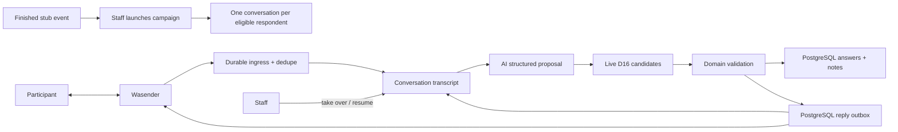
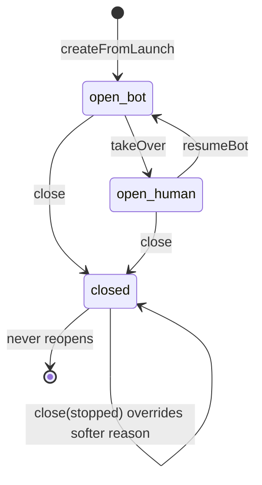

# Post-event feedback conversations

Architecture:
[ADR 0008](../../decisions/0008-post-event-feedback-conversations.md),
state-driven execution:
[ADR 0013](../../decisions/0013-state-driven-feedback-orchestration.md),
storage:
[ADR 0015](../../decisions/0015-postgresql-feedback-conversations.md).
Admin UI:
[`docs/frontend/feedback-conversations.md`](../../frontend/feedback-conversations.md).
Scenarios:
[`post-event-feedback-scenarios.md`](post-event-feedback-scenarios.md).
Policy answers the application may append:
[`post-event-feedback-policy-answers.md`](post-event-feedback-policy-answers.md).
Code organization and refactoring examples:
[`post-event-feedback-readability.md`](post-event-feedback-readability.md).
Current refactor progress and next work:
[`post-event-feedback-refactor-status.md`](post-event-feedback-refactor-status.md).

For a guided first reading, open the standalone
[HTML reading guide](post-event-feedback-reading.html) in a browser. It starts
with six source methods and then follows ordinary, STOP, superseded and
uncertain-send paths.

## Read this first

1. This page — questions, operator semantics, retry / ambiguous-send, config.
2. [Scenarios](post-event-feedback-scenarios.md) — executable loop and known defects.
3. [ADR 0015](../../decisions/0015-postgresql-feedback-conversations.md) — PostgreSQL conversation row.
4. [Database](../mechanisms/database.md) and [queues](../mechanisms/queues.md) — transactions and wake-ups.

Landing archaeology stays in [`docs/history/`](../../history/). Paid-run
history: [`post-event-feedback-rehearsal-history.md`](post-event-feedback-rehearsal-history.md).
Do not rebuild from history files.

Live D16 candidate selection supersedes frozen attendee snapshots.
[D13](#d13--safety-content-travels-the-ordinary-pipeline) is amended: safety
content travels the ordinary pipeline as visible notes.

## Purpose and boundary

Owns campaign eligibility, one WhatsApp conversation per eligible participant,
directed answers/notes, AI extraction validation, human control and the admin
views that navigate the same feedback by event or participant.

Does **not** own WhatsApp transport, participant identity, attendance, consent,
general support or confidential safety-case handling. Wasender is an adapter;
attendance and consent remain upstream gates. Safety-flavoured content is
ordinary visible notes ([D13](#d13--safety-content-travels-the-ordinary-pipeline));
`safety_reports` stays a pre-real-humans gate-pack item.

## Persisted PostgreSQL contract

Schema:
[`packages/database/src/schema/post-event-feedback.ts`](../../../packages/database/src/schema/post-event-feedback.ts).
Repositories: `campaign/`, `extraction/results.repository.ts`, `ingress/`,
`outbox/`, `simulator/sim-outbound.repository.ts`. No `message_deliveries` table;
nothing references `event_attendees`.

| Table                              | Authority rules                                                                                                                                                                                                                                                                                                                                               |
| ---------------------------------- | ------------------------------------------------------------------------------------------------------------------------------------------------------------------------------------------------------------------------------------------------------------------------------------------------------------------------------------------------------------- |
| `feedback_campaigns`               | `event_id` **UNIQUE**; `question_set_version` + `questions` jsonb at launch; status `launched\|paused\|closed`; event FK `ON DELETE RESTRICT`                                                                                                                                                                                                                 |
| `feedback_campaign_summaries`      | One row per campaign; status `pending\|ready\|failed`; trigger `manual\|all_closed`; monotonic epoch + claim fence; `is_partial`; body ≤ 50 000 chars                                                                                                                                                                                                         |
| `feedback_answers`                 | Directed edge; optional `subject_participant_id`; `value_int` for scores; `source_message_ids` non-empty unless `extraction_meta.origin = 'staff'`; `extraction_meta` (model, confidence, **candidate IDs of the run** — D12); `matching_hold boolean not null default false` — [statement, not instruction](#an-avoid-row-is-a-statement-not-an-instruction) |
| Answer uniqueness                  | `UNIQUE NULLS NOT DISTINCT (conversation_id, question_key, subject_participant_id)`                                                                                                                                                                                                                                                                           |
| `feedback_answer_withdrawals`      | Tombstone on the same uniqueness key; `answer_id` with no FK; never updated; deleted only when an operator records their own answer for that slot                                                                                                                                                                                                             |
| `feedback_notes`                   | Directed; `note_type` `activity_interest\|general`; text ≤ 500; subject **NULLABLE** (D18); status `new\|dismissed`; `source_message_ids` non-empty unless staff origin                                                                                                                                                                                       |
| `provider_message_ingress`         | Webhook ack + dedupe; `UNIQUE(chat_jid, provider_message_id)`; statuses `pending\|materialized\|ignored_unmatched\|failed`                                                                                                                                                                                                                                    |
| `feedback_conversations`           | One row per campaign respondent: lifecycle/control/work scalars + bounded JSONB messages/goals/attention/usage. Open-phone partial unique. Deterministic UUID PK. Campaign/respondent FKs `ON DELETE RESTRICT`.                                                                                                                                               |
| `feedback_conversation_executions` | Per-conversation PostgreSQL execution fence (epoch/work revision + lease); no product lifecycle/transcript; no second epoch on the conversation row                                                                                                                                                                                                           |
| `message_outbox`                   | `pending\|claimed\|attempting\|ambiguous\|sending\|sent\|failed\|held\|cancelled`; `dedupe_key` **UNIQUE**; claim/send/attempt/delivery columns folded in                                                                                                                                                                                                     |
| `message_outbox_log`               | Append-only; one row per **inserted** outbox row, same transaction; `outbox_id` **UNIQUE**; never updated                                                                                                                                                                                                                                                     |

All participant/campaign FKs: `ON DELETE RESTRICT` (D18). Conversation ids
keep the deterministic UUIDs. New conversation FKs go to campaigns and
participants. Existing execution/result/outbox `conversation_id` values stay
without a validated FK until import has parents.

| Helper                                              | Behaviour                                                                                                                                                                            |
| --------------------------------------------------- | ------------------------------------------------------------------------------------------------------------------------------------------------------------------------------------ |
| `insertIngressIfAbsent` / `insertOutboxIfAbsent`    | `ON CONFLICT DO NOTHING`                                                                                                                                                             |
| `insertAnswerIfAbsent`                              | `ON CONFLICT DO UPDATE`; writes nothing on a withdrawal tombstone; skips operator-corrected rows (`extraction_meta ? 'corrections'`); merges provenance; accumulates `matching_hold` |
| Operator correction/withdrawal/staff-answer helpers | `findAnswerById`, `updateAnswerValue`, `deleteAnswer`, `recordAnswerWithdrawal`, `insertStaffAnswer`, `deleteAnswerWithdrawal`                                                       |
| `findIngressByIdForUpdate`                          | Materialization fence                                                                                                                                                                |
| `findUnlinkedOutboxByConversationAndBody`           | Observed-outbound correlation                                                                                                                                                        |

Pause, terminal lifecycle and human control fence both claim and provider entry:
the dispatcher reloads campaign + conversation immediately before its send marker.

## Public contract

One finished event → one campaign. Each eligible respondent → at most one
conversation in that campaign.

| Record                             | Authority  | Contract                                                                                                      |
| ---------------------------------- | ---------- | ------------------------------------------------------------------------------------------------------------- |
| Stub `events` / attendance         | PostgreSQL | Upstream facts; candidates selected live (D16)                                                                |
| `FeedbackCampaign`                 | PostgreSQL | Event, question-set version, launch copy snapshot, lifecycle                                                  |
| `FeedbackConversation`             | PostgreSQL | One `feedback_conversations` row: transcript, goals, lifecycle × control, phone, attention, work revision/due |
| `FeedbackAnswer` / `FeedbackNote`  | PostgreSQL | Directed results with message provenance                                                                      |
| Ingress / outbox / execution fence | PostgreSQL | Dedupe, audit, delivery/recovery; epoch lives only on the fence                                               |

No separate campaign-recipient projection. Phone and state live on the
conversation row; admin lists use compact SQL projections and do not load
transcripts for counts.

The [conversation repository](../../../apps/backend/src/modules/post-event-feedback/post-event-feedback-conversation.repository.ts)
owns queries and row locks on the caller's transaction. Its
[state transitions](../../../apps/backend/src/modules/post-event-feedback/post-event-feedback-conversation.state.ts)
take the typed conversation and return `{ changed, conversation }` without
database access. The separate
[persistence mapper](../../../apps/backend/src/modules/post-event-feedback/post-event-feedback-conversation.persistence.ts)
converts PostgreSQL rows and JSON timestamps; the offline importer uses that
same mapper.

A person-specific answer/note is a directed edge
`respondent → subject`. General scores may be subjectless. Otherwise the subject
must be in the **current** live candidate set from
`EventsService.listFeedbackCandidatesForRespondent` (D16) and ≠ respondent.
Unknown names degrade to subjectless notes (D18). Each run records candidate IDs
in `extraction_meta`. The conversation stores **no** candidate list.

Launch snapshots question-set version + copy onto the campaign, builds
conversation goals from those keys, and does **not** freeze attendee IDs.

### Questionnaire versions and signal contract

V1 (historical): `event_score`, `liked`, `meet_again`, `avoid`. Still readable
and extractable; `liked` is not reinterpreted as a V2 question.

V2 (current), in order:

| Key                    | Answer                | Signal                                                    |
| ---------------------- | --------------------- | --------------------------------------------------------- |
| `event_score`          | int 1–5               | Overall experience                                        |
| `table_fit`            | int 1–5               | Group/table fit                                           |
| `participation_ease`   | int 1–5               | Ease of joining the conversation                          |
| `conversation_balance` | int 1–5               | Room to contribute                                        |
| `meet_again`           | zero or more subjects | Positive future-contact intent                            |
| `avoid`                | zero or more subjects | Confidential no-rematch preference — not misconduct proof |

V2 removes `liked`. Numeric answers are subjectless. Consumer rules:

- absence of `meet_again` is unknown, not rejection;
- counts are not popularity/desirability/misconduct scores;
- `avoid` is a human-reviewed seating preference; safety stays on attention;
- `matching_hold = true` never feeds matching — see
  [An avoid row is a statement, not an instruction](#an-avoid-row-is-a-statement-not-an-instruction).

Answers are **confidential, not anonymous**.

### Pre-activation privacy gate (open)

Before messaging real participants, product/privacy/counsel must close and
record: Article 6 legal basis (distinct from WhatsApp permission); layered
privacy notice + real URL (Arts. 13/14); retention for transcripts, answers and
summaries with DSAR/deletion; DPIA or recorded non-threshold decision;
processor/transfer terms for WhatsApp/Meta, Wasender and model routes;
least-privilege audited access to named directed feedback. Until then V2 is a
rehearsal/test contract, not production authorization. Retention, legal basis
and privacy URL are intentionally not invented here.

## Flow



Both directions reach the transcript — see
[outbound transcript entries](#outbound-transcript-entries).

## Outbound transcript entries

Every `message_outbox` row is also recorded on the conversation by
[`FeedbackOutboundTranscriptService`](../../../apps/backend/src/modules/post-event-feedback/outbox/outbound-transcript.service.ts).

| Outbox `kind`                             | Actor   | Producer                              |
| ----------------------------------------- | ------- | ------------------------------------- |
| `intro` / `reminder` / `reply` / `system` | `bot`   | Launch, planner, extraction, STOP ack |
| `staff`                                   | `staff` | Staff inbox send                      |

`system` maps to `bot` because schema v2 reserves `actor: system` for entries
with **no** transport provenance; outbox-backed rows always carry `outboxId`.

### Store order, replay and repair

The producer transaction writes outbox + transcript together.
Append is idempotent by `outboxId`. **Nothing is transmitted that the
transcript did not record.** Append always uses the **stored** body.
Reply/handoff `dedupe_key` anchors on last **participant** `seq`, not
transcript length (length would change under replay and mint a second WhatsApp
message). STOP ack still cannot replay a provider send — dispatcher appends
before Redis slot / `sendText`. Materialize STOP now keeps append, close,
opt-out, outbox cancel, acknowledgement and ingress settlement on one
`AppTransaction`. Extraction persist and conversation cursor/goals/attention
share one transaction after the model returns.

### When the transcript is full

150-message cap or 4 MiB JSONB backstop → `needsAttention` + outbox
**cancelled**. Body > 4096 transcript/WhatsApp limit (outbox allows 10 000) →
cancel + flag, not an infinite poison job.

An inbound STOP still closes the conversation and withdraws consent when the
transcript is full. Its text remains in raw ingress with `transcript_full`
attention; the acknowledgement is cancelled if it cannot be recorded.

## Conversation control

Product surface: lifecycle `open | closed`; control `bot | human`; current goal;
terminal reason when closed. Processing/delivery statuses live elsewhere.

| Rule                | Detail                                                                                |
| ------------------- | ------------------------------------------------------------------------------------- |
| Takeover            | Control → human before staff send accepted                                            |
| Bot enqueue         | Reload control immediately before outbound                                            |
| External outbound   | Unmatched observed outbound → human control; no inferred staff identity               |
| Staff send identity | Client UUID; durable key `feedback-staff-<conversationId>-<clientMessageId>`          |
| Staff send locks    | Conversation advisory lock then campaign row lock; admit only launched + open + human |
| Resume              | Explicit; only participant statements materialize feedback                            |
| STOP                | Deterministic, either control mode                                                    |

## AI extraction

Two parallel structured calls:

| Call       | Input                                                                                   | Output                                                                                       |
| ---------- | --------------------------------------------------------------------------------------- | -------------------------------------------------------------------------------------------- |
| Extraction | Full actor-labelled transcript, question copy, live candidates, goals, accepted results | `goals` (required verdict per goal), `notes[]`, `nextGoal`, `reply`, `handoff`, `confidence` |
| Attention  | Six prior messages + new participant burst                                              | Exactly one result per new participant message ID                                            |

Neither call supplies UI copy/icons. Application verifies provenance,
participant-only sources, cursor-window citation, allowed keys/types, live
subjects, no duplicate results, exact classifier coverage, and that lifecycle/
control/consent permit a reply. Input pressure is measured in tokens.

Goal verdicts: `answered` | `declined` | `not_addressed` | `already_settled`
(required key per goal — not a free `answers[]` array). Validation does not yet
gate declined citations; V1 collapse uses
[the V1 rule](#v1-only-one-sentence-two-questions).

Before model calls, outbox ids in the 150-message aggregate are projected:
`pending|held|claimed|failed|cancelled` omitted from model context;
`attempting|ambiguous|sending|sent` remain. Missing historical PG rows remain
(absence ≠ proof never delivered).

`policyQuestion` names a recognised data-handling question; approved sentences
append via `withPolicyAnswers`. Unapproved → model deferral +
`unanswered_data_question`. Unresolved `safety` uses `closing_after_safety`.

## Invariants

- Membership at launch (finished ∧ present ∧ opt-in ∧ phone); subjects live at
  extraction (D16); answered goals never auto-reopen.
- Structured results preserve respondent, optional subject, campaign,
  conversation and source-message provenance.
- Same row powers “given” and restricted “received” views — not copied onto
  profiles.
- Safety-flavoured content is ordinary visible answers/notes + attention (D13).
- Permanently failed extraction still records attention, one note; never silent.
- Wasender IDs untrusted; deduped before processing.
- Unknown outbound silences bot until explicit resume.
- AI cannot send, change consent or bypass domain validation.
- Feedback conversation mutations take a service-owned `AppTransaction` first.
  Repositories do not open hidden transactions. Model calls stay outside the
  transaction.
- Participant/campaign FKs `ON DELETE RESTRICT`; no FK to `event_attendees`.

## Admin views

Campaign screen: conversations by respondent, progress, control, answers/notes,
attention. Participant profile: feedback given / received (restricted), grouped
by event. Feedback received is not participant-visible by default.

Outbound queue: read-only `listFeedbackOutboxQueue` /
`getFeedbackOutboxMessage` — never Redis. `ambiguous` is not an invitation to
retry. Screen contract:
[feedback-outbound-queue.md](../../frontend/feedback-outbound-queue.md).

### Outbound intent and its historical explanation

Every outbound intent carries versioned `message_outbox.dispatch_context`.
Its purpose must match its kind and dedupe identity. Ordinary extraction
context carries the original model snapshot's control/work generations,
transcript boundary and participant ingress ids. Enqueue and dispatch validate
that contract; an absent or invalid context cannot authorize a send. Current
conversation state still decides exact terminal and human commitments.

The outbound intent service inserts this context with the message and records
why in `message_outbox_log`, using the caller's transaction. The log has one row
per insert and nothing on dedupe replay. It is historical explanation only;
dispatch never reads it for authority. The first intent's context and status
survive replay. See [ADR 0016](../../decisions/0016-feedback-dispatch-context.md).

Components under
[`outbox/`](../../../apps/backend/src/modules/post-event-feedback/outbox/):
`outbound-log.snapshot.ts`, `outbound-log.schemas.ts` (nine origins),
`outbound-log.service.ts`. `getFeedbackOutboxMessage` returns nullable `log`;
unreadable jsonb warns and does not take the screen down.
`listFeedbackOutboxHistory` batches one-word `origin` only.

<a id="wp5-extraction-and-reply-loop-implemented"></a>

## State-driven conversation reconciliation and extraction (implemented)

[`PostEventFeedbackExtractor`](../../../apps/backend/src/modules/post-event-feedback/extraction/extract.service.ts)
via
[`FeedbackConversationReconcileService`](../../../apps/backend/src/modules/post-event-feedback/reconciliation/reconcile.service.ts).
The conversation row owns `{ work_revision, work_next_action_at }`; the fence
table owns epoch/token/lease; BullMQ V2 is a wake-up. Cursor + relational
uniqueness make replay safe.

Start reading the AI path at `PostEventFeedbackExtractor.extract` and its
`extractionFlow`: admit a snapshot, plan the turn, commit it, then notify.
The local Effect recipe keeps Nest dependency injection and existing Promise
services ([ADR 0017](../../decisions/0017-effect-for-local-workflows.md)).

- [Admission](../../../apps/backend/src/modules/post-event-feedback/extraction/extraction-admission.service.ts)
  owns cheap exits and the cursor-only transaction when there is no new
  participant testimony. It checks eligibility before buying model work.

- [Turn planning](../../../apps/backend/src/modules/post-event-feedback/extraction/extraction-turn.service.ts)
  coordinates three mechanisms: `FeedbackModelContextBuilder` assembles live
  context; `FeedbackAiTurnAnalysis` runs the parallel model calls and validates
  their claims; `FeedbackParticipantReplyPlanner` chooses copy, applies policy
  answers and handles rewrite or supersession. Validating model claims is
  distinct from deciding whether current state permits committing a reply.
- [Execution guards](../../../apps/backend/src/modules/post-event-feedback/extraction/extraction-guards.service.ts)
  check current authority before provider entry and review the proposed reply
  against changes made during generation, before enqueue. The dispatcher
  performs the separate final check before the WhatsApp send marker.
- [Turn commit](../../../apps/backend/src/modules/post-event-feedback/extraction/extraction-commit.service.ts)
  owns the single transaction for results, audit, outbox, transcript and
  conversation state. It recomputes the decision if newer work suppresses the
  reply. The results writer and state applier receive its explicit transaction;
  lock order, freshness, outbound permission and terminal transcript identity
  remain visible in the commit coordinator.
- [Capacity recovery](../../../apps/backend/src/modules/post-event-feedback/extraction/extraction-capacity.service.ts)
  owns the separate human-brake transaction after a capacity failure rolls the
  main commit back. Only a failure of the commit can select this recovery.

Model calls stay outside the commit; operator alerts and summary notifications
follow it. Effect adds no retry or cancellation policy. The Promise boundary
preserves original errors for existing queue classification.

A planned turn separates immutable `evidence` (the admitted snapshot and model
results) from the `proposed` goal statuses, hostility, closure and outbound
intent. Commit can suppress that intent without erasing evidence already paid
for. New ingress or newer work recomputes the disposition without a reply and
clears a previously proposed close. An older closing message that already
crossed provider entry only clears the close; it does not recompute the other
outcomes. These cases remain separate because their effects differ.

Runtime [stage records](../mechanisms/runtime-operations.md#logging-and-correlation)
follow these boundaries without owning decisions or transactions.

### One run

```mermaid
sequenceDiagram
  participant Queue as feedback-conversation queue
  participant Run as Reconciler
  participant Row as Conversation row
  participant Events as EventsService
  participant Model as Provider
  participant PG as PostgreSQL
  participant Fence as PostgreSQL execution fence

  Queue-->>Run: reconcile(conversationId, revision)
  Run->>Row: lock; require exact due revision
  Run->>Fence: claim revision → epoch + token
  Run->>Row: reload; plan
  Run->>Events: live D16 candidates + venue snapshot
  Run->>PG: campaign + accepted answers/notes
  par extraction and attention
    Run->>PG: provider-entry fence
    Run->>Row: final state read
    Run->>Model: full transcript / 6+burst
  end
  Run->>Run: domain validation
  Run->>PG: commit answers, notes, audit, outbox and conversation state
  Note over Run,Row: Transcript, cursor, goals and attention share this transaction.
  Run->>Fence: release claim
```

Cheap exits (no model): closed, human control, campaign pause/close, consent
withdrawn, `awaitingHuman`, covered cursor, newer revision. Planner owns quiet
window, reminders, expiry, parked retry — at most one action per execution.

| Guard tag                              | Recovery                                          |
| -------------------------------------- | ------------------------------------------------- |
| `superseded`                           | Ordinary completion; no BullMQ retry; no fallback |
| Claim loss                             | Retryable                                         |
| Missing/backwards execution projection | Unrecoverable quarantine                          |
| Model-generation failure               | Owns fallback / park path                         |

After a provider slot, each model request opens a short provider-entry
transaction (phone + conversation locks, live token, campaign share lock,
consent, durable-ingress fence, final conversation read), then commits
**before** the network call.

### What the model is given and what it may return

Greek-first prompts, English field names, UTC ISO-8601 timestamps on every turn.
Extraction carries question copy, live D16 candidates and accepted results.
Attention has no questionnaire/candidate data; OpenRouter reasoning disabled for
classification by default. Model has no tools/store access.

### Venue context and revision fence

Dynamic per run when `useInFeedback=true`: prompt-safe `label`, optional `type` /
`area`, `priceRange` or `priceLevel`. Never: `provider`, `placeId`,
`contextRevision`, photos, ratings, reviews. Fallible operator context only —
cannot establish answers/notes; humour suppressed on complaints/safety.

Goal, withdrawal and terminal decisions share the pure
[`decideExtractionTurn`](../../../apps/backend/src/modules/post-event-feedback/extraction/turn-decision.ts)
helper, including the recomputation when a reply is suppressed. Deterministic
STOP matching remains in `matching/stop-command.ts`.

When venue was supplied, persistence takes a shared lock on the event and requires
the same `contextRevision`. Edit/clear/toggle during the call → retryable
`validation_failed`, no writes. Fence ends at durable outbox commit; later edits
do not rewrite sent bodies. Decision log records supplied revision (`null` =
venue-blind).

### Validation before any persistence or send

| Rule                                                                 | Effect                                                           |
| -------------------------------------------------------------------- | ---------------------------------------------------------------- |
| Source in this conversation                                          | Reject `unknown_source_message`                                  |
| Source `actor: participant`                                          | Reject `non_participant_source`                                  |
| Allowed question key / note type                                     | Reject at Zod + rules                                            |
| V2 scores subjectless int 1–5                                        | Reject                                                           |
| Subject current candidate ≠ respondent                               | Answer dropped; note subjectless + flagged (D18)                 |
| Already recorded                                                     | Skip                                                             |
| V1 unasked `liked`/`meet_again` declined beside an answer            | Refuse skip (`declined_before_asked`); ask that question         |
| Lifecycle ∧ control ∧ opt-in                                         | Reply suppressed; results may still persist                      |
| Durable inbound beyond model conversation snapshot                   | Ordinary reply suppressed                                        |
| Work/control generation changed during paid call                     | Outbound suppressed; successor keeps cursor                      |
| Classifier incident                                                  | Annotate + attention; nothing suppressed                         |
| Explicit `handoff`                                                   | Neutral handoff copy; notes still recorded                       |
| Handoff that recorded nothing over testimony still holding an answer | Whole run fails (`handoff_discards_testimony`)                   |
| Venue disabled / revision mismatch                                   | Whole transaction rolls back; retryable                          |
| Operator-corrected slot                                              | Refuse (`answer_corrected_by_operator`); raise `answer_revision` |

D18 asymmetric: notes keep text + flag; answers without a resolved subject drop.
Re-proposed different value = revision via upsert; same value = `already_recorded`.
Ambiguous first names → prompt clarifying question, not a guess.

Handoff is validated like other fields: a handoff with no answer/note/safety over
new testimony that still holds an askable answer fails the run so retry (then
fallback) can still read it. Safety signal, recorded answer/note, or
`already_recorded` keep the handoff path; plain “speak to a person” with nothing
to record is honoured.

### Effects of a run

- Answers via `insertAnswerIfAbsent`; notes via `insertNote` with content
  signature re-read under lock.
- Goals advance `pending < asked < skipped < answered` from stored + new answers;
  `asked` only from outbound that actually poses a question.
- Withdrawal (no answers/notes/question, still-named `nextGoal`): remaining goals
  `skipped`, `awaitingHuman` + flag — does **not** close as `completed`.
- Nothing closes over duty of care (handoff or urgent safety → `awaitingHuman`).
- Exactly one outbox row per run (handoff / closing / campaign re-ask / model
  reply), capped by [one send per wording](#one-send-per-wording); transcribed
  as `actor: bot` with `outboxId`.
- `close(completed)` only when every goal terminal **and** no safety signals this
  run.
- Named attention via `raiseAttention` — [naming the raise](#naming-the-raise).
  Alert only for safety/handoff when newly recorded.
- Control is **not** seized on AI handoff (D17).

Extraction stops at the outbox; the
[direct dispatcher](#direct-outbox-dispatch-and-transport-implemented) sends.

### One send per wording

Each goal owns two fixed wordings (campaign copy + `_reask` variant). After both
are spent → send nothing on that path, raise `unfinished_questionnaire`. Scope:

| Body kind         | Compare against                                             |
| ----------------- | ----------------------------------------------------------- |
| Campaign wordings | Whole bot transcript                                        |
| Model-written     | Last bot message only (consecutive repeat)                  |
| Reminder nudge    | Inside `reminder_followup` wrapper — never spends a wording |

Does not close, settle or take control.

### Naming the raise

No bare `needsAttention` setter. Every raise goes through `raiseAttention`
(`kind` + anchor). Idempotent on `kind` + `messageId`. Mapping owned by
[`operator-attention.ts`](../../../apps/backend/src/modules/post-event-feedback/extraction/operator-attention.ts);
taxonomy in
[`attention.ts`](../../../apps/backend/src/modules/post-event-feedback/attention.ts).

| Situation                                     | `kind`                     |
| --------------------------------------------- | -------------------------- |
| Classified safety (others reported)           | `safety`                   |
| Respondent is the source                      | `respondent_conduct`       |
| Explicit handoff                              | `handoff`                  |
| D18 subjectless note                          | `unattributed_note`        |
| Answer revision / operator-corrected conflict | `answer_revision`          |
| Bot withdrew / re-ask cap spent               | `unfinished_questionnaire` |
| Unanswered data-handling question             | `unanswered_data_question` |
| Dead-run fallback                             | `extraction_failed`        |
| Unreadable inbound (media)                    | `unreadable_message`       |
| Truncated/edited redelivery                   | `transcript_mismatch`      |
| Transcript full                               | `transcript_full`          |
| Send failed / body too long                   | `undelivered_message`      |
| Message after close                           | `post_closure_message`     |
| STOP with no answers                          | `stopped_without_answers`  |
| Classifier hostility to us                    | `hostile_to_bot`           |

Kinds with no anchor stand once until dismissed. Advancing any goal to `answered`
on a closed/stopped conversation resolves `stopped_without_answers` as
`system:feedback_extraction`.

### The hostility ladder

| Piece     | Where                                                         |
| --------- | ------------------------------------------------------------- |
| Signal    | `hostileToUs` on classifier (separate from safety categories) |
| Counter   | `hostileTurns` on conversation (per **run**, not per message) |
| Threshold | `FEEDBACK_CALM_REPLIES_BEFORE_HOSTILITY_STOP` = 3             |
| Exit line | `POST_EVENT_FEEDBACK_HOSTILITY_STOP_REPLY`                    |
| Silence   | `awaitingHuman`                                               |
| Badge     | `hostile_to_bot`                                              |

`hostileToUs` never becomes a safety category, never sets `matching_hold`, never
pages. A run with any safety signal neither ticks the counter nor stops. Nothing
closes; conversation stays `open` / `optedIn`. Hostile empty ladder never closes
as `completed` (`answeredAnything` shared with closing copy). See
[S65](post-event-feedback-scenarios.md#s65--hostility_stop_never_reaches_a_disclosure).

### A refusal is an ending of its own

Empty ladder that settles with nothing recorded:

| Field              | Value                                                        |
| ------------------ | ------------------------------------------------------------ |
| `lifecycle.reason` | `declined` (not `stopped` / `expired`)                       |
| Reply              | `copy.declined` only when model would otherwise send silence |
| Attention          | None                                                         |

Distinct from withdrawal (bot gave up → stays open), hostility (operator), STOP
(consent).

### Store order and replay

Answers, notes, outbox, transcript, goals, attention and cursor commit in
one service-owned transaction after the model returns. Cursor is the
idempotency fence. Replay is absorbed by answer uniqueness, note signature, outbox dedupe keys
(`feedback-reply-…`, `feedback-closing-…`, `feedback-handoff-…`). Clean replay of
a finished run exits `skipped_no_new_testimony`. Closing keys use generation-
bearing form including `workRevision` so takeover-cancelled terminals do not
block resume; execution epoch is deliberately absent from those keys.

### Model, configuration and cost

Provider registry: `assistant-models.ts`. `FEEDBACK_EXTRACTION_MODEL` defaults
`google/gemini-3.6-flash` (D12); unregistered fails at worker start. Terra
reserved for `FEEDBACK_SUMMARY_MODEL`.

| Env                                    | Role                                                     |
| -------------------------------------- | -------------------------------------------------------- |
| `FEEDBACK_EXTRACTION_REASONING_EFFORT` | Extraction thinking; unset ≠ `none` (omits field)        |
| `FEEDBACK_REPLY_REASONING_EFFORT`      | Conditional rewrite of forwardable drafts; default `low` |
| `FEEDBACK_ATTENTION_REASONING_EFFORT`  | Classifier; default `none` (unset means `none`)          |
| `FEEDBACK_EXTRACTION_SERVICE_TIER`     | OpenAI direct only: `default\|flex\|priority`            |

Effort above `none` raises `maxOutputTokens` (reasoning shares the output
budget). Rewrite failure: answers/notes persist, turn sends **nothing**. Google
routes get permissive `BLOCK_NONE` safety settings on extraction only
([`permissive-safety-settings.ts`](../../../apps/backend/src/modules/post-event-feedback/extraction/permissive-safety-settings.ts)).
Token usage logged per call type.

<a id="d13--safety-content-travels-the-ordinary-pipeline"></a>

## D13 — safety content travels the ordinary pipeline

| Concern              | Rule                                                                             |
| -------------------- | -------------------------------------------------------------------------------- |
| Notes                | Safety-flavoured statements → ordinary `feedback_notes`; nothing suppressed      |
| Handoff              | Attention ≠ participant handoff; only explicit request swaps neutral copy        |
| Operator signal      | `needsAttention` + audit + bounded message metadata; no separate incident record |
| Classification owner | Independent contextual model call only; no keyword classifier                    |
| Provider failure     | Content/refusal → fallback; **provider incident** → park (no note/alert)         |
| Restricted reporting | `safety_reports` deferred; this module writes none                               |

Classifier sees six prior + new burst. Older turns disambiguate but cannot receive
new classifications later. Crude banter alone is not a safety signal.

### When the respondent is the source

`abuse_of_a_participant`: the message **is** the incident (degrades/slurs a named
attendee). Prompt guards: abuse at us/nobody stays `incident=false`; ordinary
negative verdict/`avoid` wording stays false; crude attraction without unwanted
act stays false. Application:

1. Cap at `human_follow_up` — never `urgent_human_follow_up` / duty-of-care silence.
2. No safety assurance when every signal in the run is respondent-source.

### When the assurance is sent

Appended by `extract.service` when **all** hold:

1. Signal not respondent-source **and** `incidentDescribed` (announcement alone
   is `incident: true`, `incidentDescribed: false`).
2. Assurance sentence not already present in any bot transcript turn.
3. Run is not already promising a human via handoff copy.

### An avoid row is a statement, not an instruction

**Invariant.** A `feedback_answers` row records what was said. Rows with
`matching_hold = true` must be **excluded** by any future seating/matching
consumer. There is no matching consumer today — document the contract before one
exists.

| Marker                                                                                                                                           | Role                                                                                |
| ------------------------------------------------------------------------------------------------------------------------------------------------ | ----------------------------------------------------------------------------------- |
| [`feedback-answers-consumer-boundary.spec.ts`](../../../apps/backend/src/modules/post-event-feedback/feedback-answers-consumer-boundary.spec.ts) | Fails if `feedback_answers` is referenced outside this module / schema / migrations |
| `matching_hold`                                                                                                                                  | Sticky boolean set when a cited message is respondent-source in the same run        |
| This section                                                                                                                                     | Why / how to consume                                                                |

Hold is sticky on upsert (`or`). Abuse in a later burst than the answer it
explains may leave the earlier row unheld. No operator UI to set/clear the hold.
`matching/` is name-resolution + STOP — not table matching.

### Two kinds of dead run

| Kind                   | `failureCause`                             | Treatment                                                        |
| ---------------------- | ------------------------------------------ | ---------------------------------------------------------------- |
| Conversation / request | `provider_refusal`, `validation_failed`, … | [Deterministic fallback](#deterministic-fallback-for-a-dead-run) |
| Provider / account     | `provider_error`                           | [Park](#parking-a-provider-incident)                             |

`provider_error` only where code can point at the provider: missing client,
retryable `APICallError`, or
`FEEDBACK_PROVIDER_ACCOUNT_FAULT_STATUS_CODES` (`401`–`404`). OpenAI empty balance
as structured `429` + `insufficient_quota` /
`credit_balance_exhausted` → account fault. `400`/`422` stay refusal. Never
classify by error-message prose.

### Deterministic fallback for a dead run

[`PostEventFeedbackExtractionFallback.apply`](../../../apps/backend/src/modules/post-event-feedback/extraction/fallback.service.ts)
on permanent non-provider generation failure (including exhausted retries after
`handoff_discards_testimony`):

1. Attention + audit with bounded cause (`provider_refusal|validation_failed|unknown`).
2. One ordinary generic note (`origin: "deterministic_fallback"`; no model/
   confidence).
3. **No bot message** (re-asking the open goal would repeat a just-answered
   question).

Subject only when exactly one current D16 name matches; else subjectless + D18
flag. Idempotency: cancelled `system` outbox
`feedback-fallback-<conversationId>-<testimonySeq>`. Sets `awaitingHuman` and
clears `work.nextActionAt` without advancing revision.

### Parking a provider incident

[`park`](../../../apps/backend/src/modules/post-event-feedback/extraction/fallback.service.ts):
**no note, outbound, attention reason or alert**.

| Field                | Meaning                      |
| -------------------- | ---------------------------- |
| `parkedSince`        | First park clock             |
| `parkedRuns`         | Park count / retry ordinal   |
| `parkedNoticeSentAt` | Participant notice sent once |

Planner retries via `FEEDBACK_EXTRACTION_PARK_RETRY_MS`; ceiling
`FEEDBACK_EXTRACTION_PARK_MAX_MS` (6h). After
`FEEDBACK_EXTRACTION_PARK_NOTICE_AFTER_MS` (30m), one
`POST_EVENT_FEEDBACK_EXTRACTION_PARKED_NOTICE` (no cause, no person/time promise).
Fences: `parkedNoticeSentAt`, dedupe `feedback-parked-<conversationId>-notice`,
legacy `extractionFallbackAckSent`. Reminder planner stands down while parked.
Campaign summary exposes `extractionParkedCount` (not inside `needsAttentionCount`).

### Operator alert seam

[`FeedbackOperatorAlert`](../../../apps/backend/src/modules/post-event-feedback/operator-alert.ts):
pages only for safety, explicit handoff or terminal extraction failure when the
reason was newly recorded. `FEEDBACK_OPERATOR_ALERT_MODE`: `log` (default) | `off`.
WhatsApp-to-operator is a named out-of-scope extension.

Focused extraction coverage: offline eval
([`post-event-feedback-extraction-eval.spec.ts`](../../../apps/backend/src/modules/post-event-feedback/post-event-feedback-extraction-eval.spec.ts)),
validation/orchestration/replay/park/hold/boundary specs under
`apps/backend/src/modules/post-event-feedback/`. No test calls a provider.

## Failure and recovery

No worker waits live for a reply. Bounded wake-ups reload durable state;
conversation due columns and PostgreSQL pending rows repair lost Redis
coordination. Nothing claims exactly-once: replay repairs forward (may re-bill
a model call).

| Failure                                   | Treatment                                     |
| ----------------------------------------- | --------------------------------------------- |
| Terminal extraction (non-provider)        | Fallback note + attention                     |
| Provider incident                         | Park + durable retry                          |
| Planning/reminder/expiry/settlement throw | Ordinary failed wake-up; no fallback evidence |
| `superseded`                              | Release claim; no settle from stale snapshot  |
| Execution claim loss                      | Rethrow for BullMQ retry                      |
| Execution invariant                       | Unrecoverable; bypasses fallback              |

Staging must prove `messages.upsert` observes primary-phone / WhatsApp Web
outbound before activation; otherwise restrict staff sends to a single-writer path.

## Extension points and experiments

- Versioned question sets, not prompt-only goals.
- New note types only with named product use, visibility and retention.
- Summarization/segments only after fixtures prove full-transcript cost/harm.
- Classifier window changes only with held-out incident/banter evals.
- Pre-activation fixtures: bursts, takeover/STOP, external outbound, ambiguous
  names, safety language, duplicate/out-of-order webhooks, long context,
  primary-phone sends, failed-webhook retry.

## Product artifacts and database ops

| Artifact            | Source                                  | Contract                                                                      |
| ------------------- | --------------------------------------- | ----------------------------------------------------------------------------- |
| Question sets V1+V2 | `packages/database` + `question-set.ts` | `CURRENT_POST_EVENT_FEEDBACK_QUESTION_SET_VERSION` = `2`                      |
| Campaign copy       | `resolveCampaignCopy`                   | Per-key merge over versioned defaults                                         |
| STOP matcher (D14)  | `matching/stop-command.ts`              | Commands (whole message), courtesy suffixes, phrases (word-boundary anywhere) |
| Extraction fixtures | `post-event-feedback-fixtures.ts`       | Typed Greek transcripts + expected outcomes                                   |

Ops: package constraint tests for uniqueness/RESTRICT; apply migrations with the
database package migrator before runtime use.

## Ingress and materialization

Behind `WASENDER_WEBHOOK_ENABLED` (default false). HTTP edge
([`ingress.service.ts`](../../../apps/backend/src/modules/post-event-feedback/ingress/ingress.service.ts)):
INSERT ingress → enqueue `feedback.materialize.v1` → 200. Failed enqueue → 503.
Never reads a conversation or calls a model.

### The materialize job

`PostEventFeedbackMaterializer` owns route selection and the operation observer.
The inbound, STOP, closed-conversation and observed-outbound services own their
cohesive use cases. `PendingFeedbackIngressService.applyPending` owns the shared
replay protocol: transaction → ingress row lock → pending check → optional
conversation mutex → handler writes on the supplied transaction. Queue wake-ups
and summary notifications remain after commit. Unmatched body retention follows
the table below; it is not changed by this ownership split.

| Situation                | Outcome                    | Effects                                                                      |
| ------------------------ | -------------------------- | ---------------------------------------------------------------------------- |
| Already terminal         | `already_processed`        | Replay no-op                                                                 |
| No matching conversation | `ignored_unmatched`        | Body retained; not AI-processed (D10)                                        |
| STOP                     | `inbound_stopped`          | Close `stopped`, cancel queued outbox, withdraw opt-in, one `stop_ack` (D14) |
| Inbound reply            | `inbound_materialized`     | Idempotent append + quiet-window revision                                    |
| No usable text           | `inbound_not_materialized` | Attention; ingress `failed`                                                  |
| Outbound ↔ outbox        | `outbound_correlated`      | Delivery columns only                                                        |
| Outbound ↔ open thread   | `outbound_external`        | Take over + append (D17)                                                     |

Phone resolution: `findOpenByPhone` + partial unique index (D9). STOP before any
model, either control mode. Outbound body fallback excludes `pending`/`claimed`.
Delivery status never downgrades.

Replay-safe order: conversation append or STOP, then the ingress terminal
fence (`SELECT … FOR UPDATE` on ingress) in the same service transaction.
STOP and media-notice transactions take the campaign share lock before
mutating the conversation row, matching campaign resume's lock order.
Per-phone/chat session
advisory lock drains `ingress_order`. Maintenance re-enqueues pending ingress
older than `FEEDBACK_INGRESS_PENDING_RECOVERY_MINUTES` and republishes missing
due-work wake-ups. Materialization does not send; extraction inserts outbox,
dispatcher claims.

## Direct outbox dispatch and transport (implemented)

[`MessageOutboxDispatcherService`](../../../apps/backend/src/modules/post-event-feedback/outbox/dispatcher.service.ts)
polls PostgreSQL (no steady-state relay). One-second pass: quarantine expired
attempts, claim up to four launched rows (`FOR UPDATE SKIP LOCKED`), oldest
unresolved per conversation, Redis limiter across replicas.

The batch dispatcher owns the short claim transaction; the outbox repository
selects and updates rows on its supplied transaction. Claim commits before
per-conversation preparation, pacing and transport. `FeedbackDispatchAttemptService`
coordinates one message. `FeedbackDispatchPreparationService` owns guards and
the final marker transaction, `FeedbackDispatchSettlementService` owns provider
outcomes and uncertain-delivery projection, and `FeedbackDispatchRecoveryService`
owns expired-attempt quarantine. Quarantine and delivery finalization retain
their separate transactions. The poll loop and provider adapters are unchanged.

Eligibility is checked before pacing and again inside the locked preparation
transaction. The pure [conversation dispatch policy](../../../apps/backend/src/modules/post-event-feedback/outbox/dispatch-eligibility.ts)
evaluates already loaded campaign/conversation state. The dispatcher owns
ordered reads, consent and reply-currency checks, and token-fenced claim
settlement. Earlier exits skip later queries; ordinary reply currency is checked
only during locked preparation.

| State                           | Meaning                                  |
| ------------------------------- | ---------------------------------------- |
| `pending`                       | Claimable                                |
| `claimed`                       | Lease; reclaimable before provider entry |
| `attempting`                    | Provider may have been entered           |
| `ambiguous`                     | Unknown after entry; never auto-resent   |
| `sent` / `failed` / `cancelled` | Terminal                                 |
| `held`                          | Explicit park                            |
| `sending`                       | Legacy bridge only                       |

Before send marker: phone lock → conversation lock → campaign share lock;
reload conversation + consent; ordinary replies compare their immutable
`message_outbox.dispatch_context` generations; pending ingress cancels
stale copy; then `attempting`. Accepted → `sent`; explicit reject → `failed`;
unknown → `ambiguous` + `awaitingHuman` + `undelivered_message`. Cancellation
never touches `attempting`/`sending`/`ambiguous`. Exact lifecycle-anchored STOP
ack is the only automated FIFO exception through pause/close.

### Transport boundary

| `TRANSPORT_MODE` | Adapter                                                    |
| ---------------- | ---------------------------------------------------------- |
| `disabled`       | Deterministic rejection                                    |
| `simulated`      | `feedback_sim_outbound` sink (+ simulator HTTP when gated) |
| `wasender`       | `WasenderClient.sendText` after Redis limiter              |

`messages.update` upgrades delivery columns only; unmatched ids are counted
no-ops.

## Simulated transport and production rehearsal

Local-first (D2): `TRANSPORT_MODE=simulated` + durable sink. Production requires
`FEEDBACK_PRODUCTION_REHEARSAL_ENABLED` + `FEEDBACK_SIMULATOR_ENABLED`, simulated
transport, Clerk, real models (billable), no stub/Wasender session/webhook.
Outbound stays in the sink.

| Surface                                          | Purpose                                                                               |
| ------------------------------------------------ | ------------------------------------------------------------------------------------- |
| `POST/GET …/simulator/inject                     | thread                                                                                | catalog                            | preflight | runs` | Manual inject + paid headless eval |
| `GET …/burst/catalog                             | accounting`                                                                           | Rehearsal catalogue + token ledger |
| `FEEDBACK_EXTRACTION_STUB`                       | Scripted model (simulator gate; refused in production)                                |
| `pnpm feedback:simulate` / `pnpm feedback:burst` | Headless runners (`prova` profile, fixture slots 0–9, `--seed-only`, `--live-guests`) |

Fault profile is process-wide (`faultMode`/`percent`/`seed`/`maxDelayMs`);
changing it requires restarting API + all feedback workers. Paid runs need
`--confirm-paid-run`; transport faults need `--confirm-transport-faults`.
Live guests need `--live-guests` + `--confirm-live-guests` and a paid profile.
Slots are durable namespaces — never cleanup targets in production. Local reset:
`pnpm feedback:burst:reset --yes` (slot 0) or `--all-feedback` —
rejected in production.

Production paid rehearsal: tunnel PG/Redis, Clerk JWT with `azp` via
[`scripts/feedback-burst-prod-auth.mjs`](../../../scripts/feedback-burst-prod-auth.mjs),
close leftover campaigns over HTTP, unused fixture slot, teardown revoke.
Details and learning:
[`post-event-feedback-rehearsal-history.md`](post-event-feedback-rehearsal-history.md).
Commit before paid runs; track JSON under `report/`, not HTML.

<a id="schema-v2--post-event-feedback-conversation"></a>

## Schema v2 — post-event feedback conversation

The typed aggregate remains
[`FeedbackConversationDocument`](../../../apps/backend/src/modules/post-event-feedback/post-event-feedback-conversation.document.ts).
Runtime persistence is one `feedback_conversations` row. The adapter
[`post-event-feedback-conversation.persistence.ts`](../../../apps/backend/src/modules/post-event-feedback/post-event-feedback-conversation.persistence.ts)
preserves the in-memory / HTTP view (`toDocument`, `toLaunchInsert`).
`schemaVersion`, `purpose` and `channel` are constants, not stored columns.
Assistant schema v1 stays on Mongo; see [conversations.md](conversations.md).

One row per (campaign, respondent). Transcript + conversation state — not
delivery or answer store.

```text
id                       uuidv5(campaignId, respondentParticipantId)
campaign_id / respondent_participant_id / phone_at_launch
lifecycle_* / staff_close_* / control_*
goals                    jsonb [ { key, ordinal, prompt, status } ]
messages                 jsonb [ { id, seq, actor, text, provenance, attention, at } ]
extraction_* / parked_* / cursor_seq / extraction_usage
needs_attention / work_revision / work_next_action_at / hostile_turns / reminded_at
```

`work.executionEpoch` is joined from `feedback_conversation_executions` when a
fence row exists. `work.campaignResumeGeneration` is derived from
`feedback_campaigns.resume_generation`. Neither is stored again on the
conversation.

Goals from campaign versioned question set + launch copy snapshot. **No candidate
list.** Answers/notes/ingress/outbox/audit stay in sibling PostgreSQL tables.

### Identity and idempotency

Deterministic `_id`; `createFromLaunch` returns `{ created: false }` for existing
docs including STOP-closed — never recreates.

### Lifecycle and control



Lifecycle ⊥ control. First close wins except `stopped` overrides softer reasons
(D14). `takeOver` requires an open conversation under bot control.
`control.source`:
`launch|staff_action|external_outbound`.

### Messages and provenance

Contiguous `seq` allocated while the conversation row is locked. Idempotent by `ingressId` /
`outboxId` / stable `id`. Conflicting replay rejected.

| Actor         | Required provenance                  |
| ------------- | ------------------------------------ |
| `participant` | `ingressId`                          |
| `bot`         | `outboxId`                           |
| `staff`       | `outboxId` or `ingressId` (external) |
| `system`      | neither; stable `id`                 |

Only participant messages carry `attention`. `mergeMessageAttention` is additive.

### Goal progress

Monotonic `pending < asked < skipped < answered` (D16). `answered` outranks
`skipped`. Deliberate demotion `skipped → asked` when a sent question-shaped
reply carries `askedGoal`. Withdrawal settles open goals as `skipped` +
`awaitingHuman`.

#### V1 only: one sentence, two questions

For V1, refuse `declined` for still-`pending` `liked`/`meet_again` when the same
proposal answered another goal (`declined_before_asked` → campaign ask).
`avoid` is outside the rule. V2 has no equivalent (no `liked`).

### Extraction cursor, attention and capacity

`cursorSeq` monotonic, never past transcript. Classifier targets = new burst only.
Cap 150 messages / 4 MiB; stored inbound text may reach 64,000 characters.
Outbound text remains capped at 4096 characters. Capacity exhaustion raises
attention; outbound additionally cancels the outbox row.
Appends and classifier annotations check PostgreSQL's JSONB size before updating
the transcript. If annotations cannot fit, extraction rolls back, then raises
`transcript_full` and sets `awaitingHuman` with due work cleared. Raw testimony
and the unread cursor remain available to staff; the same impossible write does
not keep buying model calls. The human brake rechecks ownership and revision
under a conversation row lock so newer work or control changes win.

### Repository contract

| Method                                                                                         | Contract                                    |
| ---------------------------------------------------------------------------------------------- | ------------------------------------------- |
| `createFromLaunch`                                                                             | Deterministic `_id`; idempotent             |
| `findOpenByPhone`                                                                              | Inbound resolution (D9)                     |
| `listForCampaign`                                                                              | Compact summaries, no transcripts           |
| `appendMessage`                                                                                | Contiguous seq, provenance idempotency, cap |
| `mergeMessageAttention`                                                                        | Additive strengthen only                    |
| `takeOver` / `resumeBot` / `close`                                                             | Explicit transitions                        |
| `markAwaitingHuman`                                                                            | Brake + clear due without revision bump     |
| `advanceCursor` / `updateGoalStatuses`                                                         | Monotonic                                   |
| `raiseAttention` / `resolveAttentionReason`                                                    | Named badge                                 |
| `markReminded` / `markWorkDue` / `markCampaignWorkDue` / `settleWorkExecution` / `listDueWork` | Durable work; no `beginWorkExecution`       |

### Indexes

| Index                                          | Purpose                        |
| ---------------------------------------------- | ------------------------------ |
| `feedback_conversations_open_phone_uidx`       | Partial unique open phone (D9) |
| `feedback_conversations_campaign_updated_idx`  | Campaign list                  |
| `feedback_conversations_work_due_idx`          | Due-work recovery              |
| `feedback_conversations_closed_phone_idx`      | Latest closed by phone         |
| `feedback_conversations_attention_updated_idx` | Overview attention facet       |
| `feedback_conversations_lifecycle_state_idx`   | Open/closed counts             |

<a id="wp7-campaign-service-and-schedulers-implemented"></a>

## Campaign service and current-state scheduling (implemented)

Explicit campaign [topic analysis](campaign-topic-analysis.md) is an additive
backend workflow over immutable snapshots of active extracted notes. It uses
cached OpenRouter embeddings and a bounded Python subprocess, with PostgreSQL
run/result authority. It does not alter the live loop or the campaign summary
below; staff, dismissed and deterministic fallback notes are outside its input.

Staff HTTP under `/feedback/campaigns`, one conversation planner, one maintenance
job.

### Launch and kill switch

| Action              | Gate / effect                                                                                                                     |
| ------------------- | --------------------------------------------------------------------------------------------------------------------------------- |
| `launch`            | Finished event ∧ ≥1 eligible; per attendee: conversation + intro outbox + transcript + audit + durable wake-up                    |
| `pause` / `resume`  | Status toggle; pause idles planner/claims; resume increments `resume_generation` and revises open-row due work in one transaction |
| `close`             | Cancel queued outbox except exact STOP acks; leave conversations for STOP/expiry/staff                                            |
| `startConversation` | D17 create-if-missing; never recreates STOP-closed                                                                                |

### Reminder, expiry and durable recovery

The reconciler executes the planner's `remind` and `expire` decisions through
[`FeedbackConversationInactivityService`](../../../apps/backend/src/modules/post-event-feedback/reconciliation/conversation-inactivity.service.ts).
This service owns the reminder/expiry guards and their atomic conversation,
outbox, transcript and audit effects; expiry notifies summaries after commit.
[`PostEventFeedbackSweepService`](../../../apps/backend/src/modules/post-event-feedback/sweeps/sweep.service.ts)
owns checkpointed ingress recovery and publishes materialization wake-ups after
the recovery page commits.

| Planner action | Contract                                                                                                                                                 |
| -------------- | -------------------------------------------------------------------------------------------------------------------------------------------------------- |
| `remind`       | Up to `FEEDBACK_MAX_REMINDERS` (2); rung N after N × `FEEDBACK_REMINDER_AFTER_HOURS` (24) silence; skip closed/human/opt-out/inactive/awaiting/attention |
| `expire`       | `FEEDBACK_EXPIRE_AFTER_HOURS` (72); silent close `expired`; fenced against pending inbound                                                               |
| `wait`         | Persist next quiet/reminder/expiry/park timestamp as new work revision                                                                                   |

`feedback.maintenance.v2` repairs pending ingress, due conversation work and
pending/stale summary intent — keyset pages + PostgreSQL checkpoints; finite
wrap. It does not run a resume-ack repair protocol. Does not separately scan
reminder/expiry/extraction candidates. After offline import, pending
`work_next_action_at` values stay discoverable here.

### Staff HTTP contract

| Method | Path                                                  | `operationId`                    |
| ------ | ----------------------------------------------------- | -------------------------------- |
| `GET`  | `/feedback/campaigns`                                 | `listFeedbackCampaigns`          |
| `POST` | `/feedback/campaigns/launch`                          | `launchFeedbackCampaign`         |
| `GET`  | `/feedback/campaigns/:campaignId`                     | `getFeedbackCampaign`            |
| `POST` | `/feedback/campaigns/:campaignId/pause`               | `pauseFeedbackCampaign`          |
| `POST` | `/feedback/campaigns/:campaignId/resume`              | `resumeFeedbackCampaign`         |
| `POST` | `/feedback/campaigns/:campaignId/close`               | `closeFeedbackCampaign`          |
| `POST` | `/feedback/campaigns/:campaignId/conversations/start` | `startFeedbackConversation`      |
| `GET`  | `/feedback/campaigns/:campaignId/summary`             | `getFeedbackCampaignSummary`     |
| `POST` | `/feedback/campaigns/:campaignId/summary`             | `requestFeedbackCampaignSummary` |

### Campaign summary

[`PostEventFeedbackCampaignSummaryService`](../../../apps/backend/src/modules/post-event-feedback/summary/summary.service.ts)
→ `feedback_campaign_summaries` on `feedback.summarize-campaign.v2`.
`FEEDBACK_SUMMARY_MODEL` (default Terra) at `FEEDBACK_SUMMARY_REASONING_EFFORT`
(default `high`). Triggers: `manual` POST or `all_closed` via
`notifyIfLastConversationClosed`. Partial when open conversations remained.
Simulator suppresses automatic requests; staff POST remains.

Execution: campaign row lock → seven-minute PG lease + heartbeat; concurrency 3.
Read model publishes `executionEpoch` + `claimExpiresAt` (not `claimToken`).
Score averages/distributions/directed counts are deterministic from answer rows.
Model returns versioned JSON document v4 (`curiosities`, `gossip`, `actions`,
`wentWell`/`wentWrong` as `{ text, weight: low|medium|high }[]`, optional
`missing`) with per-field list ceilings (`gossip`/`wentWrong` 10,
`wentWell`/`curiosities`/`actions` 5). Stored v2/v3 bodies project forward on
read (`weight: medium` for plain strings). Gossip voice is observational
stand-up over harmless table drama; harm stays in `wentWrong` at high weight.
No participant rankings; `avoid` is no-rematch preference unless attention
evidence says otherwise. Event detail exposes nullable `feedbackCampaignId`.

## Staff conversation inbox HTTP

[`PostEventFeedbackConversationService`](../../../apps/backend/src/modules/post-event-feedback/inbox/conversation.service.ts):
list/detail/results + capability-gated actions. No extraction/relay changes.

| Concern                 | Contract                                                                               |
| ----------------------- | -------------------------------------------------------------------------------------- |
| List / detail / results | Compact projections; full transcript with outbox delivery join; filtered answers/notes |
| Display names           | Server-resolved; `null` for dangling ids (D18)                                         |
| Capabilities            | `canTakeOver`, `canResumeBot`, `canClose`, `canSendStaffMessage`                       |

### Actions

| Action                    | Gate                                     | Effect                                                   |
| ------------------------- | ---------------------------------------- | -------------------------------------------------------- |
| Take over / resume        | open + appropriate control               | Control transition + audit                               |
| Close                     | open (STOP-closed rejected)              | `close(cancelled)` + `staffClose` + cancel queued outbox |
| Staff send                | launched ∧ open ∧ human (UUID replay ok) | `kind=staff` outbox + transcript                         |
| Add note                  | conversation exists; subject ∈ D16       | Staff-provenance note                                    |
| Note review               | note exists                              | `new` ↔ `dismissed`                                      |
| Correct / withdraw answer | answer in conversation                   | See operator corrections                                 |

Staff close keeps lifecycle `cancelled`; operator why lives in `staffClose`.

### Staff-written notes

Ordinary `feedback_notes` with
`extraction_meta: { origin: "staff", staffUserId, candidateIds }`, empty
`source_message_ids`, optional D16 subject, status `new`. Constraint allows empty
citations only for staff origin. Read model publishes derived
`origin: conversation|staff`. Not capability-gated (available after close).

### Operator corrections to recorded answers

| Operation     | Asserts                                  |
| ------------- | ---------------------------------------- |
| `PATCH` value | Wrong number written; int questions only |
| `DELETE`      | Claim should not exist                   |

Correction: edit in place; append `extraction_meta.corrections`
(`{ at, by, from, to, note? }`). Withdrawal: delete row +
`feedback_answer_withdrawals` tombstone same transaction. Freeze:

- `validate-proposal` → `answer_corrected_by_operator` + `answer_revision`;
- `insertAnswerIfAbsent` skips corrected rows and tombstoned slots;
- `deleteContradictedAnswers` skips corrected rows;
- upsert merges `extraction_meta` (preserves corrections array).

Manual withdrawal and replacement of a contradictory staff answer share one
retraction operation in the inbox service: delete, tombstone and full-row audit
snapshot use the caller's transaction. Replacement also records `supersededBy`.

Only staff-recorded answer lifts a tombstone ([operator-recorded answers](#operator-recorded-answers-wp12c)).
Both ops take conversation advisory lock. Conversation `goals[].status` is
**not** demoted on withdrawal.

<a id="operator-recorded-answers-wp12c"></a>

### Operator-recorded answers

`POST …/answers`: directed questions only (`liked`/`meet_again`/`avoid` per
version); required D16 subject; staff provenance; empty citations. Contradicted
keys deleted with ordinary withdrawal tombstones; lifts tombstone on the slot it
fills. Idempotent on the slot. Leaves conversation goals alone. Not capability-gated.

### Staff HTTP contract (inbox)

| Method           | Path                                                                      | `operationId`                                |
| ---------------- | ------------------------------------------------------------------------- | -------------------------------------------- |
| `GET`            | `…/conversations`                                                         | `listFeedbackCampaignConversations`          |
| `GET`            | `…/conversations/:conversationId`                                         | `getFeedbackConversation`                    |
| `GET`            | `…/conversations/:conversationId/results`                                 | `listFeedbackConversationResults`            |
| `GET`            | `…/results`                                                               | `listFeedbackCampaignResults`                |
| `POST`           | `…/take-over` / `resume-bot` / `close` / `messages` / `notes` / `answers` | see OpenAPI                                  |
| `POST`           | `…/attention-reasons/:reasonId/resolve`                                   | `resolveFeedbackConversationAttentionReason` |
| `PATCH`/`DELETE` | `…/answers/:answerId`                                                     | correct / withdraw                           |
| `PATCH`          | `/feedback/notes/:noteId/review-status`                                   | `updateFeedbackNoteReviewStatus`             |

Detail includes `extraction` (cursor/model/unread) and `automation`
(`idle|scheduled|running|parked` + revision / `nextActionAt` / `claimExpiresAt`).
List reports `campaign.extractionParkedCount`. Neither reads Redis.

### Clearing attention

`attentionReasons` published with taxonomy kinds; resolve one at a time; badge
clears only when last unresolved reason dismissed. Close lowers badge only when
nothing unresolved remains — never auto-resolves standing reasons.

## Decisions and references

- [ADR 0008](../../decisions/0008-post-event-feedback-conversations.md)
- [ADR 0013](../../decisions/0013-state-driven-feedback-orchestration.md)
- [ADR 0015](../../decisions/0015-postgresql-feedback-conversations.md)
- [MongoDB conversation authority](../../decisions/0007-mongodb-conversation-authority.md)
- [Assistant vs feedback stores](conversations.md)
- [Events and D16 candidates](events.md)
- [Wasender](../mechanisms/wasender.md)
- [Queues](../mechanisms/queues.md)
- [Database](../mechanisms/database.md)
- [Frontend conversations UI](../../frontend/feedback-conversations.md)
- [Scenarios](post-event-feedback-scenarios.md)
- [Rehearsal history](post-event-feedback-rehearsal-history.md)
- [History / plan](../../history/post-event-feedback-plan-2026-07-25.md)
