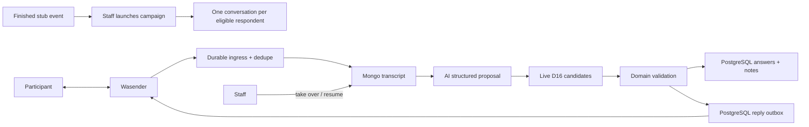
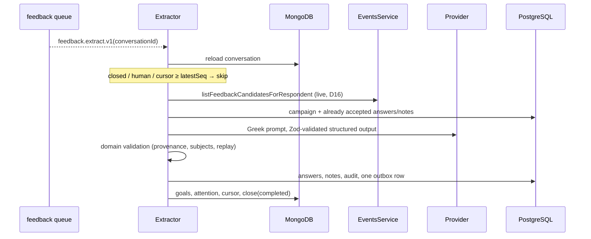
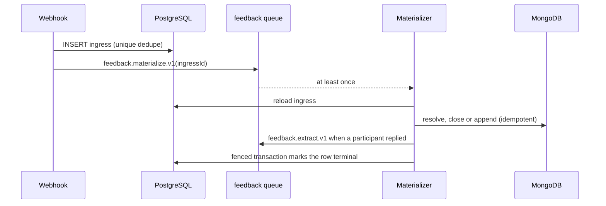

# Post-event feedback conversations

Status: architecture accepted in
[ADR 0008](../../decisions/0008-post-event-feedback-conversations.md);
**WP0 product contract**, **WP1 stub events**, **WP2 PostgreSQL persistence**,
**WP3 Mongo conversation schema v2**, **WP4 ingress + materialization** and
**WP5 extraction + reply loop**, **WP6 outbox relay + transport** and **WP8 dev
simulated transport** are landed. Campaign launch and the admin inbox remain
later work packages. Plan amendments in
[`POST_EVENT_FEEDBACK_PLAN_2026-07-25.md`](../../../POST_EVENT_FEEDBACK_PLAN_2026-07-25.md)
§9 supersede frozen candidate snapshots with live D16 selection.

## Purpose and boundary

This module will collect structured post-event feedback through one WhatsApp
conversation per eligible participant. It owns campaign eligibility, directed
answers and side notes, AI extraction validation, human control and the admin
views that navigate the same feedback by event or participant.

It does not own WhatsApp transport, participant identity, attendance, consent,
general customer support or confidential safety case handling. Wasender remains
an adapter, attendance and consent remain upstream gates, and safety content is
routed to a separately authorized record.

## Persisted PostgreSQL contract (WP2)

Schema and migrations live in
[`packages/database/src/schema/post-event-feedback.ts`](../../../packages/database/src/schema/post-event-feedback.ts).
Typed repository methods for later pipeline packages live in
[`post-event-feedback.repository.ts`](../../../apps/backend/src/modules/post-event-feedback/post-event-feedback.repository.ts).
There is no `message_deliveries` table and nothing references `event_attendees`.

| Table                      | Authority rules                                                                                                                                                                                                  |
| -------------------------- | ---------------------------------------------------------------------------------------------------------------------------------------------------------------------------------------------------------------- |
| `feedback_campaigns`       | `event_id` **UNIQUE** (one campaign per event); `question_set_version` + `questions` jsonb copy at launch; status `launched\|paused\|closed`; event FK `ON DELETE RESTRICT`                                      |
| `feedback_answers`         | Directed edge; optional `subject_participant_id`; `value_int` for scores; `source_message_ids uuid[]`; `extraction_meta` jsonb (model, confidence, **candidate IDs of the run** per D12)                         |
| Answer uniqueness          | `UNIQUE NULLS NOT DISTINCT (conversation_id, question_key, subject_participant_id)` so subjectless scores cannot duplicate on replay                                                                             |
| `feedback_notes`           | Same directionality; `note_type` `activity_interest\|general`; text ≤ 500 chars; subject **NULLABLE** (D18 unknown-name degradation); status `new\|dismissed`                                                    |
| `provider_message_ingress` | Durable webhook ack + dedupe; `UNIQUE(chat_jid, provider_message_id)`; `text` nullable (metadata-only when `ignored_unmatched`, D10); statuses `pending\|materialized\|ignored_unmatched\|failed`                |
| `message_outbox`           | Reply/intro/reminder/staff/system; status includes `held`; `dedupe_key` **UNIQUE**; delivery columns folded in (`delivery_status`, provider ids, sent/delivered/read/played timestamps) — no separate deliveries |

All participant and campaign foreign keys use `ON DELETE RESTRICT` (D18).
`conversation_id` / `matched_conversation_id` are Mongo conversation UUIDs with
no PostgreSQL FK. Repository helpers:

- `insertIngressIfAbsent` / `insertOutboxIfAbsent` / `insertAnswerIfAbsent` —
  `ON CONFLICT DO NOTHING` for webhook, reply and extraction replay;
- `findIngressByIdForUpdate` — the row lock that fences materialization;
- `findUnlinkedOutboxByConversationAndBody` — observed-outbound correlation when
  the provider message id is not known yet;
- given/received answer lists for admin profile views;
- outbox delivery updates and cancel-queued-on-STOP.

## Public contract

One completed event may create one campaign. Each eligible respondent has at
most one active conversation in that campaign.

| Record                     | Authority  | Contract                                                                      |
| -------------------------- | ---------- | ----------------------------------------------------------------------------- |
| Stub `events` / attendance | PostgreSQL | Upstream WP1 facts; candidates selected live (D16)                            |
| `FeedbackCampaign`         | PostgreSQL | Event, question-set version, launch copy snapshot, lifecycle                  |
| `FeedbackConversation`     | MongoDB    | Schema v2: transcript, goals, lifecycle × control, phone at launch, attention |
| `FeedbackAnswer`           | PostgreSQL | Directed normalized question result with message provenance                   |
| `FeedbackNote`             | PostgreSQL | Directed bounded side note with message provenance                            |
| Provider ingress/outbox    | PostgreSQL | Deduplication, audit and delivery/recovery boundary                           |

There is no PostgreSQL campaign-recipient projection. The conversation document
carries the recipient's phone at launch and its own state, and the admin list
reads compact Mongo projections (the assistant list precedent).

A person-specific answer or note is a directed edge:

```text
respondentParticipantId --said about--> subjectParticipantId
```

For example, “Roula would go skiing with Kostas” is owned by Roula's
conversation and points from Roula to Kostas. It does not assert that Kostas
likes skiing. Reversing the IDs changes the meaning.

General event scores may have no subject. A subject must otherwise belong to
the **current** live candidate set from
`EventsService.listFeedbackCandidatesForRespondent` (present attendees minus
the respondent — D16), and the respondent cannot be the subject. Unknown names
degrade to subjectless notes (D18). Each extraction run records the candidate
IDs it used in `extraction_meta`. The conversation document stores no candidate
list, so an attendance correction reaches every later turn instead of a frozen
copy.

Questions are versioned definitions outside the conversation. Campaign launch
snapshots the question-set version and its copy onto the campaign row, then
creates the Mongo goals from those keys; it does **not** freeze attendee
candidate IDs.

## Flow



## Conversation control

The product exposes only:

- lifecycle `open | closed`;
- control `bot | human`;
- a current goal derived from the ordered goal set;
- a terminal reason when closed.

Processing, delivery and queue statuses live on their own records. They do not
inflate the conversation lifecycle.

An explicit staff takeover changes control to human before the staff send is
accepted. Bot jobs must reload control immediately before enqueueing an
outbound reply. An observed outbound message without a matching outbox record
also changes control to human and records external channel activity. The system
does not infer the sender's staff identity.

Resuming bot control is explicit. The first implementation may provide the
actor-labelled human exchange to the model because it can contain useful
follow-up questions and participant answers. Only participant statements may
materialize participant feedback.

STOP and equivalent opt-out commands are deterministic and effective in either
control mode.

## AI extraction

The model input contains:

- actor-labelled ordered transcript;
- question copy and **live** candidates from the shared helper;
- current goals and accepted results;
- allowed output schema and safety/handoff rules.

The model proposes answers and notes with source message IDs. Application code
then verifies:

- source messages exist in the referenced conversation;
- extracted statements came from the participant, not staff or the bot;
- question keys and note types are allowed;
- subject IDs are valid candidates and differ from the respondent;
- replay cannot duplicate an existing answer/note;
- current consent, lifecycle and control permit a reply.

The initial context strategy is the full transcript. Input pressure is measured
by estimated tokens rather than message count. Thresholds, summaries and
segments remain experiments; raw history is retained independently of whatever
context strategy is later selected.

## Invariants

- Campaign membership is decided at launch (finished event ∧ present ∧ opt-in ∧
  phone); subject candidates are selected live at extraction time (D16), never
  guessed, and an already answered goal is never auto-reopened when a candidate
  appears late.
- Every structured result preserves respondent, optional subject, event
  campaign, conversation and source-message provenance.
- The same row powers both “feedback given” and restricted “feedback received”
  views; it is not copied onto participant profiles.
- Normal feedback and confidential safety reports remain separate.
- Wasender IDs are untrusted and deduplicated before processing.
- Unknown outbound channel activity silences the bot until explicit resume.
- AI output cannot send, change consent or bypass domain validation.
- PostgreSQL and MongoDB never pretend to share a transaction.
- Participant/campaign FKs are `ON DELETE RESTRICT`; feedback never FKs
  `event_attendees`.

## Admin views

The campaign screen groups conversations by respondent and shows progress,
control, last activity, structured answers/notes and attention requirements.
Participant links open the canonical profile.

The participant profile offers restricted staff views:

- feedback given: `respondentParticipantId = profile participant`;
- feedback received: `subjectParticipantId = profile participant`;
- results grouped by event with links to the campaign, respondent and source
  conversation.

Feedback received is not participant-visible by default. Avoidance, negative
notes and source identities require explicit authorization and product/privacy
review.

## WP5 extraction and reply loop (implemented)

[`PostEventFeedbackExtractor`](../../../apps/backend/src/modules/post-event-feedback/post-event-feedback-extractor.service.ts)
is the consumer of `feedback.extract.v1`. It is serialized per conversation by
the deterministic job id and made replay-safe by the MongoDB extraction cursor.

### One run



The three cheap exits are reloaded state, not queue assumptions: the job may
have waited behind a STOP, a staff takeover or a newer run. A transcript that
gained no `actor: participant` message advances the cursor and returns without
calling the model at all.

### What the model is given and what it may return

The prompt is Greek-first (the conversation is Greek) with English field names
(they are the persisted contract). It carries the full actor-labelled
transcript, the campaign's question copy snapshot, the **live** candidate list
from the shared D16 helper, the already-accepted results and the output rules.
The model has no tools and no store access.

The proposal is `answers[]`, `notes[]`, `skippedGoals[]`, `nextGoal`, `reply`,
`handoff`, `safetySignal`, `confidence`. `skippedGoals` is a deliberate addition
to the plan's §7 sketch: D3 locks every question as skippable with no answer
row, and without a producer for it a participant whose remaining answer is
«κανένας» could never reach `completed`, so the closing copy would never send.

### Validation before any persistence or send

| Rule                                                | Effect on a violating proposal                                  |
| --------------------------------------------------- | --------------------------------------------------------------- |
| Source message exists in **this** conversation      | Rejected (`unknown_source_message`)                             |
| Source message is `actor: participant`              | Rejected (`non_participant_source`) — staff/bot text is context |
| Question key / note type is in the versioned set    | Rejected at the Zod boundary and again in the rules             |
| `event_score` is subjectless, integer 1–5           | Rejected (`subject_on_subjectless_question`, `invalid_score`)   |
| Subject is a **current** candidate and ≠ respondent | Answer dropped; note degrades subjectless + flagged (D18)       |
| Nothing already recorded is written twice           | Skipped (`already_recorded` / `duplicate_in_run`)               |
| Lifecycle ∧ control ∧ opt-in permit a reply         | Reply suppressed, results still persisted                       |
| Safety signal or handoff                            | All ordinary notes suppressed (D13)                             |

D18's degradation is asymmetric on purpose. A **note** carries the
participant's own words, so an unresolvable mention keeps the note, drops the
subject, records `flaggedForReview` and `unresolvedSubjectName` in
`extraction_meta`, and leaves the name in the text. A directed **answer**
carries no text of its own; without a resolved subject it asserts nothing, so it
is dropped rather than turned into a fabricated note.

Two candidates sharing a first name («Κώστας») cannot be separated by
application code — both ids are valid, so a correct pick and a lucky guess are
indistinguishable. That case is handled in the prompt, which requires a
clarifying question instead of a guess, and the eval asserts the prompt supplies
both display names and the no-guessing rule.

Every persisted row records the model, its confidence and the exact candidate
ids of that run in `extraction_meta` (D12). Under live selection that set is the
only way to explain later why a subject was — or was not — resolvable.

### Effects of a run

- answers via `insertAnswerIfAbsent` (the `NULLS NOT DISTINCT` unique key);
- notes via `insertNote`, guarded by a `(type, subject, normalised text)`
  signature re-read inside the same locked transaction, because `feedback_notes`
  has no natural unique key;
- goal statuses advanced monotonically along `pending < asked < skipped <
answered`, derived from stored **and** newly written answers so a replay repairs
  them;
- exactly one outbox row per run, chosen by the application rather than the
  model: the neutral handoff copy on safety/handoff, else the closing copy when
  every goal is terminal, else the model's reply;
- `close(completed)` when every goal is terminal;
- `needsAttention` + an audit event on safety or handoff.

Extraction stops at the outbox row. The
[WP6 relay](#wp6-outbox-relay-and-transport-implemented) leases it and sends it
through `FeedbackTransport`, so a model proposal reaches a participant only
after a durable PostgreSQL row survived domain validation. The two halves share
no in-process call.

Control is **not** seized on a handoff. `control.source` is `staff_action` or
`external_outbound`; an AI signal is neither, and D17 keeps control changes a
human button. The bot stops asking, flags attention and lets an operator take
over explicitly.

### Store order and replay

PostgreSQL first, the MongoDB cursor last. The cursor is the idempotency fence,
so advancing it before the results are durable would silently drop them. A crash
after the PostgreSQL commit replays the whole run: the unique answer constraint,
the note content signature and the outbox `dedupe_key`
(`feedback-reply-<conversationId>-<cursorSeq>`, `feedback-closing-…`,
`feedback-handoff-…`) all absorb it. That costs one repeated model call — a
repeated bill, never a duplicated answer or a second WhatsApp message. Nothing
claims exactly-once.

### Model, configuration and cost

The provider boundary is the assistant's registry (`assistant-models.ts`), so
extraction cannot invent a provider mapping or substitute a model when a key is
missing. `FEEDBACK_EXTRACTION_MODEL` selects the model and defaults to
`google/gemini-3.6-flash` (D12); an unregistered id fails at worker start rather
than quietly using the default. Provider clients live in the worker module only.

Input pressure is logged in **tokens** — both the pre-call estimate and the
provider's reported usage — because a short thread of long Greek paragraphs is
the expensive case that a message counter would rank as cheap.

### WP5 tests

The offline eval
([`post-event-feedback-extraction-eval.spec.ts`](../../../apps/backend/src/modules/post-event-feedback/post-event-feedback-extraction-eval.spec.ts))
runs the real prompt builder and the real rules over every WP0 fixture with a
recorded proposal in place of a live model call, and asserts each fixture's
expected outcome. The two-Κώστας and unknown-name fixtures additionally carry
adversarial proposals — a guessed subject and an invented candidate id — that
the rules must contain. Focused specs cover the rule set in isolation, the
orchestration (cheap exits, live candidate selection, completion, safety,
opt-in), replay (same job twice, and a crash between the PostgreSQL commit and
the cursor advance), the monotonic goal ladder, model selection and provider
failure classification. No test calls a provider.

## Failure and recovery

No worker remains alive while waiting for a reply. Bounded jobs reload durable
state and are safe to retry.

Durable acknowledgement, cross-store replay, ambiguous-send reconciliation and
the outbox relay now exist (WP4/WP6), and extraction is replay-safe behind the
cursor and the unique keys (WP5). Webhook activation still waits on the staging
acceptance and consent gates, not on missing recovery machinery. Nothing claims
exactly-once: replay repairs forward, and a stalled job can repeat an idempotent
step — for extraction that means repeating a model call, which costs money but
writes nothing twice.

The initial operating assumption is that `messages.upsert` observes manual
outbound messages from the primary WhatsApp application and other linked
clients. Staging must prove this with real device payloads before activation. If
it does not, staff sends during an active conversation must be restricted to the
application or another explicit single-writer workflow.

## Extension points and experiments

Add question definitions through a versioned question set, not prompt-only
changes. Add note types only when they have a named product use, visibility and
retention rule. Add summarization or segments only after fixtures demonstrate
that full transcript context is too costly or harms extraction.

Required pre-activation fixtures include multi-message bursts, admin follow-up,
unknown external outbound, takeover/resume, STOP during takeover, corrections,
ambiguous participant names, unrelated chat, safety language, duplicate and
out-of-order webhooks and long-context extraction. WP4 covers the transport-side
ones — unknown external outbound, STOP during takeover, unrelated chat,
duplicate and out-of-order delivery. WP5's offline eval covers the
extraction-side ones — bursts, staff follow-up, ambiguous names, unknown names,
unrelated chat and safety language — against recorded proposals rather than a
live model; a live-model run against the same fixtures remains part of the
staging acceptance pack. Provider acceptance also requires primary-phone and
WhatsApp Web sends plus a failed-webhook retry test.

## WP0 product contract (implemented)

Versioned questionnaire constants, the deterministic STOP matcher and Greek
extraction fixtures live under
[`apps/backend/src/modules/post-event-feedback/`](../../../apps/backend/src/modules/post-event-feedback/).

| Artifact            | Source                                | Contract                                                                                                                                        |
| ------------------- | ------------------------------------- | ----------------------------------------------------------------------------------------------------------------------------------------------- |
| Question set v1     | `post-event-feedback-question-set.ts` | Keys `event_score`, `liked`, `meet_again`, `avoid`; note types `activity_interest`, `general`; draft Greek copy editable without schema changes |
| STOP matcher (D14)  | `post-event-feedback-stop-matcher.ts` | Pure function; `STOP`, `STOP ALL`, `UNSUBSCRIBE`, `ΔΙΑΚΟΠΗ`, `ΣΤΟΠ`; case-, whitespace- and accent-insensitive                                  |
| Extraction fixtures | `post-event-feedback-fixtures.ts`     | Typed Greek transcripts with expected-outcome annotations for later WP5 evals                                                                   |

Focused unit tests cover matcher edge cases (accents, mixed case) and fixture
integrity. No runtime pipeline, queue or Mongo work is part of WP0/WP2.

## Tests and operations

- Database package constraint tests assert answer `NULLS NOT DISTINCT`
  uniqueness (including null subject), ingress `(chat_jid, provider_message_id)`
  uniqueness, outbox `dedupe_key` uniqueness, RESTRICT FKs and migration SQL.
- Repository tests assert conflict targets for ingress, outbox and answer
  idempotent inserts.
- Apply migrations with the database package migrator before runtime use.

## WP4 ingress and materialization (implemented)

The durable consumer behind the webhook. It stays behind the existing
`WASENDER_WEBHOOK_ENABLED` gate, which remains false by default.

### The request edge

[`PostEventFeedbackIngressService`](../../../apps/backend/src/modules/post-event-feedback/post-event-feedback-ingress.service.ts)
is everything the HTTP process does (D8):

1. one `provider_message_ingress` INSERT, deduplicated by the
   `(chat_jid, provider_message_id)` unique constraint;
2. one `feedback.materialize.v1` enqueue under the deterministic job id
   `feedback-materialize-v1-<ingressId>`;
3. 200.

A redelivery still enqueues, because the first delivery may have crashed between
the committed row and the queue; the job id and the idempotent consumer absorb
the duplicate. A failed enqueue answers 503 rather than a 200 that would hide a
stalled message. The request never reads a conversation, calls a model or sends
anything.

### The materialize job

[`PostEventFeedbackMaterializer`](../../../apps/backend/src/modules/post-event-feedback/post-event-feedback-materializer.service.ts)
reloads the ingress row and decides one outcome per delivery:

| Situation                          | Outcome                    | Effects                                                                                                |
| ---------------------------------- | -------------------------- | ------------------------------------------------------------------------------------------------------ |
| Row already terminal               | `already_processed`        | Nothing; this is the replay path                                                                       |
| Phone matches no open conversation | `ignored_unmatched`        | Body dropped, metadata kept, counter incremented, never AI-processed (D10)                             |
| Inbound STOP                       | `inbound_stopped`          | Close `stopped`, cancel queued outbox, withdraw opt-in, audit, exactly one `stop_ack` outbox row (D14) |
| Inbound reply                      | `inbound_materialized`     | Idempotent transcript append, then one `feedback.extract.v1` for the newest transcript position        |
| Inbound without usable text        | `inbound_not_materialized` | `needsAttention`, ingress `failed`; the durable row keeps the provider metadata for an operator        |
| Outbound matching an outbox row    | `outbound_correlated`      | Delivery columns only — the outbox owns that message's transcript entry, so nothing is appended twice  |
| Outbound matching an open thread   | `outbound_external`        | Take over to human control, append the observed staff message, audit external channel activity (D17)   |

Conversation resolution is the Mongo `findOpenByPhone` lookup backed by the
partial unique index (D9). Nothing infers which event or person an unmatched
message belongs to. Because only open conversations are indexed that way, a
message arriving after closure matches nothing — which is exactly right for a
participant who opted out: the body is dropped and the conversation is never
reopened.

STOP is matched by the WP0 deterministic matcher **before** any model call and
works in either control mode: a takeover does not make opt-out negotiable. The
acknowledgement body comes from the campaign's launch copy snapshot, falling
back to the versioned constant.

An observed outbound is correlated first by provider message id and then by the
oldest unlinked outbox row of that conversation with the same body. That
reconciliation is what keeps an ambiguous send from being sent twice. Delivery
status is never downgraded by a later observation. Outbound correlation by
provider message id also runs when no open conversation matched, so the STOP
acknowledgement — sent to a conversation that just closed — records its delivery
instead of counting as unrelated traffic.

### Why this order is replay-safe



Every MongoDB step runs before the PostgreSQL fence, and every one of them is
idempotent, so a crash replays into a no-op. The fence is a
`SELECT ... FOR UPDATE` on the ingress row inside the transaction that performs
the PostgreSQL side effects, which is what makes concurrent duplicate executions
collapse to a single audit event, a single cancellation and a single
acknowledgement. Extraction is enqueued before the fence for the same reason:
the reverse order would lose the run instead of repeating it.

The known gap is a row committed by the edge whose enqueue never succeeded. It
stays `pending` and is recovered by a provider redelivery; a sweep for
`pending` rows is not implemented.

### Boundaries this package deliberately keeps

Reminders, expiry and campaign launch are not implemented here.
`feedback.extract.v1` has a fixed name, payload and job id so materialization
can enqueue it; WP5 replaced the recording stub with the real consumer without
changing any of them, and that consumer has its own section below. Sending is
likewise not this package's job: extraction only ever **inserts**
`message_outbox` rows and the WP6 relay leases and sends them. Delivery-status
webhooks (`messages.update`) update outbox delivery columns through WP6.

Materialization and extraction outcomes are counted in a process-local counter
surfaced as structured log events, alongside per-run extraction token usage. The
deployment exports traces only, so these are counters for operators reading logs
and for tests, not a metrics backend.

### WP4 tests

Replay and crash behavior is the point of this package, so the focused tests
cover duplicate webhook delivery, double materialization, two concurrent
executions of the same job, out-of-order arrival, STOP during human control, a
replayed STOP that must not acknowledge twice, unmatched traffic keeping
metadata only, outbound correlation without transcript duplication, a delivery
status that must not be downgraded, and the external-outbound takeover. Process
composition tests keep the consumer out of the HTTP graph and the producer edge
gated with the webhook route.

## WP6 outbox relay and transport (implemented)

The email-style lease relay for `message_outbox`, plus the injectable outbound
transport boundary.

### Relay and deliver

[`MessageOutboxRelayService`](../../../apps/backend/src/modules/post-event-feedback/message-outbox-relay.service.ts)
leases due rows with `FOR UPDATE SKIP LOCKED`:

- `pending` rows are claimed into `sending`;
- `held` rows are never leased (D5 supervised mode stays a config away);
- stale `sending` rows past a five-minute recovery horizon are reclaimed so a
  lost BullMQ job can be republished under the same
  `feedback-deliver-v1-<outboxId>` key.

A five-second scheduler publishes `feedback.relay-outbox.v1`. Campaign
`intro`/`reminder` jobs in the same batch receive a staggered BullMQ delay.
STOP/expiry cancellations flip `pending` and `held` rows to `cancelled` through
the existing repository helper; a deliver job that finds `cancelled` or `held`
exits without sending.

[`MessageOutboxDeliveryService`](../../../apps/backend/src/modules/post-event-feedback/message-outbox-delivery.service.ts)
reloads the conversation phone and sends through `FeedbackTransport`. An
unknown provider outcome parks the row (`delivery_status=pending`, keep any
`provider_log_id`) and never calls send again: recovery reconciles via
`getMessageInfo` or waits for the WP4 upsert body-correlation path.

### Transport boundary

| `TRANSPORT_MODE` | Adapter                                                                                                 |
| ---------------- | ------------------------------------------------------------------------------------------------------- |
| `simulated`      | Durable PostgreSQL `feedback_sim_outbound` sink; dev inject/read HTTP when `FEEDBACK_SIMULATOR_ENABLED` |
| `wasender`       | `WasenderClient.sendText` behind a shared-session pacer (minimum interval + jitter)                     |

No development HTTP inject/read endpoints are part of WP6; WP8 adds them behind
`FEEDBACK_SIMULATOR_ENABLED` (off by default, excluded from the published
OpenAPI composition).

### `messages.update`

The webhook edge applies status events to the correlated outbox row's delivery
columns (never downgrading). Unmatched provider message ids are a counted
no-op until an accepted send or upsert correlation has stored the id.

### WP6 tests

Lease / stable job-id idempotency, campaign stagger, session pacing bounds,
unknown-outcome no-retry, cancel-on-STOP statuses, and delivery-status upgrade
without downgrade.

## WP8 dev simulated transport (implemented)

Local-first validation (D2) uses `TRANSPORT_MODE=simulated` with a durable
PostgreSQL outbound sink and authenticated dev HTTP endpoints. Production
rejects `TRANSPORT_MODE=simulated` and never mounts the simulator module.

### Durable simulated outbound

[`SimulatedFeedbackTransport`](../../../apps/backend/src/modules/post-event-feedback/simulated-feedback-transport.service.ts)
implements the same `FeedbackTransport` port as Wasender. Each accepted send
inserts one row into `feedback_sim_outbound` (no foreign keys — dev-only
traffic, simplest replay/query shape). The outbox `provider_log_id` is the sink
row primary key; `provider_message_id` is `sim-<uuid>`.

### Dev inject and sim thread

When `FEEDBACK_SIMULATOR_ENABLED=true`, `NODE_ENV` is not `production`, and
`TRANSPORT_MODE=simulated`, the HTTP process mounts
[`PostEventFeedbackSimulatorHttpModule`](../../../apps/backend/src/modules/post-event-feedback/post-event-feedback-simulator-http.module.ts):

| Operation                             | `operationId`                    | Contract                                                                                                                                                                                                                     |
| ------------------------------------- | -------------------------------- | ---------------------------------------------------------------------------------------------------------------------------------------------------------------------------------------------------------------------------- |
| `POST /dev/feedback/simulator/inject` | `injectFeedbackSimulatorMessage` | `phoneE164`, `text`, optional `fromMe` → `ObservedProviderMessage` → [`PostEventFeedbackIngressService.recordObservedMessage`](../../../apps/backend/src/modules/post-event-feedback/post-event-feedback-ingress.service.ts) |
| `GET /dev/feedback/simulator/thread`  | `getFeedbackSimulatorThread`     | Merges ingress rows and `feedback_sim_outbound` for one phone (WP9 composer)                                                                                                                                                 |

The published `openapi.json` keeps `FEEDBACK_SIMULATOR_ENABLED=false`, so these
routes stay out of the generated admin client until deliberately promoted.

### WP8 tests

Integration coverage runs intro delivery → inject reply → materialize →
`feedback.extract.v1` enqueue (extraction execution remains WP5). Composition
tests assert production cannot enable the HTTP simulator.

## WP3 conversation persistence (implemented)

The MongoDB schema-v2 document, its Zod validators, the repository and its two
reviewed indexes live in the
[conversations module](conversations.md#schema-v2--post-event-feedback-conversation).
What it settles for this module:

- one conversation per (campaign, respondent) under a deterministic
  `uuidv5(campaignId, participantId)` identifier, so launch replay is
  idempotent and a STOP-closed conversation is never recreated;
- product lifecycle `open | closed` with a terminal reason, orthogonal control
  `bot | human` with the reason control changed, and no queue or delivery
  status leaking into either;
- goals built from the WP0 question keys, with prompts from the campaign's
  launch copy snapshot;
- actor-labelled messages with contiguous sequence numbers and
  ingress/outbox/provider provenance, appended idempotently;
- the extraction cursor that keeps replayed runs from duplicating answers;
- `phoneAtLaunch` plus a partial unique index, which is what makes inbound
  phone resolution unambiguous instead of a guess.

Webhook ingestion, the `feedback` queue and the outbox relay landed in WP4/WP6
on top of it, and extraction advances the cursor and the goals in WP5.
Reminders, campaign launch and the admin UI remain unimplemented.

## Decisions and references

- [ADR 0008](../../decisions/0008-post-event-feedback-conversations.md)
- [MongoDB conversation authority](../../decisions/0007-mongodb-conversation-authority.md)
- [Conversation aggregate](conversations.md)
- [Events and D16 candidates](events.md)
- [Wasender transport](../mechanisms/wasender.md)
- [Queues and outbox](../mechanisms/queues.md)
- [Database lifecycle](../mechanisms/database.md)
- [Implementation plan](../../../POST_EVENT_FEEDBACK_PLAN_2026-07-25.md)
