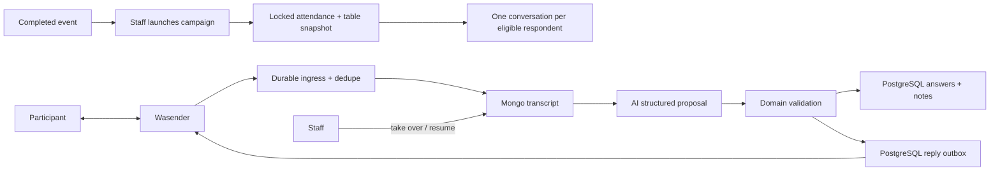

# Post-event feedback conversations

Status: architecture accepted in
[ADR 0008](../../decisions/0008-post-event-feedback-conversations.md);
**WP0 product contract landed** (question set v1, STOP matcher, Greek extraction
fixtures). Persistence, runtime pipeline and admin UI are not yet implemented.

## Purpose and boundary

This module will collect structured post-event feedback through one WhatsApp
conversation per eligible participant. It owns campaign eligibility, directed
answers and side notes, AI extraction validation, human control and the admin
views that navigate the same feedback by event or participant.

It does not own WhatsApp transport, participant identity, attendance, consent,
general customer support or confidential safety case handling. Wasender remains
an adapter, attendance and consent remain upstream gates, and safety content is
routed to a separately authorized record.

## Public contract

One completed event may create one campaign. Each eligible respondent has at
most one active conversation in that campaign.

| Record                  | Authority  | Contract                                                       |
| ----------------------- | ---------- | -------------------------------------------------------------- |
| `FeedbackCampaign`      | PostgreSQL | Event, question version, attendee/table snapshot, lifecycle    |
| `FeedbackConversation`  | MongoDB    | Ordered transcript, actor, goals, lifecycle, bot/human control |
| Campaign recipient      | PostgreSQL | Campaign/respondent/thread link and operational projection     |
| `FeedbackAnswer`        | PostgreSQL | Directed normalized question result with message provenance    |
| `FeedbackNote`          | PostgreSQL | Directed bounded side note with message provenance             |
| Provider ingress/outbox | PostgreSQL | Deduplication, audit and delivery/recovery boundary            |

A person-specific answer or note is a directed edge:

```text
respondentParticipantId --said about--> subjectParticipantId
```

For example, “Roula would go skiing with Kostas” is owned by Roula's
conversation and points from Roula to Kostas. It does not assert that Kostas
likes skiing. Reversing the IDs changes the meaning.

General event scores may have no subject. A subject must otherwise belong to
the conversation's frozen candidate snapshot, and the respondent cannot be the
subject.

Questions are versioned definitions outside the conversation. Campaign launch
snapshots the selected keys/prompts and allowed participant IDs before creating
Mongo goals.

## Flow



## Conversation control

The product exposes only:

- lifecycle `open | closed`;
- control `bot | human`;
- a current goal derived from the ordered goal set;
- a terminal reason when closed.

Processing, delivery and queue statuses live on their own records. They do not
inflate the conversation lifecycle.

An explicit staff takeover changes control to human before the staff send is
accepted. Bot jobs must reload control immediately before enqueueing an
outbound reply. An observed outbound message without a matching outbox record
also changes control to human and records external channel activity. The system
does not infer the sender's staff identity.

Resuming bot control is explicit. The first implementation may provide the
actor-labelled human exchange to the model because it can contain useful
follow-up questions and participant answers. Only participant statements may
materialize participant feedback.

STOP and equivalent opt-out commands are deterministic and effective in either
control mode.

## AI extraction

The model input contains:

- actor-labelled ordered transcript;
- snapshotted questions and candidates;
- current goals and accepted results;
- allowed output schema and safety/handoff rules.

The model proposes answers and notes with source message IDs. Application code
then verifies:

- source messages exist in the referenced conversation;
- extracted statements came from the participant, not staff or the bot;
- question keys and note types are allowed;
- subject IDs are valid candidates and differ from the respondent;
- replay cannot duplicate an existing answer/note;
- current consent, lifecycle and control permit a reply.

The initial context strategy is the full transcript. Input pressure is measured
by estimated tokens rather than message count. Thresholds, summaries and
segments remain experiments; raw history is retained independently of whatever
context strategy is later selected.

## Invariants

- Campaign eligibility comes from a locked attendance/table snapshot, not a
  mutable live query during the chat.
- Every structured result preserves respondent, optional subject, event
  campaign, conversation and source-message provenance.
- The same row powers both “feedback given” and restricted “feedback received”
  views; it is not copied onto participant profiles.
- Normal feedback and confidential safety reports remain separate.
- Wasender IDs are untrusted and deduplicated before processing.
- Unknown outbound channel activity silences the bot until explicit resume.
- AI output cannot send, change consent or bypass domain validation.
- PostgreSQL and MongoDB never pretend to share a transaction.

## Admin views

The campaign screen groups conversations by respondent and shows progress,
control, last activity, structured answers/notes and attention requirements.
Participant links open the canonical profile.

The participant profile offers restricted staff views:

- feedback given: `respondentParticipantId = profile participant`;
- feedback received: `subjectParticipantId = profile participant`;
- results grouped by event with links to the campaign, respondent and source
  conversation.

Feedback received is not participant-visible by default. Avoidance, negative
notes and source identities require explicit authorization and product/privacy
review.

## Failure and recovery

No worker remains alive while waiting for a reply. Bounded jobs reload durable
state and are safe to retry.

Webhook activation remains blocked until the implementation defines and tests
durable acknowledgement, cross-store replay/repair, outbox delivery,
idempotency and ambiguous-send reconciliation. The exact ingress/materialization
protocol is intentionally not invented in this architecture-only change.

The initial operating assumption is that `messages.upsert` observes manual
outbound messages from the primary WhatsApp application and other linked
clients. Staging must prove this with real device payloads before activation. If
it does not, staff sends during an active conversation must be restricted to the
application or another explicit single-writer workflow.

## Extension points and experiments

Add question definitions through a versioned question set, not prompt-only
changes. Add note types only when they have a named product use, visibility and
retention rule. Add summarization or segments only after fixtures demonstrate
that full transcript context is too costly or harms extraction.

Required pre-activation fixtures include multi-message bursts, admin follow-up,
unknown external outbound, takeover/resume, STOP during takeover, corrections,
ambiguous participant names, unrelated chat, safety language, duplicate and
out-of-order webhooks and long-context extraction. Provider acceptance also
requires primary-phone and WhatsApp Web sends plus a failed-webhook retry test.

## WP0 product contract (implemented)

Versioned questionnaire constants, the deterministic STOP matcher and Greek
extraction fixtures live under
[`apps/backend/src/modules/post-event-feedback/`](../../../apps/backend/src/modules/post-event-feedback/).

| Artifact            | Source                                | Contract                                                                                                                                        |
| ------------------- | ------------------------------------- | ----------------------------------------------------------------------------------------------------------------------------------------------- |
| Question set v1     | `post-event-feedback-question-set.ts` | Keys `event_score`, `liked`, `meet_again`, `avoid`; note types `activity_interest`, `general`; draft Greek copy editable without schema changes |
| STOP matcher (D14)  | `post-event-feedback-stop-matcher.ts` | Pure function; `STOP`, `STOP ALL`, `UNSUBSCRIBE`, `ΔΙΑΚΟΠΗ`, `ΣΤΟΠ`; case-, whitespace- and accent-insensitive                                  |
| Extraction fixtures | `post-event-feedback-fixtures.ts`     | Typed Greek transcripts with expected-outcome annotations for later WP5 evals                                                                   |

Focused unit tests cover matcher edge cases (accents, mixed case) and fixture
integrity. No runtime pipeline, queue or PostgreSQL schema is part of WP0.

## Decisions and references

- [ADR 0008](../../decisions/0008-post-event-feedback-conversations.md)
- [MongoDB conversation authority](../../decisions/0007-mongodb-conversation-authority.md)
- [Conversation aggregate](conversations.md)
- [Wasender transport](../mechanisms/wasender.md)
- [Queues and outbox](../mechanisms/queues.md)
- [Implementation plan WP0](../../../POST_EVENT_FEEDBACK_PLAN_2026-07-25.md)
