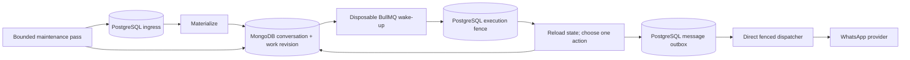

# ADR 0013: State-driven post-event feedback orchestration

- Status: Accepted
- Date: 2026-08-03
- Scope: Post-event feedback scheduling, extraction, reminders, expiry,
  campaign summaries and outbound dispatch. This supersedes the Redis-owned
  feedback execution consequences of ADR 0008; its conversation, consent and
  data-authority decisions remain unchanged.

## Decision

Treat BullMQ as a disposable wake-up mechanism, not as the state machine.
MongoDB owns one monotonic work revision and next-action timestamp on every
feedback conversation. A reconciler reloads current MongoDB and PostgreSQL
state and chooses at most one action: wait, extract, retry a parked extraction,
remind, expire or stop. It then persists the successor intent before enqueueing
the successor wake-up.

PostgreSQL owns execution fencing. One row per conversation grants a bounded
lease with a monotonic epoch and opaque token. An execution must mirror that
epoch into the exact MongoDB work revision before calling a model. Relational
effects and cursor advancement validate the same claim. A stale worker may
finish computation, but it cannot commit effects for a lease or revision it no
longer owns.

The steady-state worker contracts are deliberately small:

| Contract               | Durable authority                                | Queue or runner                                                   | Retry and idempotency                                                                                                  |
| ---------------------- | ------------------------------------------------ | ----------------------------------------------------------------- | ---------------------------------------------------------------------------------------------------------------------- |
| Materialize inbound    | PostgreSQL ingress row                           | `feedback-ingress`, one V1 identifier-only job per ingress ID     | Provider ID and ingress ID dedupe; per-route PostgreSQL advisory lock; pending rows repaired by maintenance            |
| Reconcile conversation | MongoDB `work` plus PostgreSQL execution fence   | `feedback-conversation`, one V2 wake-up per conversation revision | Five transport-level retries; current-state planner; revision, epoch and token fences; deterministic side-effect keys  |
| Summarize campaign     | PostgreSQL pending summary row + execution claim | `feedback-summary`, one V2 job per campaign attempt               | Campaign-row request lock; deterministic attempt ID; epoch/token lease, heartbeat and terminal CAS; maintenance repair |
| Repair durable intent  | PostgreSQL and MongoDB                           | one repeatable V2 job on `feedback-maintenance`                   | Bounded, independently isolated ingress/resume/conversation/summary scans                                              |

Outbound delivery is not a BullMQ job. A direct worker loop claims a bounded
PostgreSQL `message_outbox` batch with `FOR UPDATE SKIP LOCKED`. It can safely
reclaim an expired `claimed` row because no provider call has started. Just
before transport invocation it atomically writes `attempting` and
`send_started_at` under the claim token. Any crash or unknown result after that
marker becomes `ambiguous` and is never automatically resent. Redis provides
only a deployment-wide provider start-rate limiter.

## Invariants

- A conversation has one durable current work revision, even if Redis is empty.
- Every model call begins only after the exact due revision accepts a fresh
  PostgreSQL epoch. Immediately before each provider call, one short transaction
  orders itself against durable inbound, conversation control, campaign status
  and consent, then validates both PostgreSQL ingress and the final MongoDB work
  revision. Its commit is the provider-entry boundary: state that won before it
  prevents spend; state arriving after it cannot refund an entered call.
- A newer participant message or explicit resume schedule increments the work
  revision; an older execution cannot erase that newer schedule. Takeover and
  terminal lifecycle state remain independent authoritative guards and need no
  successor wake-up.
- The rolling quiet window is calculated from the newest participant message,
  so slow typing buys one extraction after silence rather than one extraction
  per fragment.
- Human control, pause, cancellation, consent withdrawal and terminal lifecycle
  are re-read at planning/provider-entry boundaries and again before outbound
  dispatch. Pause freezes automated conversation actions; it is not a queue
  pause that leaves timers semantically running.
- A message or control change that lands during an already-paid model call does
  not roll back valid snapshot answers/notes or refund tokens. It suppresses an
  ordinary stale reply and preserves the newer work revision. A newer message
  may consume only the old cursor window while leaving its later testimony
  unread; a takeover/resume or other control generation leaves the cursor
  untouched, because that successor owns the whole state transition.
- Outbound provider entry orders the webhook phone lock before the conversation
  lock. An ordinary extraction reply must still match its immutable outbox-log
  control/execution/campaign-resume generations and transcript snapshot in both
  MongoDB sequence and PostgreSQL ingress; pending ingress counts as newer.
  Work revision alone is not the ABA token because normal settlement moves a
  producer's N to the reminder successor N+1. Materialization retracts pre-send
  ordinary automation under the same conversation lock while preserving exact
  handoff/terminal and system/staff commitments.
- Outbox rows before `send_started_at` are retryable. Rows after that marker are
  terminal unless provider evidence resolves them; availability never outranks
  duplicate-message safety.
- Mongo keeps outbox-backed transcript audit intent even when a final guard
  cancels it. Model context joins the bounded outbox-status projection and
  removes only provably unsent states; uncertain/provider-crossed states and
  missing historical rows remain. This projection never changes raw sequence
  numbers or cursor settlement.
- Queue job IDs suppress duplicate wake-ups only. Durable compare-and-set writes
  and unique side-effect keys provide idempotency.
- Concurrent summary requests lock the campaign row before deriving an attempt.
  Summary jobs must renew their PostgreSQL claim immediately before provider
  entry and may finish only through the same live epoch/token.
- Maintenance repairs not only a missing summary wake-up but also missing or
  stale automatic summary intent after all MongoDB conversations close. It
  ignores empty/still-open campaigns and refreshes only a projection older than
  the latest terminal conversation.
- Pending-summary and campaign-resume maintenance allocate durable keyset pages
  before queue or cross-store work. Live/poisonous prefixes advance the shared
  cursor, while finite wrap revisits an allocated page lost to process death.

## Failure and recovery

There is still no distributed transaction across MongoDB, PostgreSQL and
Redis. The recovery direction is explicit:

1. Persist business state or work intent first.
2. Publish an identifier-only wake-up second.
3. Let the maintenance job rediscover a missing wake-up or reconstruct missing
   derived summary intent from durable state.
4. Let a lease expire after worker death; require a newer epoch/token before
   another execution can commit.

Bounded pending-ingress, pending-summary, campaign-resume, due-work and
automatic-summary scans allocate each page behind one task-specific PostgreSQL
checkpoint row lock, then process after commit. The checkpoint is shared across
replicas and process restarts but is only fairness state: a crash may skip the
allocated page until the finite wrap, never erase the PostgreSQL ingress,
resume or summary intent nor the MongoDB work revision.

Campaign resume makes that direction concrete across the two authorities: its
PostgreSQL status transaction persists a monotonic resume generation and due
timestamp; MongoDB admits that generation idempotently before PostgreSQL
acknowledges it. Maintenance allocates `(resume_due_at, campaign_id,
generation)` first, commits the global cursor, then independently re-locks each
exact generation across MongoDB admission and PostgreSQL acknowledgement. A
stale candidate becomes a no-op and one failed candidate does not retain later
rows. Maintenance owns any generation left pending by a crash, while ordinary
conversation recovery owns any Redis wake-up lost after the acknowledgement.

Provider errors that are known not to have been accepted become `failed` and
raise operator attention. Unknown provider outcomes become `ambiguous`; there
is intentionally no blind automatic retry. Conversation FIFO blocks later
automation behind that uncertainty, with one exact exception: a STOP
acknowledgement whose outbox id is the current MongoDB
`lifecycle.terminalOutboxId`. It cannot pass live/pre-send work, but it remains
owed through ambiguity parking and campaign pause/close; the shared locks make
both race orders preserve only that row. That exact id is carried through the
final guard into the provider-entry CAS; without an id match, the CAS still
requires a launched campaign. A deterministic terminal extraction
failure hands the conversation to a human. A provider incident parks the
conversation and schedules a bounded later reconciliation without pretending
that thirty affected conversations are thirty unrelated human emergencies.

The worker's production shutdown grace exceeds the seven-minute conversation
and campaign-summary execution leases. A graceful deploy can therefore finish
in-flight work; a hard kill still becomes ordinary lease expiry and recovery
rather than concurrent ownership. This prevents simultaneous provider entry
from current V2 duplicates; it cannot make a provider request exactly-once if a
process dies after provider acceptance but before the terminal database write.

## Rollout

The migration is reader-first, but first worker activation is deliberately
non-rolling:

1. Deploy schemas and readers that accept legacy conversations without `work`
   and legacy outbox `sending` rows.
2. Stop the old worker and let its normal shutdown grace finish or terminate all
   active V1 work before the V2 worker starts. The single Compose worker
   replacement is this barrier; do not scale old and new images side by side.
3. Start writing durable work revisions and direct-dispatch fields.
4. Stop producing V1 extraction, summary, relay, delivery, reminder and expiry
   jobs.
5. Keep the V1 queue temporarily so jobs already in Redis can drain, but do not
   let retained model-bearing jobs enter providers: extraction and summary jobs
   convert to their durable V2 wake-ups, while reminder/expiry ticks invoke
   current-state recovery.
6. Quarantine stale legacy `sending` rows rather than resending an operation
   whose provider outcome is not provably absent.
7. During controlled drain defense, V2 reconciliation also holds the legacy
   per-conversation Redis mutex around reconcile and terminal fallback. This
   is not permission for old/new worker overlap: an old summary worker cannot
   honor the new PostgreSQL claim at all.
8. Remove the V1 consumer and the temporary Redis-mutex dependency together,
   only after the maximum failed-job retention window has passed, production
   telemetry shows no V1 arrivals and maintenance reports no further legacy
   `work` seeds.

No eager MongoDB rewrite is required. Scheduling upgrades an old conversation
when it next needs work; maintenance additionally seeds at most 100 open,
bot-controlled legacy documents without `work` per pass. The update rechecks
that `work` is still absent, so a concurrent message or resume wins. PostgreSQL
schema migration is forward-only and must land before workers that write the
new dispatch states.

The drain also carries one bounded V1 cursor-first handoff repair. It restores
`awaitingHuman` only when the legacy run consumed every participant turn and
left durable unresolved human-follow-up evidence; a `staff_action` resume wins.
The repair is idempotent and is removed with the V1 consumer rather than becoming
another permanent state derivation rule.

## Consequences

- Concurrency scales across worker replicas without per-conversation queue
  chains or process-local ownership.
- Queue loss delays work until repair; it does not lose the business intent.
- Operator indicators report durable scheduling, lease and dispatch state
  instead of reverse-engineering truth from ephemeral BullMQ jobs.
- The architecture accepts conservative ambiguity after a provider boundary.
  Automatically sending a duplicate apology because a dashboard wanted a green
  badge would be a remarkably expensive way to manufacture distrust.
- PostgreSQL and MongoDB clocks/leases remain operational dependencies and need
  backlog, oldest-due, lease-age and ambiguous-row monitoring.

## Rejected alternatives

### One BullMQ job per transition

This duplicates lifecycle, pause, retry and typing-window semantics across job
producers. It also makes queue retention part of product correctness and leaves
recovery guessing which of several jobs represented the latest intent.

### One long-lived job per conversation

Waiting for people inside a worker consumes capacity, is hostile to deploys and
still needs a durable state machine after a crash. A conversation is not a
seven-day function call.

### Blind retry after an unknown provider result

An idempotency key helps only if the provider guarantees it. Without that
contract, retrying after transport entry can send the same participant message
twice. The row is quarantined until provider evidence or an operator resolves
it.

## References

- [ADR 0007 — MongoDB conversation authority](0007-mongodb-conversation-authority.md)
- [ADR 0008 — post-event feedback conversations](0008-post-event-feedback-conversations.md)
- [Queue and worker contracts](../backend/mechanisms/queues.md)
- [MongoDB lifecycle and operations](../backend/mechanisms/mongodb.md)
- [Post-event feedback module](../backend/modules/post-event-feedback.md)
