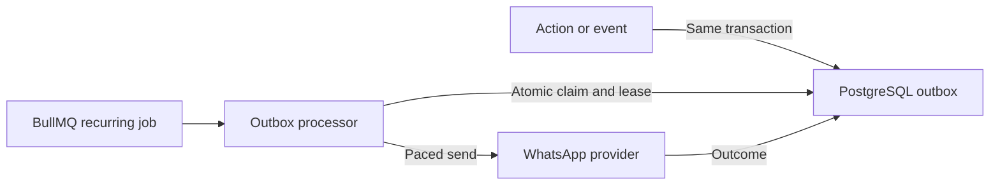

# ADR 0021: BullMQ schedules PostgreSQL outbox batches

- Status: Accepted
- Date: 2026-09-08
- Supersedes: the outbound timer scheduling in
  [ADR 0013](0013-state-driven-feedback-orchestration.md). Its message states,
  fences and ambiguous-delivery policy remain in force.

## Decision

Actions persist outbound intent alongside domain changes in one PostgreSQL
transaction. A recurring `feedback.dispatch-outbox.v2` job on `feedback-outbox`
claims and sends those rows itself. There is no separate relay or individual
BullMQ job per message. BullMQ owns wake-ups; PostgreSQL owns message state.

The queue has global concurrency one across worker replicas. Each poll handles
at most 100 claims, in waves of four that can start immediately; claiming all
100 upfront would let leases age while waiting for provider pacing. Each wave
uses one SQL CTE with `FOR UPDATE SKIP LOCKED` and `UPDATE ... RETURNING`, then
commits before sending. Existing conversation FIFO, STOP checks, PostgreSQL
fences, Redis pacing and pre-send markers remain authoritative.

The scheduler starts at 1,000 ms and preserves its stored cadence on worker
restart. A full poll halves the interval down to 250 ms; fewer than 50 claims
doubles it up to 5,000 ms; the middle range leaves it unchanged. A deferred or
lost claim ends the poll to avoid immediately reclaiming the same row.
These are scheduler intervals, not throughput guarantees: changing a schedule
can create an immediate successor, and sending remains subject to pacing and
job duration.

## Failure and shutdown

A batch job has one attempt. BullMQ creates the successor when a recurring job
starts; a failed batch therefore leaves the next poll available. Restarted
workers resume from the persisted schedule and rows. Expired pre-send claims
can be reclaimed; expired attempts with a send marker become `ambiguous` and
are never automatically resent. BullMQ concurrency does not replace database
fencing or guarantee exactly-once delivery.

Shutdown stops new waves and drains the current wave before closing PostgreSQL
and the Redis pacer. Deployment replaces old timer workers before starting the
new workers; mixed timer and BullMQ scheduling is not the rollout contract.
No schema migration or application environment variable is added.

## Verification and references

Repository integration tests exercise concurrent claims and rollback on real
PostgreSQL. The opt-in Redis harness exercises two worker replicas, adaptive
cadence, restart and a failed poll. Existing dispatcher scenarios retain the
FIFO, STOP, fencing and ambiguous-send checks.

Verified with BullMQ 5.80.10 on 2026-09-08:
[Job Schedulers](https://docs.bullmq.io/guide/job-schedulers),
[global concurrency](https://docs.bullmq.io/guide/queues/global-concurrency).
Current contracts: [queues](../backend/mechanisms/queues.md),
[database](../backend/mechanisms/database.md),
[harness](../../harness/README.md).
