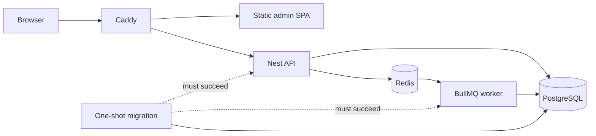

# Containers and VPS deployment

## Delivery model

The root `Dockerfile` produces five targets:

- `development`: pnpm toolchain and workspace dependencies; source is mounted at runtime;
- `web`: Caddy serving the static React admin build;
- `api`: Nest HTTP process;
- `worker`: Nest BullMQ process;
- `migrate`: minimal, one-shot Drizzle migration runner.

PostgreSQL and Redis use pinned official images. Caddy is the production edge:
it routes `/api/*` unchanged to Nest and all other requests to the admin SPA,
and manages TLS when `DOMAIN` resolves to the VPS.



Production separates `edge`, internal `data`, and worker `egress` networks.
Caddy and the web tier cannot reach PostgreSQL or Redis. Application filesystems are
read-only, application and migration images run as the unprivileged `node`
user with Linux capabilities dropped, Docker's init forwards signals and reaps
child processes, and writable scratch space is an in-memory `/tmp`. Caddy also
uses a read-only root filesystem and retains only the capability required to
bind ports 80 and 443; its state lives in named data/config volumes.

## Development

Native application processes with containerized dependencies remain the
fastest inner loop:

```bash
cp .env.example .env
pnpm install
pnpm infra:up
pnpm dev
```

For a fully containerized stack with bind-mounted source and hot reload:

```bash
cp .env.example .env
pnpm dev:containers:build
pnpm dev:containers
```

The development image does not copy source, so editing or restarting source
does not rebuild it. Only dependency manifests, the lockfile and the configured
development UID/GID feed that image target. The normal `pnpm dev:containers`
path builds the shared image only when it is absent; it does not check for
source changes or rebuild a present image. Run `pnpm dev:containers:build`
after a dependency manifest, lockfile, `DEV_UID` or `DEV_GID` change, then run
`pnpm dev:containers` to recreate the affected containers. Compose performs
this startup sequence:

1. ensure one shared development image exists, then start PostgreSQL, Redis and
   one frozen-lockfile dependency sync into Linux-only named volumes;
2. after dependencies and PostgreSQL are ready, apply pending migrations;
3. after migration and Redis are ready, start one backend development
   container containing the compiler, API and worker watchers, then wait for
   the API readiness check;
4. start the Vite dev server with hot reload and wait for its health check.

The source bind mount gives immediate reloads while the named `node_modules`
volumes prevent macOS/Linux native packages from being mixed. The API, worker,
migration and web processes run as the image's unprivileged `node` user. On
native Linux, set `DEV_UID` and `DEV_GID` in `.env` to `id -u` and `id -g` when
they differ from `1000`; this keeps generated bind-mount files owned by your
host account. The root-only dependency sync owns package installation and then
hands Vite's package cache back to that user.

After changing a dependency manifest, update `pnpm-lock.yaml`, run
`pnpm dev:containers:build`, then restart `pnpm dev:containers`; the one-shot
sync updates the existing volumes. A manual volume purge is not part of the
normal loop. All development services consume the same image, so the explicit
build exports it once rather than manufacturing four identical copies.

Development ports bind to loopback only. If a default is occupied, override
`POSTGRES_HOST_PORT`, `REDIS_HOST_PORT`, `API_HOST_PORT` or `WEB_HOST_PORT` in
`.env`; Compose keeps browser-facing API and CORS URLs aligned automatically.
For the native application workflow, also change the ports in `DATABASE_URL`
and `REDIS_URL` to match the host overrides.

`docker compose down` preserves data and dependencies. `docker compose down
--volumes` deletes the development database, Redis data and dependency volumes;
use it only for an intentional reset.

## Production configuration

On the VPS:

```bash
cp .env.production.example .env.production
chmod 600 .env.production
install -d -m 700 secrets
umask 077
openssl rand -hex 32 > secrets/postgres_password
openssl rand -hex 32 > secrets/redis_password
touch secrets/bull_board_password
```

Set `DOMAIN`, `WEB_ORIGIN`, database names and any enabled integrations. Keep
`.env.production` and `secrets/` out of Git and unencrypted backups. The example
points Compose at independent URL-safe database/Redis passwords and an empty
file for disabled Bull Board authentication. Populate that file before enabling
Bull Board; do not move the value back into an environment variable. PostgreSQL
uses its native password-file contract, Redis reads its password file at
startup, and a small application entrypoint exposes credentials only to the
migration, API or worker child process that needs them. Caddy and the web tier
receive none of them. WordPress runtime credentials are deliberately absent until a
real adapter owns and validates them.

This limits credential distribution and keeps credentials out of container
configuration metadata, but local secret files are not an external secret
manager and Docker administrators can still read their mounts. Move the source
values into a VPS secret manager when one is available. Also avoid printing
`docker compose config` in shared logs because non-secret configuration may
still be sensitive operationally; use `config --quiet` for validation.

CPU and memory limits are not guessed without the VPS size and a load profile.
Before launch, measure steady-state and peak usage, then set service limits with
headroom and verify that PostgreSQL is never the accidental OOM sacrifice.
The default API and worker database pools are ten connections each. Budget the
combined maximum against PostgreSQL capacity before scaling either process;
raising one service's pool in isolation is not capacity planning.

## Build and deploy

The supported VPS deploy command validates a clean checkout, derives the exact
Git SHA as `RELEASE_TAG`, takes a host-level non-blocking deployment lock,
validates Compose, builds all four application images, and only then activates
them:

```bash
./scripts/deploy-production.sh
```

Pass a different environment-file path as the sole argument when required. The
script deliberately refuses a dirty worktree; building an allegedly immutable
SHA from miscellaneous server edits is just mutable deployment wearing a fake
mustache. It uses `flock`, so overlapping deploys and rollbacks fail before a
second migrator can start. Keep manual production commands under the same
`DEPLOY_LOCK_FILE` when debugging.

For inspection, the equivalent read-only validation and final status commands
are:

```bash
export RELEASE_TAG=$(git rev-parse --verify HEAD)
docker compose --env-file .env.production -f compose.prod.yaml config --quiet
docker compose --env-file .env.production -f compose.prod.yaml ps
```

Then verify the public TLS path from outside the VPS (replace the hostname):

```bash
curl --fail --show-error --silent https://app.example.com/api/v1/health/ready
curl --fail --show-error --silent --output /dev/null https://app.example.com/
```

The migration image runs first. API and worker creation is gated on its
successful exit; web and Caddy are gated on dependency-aware readiness checks.
A failed build leaves the current stack alone. The deployment scripts start or
verify the data services, run migration as a separate foreground container, and
only replace API/worker/web/edge containers after it succeeds. A failed
migration therefore leaves the current application containers running. Do not
replace that phased activation with a blanket `docker compose up`: Compose may
recreate dependent containers before a `service_completed_successfully` gate
has passed. Never repair a failure by editing migration history on the server.
After application activation begins, however, replacement is phased rather than
atomic. A later readiness failure can leave a mixture of old and new process
versions. Treat that as an incident: inspect `docker compose ps` and run the
supported rollback command instead of assuming the script restored every unit.

The supported deployment path runs exactly one `migrate` service. Do not scale
it and do not launch overlapping deployments: Drizzle's PostgreSQL migrator
does not provide a distributed deployment lock. The runner bounds connection,
lock and per-statement waits and has a hard whole-process execution deadline;
`MIGRATION_LOCK_TIMEOUT_MS` must be lower than
`MIGRATION_STATEMENT_TIMEOUT_MS`, which must be lower than
`MIGRATION_EXECUTION_TIMEOUT_MS`. PostgreSQL rolls back the active migration
transaction when a timeout disconnects the runner. Increase a bound only after
reviewing the migration and observed production duration.

Compose health checks gate startup, but Docker restart policies react to exits,
not merely an `unhealthy` status. Add an external HTTPS uptime check and an
alerted restart/diagnosis runbook before treating this as unattended production.
The worker has no HTTP surface; monitor its restarts and BullMQ failed/delayed
counts rather than inventing a health check that only proves Node can execute.

The current VPS model builds from a reviewed, tagged checkout. The Dockerfile
pins Node by multi-platform digest, Compose pins infrastructure by exact version
and digest, pnpm is exact, and installs use the frozen lockfile. Review pinned
image updates as dependency changes rather than silently floating major tags.
After the frozen dependency install, compilation and production packaging run
with build networking disabled so an accidental remote fetch fails instead of
quietly making the artifact depend on the weather.

## Release, rollback and backup

Tag every production commit and record the deployed SHA. Each application image
is tagged with that SHA instead of overwriting `latest`. While the prior images
remain on the VPS, roll back without recompilation:

```bash
git switch --detach <previous-git-sha>
./scripts/rollback-production.sh <previous-git-sha>
```

The rollback command requires a clean worktree at that exact commit so its
Compose, Caddy and deployment contracts match the images. It validates that all
four SHA-tagged images exist locally, takes the same repository-owned deployment
lock, reruns the idempotent migration gate from that release and performs the
same phased activation with `--no-build`. If an image has been removed, rebuild
that exact reviewed commit explicitly with the same SHA; never substitute a
floating tag. Database rollback still requires an explicitly reviewed
forward-fix or rollback migration. Container rollback is easy. Data rollback is
where optimism goes to die.

The previous application must remain compatible with every schema migration
already applied by the newer release. The rollback script cannot prove that
contract and does not reverse migrations. Use expand-and-contract migrations,
exercise the old application against the migrated schema before release, and
prefer a forward fix when compatibility is uncertain.

Before production traffic, configure encrypted off-host PostgreSQL backups and
perform a restore drill. Docker volumes are persistence, not backup.

## CI boundary

GitHub Actions remains useful for this local/VPS workflow: `pnpm check` validates
the repository, then one Buildx Bake graph tags all targets with the commit SHA
and builds all four production images. It therefore catches broken Docker
targets, missing build artifacts and invalid production packaging before VPS
deployment. A single graph shares the expensive dependency/build stages; four
isolated matrix runners would repeat them.

CI intentionally does not deploy and does not receive production credentials.
When a registry and retention policy exist, the next step is to publish
commit-SHA images once in CI and make the VPS pull those immutable artifacts;
that removes compiler load and build drift from the server. A production
self-hosted runner must never execute untrusted pull-request jobs.

## Pinned toolchain and references

Verified 2026-07-22 with Docker Engine 29.4.1 and Docker Compose 5.1.3:

- Node `24.11.0-bookworm-slim`, pnpm `10.33.0`;
- PostgreSQL `18.4-alpine3.24`;
- Redis `8.8.0-alpine3.23`;
- Caddy `2.11.4-alpine`.

The repository contract currently pins pnpm 10.33.0. Its official 10.x
documentation is now marked as no longer actively maintained; upgrade to pnpm
11 in a separate, tested toolchain change rather than smuggling it into a
container refactor.

Official guidance:

- [Docker build best practices](https://docs.docker.com/build/building/best-practices/)
- [Docker build cache optimization](https://docs.docker.com/build/cache/optimize/)
- [Docker multi-stage builds](https://docs.docker.com/build/building/multi-stage/)
- [Docker Buildx Bake targets](https://docs.docker.com/build/bake/targets/)
- [Compose startup and readiness order](https://docs.docker.com/compose/how-tos/startup-order/)
- [Compose production deployments](https://docs.docker.com/compose/how-tos/production/)
- [Compose Watch and bind-mount trade-offs](https://docs.docker.com/compose/how-tos/file-watch/)
- [Compose secrets](https://docs.docker.com/reference/compose-file/secrets/)
- [pnpm 10 Docker recipe](https://pnpm.io/10.x/docker)
- [Official Node image best practices](https://github.com/nodejs/docker-node/blob/main/docs/BestPractices.md)
- [node-postgres client timeouts](https://node-postgres.com/apis/client)
- [PostgreSQL client timeouts](https://www.postgresql.org/docs/18/runtime-config-client.html)
