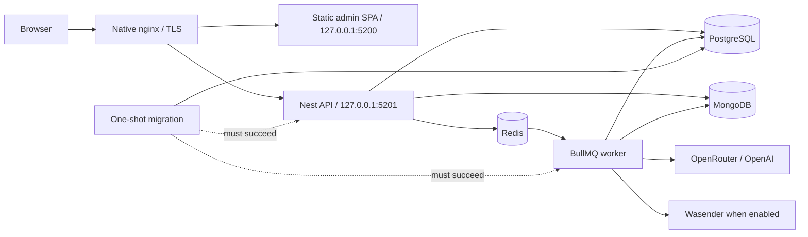

# Containers and VPS deployment

Example layout for a **private** Slopform instance. Committed hosts are
`slopform.example.com`, RFC 5737 documentation addresses (`203.0.113.10`) and
`/opt/slopform`. They are not a public production service and must not be
copied as a live DNS zone. Public identity:
[ADR 0014](decisions/0014-public-slopform-identity.md).

## Delivery model

Root `Dockerfile` targets: `development` (toolchain; source mounted), `web`
(Caddy static SPA on 3000), `api`, `worker`, `migrate` (one-shot Drizzle).
PostgreSQL, MongoDB and Redis use pinned official images.

Native nginx owns 80/443 on the shared VPS. Vhost
[`deploy/nginx/slopform.example.com.conf`](../deploy/nginx/slopform.example.com.conf)
is the host-edge contract: `/api/*` → loopback `5201`, everything else → web
loopback `5200`. Docker never publishes data stores or app ports publicly.
Nginx stays outside Compose (other apps share the host).



Production networks: `edge`, internal `data`, worker `egress`. Web cannot reach
PostgreSQL/MongoDB/Redis. App and migrate images: unprivileged `node`,
`read_only`, dropped caps, Docker init, in-memory `/tmp`.

## Domain and Clerk edge (example)

Committed examples only. Replace the documentation address and hostname in a
real private deploy; do not publish registrar, tenant or live-zone values.

| Name       | Type  | Value                          |
| ---------- | ----- | ------------------------------ |
| `@`        | A     | `203.0.113.10`                 |
| `clerk`    | CNAME | `frontend-api.clerk.services.` |
| `accounts` | CNAME | `accounts.clerk.services.`     |

Clerk mail and DKIM CNAMEs come from the dedicated Clerk dashboard; do not
commit a real tenant hostname.

- Cert: `/etc/letsencrypt/live/slopform.example.com/` via `/var/www/certbot`;
  Certbot timer renews. Do not overwrite apex/`www` `example.com` vhosts that
  other host sites may use.
- Dedicated Clerk application for this operator surface: example primary
  `example.com`, only the `slopform.example.com` app hostname, **Restricted**,
  email codes. Google OAuth off until real production credentials exist. Do not
  reuse another product's Clerk tenant.
- Invitations and `user_*` allowlist entries are operator secrets, not
  committed values.

## Development

Native apps + containerized deps (fastest loop):

```bash
cp .env.example .env
# Matching Clerk keys, admin user IDs, and the key for the selected model route.
# Provider selection never falls back to the other key.
pnpm install
pnpm infra:up
pnpm dev
```

Full containerized stack (bind-mount + hot reload):

```bash
cp .env.example .env
pnpm dev:containers:build
pnpm dev:containers
```

- Dev image: no source copy. Rebuild only after dependency/lockfile/`DEV_UID`/
  `DEV_GID` change (`pnpm dev:containers:build`), then `pnpm dev:containers`.
  Ordinary `dev:containers` builds the image only when absent.
- Startup: shared image → Postgres/Mongo/Redis + frozen-lockfile sync into
  Linux-only named volumes → migrate → backend (compiler/API/worker watchers)
  → Vite. Named `node_modules` volumes avoid macOS/Linux native mix.
- On native Linux, set `DEV_UID`/`DEV_GID` to `id -u`/`id -g` when not `1000`.
- Loopback-only ports. Overrides: `POSTGRES_HOST_PORT`, `MONGODB_HOST_PORT`,
  `REDIS_HOST_PORT`, `API_HOST_PORT`, `WEB_HOST_PORT`. Native workflow must
  also align `DATABASE_URL` / `MONGODB_URI` / `REDIS_URL`.
- `docker compose down` keeps data; `--volumes` wipes DB/Redis/deps — intentional
  reset only.

## Production configuration

Local prep from the committed template:

```bash
cp .env.production.example .env.production
chmod 600 .env.production
install -d -m 700 secrets
umask 077
openssl rand -hex 32 > secrets/postgres_password
openssl rand -hex 32 > secrets/mongodb_root_password
openssl rand -hex 32 > secrets/mongodb_app_password
openssl rand -hex 32 > secrets/redis_password
touch secrets/bull_board_password secrets/clerk_secret_key
touch secrets/openai_api_key secrets/openrouter_api_key
touch secrets/wasender_session_api_key secrets/wasender_webhook_secret
```

Fill Clerk and the selected AI-provider files. First VPS provision — copy only
these named files (never a random `secrets/*` dump):

```bash
ssh -i "$HOME/.ssh/id_ed25519" -o IdentitiesOnly=yes \
  root@203.0.113.10 \
  'install -d -m 755 /opt/slopform/releases; install -d -m 700 /opt/slopform/shared /opt/slopform/shared/secrets'

scp -i "$HOME/.ssh/id_ed25519" .env.production \
  root@203.0.113.10:/opt/slopform/shared/.env.production
scp -i "$HOME/.ssh/id_ed25519" \
  secrets/{postgres_password,mongodb_root_password,mongodb_app_password,redis_password,bull_board_password,clerk_secret_key,openai_api_key,openrouter_api_key,wasender_session_api_key,wasender_webhook_secret} \
  root@203.0.113.10:/opt/slopform/shared/secrets/

ssh -i "$HOME/.ssh/id_ed25519" -o IdentitiesOnly=yes \
  root@203.0.113.10 \
  'chmod 600 /opt/slopform/shared/.env.production; chmod 644 /opt/slopform/shared/secrets/*'
```

VPS secret files are `0644` deliberately: Compose bind-mounts them and
MongoDB/Node run non-root, so `0600 root:root` is unreadable in-container.
Directories `/opt/slopform/shared{,/secrets}` stay `0700 root:root`; mounts
are read-only. Keep local copies at `0600`.

Set `DOMAIN=slopform.example.com`, `WEB_ORIGIN=https://slopform.example.com`,
DB names and integrations. Model/reasoning/rehearsal vars forward unchanged to
API and worker. Keep `.env.production` and `secrets/` out of Git and unencrypted
backups.

**Initial production profile is rehearsal, not live WhatsApp:**
`TRANSPORT_MODE=simulated`, `FEEDBACK_SIMULATOR_ENABLED=true`,
`FEEDBACK_PRODUCTION_REHEARSAL_ENABLED=true`, `FEEDBACK_EXTRACTION_STUB=false`.
Real billable model calls; outbound only to `feedback_sim_outbound`. Wasender
files empty, webhook off. Validator rejects incoherent transport/profile combos.
Baseline fault profile: `none` / `0%` / seed `1` / zero latency. Fault runs:
stop every feedback worker, drain unrelated sim outbox, set one identical
profile on API + all workers, confirm catalog/`feedback:simulate` match, require
`--confirm-transport-faults`. No rolling profile changes; no overlapping
rehearsals with different fault outcomes. Worker attestation rejects a partial
restart with different model or simulated-transport controls.

Paid treatment baseline: direct-OpenAI Luna for
extraction/classification/conditional rewrite at `medium`; Terra for campaign
summaries.

**Credential boundaries** — never put secrets in Compose env metadata:

| Consumer           | Secrets                                                             |
| ------------------ | ------------------------------------------------------------------- |
| Postgres           | password file                                                       |
| Redis              | password file at startup                                            |
| Mongo init         | root secret (fresh volumes only)                                    |
| API / worker       | app Mongo secret; AI keys (API resolves availability; worker calls) |
| API only           | Clerk secret                                                        |
| Native nginx / web | none                                                                |
| Bull Board         | password file only when enabled                                     |

Mongo secret-file change ≠ user rotation: alter DB password first, update file,
recreate API/worker, verify readiness. If another client (historically
WordPress) shares the same Wasender session, copy the session key into the
worker file and coordinate rotation. WordPress credentials stay independent and
are not part of this public tree.

**Web build args** (public, not secrets; rebuild web on change):
`VITE_CLERK_PUBLISHABLE_KEY` (must match API `CLERK_PUBLISHABLE_KEY`), optional
`VITE_GOOGLE_MAPS_API_KEY`. Restrict Maps key to deployed/local admin referrers
and Maps JS / Places (New) / Places UI Kit / Maps Embed only. Without a key,
saved venues and deep-links work; live search/photos/details stay off.
`CLERK_ADMIN_USER_IDS` is API runtime config (no SPA rebuild). The example
production profile uses three placeholder `user_*` subjects; operators set
their own allowlist.

**Maps persistence gate:** prototype seeds Place ID plus Google name/address/
type into editable fields. Capturing Place Name outside the session is
prohibited scraping under Google Maps JS policy. Production persistence needs
legal/provider review; until then retain Place ID + independently authored
operator context. Re-check
[Maps JS policies](https://developers.google.com/maps/documentation/javascript/policies)
and
[pricing](https://developers.google.com/maps/billing-and-pricing/pricing)
before public rollout. Demo keys are not production credentials.

Local secret files are not a secret manager; Docker admins can read mounts.
Avoid printing `docker compose config` in shared logs; use `config --quiet`.

**Capacity (measure before setting limits):** default API/worker pools 10 each;
feedback worker adds a lazy 5-connection advisory-lock pool → budget 25 Postgres
connections before scaling either process. Mongo pools capped at 10/process.
Each feedback worker replica: 1 Hz outbox poll (`SKIP LOCKED`); replica count
multiplies empty-poll traffic. Never let Postgres be the accidental OOM victim.

**Worker lifecycle:** 8-minute stop grace. Conversation/summary leases 7m;
direct outbox claims 2m. Hard kill recoverable: due Mongo work and pending
summaries survive; pre-send `claimed` expires; post-marker `attempting` →
`ambiguous` (not double-send).

**Feedback V2 cutover is non-rolling:** replace the single `worker` in place.
Do not run old and new worker images side by side — old V1 cannot honor the new
Postgres execution claim. Redis compatibility consumer is a drain bridge only.

## Build and deploy

Public operator interface:

```bash
pnpm prod deploy              # full: migrate + API + worker + web + nginx edge
pnpm prod deploy admin        # SPA only
pnpm prod deploy backend      # migrate, then API + worker
pnpm prod status
pnpm prod logs worker
pnpm prod logs nginx
```

`deploy` defaults to `all`; first deploy must be `all`. Requires clean committed
local `HEAD`; archives that tree over SSH (no VPS git credentials). Overrides:
`pnpm prod help` → `PRODUCTION_*`.

```text
/opt/slopform/
├── current -> releases/<UTC timestamp>-<full Git SHA>
├── releases/                 # five retained immutable source releases
└── shared/
    ├── .env.production
    ├── secrets/
    └── release-state.env     # MIGRATE_/API_/WORKER_/WEB_RELEASE_TAG
```

Independent component SHAs make admin-only deploys honest. Images carry
`org.opencontainers.image.revision`; unlabeled tags are not releases. Existing
SHA tags are reused, never overwritten. Web also labels SHA-256 of Clerk/Maps/
API-base build inputs — same-commit retry with same inputs is safe; changed
inputs for an existing SHA need a new commit.

Shared lock: `/var/lock/join-the-six-production.lock` (deploy, rollback, edge,
data). Concurrent ops fail closed. SSH defaults:
`root@203.0.113.10`, `~/.ssh/id_ed25519`, `IdentitiesOnly=yes`, batch mode,
bounded connect timeout.

**Activation order (preserve):**

1. Build entire requested scope before replacing any running app container.
2. Backend: ensure Postgres/Mongo/Redis → one foreground migrate → **stop old
   worker and wait for grace** → replace API → only then start new worker.
   If API readiness fails, worker stays stopped (new HTTP may retain ingress;
   old binary must not consume it).
3. Web: wait for loopback API, then replace SPA.
4. Full deploy installs/validates `slopform.example.com` nginx vhost; partial
   leaves edge alone. Partial deploy requires byte-identical
   `compose.prod.yaml` vs active contract; Compose changes need `deploy all`.
5. Smoke: public HTTPS API + SPA; SPA checks `/deploy.json` against exact
   `WEB_RELEASE_TAG`.

Do not use blanket `docker compose up` — loses scoped state and migration
gating. Failed builds/migrations leave the old app running. Activation is
phased: a later readiness failure can leave `release-state.env` ahead of a
mixed running stack — treat as incident, inspect `pnpm prod status`/logs, rerun
or rollback. Migrations: `lock < statement < execution` timeouts; forward-only
expand-and-contract; never edit history on the server. Compose health gates
startup; restart policies react to exits, not mere unhealthiness — keep an
external HTTPS uptime check.

## Release and rollback

```bash
pnpm prod rollback all <full-40-character-git-sha>
pnpm prod rollback admin <full-40-character-git-sha>
pnpm prod rollback backend <full-40-character-git-sha>
```

Target needs a retained immutable release dir and images with matching OCI
revision labels. Retained `compose.prod.yaml` must match the active contract
(fail closed across Compose changes). Partial rollback keeps the four-tag
contract and changes only requested tags. Backend/full rollback reruns the
target migrate image but never reverses applied migrations — prefer a forward
fix when prior-binary/schema compatibility is uncertain.

Pruning: protect current + newest retained release per active component SHA,
cap five releases total. No host-wide Docker prune (shared VPS).

## Repeatable pre-launch data promotion

Generic replace of application state from current local Postgres + MongoDB
(not WordPress-/fixture-aware). For each final data round:

```bash
pnpm prod data status

# Stop every local API/worker or other writer first.
CONFIRM_PRODUCTION_DATA_PUSH=slopform.example.com \
  CONFIRM_LOCAL_DATA_QUIESCED=I_HAVE_STOPPED_ALL_JOIN_THE_SIX_LOCAL_WRITERS \
  pnpm prod data push

# Only after the accepted final dataset is in production:
CONFIRM_SEAL_DATA_IMPORT_WINDOW=slopform.example.com \
  pnpm prod data seal
```

`push` requires the attestation, clean `HEAD` whose SHA is current source
release and active for `migrate`/`api`/`worker` (web may differ after
backend-only deploy), matching migration journals local/remote, healthy local
DB containers, and no visible API/worker containers/listeners/other Postgres
clients (checked before and after dumps). After admin-only deploy, run
`deploy backend` or `deploy all` from that commit first.

Transfer: Postgres custom dump + gzip Mongo archive + SHA-256 manifests +
table/collection/index inventories. Never copy raw Docker volumes Desktop→Linux;
never transfer Redis. On VPS: verify release/images/migrations/seal/checksums →
stop writers → paired pre-import backup under `/var/backups/join-the-six` →
restore app Postgres schemas + Mongo app collections (preserve `system.*`) →
clear Redis → run active migrate image → compare inventories → restart prior
writers. Failure leaves writers stopped and keeps the pre-import backup; no
automatic data rollback. `seal` is one-way (host marker; no unseal CLI).

Snapshot preserves ownership: `user_localdev` Assistant threads stay invisible
to production allowlist subjects — rewrite ownership only via an explicit reviewed
migration. Volumes ≠ backup; losing Mongo loses authoritative conversation
history even if Postgres projection survives.

### Coordinated backup runbook

No transactional cross-store snapshot while writes continue. Quiesce API then
worker (full grace), then capture both under one UTC id:

```bash
set -Eeuo pipefail
umask 077
current=/opt/slopform/current
state=/opt/slopform/shared/release-state.env
source "$current/scripts/production-common.sh"
production_load_state "$state"
production_export_state
production_acquire_lock
production_compose_init "$current" "$current/.env.production"
compose=("${production_compose[@]}")
backup_id=$(date -u +%Y%m%dT%H%M%SZ)
: "${BACKUP_AGE_RECIPIENT:?Set the public age recipient}"
backup_directory="/var/backups/join-the-six/scheduled/$backup_id"
install -d -m 700 "$backup_directory"

"${compose[@]}" stop api
"${compose[@]}" stop worker

"${compose[@]}" exec -T postgres sh -ec \
  'PGPASSWORD="$(cat /run/secrets/postgres_password)" exec pg_dump --host 127.0.0.1 --username "$POSTGRES_USER" --dbname "$POSTGRES_DB" --format=custom --no-owner --no-acl --schema=public --schema=drizzle' |
  age --recipient "$BACKUP_AGE_RECIPIENT" --output "$backup_directory/postgres.dump.age"

"${compose[@]}" exec -T mongo sh -ec \
  'exec mongodump --host 127.0.0.1 --username "$MONGODB_APP_USER" --password "$(cat /run/secrets/mongodb_app_password)" --authenticationDatabase "$MONGO_INITDB_DATABASE" --db "$MONGO_INITDB_DATABASE" --excludeCollectionsWithPrefix system. --archive --gzip' |
  age --recipient "$BACKUP_AGE_RECIPIENT" --output "$backup_directory/mongo.archive.gz.age"

sha256sum "$backup_directory/"*.age > "$backup_directory/sha256.manifest"
"${compose[@]}" up -d --no-build --no-deps --wait api worker
```

Requires host `age` with a public recipient; passwords expand inside containers.
On dump/encrypt failure keep the app quiesced until understood. Upload the
encrypted pair + checksum off-host immediately. Until RPO/RTO/retention are
approved: ≥14 daily, 8 weekly, 12 monthly pairs; monitor age/size; test
decrypt. Storage snapshots/managed replica backups may replace this only with a
documented cross-store consistency contract.

### Restore drill and disaster recovery

Quarterly: restore a matched pair into a disposable Compose project with fresh
credentials and empty volumes — never over production. After decrypt-through-pipe,
`pg_restore` for Postgres; Mongo shape:

```bash
set -o pipefail
age --decrypt backups/<backup-id>.mongo.archive.gz.age |
  docker compose --project-name join-the-six-restore \
    --env-file .env.restore -f compose.yaml exec -T mongo sh -ec \
    'exec mongorestore --host 127.0.0.1 --username "$MONGODB_APP_USER" --password "$MONGODB_APP_PASSWORD" --authenticationDatabase "$MONGO_INITDB_DATABASE" --archive --gzip --drop'

docker compose --project-name join-the-six-restore \
  --env-file .env.restore -f compose.yaml exec -T mongo sh -ec \
  'exec mongosh --quiet --username "$MONGODB_APP_USER" --password "$MONGODB_APP_PASSWORD" --authenticationDatabase "$MONGO_INITDB_DATABASE" "$MONGO_INITDB_DATABASE" --eval "const result=db.runCommand({validate:\"conversation_threads\",full:true}); if(!result.valid){quit(2)}; printjson({documents:db.conversation_threads.countDocuments({}),indexes:db.conversation_threads.getIndexes().map(index=>index.name)})"'
```

Validate checksums before decrypt, Mongo full validation, seven required
indexes, counts, Postgres migration state, owner-scoped API reads. Record
elapsed vs RTO; destroy the disposable project.

Production restore: keep API/worker stopped; restore both stores from the same
backup id; clean Redis volume (not a source of truth). Validate both durable
stores before any app process. Start API → readiness + owner-scoped reads →
reconcile Assistant terminal Mongo turns vs Postgres projection → decide
re-enqueue/fail for queued/running attempts → then start worker. Postgres
outbox/delivery is authoritative for outbound; never invent delivery completion
from Mongo.

## CI boundary

GitHub Actions: `pnpm check`, then one Buildx Bake graph tags all targets with
the commit SHA and builds the four production images (shared expensive stages).
CI does not deploy and does not receive production credentials. Next step when
a registry exists: publish SHA images in CI, VPS pulls immutables. A production
self-hosted runner must never run untrusted PR jobs. The example layout is a
private instance, not a public hosted service.

## Pinned toolchain

Verified 2026-08-02 — Docker Engine 29.4.1, Compose 5.1.3:

- Node `24.11.0-bookworm-slim`, pnpm `10.33.0` (10.x docs marked unmaintained;
  upgrade to 11 as a separate tested change)
- PostgreSQL `18.4-alpine3.24`, MongoDB `8.0.28-noble`, Redis `8.8.0-alpine3.23`
- Caddy `2.11.4-alpine` (internal static); host nginx `1.24.0`, Certbot `2.9.0`
