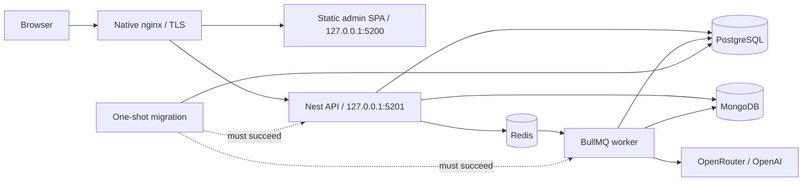

# Containers and VPS deployment

## Delivery model

The root `Dockerfile` produces five targets:

- `development`: pnpm toolchain and workspace dependencies; source is mounted at runtime;
- `web`: internal Caddy serving the static React admin build on port 3000;
- `api`: Nest HTTP process;
- `worker`: Nest BullMQ process;
- `migrate`: minimal, one-shot Drizzle migration runner.

PostgreSQL, MongoDB and Redis use pinned official images. Native nginx is the
shared VPS edge: it already owns ports 80/443; the admin has its own
`slopform.example.com` certificate and vhost,
routes `/api/*` unchanged to the API's loopback port `5201`, and sends everything
else to the web container's loopback port `5200`. Docker never publishes a data
store or application port on a public interface.



Production separates `edge`, internal `data`, and worker `egress` networks. The
web tier cannot reach PostgreSQL, MongoDB or Redis. Application filesystems are
read-only, application and migration images run as the unprivileged `node` user
with Linux capabilities dropped, Docker's init forwards signals and reaps child
processes, and writable scratch space is an in-memory `/tmp`. Native nginx is
managed outside Compose because it also serves the other applications on this
VPS; [`deploy/nginx/slopform.example.com.conf`](../deploy/nginx/slopform.example.com.conf) is this
repository's complete host-edge contract.

## Domain and Clerk edge

The following Papaki zone records were installed and verified on 2026-08-02.
Values are public DNS configuration; none is an application secret.

| Name              | Type  | Value                                |
| ----------------- | ----- | ------------------------------------ |
| `jointhesix`      | A     | `203.0.113.10`                      |
| `clerk`           | CNAME | `frontend-api.clerk.services.`       |
| `accounts`        | CNAME | `accounts.clerk.services.`           |
| `clkmail`         | CNAME | `mail.ols43sxiepbv.clerk.services.`  |
| `clk._domainkey`  | CNAME | `dkim1.ols43sxiepbv.clerk.services.` |
| `clk2._domainkey` | CNAME | `dkim2.ols43sxiepbv.clerk.services.` |

`slopform.example.com` has its own Let's Encrypt certificate at
`/etc/letsencrypt/live/slopform.example.com/`, obtained through the persistent
`/var/www/certbot` webroot and covered by the existing Certbot renewal timer.
The apex `example.com` and `www.example.com` vhost remains a separate VPS concern and
must not be overwritten by this deployment.

The Clerk application is named **Join The Six**. Its production instance has a
verified primary `example.com` Clerk domain, allows only
`slopform.example.com` as an application subdomain, runs in **Restricted** mode,
and initially uses verified email codes. Google sign-in is disabled until real
production OAuth credentials exist, and users cannot change their primary email
address. Invitation delivery and the resulting three stable backend `user_*`
allowlist entries are operational launch steps, not values committed here.

## Development

Native application processes with containerized dependencies remain the
fastest inner loop:

```bash
cp .env.example .env
# Set matching Clerk keys, approved admin user IDs and the key for the selected
# model route. Provider selection never falls back to the other key.
pnpm install
pnpm infra:up
pnpm dev
```

For a fully containerized stack with bind-mounted source and hot reload:

```bash
cp .env.example .env
pnpm dev:containers:build
pnpm dev:containers
```

The development image does not copy source, so editing or restarting source
does not rebuild it. Only dependency manifests, the lockfile and the configured
development UID/GID feed that image target. The normal `pnpm dev:containers`
path builds the shared image only when it is absent; it does not check for
source changes or rebuild a present image. Run `pnpm dev:containers:build`
after a dependency manifest, lockfile, `DEV_UID` or `DEV_GID` change, then run
`pnpm dev:containers` to recreate the affected containers. Compose performs
this startup sequence:

1. ensure one shared development image exists, then start PostgreSQL, MongoDB,
   Redis and one frozen-lockfile dependency sync into Linux-only named volumes;
2. after dependencies and PostgreSQL are ready, apply pending migrations;
3. after migration, MongoDB and Redis are ready, start one backend development
   container containing the compiler, API and worker watchers, then wait for
   the API readiness check;
4. start the Vite dev server with hot reload and wait for its health check.

The source bind mount gives immediate reloads while the named `node_modules`
volumes prevent macOS/Linux native packages from being mixed. The API, worker,
migration and web processes run as the image's unprivileged `node` user. On
native Linux, set `DEV_UID` and `DEV_GID` in `.env` to `id -u` and `id -g` when
they differ from `1000`; this keeps generated bind-mount files owned by your
host account. The root-only dependency sync owns package installation and then
hands Vite's package cache back to that user.

After changing a dependency manifest, update `pnpm-lock.yaml`, run
`pnpm dev:containers:build`, then restart `pnpm dev:containers`; the one-shot
sync updates the existing volumes. A manual volume purge is not part of the
normal loop. All development services consume the same image, so the explicit
build exports it once rather than manufacturing four identical copies.

Development ports bind to loopback only. If a default is occupied, override
`POSTGRES_HOST_PORT`, `MONGODB_HOST_PORT`, `REDIS_HOST_PORT`, `API_HOST_PORT` or `WEB_HOST_PORT` in
`.env`; Compose keeps browser-facing API and CORS URLs aligned automatically.
For the native application workflow, also change the ports in `DATABASE_URL`,
`MONGODB_URI` and `REDIS_URL` to match the host overrides.

`docker compose down` preserves data and dependencies. `docker compose down
--volumes` deletes the development PostgreSQL/MongoDB data, Redis data and
dependency volumes; use it only for an intentional reset.

## Production configuration

Prepare the ignored production configuration locally from the committed
template:

```bash
cp .env.production.example .env.production
chmod 600 .env.production
install -d -m 700 secrets
umask 077
openssl rand -hex 32 > secrets/postgres_password
openssl rand -hex 32 > secrets/mongodb_root_password
openssl rand -hex 32 > secrets/mongodb_app_password
openssl rand -hex 32 > secrets/redis_password
touch secrets/bull_board_password secrets/clerk_secret_key
touch secrets/openai_api_key secrets/openrouter_api_key
touch secrets/wasender_session_api_key secrets/wasender_webhook_secret
```

Fill the Clerk and selected AI-provider files, then provision the shared VPS
configuration once, before the first full deploy. Copy only the named files;
`secrets/*` is an excellent way to ship an old backup nobody remembered was
there.

```bash
ssh -i "$HOME/.ssh/id_ed25519" -o IdentitiesOnly=yes \
  root@203.0.113.10 \
  'install -d -m 755 /opt/slopform/releases; install -d -m 700 /opt/slopform/shared /opt/slopform/shared/secrets'

scp -i "$HOME/.ssh/id_ed25519" .env.production \
  root@203.0.113.10:/opt/slopform/shared/.env.production
scp -i "$HOME/.ssh/id_ed25519" \
  secrets/{postgres_password,mongodb_root_password,mongodb_app_password,redis_password,bull_board_password,clerk_secret_key,openai_api_key,openrouter_api_key,wasender_session_api_key,wasender_webhook_secret} \
  root@203.0.113.10:/opt/slopform/shared/secrets/

ssh -i "$HOME/.ssh/id_ed25519" -o IdentitiesOnly=yes \
  root@203.0.113.10 \
  'chmod 600 /opt/slopform/shared/.env.production /opt/slopform/shared/secrets/*'
```

Set `DOMAIN=slopform.example.com`,
`WEB_ORIGIN=https://slopform.example.com`, database names and enabled
integrations. Model, reasoning and rehearsal variables are forwarded unchanged
to both backend processes; the worker must not inherit a provider-default effort
after the operator selected another one in the environment file. Keep
`.env.production` and `secrets/` out of Git and unencrypted backups. The example
points Compose at independent URL-safe PostgreSQL/MongoDB/Redis passwords and separate
files for Clerk, disabled Bull Board authentication, the optional AI providers
and the opt-in Wasender boundary. Populate the dedicated Clerk production key
before starting the API and at least the key used by the selected AI models;
populate the Bull Board file only when the dashboard is enabled. The initial
production profile is an explicit rehearsal: `TRANSPORT_MODE=simulated`,
`FEEDBACK_SIMULATOR_ENABLED=true`,
`FEEDBACK_PRODUCTION_REHEARSAL_ENABLED=true` and
`FEEDBACK_EXTRACTION_STUB=false`. It makes real, billable model calls but writes
outbound messages only to `feedback_sim_outbound`. Both Wasender files stay
empty and its webhook stays off. The environment validator rejects any mixed
profile instead of quietly enabling network delivery.

Do not move secret values back into Compose environment metadata. PostgreSQL
uses its native password-file contract, Redis reads its
password file at startup, and a small application entrypoint exposes
credentials only to the child processes that need them. The Clerk secret is
API-only. AI keys are mounted into API and worker because the API resolves model
availability while only the worker makes provider calls. Native nginx and the web tier
receive none of them. WordPress remains independent; its credential is not read
from WordPress at runtime. If the backend joins the same Wasender session, copy
the session key into the worker secret file and coordinate rotation with
WordPress. MongoDB receives a root secret only for fresh-volume initialization;
API and worker receive only the database-scoped application secret. Changing a
MongoDB secret file does not rotate a user in an existing volume: change the
database user password first, update the file, recreate API/worker and verify
readiness.

The web image bakes `VITE_CLERK_PUBLISHABLE_KEY` and the optional
`VITE_GOOGLE_MAPS_API_KEY` through Docker build arguments; both are public
browser values, not secrets, and changing either requires rebuilding the web
image. The Google key must be restricted to the deployed and local admin HTTP
referrers and only Maps JavaScript API, Places API (New), Places UI Kit and Maps
Embed API. With no Google key, saved venues and their normal Maps deep-links
keep working while live search, photos and attributed details remain disabled. The Clerk value
must match the API's `CLERK_PUBLISHABLE_KEY`. `CLERK_ADMIN_USER_IDS` remains API
runtime configuration so grants and revocations do not require rebuilding the
SPA. Production uses the dedicated Join The Six Clerk instance in Restricted mode, with
exactly three shareholder invitations and exactly their resulting stable
`user_*` subjects in the backend allowlist. Sharing the `notes_ai` tenant is not
a production shortcut; it would share users and social-login policy.

As verified 2026-08-02, Places API (New) Autocomplete Requests and Places UI Kit
Query each include a 10,000-request monthly free cap, Place Details Pro includes
5,000 free requests, and Maps Embed has an unlimited free cap; a standard key
still requires billing. Each accepted prediction creates one standalone Place
Details Pro request for `displayName`, `formattedAddress` and
`primaryTypeDisplayName`, plus the existing UI Kit preview query. Constructing a
new `Place` from the selected ID intentionally leaves the widget autocomplete
session unterminated instead of allowing the first details fetch to use its
costlier non-Essentials termination tier documented in Google's
[session pricing](https://developers.google.com/maps/documentation/javascript/session-pricing).
Ordinary event renders make neither request. Restrict the key's HTTP referrers
and enabled APIs, set Cloud quotas and budget alerts, and re-check the
official [Maps Platform pricing list](https://developers.google.com/maps/billing-and-pricing/pricing)
before a public rollout. Google's [Places UI Kit get-started
guide](https://developers.google.com/maps/documentation/javascript/places-ui-kit/get-started)
also offers a Demo Key for prototypes; it is not a production credential and
does not return user-contributed photos or reviews.

Live details, photos and reviews stay inside the attributed Places UI Kit
surface. The current **prototype** seeds the selected Place ID plus canonical
Place Details name, address and primary type into editable label/type/area
fields, with prediction text as the failure fallback. This implementation does
not establish permission to persist those Google-supplied text fields.
Google's Maps JavaScript policy explicitly treats capturing a returned Place
Name outside the user session as prohibited scraping. Production rollout is
therefore gated on legal/provider review and a terms-compatible persistence
design; absent that approval, retain only the Place ID and independently authored
operator context. Re-check the official
[Maps JavaScript policies](https://developers.google.com/maps/documentation/javascript/policies)
before expanding this boundary.

This limits credential distribution and keeps credentials out of container
configuration metadata, but local secret files are not an external secret
manager and Docker administrators can still read their mounts. Move the source
values into a VPS secret manager when one is available. Also avoid printing
`docker compose config` in shared logs because non-secret configuration may
still be sensitive operationally; use `config --quiet` for validation.

CPU and memory limits are not guessed without the VPS size and a load profile.
Before launch, measure steady-state and peak usage, then set service limits with
headroom and verify that PostgreSQL is never the accidental OOM sacrifice.
The default API and worker database pools are ten connections each. Budget the
combined maximum against PostgreSQL capacity before scaling either process;
raising one service's pool in isolation is not capacity planning. Each process
also owns a MongoDB pool capped at ten connections.

## Build and deploy

The only public operator interface is the root `prod` script:

```bash
pnpm prod deploy              # full: migrate + API + worker + web + nginx edge
pnpm prod deploy admin        # build and replace only the SPA
pnpm prod deploy backend      # migrate, then replace only API + worker
pnpm prod status
pnpm prod logs worker
pnpm prod logs nginx
```

`deploy` defaults to `all`, and the first deployment must be `all`. It refuses
anything except a clean, committed local `HEAD`, archives that exact Git tree
over SSH, and never needs repository credentials on the VPS. The remote layout
is:

```text
/opt/slopform/
├── current -> releases/<UTC timestamp>-<full Git SHA>
├── releases/                 # five retained immutable source releases
└── shared/
    ├── .env.production
    ├── secrets/
    └── release-state.env     # four exact component image SHAs
```

The state file records `MIGRATE_RELEASE_TAG`, `API_RELEASE_TAG`,
`WORKER_RELEASE_TAG` and `WEB_RELEASE_TAG` independently. That is what makes an
admin-only deploy honest: it changes the web SHA without pretending the running
backend came from the same commit. Every image also carries the matching
`org.opencontainers.image.revision` OCI label. A tag without that label is not a
release.

An existing SHA-tagged image is reused, never overwritten. The web image also
records a SHA-256 label for its Clerk, Maps and API-base public build inputs. A
same-commit retry with the same inputs is safe; changing those inputs for an
existing SHA fails and requires a new Git commit so rollback identity remains
honest.

The client and every server-side deploy, rollback, edge update and data import
share `/var/lock/join-the-six-production.lock`. A concurrent operation fails
before it can start a second migrator or replace data. The SSH defaults are
`root@203.0.113.10`, `~/.ssh/id_ed25519`, `IdentitiesOnly=yes`, batch mode and a
bounded connection timeout; override only the documented `PRODUCTION_*`
variables shown by `pnpm prod help`.

A requested scope is fully built before any running application container is
replaced. Backend activation starts or verifies PostgreSQL, MongoDB and Redis,
runs exactly one foreground migration container, waits for API readiness, then
starts the worker. Web activation waits for the loopback API before replacing
the SPA. A full deploy installs and validates the dedicated
`slopform.example.com` native nginx vhost; partial deploys leave the shared edge
alone. A partial deploy also requires its `compose.prod.yaml` to be
byte-identical to the active contract; any Compose change requires `deploy
all`. Every successful path finishes with public HTTPS API and SPA smoke tests.
The SPA smoke compares `/deploy.json` with the exact active `WEB_RELEASE_TAG`;
a merely successful response from a stale container does not pass.

Do not replace this with a blanket `docker compose up`. That loses the scoped
state and may recreate processes before the migration gate succeeds. Builds and
migrations leave the old application running when they fail. Activation itself
is phased rather than magically atomic: if a later readiness gate fails,
`release-state.env` records the intended component set but the running stack may
be mixed. Treat that as an incident, inspect `pnpm prod status` and logs, then
rerun or use the supported rollback.

Migration timeouts retain the ordering `lock < statement < execution`. Database
changes remain forward-only, so use expand-and-contract migrations and never
edit migration history on the server. Compose health gates startup, while Docker
restart policies react to exits rather than a container merely becoming
unhealthy; an external HTTPS uptime check is still required for unattended
operation.

## Release and rollback

Rollback is scoped and never recompiles:

```bash
pnpm prod rollback all <full-40-character-git-sha>
pnpm prod rollback admin <full-40-character-git-sha>
pnpm prod rollback backend <full-40-character-git-sha>
```

The target SHA must still have a real retained immutable release directory and
every requested image must exist with its matching OCI revision label. A stray
or retagged Docker image is not accepted as provenance. The retained target's
`compose.prod.yaml` must be byte-identical to the active release's runtime
contract; rollback fails closed across a Compose-contract change. Partial
rollback keeps that current four-tag contract and changes only the requested
component tags. Backend and full rollback rerun the target migration image, but
never reverse an already-applied database migration. Prefer a forward fix
whenever the previous binary's compatibility with the migrated schema is
uncertain.

Release pruning protects the current source release and the newest retained
source release for every active component SHA, then keeps the newest releases
up to a total of five. It does not run a host-wide Docker prune; this VPS serves
other applications, and indiscriminate cleanup would be arson with a progress
bar.

## Repeatable pre-launch data promotion

The initial data workflow is deliberately generic. It replaces the application
state from the current local PostgreSQL and MongoDB databases; it knows nothing
about WordPress imports, burst fixtures or the name of a test dataset. Use it
for each of the final two or three data rounds:

```bash
pnpm prod data status

# Stop every local API/worker or other writer first.
CONFIRM_PRODUCTION_DATA_PUSH=slopform.example.com \
  CONFIRM_LOCAL_DATA_QUIESCED=I_HAVE_STOPPED_ALL_JOIN_THE_SIX_LOCAL_WRITERS \
  pnpm prod data push

# Only after the accepted final dataset is in production:
CONFIRM_SEAL_DATA_IMPORT_WINDOW=slopform.example.com \
  pnpm prod data seal
```

`push` requires the explicit local-writer attestation above and a clean local
`HEAD` whose exact SHA is both the current source release and active for all
three backend component tags (`migrate`, `api`, `worker`), and whose committed
migration journal matches the local and remote database. The web tag may differ
after a backend-only deploy. After an admin-only deploy, run `deploy backend` or
`deploy all` from that same commit before a data operation. The local PostgreSQL
and MongoDB containers must be healthy, and the script refuses visible
API/worker containers, an API listener or other PostgreSQL clients even when the
attestation is present. It is proof of an operator action, not a convenient
`--force` flag. Writer checks run both before and after the dumps.

The transfer consists of a PostgreSQL custom-format logical dump, a gzip MongoDB
archive, SHA-256 manifests and source inventories of table/collection counts and
indexes. Raw Docker volumes are never copied between Docker Desktop and Linux.
Local Redis is never transferred. On the VPS the workflow:

1. verifies the active release state, images, migrations, services, seal marker
   and uploaded checksums;
2. stops API and worker, then writes a fresh paired pre-import PostgreSQL/MongoDB
   logical backup under `/var/backups/join-the-six`;
3. restores only the PostgreSQL application schemas and replaces MongoDB
   application collections while preserving its `system.*` authentication
   collections;
4. clears production Redis, runs the exact active migration image, compares
   counts and indexes with the source inventories, and restarts only writers
   that were running before the import.

Any import failure leaves API and worker stopped and retains the pre-import
backup. There is intentionally no automatic data rollback after a partial
restore; inspect and restore the matched durable-store pair deliberately. Each
successful `push` replaces the previous dataset, so it can be repeated during
the import window. `seal` creates a host marker and this CLI has no unseal
command; do not run it until the last dataset and shareholder checks are
accepted.

The snapshot preserves ownership values exactly. Existing local Assistant
threads owned by a development Clerk subject such as `user_localdev` remain
invisible to the three production shareholders. Do not silently rewrite audit
actors inside the generic transport; if those threads must become visible,
handle that as a reviewed, explicit ownership migration.

Docker volumes are persistence, not backup. Losing MongoDB loses authoritative
conversation history even when the PostgreSQL execution projection survives.

### Coordinated backup runbook

The standalone VPS topology cannot take a transactionally consistent snapshot
across PostgreSQL and MongoDB while writes continue. For a coordinated logical
backup, stop the API first, then stop the worker and let its grace period finish
active jobs. With both writers quiesced, capture both stores under one UTC
backup id:

```bash
set -Eeuo pipefail
umask 077
current=/opt/slopform/current
state=/opt/slopform/shared/release-state.env
source "$current/scripts/production-common.sh"
production_load_state "$state"
production_export_state
production_acquire_lock
production_compose_init "$current" "$current/.env.production"
compose=("${production_compose[@]}")
backup_id=$(date -u +%Y%m%dT%H%M%SZ)
: "${BACKUP_AGE_RECIPIENT:?Set the public age recipient}"
backup_directory="/var/backups/join-the-six/scheduled/$backup_id"
install -d -m 700 "$backup_directory"

"${compose[@]}" stop api
"${compose[@]}" stop worker

"${compose[@]}" exec -T postgres sh -ec \
  'PGPASSWORD="$(cat /run/secrets/postgres_password)" exec pg_dump --host 127.0.0.1 --username "$POSTGRES_USER" --dbname "$POSTGRES_DB" --format=custom --no-owner --no-acl --schema=public --schema=drizzle' |
  age --recipient "$BACKUP_AGE_RECIPIENT" --output "$backup_directory/postgres.dump.age"

"${compose[@]}" exec -T mongo sh -ec \
  'exec mongodump --host 127.0.0.1 --username "$MONGODB_APP_USER" --password "$(cat /run/secrets/mongodb_app_password)" --authenticationDatabase "$MONGO_INITDB_DATABASE" --db "$MONGO_INITDB_DATABASE" --excludeCollectionsWithPrefix system. --archive --gzip' |
  age --recipient "$BACKUP_AGE_RECIPIENT" --output "$backup_directory/mongo.archive.gz.age"

sha256sum "$backup_directory/"*.age > "$backup_directory/sha256.manifest"
"${compose[@]}" up -d --no-build --no-deps --wait api worker
```

The example assumes `age` is installed and uses only its public recipient on the
host; database passwords are expanded inside their containers rather than
placed in host command history. If either dump or encryption fails, keep the
application quiesced until the failure is understood or explicitly restart it;
an unpaired artifact is not a coordinated restore point.

Upload the encrypted pair and checksum to access-controlled off-host storage
immediately. Until product-specific RPO/RTO and retention are approved, retain
at least 14 daily, 8 weekly and 12 monthly pairs, monitor backup age/size and
test decryption. Storage snapshots or a managed replica-set backup may replace
this downtime procedure only when its cross-store consistency contract is
documented.

### Restore drill and disaster recovery

Quarterly, restore a matched pair into a disposable Compose project with fresh
credentials and empty PostgreSQL, MongoDB and Redis volumes. Never test by
restoring over production. After decrypting through a pipe, use `pg_restore`
for PostgreSQL and the following shape for MongoDB:

```bash
set -o pipefail
age --decrypt backups/<backup-id>.mongo.archive.gz.age |
  docker compose --project-name join-the-six-restore \
    --env-file .env.restore -f compose.yaml exec -T mongo sh -ec \
    'exec mongorestore --host 127.0.0.1 --username "$MONGODB_APP_USER" --password "$MONGODB_APP_PASSWORD" --authenticationDatabase "$MONGO_INITDB_DATABASE" --archive --gzip --drop'

docker compose --project-name join-the-six-restore \
  --env-file .env.restore -f compose.yaml exec -T mongo sh -ec \
  'exec mongosh --quiet --username "$MONGODB_APP_USER" --password "$MONGODB_APP_PASSWORD" --authenticationDatabase "$MONGO_INITDB_DATABASE" "$MONGO_INITDB_DATABASE" --eval "const result=db.runCommand({validate:\"conversation_threads\",full:true}); if(!result.valid){quit(2)}; printjson({documents:db.conversation_threads.countDocuments({}),indexes:db.conversation_threads.getIndexes().map(index=>index.name)})"'
```

Use a restore-only password in `.env.restore`. Validate the encrypted checksums
before decrypting, Mongo's full collection validation, the four required
indexes, document counts, PostgreSQL migration state and representative
owner-scoped API reads. Record elapsed time against the RTO, then destroy the
disposable project and its volumes.

For an actual rollback, keep API and worker stopped, restore PostgreSQL and
MongoDB from the same backup id, and use a clean Redis volume; Redis is not
restored as a source of truth. Both durable stores must be validated before
starting any application process. Start the API first and verify readiness and
owner-scoped reads. Reconcile Assistant terminal Mongo turns against the
PostgreSQL execution projection, then decide how queued/running attempts are
re-enqueued or failed before starting the worker. PostgreSQL outbox/delivery
state remains authoritative for outbound work; MongoDB must never be used to
invent delivery completion.

## CI boundary

GitHub Actions remains useful for this local/VPS workflow: `pnpm check` validates
the repository, then one Buildx Bake graph tags all targets with the commit SHA
and builds all four production images. It therefore catches broken Docker
targets, missing build artifacts and invalid production packaging before VPS
deployment. A single graph shares the expensive dependency/build stages; four
isolated matrix runners would repeat them.

CI intentionally does not deploy and does not receive production credentials.
When a registry and retention policy exist, the next step is to publish
commit-SHA images once in CI and make the VPS pull those immutable artifacts;
that removes compiler load and build drift from the server. A production
self-hosted runner must never execute untrusted pull-request jobs.

## Pinned toolchain and references

Verified 2026-08-02 with Docker Engine 29.4.1 and Docker Compose 5.1.3:

- Node `24.11.0-bookworm-slim`, pnpm `10.33.0`;
- PostgreSQL `18.4-alpine3.24`;
- MongoDB `8.0.28-noble`;
- Redis `8.8.0-alpine3.23`;
- Caddy `2.11.4-alpine` as the internal static-file server;
- host nginx `1.24.0` and Certbot `2.9.0` as the shared TLS edge.

The repository contract currently pins pnpm 10.33.0. Its official 10.x
documentation is now marked as no longer actively maintained; upgrade to pnpm
11 in a separate, tested toolchain change rather than smuggling it into a
container refactor.

Official guidance:

- [Docker build best practices](https://docs.docker.com/build/building/best-practices/)
- [Docker build cache optimization](https://docs.docker.com/build/cache/optimize/)
- [Docker multi-stage builds](https://docs.docker.com/build/building/multi-stage/)
- [Docker Buildx Bake targets](https://docs.docker.com/build/bake/targets/)
- [Compose startup and readiness order](https://docs.docker.com/compose/how-tos/startup-order/)
- [Compose production deployments](https://docs.docker.com/compose/how-tos/production/)
- [Compose Watch and bind-mount trade-offs](https://docs.docker.com/compose/how-tos/file-watch/)
- [Compose secrets](https://docs.docker.com/reference/compose-file/secrets/)
- [pnpm 10 Docker recipe](https://pnpm.io/10.x/docker)
- [Official Node image best practices](https://github.com/nodejs/docker-node/blob/main/docs/BestPractices.md)
- [node-postgres client timeouts](https://node-postgres.com/apis/client)
- [PostgreSQL client timeouts](https://www.postgresql.org/docs/18/runtime-config-client.html)
- [MongoDB production notes](https://www.mongodb.com/docs/manual/administration/production-notes/)
- [MongoDB Docker official image](https://hub.docker.com/_/mongo)
