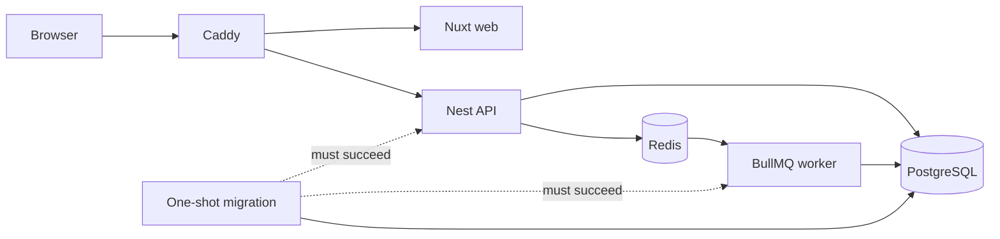

# Containers and VPS deployment

## Delivery model

The root `Dockerfile` produces five targets:

- `development`: pnpm toolchain and workspace dependencies; source is mounted at runtime;
- `web`: standalone Nuxt/Nitro server;
- `api`: Nest HTTP process;
- `worker`: Nest BullMQ process;
- `migrate`: minimal, one-shot Drizzle migration runner.

PostgreSQL and Redis use pinned official images. Caddy is the production edge:
it routes `/api/*` unchanged to Nest and all other requests to Nuxt, and manages
TLS when `DOMAIN` resolves to the VPS.



Production separates `edge`, internal `data`, and worker `egress` networks.
Caddy and Nuxt cannot reach PostgreSQL or Redis. Application filesystems are
read-only, application and migration images run as the unprivileged `node`
user with Linux capabilities dropped, Docker's init forwards signals and reaps
child processes, and writable scratch space is an in-memory `/tmp`.

## Development

Native application processes with containerized dependencies remain the
fastest inner loop:

```bash
cp .env.example .env
pnpm install
pnpm infra:up
pnpm dev
```

For a fully containerized stack with bind-mounted source and hot reload:

```bash
cp .env.example .env
pnpm dev:containers:build
pnpm dev:containers
```

The development image does not copy source, so editing or restarting source
does not rebuild it. Only dependency manifests and the lockfile feed that image
target. Run `pnpm dev:containers:build` once after checkout and again after a
dependency manifest or lockfile change; the normal `pnpm dev:containers` path
does not perform a build check or restart healthy watchers. Compose performs
this startup sequence:

1. start PostgreSQL, Redis and one frozen-lockfile dependency sync into
   Linux-only named volumes in parallel;
2. after dependencies and PostgreSQL are ready, apply pending migrations;
3. after migration and Redis are ready, start one backend development
   container containing the compiler, API and worker watchers, then wait for
   the API readiness check;
4. start Nuxt with hot reload and wait for its health check.

The source bind mount gives immediate reloads while the named `node_modules`
volumes prevent macOS/Linux native packages from being mixed. After changing a
dependency manifest, update `pnpm-lock.yaml`, run `pnpm dev:containers:build`,
then restart `pnpm dev:containers`; the one-shot sync updates the existing
volumes. A manual volume purge is not part of the normal loop.

Development ports bind to loopback only. If a default is occupied, override
`POSTGRES_HOST_PORT`, `REDIS_HOST_PORT`, `API_HOST_PORT` or `WEB_HOST_PORT` in
`.env`; Compose keeps browser-facing API and CORS URLs aligned automatically.
For the native application workflow, also change the ports in `DATABASE_URL`
and `REDIS_URL` to match the host overrides.

`docker compose down` preserves data and dependencies. `docker compose down
--volumes` deletes the development database, Redis data and dependency volumes;
use it only for an intentional reset.

## Production configuration

On the VPS:

```bash
cp .env.production.example .env.production
chmod 600 .env.production
install -d -m 700 secrets
umask 077
openssl rand -hex 32 > secrets/postgres_password
openssl rand -hex 32 > secrets/redis_password
```

Set `DOMAIN`, `WEB_ORIGIN`, database names and any enabled integrations. Keep
`.env.production` and `secrets/` out of Git and unencrypted backups. The example
points Compose at two password files containing independent URL-safe values.
PostgreSQL uses its native password-file contract, Redis reads its password file
at startup, and a small application entrypoint constructs the internal database
and Redis URLs only for the migration, API or worker child process. Caddy and
Nuxt receive neither secret.

This limits credential distribution and keeps passwords out of container
configuration metadata, but local secret files are not an external secret
manager and Docker administrators can still read their mounts. Move the source
values into a VPS secret manager when one is available. Also avoid printing
`docker compose config` in shared logs: optional service tokens and other
interpolated settings can still appear; use `config --quiet` for validation.

CPU and memory limits are not guessed without the VPS size and a load profile.
Before launch, measure steady-state and peak usage, then set service limits with
headroom and verify that PostgreSQL is never the accidental OOM sacrifice.

## Build and deploy

Validate and build without touching the live containers:

```bash
docker compose --env-file .env.production -f compose.prod.yaml config --quiet
docker compose --env-file .env.production -f compose.prod.yaml build --pull
```

Activate the already-built images without entering another rebuild loop:

```bash
docker compose --env-file .env.production -f compose.prod.yaml up -d \
  --no-build --remove-orphans --wait
docker compose --env-file .env.production -f compose.prod.yaml ps
```

Then verify the public TLS path from outside the VPS (replace the hostname):

```bash
curl --fail --show-error --silent https://app.example.com/api/v1/health/ready
curl --fail --show-error --silent --output /dev/null https://app.example.com/
```

The migration image runs first. API and worker creation is gated on its
successful exit; web and Caddy are gated on dependency-aware readiness checks.
A failed build leaves the current stack alone, and a failed migration prevents
the new application containers from starting. Never repair that by editing
migration history on the server.

Compose health checks gate startup, but Docker restart policies react to exits,
not merely an `unhealthy` status. Add an external HTTPS uptime check and an
alerted restart/diagnosis runbook before treating this as unattended production.
The worker has no HTTP surface; monitor its restarts and BullMQ failed/delayed
counts rather than inventing a health check that only proves Node can execute.

The current VPS model builds from a reviewed, tagged checkout. The Dockerfile
pins Node by multi-platform digest, Compose pins infrastructure by exact version
and digest, pnpm is exact, and installs use the frozen lockfile. Review pinned
image updates as dependency changes rather than silently floating major tags.
After the frozen dependency install, compilation and production packaging run
with build networking disabled so an accidental remote fetch fails instead of
quietly making the artifact depend on the weather.

## Release, rollback and backup

Tag every production commit and record the deployed SHA. Roll back by checking
out the prior tag, validating, rebuilding, and activating with the same commands.
Database rollback requires an explicitly reviewed forward-fix or rollback
migration. Container rollback is easy. Data rollback is where optimism goes to
die.

Before production traffic, configure encrypted off-host PostgreSQL backups and
perform a restore drill. Docker volumes are persistence, not backup.

## CI boundary

GitHub Actions remains useful for this local/VPS workflow: `pnpm check` validates
the repository, then one Buildx Bake graph builds all four production images and
therefore catches broken Docker targets, missing build artifacts and invalid
production packaging before VPS deployment. A single graph shares the expensive
dependency/build stages; four isolated matrix runners would repeat them.

CI intentionally does not deploy and does not receive production credentials.
When a registry and retention policy exist, the next step is to publish
commit-SHA images once in CI and make the VPS pull those immutable artifacts;
that removes compiler load and build drift from the server. A production
self-hosted runner must never execute untrusted pull-request jobs.

## Pinned toolchain and references

Verified 2026-07-22 with Docker Engine 29.4.1 and Docker Compose 5.1.3:

- Node `24.11.0-bookworm-slim`, pnpm `10.33.0`;
- PostgreSQL `18.4-alpine3.24`;
- Redis `8.8.0-alpine3.23`;
- Caddy `2.11.4-alpine`.

The repository contract currently pins pnpm 10.33.0. Its official 10.x
documentation is now marked as no longer actively maintained; upgrade to pnpm
11 in a separate, tested toolchain change rather than smuggling it into a
container refactor.

Official guidance:

- [Docker build best practices](https://docs.docker.com/build/building/best-practices/)
- [Docker build cache optimization](https://docs.docker.com/build/cache/optimize/)
- [Docker multi-stage builds](https://docs.docker.com/build/building/multi-stage/)
- [Docker Buildx Bake targets](https://docs.docker.com/build/bake/targets/)
- [Compose startup and readiness order](https://docs.docker.com/compose/how-tos/startup-order/)
- [Compose production deployments](https://docs.docker.com/compose/how-tos/production/)
- [Compose Watch and bind-mount trade-offs](https://docs.docker.com/compose/how-tos/file-watch/)
- [Compose secrets](https://docs.docker.com/reference/compose-file/secrets/)
- [pnpm 10 Docker recipe](https://pnpm.io/10.x/docker)
- [Official Node image best practices](https://github.com/nodejs/docker-node/blob/main/docs/BestPractices.md)
