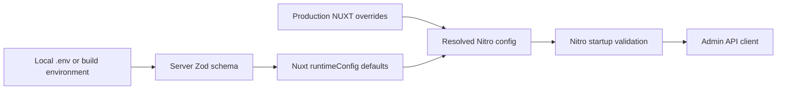

# Frontend foundation

Status: accepted admin-only foundation, verified 2026-07-22.

The frontend in `apps/web` is the private Join The Six administration panel.
It is a Nuxt, Vue and PrimeVue client application for staff operations. The
public website, registration, intake and participant-facing journeys are owned
by the existing Next.js application at `legacy.example.com`; see
[ADR 0004](decisions/0004-admin-only-boundary.md).

## Start here

| Task                               | Location                                | First reference                                      |
| ---------------------------------- | --------------------------------------- | ---------------------------------------------------- |
| Add an admin route                 | `apps/web/app/pages/admin/`             | Existing sibling page and route contract below       |
| Add a domain schema or pure helper | `apps/web/app/features/<domain>/`       | `features/event/schema.ts`                           |
| Add domain UI                      | `apps/web/app/components/<domain>/`     | `components/admin/AdminNavigation.vue`               |
| Reuse or add shared UI             | `apps/web/app/components/ui/`           | [Component inventory](frontend/components/README.md) |
| Use a PrimeVue primitive           | Owning page, layout or component        | Local import policy below                            |
| Call the API                       | `app/composables/useApi.ts`             | `app/plugins/api.ts`                                 |
| Change application layout CSS      | `app/assets/css/main.css`               | Existing named section                               |
| Change a shared visual value       | `packages/design-tokens/src/tokens.css` | Token ownership below                                |
| Change PrimeVue appearance         | `app/theme/jts-preset.ts`               | PrimeVue theme tokens                                |
| Change route handling or headers   | `apps/web/nuxt.config.ts`               | `routeRules`                                         |

Nuxt component discovery uses `pathPrefix: false`: filenames are template
names and directories express ownership. Keep filenames globally unique.
Shared project components use the `Jts*` prefix.

## Product and route boundary

| Route                 | Behavior                          | Indexing                                             |
| --------------------- | --------------------------------- | ---------------------------------------------------- |
| `/`                   | Redirects to `/admin`             | Inherits private application policy                  |
| `/admin`, `/admin/**` | Client-rendered staff application | `noindex, nofollow` in metadata and response headers |

Do not add `/join`, `/register`, `/feedback`, marketing or public legal routes
to this application. They belong in the existing Next.js public product. A
future integration between that product and the operations backend starts with
an explicit API, consent and abuse-control contract, not by quietly recreating
its screens here.

Each admin page owns an accurate title and description, one `h1`, and robots
metadata. The global head also defaults to `noindex, nofollow`. Pages use the
`admin` layout and the `admin-page-stack` root class. The layout provides the
focusable `#main-content` landmark, skip-link target, navigation, the operator
menu docked in the sidebar footer (a top bar carries it on small screens where
the sidebar is hidden), mobile drawer, toast region and reduced-motion policy.

There is no frontend authentication contract yet. Add named admin middleware
and session UI only with matching backend session endpoints and cookie policy.
A client route guard improves navigation; it does not authorize API requests.

## Application boundaries

```text
app/
├── components/ui/          shared, domain-free Jts* contracts
├── components/<domain>/    admin domain UI and interaction boundaries
├── features/<domain>/      schemas, types and pure helpers
├── composables/            shared state and app-facing facades
├── layouts/admin.vue       persistent private application shell
├── pages/admin/            route metadata, data and composition
├── plugins/                integration bootstrap
└── theme/                  PrimeVue preset and module import wrapper
```

`features/` has no Nuxt runtime behavior and remains independently testable.
Pages orchestrate routes; they do not absorb reusable table or form behavior.
Shared UI does not hide domain API calls or business rules.

Choose UI in this order:

1. Reuse a matching project component.
2. Use a PrimeVue primitive directly.
3. Compose a documented `Jts*` component when repeated operational behavior is
   the real abstraction.
4. Use semantic HTML and CSS for content and layout.

The shared contracts are `JtsPageHeader`, `JtsStat` and `JtsDataTable`. Their
contracts are linked from the
[component inventory](frontend/components/README.md). Columns, filters, cell
formatting and row actions remain with the consuming feature. Wrapping PrimeVue
only to rename props is filing paperwork in a nicer font.

## PrimeVue and theme

PrimeVue 4.5.5 is registered with `autoImport: false`. Every primitive is
imported locally by the admin page, layout or component that uses it. The Nuxt
application no longer carries a global SSR component allow-list because it has
no public SSR routes.

The current admin shell and overview use PrimeVue `Avatar`, `Button`, `Card`,
`Column`, `DataTable`, `DatePicker`, `Dialog`, `Drawer`, `InputText`,
`PanelMenu`, `Popover`, `ProgressBar`, `SelectButton`, `Tag`, `Toast` and
`Toolbar`. The client-only
PrimeVue module registration installs `ToastService` when it discovers the
locally imported `Toast`; `useToast` remains an explicit import. Do not install
the service again in an application plugin.

Extend PrimeVue through `app/theme/jts-preset.ts`. `jts-theme.ts` is only the
Nuxt module import wrapper. Prefer semantic/component theme tokens or documented
pass-through attributes over selectors coupled to generated DOM.

PrimeVue 5, PrimeUI themes 3 and PrimeIcons 8 require a PrimeUI licence
decision. The current MIT stack stays on PrimeVue and its Nuxt module 4.5.5,
`@primeuix/themes` 2.0.3 and PrimeIcons 7.0.0. Upgrade them together.

## API, state and forms

`app/plugins/api.ts` provides `$api`, an `ofetch` instance with:

- `NUXT_API_BASE_INTERNAL` on the server and `NUXT_PUBLIC_API_BASE` in browsers;
- credentialed requests, a 15-second timeout and no automatic retries;
- only `cookie` and `x-request-id` forwarded from inbound server requests.

`environment.server.ts` parses build and development variables through Zod.
`environment.public.ts` contains only browser-safe runtime configuration. A
Nitro startup plugin validates the resolved config again so production
overrides cannot bypass the build-time check. Do not read application variables
directly from `process.env` inside Vue code.



`useApi()` is the application-facing seam for imperative admin calls. Treat
unshared responses as `unknown` and parse them with the owning feature Zod
schema. Prefer a generated OpenAPI client or shared contract package once the
backend contract stabilizes.

Forms connect errors with `aria-describedby`, focus the first invalid field,
preserve values on retryable failure and never display raw server messages.
Preview-only interactions must say that they do not persist; do not simulate a
successful backend write.

## CSS, tokens, fonts and motion

| Owner                                   | Responsibility                                                                            |
| --------------------------------------- | ----------------------------------------------------------------------------------------- |
| `packages/design-tokens/src/tokens.css` | Framework-neutral semantic values used by more than one consumer                          |
| `app/theme/jts-preset.ts`               | PrimeVue primitive, semantic and component tokens                                         |
| `app/assets/css/main.css`               | Admin shell, route composition, shared project-component layout and standalone error page |
| Vue component markup/styles             | Domain-specific structure without a duplicate token system                                |

Manrope Variable 5.3.0 is self-hosted through Fontsource (OFL-1.1) as the single
type family for display, UI and body; it carries **Latin and Greek** so operator
Greek and English render identically, with system sans as the fallback. The
design tokens, the single-class light/dark mechanism and how PrimeVue consumes
the tokens are documented in [`frontend/theming.md`](frontend/theming.md) and
[ADR 0005](decisions/0005-theming-and-dark-mode.md).
`MotionConfig` uses `reduced-motion="user"`; CSS also collapses animation for
`prefers-reduced-motion`. Motion communicates continuity or state change and
never carries status by itself.

Every new screen preserves one logical `h1`, landmarks, explicit labels,
keyboard-visible focus, status text in addition to color, and reduced-motion
behavior. Local preview data remains visibly identified until a real API owns
the state.

## Delivery constraints

Verified with Nuxt 4.5.0, Nitro 2.13.4, Vue 3.5.40, PrimeVue 4.5.5 and Vite
8.1.5 on 2026-07-22:

- admin routes use `ssr: false`; the standalone Nitro server still owns runtime
  config and response headers;
- the `build:manifest` hook removes entry dynamic-import prefetch hints and the
  unused PrimeIcons SVG fallback;
- client source maps stay disabled and server maps stay enabled;
- Nitro produces the standalone Node server and Caddy owns compression;
- automatic chunk splitting remains; arbitrary vendor chunks would move bytes
  without removing them.

Node must satisfy `>=24.11 <25`. `package.json` and `pnpm-lock.yaml` are the
source of truth for exact dependency versions.

## Verification and extension

From the repository root:

```bash
pnpm --filter @join-the-six/web lint
pnpm --filter @join-the-six/web typecheck
pnpm --filter @join-the-six/web test
pnpm --filter @join-the-six/web build
```

For each admin vertical slice, confirm the backend permission contract, add the
schema boundary, implement loading/empty/error states, preserve accessibility,
add accurate private metadata and write the narrowest test that protects the
behavior.

## Official references

Library behavior was verified 2026-07-22 against:

- [Nuxt directory structure](https://nuxt.com/docs/4.x/directory-structure/)
- [Nuxt rendering modes](https://nuxt.com/docs/4.x/guide/concepts/rendering)
- [Nuxt runtime config](https://nuxt.com/docs/4.x/guide/going-further/runtime-config)
- [Nuxt SEO metadata](https://nuxt.com/docs/4.x/getting-started/seo-meta)
- [PrimeVue DataTable](https://v4.primevue.org/datatable/)
- [PrimeVue accessibility](https://v4.primevue.org/guides/accessibility/)
- [Vue TypeScript Composition API](https://vuejs.org/guide/typescript/composition-api)
- [Zod documentation](https://zod.dev/)
