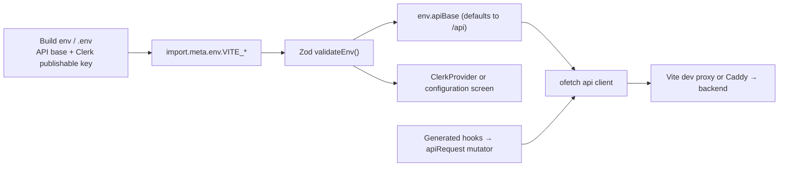

# Frontend foundation

Status: accepted admin-only foundation, verified 2026-07-25.

The frontend in `apps/admin` is the private Join The Six administration panel.
It is a React 19 single-page application built with Clerk 6, HeroUI v3, Tailwind
CSS v4, TanStack Query, TanStack Table, React Router 7 and Vite. It replaces the
retired Nuxt/PrimeVue client, removed in the same change that introduced this
one. The
public website, registration, intake and participant-facing journeys are owned
by the existing Next.js application at `legacy.example.com`; see
[ADR 0004](decisions/0004-admin-only-boundary.md).

## Start here

| Task                                  | Location                                      | First reference                                              |
| ------------------------------------- | --------------------------------------------- | ------------------------------------------------------------ |
| Add an admin route                    | `apps/admin/src/routes/`                      | `routes/OverviewPage.tsx` and the table in `App.tsx`         |
| Extend the AI assistant               | `apps/admin/src/routes/AssistantPage.tsx`     | [Assistant screen contract](frontend/assistant.md)           |
| Change the feedback inbox             | `apps/admin/src/routes/FeedbackInboxPage.tsx` | [Feedback conversations](frontend/feedback-conversations.md) |
| Add a domain schema or pure helper    | `apps/admin/src/features/<domain>/`           | `features/event/schema.ts`                                   |
| Add domain UI                         | `apps/admin/src/components/admin/`            | `components/admin/AdminNavigation.tsx`                       |
| Reuse or add shared UI                | `apps/admin/src/components/ui/`               | [Component inventory](frontend/components/README.md)         |
| Use a HeroUI primitive                | Owning route or component                     | Import from `@heroui/react`                                  |
| Call a backend endpoint               | `apps/admin/src/api/generated/`               | [Generated client](backend/mechanisms/api-contract.md)       |
| Change transport policy               | `apps/admin/src/lib/api.ts`                   | `apps/admin/src/lib/env.ts`                                  |
| Regenerate the API client             | `pnpm api:generate` (root)                    | [API contract](backend/mechanisms/api-contract.md)           |
| Read appearance / toggle dark mode    | `apps/admin/src/lib/useTheme.ts`              | Pre-paint script in `index.html`                             |
| Change the token bridge / HeroUI look | `apps/admin/src/styles/globals.css`           | Named section in that file                                   |
| Change a shared visual value          | `packages/design-tokens/src/tokens.css`       | Token ownership below                                        |
| Change routing, redirect or 404       | `apps/admin/src/App.tsx`                      | `Routes` table                                               |
| Change the dev proxy or build         | `apps/admin/vite.config.ts`                   | `/api` proxy and env contract below                          |

Components are imported explicitly — there is no filename-based discovery.
Shared project components use the `Jts*` prefix. One component per file, named
export matching the filename; colocate types and export them only when a
consumer needs them.

## Product and route boundary

| Route                                 | Behavior                                                       | Indexing                |
| ------------------------------------- | -------------------------------------------------------------- | ----------------------- |
| `/sign-in/*`                          | Clerk sign-in with explicit loading and service-failure states | `noindex, nofollow`     |
| `/`                                   | Protected redirect to `/admin` (`<Navigate replace>`)          | Inherits private policy |
| `/admin`                              | Clerk session plus backend admin check, then operations shell  | `noindex, nofollow`     |
| `/admin/assistant`                    | Protected new AI conversation in the admin shell               | `noindex, nofollow`     |
| `/admin/assistant/:threadId`          | Exact durable assistant thread resume                          | `noindex, nofollow`     |
| `/admin/events`                       | Stub event list and create                                     | `noindex, nofollow`     |
| `/admin/events/:eventId`              | Event edit, status transitions and attendance                  | `noindex, nofollow`     |
| `/admin/participants`                 | Participant list and feedback WhatsApp opt-in                  | `noindex, nofollow`     |
| `/admin/participants/:id`             | Participant profile, opt-in chip/toggle and dinner history     | `noindex, nofollow`     |
| `/admin/feedback`                     | Feedback campaign picker (open a campaign, or launch one)      | `noindex, nofollow`     |
| `/admin/feedback/:campaignId`         | Three-pane post-event feedback conversation inbox              | `noindex, nofollow`     |
| `/admin/feedback/:campaignId/results` | Campaign answers and notes                                     | `noindex, nofollow`     |
| `*`                                   | Standalone 404 (`routes/ErrorPage.tsx`)                        | Inherits private policy |

Do not add `/join`, `/register`, `/feedback`, marketing or public legal routes
to this application. They belong in the existing Next.js public product. A
future integration between that product and the operations backend starts with
an explicit API, consent and abuse-control contract, not by quietly recreating
its screens here.

`noindex, nofollow` is declared once as a static `<meta name="robots">` in
`index.html` and covers the whole SPA. Each routed view sets its own accurate
title and description through `usePageMeta` (`src/lib/usePageMeta.ts`), which
never touches robots, and owns a single `h1`. The shell provides the focusable
`#main-content` landmark and skip-link target, the navigation landmark, the
operator menu docked in the sidebar footer (a top bar carries it on small
screens where the sidebar is hidden), the mobile drawer, the toast region
(`<Toast.Provider />` in `App.tsx`) and the reduced-motion policy.

`ClerkProvider` owns browser session state. `RequireAdmin` first checks Clerk,
then calls the generated `useGetAuthSession` hook; only a backend-approved
subject reaches the shell. It renders distinct loading, denial and retryable
failure states. The operator menu displays the Clerk identity and performs real
sign-out. This
client guard improves navigation only: the Nest guard and resource-owner
predicates authorize every API request. See
[Admin authentication](backend/mechanisms/authentication.md).

## Application boundaries

```text
src/
├── api/generated/          orval output: hooks, models, Zod schemas (never edited)
├── components/ui/          shared, domain-free Jts* contracts
├── components/admin/       admin shell and domain UI
│   └── RequireAdmin.tsx    Clerk session + backend authorization gate
├── features/<domain>/      client-only schemas and pure helpers (no React imports)
├── lib/                    hooks and facades (api, api-mutator, env, queryClient, useTheme, usePageMeta)
├── routes/                 route metadata, data and composition
├── styles/globals.css      the design-token bridge + base layer + motifs
├── theme/                  reserved (empty); the HeroUI mapping lives in globals.css
├── App.tsx                 router: skip link, Toast.Provider, route table
└── main.tsx                React root mount (StrictMode + QueryClientProvider + ClerkProvider)
```

`features/` has no React runtime behavior and remains independently testable.
Routes orchestrate; they do not absorb reusable table or form behavior. Shared
UI does not hide domain API calls or business rules.

Choose UI in this order:

1. Reuse a matching project component.
2. Use a HeroUI primitive directly (import from `@heroui/react`).
3. Compose a documented `Jts*` component when repeated operational behavior is
   the real abstraction.
4. Use semantic HTML and CSS for content and layout.

The shared contracts are `JtsPageHeader`, `JtsStat`, `JtsDataTable` and
`JtsLiveIndicator`. Their contracts are linked from the
[component inventory](frontend/components/README.md). Columns, filters, cell
formatting and row actions remain with the consuming route — adding a table
column is a consumer-side `ColumnDef` change and touches no `Jts*` file.
Wrapping HeroUI only to rename props is filing paperwork in a nicer font.

## HeroUI and theme

HeroUI v3.2.2 is imported per component from `@heroui/react`; its stylesheet
(`@heroui/styles`) is imported once in `src/styles/globals.css`. HeroUI v3 is
CSS-first (React Aria behavior + Tailwind v4 styling) and has no application
provider to mount — the only global HeroUI mount is `<Toast.Provider />` in
`App.tsx`, paired with the imperative `toast()` API. Icons come from
`lucide-react`; conditional class strings use `clsx`; `tailwind-variants` is a
HeroUI dependency, not a project abstraction.

The admin shell and overview currently use HeroUI `Avatar`, `Button`, `Chip`,
`Drawer`, `Input`, `ListBox`, `Modal`, `Pagination`, `Popover`, `ProgressBar`,
`Select`, `Separator`, `Table`, `Toast`, `ToggleButton` and `ToggleButtonGroup`
through their compound sub-components (`Table.Content`, `Drawer.Dialog`,
`Modal.Body`, `Popover.Content`, `Select.Popover`, `ProgressBar.Track` …).

Extend HeroUI appearance through the token bridge in `src/styles/globals.css`;
there is no theme preset. HeroUI's base tokens (`--surface`, `--accent`, …) are
overridden unlayered in `:root` with `var(--jts-*)` references, and because the
`--jts-*` tokens flip under `:root.dark`, HeroUI flips with them — no second
theme definition exists. Prefer semantic tokens and the Tailwind utilities the
bridge exposes over selectors coupled to generated DOM.

`JtsDataTable` skins a headless TanStack Table 8.21.3 core (sorting, client
pagination and the row model) with the HeroUI `Table`. The single type escape
hatch is a `ColumnMeta.align` module augmentation for column alignment; the page
owns every `ColumnDef`. Routing is React Router 7.18.1 in declarative
(`BrowserRouter`) mode — no data router, no loaders. `NavLink` drives
`aria-current` and active styling; `<Outlet>` renders the routed view inside the
shell's animated main region.

`@heroui/react` and `@heroui/styles` share a release train — upgrade them
together (both 3.2.2). `package.json` and `pnpm-lock.yaml` are the source of
truth for exact dependency versions.

## API, state and forms

`src/lib/api.ts` exports `api`, a single `ofetch` instance with:

- `baseURL` set to the validated `env.apiBase`;
- Clerk's current session token overwriting `Authorization` before every
  request, plus `credentials: "include"` for Clerk's cookie flow;
- `retry: 0` so mutations never double-fire, and a 15-second timeout.

It is the client port of the previous `$fetch` seam; because this is a client-only
SPA, all SSR request-header forwarding is dropped.

`src/lib/env.ts` validates the browser environment with Zod at module load.
Vite exposes only `import.meta.env.VITE_*` to the bundle. `VITE_API_BASE` is
optional, defaults to `/api`, and must be a safe root-relative or HTTP(S) URL.
`VITE_CLERK_PUBLISHABLE_KEY` must have Clerk's public-key shape when present.
Credential-free CI builds may omit it; the artifact then renders a clear
configuration screen. A deployable admin image must bake the publishable key at
build time. Do not read `import.meta.env` directly in component code — go
through `env`.



### Call endpoints through the generated client

Every endpoint in the backend's OpenAPI document reaches this app as a generated,
named, typed hook. Do not hand-write a fetch call, a URL string or a Zod schema
for a response the document already describes.

```tsx
import { useGetAuthSession } from "../../api/generated/auth";

const session = useGetAuthSession({ query: { enabled: isSignedIn } });
```

- `src/api/generated/` is orval output: TanStack Query hooks per tag,
  request/response types under `model/`, and matching Zod schemas under `zod/`.
  It is committed, typechecked, excluded from ESLint and **never edited by
  hand**.
- Hook names come from the backend `operationId`: `getAuthSession` produces
  `useGetAuthSession`, `getGetAuthSessionQueryKey` and the
  `GetAuthSessionResponse` schema. A missing endpoint is a backend change, not a
  local fetch call.
- Every generated call goes through `src/lib/api-mutator.ts`, which delegates to
  the `api` client above; authentication, retries and timeouts are still owned by
  `api.ts` alone.
- `main.tsx` mounts one `QueryClientProvider` (`src/lib/queryClient.ts`). Query
  and mutation retries are off, matching the client's `retry: 0`; a screen owns
  its loading, empty and error states rather than a silent retry loop.
- Generated Zod schemas are for values that leave the typed path — a form draft,
  a persisted value, a payload echoed back. Import them from
  `src/api/generated/zod/`; do not copy a backend schema into `features/`.
- `features/<domain>/` keeps client-only schemas and pure helpers: draft
  validation, derived view models, formatting. It no longer mirrors response
  shapes.

Regenerate whenever a backend endpoint changes, in the same change:

```bash
pnpm api:generate   # emits openapi.json, then regenerates the client
pnpm api:check      # regenerates and fails on drift (runs inside pnpm check)
```

The pipeline, its invariants and its failure modes are documented in
[API contract and generated client](backend/mechanisms/api-contract.md) and
[ADR 0009](decisions/0009-generated-api-client.md).

`RequireAdmin` is the reference consumer for generated hooks. Events,
participants and the post-event feedback inbox use `useListEvents`,
`useGetEvent`, `useListParticipants`, `useGetParticipant`,
`useListParticipantEvents`,
`useListFeedbackCampaignConversations` and their mutation siblings; new screens
follow the same generated-hook pattern.

Exactly **two** places call the transport directly, both documented and both
enforced by `apps/admin/test/feedback-inbox.spec.ts`:

- the assistant ([`frontend/assistant.md`](frontend/assistant.md)), whose
  polling flow owns extra client-side semantics beyond the response shape;
- the dev feedback simulator (`src/lib/feedbackSimulator.ts`), whose controller
  is mounted only outside production under `TRANSPORT_MODE=simulated` and is
  therefore absent from the published OpenAPI document
  ([`frontend/feedback-conversations.md`](frontend/feedback-conversations.md)).

Neither is a pattern to copy for ordinary CRUD. A third entry in that list means
a product endpoint bypassed the generated client.

The AI assistant is the first real queue-backed API consumer. It creates and
resumes server-owned threads, persists each user/assistant turn, and polls the
same turn ID through `queued` / `running`. Client-minted `requestId` values make
create/append POSTs idempotent, so recovery can replay the same write instead of
duplicating work. Validated terminal text enters the memoized, sanitised
Markdown renderer copied from the established `notes_ai` chat. Its exact model,
durability, rendering and recovery contracts are maintained in
[`frontend/assistant.md`](frontend/assistant.md).

Forms connect errors with `aria-describedby`, focus the first invalid field,
preserve values on retryable failure and never display raw server messages.
Preview-only interactions must say that they do not persist; do not simulate a
successful backend write. The Overview event dialog is the reference: it parses
its draft with the feature schema, focuses the first invalid input, and both a
copper note and the success toast state that it writes local UI state only.

## CSS, tokens, fonts and motion

| Owner                                   | Responsibility                                                                                                          |
| --------------------------------------- | ----------------------------------------------------------------------------------------------------------------------- |
| `packages/design-tokens/src/tokens.css` | Framework-neutral semantic `--jts-*` values; single source of truth; light plus the `:root.dark` flip                   |
| `apps/admin/src/styles/globals.css`     | The bridge: HeroUI base-token overrides, the Tailwind `@theme inline` vocabulary, the base layer, and the motif classes |
| Component and route markup (Tailwind)   | Domain structure using only semantic utilities — no raw hex, no default Tailwind palette classes                        |

`globals.css` is layered as documented in its header: HeroUI base tokens are
mapped to `--jts-*`, Tailwind's `@theme inline` block adds the `jts` utility
vocabulary (`ink`, `canvas`, `primary`, `copper`, `info`, `sidebar-*` …), and a
small base layer carries app-wide rules (focus ring, selection, headings,
reduced motion) plus the three sanctioned classes `.skip-link`, `.brand-mark`
and `.status-dot`.

Manrope Variable 5.3.0 is self-hosted through Fontsource (OFL-1.1), imported in
`globals.css`, as the single type family for display, UI and body; it carries
**Latin and Greek** so operator Greek and English render identically, with
system sans as the fallback. The build emits the Manrope subsets as separate
`woff2` assets.

Dark mode is the `dark` class on `<html>`, shared by the tokens, HeroUI and
Tailwind. The pre-paint script in `index.html` applies it before first paint
(no flash); `src/lib/useTheme.ts` owns it afterwards through a module-level
`useSyncExternalStore` so every consumer — the operator menu renders in both the
sidebar and the top bar — stays in sync. The design tokens, the single-class
mechanism and the HeroUI integration are documented in
[`frontend/theming.md`](frontend/theming.md) and
[ADR 0005](decisions/0005-theming-and-dark-mode.md).

Motion is the 200ms opacity/8px-rise page entrance (`motion/react`, keyed by
pathname, respecting `useReducedMotion`) plus component-internal HeroUI
transitions; `globals.css` also collapses animation under
`prefers-reduced-motion`. Motion communicates continuity or state change and
never carries status by itself.

Every new screen preserves one logical `h1`, landmarks, explicit labels,
keyboard-visible focus, status text in addition to color, and reduced-motion
behavior. Local preview data remains visibly identified until a real API owns
the state.

## Delivery constraints

Verified with React 19.2.8, Clerk React 6.12.6, HeroUI 3.2.2, Tailwind CSS
4.3.3, TanStack Query 5.101.4, TanStack Table 8.21.3, React Router 7.18.1, Vite
8.1.5, orval 8.23.0 and Zod 4.4.3 on 2026-07-25:

- the client is a static SPA with no SSR or SSG; `build` runs
  `tsc -b --noEmit && vite build`, so a type error gates the bundle;
- `index.html` ships the pre-paint theme script and a static, focusable
  `#main-content` fallback with a `role="status"` message and a `<noscript>`
  notice, so the landmark and status exist before the SPA mounts;
- every routed view is a React-lazy boundary. The production build emits a
  ~173.53 kB entry (~55.73 kB gzip, including TanStack Query and the generated
  client the admin gate uses), a ~159.11 kB Overview chunk (~49.87 kB gzip), a
  ~362.53 kB Assistant chunk (~111.46 kB gzip) and small events/participants
  chunks (~2–6 kB each) over a shared ~154.92 kB table/header chunk. Rolldown
  also separates Clerk (`auth`, ~92.47 kB), HeroUI (`ui`, ~65.62 kB) and the
  Assistant Markdown stack (`markdown`, ~168.84 kB); the Markdown group is
  fetched only with the Assistant route;
- Mermaid's generated parser runtime is an indivisible ~662.68 kB module
  (~143.23 kB gzip), but it is dynamically imported only when an assistant
  message contains a fenced Mermaid diagram. Vite's advisory threshold is
  therefore 700 kB; there is no hard application-wide chunk budget for this
  private admin SPA;
- CSS is ~455.65 kB (~50.13 kB gzip), with Manrope subsets and Mermaid diagram
  assets emitted separately;
- client source maps stay off (Vite's default; not overridden);
- the dev server runs on port 3000 and proxies `/api` to `http://localhost:4000`
  (the backend `API_PORT`) with `changeOrigin`. Port 3000 is the CORS-trusted
  `WEB_ORIGIN`, so same-origin cookies work end to end. In production, Caddy
  reverse-proxies `/api` to the backend for the same same-origin contract.

Node must satisfy `>=24.11 <25` and pnpm `>=10.33 <11` (`package.json`
`engines`). `package.json` and `pnpm-lock.yaml` are the source of truth for
exact dependency versions.

## Verification and extension

From the repository root:

```bash
pnpm --filter @join-the-six/admin lint
pnpm --filter @join-the-six/admin typecheck
pnpm --filter @join-the-six/admin test
pnpm --filter @join-the-six/admin build
```

Root `pnpm check` runs the same four Turbo phases across the workspace, plus
`pnpm api:check`, which regenerates the client and fails when the committed
output drifts from the backend contract. Tests run in vitest's node environment
and assert reality without a DOM: the `index.html`/`App.tsx` delivery invariants
(pre-paint theme, robots, focusable landmark, root redirect), the generated API
client wiring (path transformer, one hook per operation, the mutator seam, the
single query client), the pure `resolveTheme` logic, and the real `tokens.css`
resolved to WCAG AA contrast in both themes.

For each admin vertical slice, confirm the backend permission contract, consume
the generated hooks (regenerating them with the backend change), implement
loading/empty/error states, preserve accessibility, add accurate private metadata
and write the narrowest test that protects the behavior.

## Official references

Library behavior was verified 2026-07-25 against:

- [HeroUI v3 introduction](https://v3.heroui.com/docs/introduction)
- [Tailwind CSS v4 theme variables](https://tailwindcss.com/docs/theme)
- [TanStack Query v5 React adapter](https://tanstack.com/query/latest/docs/framework/react/overview)
- [TanStack Table v8 React adapter](https://tanstack.com/table/v8/docs/framework/react/react-table)
- [orval configuration](https://orval.dev/reference/configuration/overview)
- [React Router v7 documentation](https://reactrouter.com/)
- [Clerk React quickstart](https://clerk.com/docs/react/getting-started/quickstart)
- [Vite build options](https://vite.dev/guide/build.html)
- [Rolldown manual code splitting](https://rolldown.rs/in-depth/manual-code-splitting)
- [Vite server proxy](https://vite.dev/config/server-options.html#server-proxy)
- [Vite env variables and modes](https://vite.dev/guide/env-and-mode.html)
- [Zod documentation](https://zod.dev/)
