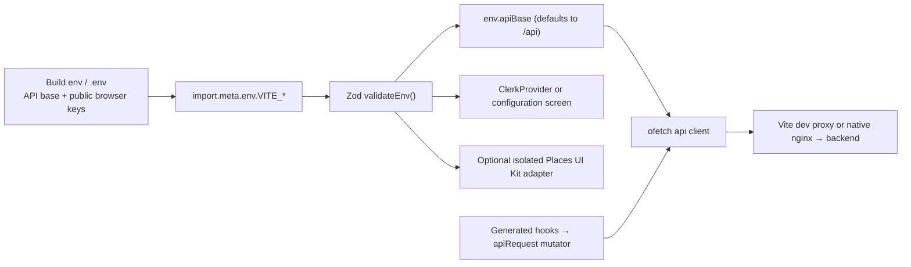

# Frontend foundation

Status: accepted admin-only foundation, verified 2026-07-25.

`apps/admin` is the private Slopform operator panel: a React 19 SPA
(Clerk 6, HeroUI v3, Tailwind CSS v4, TanStack Query/Table, React Router 7,
Vite). It replaced the retired Nuxt/PrimeVue client (historical;
[ADR 0006](decisions/0006-react-admin-runtime.md)). Historical Join The Six
public journeys lived on a separate Next.js site
([ADR 0004](decisions/0004-admin-only-boundary.md)). Public identity:
[ADR 0014](decisions/0014-public-slopform-identity.md).

Editing rules live in [`apps/admin/AGENTS.md`](../apps/admin/AGENTS.md). This
page maps ownership, routes, transport and delivery constraints, and points at
focused contracts.

## Start here

| Task                        | Location                                           | First reference                                              |
| --------------------------- | -------------------------------------------------- | ------------------------------------------------------------ |
| Add an admin route          | `apps/admin/src/routes/`                           | `OverviewPage.tsx` + route table in `App.tsx`                |
| Overview landing            | `routes/OverviewPage/OverviewPage.tsx`             | [Overview](frontend/overview.md)                             |
| AI assistant                | `routes/AssistantPage/AssistantPage.tsx`           | [Assistant](frontend/assistant.md)                           |
| Feedback inbox              | `routes/FeedbackInboxPage/FeedbackInboxPage.tsx`   | [Feedback conversations](frontend/feedback-conversations.md) |
| Outbound queue              | `routes/FeedbackOutboxPage/FeedbackOutboxPage.tsx` | [Outbound queue](frontend/feedback-outbound-queue.md)        |
| Domain schema / pure helper | `features/<domain>/`                               | `features/event/eventStatus.ts`                              |
| Domain UI                   | `components/admin/`                                | `AdminNavigation.tsx`                                        |
| Shared UI                   | `components/ui/`                                   | [Component inventory](frontend/components/README.md)         |
| HeroUI primitive            | Owning route or component                          | `@heroui/react`                                              |
| Call a backend endpoint     | `api/generated/`                                   | [API contract](backend/mechanisms/api-contract.md)           |
| Transport / env policy      | `lib/api.ts`, `lib/env.ts`                         | Env table below                                              |
| Regenerate API client       | `pnpm api:generate` (root)                         | [API contract](backend/mechanisms/api-contract.md)           |
| Theme / dark mode / tokens  | `useTheme.ts`, `globals.css`, design-tokens        | [Style guide](../apps/admin/README.md)                       |
| Routing / redirect / 404    | `App.tsx`                                          | Route table below                                            |
| Dev proxy / build           | `vite.config.ts`                                   | Delivery constraints below                                   |

Imports are explicit (no filename discovery). Shared components use the `Jts*`
prefix: one file, named export matching the filename; export types only when a
consumer needs them.

## Product and route boundary

| Route                                 | Behavior                                                                               |
| ------------------------------------- | -------------------------------------------------------------------------------------- |
| `/sign-in/*`                          | Clerk sign-in frame (page `h1`, form placeholder while loading, service-failure state) |
| `/`                                   | Protected redirect to `/admin`                                                         |
| `/admin`                              | Clerk + backend admin check → Overview ([contract](frontend/overview.md))              |
| `/admin/assistant`                    | New AI conversation                                                                    |
| `/admin/assistant/:threadId`          | Durable thread resume (`assistant/:threadId?` in `App.tsx`)                            |
| `/admin/events`                       | Stub event list and create                                                             |
| `/admin/events/:eventId`              | Edit, status transitions, attendance                                                   |
| `/admin/participants`                 | List + feedback WhatsApp opt-in                                                        |
| `/admin/participants/:id`             | Profile, Preferences opt-in, dinner history                                            |
| `/admin/feedback`                     | Campaign picker                                                                        |
| `/admin/feedback/:campaignId`         | Three-pane inbox                                                                       |
| `/admin/feedback/:campaignId/results` | Campaign answers and notes                                                             |
| `/admin/outbound`                     | Outbound queue (not under `feedback/`, so nav `aria-current` stays unambiguous)        |
| `/admin/cookbook`                     | **Dev only** — `import.meta.env.DEV` gallery ([contract](frontend/admin-cookbook.md))  |
| `*`                                   | Standalone 404 (`ErrorPage.tsx`)                                                       |

`noindex, nofollow` is one static meta in `index.html` for the whole SPA. Do not
add `/join`, `/register`, `/feedback`, marketing or public legal routes here.

Each view sets title/description via `usePageMeta` (never robots) and owns one
`h1`. The shell owns `#main-content`, skip link, nav, operator menu (sidebar
footer; top bar on small screens), drawer, `<Toast.Provider />` and
reduced-motion. Accessibility invariants:
[`apps/admin/AGENTS.md`](../apps/admin/AGENTS.md).

`RequireAdmin`: Clerk session, then `useGetAuthSession`; only a backend-approved
subject reaches the shell. Client guard improves navigation only — Nest
authorizes every API request
([authentication](backend/mechanisms/authentication.md)).

While Clerk loads, paint the URL's promise: `/sign-in/*` → `SignInLayout` +
`SignInFormPlaceholder`; elsewhere → `AuthPendingScreen`. `SignInLayout` lives
outside the router so waiting and routed sign-in share one frame.
`AuthStatusScreen` covers `configuration` / `denied` / `failed`. Style Clerk
`elements` with CSS objects (unlayered Clerk CSS outranks Tailwind layers).

## Application boundaries

```text
src/
├── api/generated/          orval output (never edited)
├── components/ui/          shared, domain-free Jts* contracts
├── components/admin/       admin shell and domain UI
│   └── RequireAdmin.tsx    Clerk + backend authorization gate
├── features/<domain>/      client-only schemas and pure helpers (no React)
├── lib/                    api, api-mutator, env, queryClient, useTheme, usePageMeta, …
├── routes/<PageName>/      page component, local hooks, helpers and sections
├── styles/globals.css      token bridge + base layer + motifs
├── App.tsx                 skip link, Toast.Provider, route table
└── main.tsx                StrictMode + QueryClientProvider + ClerkProvider
```

Each route owns a `routes/<PageName>/` folder with a named `<PageName>.tsx`
entry, imported explicitly by `App.tsx`. The entry sets page metadata and
composes the screen. Put page-specific state, queries and actions in adjacent
`use…Controls` hooks; split a large hook further by responsibility (selection,
results editing, assistant session, scroll). Keep local sections, column
builders, presentation helpers and fixtures beside their page, with names that
say what they own rather than catch-all `helpers.ts` or `utils.ts` files.
Small pages need no hook merely to match the directory shape. Keep small
helpers and constants in their owning file; a separate file should isolate a
substantial responsibility or code used by multiple neighbours. File count and
line count are signals, not targets. Remove obsolete commentary and unnecessary
exports while reorganizing.

Logic reused across pages stays in `features/<domain>/` (pure, no React),
`components/admin/` (domain UI) or `lib/` (shared hooks/facades). Page folders
have no barrel exports or nested hooks/helpers directories.

Routes orchestrate; they do not absorb reusable table/form behavior. Shared UI
does not hide domain API calls or business rules. UI selection order (full
detail in `AGENTS.md`): reuse `Jts*` → HeroUI primitive → new documented `Jts*`
only for repeated operational behavior → semantic HTML/CSS. Columns, filters,
cells and row actions stay on the consumer
([inventory](frontend/components/README.md)). Do not wrap HeroUI only to rename
props.

## HeroUI and theme

HeroUI v3 is CSS-first: import from `@heroui/react`, `@heroui/styles` once in
`globals.css`. **No app provider.** Mount `<Toast.Provider />` once in `App.tsx`
and fire `toast()`. Icons: `lucide-react`. Classes: `clsx`.
`tailwind-variants` is HeroUI's, not ours.

Appearance goes through the `globals.css` token bridge — no theme preset.
HeroUI base tokens map to `var(--jts-*)` and flip with `:root.dark`. Prefer
semantic bridge utilities over DOM-coupled selectors. Ownership, dark mode and
the `dark:` ban: [style guide](../apps/admin/README.md),
[ADR 0005](decisions/0005-theming-and-dark-mode.md).

`JtsDataTable` = TanStack Table core + HeroUI `Table` (`ColumnMeta.align` is the
only type hatch). Routing: React Router 7 `BrowserRouter` — no data router/loaders.
`NavLink` → `aria-current`; `<Outlet>` in the shell's animated main.

Upgrade `@heroui/react` and `@heroui/styles` together. Exact versions:
`package.json` / `pnpm-lock.yaml`.

## API, state and forms

`src/lib/api.ts`: one `ofetch` with `baseURL = env.apiBase`, Clerk
`Authorization` + `credentials: "include"`, `retry: 0`, 15s timeout.

`src/lib/env.ts` Zod-validates at module load. Only `import.meta.env.VITE_*`
reaches the bundle — always go through `env`.

| Variable                     | Role                                                                                         |
| ---------------------------- | -------------------------------------------------------------------------------------------- |
| `VITE_API_BASE`              | Optional; defaults `/api`; safe root-relative or HTTP(S) URL                                 |
| `VITE_CLERK_PUBLISHABLE_KEY` | Clerk public-key shape when present; omit only for credential-free CI → configuration screen |
| `VITE_GOOGLE_MAPS_API_KEY`   | Optional Places UI Kit / Embed; absent → Place ID + Maps deep-links                          |
| `VITE_AUTH_DEV_BYPASS`       | Dev-only (`superRefine` rejects elsewhere). Removes auth — not a stub                        |

Bypass on: `/sign-in/*` → `/admin`, `DevelopmentBypassApp` with no
`ClerkProvider`, API skips `getToken()`.

Places (prototype; legal/provider gate in [deployment](deployment.md)): key
present → isolated Places autocomplete + one post-select `Place.fetchFields`;
list pills and ordinary event renders do not load Maps JS. Do not retain Google
content outside its session.



### Generated client

Every OpenAPI operation is a named typed hook. Do not hand-write fetch, URL or
response Zod for a documented operation.

```tsx
import { useGetAuthSession } from "../../api/generated/auth";

const session = useGetAuthSession({ query: { enabled: isSignedIn } });
```

- `src/api/generated/` — orval hooks / `model/` / `zod/`. **Not committed**
  ([ADR 0010](decisions/0010-generated-client-not-committed.md)); run
  `pnpm api:generate`. Never hand-edit.
- Names from backend `operationId`. Missing endpoint → backend first, then
  regenerate.
- Calls go through `api-mutator.ts` → `api`; auth/retry/timeout stay in `api.ts`.
- One `QueryClientProvider` (`queryClient.ts`); query/mutation retries off.
  Screens own loading/empty/error.
- Validate untyped inputs and persisted drafts at entry; typed API responses
  and internal values need no repeat parsing. `features/` never mirrors backend
  response shapes.

```bash
pnpm api:generate   # openapi.json + client
pnpm api:check      # fails on drift (inside pnpm check)
```

See [API contract](backend/mechanisms/api-contract.md) and
[ADR 0009](decisions/0009-generated-api-client.md). `RequireAdmin` is the
reference consumer.

Two documented direct-transport exceptions:

| Exception                                           | Why                                                                 | Contract                                                        |
| --------------------------------------------------- | ------------------------------------------------------------------- | --------------------------------------------------------------- |
| Assistant                                           | SSE + polling beyond response shape                                 | [assistant.md](frontend/assistant.md)                           |
| Dev feedback simulator (`lib/feedbackSimulator.ts`) | Outside production under `TRANSPORT_MODE=simulated`; not in OpenAPI | [feedback-conversations.md](frontend/feedback-conversations.md) |

Not patterns to copy. A third entry means a product endpoint bypassed the client.

Forms: `aria-describedby`, focus first invalid field, preserve values on
retryable failure, never raw server messages. Preview-only UIs must say they do
not persist.

## CSS, tokens, fonts and motion

| Owner                                   | Responsibility                                                    |
| --------------------------------------- | ----------------------------------------------------------------- |
| `packages/design-tokens/src/tokens.css` | `--jts-*`; light + `:root.dark` flip                              |
| `apps/admin/src/styles/globals.css`     | HeroUI overrides, `@theme inline`, base layer, sanctioned motifs  |
| Markup                                  | Semantic utilities only — no raw hex, no default Tailwind palette |

`globals.css` header documents the layering. Sanctioned classes: `.skip-link`,
`.brand-mark`, `.status-dot`. Fonts / wordmark: [ADR 0011](decisions/0011-display-typeface.md).
Logo: `BrandLockup` / `BrandMark`; `.brand-mark` is decorative.

Dark mode: `dark` on `<html>` (pre-paint in `index.html`, then `useTheme.ts`).
Motion: 200ms opacity/8px-rise page entrance (`motion/react`, route-surface key,
`useReducedMotion`) + HeroUI transitions; `prefers-reduced-motion` collapses
animation. Assistant threads share the `/admin/assistant` surface key —
[assistant.md](frontend/assistant.md). Full token rules:
[style guide](../apps/admin/README.md).

New screens: one `h1`, landmarks, labels, visible focus, status text plus tone,
reduced-motion. Preview data stays visibly identified until a real API owns it.

## Delivery constraints

- Static SPA; `build` runs the TypeScript check and Vite.
- `index.html` owns pre-paint theme and the no-script fallback.
- Admin routes are React-lazy and share one Suspense/Outlet boundary inside
  the shell; navigation stays mounted while a page loads. Mermaid loads only
  for assistant diagram messages.
  Inspect actual build output when assessing bundle size; source maps are off.
- dev: port 3000 proxies `/api` → `localhost:4000` (`API_PORT`, `changeOrigin`);
  3000 is CORS-trusted `WEB_ORIGIN`. Prod: nginx reverse-proxies `/api` for the
  same same-origin contract.

Engines: Node `>=24.11 <25`, pnpm `>=10.33 <11`.

## Verification

```bash
pnpm --filter @slopform/admin lint
pnpm --filter @slopform/admin typecheck
pnpm --filter @slopform/admin test
pnpm --filter @slopform/admin build
```

`pnpm check` runs those plus `pnpm api:check`. Vitest (node, no DOM) covers
delivery and stream recovery, event permissions, monetary input conversion and
API path rebasing. Styling and registry snapshots are not test contracts.

Per vertical slice: permission contract → generated hooks → loading/empty/error →
a11y → private metadata → narrowest protecting test.

## Official references

Verified 2026-07-25:
[HeroUI v3](https://v3.heroui.com/docs/introduction) ·
[Tailwind v4 theme](https://tailwindcss.com/docs/theme) ·
[TanStack Query](https://tanstack.com/query/latest/docs/framework/react/overview) ·
[TanStack Table](https://tanstack.com/table/v8/docs/framework/react/react-table) ·
[orval](https://orval.dev/reference/configuration/overview) ·
[React Router v7](https://reactrouter.com/) ·
[Clerk React](https://clerk.com/docs/react/getting-started/quickstart) ·
[Vite](https://vite.dev/guide/build.html) ·
[Rolldown splitting](https://rolldown.rs/in-depth/manual-code-splitting) ·
[Vite proxy](https://vite.dev/config/server-options.html#server-proxy) ·
[Vite env](https://vite.dev/guide/env-and-mode.html) ·
[Zod](https://zod.dev/)

The design-tokens package exports CSS directly. Vite processes it in the admin build; it has no separate build, lint, typecheck or custom CSS assertion suite. Styling conventions belong in the admin style guide.
